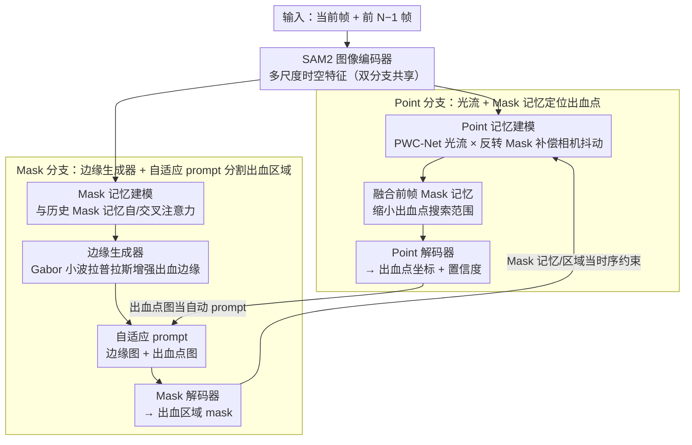

# Synergistic Bleeding Region and Point Detection in Laparoscopic Surgical Videos

**会议**: CVPR 2026  
**arXiv**: [2503.22174](https://arxiv.org/abs/2503.22174)  
**代码**: [GitHub](https://github.com/PJLallen/SurgBlood)  
**领域**: 医学图像  
**关键词**: 出血检测, 腹腔镜手术, SAM2, 双任务协同, 光流

## 一句话总结

构建首个腹腔镜手术出血区域+出血点标注数据集 SurgBlood，并提出基于 SAM2 的双分支双向引导在线检测器 BlooDet，通过 Mask/Point 分支协同优化实现出血区域分割与出血点定位的联合检测。

## 研究背景与动机

腹腔镜微创手术中，术中出血是严重影响手术安全的紧急情况：
- **出血区域检测**可量化失血量，辅助术中决策
- **出血点定位**帮助外科医生快速找到出血源实施止血

现有方法的局限：
1. 大多数算法只针对单帧图像，缺乏视频时序建模
2. 主要关注出血区域，未解决出血源定位的临床需求
3. 多任务框架未充分利用 SAM2 在跨任务联合优化中的潜力

**缺乏公开的多任务真实出血数据集**

挑战：腹腔镜窄视野、不稳定光照、快速血液积聚改变组织外观、出血点被血液或组织遮盖。

## 方法详解

### 整体框架

BlooDet 采用基于 SAM2 的**双分支双向引导**架构，包含 Mask 分支（出血区域检测）和 Point 分支（出血点定位）。两分支通过互相提供 prompt 和时序信息实现协同优化。核心目标函数为耦合优化：

$$\{\boldsymbol{\theta}^*, \boldsymbol{\vartheta}^*\} = \arg\min_{\boldsymbol{\theta}, \boldsymbol{\vartheta}} \Big[\mathcal{L}_{\mathtt{m}}\big(\boldsymbol{\theta}(\boldsymbol{\vartheta})\big) + \mathcal{L}_{\mathtt{p}}\big(\boldsymbol{\vartheta}(\boldsymbol{\theta})\big)\Big]$$

通过交替优化策略求解：先固定 Point 分支更新 Mask 分支参数，再固定更新后的 Mask 分支更新 Point 分支。整条流水线为：SAM2 图像编码器（双分支共享）提取多尺度时空特征 → 分别送入 Point 分支与 Mask 分支 → 两分支用对方的输出互为 prompt / 时序约束（双向引导）→ 输出出血点坐标与出血区域 mask。

### 关键设计

**1. Point 分支：用光流 + Mask 记忆把出血点从相机抖动里捞出来**

腹腔镜视野窄、相机一直在动，出血点又常被血液或组织盖住，纯靠单帧很难稳定定位。Point 分支用冻结的 PWC-Net 估帧间光流 $O_i(x,y)$，再用反转的 Mask 地图把出血区域那些不稳定的光流滤掉，算出背景的平均视点偏移：

$$\bar{O}_i(\Delta x, \Delta y) = \frac{1}{H \times W} \sum_{X=1}^{H} \sum_{Y=1}^{W} (1-M_i) \cdot O_i(x,y)$$

这一步的妙处是只用**背景**区域的光流来补偿相机运动（出血区光流本身就乱，排除掉反而更准）。补偿后再把前帧的 Mask 记忆特征和 Point 特征融合，经自注意力和交叉注意力生成记忆增强的 Point 特征，等于用 Mask 记忆把出血点的搜索范围提前缩小。

**2. Mask 分支：边缘生成器 + 自适应 prompt 替代人工交互**

手术场景对比度低，出血和周围组织的边界经常糊成一片。Mask 分支用多尺度 Gabor 小波拉普拉斯滤波器专门增强出血边缘：

$$F'_{\text{mask}} = (\text{ReLU}(F_{\text{mask}})) \odot (\mathbf{L}_\mathbf{g}(x,y) * F_{\text{mask}})$$

随后把边缘图 $E_m$ 和 Point 分支给出的出血点图 $P_m$ 拼成自适应 prompt 喂进 Mask 解码器，直接替掉 SAM2 原本需要人手点的交互式 prompt——在线手术场景里没人能实时点框，自动 prompt 是落地的前提。

**3. 双向跨分支引导：让两条分支互为约束**

前两个设计已经各自借用了对方一次，这里把它显式化为闭环：Point 分支的预测出血点当 Mask 解码器的自动 prompt，把注意力聚到目标区域；Mask 分支的预测 Mask 又给 Point 分支提供时序方向线索和空间约束。两边互相收窄对方的解空间，比纯区域检测硬加一个点预测头要稳得多（消融里后者明显更差）。

### 损失函数 / 训练策略

- **Mask 分支**：$\mathcal{L}_\mathtt{m} = \lambda_\mathtt{r} \mathcal{L}_\mathtt{r} + \lambda_\mathtt{e} \mathcal{L}_\mathtt{e}$，区域损失和边缘损失均为 Focal Loss + Dice Loss
- **Point 分支**：$\mathcal{L}_\mathtt{p} = \lambda_\mathcal{P} \mathcal{L}_\mathcal{P} + \lambda_\mathtt{s} \mathcal{L}_\mathtt{s}$，使用 Smooth L1 Loss 做点监督 + BCE 做存在性判断
- 损失权重：$\lambda_\mathtt{r}=1, \lambda_\mathtt{e}=1, \lambda_\mathtt{s}=1, \lambda_\mathcal{P}=0.5$
- 交替优化策略：每次迭代先更新 Mask 分支再更新 Point 分支

**SurgBlood 数据集**：42 例胆囊切除术中 95 个视频片段，共 5,330 帧，分辨率 1280×720，由肝胆外科医生标注出血区域像素级 mask 和出血点坐标。4 种出血类型：胆囊(21.64%)、胆囊三角(25.01%)、血管(15.78%)、胆囊床(37.75%)。

## 实验关键数据

### 主实验

| 方法 | SurgBlood IoU ↑ | SurgBlood Dice ↑ | PCK-5% ↑ | PCK-10% ↑ |
|------|----------------|-----------------|----------|-----------|
| SAM 2† | 50.93 | 67.49 | 41.68 | 71.99 |
| MemSAM† | 52.84 | 69.14 | 31.80 | 64.91 |
| D-CeLR* | 51.30 | 67.82 | 24.22 | 63.92 |
| ConsisTNet | 40.43 | 57.59 | 32.83 | 68.15 |
| **BlooDet (Ours)** | **64.88** | **78.70** | **55.85** | **83.69** |

BlooDet 在 SurgBlood 上超越 13 个对比方法，IoU 提升 12.05%（vs SAM2），PCK-10% 提升 11.70%。在 HemoSet 数据集上也取得最佳区域检测性能（IoU 59.62, Dice 74.70）。

### 消融实验

| 配置 | SurgBlood DSC ↑ | CAVSA 注 | 说明 |
|------|----------------|----------|------|
| 仅 Mask + Point（无边缘生成器，无时序一致性） | ~67.49 | — | 基础 SAM2 双任务 |
| + 边缘生成器 + 跨分支引导 | 78.70 | — | 完整 BlooDet |

（注：论文在 XCAV/CAVSA 数据集上也做了消融，完整模型 DSC 84.39%，去掉时序一致性降至 76.24%，去掉置信度正则化降至 76.71%。）

### 关键发现

- 纯区域检测方法加额外点预测头后性能较差，说明需专门的协同设计
- 光流+Mask 记忆对出血点追踪至关重要，解决了相机运动导致的偏移
- 边缘生成器有效缓解手术场景低对比度下的出血边界模糊问题
- 交替优化策略使两分支达到联合最优

## 亮点与洞察

- **首创任务**：首次提出腹腔镜手术出血区域+出血点联合检测任务
- **SurgBlood 数据集**：首个提供出血区域和出血点双标注的真实手术视频数据集
- 双分支双向引导设计优雅——Mask 为 Point 提供空间约束，Point 为 Mask 提供精确 prompt
- 巧妙利用背景光流（排除出血区域）补偿相机运动偏移

## 局限与展望

- 数据集规模偏小（95 个片段），泛化性有待验证
- 仅在胆囊切除术上验证，需扩展到更多手术类型
- Point 分支依赖冻结的 PWC-Net 光流，在极端出血模糊场景性能可能退化
- 未考虑多出血点场景和出血强度量化

## 相关工作与启发

- 在 SAM2 基础上构建多任务框架的思路值得关注——通过 prompt 机制串联不同任务
- 光流用于关键点追踪中相机运动补偿的策略可推广到其他手术视觉任务
- 数据集构建的交叉验证标注策略（4人标注+2人审核）确保了标注质量

## 评分

- 新颖性: ⭐⭐⭐⭐⭐ — 首创任务定义 + 首个数据集 + 新颖双分支架构
- 实验充分度: ⭐⭐⭐⭐ — 13 个对比方法 + 多数据集验证 + 完整消融
- 写作质量: ⭐⭐⭐⭐ — 结构清晰，方法表述完整
- 价值: ⭐⭐⭐⭐⭐ — 有很强的临床实用价值和数据集贡献

<!-- RELATED:START -->

## 相关论文

- [\[CVPR 2026\] SurgCoT: Advancing Spatiotemporal Reasoning in Surgical Videos through a Chain-of-Thought Benchmark](surgcot_advancing_spatiotemporal_reasoning_in_surgical_videos_through_a_chain-of.md)
- [\[AAAI 2026\] Rethinking Surgical Smoke: A Smoke-Type-Aware Laparoscopic Video Desmoking Method and Dataset](../../AAAI2026/medical_imaging/rethinking_surgical_smoke_a_smoke-type-aware_laparoscopic_video_desmoking_method.md)
- [\[CVPR 2026\] URICA: A Uniformity Region Affine Identifier Capture Algorithm for Arbitrary Region Retrieval in Pathology Images](urica_a_uniformity_region_affine_identifier_capture_algorithm_for_arbitrary_regi.md)
- [\[AAAI 2026\] Bridging Vision and Language for Robust Context-Aware Surgical Point Tracking: The VL-SurgPT Dataset and Benchmark](../../AAAI2026/medical_imaging/bridging_vision_and_language_for_robust_context-aware_surgical_point_tracking_th.md)
- [\[CVPR 2026\] Decoding 3D Perception via BrainSSD: Synergistic Fusion of EEG Representations from Static and Dynamic Visual Streams](decoding_3d_perception_via_brainssd_synergistic_fusion_of_eeg_representations_fr.md)

<!-- RELATED:END -->
