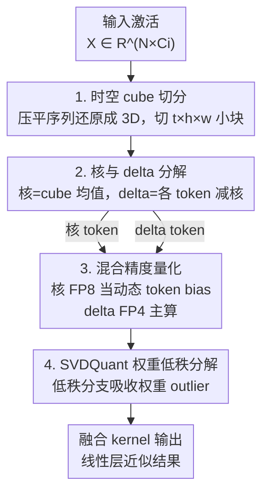

# DeltaQuant: 4-bit Video Diffusion Models with Spatiotemporal Delta Smoothing

**会议**: CVPR 2026  
**论文**: [CVF Open Access](https://openaccess.thecvf.com/content/CVPR2026/html/Li_DeltaQuant_4-bit_Video_Diffusion_Models_with_Spatiotemporal_Delta_Smoothing_CVPR_2026_paper.html)  
**代码**: 待确认（基于 Nunchaku/SVDQuant 引擎实现自定义 CUDA kernel）  
**领域**: 模型压缩 / 视频扩散量化  
**关键词**: W4A4 量化、视频扩散、时空冗余、delta token、混合精度

## 一句话总结
DeltaQuant 利用视频相邻 token 在时空上高度相似这一特性，把激活按 3D 时空 cube 切块，每个 cube 只保留一个高精度（FP8）均值「核 token」、把各 token 相对核的「差值（delta token）」量化到 4 bit，从而在几乎不损画质的前提下，把视频扩散模型 Wan2.2 做到 W4A4 量化，显存降 2.3×、模型体积降 2.9×，叠加高效注意力与少步蒸馏后端到端加速 111.8×。

## 研究背景与动机
**领域现状**：以 Wan2.2（27B 参数双 Transformer）、LTX-Video 为代表的视频扩散模型画质惊人，但算力与显存开销巨大——在 RTX 5090 上生成一段 720p、5 秒视频要超过 75 分钟，消费级显卡几乎跑不动。学界主要从**高效注意力**（稀疏注意力、低比特注意力、线性注意力）入手加速。

**现有痛点**：注意力一旦被优化掉，瓶颈就**转移到线性层**。论文 Figure 3 给出的数据很关键：原本 self-attention 占 Wan2.2 总计算的 81%，稀疏/低比特注意力把注意力压到约 8.6× 之后，线性层反而成了 65% 的主开销。而且注意力优化**不省显存**——大模型仍要靠 CPU offload 才能塞进显卡，带来额外开销。要同时解决「线性层算力」和「显存」，唯一对路的工具是**对权重和激活都做 4-bit 量化（W4A4）**。

**核心矛盾**：图像扩散上的 SOTA 量化方法 SVDQuant 用 SVD 把权重拆成「高精度低秩分支（吸收 outlier）+ 4-bit 残差」，对激活则依赖**离线标定的静态 per-channel smoothing**。但视频扩散的激活是**高度动态**的：outlier 通道和幅值随去噪 timestep 剧烈变化（Figure 4）。一个为 step 0 标定好的 smoothing 因子，搬到 step 20 反而会把 outlier 放大、画质崩坏。理论上可以做 on-the-fly SVD 动态吸收 outlier，但推理时在线 SVD 代价高得无法接受。

**本文目标**：找一个**低成本、且能动态缓解激活 outlier** 的替代方案，让视频扩散模型也能吃上 4-bit 权重激活量化。

**切入角度**：作者的关键观察是——视频数据天然具有**时空激活相似性（spatiotemporal activation similarity）**：时间上相邻帧只有微小差异，空间上邻近 token 特征相近，这正是 H.264 等视频编解码器靠「编码帧间/帧内差值而非原始像素」实现高压缩比的原理。论文发现这种冗余**延续到了扩散模型的激活里**（Figure 5）。

**核心 idea**：不要直接量化原始激活，而是量化**时空相邻 token 之间的差值**。把激活按局部 3D cube 分块，每块用一个均值「核 token」当公共基准（高精度保留 outlier），只把幅值小、outlier 少的「delta token」压到 4-bit——用类视频编码的差分思想，把量化难度大幅降下来。

## 方法详解

### 整体框架
DeltaQuant 是一个 W4A4 后训练量化方案，作用于视频扩散 Transformer 的线性层。输入是某线性层的激活张量 $X \in \mathbb{R}^{N \times C_i}$（$N = T \times H \times W$ 为 token 数，$C_i$ 为输入通道），输出是量化后近似等价的线性层结果。整条流程是：先把被压平成 1D 序列的激活**还原回 3D 时空结构并切成不重叠的小 cube**；对每个 cube 求**均值核 token**并算出**delta token**；再做**混合精度量化**——核 token 走 FP8、delta token 走 FP4，二者各自与量化后的权重相乘再相加；权重侧叠加 SVDQuant 的低秩分解进一步降误差；最后由融合 CUDA kernel 把算法收益落成真实加速。

### 关键设计

**1. 时空激活相似性：把视频编码的差分思想搬进量化**

这是全文的立论根基，直接针对「激活 outlier 随 timestep 剧烈变化、静态 smoothing 失效」的痛点。论文从两个维度验证激活冗余（Figure 5）：**时间相关性**上，Wan2.2 的激活在连续帧间呈现清晰的周期性分布（同一空间位置的 token 跨帧分布相似），计算时间均值 $\bar{X}$ 后看残差 $\tilde{X} = X - \bar{X}$，幅值和 outlier 都大幅缩小；**空间相关性**上，一帧内 $2\times 2$ 邻域 token 分布相近，求空间均值核后残差同样变得紧凑、outlier 更少。关键在于：outlier 是「动态」的（随 step 变），但**相邻 token 之间的相似性是「结构性」的**——无论 outlier 怎么跳，邻近 token 总是一起跳，所以做差能稳定地把 outlier 抵消掉。这把一个难缠的动态问题，转化成了在线即可解决的局部差分问题，无需任何离线标定。

**2. 时空 cube 切分：先把结构还原回来，才能找到「相邻」token**

视频扩散模型通常把时空结构压平成长度 $N$ 的 1D 序列，这会打乱空间和时间上的邻近关系，使得「哪些 token 该归一组算核」无从判断。DeltaQuant 先把 $X$ 从 $\mathbb{R}^{N \times C_i}$ reshape 回 $\mathbb{R}^{T \times H \times W \times C_i}$，再切成 $K = N/(thw)$ 个**不重叠的时空 cube**，每个 cube 大小为 $t \times h \times w \times C_i$，第 $k$ 个 cube 记为 $X^{(k)} \in \mathbb{R}^{thw \times C_i}$。cube 必须「局部小」是有原因的：消融显示 cube 越大、聚到一起的 token 时空相似度越低，越无法提取出有意义的共享结构——极端情况下用一个全局核覆盖所有 token（类似 Sage Attention 的全局平均），PSNR 会大幅崩掉。因此 DeltaQuant 吃的是**紧凑 cube 内的局部相关性**，而非全局聚合。

**3. 核与 delta 分解：一个高精度均值 + 一堆小残差**

对每个 cube $X^{(k)}$，取所有 token 的均值作为共享核 token $\bar{X}^{(k)} \in \mathbb{R}^{1 \times C_i}$，再算出各 token 相对核的 delta token：

$$\bar{X}^{(k)} = \frac{1}{thw}\sum_{n=1}^{thw} X^{(k)}_n, \qquad \tilde{X}^{(k)} = X^{(k)} - \bar{X}^{(k)}$$

其中 $\bar{X}^{(k)}$ 广播后与 $X^{(k)}$ 相减。核 token 把整个 cube 的大幅值与 outlier 都「吸」走，留下的 delta token 尺度小、方差低、outlier 少——这正是量化最友好的形态。这步类比视频编码里「I 帧（核）+ 残差」的思路，但作用在激活张量上、且是逐 cube 在线完成的。

**4. 混合精度量化：核走 FP8 当动态 token bias，delta 走 FP4 主算**

承接分解，delta token 既然容易量化就压到 4-bit，核 token 因为保留了 outlier 必须更高精度，量化到 FP8。线性层输出按下式拆开计算：

$$X^{(k)}W = (\bar{X}^{(k)} + \tilde{X}^{(k)})W \approx \underbrace{Q_8(\bar{X}^{(k)})Q_4(W)}_{\text{FP8 tensorcore}} + \underbrace{Q_4(\tilde{X}^{(k)})Q_4(W)}_{\text{FP4 tensorcore}}$$

其中 $Q_8(\bar{X}^{(k)})Q_4(W)$ 在 FP8 tensorcore 上算，充当一个**动态 token bias**，被广播到 cube 内全部 $thw$ 个 token；其余在 FP4 tensorcore 上算。因为同一 cube 共享一个核，这一项额外开销极小（cube size 64 时仅 +3.2%），却显著提升了精度。权重侧还可叠加 SVDQuant：把 $W$ 分解成低秩因子 $L_1 L_2$ 和残差 $R = W - L_1 L_2$，整层输出近似为：

$$X^{(k)}W \approx \underbrace{X^{(k)}L_1 L_2}_{\text{低秩}} + \underbrace{Q_8(\bar{X}^{(k)})Q_4(R)}_{\text{单 token}} + \underbrace{Q_4(\tilde{X}^{(k)})Q_4(R)}_{\text{低比特}}$$

激活侧的 delta 分解和权重侧的低秩分解互补：前者治激活的动态 outlier，后者治权重的静态 outlier。其中量化定义为 $Q(X) = \text{round}(X/s_X)\cdot s_X$，$s_X = \max(|X|)/q_{\max}$（4-bit 浮点时 $q_{\max}=6$）。

### 损失函数 / 训练策略
DeltaQuant 是后训练量化（PTQ），无需重训权重，只需轻量标定。实现上基于 SVDQuant 的 Nunchaku 引擎写了自定义 CUDA kernel：把核 token 生成融进激活量化 kernel，为核 token 做了定制 W4A8 GEMM，并把部分和累加集成进 delta token 的 W4A4 GEMM。超参上采用**timestep-aware 的 cube size 分配**——去噪前 25–30%（噪声大、对画质最关键）用小 tile size 16（$t{=}4,h{=}1,w{=}4$），其余 steps 用 tile size 64（$t{=}4,h{=}2,w{=}8$）；SVDQuant 低秩 rank 在 Wan2.2 设 128、LTX-Video 设 64；除 cross-attention 的 K/V 投影层（只作用于文本 token、开销可忽略，量化到 6-bit）外，其余线性层全部量化到 NVFP4；核 token 做 group size 64 的 per-group FP8 量化。

## 实验关键数据

### 主实验
在 Wan2.2 I2V/T2V（27B）与 LTX-Video T2V（13B）上评测，质量指标用 Vision Reward 和 VBench 的 S.C./A.Q./I.Q.，相似度指标用 LPIPS/PSNR/SSIM。下表节选 Wan2.2-I2V 与 LTX-Video 的关键对比（↓越低越好，↑越高越好）：

| 模型 | 精度/方法 | LPIPS↓ | PSNR↑ | SSIM↑ | Vision Reward↑ |
|------|-----------|--------|-------|-------|----------------|
| Wan2.2-I2V | BF16 原版 | – | – | – | 0.145 |
| Wan2.2-I2V | W4A4 RTN | 0.182 | 20.7 | 0.660 | 0.132 |
| Wan2.2-I2V | W4A4 SVDQuant | 0.165 | 21.9 | 0.686 | 0.146 |
| Wan2.2-I2V | W4A16 GGUF 4 | 0.137 | 23.2 | 0.755 | 0.141 |
| Wan2.2-I2V | **W4A4 Ours** | **0.128** | **23.2** | 0.742 | 0.143 |
| LTX-Video | BF16 原版 | – | – | – | 0.139 |
| LTX-Video | W4A4 SVDQuant | 0.193 | 20.1 | 0.714 | 0.130 |
| LTX-Video | W4A16 GGUF 4 | 0.169 | 20.9 | 0.735 | 0.141 |
| LTX-Video | **W4A4 Ours** | **0.159** | **21.6** | **0.751** | 0.135 |

要点：在同等标定时间下，DeltaQuant 的 W4A4 在相似度和质量指标上**一致超过其他 W4A4/W4A6 baseline**（SVDQuant、SmoothQuant、S2Q-VDiT、Q-VDiT），并能**匹配甚至局部超过**显存更大的 W4A16（GGUF 4）和 BF16——同时它是真正 4-bit 激活、算得更快。

效率方面（Wan2.2，叠加 Radial&Sage Attention，RTX 5090）：

| 指标 | BF16 | GGUF 4 (W4A16) | DeltaQuant (W4A4) |
|------|------|----------------|--------------------|
| 模型体积 | 1.0× | ~3.5×↓ | **2.9×↓** |
| DiT 推理显存 | 61.3 GiB | 26.6 GiB | **26.8 GiB（2.3×↓）** |
| 720p 单步延迟加速 | 1.0× | 2.7× | **4.6×** |
| 480p 单步延迟加速 | 1.0× | 3.7× | **7.2×** |

叠加各类加速技术后的端到端表现（Wan2.2-I2V，Vision Reward↑）：

| 配置 | Vision Reward↑ | 延迟(s) | 加速 |
|------|----------------|---------|------|
| 原版 | 0.145 | 4818 | 1.0× |
| +LightX2V | 0.144 | 196.8 | 24.5× |
| +Radial&Sage | 0.145 | 131.0 | 36.8× |
| **+DeltaQuant** | **0.148** | **43.1** | **111.8×** |

DeltaQuant 与高效注意力（Radial Attention）、量化注意力（Sage Attention2++）、少步 LoRA（LightX2V）**完全兼容**，在 36.8× 基础上再叠 3.0×，端到端 111.8× 且画质不降反升。

### 消融实验

| 配置 | 关键指标 | 说明 |
|------|---------|------|
| Cube size 16/32/64/全局 | PSNR 23.2 → 22.8 → 22.3 → 21.6 | cube 越大相似度越低，全局核 PSNR 大幅崩；证明吃的是局部相关性 |
| 核 token 精度 16/8/4 bit | PSNR 22.8 / 23.2 / 21.9 | FP8 反而比 BF16 PSNR 更高，且 FP8 tensorcore 吞吐 4×；NVFP4 核掉 1.3 PSNR |
| Uniform cube 32 vs Timestep-aware | PSNR +0.5 | 高噪声 step 分配小 cube 画质更好 |
| Rank：DeltaQuant vs SVDQuant | LPIPS–延迟曲线严格更低 | 跨不同算力预算 DeltaQuant 始终优于单纯加大 SVDQuant rank |

### 关键发现
- **cube 大小是核心超参且越小越好（在合理范围内）**：cube size 从 16 增到 64、再到全局，PSNR 单调下降——DeltaQuant 的收益完全来自**紧凑 cube 内的局部时空相关性**，全局平均会失去共享结构。
- **核 token 选 FP8 而非 BF16/FP4 是甜点**：FP8 量化核 token 的 PSNR（23.2）竟高于 BF16（22.8），同时享受 FP8 tensorcore 4× 吞吐；而把核压到 NVFP4 会掉 1.3 PSNR，说明核必须保留 outlier 的精度。
- **timestep-aware cube 分配有效**：去噪早期（高噪声、对画质最关键）用小 cube、后期用大 cube，amortized cube size 33 时比统一 32 的 PSNR 高 0.5，说明把「画质预算」花在高噪声 step 上更划算。
- **delta 分解优于堆 rank**：SVDQuant rank 加太大反而在给定标定时间内不收敛、精度下降；DeltaQuant 把劲使在激活侧，效率–精度曲线全面占优。

## 亮点与洞察
- **把视频编解码的「帧间差分」迁移到量化**：H.264 编码帧间差值而非原始像素，DeltaQuant 编码 token 间差值而非原始激活——一个老到的工程直觉，被精准嫁接到了一个全新场景，且给出了「outlier 动态但相邻 token 一起动」的机理解释，立得住。
- **用「在线局部差分」替代「在线 SVD」**：动态 outlier 的正解本是 on-the-fly SVD，但太贵；DeltaQuant 用一次 cube 内求均值就近似实现了「动态吸收 outlier」，开销仅 +3.2%，这是把一个昂贵问题降维成廉价问题的漂亮一手。
- **核 token 当「动态 token bias」的工程视角**：$Q_8(\bar X)Q_4(W)$ 被广播到整个 cube，本质是一个随输入变化的偏置项，既复用了 FP8 tensorcore 又只算一次，算法收益能真实落到硬件——配套自写 kernel 让 111.8× 不是纸面数字。
- **可迁移性**：「局部块内做差、只量化残差、核保高精度」的思路，理论上可推广到任何具有时空/局部冗余的张量量化场景（如视频/点云的其他网络层），值得借鉴。

## 局限与展望
- **依赖时空冗余假设**：方法红利完全建立在「相邻 token 相似」上，对时空相关性弱、运动剧烈或纹理高频的内容，delta token 未必小，收益可能打折——论文未系统评测这类困难场景。⚠️ 以原文为准。
- **超参需手工调**：cube size、timestep 切分比例（25–30% / 70%）、各层精度（K/V 投影 6-bit、低秩 rank 128/64）等都是人工设定，跨模型迁移时可能要重新调。
- **工程绑定较深**：依赖 Nunchaku/SVDQuant 引擎与定制 CUDA kernel、NVFP4/FP8 tensorcore（NVIDIA 5090），加速数字对硬件较敏感，换架构需重写 kernel。
- **社会影响**：作者自承——让视频扩散在消费级硬件上普及，也可能助长误导性内容的生成。
- **可改进方向**：把 cube size 和 timestep 分配做成**自适应学习**（按内容/噪声水平在线决定），而非固定策略，或许能在困难场景下进一步提质。

## 相关工作与启发
- **vs SVDQuant**：SVDQuant 在图像扩散上做 W4A4，靠 SVD 低秩分支吸收**权重** outlier，但激活用**离线静态 smoothing**，在 timestep 间动态变化的视频激活上失效。DeltaQuant 保留其权重低秩分解，但激活改用**在线时空 delta 分解**动态吸 outlier，二者互补——这是从图像到视频量化的关键补丁。
- **vs SmoothQuant**：SmoothQuant 用等价的 per-channel 变换在激活和权重间转移量化难度，仍是静态标定，面对视频动态 outlier 力不从心；DeltaQuant 是逐 cube 在线分解，天然动态。
- **vs GGUF 4（W4A16 weight-only）**：GGUF 4 压模型 3.5× 但**只压权重、不加速计算**（激活仍 16-bit），无法加速算力受限的扩散模型；DeltaQuant 在匹配其画质的同时，靠真 4-bit 激活带来 1.9×（720p）/3.6×（480p）的额外提速。
- **vs S2Q-VDiT / Q-VDiT**：这两者从标定数据选择、token-aware 估计与时序蒸馏角度改进视频扩散量化，但在本文评测中相似度/质量均不及 DeltaQuant（如 S2Q-VDiT 在 Wan2.2-I2V 上 LPIPS 0.366、PSNR 15.6，明显偏弱）。

## 评分
- 新颖性: ⭐⭐⭐⭐⭐ 把视频编码的时空差分思想原创性地迁移到激活量化，机理清晰、切口刁钻。
- 实验充分度: ⭐⭐⭐⭐⭐ 三模型 × 多 baseline × 完整消融（cube size/核精度/rank/timestep 分配）+ 真实硬件延迟显存，证据链扎实。
- 写作质量: ⭐⭐⭐⭐ 动机推导（注意力→线性层瓶颈转移、静态 smoothing 失效）讲得很顺，图表信息密度高。
- 价值: ⭐⭐⭐⭐⭐ 让 27B 视频扩散在单张 5090 上 43s 出 720p、端到端 111.8× 加速，落地价值极高。

<!-- RELATED:START -->

## 相关论文

- [\[CVPR 2026\] BinaryAttention: One-Bit QK-Attention for Vision and Diffusion Transformers](binaryattention_one-bit_qk-attention_for_vision_and_diffusion_transformers.md)
- [\[CVPR 2026\] Sampling-Aware Quantization for Diffusion Models](sampling-aware_quantization_for_diffusion_models.md)
- [\[CVPR 2026\] InstantViR: Real-Time Video Inverse Problem Solver with Distilled Diffusion Prior](instantvir_real-time_video_inverse_problem_solver_with_distilled_diffusion_prior.md)
- [\[CVPR 2026\] DMGD: Train-Free Dataset Distillation with Semantic-Distribution Matching in Diffusion Models](dmgd_train-free_dataset_distillation_with_semantic-distribution_matching_in_diff.md)
- [\[CVPR 2026\] PyramidalWan: On Making Pretrained Video Model Pyramidal for Efficient Inference](pyramidalwan_on_making_pretrained_video_model_pyramidal_for_efficient_inference.md)

<!-- RELATED:END -->
