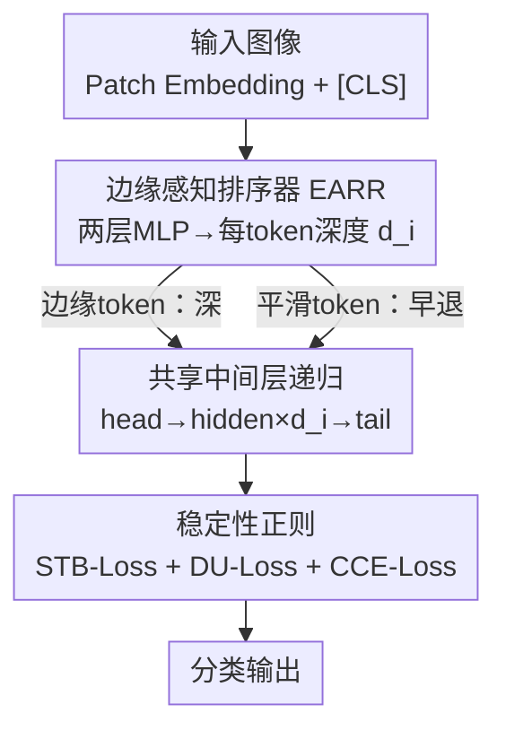

# Edge-RecViT: Efficient Vision Transformer via Semantic-Refined Dynamic Recursion

**会议**: CVPR 2026  
**论文**: [CVF Open Access](https://openaccess.thecvf.com/content/CVPR2026/html/Li_Edge-RecViT_Efficient_Vision_Transformer_via_Semantic-Refined_Dynamic_Recursion_CVPR_2026_paper.html)  
**代码**: https://github.com/RicardoLee510520/Edge-RecViT  
**领域**: 模型压缩  
**关键词**: 高效ViT, 动态深度, 参数共享, 递归Transformer, token自适应  

## 一句话总结
Edge-RecViT 用一个 token 级的「边缘感知排序器」给每个 patch 打分，让结构信息丰富的边缘 token 进入更深的递归计算、平滑的前景内部 token 早退，同时把 ViT 的隐藏层折叠成一个**全共享的递归块**（head + 共享中间层 ×10 + tail），从而在 ImageNet-1K 上以 DeiT-Base 约 27% 的参数（86M→23.2M）和约 69% 的 FLOPs（35.2G→24.39G）达到持平甚至略高的精度。

## 研究背景与动机
**领域现状**：ViT 表现强但部署贵，主流的提效手段是 token 自适应（token-adaptive）方法——在层之间插入轻量过滤/预测模块，给每个 token 决定要不要继续往下走，从而把算力集中到「重要」区域。DynamicViT 用预测模块逐层剪枝冗余 token，A-ViT 复用各层参数加一个 halting 模块，ATS 在自注意力里做自适应采样，EViT 在 MHSA 和 FFN 之间挑关键 token。

**现有痛点**：作者观察到一个反直觉的现象——这些方法把**最深的计算分给了前景中心**的 token，而前景中心往往是颜色单一、语义稀薄的纯色区域；真正富含结构线索的**边缘 token 反而被早退**了。根因是 Transformer 的全局依赖：前景纯色区在自注意力下会形成高相似度的紧凑簇、互相强化，而边缘 token 没有相似邻居、得不到强化，于是 early-exit 一插进来边缘就先走了，它们丰富的结构/语义信息被浪费。这带来两个损失：① 在低信息 token 上白白烧 FLOPs；② 真正决定物体轮廓的语义区被弱化。

**核心矛盾**：token 自适应只省了「逐 token 的计算」，却没动**参数规模**——大量深层权重因为多数 token 早退而几乎用不上，整体参数量不变，部署收益有限。参数共享本可解决这种过参数化，但在 ViT 里很难用：ViT 各层本应做从局部边缘到全局语义的逐层抽象，强行全层共享会丢掉层级差异、导致**表征坍缩**（representational collapse）。

**本文目标**：① 让计算深度跟着「语义复杂度」走、对齐人类靠边缘识别物体的感知；② 在 ViT 里真正落地全参数共享而不坍缩。

**切入角度 / 核心 idea**：把两件事耦合起来——用一个**前置排序器**给每个 token 分配不同的递归深度，这种「token 级的路径异质性」恰好替代了固定多层提供的功能多样性，从而让**全共享的递归 Transformer** 在 ViT 里变得可行。一句话：用「边缘感知的动态深度」给「全参数共享」造出差异化，鱼和熊掌兼得。

## 方法详解

### 整体框架
输入图像先做标准 patch embedding 得到 token 序列 $X \in \mathbb{R}^{(N+1)\times C}$（含一个 [CLS]）。序列先过 **EARR**（边缘感知排序器）：它给每个 token 预测一个深度分布，取 argmax 得到该 token 要在递归块里被处理几次的深度 $d_i \in \{1,\dots,L\}$（$L=12$）。然后进入**递归 Transformer 块**，它只有三组可训练参数：head 层、一个被反复复用的共享 hidden 层、tail 层。所有 token 先过 head 拿到初始表示，再按各自的 $d_i$ 在共享 hidden 层里迭代最多 10 次——边缘 token 多迭代、平滑 token 少迭代；走到最深（$d_i=12$）的 token 进 tail 层做高层聚合。[CLS] 不参与排序、强制走满全部 $L$ 层，保证图像级表示稳定。整套设计的关键不是「排序」或「共享」单独成立，而是二者协同：EARR 给每个 token 不同的递归路径，把异质性注入到本来同质的共享网络里，从而让全参数共享不再导致坍缩。

### 关键设计

**1. 边缘感知排序器 EARR：把深度分给结构丰富的边缘而非平滑前景**

这是针对「深度被错配给语义稀薄的前景中心」这个痛点的直接回应。EARR 是一个放在 Transformer **之前**的轻量两层 MLP：$H^{(1)} = \mathrm{GELU}(W_1 X')$，$Z = W_2 H^{(1)}$，其中 $W_1 \in \mathbb{R}^{2C\times C}$、$W_2 \in \mathbb{R}^{L\times 2C}$（都不带 bias，隐藏维取 $2C$），输出每个 token 在 $L$ 个深度上的 logits。对 token $i$，softmax 成概率分布 $p_i = \mathrm{softmax}(z_i)$，取最大概率的下标作为计算深度 $d_i = \arg\max_{l} p_{i,l}$；这个最大概率本身被当作**置信度** $c_i$，表示模型有多确定该 token 在这个深度上已积累足够语义。因为排序是前置的、且置信度可微，整条路径能端到端训练。它有效的原因在于：边缘 token 在自注意力里缺少相似邻居、得不到强化，固有的 early-exit 会把它们先踢出去；而 EARR 直接显式地按「语义复杂度」分深度，把算力导向边缘/轮廓这些真正决定物体形状的区域，正好对齐人类靠边缘识别物体边界的视觉直觉。

**2. 全共享递归 Transformer：head–共享中间层–tail 三组参数撑起多层表达**

针对「token 自适应不减参数、深层权重浪费」的痛点。递归块只保留三组参数 $\theta_h, \theta_r, \theta_t$，每个 token 的前向是

$$
y_i^l = \begin{cases} f(x_i, \theta_h), & l=1,\\ f(y_i^{l-1}, \theta_r), & 1<l\le 11,\\ f(y_i^{10}, \theta_t), & l=L, \end{cases}
$$

即 head 起步、中间那一个共享 hidden 层被反复套用、tail 收尾，计算在各自的 $d_i$ 处终止。这样参数量被压到约基线的 $3/L$（12 层只留 3 组），Base 级从 86M 降到 23.2M。它之所以能成立而不坍缩，是因为设计 1 给了每个 token 不同的迭代次数：全共享在「所有 token 走相同变换」时才会坍缩，而 EARR 制造的 token 级路径异质性恢复了固定多层本来提供的功能多样性——递归不再等于均一，语义自适应负责差异、参数共享负责效率。消融也印证：只共享**中间层**（head/tail 独立）最好（82.0%），既缓解了深层 Transformer 的过平滑/token 间相似度上漂，又把参数压住；而「全层共享到底」会塌到 68.9%。

**3. 三项稳定性正则：让动态深度决策既不全顶满也不全早退**

排序器要端到端学，但裸训会失稳，作者用三个损失把它稳住，总目标 $L_{total} = L_{CCE} + \lambda_{stb} L_{stb} + \lambda_{du} L_{du}$。
- **STB-Loss（防 logit 失稳）**：惩罚深度 logits 的 log-sum-exp 平方，$L_{stb} = \frac{1}{N}\sum_i \big(\log\sum_l \exp(z_{i,l})\big)^2$，约束 logits 的整体尺度，避免 EARR 产生过大或尖峰式 logits，让深度分布更平滑可标定。去掉它，EARR 会把几乎所有 token 都顶到 12 层、动态分配失效（精度塌到 69.2%）。
- **DU-Loss（防排序器坍缩）**：用一个自门控正则对齐「期望深度占比」与「实际深度占比」，$L_{du} = L\sum_l E_l A_l$，其中 $E_l = \frac{1}{N}\sum_i p_{i,l}$ 是到达深度 $l$ 的期望比例、$A_l = \frac{1}{N}\sum_i \mathbb{1}(d_i=l)$ 是实际比例；该值趋近 1 表示期望与实际分布对齐、token 在各深度上均匀退出。去掉它，token 会全挤到很浅的 2–3 层、坍缩（精度 61.1%）。
- **CCE-Loss（置信度调制的端到端梯度桥）**：把分类输出按平均置信度 $\bar c = \frac{1}{N}\sum_i c_i$ 缩放，$Y_C = \bar c \cdot Y$，再算 $L_{CCE} = \mathrm{CE}(Y_C, \hat y)$。高置信的深度决策保留 logit 幅度、损失低；不确定的决策压低 $\bar c$、产生更弱 logit 和更高损失——这把 EARR 的深度决策和分类正确性直接挂钩，是排序器拿到梯度的关键通道。

### 损失函数 / 训练策略
所有模型从公开的 ImageNet-1K 监督 checkpoint（DeiT，非蒸馏）初始化，224×224 微调，AdamW + cosine 衰减。提供 Tiny/Small/Base 三档（D=192/384/768，3/6/12 头），统一 head–共享中间层（×10）–tail 布局。ImageNet-1K 全量微调 300 epoch，8×A100-40GB DDP，每卡 batch 256。值得注意的是作者**刻意排除所有 label-mixing 增广**（如 MixUp/CutMix），因为它们会干扰 token 级排序器的监督信号；FLOPs 按 1 MAC = 2 FLOPs 统一脚本计算。

## 实验关键数据

### 主实验
ImageNet-1K 上三档均以更少参数/FLOPs 达到持平或更优 Top-1：

| 规模 | 模型 | Params(M) | FLOPs(G) | Top-1(%) |
|------|------|-----------|----------|----------|
| Tiny | Edge-RecViT | 1.6 | 1.7 | 72.4 |
| Tiny | DeiT-Ti | 5.8 | 2.6 | 72.2 |
| Small | Edge-RecViT | 6.0 | 6.3 | 80.3 |
| Small | DeiT-S | 22.2 | 9.2 | 79.8 |
| Small | A-ViT–DeiT | 22.0 | 7.2 | 78.6 |
| Base | Edge-RecViT | 23.2 | 24.39 | 82.0 |
| Base | DeiT-B | 86.0 | 35.2 | 81.8 |
| Base | EViT–DeiT(90%) | 78.6 | 30.6 | 81.3 |

Base 级相比 DeiT-B 参数砍约 73%（86→23.2M）、FLOPs 降约 31%（35.2→24.39G），精度还略高（+0.2）；相对 ViT-Large（307M）参数减少 93% 仍精度更优。CIFAR-10/100 上同样在 1/4 多参数、约 70% FLOPs 下超过 DeiT（Base 99.16% / 90.78%）。从零训练 CIFAR-10（150 epoch）达 91.5%，说明小数据也有竞争力。

### 消融实验

排序器（Table 3）：

| 配置 | Params(M) | FLOPs(G) | Top-1(%) |
|------|-----------|----------|----------|
| No Ranker（固定满深度） | 23 | 35.2 | 82.1 |
| With Ranker（本文） | 23 | 24.4 | 82.0 |

参数共享策略（Table 4）：

| 配置 | Params(M) | FLOPs(G) | Top-1(%) |
|------|-----------|----------|----------|
| 非递归（全独立） | 86 | 24.4 | 81.4 |
| 全层共享 | 7 | 24.3 | 68.9 |
| 仅中间层共享（本文） | 23 | 24.4 | 82.0 |

正则消融（Table 5）：

| 配置 | FLOPs(G) | Top-1(%) | 现象 |
|------|----------|----------|------|
| Full Reg. | 24.39 | 82.0 | 正常动态分配 |
| w/o STB-Loss | 24.39 | 69.2 | 几乎所有 token 顶满 12 层 |
| w/o DU-Loss | 9.5 | 61.1 | token 全挤进 2–3 层、坍缩 |
| w/o All Reg. | 24.4 | 55.7 | 最差 |

### 关键发现
- **排序器几乎不掉精度只省算力**：加排序器 FLOPs 从 35.2G 降到 24.4G、Top-1 仅 82.1→82.0，证明深度被精准导到了「该深的地方」（边缘），而非全前景一刀切。
- **共享要共享对地方**：只共享中间层最好（82.0%），全独立没省参数（86M），全层共享虽只 7M 但精度塌到 68.9%——head/tail 的差异化对早晚期变换不可或缺，中间层递归则缓解深层过平滑。
- **两个正则缺一不可且作用相反**：STB-Loss 防止「全顶满」（去掉→69.2%），DU-Loss 防止「全早退坍缩」（去掉→61.1%），合在一起才有均匀的深度分布。

## 亮点与洞察
- 把「排序器」从「省算力的附加件」重新定位成「让全参数共享可行的使能器」——核心洞察是：全共享坍缩的根因是 token 走相同变换，那就用动态深度造出 token 级异质性来替代层级差异。这个因果链（异质性↔可共享）很漂亮，是本文最「啊哈」的点。
- 反直觉的观察驱动设计：现有 token 自适应把深度给了语义稀薄的前景中心，作者用「自注意力让纯色簇互相强化、边缘缺邻居被早退」解释了这个错配，再用前置 ranker 纠偏到边缘，和人类视觉一致。
- 三组参数（head/共享中间/tail）撑起多层表达的思路可迁移到其他需要参数预算极小的骨干上；DU-Loss 这种「对齐期望占比与实际占比」的均衡正则，对任何带离散路由/早退的动态网络都通用。

## 局限与展望
- 递归是把一个 hidden 层反复套最多 10 次，**串行迭代**对实际延迟/吞吐不一定友好：FLOPs 降了，但深 token 的顺序递归可能抵消并行收益，论文未给 wall-clock 延迟。
- 强依赖从 DeiT 监督 checkpoint 初始化 + 排除 label-mixing 增广，从零训练只在 CIFAR-10 小规模验证（91.5%），ImageNet 从零训练表现未知，迁移到检测/分割等密集任务也未验证。
- 最大深度 $L=12$、迭代上限 10 等是写死的；不同分辨率/数据集下这些超参是否要重调、排序器对噪声边缘是否鲁棒，缺少敏感性分析。

## 相关工作与启发
- **vs DynamicViT / A-ViT / ATS / EViT**：它们都是 token 自适应/早退，但只减逐 token 计算、不减参数，且把深度错配给前景中心。本文用前置 EARR 显式按语义复杂度分深度（导向边缘），并叠加全参数共享同时砍参数和 FLOPs。
- **vs MiniViT / EA-ViT**：这两者在 ViT 里只共享一小部分参数（注意力头、MLP 的部分权重），减参有限、对主导算力 FLOPs 帮助小。本文是 ViT 里**首个**把 token 自适应计算和（中间层）全参数共享统一起来的方案。
- **vs NLP 递归 Transformer（Universal Transformer / MoR）**：本文把 NLP 里成熟的递归权重绑定引入 ViT，并借鉴 MoR 的 token 级递归深度路由思想，但针对视觉特有的「边缘语义」做了排序器设计，解决了视觉里全共享会坍缩的难题。

## 评分
- 新颖性: ⭐⭐⭐⭐⭐ 「动态深度造异质性使全参数共享在 ViT 可行」的因果洞察新颖且自洽
- 实验充分度: ⭐⭐⭐⭐ 三档规模 + 三组消融完整，但缺实测延迟、缺密集下游任务与从零训练大规模验证
- 写作质量: ⭐⭐⭐⭐ 动机的反直觉观察讲得清楚，公式与消融一一对应
- 价值: ⭐⭐⭐⭐ Base 级砍 73% 参数 +31% FLOPs 持平精度，对边缘部署有实用价值

<!-- RELATED:START -->

## 相关论文

- [\[CVPR 2026\] ThinkingViT: Matryoshka Thinking Vision Transformer for Elastic Inference](thinkingvit_matryoshka_thinking_vision_transformer_for_elastic_inference.md)
- [\[CVPR 2026\] LoPrune: Efficient Data Pruning for LoRA-Based Fine-Tuning of Vision Transformer](loprune_efficient_data_pruning_for_lora-based_fine-tuning_of_vision_transformer.md)
- [\[CVPR 2026\] Dual-branch Distilled Transformer for Efficient Asymmetric UAV Tracking](dual-branch_distilled_transformer_for_efficient_asymmetric_uav_tracking.md)
- [\[CVPR 2026\] Cross-Architecture Adaptation: Cloud-Edge Continual Test-Time Adaptation with Dynamic Sampling and Heterogeneous Distillation](cross-architecture_adaptation_cloud-edge_continual_test-time_adaptation_with_dyn.md)
- [\[CVPR 2026\] MEMO: Human-like Crisp Edge Detection Using Masked Edge Prediction](memo_human-like_crisp_edge_detection_using_masked_edge_prediction.md)

<!-- RELATED:END -->
