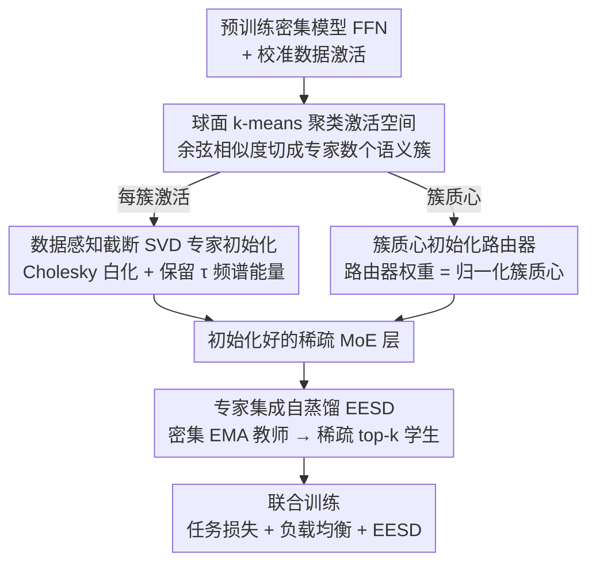

# Enhancing Mixture-of-Experts Specialization via Cluster-Aware Upcycling

**会议**: CVPR 2026  
**arXiv**: [2604.13508](https://arxiv.org/abs/2604.13508)  
**代码**: 无  
**领域**: 模型压缩/高效模型  
**关键词**: Mixture-of-Experts, sparse upcycling, expert specialization, cluster initialization, self-distillation

## 一句话总结

提出 Cluster-aware Upcycling，通过球面 k-means 聚类提取密集模型的语义结构来初始化 MoE 的专家和路由器参数，打破专家对称性并促进早期专业化，配合专家集成自蒸馏损失在 CLIP ViT 上一致超越现有 upcycling 方法。

## 研究背景与动机

Sparse Upcycling 通过复制预训练密集模型权重来初始化 MoE，避免从头训练的高计算成本。然而所有专家从相同权重开始、路由器随机初始化，导致专家对称性和有限的早期专业化。现有打破对称的方法包括噪声注入（效果有限）和部分重初始化（破坏预训练表示），均不理想。关键洞察是：预训练密集模型的表示已包含语义信息，可有效指导专家和路由器的初始化。

## 方法详解

### 整体框架

Sparse Upcycling 直接复制密集模型权重来初始化 MoE，省掉了从头训练，但所有专家从同一份权重出发、路由器随机初始化，导致专家彼此对称、早期难以分化。本文的核心观察是：预训练密集模型的表示里已经藏着语义结构，完全可以拿来给专家和路由器一个"有差异"的起点。整套方法分三步做**初始化**——先用球面 k-means 把密集模型的激活空间切成若干语义簇，再用数据感知的截断 SVD 把每个专家初始化到对应簇的子空间，最后用簇质心初始化路由器；**训练时**再叠一个专家集成自蒸馏（EESD）损失稳住监督信号。前三步是离线的一次性初始化，EESD 则贯穿整个训练过程。

### 关键设计

**1. 球面 k-means 聚类激活空间：让专家的分工边界和路由器的判据对齐**

打破对称的关键，是分工边界要和路由器实际怎么判断对得上。路由器的 logit 本质是 $\mathbf{W}_r \mathbf{x}$，是一种方向对齐度量，所以这里选余弦相似度而非欧氏距离作为聚类目标。具体做法是从校准数据集里收集每个 FFN 块的输入激活向量，做球面 k-means 得到 $N_e$ 个簇及其质心——簇的数量直接对应专家数量，每个簇就是一个专家未来该负责的语义区域。

**2. 数据感知截断 SVD 专家初始化：让每个专家继承对应簇的主子空间**

光知道每个专家该管哪个簇还不够，还得让它的初始权重真的偏向那个簇的数据分布。形式上，本文要最小化每个专家在自己簇上对密集 FFN 输出的重建误差，并附带一个交叉惩罚项压制不同专家退化成相似解（$-\gamma\sum_{j\neq i}\|\mathbf{W}\mathbf{X}_i-\mathbf{W}_j\mathbf{X}_i\|_F^2$，$\gamma=\frac{1}{N_e-1}$）。但论文并不直接优化这个目标，而是用**数据感知截断 SVD** 闭式求解：对每个簇的激活先算 Cholesky 白化矩阵 $\mathbf{S}_i$（满足 $\mathbf{S}_i\mathbf{S}_i^\top=\mathbf{X}_i\mathbf{X}_i^\top$），在 $\mathbf{W}_i\mathbf{S}_i$ 上做截断 SVD 再乘回 $\mathbf{S}_i^{-1}$，秩 $r_i$ 取到累计频谱能量 $\geq\tau$ 为止。这样保留的恰好是该簇数据分布下的主子空间，被丢弃的都是低能量方向——每个专家由此从一份针对自己簇的低秩近似出发，而非和别人一模一样的副本。

**3. 簇质心初始化路由器：让最早期的路由决策就对准语义结构**

专家被切到各自的簇之后，还得让路由器一开始就知道该把哪类 token 送给谁，否则随机初始化的路由器又会把这份初始分工打乱。由于球面 k-means 用的余弦相似度恰好和路由 logit $\mathbf{W}_r\mathbf{x}$ 的方向对齐度量同源，本文直接把 $N_e$ 个 $\ell_2$ 归一化簇质心按行拼成路由器权重 $\mathbf{W}_r=[\boldsymbol{\mu}_1^\top;\dots;\boldsymbol{\mu}_{N_e}^\top]$。于是训练一开始，路由决策就与数据的语义结构对齐，每个专家收到的都是语义连贯的 token，而不是随机分配的噪声——专家与路由器的初始分工就此咬合在一起。

**4. 专家集成自蒸馏（EESD）：给路由不确定的 token 一个稳定的监督**

训练早期路由器对一部分 token 拿不准，近乎均匀的路由概率意味着输入和专家弱对齐，硬监督容易把它们带偏。EESD 对 MoE 参数做 EMA 得到一个教师，并让它以**密集模式**（同时激活全部专家、按软路由加权 $y_{\text{ens}}=\sum_i g_i^{\text{ema}}E_i^{\text{ema}}$）给出稳定预测，稀疏 top-k 学生再通过蒸馏向这个集成预测对齐。对那些路由不确定的 token，全容量教师的集成预测尤其可靠，相当于在专业化尚未成型时托住学生、保住初始化播下的分工。

### 损失函数 / 训练策略

训练目标由任务损失 $\mathcal{L}_{task}$（如对比损失）、负载均衡损失 $\mathcal{L}_{lb}$（防止专家失活）和 EESD 蒸馏损失三部分组成。前者保证下游性能，第二项维持专家利用率均衡，EESD 则在初始化之上持续稳住路由监督。

## 实验关键数据

### 主实验

在 CLIP ViT-B/32 和 ViT-B/16 上评估，涵盖零样本检索和分类基准：

| 基准 | Sparse Upcycling | Drop-Upcycling | Cluster-aware (本文) |
|------|------------------|----------------|---------------------|
| MSCOCO I→T R@1 | 基线 | 改进有限 | **最优** |
| ImageNet-1k Val | 基线 | 改进有限 | **最优** |
| VTAB Natural | 基线 | 改进有限 | **最优** |

### 消融实验

- 聚类初始化 vs. 随机初始化：显著降低专家间相似度
- EESD 损失对路由不确定 token 的改进最大
- 数据感知 SVD vs. 标准 SVD：前者更好保留簇特定信息

### 关键发现

- 专家间相似度显著降低，表示更多样化和解耦
- 路由行为更加自信，token 分配更确定
- 结构改进直接转化为零样本和少样本泛化提升

## 亮点与洞察

- 利用已有语义结构而非随机/噪声打破对称的思路非常优雅
- 球面 k-means 与路由器余弦对齐的一致性设计深思熟虑
- 定量分析证实结构改进确实带来性能收益，而非仅靠训练技巧

## 局限与展望

- 仅在 CLIP ViT-B 上验证，更大规模模型（ViT-L/H）的效果待探索
- 聚类数量与专家数量绑定，灵活性受限
- 校准数据集的选择和大小对聚类质量的影响未充分分析

## 相关工作与启发

- 数据感知 SVD 初始化思路可推广到其他模型扩容场景
- EESD 的密集教师-稀疏学生蒸馏范式可用于其他 MoE 训练
- 聚类质心初始化路由器的方法简单有效

## 评分

7/10 — 方法设计优雅，分析深入，但实验规模偏小（仅 ViT-B）。

<!-- RELATED:START -->

## 相关论文

- [\[ICLR 2026\] Coupling Experts and Routers in Mixture-of-Experts via an Auxiliary Loss](../../ICLR2026/model_compression/coupling_experts_and_routers_in_mixture-of-experts_via_an_auxiliary_loss.md)
- [\[CVPR 2026\] Teacher-Guided Routing for Sparse Vision Mixture-of-Experts](teacher-guided_routing_for_sparse_vision_mixture-of-experts.md)
- [\[ICLR 2026\] Unveiling Super Experts in Mixture-of-Experts Large Language Models](../../ICLR2026/model_compression/unveiling_super_experts_in_mixture-of-experts_large_language_models.md)
- [\[ICML 2026\] DAG-MoE: From Simple Mixture to Structural Aggregation in Mixture-of-Experts](../../ICML2026/model_compression/dag-moe_from_simple_mixture_to_structural_aggregation_in_mixture-of-experts.md)
- [\[CVPR 2026\] TAS-LoRA: Transformer Architecture Search with Mixture-of-LoRA Experts](tas-lora_transformer_architecture_search_with_mixture-of-lora_experts.md)

<!-- RELATED:END -->
