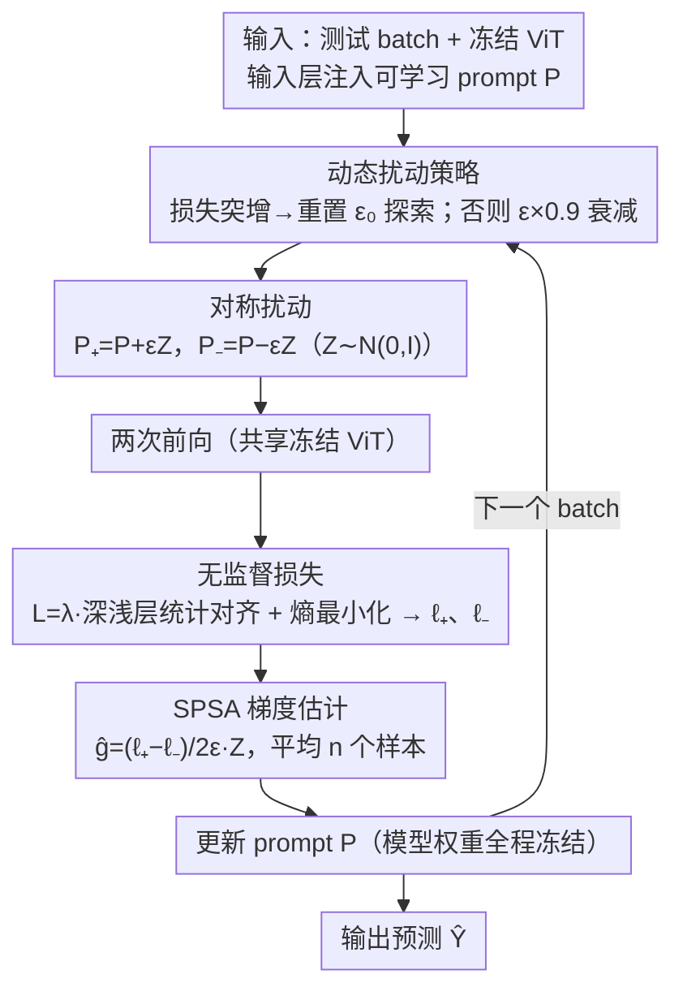

# FOZO: Forward-Only Zeroth-Order Prompt Optimization for Test-Time Adaptation

**会议**: CVPR2026  
**arXiv**: [2603.04733](https://arxiv.org/abs/2603.04733)  
**代码**: [eVI-group-SCU/FOZO](https://github.com/eVI-group-SCU/FOZO)  
**领域**: 模型压缩  
**关键词**: 测试时自适应, 零阶优化, Visual Prompt, 前向传播, 量化模型部署

## 一句话总结

提出 FOZO，一种仅需前向传播的零阶 prompt 优化范式，通过 SPSA 梯度估计 + 动态扰动策略 + 深浅层特征统计对齐，在不修改模型权重的情况下实现高效 TTA，在 ImageNet-C 上以 59.52% 准确率超越所有前向方法（含 FOA 58.13%），并支持 INT8 量化模型。

## 研究背景与动机

**分布偏移普遍存在**：深度学习模型在真实部署中经常遭遇训练-测试分布偏移（distribution shift），TTA 通过在测试时利用未标注数据动态调整模型来应对这一问题。

**反向传播方法资源消耗大**：TENT、SAR、EATA 等基于梯度的 TTA 方法需要反向传播更新模型权重，计算和内存开销高（如 TENT 内存 5495 MiB vs FOZO 831 MiB），不适合低功耗边缘设备。

**传统无梯度方法能力有限**：AdaBN、T3A、LAME 等方法不构建显式优化目标，学习能力受限，适应性能次优（LAME 在 ImageNet-C 上仅 54.16%）。

**CMA-ES 在高维优化中效率低**：最新的前向方法 FOA 使用 CMA-ES 进化策略更新 prompt，但 CMA-ES 具有 $O(d^2)$ 复杂度，在 prompt 高维空间中收敛缓慢。

**ZOA 修改模型内部参数**：ZOA 通过零阶优化更新归一化层参数，限制了在模型权重不可修改场景（如硬件编码、量化模型）中的适用性。

**OOD 数据流带来优化挑战**：TTA 中数据分布持续变化，零阶梯度估计容易不可靠，需要专门的优化策略来保证收敛稳定性。

## 方法详解

### 整体框架

FOZO 想解决的是：在边缘设备、量化模型这类"权重不能动、又没有反向传播预算"的场景下做测试时自适应（TTA）。它的做法是在预训练 ViT 的输入层注入少量可学习 prompt $\mathbf{P} = \{\mathbf{p}^k \in \mathbb{R}^d | 1 \leq k \leq p\}$（默认 $p=3$），模型权重全程冻结，每来一个测试 batch 就只更新这几个 prompt，而且只靠前向传播。整条回路是：先按当前数据流状态动态调整扰动尺度 $\epsilon_t$ → 给 prompt 加一对正负对称扰动 → 各前向一次、用无监督损失（深浅层特征统计对齐 + 熵最小化）算出 $\ell_+$ / $\ell_-$ → 用两次损失之差做 SPSA 梯度估计 → 更新 prompt，下一个 batch 继续。三个核心设计正好管住这条回路的三处要害：SPSA 让梯度只靠前向就能估、动态扰动让零阶估计在持续变化的数据流上稳得住、深浅层对齐损失给无监督优化一个比纯熵更可靠的信号。

### 关键设计

**1. SPSA 前向梯度估计：用两次前向的损失差代替反向传播**

反向传播的 TTA（TENT、SAR、EATA）内存开销大（TENT 5495 MiB vs FOZO 831 MiB），在低功耗设备上不可行。FOZO 改用 SPSA 零阶估计：对 prompt 施加正负对称扰动 $\mathbf{P}_+ = \mathbf{P} + \epsilon_t \mathbf{Z}$、$\mathbf{P}_- = \mathbf{P} - \epsilon_t \mathbf{Z}$（$\mathbf{Z} \sim \mathcal{N}(0, I_d)$），分别前向得到损失 $\ell_+$、$\ell_-$，再估出投影梯度 $\hat{g} = \frac{\ell_+ - \ell_-}{2\epsilon_t} \mathbf{Z}$，平均 $n$ 个 SPSA 样本后更新 prompt。相比 FOA 用的 CMA-ES（$O(d^2)$ 复杂度、在高维 prompt 上收敛慢），SPSA 每步只要两次前向，且理论上收敛速率依赖有效 Hessian 秩 $r$ 而非参数维度 $d$（Theorem 2），在高维 prompt 空间里更划算。

**2. 动态扰动策略：在"探索"和"精确收敛"之间自动切换**

零阶估计的精度和扰动尺度 $\epsilon_t$ 直接挂钩：收敛分析（Theorem 1）里的偏差项 $C\eta\ell\epsilon_t^2 r$ 要求 $\epsilon_t \to 0$ 才能精确收敛，但 TTA 的数据分布持续在变，域切换或优化停滞时又需要大扰动来重新探索。FOZO 用一个自适应衰减机制兼顾两者：

$$\epsilon_t = \begin{cases} \epsilon_0 & \text{if } L_t > \tau \cdot \bar{L}_t \\ \max(\epsilon_{\min}, \epsilon_{t-1} \cdot \alpha) & \text{otherwise} \end{cases}$$

一旦检测到损失突增（预示着域切换或停滞）就把 $\epsilon_t$ 重置回 $\epsilon_0$ 放大探索，正常时则以衰减因子 $\alpha=0.9$ 逐步收小、趋向精确收敛；收敛速率依赖有效 Hessian 秩 $r$ 而非参数维度 $d$（Theorem 2）。

### 损失函数

**深浅层特征统计对齐 $\mathcal{L}_{stats}$**：分别收集 ViT 浅层（$1 \sim N/2$）和深层（$N/2+1 \sim N$）的 [CLS] token 激活统计量（均值 $\mu$、标准差 $\sigma$），与源域预计算的统计量对齐——浅层管低级纹理、深层管语义，分开对齐比笼统对齐更贴合分布偏移的结构：

$$\mathcal{L}_{stats} = \sum_{k \in \{shallow, deep\}} (\|\mu_k^T - \mu_k^S\|_2 + \|\sigma_k^T - \sigma_k^S\|_2)$$

**熵最小化 $\mathcal{L}_{ent}$**：鼓励模型在目标域做出高置信度预测。两者合成总损失 $\mathcal{L} = \lambda \mathcal{L}_{stats} + \mathcal{L}_{ent}$，其中 $\lambda = 0.4$。

## 实验

### 主要结果

**ImageNet-C（5K，level 5）前向方法对比（2次前向传播）**：

| 方法 | FP | Avg Acc(%) | 时间(s) | 内存(MiB) | #Params |
|---|---|---|---|---|---|
| NoAdapt | 1 | 55.57 | 94 | 819 | 0 |
| LAME | 1 | 54.16 | 97 | 819 | 0 |
| T3A | 1 | 53.76 | 311 | 823 | 0 |
| FOA | 2 | 58.13 | 224 | 831 | 2304 |
| ZOA | 2 | 58.56 | 198 | 859 | 26145 |
| **FOZO** | **2** | **59.52** | **179** | **831** | **2304** |

**与反向传播方法对比（28次前向传播）**：

| 方法 | Avg Acc(%) | 时间(s) | 内存(MiB) |
|---|---|---|---|
| TENT | 58.32 | 208 | 5495 |
| EATA | 61.35 | 218 | 5496 |
| SAR | 60.36 | 393 | 5495 |
| DEYO | 60.76 | 282 | 5499 |
| **FOZO (FP=26)** | **62.60** | **2102** | **831** |

### 消融实验

| 配置 | Acc(%) | Δ |
|---|---|---|
| NoAdapt | 55.1 | - |
| Base FOZO (ZO + Entropy) | 57.3 | +2.2 |
| + Deep-Shallow Alignment | 60.1 | +2.8 |
| + Dynamic Perturbation（完整版） | 62.7 | +2.6 |

深浅层特征对齐贡献最大（+2.8%），动态扰动策略紧随其后（+2.6%）。

### 关键发现

- **量化模型适用性强**：在 INT8 PTQ4ViT 上，FOZO 达到 58.00% vs FOA 57.07%、ZOA 56.91%，证明前向方法在量化场景的优势。
- **内存效率极高**：FOZO 仅需 831 MiB，与无适应基线持平，是反向传播方法内存的 ~15%（831 vs 5495 MiB）。
- **参数效率**：仅更新 2304 个 prompt 参数，为 ZOA（26145 参数）的 8.8%。
- **收敛速度**：FOZO 达到 65% 准确率所需时间仅为 FOA/ZOA 的 66%。
- **跨数据集泛化**：在 ImageNet-R（64.1%）和 ImageNet-Sketch（50.5%）上均超越所有前向方法。

## 亮点

- **理论扎实**：基于 SPSA 和局部有效秩假设，严格证明了收敛性，收敛速率与有效 Hessian 秩 $r$ 而非参数维度 $d$ 相关。
- **实用性强**：纯前向传播 + 不修改模型权重 + 低内存，直接适用于边缘设备和量化模型。
- **动态扰动设计精巧**：自动检测域切换并重置扰动尺度，在探索与收敛之间取得平衡。
- **实验全面**：覆盖全精度/量化模型、多个数据集、持续适应场景，消融清晰。

## 局限性

- **运行时间较长**：多次前向传播（FP=26/28）下适应时间（2102s）显著高于反向传播方法（208-393s），速度换内存的权衡在时间敏感场景可能不利。
- **仅在 ViT 架构上验证**：未测试 CNN 或其他架构，prompt 注入依赖 ViT 的 token 拼接机制。
- **源域统计量依赖**：需要预先从源域验证集计算特征统计量，在完全黑盒场景中可能不可获取。
- **Prompt 数量和批大小敏感**：虽然消融显示 3 个 prompt 和 batch=64 较稳健，但小 batch（4/8）时性能明显下降。
- **分类标注为 human_understanding 但实际是通用 TTA 方法**：论文核心解决的是通用视觉模型分布偏移适应，非特定人体理解任务。

## 相关工作

- **FOA**（CVPR 2024）：首个前向 prompt 优化 TTA，用 CMA-ES 更新 prompt，FOZO 用 SPSA 替代 CMA-ES 解决其 $O(d^2)$ 复杂度问题。
- **ZOA**（ACM MM 2025）：零阶优化 TTA 但更新归一化层参数（26145 参数），FOZO 仅更新 prompt（2304 参数）且不修改模型。
- **TENT**（ICLR 2021）：熵最小化 TTA 的里程碑，需反向传播更新 BN 参数；FOZO 继承其熵损失思想但去除反向传播。
- **MeZO**（NeurIPS 2023）：提出局部有效秩假设证明零阶优化可行性，FOZO 将其理论扩展到 TTA 场景。
- **Visual Prompt Tuning**（ECCV 2022）：在 ViT 输入层注入可学习 prompt 的原始方法，FOZO 将其适配到无反向传播的测试时场景。

## 评分

- 新颖性: ⭐⭐⭐⭐ — SPSA 零阶估计替代 CMA-ES 做 TTA prompt 优化是合理且新颖的组合，动态扰动设计有理论支撑
- 实验充分度: ⭐⭐⭐⭐ — 多数据集、量化模型、持续适应、详细消融和超参分析，但缺少非 ViT 架构实验
- 写作质量: ⭐⭐⭐⭐ — 结构清晰，理论推导完整，动机阐述充分
- 价值: ⭐⭐⭐⭐ — 在边缘部署和量化模型 TTA 这一实际场景中提供了强竞争力方案

<!-- RELATED:START -->

## 相关论文

- [\[ICLR 2026\] Fine-tuning Quantized Neural Networks with Zeroth-order Optimization](../../ICLR2026/model_compression/fine-tuning_quantized_neural_networks_with_zeroth-order_optimization.md)
- [\[CVPR 2026\] TALON: Test-time Adaptive Learning for On-the-Fly Category Discovery](talon_test-time_adaptive_learning_for_on-the-fly_category_discovery.md)
- [\[CVPR 2026\] Back to Source: Open-Set Continual Test-Time Adaptation via Domain Compensation](back_to_source_open-set_continual_test-time_adaptation_via_domain_compensation.md)
- [\[CVPR 2026\] Cross-Architecture Adaptation: Cloud-Edge Continual Test-Time Adaptation with Dynamic Sampling and Heterogeneous Distillation](cross-architecture_adaptation_cloud-edge_continual_test-time_adaptation_with_dyn.md)
- [\[ICML 2026\] Turning Stale Gradients into Stable Gradients: Coherent Coordinate Descent with Implicit Landscape Smoothing for Lightweight Zeroth-Order Optimization](../../ICML2026/model_compression/turning_stale_gradients_into_stable_gradients_coherent_coordinate_descent_with_i.md)

<!-- RELATED:END -->
