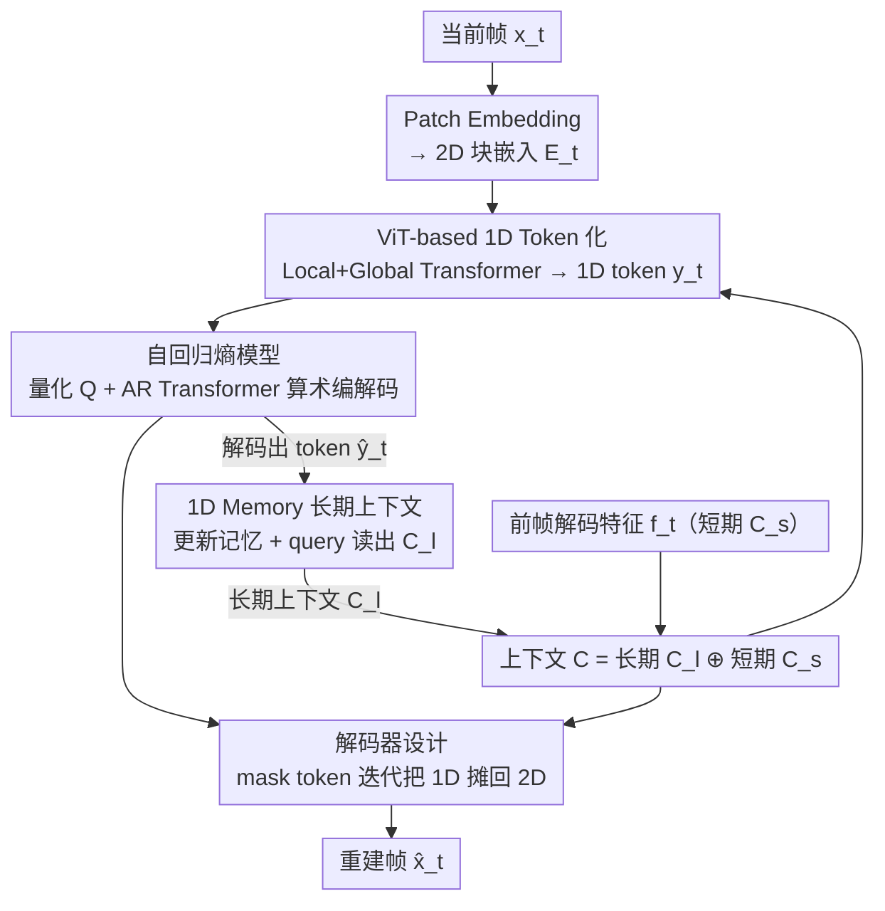

# Generative Video Compression with One-Dimensional Latent Representation

**会议**: CVPR 2026  
**arXiv**: [2603.15302](https://arxiv.org/abs/2603.15302)  
**代码**: [https://gvc1d.github.io/](https://gvc1d.github.io/)  
**领域**: 模型压缩  
**关键词**: 视频压缩, 1D潜在表示, 生成式编解码器, 长期记忆, Token压缩

## 一句话总结

提出 GVC1D，首次将视频压缩的潜在表示从2D网格替换为紧凑的1D token序列，结合1D记忆模块建模长期时序上下文，在感知质量指标上实现 60%+ 的码率节省。

## 研究背景与动机

传统和神经视频编解码器通常将帧编码为**2D潜在网格**（如2D特征图或块），这种范式存在两个核心缺陷：

**空间冗余难消除**：2D网格的刚性结构迫使每个图像patch对应固定数量的token，简单区域和复杂区域分配相同容量，导致大量冗余

**时序建模受限**：2D表示更关注空间变化而非语义动态，难以在帧间聚合跨时序的共性内容，限制了长期上下文的利用

生成式视频编解码器（GVC）虽然通过强大的生成模型提升了感知质量，但仍受制于2D表示的上述局限。1D token化在图像生成（TiTok）和图像压缩（DLF）中已展现出紧凑语义压缩的潜力，但尚未应用于视频压缩。

## 方法详解

### 整体框架

GVC1D 想打破的是视频编解码器"把帧编码成 2D 潜在网格"的惯例——2D 网格让简单区域和复杂区域分到同样多的 token，冗余难消，且偏重空间变化、不擅长跨帧聚合语义。它的核心是把潜在表示换成极少量的 1D token 序列：编码器把当前帧 $x_t \in \mathbb{R}^{3 \times H \times W}$ 压成 1D 潜在 token $y_t$，自回归 Transformer 熵模型对这些 token 做概率建模与算术编码，解码器再从 token 重建出 $\hat{x}_t$；贯穿三个阶段的是一个上下文模型，它把短期上下文（前一帧解码特征 $C_s$）和长期上下文（1D Memory 给出的 $C_l$）拼成 $C$ 喂进编解码，其中 1D Memory 又由解码出的 token $\hat{y}_t$ 反向刷新，形成跨帧的时序反馈。

### 关键设计

**1. ViT-based 1D Token 化：让 token 数量与空间分辨率解耦**

2D 网格的刚性结构强迫每个 patch 对应固定数量 token，是冗余的根源。GVC1D 把输入帧 patch embedding 成 $E_t \in \mathbb{R}^{D \times (h \cdot w)}$，与可学习的 1D latent token $L \in \mathbb{R}^{D \times (N \cdot 32)}$ 拼接后送入编码器，编码器由交替的 Local Transformer（窗口内并行）和 Global Transformer（跨窗口全局交互）组成：$y_t = \text{Enc}(E_t \oplus L \oplus C)$，其中 $C = C_l \oplus C_s$ 是长短期上下文。关键在于 1D token 不绑定固定空间位置，可以自适应地把容量分给语义区域，且每个窗口只要 32 个 token（对比 2D 的 $16 \times 16 = 256$ 个 patch），从根上把空间冗余压了下来。

**2. 自回归熵模型：token 少，所以 AR 建模反而便宜**

熵模型对量化后的 1D token $Q(y_t)$ 用 AR Transformer 顺序预测概率分布。AR 本是慢的，但这里每帧只有 32 个 token、不同窗口还能并行，开销可控；而 2D grid 上熵模型要处理 $h \times w$ 个 token，AR 复杂度高出 1–2 个数量级。token 数量上的根本差异，让"顺序建模"从负担变成了可承受的选择。

**3. 解码器设计：用 mask token 把 1D 信息"摊回"2D 空间**

解码端采用与编码器对称的架构，引入可学习 mask token $M \in \mathbb{R}^{D \times (h \cdot w)}$，与解码出的 1D token $\hat{y}_t$ 和上下文 $C$ 拼接后迭代提取信息，再经卷积输出头重建帧：$\hat{x}_t = \text{Out}(\text{Dec}(\hat{y}_t \oplus M \oplus C))$。mask token 在解码过程中逐步从 1D token 里"读"出内容，把紧凑的 1D 表示还原成完整的 2D 空间特征。

**4. 1D Memory 长期上下文模块：用紧凑 token 装下更长的时序记忆**

视频要利用长期上下文，但 2D 特征塞进固定大小的记忆很快就装满。1D Memory 维护一个固定大小的记忆状态，分两阶段工作：更新阶段用少量解码出的 1D token $\hat{y}_t$ 刷新记忆，读出阶段由可学习的 query token 从记忆里检索出长期上下文 $C_l$，整体用一个简单 Transformer 实现。由于 1D token 语义密、数量少，同样的记忆容量能装下更多信息，缓解了信息遗忘；它和前帧解码特征给出的短期上下文 $C_s$ 拼成 $C$ 反馈进下一帧的编解码——短期补细粒度结构、长期补全局语义，二者互补。

### 损失函数 / 训练策略

采用率-失真优化 $\mathcal{L} = R + \lambda D$（$R$ 为码率，$D$ 为失真），$\lambda$ 在 $[0.07, 1.5]$ 区间对数均匀采样 8 个点以训练可变码率模型；在 Vimeo 和 OpenVid-HD 上训练，并加感知损失提升视觉质量。

## 实验关键数据

### 主实验

| 数据集 | 指标 | GVC1D (Ours) | GLC-Video | BD-Rate节省 |
|--------|------|-------------|-----------|-------------|
| HEVC-B | LPIPS | 最优 | 基准 | **-60.4%** |
| HEVC-B | DISTS | 最优 | 基准 | **-68.8%** |
| UVG | LPIPS | 最优 | 基准 | **-66.0%** |
| MCL-JCV | LPIPS | 最优 | 基准 | **-62.1%** |
| HEVC-B | PSNR | 最优 | 基准 | **-53.8%** |
| HEVC-B | MS-SSIM | 最优 | 基准 | **-45.1%** |

### 消融实验

| 配置 | HEVC-B BD-Rate | UVG BD-Rate | 说明 |
|------|---------------|-------------|------|
| 无AR + 无Memory | +67.8% | +67.4% | 基础配置 |
| 有AR + 无Memory | +20.1% | +40.6% | AR有效减少token间冗余 |
| 有AR + 2D Memory | +11.5% | +16.8% | 2D特征管理记忆效果有限 |
| 有AR + 1D Memory (Ours) | 0.0% | 0.0% | 1D管理记忆最优 |

Token大小消融：32×16（数量×通道）为最优配置；过少token容量不足，过多token增加码率。

### 关键发现

- 1D token在帧间能**一致跟踪相同语义区域**（如马的左前腿），即使存在大幅运动
- 新物体出现时，1D token的注意力权重能**动态重新分配**到新内容
- 编码时间0.262s，解码0.207s（1080P@A100），与GLC-Video速度相当

## 亮点与洞察

- **范式创新**：首次证明1D潜在表示在视频压缩中优于传统2D网格，为该领域开辟新方向
- **优雅的冗余消除**：token数量与空间分辨率解耦，自然实现自适应码率分配
- 1D记忆设计巧妙——利用1D token的紧凑性和语义丰富性，用简单Transformer就能实现有效的长期上下文建模

## 局限与展望

- 每帧仅32个1D token，信息容量有限，当前仅适用于**低码率有损压缩**，作者明确承认无法扩展到无损场景
- token数量固定，未探索根据帧复杂度**动态调整token数量**的可能——简单帧(如静态背景)可用更少token，复杂帧(快速运动/场景切换)可能需要更多
- 生成式解码器仍可能在某些场景产生语义不一致的**幻觉细节**，论文视觉对比中未展示failure cases
- 仅在1080p分辨率上验证，4K+超高分辨率的扩展性存疑
- 训练数据为通用视频(Vimeo+OpenVid-HD)，在特定领域视频(如医学影像、卫星遥感)上的表现未知

## 相关工作与启发

- **vs GLC-Video [ECCV24]**：GLC-Video用VQ-VAE将视频编码为2D latent grid+生成式解码，受限于VQ-VAE容量和2D结构冗余。GVC1D用连续1D tokens完全绕过2D结构限制，BD-Rate降低60-68%
- **vs DiffVC**：DiffVC用预训练扩散模型增强感知质量但码率偏高，未充分利用低码率优势。GVC1D通过1D表示+长期上下文在极低码率下实现高感知质量
- **vs DCVC-FM/DCVC-RT**：DCVC系列是PSNR导向的条件编码框架，仅用短期上下文。GVC1D的1D Memory思路可能与DCVC的条件编码互补
- **vs DLF [图像压缩]**：DLF首次在图像压缩中用离散1D tokens，但离散格式破坏视频时序一致性。GVC1D采用连续1D tokens更适合视频
- **vs TiTok/TA-TiTok**：1D tokenization在图像生成中已证明紧凑语义压缩的价值，GVC1D将其扩展到视频压缩并证明同样有效
- 启发：1D表示的灵活性和语义丰富性是否可扩展到视频理解、动作识别等下游任务？1D tokens的语义跟踪特性可能天然适合目标跟踪

## 评分

- 新颖性: ⭐⭐⭐⭐⭐ 首次将1D潜在表示引入视频压缩，范式级创新
- 实验充分度: ⭐⭐⭐⭐ 多数据集对比+充分消融+注意力可视化，但缺少速度-质量Pareto曲线
- 写作质量: ⭐⭐⭐⭐ 动机清晰，框架图精美，分析深入
- 价值: ⭐⭐⭐⭐⭐ 60%+码率节省，对视频压缩领域有重要推动作用

<!-- RELATED:START -->

## 相关论文

- [\[CVPR 2026\] CADC: Content Adaptive Diffusion-Based Generative Image Compression](cadc_content_adaptive_diffusion-based_generative_image_compression.md)
- [\[CVPR 2026\] Ultra-Fast Neural Video Compression](ultra-fast_neural_video_compression.md)
- [\[ICCV 2025\] DLF: Extreme Image Compression with Dual-generative Latent Fusion](../../ICCV2025/model_compression/dlf_extreme_image_compression_with_dual-generative_latent_fusion.md)
- [\[CVPR 2026\] Discovering Adaptive Task Dependencies for Efficient Multi-Task Representation Compression](discovering_adaptive_task_dependencies_for_efficient_multi-task_representation_c.md)
- [\[CVPR 2026\] UniComp: Rethinking Video Compression Through Informational Uniqueness](unicomp_rethinking_video_compression_through_informational_uniqueness.md)

<!-- RELATED:END -->
