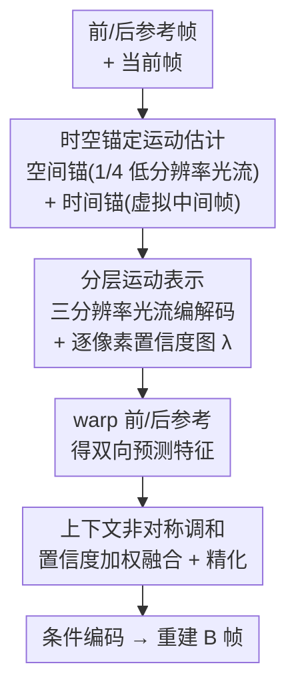

# High Resolution Neural Video Coding with Bi-directional Confidence-Guided Reference Information Modeling

**会议**: CVPR 2026  
**论文**: [CVF Open Access](https://openaccess.thecvf.com/content/CVPR2026/html/Ye_High_Resolution_Neural_Video_Coding_with_Bi-directional_Confidence-Guided_Reference_Information_CVPR_2026_paper.html)  
**代码**: 待确认  
**领域**: 模型压缩 / 神经视频编码  
**关键词**: 神经视频编码, B 帧压缩, 双向参考, 置信度引导融合, 4K 视频

## 一句话总结
HR-NVC 把双向（B 帧）神经视频压缩重新组织为「参考信息建模」三件事——运动表示、上下文翻译、跨方向调和——用空间/时间锚稳住大位移下的光流估计、用分层运动表示同时编码多尺度光流和逐像素置信度、再用置信度引导的非对称融合压制不可靠参考，成为首个在 4K 序列上端到端评测的神经视频编解码器，在神经 B 帧编码上取得 SOTA。

## 研究背景与动机
**领域现状**：端到端神经视频压缩（NVC）近年在单向 P 帧编码上进步显著，能端到端学习复杂的时空先验。理论上双向 B 帧编码同时拥有前向和后向两个参考帧，信息更充分，本应压缩效率更高——这也是传统编码标准（HEVC/VVC）里 B 帧远胜 P 帧的原因。

**现有痛点**：但现有神经 B 帧编解码器收益有限，尤其在**高分辨率 + 大运动**场景下，会出现纹理漂移（texture drift）、重影（ghosting）和时域不一致。根因有两条：一是光流估计在大位移下变得不可靠；二是把前后两个参考「平衡融合」（直接拼接）会在遮挡/场景切换处引入失真。

**核心矛盾**：传统编码器把运动表示、预测、补偿拆成 AMC/HMVP/AMVR 这类**可解释、规则化**的模块，协同保证精确对齐；而现有神经 B 帧编码器只是机械地「换皮」——用独立的神经模块替换手工模块，各模块各管一段、互不通气，导致表示纠缠、对齐不稳、时域抖动。问题不在于某个模块不够强，而在于**缺乏对「参考信息」本身的统一组织**。

**本文目标**：从整体视角重审 B 帧编码，提出 **Reference Information Modeling（参考信息建模）**——把所有连接双向上下文的信号都视为结构化的「参考信息」，并把它拆成三个维度：运动与时序先验的**表示（Representation）**、把它们**翻译（Translation）**成对齐上下文、以及跨方向跨尺度的**调和（Harmonization）**。

**切入角度**：与其在某一段（运动 or 上下文）做局部优化，不如沿这三个维度系统地增强参考信息建模——稳住运动估计的表示根基、构造保留空间层级的多尺度运动翻译、用置信度感知的对齐做双向调和。

**核心 idea**：用「空间/时间锚稳运动 + 分层运动表示同时编码置信度 + 置信度引导的非对称融合」三步，让编解码器**非均匀**地利用双向参考，把不可靠区域压制掉，从而在高分辨率大运动下取得可靠且高效的 B 帧压缩。

## 方法详解

### 整体框架
HR-NVC 的编码流程以 SPyNet 作为光流主干，对一帧 B 帧的编码可分为三个串联阶段。**第一步**，用空间锚（原图下采样到 1/4 算出的低分辨率光流）和时间锚（从前后参考帧插值出的「虚拟中间帧」）共同给运动估计提供可靠初始化，治住大位移下光流崩溃的问题。**第二步**，不再单尺度压缩光流，而是把运动组织成三分辨率金字塔做分层编码，解码端同时吐出多尺度光流**和逐像素置信度图**，量化每处运动补偿预测特征的可靠程度。**第三步**，用重建出的运动把前/后参考特征 warp 成预测特征后，不直接拼接，而是按置信度做非对称加权融合，压制不可靠方向、保留可靠方向，再轻量精化，得到送入条件编码的紧凑高质量上下文。

三个阶段恰好对应参考信息建模的三维度：表示（Spatio-Temporal Anchored Motion Estimation）→ 翻译（Hierarchical Motion Representation）→ 调和（Contextual Asymmetric Harmonization）。

### 关键设计

**1. 时空锚定运动估计：用轻量先验把大位移光流「钉」住，而不是靠昂贵在线优化**

痛点很具体：分层 B 帧结构会引入长时间间隔和大帧间位移，常常超出 SPyNet 顶层金字塔的感受野；一旦顶层的零初始化「崩」了，错误会顺着 coarse-to-fine 逐级放大，整张光流失真。已有的自适应方案（如 OMRA 在推理时动态调尺度）虽有效，但依赖在线优化、开销大、难实时。作者反过来问：稳定性能不能**靠设计而非靠在线适配**得到？于是注入两类锚。**空间锚**：先把帧下采样到原分辨率的 1/4，此时大运动被显著缩小、光流网络能产出稳定的粗光流，再把它作为空间先验注入原分辨率的运动估计，给一个初始的全局运动假设，从而约束早期搜索空间、缓解收敛不稳和误差放大。**时间锚**：把下采样后的前向、后向参考帧插值出一个「虚拟中间帧」，再计算双向参考到该虚拟帧的光流，提供中间运动趋势和遮挡区域的预测线索，对非平移、复杂运动更鲁棒。两类锚共同初始化粗运动场并补充中间趋势，关键是**保持光流主干本身不变、轻量**——不堆叠大量 refinement，因此计算开销小却能在各分辨率间传递高保真运动场。

**2. 分层运动表示：把运动和它的「可信度」一起分层编码，让可靠区主导、不可靠区被压制**

多数神经编解码器在单一尺度上估计并压缩运动（直接编码运动场或运动残差），高分辨率内容里既有大全局位移又有细微局部形变，单尺度潜表示会过拟合局部细节、丢失长程依赖，导致对齐不稳、码率浪费、时域不一致。本设计把运动特征组织成由粗到细的金字塔：粗层编码全局位移与长程结构，细层关注局部对齐与细节修正，且编码**以锚定先验和上一重建光流为条件**。为省算力做了两处取舍——既然空间锚已能很好引导高分辨率光流，就不把 $\{m^2_{f\to t}, m^2_{b\to t}\}$ 送进运动编码器压缩；$\{m^0_{ref\,f}, m^0_{ref\,b}\}$ 也既不计算也不输入。更关键的是**置信度引导的可靠性建模**：运动解码器除了重建三分辨率光流，还额外吐出一张单通道置信度图 $\lambda$，量化对应位置运动表示的可靠程度。这张 $\lambda$ 紧随运动一起、在三个分辨率上序贯生成，无需对可靠性单独再编码，既省码率又把「哪里可信」这一信息天然带进后续融合，从小幅局部位移到大幅全局位移都能保持结构一致。

**3. 上下文非对称调和：按置信度做加权融合，承认前后参考「不对称」而非假装一样可靠**

大多数神经编解码器把双向参考简单 warp 后拼接，隐含假设两个参考在每个空间位置贡献相等。但实际中遮挡、运动不连续和压缩伪影会带来强方向不对称——某个参考在某些区域远比另一个可靠，朴素拼接会把不一致线索混在一起、引入重建噪声。本模块把融合从均匀聚合改成**置信度引导的调和**：先做加权融合
$$F^i_{harm} = \ddot{\lambda}^i_f \cdot F^i_{fwarp} + \ddot{\lambda}^i_b \cdot F^i_{bwarp},\quad i = 0,1,2,$$
其中 $\ddot{\lambda}_f, \ddot{\lambda}_b$ 是由前后置信度图 $\lambda_f, \lambda_b$ 归一化得到的权重，让每个方向按其推断出的可信度按比例贡献，从而在特征层面动态强调可靠参考、抑制低置信度参考，起到去噪与调和作用。融合后的 $F_{harm}$ 再经一个轻量增强模块精化，恢复细粒度时域与结构一致性。这套机制把双向上下文融合和自适应可靠性建模打通，给最终重建提供稳定、纯净的表示，在复杂运动和遮挡场景下显著提升质量。

### 损失函数 / 训练策略
模型先在 Vimeo-90K 上用 7 帧序列预训练，再在从 Vimeo 原始视频收集的 9,000 段 33 帧片段上微调，沿用多阶段训练协议；优化器为 AdamW，batch size 为 8。测试时采用 GOP=32、intra-period=32，按既有 NVC 设定压缩每个序列前 97 帧；为验证长时稳定性还在 JCT-VC 上做全序列测试（如 500 帧视频编码全部 481 帧的完整 GOP）。所有方法在 RGB 上运行（YUV420 经 BT.709 转换）。

## 实验关键数据

### 主实验
BD-rate(%) 以 HM-16.20-LDB 为 anchor，**数值越负代表相同质量下越省码率**。下表为 JCT-VC 各类 + UVG + MCL-JCV 上 97 帧的 PSNR BD-rate（Table 1）。HR-NVC 在所有 benchmark 上稳定超过现有 B 帧 NVC，整体均值 −44.27% 优于次优神经法 DCVC-B 的 −39.50%；在 JCT-VC Class A 上 −51.87% 甚至超过传统强基线 VTM-RA 的 −48.50%。

| 方法 | JCT-VC Avg | UVG | MCL-JCV | Overall Avg |
|--------|------|------|---------|-------------|
| VTM-RA（传统强基线） | -48.41 | -46.25 | -48.53 | -48.12 |
| B-CANF（神经 B 帧） | -19.16 | -6.34 | 1.69 | -14.35 |
| DCVC-B（神经 B 帧 SOTA） | -44.39 | -26.82 | -27.68 | -39.50 |
| **OURS (HR-NVC)** | **-49.25** | **-33.39** | **-30.25** | **-44.27** |

全序列测试（Table 2）进一步验证时域稳定性，HR-NVC 各类均保持领先，均值 −49.53% 大幅优于 DCVC-B 的 −44.97%，也超过单向 P 帧 SOTA（DCVC-FM −42.43%）。4K 评测（Table 3，JVET Class A1/A2，因 VTM 太慢改用 VVenC Slow 作高效参照）上 HR-NVC 取得最佳 −31.84%，作者强调这是**首个在 4K 序列上端到端评测的神经 B 帧编解码器**。

| 4K 方法（JVET，97 帧） | Class A1 | Class A2 | Average |
|------|----------|----------|---------|
| VVenC (Slow) | -5.49 | 2.57 | -1.46 |
| HM-RA | -12.44 | -17.49 | -14.97 |
| DCVC-B | -22.91 | -32.16 | -27.53 |
| **OURS** | **-29.18** | **-34.49** | **-31.84** |

### 消融实验
逐步叠加四个组件（HMR 分层运动表示、CAH 上下文非对称调和、SA 空间锚、TVA 时间虚拟锚），看 Overall BD-rate 的累积改进（Table 6）。

| 配置 | 累积组件 | Overall BD-rate(%) | 说明 |
|------|----------|--------------------|------|
| M1 | HMR | -3.57 | 仅分层运动表示，UVG 上已有明显改善 |
| M2 | +CAH | -9.57 | 双向非对称融合带来大幅提升 |
| M3 | +（中间配置） | -13.68 | 继续叠加组件 ⚠️ 该行 `!` 对应关系以原文表格为准 |
| M4 | +SA | -15.13 | 空间锚稳住运动估计，1080p 上提升明显 |
| M5 | +TVA（完整模型） | -15.77 | 时间锚再为高分辨率视频额外带来约 2% 增益 |

### 关键发现
- **非对称调和（CAH）贡献最大**：从 M1 的 −3.57% 跳到 M2 的 −9.57%，说明「承认前后参考不对称、按置信度加权」是收益主来源，远胜朴素拼接。
- **锚的收益集中在高分辨率/大运动**：空间锚在 1080p 上效果显著（M4），时间虚拟锚（TVA）对高分辨率视频再加约 2% 增益（如 UVG 从 M4 的 −12.51% 到 M5 的 −15.03%），印证「靠设计获得稳定性」的思路。
- **加锚几乎不增开销**：开启 TVA 后参数从 19.47M 升到 29.54M（多了锚生成器），但 MACs/pixel 仅从 2687k 升到 2738k（+1.9%），解码时间只多 12ms（Table 4），代价极小。
- **选 SPyNet 是性价比权衡**：Table 5 显示若换成 RAFT/SEA-RAFT/FlowSeek 等更准的光流网络，其 MACs 会占到整个编解码器的 51%–78%，反而喧宾夺主；SPyNet 仅 38%，在精度与复杂度间最划算。

## 亮点与洞察
- **「参考信息建模」是个好框架**：把 B 帧编码里零散的运动/上下文处理统一抽象成「表示—翻译—调和」三维度，三个模块各对应一维，让方法不像东拼西凑的模块堆叠，而是有清晰主线——这种「先立 principle 再落模块」的组织方式可迁移到其他多模块压缩/重建任务。
- **置信度图「搭车」编码**：可靠性图 $\lambda$ 由运动解码器和光流一起序贯吐出，无需单独压缩可靠性、几乎不增码率，却把「哪里可信」直接喂给下游融合——把不确定性建模做成几乎免费的副产品，很巧妙。
- **靠设计获得稳定性而非在线优化**：用「下采样得稳光流 → 当空间先验」这种轻量先验治住大位移光流崩溃，避开了 OMRA 那类在线优化的高开销，是工程上很实用的取舍。
- **首个 4K 端到端神经 B 帧编解码器**：把 NVC 评测推进到 4K，为高分辨率神经压缩立了新 benchmark。

## 局限与展望
- 方法整体仍以 SPyNet 为主干，性能上限受其精度约束；虽然作者论证了换更强光流网络不划算，但这本质是「在弱主干上打补丁」，更强且高效的光流主干出现后框架是否仍最优值得再验。
- 时间虚拟锚需额外的锚生成器，参数量从 19.47M 增到 29.54M（约 +50%），对参数受限/移动端部署不友好，尽管计算开销增加很小。
- ⚠️ 消融表（Table 6）中各行 `!` 与组件的精确对应在缓存文本里有排版损失，M3 的具体配置以原文表格为准。
- 实验主要在标准测试集（JCT-VC/UVG/MCL-JCV/JVET）上，针对屏幕内容、HDR、超高帧率等更极端高分辨率场景的泛化性未充分展开。

## 相关工作与启发
- **vs 传统编解码器（HM/VTM/VVenC）**：传统编码器用 AMC/HMVP/AMVR 等可解释规则模块保证稳健对齐；HR-NVC 借鉴其「精细组织参考」的思想但用端到端神经实现，且在 Class A 等高分辨率类上已能逼近甚至超过 VTM-RA。
- **vs DCVC-B（神经 B 帧 SOTA）**：DCVC-B 等沿用「换皮」式独立神经模块、双向参考对称拼接；HR-NVC 用置信度引导的**非对称**融合替代对称拼接，并在锚定先验下做分层运动编码，整体均值 −44.27% vs −39.50%（97 帧）领先明显。
- **vs B-CANF**：B-CANF 早期把 B 帧当帧插值/条件 ANF 处理，在大运动/高分辨率上掉点严重（MCL-JCV 上 BD-rate 甚至为正 +1.69%）；HR-NVC 通过稳运动 + 置信度调和系统性解决了这类失稳。
- **vs OMRA 等在线自适应运动估计**：OMRA 在推理时动态调尺度以增强鲁棒性，但依赖在线优化、开销大；HR-NVC 把鲁棒性做进设计（轻量时空锚），无需在线适配即获稳定光流。

## 评分
- 新颖性: ⭐⭐⭐⭐⭐ 「参考信息建模」统一视角 + 置信度非对称融合 + 首个 4K 端到端神经 B 帧，思路与落点都新
- 实验充分度: ⭐⭐⭐⭐⭐ 覆盖 JCT-VC/UVG/MCL-JCV/JVET 4K，含全序列、复杂度、光流主干对比与完整消融
- 写作质量: ⭐⭐⭐⭐ 主线清晰、动机扎实，个别图表与公式排版略密
- 价值: ⭐⭐⭐⭐⭐ 把神经视频编码推到 4K 并在 B 帧上取得 SOTA，对高分辨率压缩研究有方向性意义

<!-- RELATED:START -->

## 相关论文

- [\[CVPR 2026\] Content-Adaptive Hierarchical Hyperprior for Neural Video Coding](content-adaptive_hierarchical_hyperprior_for_neural_video_coding.md)
- [\[CVPR 2026\] MambaSIC: Mamba-based Stereo Image Compression with Bi-directional Multi-reference Entropy Model](mambasic_mamba-based_stereo_image_compression_with_bi-directional_multi-referenc.md)
- [\[CVPR 2026\] Real-Time Neural Video Compression with Unified Intra and Inter Coding](real-time_neural_video_compression_with_unified_intra_and_inter_coding.md)
- [\[CVPR 2026\] FreqSIC: Frequency-aware Stereo Image Compression with Bi-directional Checkerboard Context Model](freqsic_frequency-aware_stereo_image_compression_with_bi-directional_checkerboar.md)
- [\[CVPR 2026\] Ultra-Fast Neural Video Compression](ultra-fast_neural_video_compression.md)

<!-- RELATED:END -->
