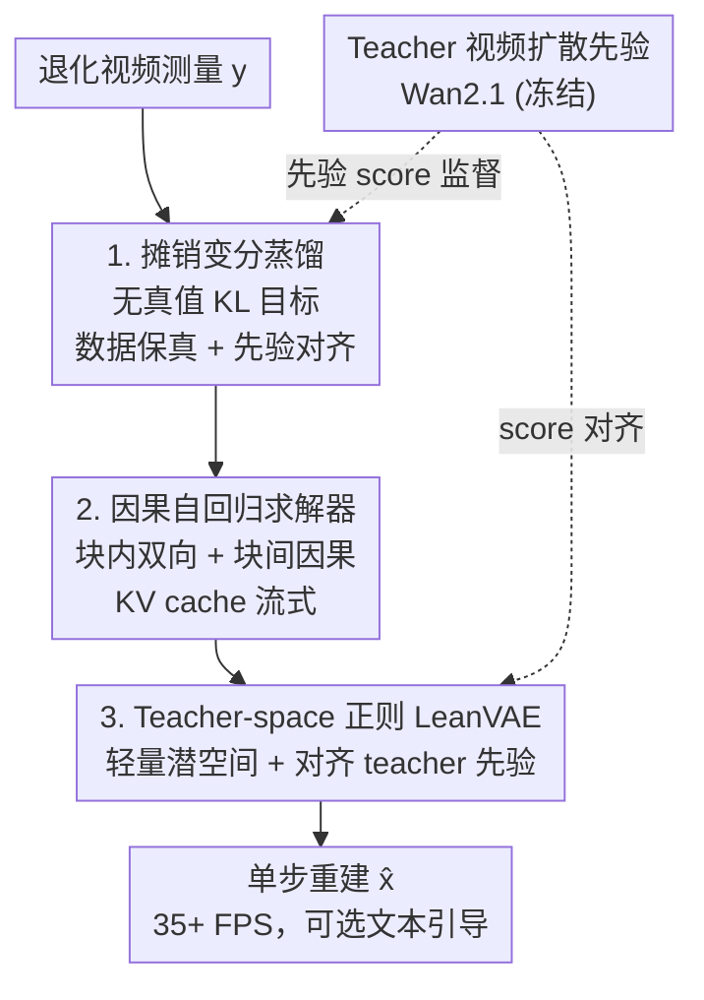

# InstantViR: Real-Time Video Inverse Problem Solver with Distilled Diffusion Prior

**会议**: CVPR 2026  
**论文**: [CVF Open Access](https://openaccess.thecvf.com/content/CVPR2026/html/Bai_InstantViR_Real-Time_Video_Inverse_Problem_Solver_with_Distilled_Diffusion_Prior_CVPR_2026_paper.html)  
**代码**: [项目页](https://ai4scientificimaging.org/instantvir)（代码仓库待确认）  
**领域**: 视频恢复 / 扩散模型 / 逆问题求解  
**关键词**: 视频逆问题、扩散先验蒸馏、摊销推断、因果流式重建、实时恢复

## 一句话总结
InstantViR 把一个强大的双向视频扩散模型（teacher）蒸馏成一个**单步、因果自回归**的学生求解器，无需成对干净/退化数据，就能把退化视频一次前向直接映射成高质量重建，并通过替换轻量 VAE 把吞吐推到 **35+ FPS**（相对迭代式视频扩散求解器加速达 100×），同时在去噪/去模糊/超分/补全任务上质量追平甚至超过迭代基线。

## 研究背景与动机

**领域现状**：视频逆问题（从退化测量 $y$ 重建干净视频 $x$，如去模糊、超分、补全）被普遍建模为贝叶斯后验采样问题 $p(x|y)\propto p(y|x)p(x)$，其中似然 $p(y|x)$ 由已知退化算子决定，先验 $p(x)$ 刻画视频的时空统计。当前最强的先验来自扩散模型。

**现有痛点**：用扩散先验求解视频逆问题有两条路，都不理想。① **图像扩散先验 + 时序正则**（光流约束、批噪声等启发式）：先验本身不懂时空动态，重建容易闪烁、时序不一致，而且仍要迭代采样，慢。② **原生视频扩散先验**（Wan2.1、Open-Sora 等）：时序先验很强，但后验采样要在极高维视频空间里跑成百上千步迭代轨迹，单帧生成还要 attend 整段（含未来帧）的双向注意力，延迟高到根本无法用于流式/实时场景（< 1 FPS）。

**核心矛盾**：质量与速度的强 trade-off——要么"弱但慢"的图像先验，要么"强但更慢"的视频先验；而少数一步蒸馏方法虽快却高度任务特定、依赖千万级成对数据（如 10M 视频对），缺乏通用性。

**本文目标**：在**不牺牲视频扩散先验的时序一致性**的前提下，把它的天价采样成本去掉，得到一个能流式、实时、还能文本可控的通用视频逆问题求解器。

**切入角度**：作者主张"质量 vs 速度"并非本质对立。把测试时的慢优化（per-instance 求 $p(x|y)$）换成**摊销推断（amortized inference）**——训练一个一次性学好的通用求解器 $q_\phi(x|y)$，把退化视频直接前向映射到重建，把所有迭代代价摊到训练阶段。

**核心 idea**：用"teacher 视频扩散先验 + 已知退化算子"定义目标后验，**无需任何成对真值**，通过变分蒸馏把它压成一个**单步因果学生**；再用 teacher-space 正则把重 VAE 换成轻量 VAE，彻底打通实时路径。

## 方法详解

### 整体框架
InstantViR 输入退化视频测量 $y$，输出重建 $\hat{x}$。它用**非对称的师生设计**：一个慢的双向视频扩散模型（Wan2.1-1.3B）当 teacher，和退化算子 $A$ 一起定义目标后验；一个快的因果自回归学生 $q_\phi$ 被训练成一步逼近这个后验。训练只需要退化测量 $y$ 和冻结的 teacher（外加已知退化算子），**完全不用成对的干净/退化数据**——退化测量在线由干净视频经已知前向算子生成，且只用来 query teacher。

整条 pipeline 分三块递进：① **摊销变分蒸馏**给出"为什么单步求解器能学到正确后验"的训练目标（数据保真 + 先验对齐双项 KL）；② **因果自回归求解器**把学生设计成 block-wise 流式架构（块内双向、块间因果 + KV cache），解决"流式时看不到未来帧"的因果性约束；③ **teacher-space 正则的 LeanVAE 替换**把推理瓶颈（重 VAE 解码器）换成超轻量 tokenizer，同时不破坏与 teacher 先验的潜空间对齐。推理时学生就是一个前向网络，逐块因果自回归输出重建，可选地接受文本引导。

### 关键设计

**1. 摊销变分蒸馏：用无真值的 KL 目标把迭代后验采样压成一步前向**

痛点是迭代式方法每来一个测量 $y$ 都要重新跑一遍慢优化，且反复 backprop 通过解码器。InstantViR 改为直接学一个前向求解器 $q_\phi(x|y)$，把它当成后验 $p(x|y)$ 的变分近似，最小化期望 KL：
$$\mathcal{L}=\mathbb{E}_{y\sim p(y)}\big[D_{KL}(q_\phi(x|y)\,\|\,p(x|y))\big].$$
这个 KL 可分解（差一个常数）为**数据保真项**与**先验正则项**两部分：第一项 $\mathbb{E}_{x\sim q_\phi}[-\log p(y|x)]$ 用已知退化模型 $A$ 强制测量一致（实现上就是 $\|y-A\hat{x}_0\|_2^2$ 这类保真损失），第二项 $D_{KL}(q_\phi(x|y)\,\|\,p(x))$ 把求解器拉回 teacher 视频扩散先验定义的自然视频流形上。

由于扩散先验定义在潜空间，实际在 $z=E(x)$ 上操作，目标变成似然项 $-\log p(y|D(z))$ 加上对 $p(z)$ 的 KL。$p(z)$ 只通过 teacher 的 score 函数 $s_\theta$ 隐式定义，于是借鉴 score-distillation 把先验项近似成一个 score-matching 损失：
$$\mathcal{L}_{prior}\approx\mathbb{E}_{t,\epsilon,z\sim q_\phi}\big[w(t)\,\|s_\theta(z_t,t)-s_{q_\phi}(z_t,t)\|^2\big],$$
其中 $z_t=\alpha_t z+\sigma_t\epsilon$ 是加噪潜变量，$s_{q_\phi}$ 由一个小辅助网络 $s_\varphi$ 给出。**关键好处**：训练只需 $y$ 和冻结的 $s_\theta$，不需要成对真值，因此天然可扩展、可灵活适配任意退化算子和文本条件——换退化模型/换 prompt 就能从补全无缝切到去模糊、超分、文本引导编辑。

**2. 因果自回归求解器：块内双向 + 块间因果 KV cache，让单步求解器能流式跑**

离线生成可以 attend 整段视频，但**流式重建在时刻 $n$ 只能看到过去和当前帧、看不到未来**，所以标准全时空注意力的 DiT 不能直接当流式求解器。InstantViR 把 $q_\phi$ 设计成在 $T$ 帧时序块上滑动的因果自回归求解器，用一种**双模式块因果注意力**：

- **块内双向注意力**：当前块 $n$ 内所有 token 互相 attend，建模丰富的局部时空结构，$\text{Att}_{intra}(Q_i,K_n,V_n)=\mathrm{softmax}(Q_iK_n^\top/\sqrt{d_k})V_n$；
- **块间因果注意力**：跨块时，块 $n$ 的 token 只能 attend 已重建的过去块 $\hat{z}_{<n}$，$\text{Att}_{inter}(Q_i,K_{<n},V_{<n})=\mathrm{softmax}(Q_iK_{<n}^\top/\sqrt{d_k})V_{<n}$。

工程上块间注意力用标准自回归 **KV cache** 实现：每重建完一块就存下它的 keys/values 供后续块复用，避免对历史帧的重复计算，把每帧成本压到很低，同时严格保持因果性。这正是把"一步前向"做成"逐块流式输出"的关键——既保留了块内的时空建模能力，又满足了流式不可见未来的硬约束。

**3. Teacher-space 正则的 LeanVAE 集成：把推理瓶颈从 DiT 转到的重 VAE 换掉，又不破坏潜空间语义**

做到上面两点后，系统在 832×480 已达约 15 FPS，此时瓶颈不再是 DiT 而是**重的视频解码器**。直接换一个高效 VAE 会出问题：teacher 的先验 $p(z)$ 和 score $s_\theta$ 是在原 VAE $(E,D)$ 诱导的潜空间 $z$ 里训练的，而新 VAE $(E',D')$ 定义了**不同的潜空间** $z'$；不处理这个分布漂移直接在 $z'$ 上蒸馏，会与 teacher 先验严重错配。

作者提出 **teacher-space 正则蒸馏**显式桥接两个潜空间：在 $z'$ 空间训练新求解器 $q'_\phi(z'|y)$，但把似然项放在新空间评估（$-\log p(y|D'(z'))$），先验项却**先把新潜变量解码再用原 encoder 映回 teacher 潜空间**——$x=D'(z')$，$z=E(x)$，$z_t=\alpha_t z+\sigma_t\epsilon$，再用 teacher 的 $s_\theta$ 做 score 对齐：
$$\mathcal{L}(q'_\phi)=\mathbb{E}_y\mathbb{E}_{z'\sim q'_\phi}\big[-\log p(y|D'(z'))\big]+\mathbb{E}_{t,\epsilon,z'}\big[w(t)\,\|s_\theta(z_t,t)-s_{q'}(z_t,t)\|^2\big].$$
这等于约束新潜空间 $z'$：当它被解码再重新编码后仍要与 teacher 先验对齐，从而能在新 VAE 下做有效的一步蒸馏。落地选的是 **LeanVAE**——基于轻量 NAF（Neighborhood-Aware Feedforward）骨干 + 小波通道压缩的超高效时空 tokenizer，插进来再带来 >2× 加速，把 InstantViR 推过 35 FPS，同时保住扩散级保真度和时序一致性。

### 损失函数 / 训练策略
总目标即式(7)/式(11)的两项之和：**数据保真损失**（似然，$\|y-A\hat{x}_0\|_2^2$ 强制测量一致）+ **先验蒸馏损失**（score-matching，对齐冻结 teacher）。训练完全 ground-truth-free：退化测量 $y$ 由干净视频经已知前向算子在线生成，且只用于 query teacher。训练数据用 Open-Sora-v1.1 的 6,000 个视频片段（不使用任何文本标签），teacher 为 Wan2.1-1.3B，8×A100 训练约两周。

## 实验关键数据

### 主实验
评测三类标准视频逆问题：50% 随机补全、4× 超分、高斯去模糊；分辨率 832×480，留出 500 个 Open-Sora 视频 + REDS30 测零样本泛化。指标含 PSNR/SSIM（逐帧重建）、LPIPS（感知）、FVD（时序一致性）、FPS（速度）。InstantViR 用原 VAE，InstantViR† 用 LeanVAE。

时序质量（FVD↓）与速度（FPS↑）：

| 方法 | FVD 补全 | FVD 超分 | FVD 去模糊 | 平均 FPS |
|------|---------|---------|-----------|---------|
| DPS | 375.81 | 711.61 | 783.10 | <0.02 |
| DiffIR2VR | - | 311.61 | - | 0.12 |
| SVI | 219.90 | 176.60 | 154.38 | 0.29 |
| VISION-XL | 224.74 | 172.79 | 138.79 | <0.17 |
| InstantViR | 136.06 | 153.13 | 110.51 | 13.91 |
| **InstantViR†** | **132.59** | 156.43 | **103.45** | **35.56** |

空间质量（PSNR↑/SSIM↑/LPIPS↓，节选 PSNR/LPIPS）：

| 方法 | 补全 PSNR | 补全 LPIPS | 超分 PSNR | 超分 LPIPS | 去模糊 PSNR | 去模糊 LPIPS |
|------|----------|-----------|----------|-----------|-----------|------------|
| SVI | 29.42 | 0.17 | 33.85 | 0.17 | 26.93 | 0.31 |
| VISION-XL | 30.83 | 0.25 | **35.69** | 0.24 | 30.03 | 0.28 |
| InstantViR | 30.54 | **0.12** | 34.91 | 0.23 | **31.85** | 0.17 |
| InstantViR† | **31.78** | 0.13 | 27.04 | 0.22 | 31.16 | **0.15** |

InstantViR 在补全/去模糊上 PSNR 和 LPIPS 都达到 SOTA 或高度竞争，且 FVD 在所有任务上最低（时序最一致），速度比 SVI 快约 50×（13.91 vs 0.29 FPS），加 LeanVAE 后再翻倍到 35.56 FPS，对 SVI 实现 100×+ 加速。

### 消融实验
论文以"逐步加组件"的方式给出贡献分解（数值散见正文）：

| 配置 | 速度 / 质量 | 说明 |
|------|------------|------|
| 摊销蒸馏 + 因果架构（原 VAE） | ~15 FPS @832×480 | 已是强求解器，但重视频解码器成瓶颈 |
| + Teacher-space 正则 LeanVAE | >35 FPS（再 >2×） | 换轻量 VAE，保持与 teacher 先验对齐 |
| 直接换 VAE（无 teacher-space 正则） | 严重错配 | 潜空间分布漂移导致与 teacher 先验失配 |

### 关键发现
- **瓶颈会转移**：把 DiT 的迭代采样去掉后，真正卡实时的是 VAE 解码器——这是很多潜空间视频扩散工作忽略的点，作者专门为它设计 teacher-space 正则。
- **LeanVAE 的代价**：加速版 InstantViR† 在超分 PSNR（27.04）上明显低于原 VAE 版（34.91），印证作者承认的"潜分布漂移仍是限制因素"；但 LPIPS/FVD 反而更好，说明感知与时序质量没掉，掉的是逐像素保真。
- **零样本泛化**：在未见的 REDS 数据集上仍能产出锐利、时序连贯的重建，而基线常有模糊和抖动。
- **文本可控是免费的副产品**：因为 teacher（Wan2.1）本身文本条件化，给同一掩码输入换 prompt（"闭眼" vs "睁眼"、"戴眼镜" vs "戴头带"）能产生语义不同但时序一致的多模态重建。

## 亮点与洞察
- **把"测试时慢优化"换成"训练时摊销 + 一步前向"**：这是核心思想转换——质量来自 teacher 先验的蒸馏继承，速度来自把所有迭代代价摊到训练，推理只剩一次前向，对实时/流式场景是质变。
- **无真值蒸馏很优雅**：只用退化测量 + 已知算子 + 冻结 teacher 就能自监督逼近后验，绕开了一步蒸馏方法对千万级成对数据的依赖，天然可扩展到大规模无标注视频。
- **块内双向 + 块间因果 + KV cache** 的组合可直接迁移到其他流式视频生成/编辑任务：既要局部时空建模，又要满足不可见未来的因果约束时，这是一个干净的范式。
- **teacher-space 正则**是个可复用 trick：想换更高效的 tokenizer 又怕破坏预训练扩散先验语义时，"在新空间算似然、解码再编码回原空间算先验对齐"提供了通用桥接思路。

## 局限与展望
- **作者承认**：加 LeanVAE 的加速版在重建质量（尤其逐像素 PSNR）上仍略逊于原 VAE 版，潜分布漂移没被完全消除；未来可联合微调轻量 VAE，使其潜空间更贴近 teacher 原空间以缩小差距。
- **自己发现**：依赖特定 teacher（Wan2.1-1.3B）的先验质量与文本条件能力，先验的偏差/幻觉会被继承；退化算子需"已知"，对未知/复杂退化的盲恢复尚未验证。
- 训练成本不低（8×A100 两周），且每种退化/数据域是否需要单独蒸馏（vs 一个学生统一覆盖多算子）正文未完全展开；评测分辨率固定 832×480，更高分辨率的实时性有待验证。
- **改进思路**：把退化算子也参数化/条件化进学生，做"一网多算子"的盲视频恢复；或将框架迁移到医学视频增强等实时领域（作者明确点到的方向）。

## 相关工作与启发
- **vs SVI / VISION-XL（图像扩散先验 + 批一致采样）**：它们用弱的图像原生先验 + 时序启发式，仍迭代采样（<1 FPS）；InstantViR 用强的原生视频先验 + 一步摊销，FVD 更低（时序更一致）、速度快 50–100×。
- **vs DPS（基础扩散后验采样）**：DPS 把似然梯度注入反向采样，需成百上千步 NFE，<0.02 FPS；InstantViR 一步前向，质量更高且实时。
- **vs 任务特定一步蒸馏（如超分 one-step）**：它们高度任务特定、依赖 10M 级成对数据；InstantViR 无成对数据、换算子即换任务，通用性强。
- **vs DiffIR2VR（层级潜变量 warping）**：仅在超分上可比，FVD（311.61）远高于 InstantViR，且速度（0.12 FPS）不可流式。

## 评分
- 新颖性: ⭐⭐⭐⭐⭐ 把视频扩散先验蒸馏成无真值、单步、因果流式求解器，并直面 VAE 瓶颈，是清晰的范式转换
- 实验充分度: ⭐⭐⭐⭐ 三任务 + 零样本 + 文本引导 + 速度/质量多指标，但组件消融以"逐步加"叙述为主，缺更细粒度的对照表
- 写作质量: ⭐⭐⭐⭐⭐ 动机—矛盾—方法三段推导干净，公式与图对应清晰
- 价值: ⭐⭐⭐⭐⭐ 首次把扩散级视频恢复做到 35+ FPS 流式可控，对直播增强/AR-VR/远程呈现等实时场景实用价值高

<!-- RELATED:START -->

## 相关论文

- [\[ICML 2026\] IDLM: Inverse-distilled Diffusion Language Models](../../ICML2026/model_compression/idlm_inverse-distilled_diffusion_language_models.md)
- [\[CVPR 2026\] Real-Time Neural Video Compression with Unified Intra and Inter Coding](real-time_neural_video_compression_with_unified_intra_and_inter_coding.md)
- [\[CVPR 2026\] Test-time Sparsity for Extreme Fast Action Diffusion](test-time_sparsity_for_extreme_fast_action_diffusion.md)
- [\[ICML 2026\] Causal Forcing: Autoregressive Diffusion Distillation Done Right for High-Quality Real-Time Interactive Video](../../ICML2026/model_compression/causal_forcing_autoregressive_diffusion_distillation_done_right_for_high-quality.md)
- [\[CVPR 2026\] DeltaQuant: 4-bit Video Diffusion Models with Spatiotemporal Delta Smoothing](deltaquant_4-bit_video_diffusion_models_with_spatiotemporal_delta_smoothing.md)

<!-- RELATED:END -->
