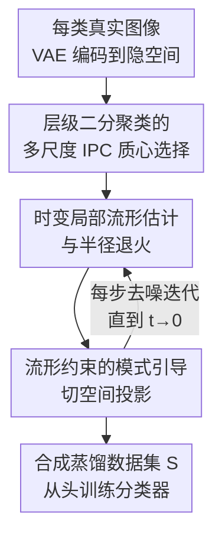

# ManifoldGD: Training-Free Hierarchical Manifold Guidance for Diffusion-Based Dataset Distillation

**会议**: CVPR 2026  
**论文**: [CVF Open Access](https://openaccess.thecvf.com/content/CVPR2026/html/Roy_ManifoldGD_Training-Free_Hierarchical_Manifold_Guidance_for_Diffusion-Based_Dataset_Distillation_CVPR_2026_paper.html)  
**代码**: https://github.com/AyushRoy2001/ManifoldGD  
**领域**: 数据集蒸馏 / 模型压缩  
**关键词**: 数据集蒸馏, 扩散模型, 流形引导, 切空间投影, 免训练

## 一句话总结
ManifoldGD 是一个免训练的扩散式数据集蒸馏框架，它把"朝类别质心吸引"的模式引导向量投影到扩散流形的局部切空间上，剔除会把样本带离数据流形的法向分量，从而在不微调任何模型的前提下让合成数据同时保住语义一致性和几何保真度，FID、ℓ2/MMD 距离与下游分类精度都稳定优于已有的免训练乃至部分训练式蒸馏方法。

## 研究背景与动机
**领域现状**：数据集蒸馏（dataset distillation）的目标是把大数据集 $D$ 压缩成一个极小的合成集 $S$（$|S|\ll|D|$），使得只用 $S$ 从头训练分类器，性能逼近用全量 $D$ 训练的结果。早期做法是 coreset 选择和梯度/轨迹匹配，但它们依赖昂贵的双层优化、对架构敏感、还难以覆盖数据分布里的稀有模式。近年来预训练扩散模型的兴起带来了新范式：直接用生成先验合成 $S$，其中训练式扩散方法（如 Min-Max Diffusion、D4M）效果好但仍要微调生成器或对合成图做 min-max/梯度匹配优化，成本高。

**现有痛点**：真正的"免训练"路线（只用现成预训练扩散模型做推理）里，引导策略很弱。要么是无引导去噪（采样语义弥散、冗余），要么是 MGD（Mode-Guided Diffusion）这类"模式引导"——朝每个类的 IPC 质心（instance-per-class centroid）做欧氏空间吸引。问题在于：这种吸引假设"质心方向在环境欧氏空间里有意义"，但真实生成流形是嵌在高维空间里的一个弯曲低维子流形，纯欧氏吸引很容易把样本拽到流形之外（off-manifold drift），导致生成质量下降、狗的腿长歪、建筑结构异常。

**核心矛盾**：模式引导 $g^t_{mode}$ 提供的是语义吸引（让样本朝类别模式靠），但它在环境空间里的方向往往含有一个垂直于数据流形的**法向分量**。随着去噪推进（$t\to0$），边缘分布 $p_t(x_t)$ 在流形附近越来越尖锐集中，哪怕很小的法向偏移都会让样本在 $p_{data}$ 下的似然急剧降低。也就是说"语义对齐"和"流形保真"被现有方法搅在一根向量里，无法独立控制。

**本文目标**：在完全免训练、只用一个预训练扩散模型 + 其自带 VAE 特征空间的前提下，（1）选出能覆盖类别从粗到细多尺度模式的 IPC 质心；（2）在每一步去噪都把引导约束在数据流形上，剔除离流形分量。

**切入角度**：把条件扩散的得分（score）显式拆成"边缘去噪 + 模式引导"两项，再对模式引导项做几何分解——投影到局部流形的切空间/法空间，只保留切向、扣掉法向。

**核心 idea**：用"切空间投影后的模式引导"代替"裸的欧氏模式引导"，让生成轨迹始终贴着数据流形走，从而第一次把"几何感知"引入免训练数据蒸馏。

## 方法详解

### 整体框架
ManifoldGD 是一个纯推理流程：给定每个类别的真实图像，先用预训练 VAE 把它们编码到隐空间，再用**层级二分聚类**在隐空间里选出一组覆盖粗到细模式的 IPC 质心（coreset）。在用预训练扩散模型（如 DiT）反向去噪生成合成图的每一步，都围绕当前质心**临时构造一个与当前噪声水平匹配的局部流形**，估计出它的切空间/法空间，然后把朝质心的模式引导向量**投影掉法向分量**，只用切向分量去更新样本。如此逐步去噪到 $t\to0$，得到既贴近类别语义又留在数据流形上的合成图，汇成蒸馏数据集 $S$。

整套方法围绕一个得分分解展开。条件扩散的得分可写成：

$$\nabla_{x_t}\log p_t(x_t\mid c)=\underbrace{\nabla_{x_t}\log p_t(x_t)}_{\text{(1) 边缘去噪}}+\underbrace{\nabla_{x_t}\log p_t(c\mid x_t)}_{\text{(2) 模式引导}}$$

其中 $c$ 是该类的 IPC 质心。第一项恢复扩散先验给出的粗略几何结构，第二项把样本朝类别语义模式拉。ManifoldGD 改造的正是第二项。

### 关键设计

**1. 流形约束的模式引导：把欧氏吸引投影到切空间，扣掉离流形分量**

这是全篇的核心，直接针对"裸模式引导会把样本拽离流形"的痛点。作者先把模式引导写成一个核亲和度的梯度：$k_\phi(x_t,c)=\exp(-\phi(\|x_t-c\|^2))$，由此 $g^t_{mode}=-\phi'(\|x_t-c\|^2)\frac{x_t-c}{\|x_t-c\|^2}$；取二次势 $\phi(r)=\frac{r^2}{2\sigma_t^2}$ 时退化为标准高斯形式 $g^t_{mode}=-\frac{1}{\sigma_t^2}(x_t-c)$，恰好对应 MGD 等已有方法。问题是这个向量在环境欧氏空间里定义，含有垂直于流形的法向分量 $\langle g^t_{mode}, n_t\rangle$（$n_t$ 属于法空间 $\mathcal{N}_{x_t}$），而 $t\to0$ 时 $p_t$ 在流形附近高度集中，小小的法向偏移就会大幅压低真实似然。

作者用**切空间投影**解决：在估计出的扩散流形 $\mathcal{M}_t$ 上构造正交投影算子 $P_{T_t}$（投到切空间 $T_{x_t}\mathcal{M}_t$）和 $P_{N_t}=I-P_{T_t}$（投到法空间）。修正后的引导为

$$g^t_{manifold}(x_t;c)=g^t_{mode}(x_t;c)-P_{N_t}\,g^t_{mode}(x_t;c)$$

即从模式引导里减去其法向分量，只保留切向。完整采样步变成 $x_{t-1}=x_t+\eta_t\big(s_\theta(x_t,t)+g^t_{manifold}\big)+\sqrt{\beta_t}\,\epsilon_t$。这样语义吸引（朝质心）和几何修正（贴流形）被解耦、可独立调权。作者也在 Remark 1 中点明权衡：严格切向投影虽保几何一致，但会因约束探索而**过度平滑**、牺牲多样性——这正是后面半径退火要缓解的。

**2. 层级二分聚类的多尺度 IPC 质心选择：用从粗到细的树状模式当引导锚点**

模式引导朝哪个 $c$ 走，决定了合成数据能否覆盖一个类别的多样模式。痛点是：简单 k-means 质心只占特征云中靠近均值的局部子区域，覆盖不全（尤其抓不到稀有模式）。本文改用**二分 k-means 的分裂式（divisive）层级聚类**在每类的 VAE 隐特征上建一棵树：根节点对应最粗的语义模式，越往叶子越细的类内变化。给定起始层 $s_{start}\in[0,L]$（控制粗细偏好）和 IPC 预算 $K$，做一次"从 $s_{start}$ 往根的粗→细扫描、每层取一个节点"，若名额没满再从叶节点随机补足。这样得到一个确定性的 coreset：类别高度重叠时用较高 $s_{start}$ 偏向全局/通用模式，否则逐步加入更细的特异模式。每个选中的 $c_s$ 还定义一个邻域 $\mathcal{N}_s$（隐空间局部区域），捕捉与 $c_s$ 相似的结构，供下一步建流形。消融显示分裂式（自顶向下）比凝聚式（agglomerative，自底向上把质心堆到外边界）和 k-means 都好，凸包面积比 $A_{CH}$ 更大、空间覆盖更均匀。

**3. 时变局部流形估计与半径退火：让流形随噪声水平动态变形、邻域随去噪收紧**

切空间投影要先有"流形"。痛点是真实数据流形未知且弯曲，而扩散过程中样本所处的噪声水平在变，流形也该随之变。作者为每个质心邻域 $\mathcal{N}_s$ 构造**与当前噪声水平匹配的局部流形**：把 $\mathcal{N}_s$ 里的点前向加噪到时刻 $t$ 的方差，$\mathcal{M}^{(s)}_t=\mathcal{N}_s+\epsilon_t,\ \epsilon_t\sim\mathcal{N}(0,(1-\bar\alpha_t)I)$，它在 $t\to0$ 时平滑收敛到嵌入 $\mathcal{M}_{data}$ 的结构。给定当前样本 $x_t$，在该局部流形片里取 $K_t$ 个最近邻、算经验协方差 $C_t$，其前 $d$ 个主特征向量张成切空间 $T_{x_t}\mathcal{M}_t$、其余正交方向张成法空间——投影算子由此得到。此外作者对邻域半径做**退火**：实验发现指数退火最好，高噪声早期用较大半径纳入更广的几何上下文，后期收紧到更局部、更接近线性的近似。这一调度把 Remark 1 的权衡落到实处——早期靠 $g^t_{mode}$ 探索，后期靠 $g^t_{manifold}$ 几何修正，并配合 $T_{STOP}$（停止引导的时刻，约在 50 步去噪的第 25 步附近）防止引导过头干扰自然去噪。

### 损失函数 / 训练策略
本方法**完全免训练**，没有任何可学习参数或反向传播：VAE、扩散骨干（DiT/LDM）全用预训练权重，IPC 质心由聚类一次性确定，流形估计与投影都是推理时的线性代数操作。关键超参为 IPC 预算 $K$、起始层 $s_{start}$、邻域大小 $K_t$、半径退火调度与 $T_{STOP}$；作者还提到用 ridge 正则协方差、自适应 $(r,K_t)$ 与退火 $\lambda_{man}$ 来平衡一致性与多样性。

## 实验关键数据

**设置**：256×256 分辨率，hard-label 协议（最难、最无偏，学生网络只用 $S$ 和离散标签训练，杜绝软标签泄漏教师信息）。数据集为 ImageNette / ImageWoof / ImageNet-100，分类器为 ConvNet-6 / ResNetAP-10 / ResNet-18，IPC=10/20/50（10 最难）。指标含分类精度 $\text{Acc}_{S\to D}$、FID、ℓ2、MMD、代表性（Rep）与多样性（Div）。每个配置三个 seed 取均值。

### 主实验
ImageNette / ImageNet-100 上（ResNetAP-10，括号为相对 MGD 的提升）：

| 数据集 | IPC | DiT* | MGD* | ManifoldGD | 训练式参照 |
|--------|-----|------|------|------------|------------|
| ImageNette | 10 | 59.1 | 61.9 | **64.1** (+2.2) | MinMaxDiff 64.8 |
| ImageNette | 20 | 64.8 | 66.5 | **69.7** (+3.2) | MinMaxDiff 71.0 |
| ImageNette | 50 | 73.3 | 77.5 | **78.4** (+1.4) | MinMaxDiff 81.2 |
| ImageNet-100 | 10 | 23.2 | 26.1 | **27.6** (+1.5) | D4M 25.7 |
| ImageNet-100 | 20 | 28.4 | 33.2 | **35.3** (+2.1) | MinMaxDiff 32.3 |

ManifoldGD 在所有 IPC 上都超过免训练基线（DiT/MGD/LDM/Random），在 ImageNet-100 上甚至反超部分训练式方法（如 IPC=20 时 35.3 高于 MinMaxDiff 的 32.3，下划线项）。ImageWoof（Tab. 2，多 IPC×多分类器）趋势一致，例如 IPC=10/ResNetAP-10 上 ManifoldGD 38.3 对 MGD 37.5（+1.3），IPC=50/ResNet-18 上 58.2 对 56.2（+2.0）。此外 FID 最低、Rep/Div 最高，ℓ2 与 MMD 也最小，印证流形一致引导同时提升保真度与分布对齐。

### 消融实验
ImageNette、IPC=10（C=聚类，L=层级，A=退火）：

| 配置 | ConvNet-6 | ResNetAP-10 | ResNet-18 | 说明 |
|------|-----------|-------------|-----------|------|
| KMeans | 56.3 | 61.0 | 59.7 | 朴素质心，覆盖差 |
| Agglomerative | 37.7 | 45.9 | 42.6 | 凝聚式最差，质心堆到外边界 |
| Divisive | 57.4 | 62.5 | 58.5 | 分裂式优于 k-means |
| Divisive-levelwise | 59.2 | 63.3 | 61.1 | 加层级选择再提升 |
| Ours（+流形引导） | 60.5 | 64.0 | 62.3 | 加 $g^t_{manifold}$ |
| Ours（annealed） | **60.8** | **64.5** | **62.7** | 再加半径退火，最佳 |

核函数消融（Tab. 5，ImageNette IPC=10）显示 $g^t_{manifold}$ 与核无关：RBF/Laplace/IMQ 三种核加上流形修正后都涨点，如 RBF 在 ResNetAP-10 上 62.5→64.4。

### 关键发现
- 法向修正贡献明确：在 divisive-levelwise 基础上加 $g^t_{manifold}$，三个分类器分别 +1.3/+0.7/+1.2，证明几何修正与层级质心选择互补。
- $T_{STOP}$ 存在甜点：引导延伸到约第 25 步（共 50 步）时 FID 与精度最佳，再往后两者都迅速恶化——后期细节阶段强加引导会过拟合、干扰自然去噪。
- 模式引导与流形引导随 $t$ 此消彼长：小 $t$（样本远离流形）需要强语义对齐 $g^t_{mode}$ 做探索，大 $t$（接近高密度区）则靠 $g^t_{manifold}$ 防离流形漂移，恰好对应 Remark 1 的权衡。
- 邻域半径指数退火 > 余弦 / 线性，呼应"早期宽上下文、后期紧局部线性近似"的直觉。

## 亮点与洞察
- 把"语义吸引"和"流形保真"用切/法空间正交分解彻底解耦，是个干净又可解释的几何视角；$g^t_{manifold}=g^t_{mode}-P_{N_t}g^t_{mode}$ 一行公式就把"别把样本拽离流形"形式化了。
- 全程免训练、纯推理：流形是用质心邻域前向加噪后取协方差主成分**临时估计**的，不需要额外训练分类器或判别器（区别于 Information-/Influence-Guided 那一类需辅助网络的方法）。
- 层级二分聚类天然给出"粗→细"的多尺度质心，靠一个 $s_{start}$ 就能根据类别可分性调节覆盖粒度，这种"用聚类树层级当采样多样性旋钮"的思路可迁移到任何需要原型/锚点的生成引导任务。
- 半径退火把"几何约束 vs 多样性"的权衡操作化成一条随去噪收紧的时间表，是缓解切空间投影过度平滑的实用 trick。

## 局限与展望
- 作者承认：高噪声时扩散会破坏局部邻域，使切空间估计有偏、流形重建变弱；低秩近似在高曲率流形上也会过度平滑、限制多样性（Remark 1）。当前靠自适应 $(r,K_t)$、ridge 正则协方差、退火 $\lambda_{man}$ 缓解，但**投影误差与曲率敏感性的形式化分析仍是未来工作**。
- 切空间维度 $d$、$K_t$、$s_{start}$、$T_{STOP}$ 等超参较多，论文给出经验取值但缺乏跨数据集的自动选择策略。⚠️ 具体调参流程以原文与补充材料为准。
- 评测集中在 ImageNet 子集（Nette/Woof/100）与 256×256，未见更大规模或更高分辨率上的验证。

## 相关工作与启发
- **vs MGD（Mode-Guided Diffusion）**: MGD 用纯欧氏吸引把样本朝 k-means/质心拉，本文证明其等价于 RBF 核下的 $g^t_{mode}$；ManifoldGD 在其上加切空间投影剔除法向分量，并把质心选择从 k-means 换成层级二分聚类，FID 更低、精度更高。
- **vs 训练式扩散蒸馏（MinMaxDiff / D4M / GLaD）**: 它们要微调生成器或对合成图做 min-max/梯度匹配优化，成本高；ManifoldGD 完全免训练却在多处达到可比甚至反超的精度。
- **vs Information-/Influence-Guided Diffusion**: 这些方法用信息论目标或影响力分数做更"原则化"的引导，但都依赖单独训练的分类器或判别器；ManifoldGD 只用扩散骨干自带的 VAE 特征空间，无需任何辅助监督。

## 评分
- 新颖性: ⭐⭐⭐⭐⭐ 首个把切/法空间几何修正引入免训练数据蒸馏，视角清晰且可解释。
- 实验充分度: ⭐⭐⭐⭐ 多数据集×多分类器×多 IPC + 五项指标 + 充分消融，但规模限于 ImageNet 子集。
- 写作质量: ⭐⭐⭐⭐ 得分分解→流形修正的推导连贯，Remark 把权衡讲透；部分符号略密。
- 价值: ⭐⭐⭐⭐ 免训练、即插即用、与核/调度器无关，对算力受限的蒸馏研究很实用。

<!-- RELATED:START -->

## 相关论文

- [\[CVPR 2026\] DMGD: Train-Free Dataset Distillation with Semantic-Distribution Matching in Diffusion Models](dmgd_train-free_dataset_distillation_with_semantic-distribution_matching_in_diff.md)
- [\[CVPR 2026\] Mitigating The Distribution Shift of Diffusion-based Dataset Distillation](mitigating_the_distribution_shift_of_diffusion-based_dataset_distillation.md)
- [\[CVPR 2026\] IMS3: Breaking Distributional Aggregation in Diffusion-Based Dataset Distillation](ims3_breaking_distributional_aggregation_in_diffusion-based_dataset_distillation.md)
- [\[CVPR 2026\] Dataset Distillation by Influence Matching](dataset_distillation_by_influence_matching.md)
- [\[CVPR 2026\] Balanced Dataset Distillation via Modeling Multiple Visual Pattern Distribution](balanced_dataset_distillation_via_modeling_multiple_visual_pattern_distribution.md)

<!-- RELATED:END -->
