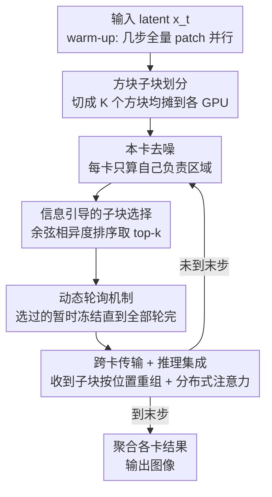

# Otil: Accelerating Diffusion Model Inference via Communication-Efficient Multi-GPU Parallelism

**会议**: CVPR 2026  
**论文**: [CVF Open Access](https://openaccess.thecvf.com/content/CVPR2026/html/Li_Otil_Accelerating_Diffusion_Model_Inference_via_Communication-Efficient_Multi-GPU_Parallelism_CVPR_2026_paper.html)  
**代码**: https://github.com/uplaoli/OTIL-PROJECT  
**领域**: 模型压缩 / 扩散模型推理加速  
**关键词**: 多GPU并行, 扩散模型, 通信优化, 推理加速, 即插即用

## 一句话总结
Otil 发现扩散去噪相邻两步的 latent 激活只在少数空间区域显著变化，于是在多 GPU 并行推理时**只传输变化最大的少数子块**，再用动态轮询保证所有区域终会被覆盖，把 GPU-GPU 通信量最多砍掉 87.5%，在 PCIe 互联下实现 1.8×（2 卡 SD1.5）到 2.6×（4 卡 SDXL）的加速，且无需重训、兼容 few-step 采样器和 LoRA。

## 研究背景与动机
**领域现状**：扩散模型在图像/视频生成上效果惊艳，但天生是多步串行去噪，累计延迟很高。要在不改模型的前提下降延迟，工业部署里最现实的路子是**多 GPU 并行**——把一次去噪的计算拆到多张卡上同时算。目前主流的并行范式有两类：patch 方法（DistriFusion 等，把整张图切块分到各卡）和 pipeline 方法（AsyncDiff 等，把去噪网络按层切成流水级）。

**现有痛点**：去噪过程的串行依赖让计算和通信很难重叠。每走一步，各卡都要把自己算出的中间激活同步给别人，才能进入下一步——于是 patch 方法每步广播整份激活，pipeline 方法每步在 p 个流水级之间全量交换中间结果。这笔通信开销在 PCIe 这种低带宽互联下极其昂贵，**通信延迟甚至能把并行省下来的时间又吃回去**，卡越多越严重。更糟的是 pipeline 方法和 few-step 采样器不兼容、每卡还要独立放一份噪声预测器，进一步限制了加速收益。

**核心矛盾**：并行的收益来自把计算摊给多卡，但代价是每步都要全量同步激活；**带宽越低、卡越多，"全量同步"这件事就越是瓶颈**。问题根子在于——大家默认"每步都得把完整激活传给别人"，可这个前提真的成立吗？

**本文目标**：在不重训、不改架构、保持与加速采样器兼容的前提下，把多 GPU 扩散推理的通信量大幅压下来，同时不掉生成质量。

**切入角度**：作者观察到两个关键事实——① 相邻去噪步的输出激活差异很小（相邻步 latent 的相对 MAE 很低）；② 这些差异并非均匀铺满全图，而是**集中在一小撮空间区域**。既然每步真正"变了"的只是少数区域，那把整份激活都传出去就是巨大浪费。

**核心 idea**：Only Transmit Informative Latents——每步只把**变化最剧烈的那几个子块**同步给其他卡，其余不变的区域直接复用旧值；再加一个动态轮询机制兜底，保证长期看每个区域都被更新到，不会有死角永远被忽略。

## 方法详解

### 整体框架
Otil 把一张图的 latent 激活均匀切成方块子块，分摊到多张 GPU 上各算各的区域；每走一步去噪后，每卡只挑出自己负责区域里"变化最大"的 top-k 子块发给别人，别人收到后按空间位置塞回自己的 latent，从而在只传一小部分数据的情况下，让每张卡都维持一份"完整"的全图激活。整条流程是：先用几步全量同步的 patch 并行做 warm-up（让每卡都拿到完整 latent），之后进入 Otil 主循环——本卡去噪 → 算子块变化 → top-k 选择 + 动态轮询调度 → 跨卡传输 → 收到后重组 latent → 进入下一步，最后一步前把所有卡结果聚合。

### 关键设计

**1. 方块子块划分：给"按区域选传"提供合适的粒度**

要做到"只传变化的区域"，首先得把激活切成可单独度量、单独传输的单元。Otil 把每卡上的 latent 激活 $x_t^{(n)} \in \mathbb{R}^{C \times H \times W}$ 均匀划分成 $K$ 个互不重叠的方块子块，用算子 $\Pi_i(\cdot)$ 取第 $i$ 个子块。为什么用方块而不是任意形状？作者借用了 CNN 感受野的直觉：视觉激活的语义是局部聚集的，方块能保持局部空间连贯性，既符合激活的空间组织，又给下一步"信息引导通信"提供了天然的度量与传输单元。子块大小是个 trade-off——太小则子块数 $K$ 多、每步要算的余弦相似度多、加上排序开销反而拖慢通信；太大则会把"局部细微但关键的变化"整块抹掉，掉细节。实验最终选 $8 \times 8$。

**2. 信息引导的子块选择：用相邻步相似度找出"真正变了"的区域**

这是 Otil 省通信的核心。基于"相邻步只在少数区域变化"的观察，每步去噪后，对每个子块计算它和上一步同位置子块的余弦相似度（Frobenius 内积归一化）：

$$s_t^{(n)}(i) = \frac{\langle \Pi_i x_t^{(n)},\ \Pi_i x_{t+1}^{(n)} \rangle_F}{\|\Pi_i x_t^{(n)}\|_F \, \|\Pi_i x_{t+1}^{(n)}\|_F}$$

定义相异度 $d_t^{(n)}(i) = 1 - s_t^{(n)}(i)$，取相异度最大的 top-k 子块集合 $\mathcal{A}_t^{(n)} = \mathrm{Topk}_i(d_t^{(n)}(i), k)$，**只把这 k 个子块跨卡传输**，其余子块各卡沿用旧值。这个"只传少数"的合法性来自扩散更新规则 $x_{t-1} = \alpha_t x_t + \beta_t \hat\varepsilon_\theta(x_t, t)$：噪声预测 $\hat\varepsilon_\theta$ 的局部变化会在大致相同的空间区域引起 $x_{t-1}$ 的成比例变化，加上 LDM 的 latent-to-image 解码器是局部光滑的，所以**latent 上变化大的子块，恰好对应最终图像上真正在演化的区域**。作者也对比了 random / SSIM / 余弦 / 互信息 / dHash 五种排序准则（用 AUC 衡量 latent 变化与像素变化的对齐度），结果余弦相似度对齐得最好，证实了"低变化子块对生成贡献甚微、可安全跳过通信"这一假设。

**3. 动态轮询机制：防止低变化区域被永远饿死**

只按 top-k 独立选会有个隐患：某些区域可能一直变化大、被反复更新，而另一些低变化区域**永远排不进 top-k，长期得不到同步**，导致空间覆盖不全、细节丢失。动态轮询用一个循环调度兜底：某子块一旦在某步被选中，就**暂时冻结**，直到当前轮次里其他所有子块都被访问过才解冻。设 $\mathcal{U}_t$ 为本轮尚未访问的子块集合，更新规则为

$$\mathcal{A}_t^{(n)} \subseteq \mathcal{U}_t, \qquad \mathcal{U}_{t+1} = \begin{cases} \mathcal{U}_t \setminus \mathcal{A}_t^{(n)}, & \mathcal{U}_t \neq \varnothing \\ \{1,2,\dots,K\}, & \text{否则} \end{cases}$$

即每步只从"未访问集合"里挑 top-k，挑空一轮就重置。这保证了**在若干步内每个子块恰好被更新一次**，既守住全局完整性，又在通信开销极小的前提下做到局部精修——把"省通信"和"不丢区域"这对矛盾化解掉了。

**4. 推理集成与分布式注意力：让省下来的传输无缝接回标准去噪**

每卡在当前步的输入由三部分拼成：① 自己上一步去噪产生的激活，② 早先迭代保留下来的"过期"激活（那些没被传输、复用旧值的区域），③ 本步从其他卡新收到的子块。收到后按空间位置把子块重新嵌回 $x_{t-1}$，**重建出一份完整、空间连贯的 latent**——虽然只传了一小部分，但融合后每卡都拥有全图视角。注意力上沿用 DistriFusion 的分布式注意力策略：每卡保留自己负责区域的 query token，而 key/value token 跨整张 latent 共享。这样每卡上的去噪计算和原始扩散完全一致、计算量只取决于它负责区域的大小，于是 Otil **保持了标准扩散的推理语义**，从而天然兼容 few-step 采样器（DPM-Solver、UniPC）和 LoRA 这类加速手段——这正是 pipeline 方法做不到的。

### 损失函数 / 训练策略
Otil **完全免训练、不改架构**，直接作用于预训练扩散模型（SD1.5 / SDXL / SD3）的推理阶段，没有任何损失函数。唯一的"预热"是：除第 1 步外，再做 4 步同步 patch 并行作为 warm-up，让各卡先拿到完整 latent，之后才进入只传 informative 子块的主循环。通信成本可解析对比：设激活大小 $M$、并行度 $p$、切成 $K$ 块只传 $k$ 块，则 DistriFusion 每步 $(p-1)M$、AsyncDiff 每步 $p(p-1)M$、Otil 每步仅 $\frac{k}{K}(p-1)M$。取 $\frac{k}{K}=\frac{1}{4}$ 即相对全量交换省 75% 通信。

## 实验关键数据

数据集为 COCO Captions 2014（验证集随机抽 5000 image-caption 对），A100 + PCIe 互联，50 步 DDIM、CFG=5。对比 5 个 SOTA 并行基线：DistriFusion、AsyncDiff、ParaStep、PipeFusion、CompactFusion。

### 主实验

| 基座模型 | 卡数 | 方法 | 延迟(s)↓ | Speedup↑ | FID↓ | CLIP↑ |
|----------|------|------|---------|----------|------|-------|
| SD1.5 512² | 1 | Original | 1.382 | 1× | – | 31.485 |
| SD1.5 512² | 2 | DistriFusion | 1.012 | 1.36× | 25.133 | 31.450 |
| SD1.5 512² | 2 | **Otil** | **0.794** | **1.74×** | 23.145 | 31.440 |
| SDXL 1024² | 2 | DistriFusion | 3.940 | 1.50× | 26.599 | 36.102 |
| SDXL 1024² | 2 | **Otil** | **3.140** | **1.88×** | 25.171 | 36.132 |
| SDXL 1024² | 4 | DistriFusion | 3.240 | 1.82× | 24.236 | 36.014 |
| SDXL 1024² | 4 | **Otil** | **2.650** | **2.23×** | 23.347 | 36.022 |
| SD3 (DiT) 1024² | 2 | PipeFusion | 2.626 | 1.12× | 20.159 | 31.247 |
| SD3 (DiT) 1024² | 2 | **Otil** | **1.711** | **1.72×** | 20.334 | – |

Otil 在所有配置下延迟都最低；卡越多通信越主导，Otil 的优势越明显（4 卡 SDXL 把 2.23× 拉到比基线高）。CLIP 与 FID 与 DistriFusion 持平、相对原始扩散仍在高质量区间。通信量上：$\frac{k}{K}=\frac14$ 时相对 AsyncDiff 省 **87.5%（2 卡）/ 93.75%（4 卡）**、相对 DistriFusion 省 75%。

兼容性（Table 2，SDXL/SD1.5 配快采样器与 LoRA）：

| 基座 | 配置 | Original Speedup | Otil(2卡) Speedup |
|------|------|------------------|-------------------|
| SDXL | + DPM-Solver(30步) | 1.69× | **2.79×** |
| SDXL | + UniPC(30步) | 1.66× | **2.84×** |
| SD1.5 | + LoRA(30步) | 1.78× | **2.46×** |

叠加 few-step 采样器后，2 卡加速进一步升到 2.46×–2.84×，且图像内容/保真度基本不变，验证了"保持标准推理语义"带来的即插即用兼容性。

### 消融实验

| 实验 | 变量 | 结论 |
|------|------|------|
| 传输子块比例 $\frac{k}{K}$ | 1/16 → 1/2 → 全量 | 比例越小通信越省但质量降；$\frac14$ 是延迟/保真度最佳折中（SD1.5 2卡：1/4 时 13.70ms/LPIPS 0.0425 vs 全量 16.23ms/0.0405） |
| 子块大小 | 4×4 / 8×8 / 16×16 | 太小排序开销大反而慢，太大丢细节；8×8 综合最优（SDXL 2卡 8×8：27.53ms/LPIPS 0.0142） |
| 选择准则 | random/SSIM/余弦/互信息/dHash | 余弦相似度在 AUC 上对 latent↔像素变化对齐最好，证明"低变化子块可安全跳过" |

### 关键发现
- **通信是多 GPU 扩散的真瓶颈**：卡越多、带宽越低，全量同步开销越主导 Otil 的相对优势随卡数增大而扩大（4 卡比 2 卡相对基线领先更多）。
- **$\frac14$ 比例是甜点**：低于 1/4 质量明显塌、高于 1/4 延迟收益递减；这个比例直接决定省 75%/87.5%/93.75% 的数字。
- **余弦相似度选块有理论支撑**：扩散更新规则 + LDM 解码器局部光滑，保证 latent 变化大的子块对应像素上真正演化的区域，所以选块不是凭经验而是有依据。
- **动态轮询是质量保险**：没有它，低变化区域会被 top-k 长期饿死、丢细节；有它则保证 K 步内每块恰好更新一次。

## 亮点与洞察
- **把"扩散相邻步冗余"从时间维度搬到空间维度利用**：很多加速工作利用相邻步相似来做缓存复用（时间冗余），Otil 进一步指出这种相似在**空间上是不均匀的**，于是把它转化成"只传少数空间子块"的通信压缩——视角很巧。
- **动态轮询是个轻量却关键的兜底**：纯 top-k 会制造"长期饥饿"区域，作者用一个 O(1) 的循环冻结调度就保证了完整覆盖，几乎零额外成本，是可迁移到任何"稀疏选择 + 完整性要求"场景的 trick。
- **免训练 + 保留标准推理语义带来真·即插即用**：因为去噪计算与原始扩散逐位一致，Otil 能直接叠在 DPM-Solver/UniPC/LoRA 上继续加速，这点比和 few-step 不兼容的 pipeline 方法实用得多。
- **通信成本给了闭式表达**：$\frac{k}{K}(p-1)M$ 让人一眼看清省了多少、和 $p$/$k$/$K$ 怎么挂钩，便于按硬件带宽调参。

## 局限与展望
- 作者承认 Otil 质量相比 DistriFusion 略低（如 SDXL 4 卡 LPIPS 0.135 高于 DistriFusion 0.069），是用质量换通信的折中；对保真度极端敏感的场景需谨慎。
- 实验集中在 PCIe 低带宽互联，正是 Otil 最受益的场景；在 NVLink 等高带宽下通信不再是瓶颈，加速收益可能大幅缩水（论文未给这类对照）。
- warm-up 仍需几步全量同步，步数很少的 few-step 场景里 warm-up 占比会上升，可能稀释收益；如何缩短/省掉 warm-up 值得探索。
- top-k 与 $\frac{k}{K}$、子块大小都是全局静态超参，未随时间步/内容自适应；后期去噪步变化更集中，理论上可动态调小 $k$ 进一步省通信。

## 相关工作与启发
- **vs DistriFusion（patch 方法）**: 都做空间切块并行、都用分布式注意力，但 DistriFusion 每步广播完整激活 $(p-1)M$，Otil 只传 top-k 子块 $\frac{k}{K}(p-1)M$，省 75% 通信、延迟更低，代价是质量略降。
- **vs AsyncDiff / PipeFusion（pipeline 方法）**: 它们把去噪网络切成流水级、每步全量交换中间结果 $p(p-1)M$，且和 few-step 采样器不兼容、每卡要放独立预测器；Otil 通信量低一个量级（省 87.5%–93.75%），并保持标准推理语义因而兼容快采样器。
- **vs CompactFusion（压缩通信内容）**: CompactFusion 用低比特量化压缩要传的激活；Otil 走的是"少传"而非"压着传"的正交路线，两者原则上可叠加。

## 评分
- 新颖性: ⭐⭐⭐⭐ 把"相邻步冗余在空间上不均匀"转化为通信压缩，配动态轮询兜底，角度新颖且自洽。
- 实验充分度: ⭐⭐⭐⭐ 覆盖 SD1.5/SDXL/SD3 三种基座、2/4 卡、5 个基线 + 三组消融，但仅 PCIe、缺 NVLink 对照。
- 写作质量: ⭐⭐⭐⭐ 动机清晰、公式与图配合好；个别处有 typo（motheds/mian）。
- 价值: ⭐⭐⭐⭐ 免训练即插即用、兼容快采样器和 LoRA，对低带宽多卡部署很实用。

<!-- RELATED:START -->

## 相关论文

- [\[ICML 2026\] Learned Subspace Compression for Communication-Efficient Pipeline Parallelism](../../ICML2026/model_compression/learned_subspace_compression_for_communication-efficient_pipeline_parallelism.md)
- [\[CVPR 2026\] PyramidalWan: On Making Pretrained Video Model Pyramidal for Efficient Inference](pyramidalwan_on_making_pretrained_video_model_pyramidal_for_efficient_inference.md)
- [\[CVPR 2026\] Mitigating The Distribution Shift of Diffusion-based Dataset Distillation](mitigating_the_distribution_shift_of_diffusion-based_dataset_distillation.md)
- [\[CVPR 2026\] IMS3: Breaking Distributional Aggregation in Diffusion-Based Dataset Distillation](ims3_breaking_distributional_aggregation_in_diffusion-based_dataset_distillation.md)
- [\[CVPR 2026\] Test-time Sparsity for Extreme Fast Action Diffusion](test-time_sparsity_for_extreme_fast_action_diffusion.md)

<!-- RELATED:END -->
