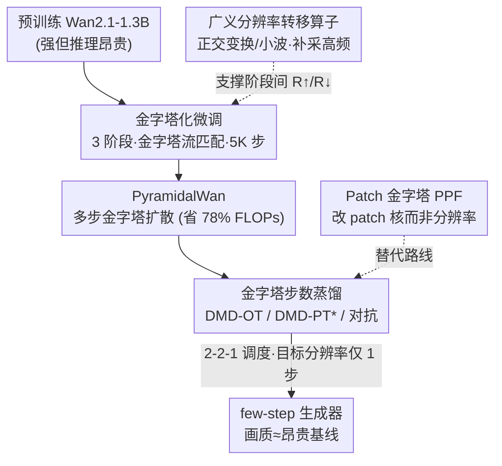

# PyramidalWan: On Making Pretrained Video Model Pyramidal for Efficient Inference

**会议**: CVPR 2026  
**论文**: [CVF Open Access](https://openaccess.thecvf.com/content/CVPR2026/html/Korzhenkov_PyramidalWan_On_Making_Pretrained_Video_Model_Pyramidal_for_Efficient_Inference_CVPR_2026_paper.html)  
**代码**: [项目页](https://qualcomm-ai-research.github.io/PyramidalWan)  
**领域**: 模型压缩 / 视频扩散加速  
**关键词**: 视频扩散、金字塔流匹配、步数蒸馏、DMD、高效推理

## 一句话总结
把一个**已经预训练好**的视频扩散模型（Wan2.1-1.3B）用极低成本微调改造成「金字塔」模型——高噪声阶段在低分辨率上算、低噪声阶段在高分辨率上算——在画质几乎不掉的前提下把推理 FLOPs 砍掉约 78%；再叠加针对金字塔结构定制的步数蒸馏（DMD / 对抗），做到只在目标分辨率上跑 1 步、其余阶段几步即可生成，速度与画质都逼近昂贵基线。

## 研究背景与动机
**领域现状**：当前视频扩散模型（Wan、CogVideo 等）画质很强，但多步去噪推理极其昂贵。降本的主流路线有两条——**步数蒸馏**（把几十步 teacher 蒸成几步 student）和**架构优化**（量化、稀疏化等）。近来又冒出第三条路：让模型在**不同噪声水平用不同分辨率**处理，即「金字塔」模型。

**现有痛点**：金字塔这条路的理论由 PyramidalFlow 奠定，但已有的开源金字塔视频模型都是**从零训练**的，而且受限于算力规模，画质明显落后于 SOTA 系统。也就是说，金字塔结构省算力的好处是真的，但「画质」这块还没人能和顶尖模型掰手腕。

**核心矛盾**：从零训练一个能打的金字塔视频模型代价太大；而业界已经有大量训练好的强力扩散模型。问题变成——**能不能不重训、只用很便宜的微调，就把一个现成的强模型「金字塔化」，同时不掉画质？**

**切入角度**：作者抓住一个物理观察——**谱自回归（spectral autoregression）**：自然信号在频谱分解里，高频分量幅度本来就小，且在前向扩散中**最早被噪声淹没**。既然高频信息在高噪声阶段已经没了，那高噪声阶段就没必要在高分辨率（=保留高频）上算，完全可以降分辨率、少算 token。这正是金字塔结构省算力的根本依据。

**核心 idea**：以 Wan2.1-1.3B 为起点，用 PyramidalFlow 框架把它的前向/反向扩散拆成 3 个时空分辨率阶段，用金字塔流匹配损失做 5K 步的轻量微调即可完成「金字塔化」；在此基础上系统地研究并适配多种步数蒸馏策略，把推理进一步压到「目标分辨率仅 1 步」。

## 方法详解

### 整体框架
方法分两层。**第一层「金字塔化」**：取预训练好的 Wan2.1-1.3B，把扩散过程切成 $S=3$ 个时空阶段，分辨率分别为 $81\times448\times832$、$41\times224\times416$、$21\times112\times208$（沿帧数、高、宽三个轴同时降采样）；阶段 $i=0$ 是原始（最高）分辨率、处理最干净的输入，阶段 $i=S-1$ 是最低分辨率、处理最噪的输入。用金字塔流匹配损失（外加一项把 student 对齐 teacher 的蒸馏损失）做 5K 步全参微调，得到多步金字塔模型 **PyramidalWan**，单这一步就省 78% 算力。**第二层「步数蒸馏」**：在金字塔结构上适配 DMD 与对抗蒸馏，把多步 teacher 蒸成「2-2-1」few-step 生成器（低→中→高分辨率各 2、2、1 步，**目标分辨率仅 1 步**）。底层还有一个理论支撑件——**广义分辨率转移算子**，让阶段间上/下采样可用任意正交变换（如小波）；并提供一条替代路线 **Patch 金字塔（PPF）**，靠改 patch 核大小而非改分辨率达到同样的 token 削减。

### 关键设计

**1. 金字塔化微调：用流匹配把高噪声阶段挪到低分辨率**

痛点是金字塔模型以前只能从零训练、画质打不过 SOTA。作者证明这件事可以「白嫖」预训练权重：在 PyramidalFlow 框架下，每个阶段 $i$ 定义两个边界噪声水平 $\sigma_c^{(i)}<\sigma_n^{(i)}$，对应阶段内最干净与最噪两端；中间任意全局噪声 $\sigma$ 处的带噪信号由两端线性插值得到

$$x_\sigma^{(i)}=(1-\rho)\,y_c^{(i)}+\rho\,y_n^{(i)},\qquad \rho=\frac{\sigma-\sigma_c^{(i)}}{\sigma_n^{(i)}-\sigma_c^{(i)}}$$

其中 $\rho$ 是阶段内「局部噪声水平」。框架的关键约束是一条跨阶段的分布等价式 $\mathcal{R}^\uparrow_{\mathcal{N}}(y_c^{(i+1)})\stackrel{d}{=}y_n^{(i)}$——即上一阶段较干净的边界样本，经过「上采样 + 加一点非独立的校正噪声」后，恰好等于本阶段较噪的边界样本（校正噪声用来给上采样后相邻像素去相关）。这条约束保证了每个真实噪声水平 $\varsigma$（natural noise level）在整个金字塔里是**唯一**的条件值，与阶段数无关，于是去噪网络能无缝地跨阶段衔接。微调目标就是让 student $F_\theta$ 预测带噪信号对全局噪声水平的导数（保持 Wan 原本的流匹配性质）：

$$\mathcal{L}_{\text{pyr}}(\theta)=\sum_i \mathbb{E}\Big\lVert F_\theta\big(x_\sigma^{(i)},\varsigma\big)-\tfrac{d x_\sigma^{(i)}}{d\sigma}\Big\rVert^2$$

一个实操细节很关键：阶段内「干净信号」$x_0^{(i)}$ 有两种构造法——**①** 在 VAE latent 空间反复下采样，**②** 先在 RGB 像素空间下采样再过 VAE 编码。作者发现用 ②（像素空间下采样）训练出来的视觉质量明显更好，这与 SwD 的结论一致。这一步之所以有效，是因为它没有改动 Wan 的去噪能力本身，只是把「在哪个分辨率上花算力」这件事按噪声水平重新分配，因此 5K 步轻量微调就够。

**2. 金字塔步数蒸馏：把昂贵 teacher 蒸成「目标分辨率仅 1 步」**

金字塔扩散虽已省 78% 算力，但仍是多步的。作者把分布匹配蒸馏（DMD）和对抗蒸馏都搬进金字塔框架，并区分了 teacher 的两种来源。**(a) 原始 teacher（DMD-OT）**：直接拿没金字塔化的原始 Wan 当 teacher，student 单步预测各阶段干净信号，再按 teacher 的前向过程重新加噪、用 fake score 网络估分，按 DMD 梯度更新；样本权重 $w_{\text{dmd}}=\sigma\cdot\lVert F-\tfrac{d\hat x}{d\sigma}\rVert_1^{-1}$ 偏向那些「重新加噪后能被 teacher 很好去噪」的样本。但作者发现原始 Wan 根本生不出最低分辨率（$i=S-1$）的视频，于是先用流匹配在多分辨率视频上把 teacher 简单微调一下再蒸。**(b) 金字塔 teacher（DMD-PT）**：当 teacher 本身是金字塔模型时，DMD 需要重新推导——因为标准 DMD 依赖估计噪声 $\varepsilon$，而金字塔下的边界样本是 $\hat y_c,\hat y_n$ 的线性组合，作者利用恒等式 $\mathcal{R}^\uparrow\!\circ\!\mathcal{R}^\downarrow\!\circ\!\mathcal{R}^\uparrow\!\circ\!\mathcal{R}^\downarrow=\mathcal{R}^\uparrow\!\circ\!\mathcal{R}^\downarrow$ 推出 $\varepsilon$ 的**闭式表达**，进而给出带 $\tilde\beta,\tilde\gamma$ 归一化权重的金字塔 DMD 梯度 $\nabla_\xi\mathcal{L}_{\text{dmd-pyr}}$。有意思的是，把权重粗暴设成 $\tilde\beta_1=\tilde\gamma_1=1,\ \tilde\beta_2=\tilde\gamma_2=0$ 的简化版（理论上站不住脚）反而经验上略好，记作 **-PT\***。推理时采用 **2-2-1 调度**（低、中、高分辨率各 2、2、1 步），关键就是**目标/最高分辨率只跑 1 步**——而该步恰是最贵的一步，所以收益巨大。

**3. 广义分辨率转移算子：把上/下采样推广到任意正交变换**

PyramidalFlow 原版的阶段转移只用了平均池化（$\mathcal{R}^\downarrow$）和最近邻上采样（$\mathcal{R}^\uparrow$），上采样后还要加一份导出好的校正噪声去相关。痛点是这把方法绑死在两个最简单的重采样算子上。作者把 $\mathcal{R}^\downarrow,\mathcal{R}^\uparrow,\mathcal{R}^\uparrow_{\mathcal{N}}$ 推广到**任意基于正交变换的重采样**（例如小波），并指出原版用的平均池化 + 最近邻上采样其实就是 **Haar 小波算子的缩放特例**，天然落进这个统一框架。推广的关键在于：上采样前先从高斯噪声里**采出缺失的高频分量**，这样即便上采样涉及像素间相互作用（不像最近邻那样逐像素独立），也能正确去相关、维持 Eq.(5) 的分布等价。这是一项偏理论的贡献，让金字塔框架的设计空间从「两种固定算子」打开到「一类算子」。

**4. Patch 金字塔（PPF）：改 patch 核而非改分辨率的替代路线**

与其改去噪 Transformer 的输入分辨率，PPF 选择**按噪声水平调整 patchifier/unpatchifier 的核大小**：早期（高噪声）阶段加大核 → token 数变少 → 最重的 Transformer 块在更少 token 上算，效率收益与改分辨率的金字塔流匹配相同，但好处是**省掉了阶段转移的数学推导**，扩散训练/蒸馏/推理都能像原始 Wan 那样跑。作者的实证发现是：在有限训练预算下，PPF 做扩散式微调**打不过** PyramidalFlow（视频上甚至难收敛），但它在**蒸馏成 few-step** 这件事上仍是强候选——并且本文**首次**证明 patch 金字塔模型能被成功蒸成少步视频生成器（哪怕初始化它的 PPF 扩散 checkpoint 本身画质很差，DMD 的 mode-seeking 反 KL 目标依然能把它救回来）。

### 损失函数 / 训练策略
- **金字塔流匹配损失** $\mathcal{L}_{\text{pyr}}$（Eq.7）做金字塔化微调，局部噪声 $\rho\sim\text{Uni}(0,1)$；可叠加蒸馏损失 $\mathcal{L}_{\text{dist}}$ 把 student 部分去噪的 latent 对齐 teacher 预测。
- **DMD 蒸馏**：DMD 梯度 + fake score 的流匹配损失 $\mathcal{L}_{\text{fm}}$ + 一项权重 0.01 的监督项 $\mathcal{L}_{\text{teach}}$ 稳训练；DMD-PT/PT\* 用 LoRA 适配器避免发散。
- **对抗蒸馏**：冻结的扩散骨干当特征提取器 $F^\dagger$ + 可训练判别头 $D_\varphi$（空间/时间双分支轻量卷积），Hinge 损失；生成器 $\mathcal{L}_G=\lambda_{\text{adv}}\!\cdot$对抗 $+\lambda_{\text{rec}}\!\cdot$重建，经验最优 $\lambda_{\text{adv}}=1,\lambda_{\text{rec}}=2$。
- **数据/算力**：用 Wan2.1-14B 合成的 80K 视频（合成数据比真实视频效果更好）；金字塔系列模型仅在 2×H100 上微调 5K 步（batch 6/GPU，每阶段 2 个样本）；分辨率从 480×832 微调到 448×832 以让长宽都能被 64 整除、兼容 Wan 最低阶段的 patch 层。

## 实验关键数据

### 计算成本与延迟

| 推理方式 | 调度(低→高分辨率步数) | TFLOPs ↓ |
|---|---|---|
| 原始扩散 | 0-0-50 | 2×12,592 |
| 金字塔扩散 | 20-20-10 | 2×2,821（≈4.5× 更省） |
| 原始步数蒸馏 | 0-0-2 | 504 |
| 金字塔步数蒸馏 | 2-2-1 | 282 |
| 金字塔步数蒸馏 | 1-1-1 | 267 |

单次去噪前向延迟：PyramidalWan 高分辨率阶段 631.77ms、中 33.76ms、低 7.62ms；2-2-1 调度比 0-0-2 快 **43%**，仅比 0-0-1 慢 13%。

### 主实验（VBench / VBench-2.0）

| 模型 | 调度 | VBench Total ↑ | VBench Semantic | VBench-2.0 Total ↑ |
|---|---|---|---|---|
| Wan2.1-1.3B | 50 步 | 82.49 | 78.57 | 56.02 |
| **PyramidalWan** | 20-20-10 | 82.83 | **80.70**（最高语义分） | 54.93 |
| Wan-DMD | 2 步 | 83.28 | 80.41 | 56.67 |
| Wan-DMD | 1 步 | 79.45 | 74.75 | 53.17（单步画质崩） |
| **PyramidalWan-DMD-OT** | 2-2-1 | 82.86 | 79.80 | 55.36 |
| **PyramidalWan-DMD-PT\*** | 2-2-1 | 82.72 | 79.75 | 51.75 |

PyramidalWan 多步版 VBench 与 50 步原始 Wan 持平、还拿下最高语义分，但 FLOPs 省 ≈4.5×。few-step 金字塔模型在「目标分辨率仅 1 步」这一最难场景填上了原始蒸馏单步会崩的空缺：2-2-1 各模型 VBench 总分都与扩散模型相当，仅比 Wan-DMD 2 步略低。

### 用户研究（700 份成对偏好）

| 基线 | Ours % | 无偏好 % | 基线 % | p 值 |
|---|---|---|---|---|
| Wan（50 步） | 29.1 | 29.1 | 41.7 | <0.001 |
| Wan-DMD（2 步） | 33.1 | 35.4 | 31.4 | <0.001 |

作者选了「视觉最讨喜」的 **DMD-PT\***（尽管它 VBench-2.0 偏低）做研究。二项检验拒绝「基线被严格偏好」的假设：人眼看不出与昂贵基线的显著画质差，弥补了 VBench-2.0 量化分上的落差。

### 消融实验

| 模型 | VBench ↑ | VBench-2.0 ↑ | 说明 |
|---|---|---|---|
| PyramidalWan-DMD-PT\* | 82.72 | 51.75 | 简化版 DMD 目标，经验最好 |
| PyramidalWan-DMD-PT\* w/o $\mathcal{L}_{\text{teach}}$ | 82.44 | 52.36 | 去监督项 VBench-2.0 升，但动态度(运动量)下降 |
| PyramidalWan-DMD-PT | 82.56 | 50.67 | 完整(非简化)DMD-PT 目标更差 |

另：PyramidalWan 去掉蒸馏损失后 VBench-2.0 从 54.93 降到 54.02。

### 关键发现
- **目标分辨率「1 步」是性价比拐点**：最高分辨率那一步最贵（631ms vs 7.6ms），把它压到 1 步、其余阶段多跑几步，是 2-2-1 调度收益最大的原因。
- **简化版反而更好**：理论上没依据的 DMD-PT\*（只保留一阶项）比完整 DMD-PT 经验更优，作者也坦承没解释清，留作 future work。
- **去监督项有 trade-off**：删掉 $\mathcal{L}_{\text{teach}}$ 能提 VBench-2.0，但明显减少视频里的运动量（Dynamic Degree），说明该项在稳住运动幅度上有用。
- **PPF 在视频扩散上难收敛**，但能被蒸馏救活——揭示 few-step 蒸馏对初始化质量的容忍度比扩散训练高得多。

## 亮点与洞察
- **「白嫖预训练权重」做金字塔化**：以往金字塔模型从零训练打不过 SOTA，本文证明 5K 步轻量微调就能把强模型金字塔化且不掉画质，把这条路从「研究玩具」推向「能用」——这是最实用的洞察。
- **把谱自回归落到分辨率分配上**：高频早被噪声淹没 → 高噪声阶段没必要保高分辨率 → 按噪声水平分配算力，物理直觉和工程收益完全对齐。
- **闭式噪声估计让 DMD 兼容金字塔 teacher**：利用 $\mathcal{R}^\uparrow\!\circ\!\mathcal{R}^\downarrow$ 的幂等性推出 $\varepsilon$ 闭式解，是把 DMD 搬进金字塔的关键技术点，可迁移到其他「带分辨率切换的蒸馏」场景。
- **量化分与人眼的背离值得警惕**：DMD-PT\* 的 VBench-2.0 偏低却在用户研究里与昂贵基线打平，提醒做视频生成评测不能只看自动指标。

## 局限与展望
- 作者承认：模型在**部分量化指标（尤其 VBench-2.0 的 Creativity、Controllability）上仍落后**昂贵基线，缩小这个差距是明确的 future work。
- DMD-PT\* 简化版「为什么更好」缺乏理论解释，方法里多处依赖经验调参（$\lambda$、LoRA 防发散、像素空间下采样等）。
- 实验基本绑定在单一骨干 Wan2.1-1.3B + 单一规模，没验证更大模型或其他架构上金字塔化是否同样无损。
- 仅文本到视频、固定 3 阶段；自定义分辨率梯度、更长视频、可变阶段数的鲁棒性未探。

## 相关工作与启发
- **vs PyramidalFlow [18]**：本文采用其框架，但区别在于（a）从零训练 → **低成本微调预训练模型**且不掉画质；（b）阶段切换只在空间或时间单轴 → **三个时空轴同时** $\mathcal{R}^\uparrow/\mathcal{R}^\downarrow$；（c）把转移算子从平均池化/最近邻**推广到任意正交变换**。
- **vs PPF（Pyramidal Patchification Flow）[21]**：PPF 改 patch 核而非分辨率、省去阶段转移推导；本文实证发现视频扩散上 PPF 难收敛、不如金字塔流匹配，但首次把 PPF 蒸成 few-step 视频生成器。
- **vs SwD [33] / Neodragon [19]**（并发工作）：都研究金字塔步数蒸馏，但 SwD 没考虑金字塔 teacher、Neodragon 没探索 PPF 训练；本文补上这两块空白。
- **vs 常规步数蒸馏（DMD/对抗/一致性模型）**：常规蒸馏能把多步压到 2 步但**单步会崩**；本文的金字塔模型用「目标分辨率仅 1 步 + 低分辨率几步」的组合填上了这个空缺。

## 评分
- 新颖性: ⭐⭐⭐⭐ 「低成本把预训练模型金字塔化」+「金字塔 teacher 的 DMD 闭式推导」+「转移算子正交变换推广」组合扎实，但底座 PyramidalFlow/DMD 是已有框架。
- 实验充分度: ⭐⭐⭐⭐ VBench/VBench-2.0 双榜 + 700 份用户研究 + FLOPs/延迟/消融齐全；但限于单骨干单规模。
- 写作质量: ⭐⭐⭐⭐ 推导完整、动机清晰；公式密集、阶段记号 $\sigma/\rho/\varsigma$ 略劝退。
- 价值: ⭐⭐⭐⭐ 给「现成视频模型如何在端侧高效推理」提供了一条可落地的金字塔化 + 蒸馏管线，工程参考价值高。

<!-- RELATED:START -->

## 相关论文

- [\[CVPR 2026\] Otil: Accelerating Diffusion Model Inference via Communication-Efficient Multi-GPU Parallelism](otil_accelerating_diffusion_model_inference_via_communication-efficient_multi-gp.md)
- [\[CVPR 2026\] PriVi: Towards a General-Purpose Video Model for Primate Behavior in the Wild](privi_towards_a_general-purpose_video_model_for_primate_behavior_in_the_wild.md)
- [\[CVPR 2026\] DeltaQuant: 4-bit Video Diffusion Models with Spatiotemporal Delta Smoothing](deltaquant_4-bit_video_diffusion_models_with_spatiotemporal_delta_smoothing.md)
- [\[NeurIPS 2025\] Toward Efficient Inference Attacks: Shadow Model Sharing via Mixture-of-Experts](../../NeurIPS2025/model_compression/toward_efficient_inference_attacks_shadow_model_sharing_via_mixture-of-experts.md)
- [\[CVPR 2026\] Adaptive Video Distillation: Mitigating Oversaturation and Temporal Collapse in Few-Step Generation](adaptive_video_distillation_mitigating_oversaturation_and_temporal_collapse_in_f.md)

<!-- RELATED:END -->
