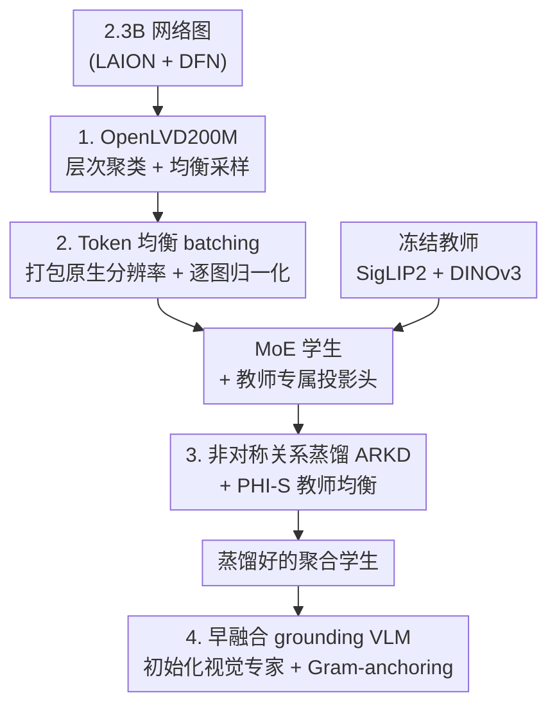

# SigLino: Efficient Multi-Teacher Distillation for Agglomerative Vision Foundation Models

**会议**: CVPR 2026  
**论文**: [CVF Open Access](https://openaccess.thecvf.com/content/CVPR2026/html/Chaybouti_SigLino_Efficient_Multi-Teacher_Distillation_for_Agglomerative_Vision_Foundation_Models_CVPR_2026_paper.html)  
**代码**: 项目页 sofianchay.github.io/amoe（释放 OpenLVD200M 数据集 + 5 个蒸馏 checkpoint）  
**领域**: 模型压缩 / 多教师知识蒸馏  
**关键词**: 多教师蒸馏, 聚合式视觉基础模型, 关系蒸馏, Token 均衡 batching, MoE

## 一句话总结
SigLino 系统研究"把多个视觉基础模型（SigLIP2 + DINOv3）蒸馏成一个聚合式学生模型"的数据效率问题，提出非对称关系蒸馏（ARKD）、token 均衡 batching、层次聚类数据筛选三件套，只用 200M 图（约 RADIO 1/4.7 的 token 预算）就在分类/检索/分割上超过同规模 RADIOv2.5，并把学生直接拿去初始化早融合 grounding VLM 的视觉专家。

## 研究背景与动机
**领域现状**：当前做通用视觉表征有两条路。一条是模块化的 VLM（一个对齐文本的视觉编码器 + 一个 LLM 拼起来），擅长指令跟随但在稠密预测任务上偏弱、也不是天生多模态；另一条是单一监督源训练的专用模型（如纯对比、纯自监督），各自把目标任务做到极致但缺乏通用性。近期出现的第三条路是**聚合式视觉基础模型（Agglomerative VFM）**：用多教师蒸馏，把若干互补教师的能力压进同一个 backbone，代表作是 AM-RADIO / RADIOv2.5。

**现有痛点**：聚合式蒸馏虽有前景，但"贵"。它通常需要海量训练样本（RADIO 用到 ~1.1 万亿 image token），还要小心处理教师之间分辨率不一致、多个损失函数怎么平衡这些工程细节。学习动态和数据效率几乎没人系统研究过——大家是"堆数据 + 调 loss"硬训出来的。

**核心矛盾**：多教师蒸馏的瓶颈不在模型容量，而在三处被忽视的地方——**训练数据的质量与分布**、**多分辨率训练的稳定性**、**教师关系几何结构的保留**。教师 SigLIP2（图文对齐强但稠密特征不可分）和 DINOv3（稠密特征极好但图文对齐是事后 LiT 才补的）统计尺度差异巨大，朴素的逐样本 MSE 匹配会被高方差教师/高分辨率图主导梯度。

**本文目标**：在一个标准化框架下，把聚合式 VFM 训得**更省数据、表征还更好**。拆成：(1) 用什么数据训最省；(2) 怎么在原生分辨率下稳定训练；(3) 怎么在匹配教师时不破坏它的聚类几何。

**切入角度**：把自监督学习里成熟的"层次聚类筛数据"搬到蒸馏；把关系蒸馏（RKD，匹配样本间两两距离）引入，但发现它会伤 kNN 聚类，于是改成"非对称"版本只在该拉近/推远时动手。

**核心 idea**：用"数据筛选 + token 均衡 batching + 非对称关系蒸馏"三件套，把多教师蒸馏从"暴力堆 token"变成"高数据效率的标准化配方"，并用 MoE 学生天然容纳互补教师信号、直接服务早融合 grounding VLM。

## 方法详解

### 整体框架
SigLino 的训练分两条时间线串起来。**蒸馏阶段**：一张图同时喂给两个冻结教师（SigLIP2、DINOv3）和 MoE 学生；学生输出 CLS 全局 token、patch token 和 register token，经过每个教师各自的可学习投影头映射到该教师的嵌入空间；损失同时对齐全局（CLS/attention pooling）、稠密（patch）和 register（仅 DINOv3）三类表征，并叠加一个匹配"样本间两两几何"的 ARKD 关系损失。在这之前，训练数据先经过层次聚类筛成 OpenLVD200M，每个 batch 用 token 均衡打包多张原生分辨率图、按每图 token 数归一化损失。蒸馏好的学生再进入**下游阶段**：用它去初始化一个早融合 grounding MoE VLM 的视觉专家，配 Gram-anchoring 防止稠密特征在微调中退化，做指代表达检测/分割。

整条 pipeline 是"数据筛选 → 稳定 batching → 多教师对齐损失（含 ARKD）→ MoE 学生 → 下游 grounding 初始化"的串行流水：

### 关键设计

**1. OpenLVD200M：把自监督的层次聚类筛数据搬进多教师蒸馏**

痛点是网络图天然长尾，随机采样会让常见概念压倒细粒度/长尾概念，蒸馏样本效率低。作者借用 DINOv3 训练时用过的层次聚类+均衡采样（原本是 SSL 专属技巧），把它用到蒸馏侧：从 LAION+DFN 混成的 23 亿图里，先用 DINOv3 ViT-B 编码、均匀下采到 10 亿，跑一个 4 级层次聚类（20M、500k、50k、20k 个质心），再把剩余 17 亿图分配到一级质心，最后做层次采样得到均衡的 2 亿子集 OpenLVD200M。作者还对原算法做了效率改造，把所需算力从估计的 45 个节点压到 12 个 A100 节点。为什么有效：均衡覆盖视觉概念后，细粒度/长尾类别得到充分曝光——消融里图文分类平均从 74.96 涨到 79.11（+4.15），FGVC-Aircraft 这种细粒度数据集单项暴涨 +18.64。这说明"蒸馏的数据分布"本身就是被严重低估的杠杆。

**2. Token 均衡 batching：让多分辨率训练不崩、不忘低分辨率**

痛点是原生分辨率训练下每张图 patch 数差异极大（256×256 出 256 个 patch，768×768 出 2304 个），按"每 rank 固定图数"朴素 batching 会让各 rank 的 token 数严重失衡，引发高范数梯度、训练失稳。作者用 FlexAttention 把多张图打包进一个序列、上限为固定上下文长度 $C_{max}$（最多 16 图/序列），并用 attention mask 阻断图间自注意力，使每个 rank 的 token 预算近似一致。但打包带来新问题——每个序列含图数不同，损失必须正确归一化才能让梯度无偏。于是损失按**每图 token 数归一化**后再全局平均：patch 损失 $L^{(t)}_{patch}(q)=\frac{1}{N_q}\sum_{\omega=1}^{N_q}\|z^{(t,p)}_{q,\omega}-\hat z^{(t,p)}_{q,\omega}\|_2^2$，全局聚合 $L^{(t)}_{global}=\frac{1}{B_{global}}\sum_{r,j,i}L^{(t)}(q)$，保证每张图无论分辨率都等权贡献。效果是既不忘低分辨率全局特征（甚至提升），又把吞吐从 7.5k token/s 提到 20k token/s（padding 大减）——稳定性和效率同时拿到。

**3. ARKD：非对称关系蒸馏，对齐图文又不毁聚类**

痛点是只做逐样本一对一匹配，跨样本的相对几何没人管。作者引入关系蒸馏 RKD（匹配 batch 内样本两两距离），发现它对 DINOv3 的图文对齐极有用（DINOv3 是事后 LiT 才对齐文本、图文相似度尺度只有 0.2 vs SigLIP2 的 0.9，关系损失成了"强制正确样本间距"的正则），但**普通 RKD 会伤 kNN 聚类**——它会在本该相对疏远的样本上过度推拉。作者的修法是把它做成**非对称**：以教师空间内 batch 距离的中位数 $m$ 为决策边界，只在"该近的时候拉近、该远的时候推远"动手。记教师/学生归一化距离 $\hat D^T_{ij},\hat D^S_{ij}$，定义单侧误差 $\text{shrink}_{ij}=\max\{\hat D^S_{ij}-\hat D^T_{ij},0\}$、$\text{expand}_{ij}=\max\{\hat D^T_{ij}-\hat D^S_{ij},0\}$，并用 $w_{shrink,ij}=\mathbb{1}\{\hat D^T_{ij}<m\}$ 做二元门控：

$$L^{(t)}_{ARKD}=\frac{1}{B_{global}(B_{global}-1)}\sum_{i\neq j}\big[w_{expand,ij}\,h(\text{expand}_{ij})+w_{shrink,ij}\,h(\text{shrink}_{ij})\big]$$

其中 $h(\cdot)$ 是 smooth-L1。消融（Table 4）显示：vanilla RKD 把 DINOv3 图文从 63.71 拉到 77.48 但 kNN 略掉；ARKD 既拿到图文增益（ensemble 80.21）又把 kNN 恢复到 83.63，是最佳折中。

**4. MoE 学生 + 早融合 grounding 初始化 + Gram-anchoring**

聚合式蒸馏要同时吸收两类异质教师信号，MoE 架构天然适合做"模态/能力专门化"。学生是 18 层 MoE（0.3B 激活 / 0.6B 总参，28 专家激活 6 个），还配 PHI-S 教师均衡——不同教师方差/均值差异巨大，MSE 会隐式偏袒高方差教师，PHI-S 用可逆线性映射把每个教师目标标准化、推理时再逆回教师原空间（但 DINOv3 第二个 register 因多模态分布估不准，作者干脆 register 不上 PHI-S）。下游把蒸好的学生拿去初始化早融合 grounding MoE VLM 的视觉专家，让图文 token 在每一层都交互（不像模块化 VLM 那样图特征很晚才碰文本）。微调时稠密特征会退化（patch 越来越像 CLS），作者用 **Gram-anchoring** 对着冻结的蒸馏学生约束 patch 间 Gram 矩阵：$L_{gram}=\frac{1}{B}\sum_b\frac{1}{N_b^2}\|K^S_b-K^T_b\|_F^2$，把样本间几何锚住、保住空间相干性。效果是 grounding 从 scratch 训练的 29.15 提到 SigLino init 的 57.49、再加 Gram 到 61.06（RefCOCO 检测）。

### 损失函数 / 训练策略
每个教师的逐图损失 $L^{(t)}(q)=L^{(t)}_{CLS}(q)+L^{(t)}_{patch}(q)+L^{(t)}_{reg}(q)$（register 项仅 DINOv3），全局对所有图等权平均后对所有教师求和 $L_{total}=\sum_t L^{(t)}_{global}$，每个教师再叠加 ARKD：$L^{(t)}=L^{(t)}_{global}+L^{(t)}_{ARKD}$。两阶段训练：Stage 1 在 OpenLVD 上做到 256×256（50k 步）快速学全局+稠密表征；Stage 2 在 13M 图（11.5M 来自 SAM + 1.5M 网络图）上 post-train 到 768×768（90k 步），用多分辨率混合（重新引入 256×256 的 OpenLVD + 原生 256–384 尺寸 + 高分辨率池下采到 256/512）防止高分辨率分布漂移导致低分辨率遗忘。硬件：4 节点 ×8 A100。

## 实验关键数据

### 主实验

512×512 下与同规模 RADIOv2.5 对比（macro 平均，Ensemble 头）：

| 任务 | 指标 | SigLino-MoE-0.3-0.6B | SigLino-Dense-0.6B | RADIOv2.5-H (0.6B) |
|------|------|------|------|------|
| 图文分类 | Avg Top-1 | 84.13 | 84.40 | 82.26 |
| kNN 分类 | Avg Top-1 | 88.06 | 90.70 | 85.12 |
| 检索 MSCOCO5k | T2I@1 | 53.98 | 55.60 | 53.24 |
| 检索 Flickr30k | I2T@1 | 94.30 | 94.20 | 93.50 |
| 线性探针分割 ADE20k | mIoU | 52.23 | 52.95 | 51.37 |
| 线性探针分割 Cityscapes | mIoU | 64.36 | 65.38 | 64.11 |

关键是 SigLino 只用约 2300 亿 image token（0.23TT），是 RADIO 1.1 万亿的 **1/4.7**，却在 macro 平均上全面反超，甚至 ensemble 评测超过两个教师本身。超稀疏变体（top-2/28，仅 0.15B 激活）也仍超 RADIOv2.5-H（83.10 / 89.80）。

### 消融实验

| 配置 | 图文 Avg | kNN Avg | 说明 |
|------|---------|---------|------|
| Vanilla MT（无 RKD） | 77.62 | 83.54 | 只逐样本匹配 |
| RKD（对称） | 79.49 | 82.61 | 图文涨但 kNN 掉 |
| ARKD（非对称） | 80.21 | 83.63 | 图文与 kNN 双赢 |
| Random 200M | 74.96 | 82.66 | 随机采样数据 |
| OpenLVD200M | 79.11 | 85.08 | 层次聚类筛选（+4.15 / +2.42）|

grounding 初始化消融（RefCOCO 检测 Acc@IoU0.5）：Scratch 29.15 → SigLino init 57.49 → +Gram 61.06；多教师（54.72）显著超单教师 SigLIP2-only（40.69）/ DINOv3-only（45.06）。

### 关键发现
- **数据筛选是最大杠杆**：OpenLVD200M 比同量随机采样图文 +4.15，细粒度 FGVC-Aircraft 单项 +18.64，说明蒸馏里"喂什么数据"被严重低估。
- **ARKD 的非对称是点睛之笔**：对称 RKD 会牺牲 kNN，加上中位数门控只在该动时动手才能图文/聚类双赢；增益主要来自图文对齐弱的 DINOv3。
- **MoE 性价比突出**：6 激活专家的 MoE 几乎追平 dense 全参，激活参数减半；超稀疏（0.15B 激活）仍超 RADIOv2.5-H，给出最佳效率-性能权衡。
- **Gram-anchoring 防退化**：下游学全局表征时 patch 会向 CLS 塌缩、稠密结构模糊，锚住 Gram 矩阵能恢复空间相干，PCA 图可见。

## 亮点与洞察
- **把 SSL 的数据筛选迁到蒸馏**：层次聚类+均衡采样原本是自监督专利，作者证明它对多教师蒸馏同样关键且增益更大——这条"数据效率"思路可直接迁到任何蒸馏/预训练管线。
- **关系蒸馏的"非对称化"**很巧：发现 RKD 伤聚类的根因是无差别推拉，用教师空间中位数当门控、只做单侧误差，是一个轻量却治本的修法，可复用到任何关系/对比正则会破坏聚类的场景。
- **Token 均衡 batching** 把"原生分辨率训练失稳"这个工程顽疾，用 FlexAttention 打包 + 逐图 token 归一化一并解决，顺带把吞吐翻了近 3 倍——稳定性和效率往往可以一招同得。
- **蒸馏学生直接当 VLM 视觉专家**：早融合 grounding VLM 用蒸好的视觉专家初始化，跳过传统 ViT→LLM 模块化栈，在少标注下就拿到强 grounding，给"蒸馏即预训练"提供了端到端证据。

## 局限与展望
- 作者承认：下游 grounding 微调会退化稠密特征（patch 向 CLS 塌缩），需要 Gram-anchoring 这类额外正则才能压住——说明蒸馏表征在做生成式/自回归 VLM 训练时并不"免维护"。
- PHI-S 对 DINOv3 第二个 register 估不准（多模态分布），只能整体跳过 register 的 PHI-S，是个未完全解决的工程妥协。
- 自己发现：实验只用 SigLIP2+DINOv3 两个教师、ViT-L 规模，教师数更多/能力更冲突时 ARKD 与 PHI-S 的均衡是否还稳，没有验证；OpenLVD200M 的筛选用 DINOv3 编码做聚类，可能把"DINOv3 的偏好"提前注入了数据分布。
- 改进思路：把 ARKD 的中位数门控换成可学习/自适应阈值，或按教师分别设边界；探索 3+ 教师下的专家路由如何与模态专门化协同。

## 相关工作与启发
- **vs AM-RADIO / RADIOv2.5**：同是聚合式多教师蒸馏，RADIO 靠堆 token（1.1TT）和处理分辨率 mode shift；本文换成数据筛选+token 均衡+ARKD，用 1/4.7 的 token 反超，强调"数据与关系几何"而非"算力"。
- **vs RKD（关系知识蒸馏）**：RKD 无差别匹配样本两两距离；本文指出它伤 kNN，提出非对称门控版 ARKD 在对齐与聚类间取得平衡。
- **vs 模块化 grounding VLM（Florence-2 / VisionLLM v2）**：它们靠"视觉编码器 + 序列解码器/路由 token"的模块栈；本文用早融合 decoder-only + MoE 模态专家，让图文在每层交互，省掉模块栈。
- **vs MoMa（早融合 MoE）**：MoMa 证明模态专属专家对早融合最优；本文继承这一点但用蒸馏好的聚合学生初始化视觉专家，把"好表征"前置注入。

## 评分
- 新颖性: ⭐⭐⭐⭐ 把 SSL 数据筛选搬进蒸馏 + 非对称关系蒸馏，都是切中要害的"小而真"创新，但单点都建立在已有技术（RKD/PHI-S/层次聚类）之上。
- 实验充分度: ⭐⭐⭐⭐⭐ 分类/检索/分割/grounding 全覆盖，三个核心设计各有独立消融，还开源数据集+5 个 checkpoint。
- 写作质量: ⭐⭐⭐⭐ 系统性强、动机清晰，公式记号略密集，部分细节甩到 supplementary。
- 价值: ⭐⭐⭐⭐⭐ 把多教师蒸馏从"暴力堆 token"变成可复现的高数据效率配方，并打通到早融合 VLM，工程与方法价值都高。

<!-- RELATED:START -->

## 相关论文

- [\[CVPR 2026\] Masking Teacher and Reinforcing Student for Distilling Vision-Language Models](masking_teacher_and_reinforcing_student_for_distilling_vision-language_models.md)
- [\[ICML 2026\] PRISM: Synergizing Vision Foundation Models via Self-Organized Expert Specialization](../../ICML2026/model_compression/prism_synergizing_vision_foundation_models_via_self-organized_expert_specializat.md)
- [\[CVPR 2026\] Collaborative Multi-Mode Pruning for Vision-Language Models](collaborative_multi-mode_pruning_for_vision-language_models.md)
- [\[ECCV 2024\] UNIC: Universal Classification Models via Multi-teacher Distillation](../../ECCV2024/model_compression/unic_universal_classification_models_via_multi-teacher_distillation.md)
- [\[CVPR 2026\] Teacher-Guided Routing for Sparse Vision Mixture-of-Experts](teacher-guided_routing_for_sparse_vision_mixture-of-experts.md)

<!-- RELATED:END -->
