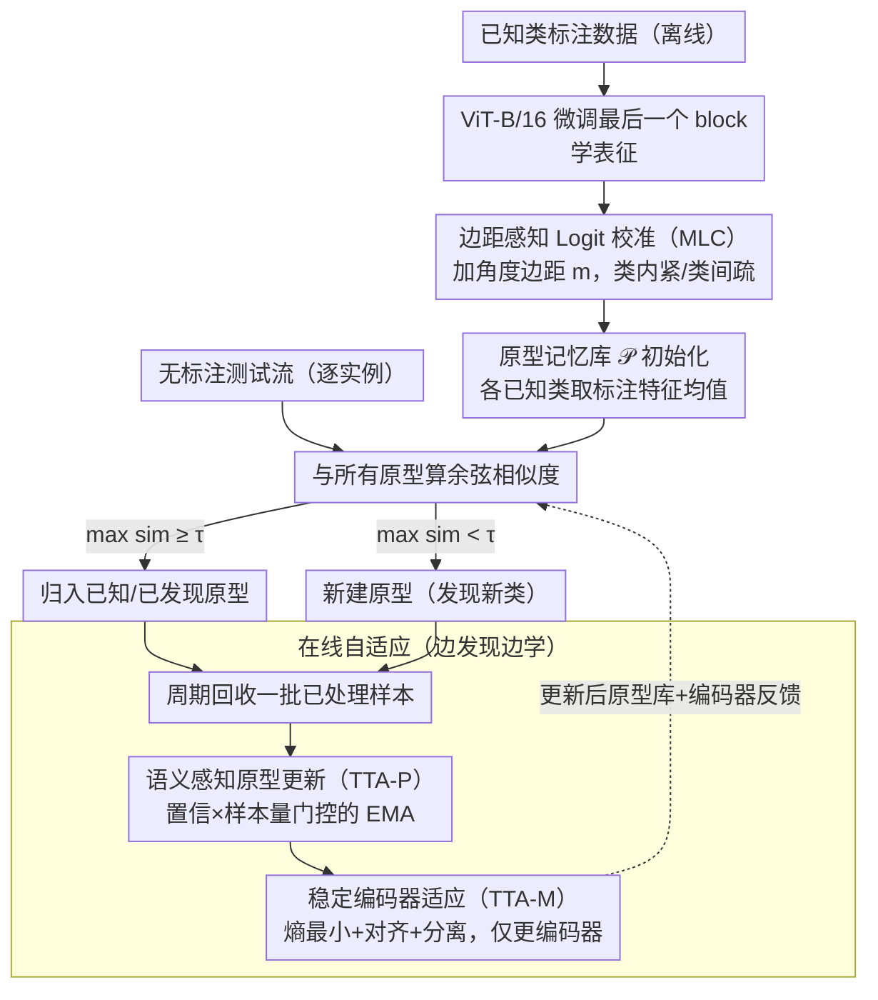

# TALON: Test-time Adaptive Learning for On-the-Fly Category Discovery

**会议**: CVPR2026  
**arXiv**: [2603.08075](https://arxiv.org/abs/2603.08075)  
**代码**: [ynanwu/TALON](https://github.com/ynanwu/TALON)  
**领域**: 模型压缩 / 开放世界学习  
**关键词**: On-the-Fly Category Discovery, 测试时自适应, 原型学习, 类别爆炸, 语义偏移

## 一句话总结

提出首个面向 on-the-fly 类别发现（OCD）的测试时自适应框架 TALON，通过语义感知原型更新 + 稳定编码器适应 + 边距感知 logit 校准，摒弃哈希编码在连续特征空间直接建模，大幅缓解类别爆炸并显著提升新类发现精度。

## 背景与动机

1. **封闭世界假设局限**：传统视觉识别系统假设所有类别预定义，无法发现新概念或泛化到训练集之外。
2. **OCD 任务定义**：On-the-Fly Category Discovery 是最贴近真实场景的开放世界设定——离线仅有已知类标注数据训练，在线逐实例处理无标注数据流，需同时识别已知类和发现新类。
3. **哈希编码的缺陷**：现有 OCD 方法（SMILE、PHE）冻结特征提取器，将特征量化为二值哈希码作为类原型。量化导致信息损失、表征力下降、类内方差放大，容易造成 **类别爆炸**（一个真实类被碎片化为多个伪类）。
4. **静态推理不合理**：在线阶段既固定编码器又固定原型，完全忽略了新到数据的学习潜力——这与"从发现中学习"的理念相悖。
5. **生成式方法仍受限**：DiffGRE 虽用扩散模型合成新类样本，但将特征投射到更低维度，本质上仍不够有效。
6. **传统 TTA 不适配**：现有 TTA 方法（TENT、MEMO 等）针对领域偏移而非语义/标签空间偏移，在 OCD 场景中表现不佳甚至退化。

## 方法详解

### 整体框架

TALON 想纠正现有 OCD 方法的两个毛病：一是把特征量化成二值哈希码当原型，量化丢信息、放大类内方差，导致"类别爆炸"（一个真类被碎成多个伪类）；二是在线阶段把编码器和原型都冻死，完全浪费了新数据的学习潜力，与"从发现中学习"的初衷相悖。它的方案是全程在连续特征空间操作（hash-free），并把测试时自适应（TTA）引入 OCD。整条流水线分三步：**离线**用 ViT-B/16（DINO/CLIP 预训练、只微调最后一个 transformer block）学表征，并用「边距感知 Logit 校准（MLC）」预先把嵌入空间塑形成"类内紧、类间疏"、为未来新类腾位；**在线推理**维护一个类原型记忆库 $\mathcal{P}$，每个已知类原型先用标注样本特征均值初始化，来一个测试样本就与所有原型算余弦相似度，最大值 ≥ 阈值 $\tau$ 归入对应已知/新原型、否则新建原型；**在线自适应**则周期性回收一小批已处理样本，用「语义感知原型更新（TTA-P）」把原型朝高置信样本均值挪、压住离群点，再用「稳定编码器适应（TTA-M）」轻量更新编码器本身，更新后的原型库和编码器反馈回推理循环，形成"边发现边学"的闭环。

### 关键设计

**1. 边距感知 Logit 校准（MLC）：离线就给未来新类预留空间**

如果离线训练把已知类挤得太紧、类间又不够开，在线来了新类就没地方落、容易和已知类混淆。MLC 在归一化特征与类权重的余弦相似度上加角度边距 $m$：对真实类 logit 用 $s \cos(\theta_{i,y_i} + m)$、其余保持 $s \cos\theta_{i,c}$，把类间角距从 27.98° 拉大到 74.15°、类内角距从 64.55° 压到 35.83°。离线损失为 $\mathcal{L}_{\text{labeled}} = \mathcal{L}^{\text{sup}} + \lambda \mathcal{L}^{\text{ce-m}}$（监督对比拉近同类推远异类，校准后的交叉熵增强类级判别）。这等于提前在嵌入空间腾出空位，为后续新类发现打底。

**2. 语义感知原型更新（TTA-P）：让原型跟着高置信样本走、压住离群点**

在线新建的原型若被离群点带偏，伪类就会一直存在。TTA-P 对每批分配给原型 $j$ 的样本算平均特征 $\bar{\mathbf{z}}_j$ 和置信度 $\text{conf}_j$，用自适应步长 EMA 更新：$\alpha_j = \eta \cdot \text{conf}_j \cdot \frac{n_j}{n_j + \kappa}$。这是个双重门控——高置信且样本充足时大幅更新，低置信或样本稀少时几乎不动，从而抑制离群点把伪类钉死。已知类与新类还用不同的更新率和平滑常数（$\eta$=0.06/0.3，$\kappa$=32/8）。

**3. 稳定编码器适应（TTA-M）：轻量更新编码器又不让特征坍缩**

只更原型还不够，编码器本身也该从测试流里学，但乱更会让特征坍缩。TTA-M 周期性收集小批测试样本做轻量梯度更新，联合三项损失：熵最小化 $\mathcal{L}_{\text{ent}}$ 鼓励高置信预测、对齐损失 $\mathcal{L}_{\text{align}}$ 保持特征均值与存储原型一致、分离损失 $\mathcal{L}_{\text{sep}}$ 防止不同类特征坍缩，合成 $\mathcal{L}_{\text{TTA}} = \mathcal{L}_{\text{ent}} + \beta_1 \mathcal{L}_{\text{align}} + \beta_2 \mathcal{L}_{\text{sep}}$，且梯度只回传编码器。即时预测 + 周期更新的搭配，让模型既保持实时性又能从发现中持续学习。

## 实验关键数据

### 主实验（7 个基准，Strict-Hungarian 协议）

| 数据集 | 方法 | All | Old | New |
|--------|------|-----|-----|-----|
| CIFAR-10 | PHE | 53.1 | 19.3 | 70.0 |
| CIFAR-10 | **TALON-DINO** | **65.0** | 46.1 | **79.3** |
| CIFAR-100 | PHE | 56.0 | 70.1 | 27.8 |
| CIFAR-100 | **TALON-DINO** | **64.7** | **77.4** | **39.3** |
| ImageNet-100 | PHE | 39.2 | 49.3 | 34.1 |
| ImageNet-100 | **TALON-DINO** | **82.6** | **92.0** | **63.4** |
| CUB-200 | DiffGRE+P | 37.9 | 57.0 | 28.3 |
| CUB-200 | **TALON-CLIP** | **45.5** | **60.7** | **37.8** |
| Stanford Cars | DiffGRE+P | 32.1 | 63.3 | 16.9 |
| Stanford Cars | **TALON-CLIP** | **53.5** | **74.2** | **43.6** |

ImageNet-100 上 All 准确率从 39.2% 跃升至 82.6%（+43.4pp），提升极为显著。

### 类别爆炸缓解（CUB-200 & Stanford Cars）

| 方法 | CUB #Cls (真实200) | SCars #Cls (真实196) |
|------|---------------------|----------------------|
| SMILE-64bit | 2910 | 4788 |
| PHE-64bit | 493 | 917 |
| **TALON** | **153** | **299** |

TALON 估计类别数最接近真实值，有效缓解类别爆炸。

### 消融实验（CLIP backbone, Strict-Hungarian）

| 配置 | CUB All | SCars All |
|------|---------|-----------|
| Baseline | 44.5 | 47.8 |
| +MLC | 45.7 | 49.0 |
| +MLC+TTA-P | 46.7 | 52.7 |
| +MLC+TTA-M | 46.7 | 52.1 |
| **TALON (全部)** | **45.5** | **53.5** |

三个模块各自贡献增益，MLC 提供更好的初始化，TTA-P 和 TTA-M 互补提升。

### 与现有 TTA 方法对比（Stanford Cars）

| 方法 | All | New |
|------|-----|-----|
| Baseline+MLC+TENT | 48.1 | 39.2 |
| Baseline+MLC+OSTTA | 47.2 | 39.9 |
| **TALON** | **53.5** | **43.6** |

传统 TTA 方法在语义偏移场景下几乎无效甚至退化。

## 亮点

- **首次将 TTA 引入 OCD 任务**：打破"冻结推理"范式，实现"从发现中学习"
- **Hash-free 框架**：在连续特征空间直接操作，保留完整表征力，彻底规避量化导致的类别爆炸
- **置信度控制的自适应原型更新**：通过 $\text{conf} \times \frac{n}{n+\kappa}$ 双重门控，巧妙平衡更新幅度与稳定性
- **MLC 对嵌入空间的前瞻性塑造**：离线阶段就为未来新类预留空间，角度可视化验证效果（类间角距从 28° 扩大到 74°）
- **超参数共享**：几乎所有数据集共用相同配置，泛化性好

## 局限与展望

1. **阈值 $\tau$ 敏感性**：新类判断完全依赖余弦相似度阈值，该值需要根据数据集微调（DINO 用 0.7，CLIP 用 0.75）
2. **CUB 消融中 TALON 全配置 All 略低于 +MLC+TTA-P**：表明模型适应（TTA-M）在细粒度数据集上可能引入微弱噪声
3. **类别数估计仍有偏差**：CUB 真实 200 类估计 153 类、SCars 真实 196 类估计 299 类，存在欠估/过估
4. **实例级在线处理的效率**：需维护不断增长的原型记忆库并周期性更新编码器，长期流式场景下计算开销和内存增长值得关注
5. **未讨论类别合并机制**：对早期误创建的伪类原型缺乏显式的合并/清理策略

## 与相关工作的对比

| 维度 | SMILE/PHE (哈希方法) | DiffGRE (生成方法) | **TALON** |
|------|---------------------|-------------------|-----------|
| 特征空间 | 二值哈希码 | 低维投影 | 连续特征空间 |
| 在线学习 | ✗ 冻结 | ✗ 冻结 | ✓ 编码器+原型双更新 |
| 类别爆炸 | 严重（2^L 级膨胀） | 中等 | 有效缓解 |
| 新类精度 | 低 | 中等 | 显著提升 |
| 额外训练开销 | 无 | 扩散模型训练 | 轻量 TTA |

## 评分

- 新颖性: ⭐⭐⭐⭐ — 首次将 TTA 引入 OCD，hash-free + 双层自适应设计新颖
- 实验充分度: ⭐⭐⭐⭐ — 7 个数据集、2 种 backbone、2 种评估协议、丰富消融和可视化
- 写作质量: ⭐⭐⭐⭐ — 动机清晰、公式完整、伪代码规范
- 价值: ⭐⭐⭐⭐ — 对 OCD 任务有实质性推动，缓解类别爆炸的方案实用

<!-- RELATED:START -->

## 相关论文

- [\[CVPR 2026\] FOZO: Forward-Only Zeroth-Order Prompt Optimization for Test-Time Adaptation](fozo_forward-only_zeroth-order_prompt_optimization_for_test-time_adaptation.md)
- [\[ECCV 2024\] Category Adaptation Meets Projected Distillation in Generalized Continual Category Discovery](../../ECCV2024/model_compression/category_adaptation_meets_projected_distillation_in_generalized_continual_catego.md)
- [\[CVPR 2026\] Back to Source: Open-Set Continual Test-Time Adaptation via Domain Compensation](back_to_source_open-set_continual_test-time_adaptation_via_domain_compensation.md)
- [\[CVPR 2026\] Test-time Sparsity for Extreme Fast Action Diffusion](test-time_sparsity_for_extreme_fast_action_diffusion.md)
- [\[ACL 2026\] Training-Free Test-Time Contrastive Learning for Large Language Models](../../ACL2026/model_compression/training-free_test-time_contrastive_learning_for_large_language_models.md)

<!-- RELATED:END -->
