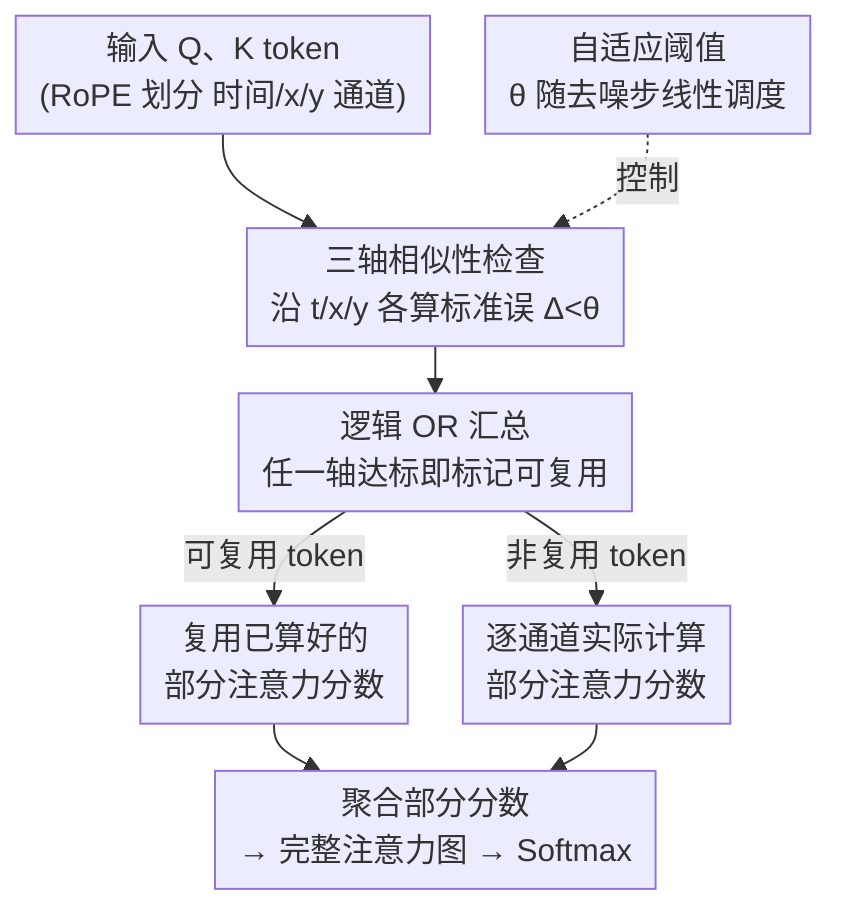

# TimeRipples: Accelerating vDiTs by Understanding the Spatio-Temporal Correlations in Latent Space

**会议**: CVPR 2026  
**论文**: [CVF Open Access](https://openaccess.thecvf.com/content/CVPR2026/html/Mao_TimeRipples_Accelerating_vDiTs_by_Understanding_the_Spatio-Temporal_Correlations_in_Latent_CVPR_2026_paper.html)  
**代码**: 无  
**领域**: 模型压缩 / 扩散模型加速  
**关键词**: 视频扩散Transformer, 自注意力加速, 时空相关性, 通道级复用, 自适应阈值

## 一句话总结
本文从潜在空间的时空相关性出发解释了视频 DiT（vDiT）注意力图为何会呈现各种模式，发现这些模式其实是 token 在 RoPE 划分的「时间 / x / y」通道组上的时空相关性叠加而成，据此提出一种沿通道复用相似 token 部分注意力分数的轻量方法，并用一个把复用比例和误差挂钩的解析模型自适应选阈值，在 4 个 vDiT 上节省约 85% 的注意力计算、端到端最高 2.7× 加速，而 VBench 几乎无损（<0.06%）。

## 研究背景与动机
**领域现状**：当下的视频生成模型几乎都用 video diffusion transformer（vDiT）这一范式，而 vDiT 的推理延迟主要被两件事吃掉——冗长的去噪步数和计算密集的自注意力。作者在 4 个主流 vDiT（HunyuanVideo、Wan2.1、CogVideoX、Open-Sora-Plan）上 profile，发现自注意力平均占了 78% 的执行时间，是头号瓶颈。

**现有痛点**：现有给自注意力提速的方法（MInference、SVG、tiling、masking 等）大多直接搬运 LLM 里的稀疏注意力技巧——在注意力图上找出稀疏/不重要的位置然后跳过计算。但视频数据有它独特的性质：天然的时空相关性。视频压缩（H.265 能 10× 无损压缩）早就靠这个性质做加速，而把 LLM 的稀疏模式硬套到 vDiT 上恰恰忽略了它，因此这些方法在 vDiT 上要么省不动，要么省了掉质量。

**核心矛盾**：之前的工作只盯着「注意力图上长什么样」（spatial pattern / temporal pattern 这些表象），把模式当成既成事实去找稀疏性，却没问「这些模式到底是怎么来的」。如果不理解模式的成因，跳过的就可能是真正重要的计算。

**本文目标**：先搞清楚 vDiT 注意力图各种模式的根因，再据此设计一个真正贴合视频时空结构、开销极小的注意力加速方法，并解决「每一步该省多少」的自适应控制问题。

**切入角度**：作者解剖 HunyuanVideo 的注意力计算，发现一个关键事实——注意力图的模式不是凭空出现的，而是 Q、K 沿单个通道（channel）上的时空相关性累加出来的产物。更具体地，vDiT 普遍用 RoPE 把通道维度按语义切成三组：时间通道、x 方向通道、y 方向通道（如 HunyuanVideo 前 16 维编码时间、接下来 56 维编 x、最后 56 维编 y）。空间相关性主导时跨帧的值相近（可沿时间复用），时间相关性主导时帧内的值相近（可沿空间复用）。

**核心 idea**：既然同一通道里时空相似的 token 值几乎一样，那一个 token 的部分注意力分数就可以直接拿相似 token 的来近似——「复用」而非「跳过」。再配一个把复用阈值绑定到去噪步的解析模型，让引入的误差可控且一致。

## 方法详解

### 整体框架
TimeRipples 要解决的是「在不重训、几乎不掉质量的前提下，把 vDiT 自注意力的计算量砍掉一大块」。它的核心转变是：从「在注意力图上找稀疏位置跳过」转为「在通道维度上找时空相似的 token，复用它们已算好的部分注意力分数」。整条流水线是：输入的 Q、K token 先沿三个轴（时间 / x / y）各做一次相似性检查，把检查结果用逻辑 OR 汇总成「可复用 mask」；非复用 token 才逐通道实际计算部分注意力分数，可复用 token 直接套用之前算好的；最后把所有部分分数聚合成完整注意力图，再走正常的 Softmax。每一步该用多严的阈值，由一个绑定去噪步的自适应公式给出。

### 关键设计

**1. 通道级时空相关性根因分析：把注意力模式还原成 token 通道上的相关性叠加**

以往工作只观察到 vDiT 注意力图有「空间变化型」和「时间变化型」两类模式，并猜测它们分别负责帧内空间信息和跨帧时间信息，但没解释模式从何而来。本文解剖 HunyuanVideo 的注意力计算后给出结论：模式是 Q 和 K 上重要通道协同作用的结果——当 Q、K 都呈现空间相关（同一模式在帧间重复）时，整张图就是「空间主导」，跨帧的值相近；当 Q、K 都呈现时间相关（帧间均值变化、帧内值相对稳定）时就是「时间主导」，帧内的值相近。再加上 vDiT 用 RoPE 把通道按时间 / x / y 分组的事实，作者用「恶意复用」实验（强行让每对相邻帧中的第二帧复用某一通道组）验证了通道组与画质的因果：复用时间通道引入时间扭曲，复用 x/y 通道产生沿对应轴的条纹伪影。这一分析是后续复用策略的立论基础——既然模式来自通道上的时空相关，那就该在通道维度上做文章，而不是在注意力图表象上找稀疏。

**2. 通道级 token 复用：用相似 token 的部分注意力分数做近似，而非粗暴跳过**

这是方法的执行核心，分四步。第一步，Q 和 K 各沿三个轴做相似性检查，相似度用窗口内的标准误衡量：

$$\Delta(a)=\sqrt{\sum_{i=0}^{K-1}(a_i-\bar a)^2/K},\quad \bar a=\sum_{i=0}^{K-1}a_i/K$$

其中 $a$ 是一段 token 通道窗口，$K$ 是窗口大小（实验取 2，即比较相邻两帧/行/列）。若某轴上 $\Delta$ 低于该轴阈值（$\theta_t,\theta_x,\theta_y$），则该 token 对在这个轴上可复用。第二步，三轴结果用逻辑 OR 汇总——只要任一轴满足相似条件就标记为可复用，其注意力计算被跳过、转而套用已算好的部分分数。第三步，非复用 token 才逐通道做 Q·K 点积算部分分数（图中白块就是省下的计算）。第四步，所有部分分数聚合成完整注意力图，再照常做 Softmax。

它和「token masking」的本质区别（也是为什么更好）在于：masking 是把值接近 0 的不重要 token 直接当 0 跳过，相当于只「复用」了零值；而本方法复用的是相似 token 的真实分数，覆盖整个值域。作者在相同 token 节省率下对比，本方法的 MSE 比两种 masking 基线低一个数量级（Fig. 7），这正是「复用真实值」相对「丢弃近零值」的优势所在。

**3. 自适应阈值调度：把复用阈值绑定到去噪步，让误差在各步一致可控**

复用比例越高省得越多，但误差也越大，于是「每一层、每一步该设多严的阈值」成了关键问题。作者的核心观察是：在固定复用比例下，生成质量对去噪步高度敏感，但对具体 prompt 几乎不敏感（Fig. 8、Fig. 9——10 个 prompt 的 MSE 趋势高度一致）。这意味着可以为所有 prompt 共享一套阈值调度。以 HunyuanVideo（50 步）为例，MSE 从第 11 步到第 21 步单调下降、22 到 49 步基本持平。为让每一步引入的误差一致，阈值随步线性增长：

$$\theta_{t,i}=(i-i_{\min})\cdot\frac{\theta_{t,\max}-\theta_{t,\min}}{i_{\max}-i_{\min}},\quad i\in[i_{\min},i_{\max}]$$

$i_{\min}=11,i_{\max}=21$ 划定线性增长区间；前 10 步和最后一步不动（早期步对质量最敏感，不能乱省），区间外的中间步用固定的 $\theta_{t,\max}$。实验还发现把 $\theta_t,\theta_x,\theta_y$ 设成同一个值反而更高效有效（消融见 4.4），所以三轴共用一套阈值。这套解析模型让复用引入的误差在整个去噪过程中保持一致、可控，而不是某些步狂省、某些步又过保守。

### 损失函数 / 训练策略
本方法是**训练无关（training-free）的推理期加速**，不引入任何额外训练或微调，直接作用于已训好的 vDiT 自注意力。唯一需要的「配置」是每个模型的 4 个超参（$\theta_{t,\max},\theta_{t,\min},i_{\min},i_{\max}$），见原文 Tbl. 1（如 HunyuanVideo 取 0.2/0.5/10/20）。方法与现成的 masking 技术正交，可叠加（如 TimeRipples 75% + SVG70%）。

## 实验关键数据

### 主实验
在 HunyuanVideo、Wan2.1、CogVideoX、Open-Sora-Plan 四个 vDiT 上，用 VBench（16 个维度，950 prompt×5 seed 取平均）评质量，PSNR/SSIM/LPIPS 评逐帧画质，延迟/FLOPs/显存评性能，硬件为单张 H100。下表摘 HunyuanVideo 的代表结果：

| 方法 | VBench↑(%) | PSNR↑(dB) | LPIPS↓ | 延迟↓(s) | 加速↑ |
|------|-----------|-----------|--------|----------|-------|
| Original | 80.28 | - | - | 694.03 | - |
| ∆-DIT | 80.43 | 26.09 | 0.111 | 569.43 | 1.22× |
| MInference | 80.18 | 25.00 | 0.174 | 481.18 | 1.44× |
| SVG70% | 79.97 | 25.78 | 0.153 | 409.57 | 1.69× |
| **TimeRipples 75%** | 80.23 | **35.06** | **0.036** | 329.97 | 2.10× |
| **TimeRipples 85%** | **80.44** | 31.28 | 0.078 | 260.85 | **2.66×** |
| TimeRipples 75%+SVG70% | 79.84 | 26.17 | 0.142 | 285.86 | 2.43× |

关键点：TimeRipples 85% 的 VBench（80.44）甚至略超原模型（可能是正则化效应），延迟从 694s 降到 261s；TimeRipples 75% 在质量/加速间最均衡，PSNR 35.06 dB 远超最强基线 ∆-DIT 的 26.09 dB（>9 dB 提升）。其他三个模型上趋势一致（如 CogVideoX 上 TimeRipples 80% 达 81.16 VBench、2.31× 加速，而 PAB 在该模型上崩到 68.17 VBench）。平均节省约 75% 注意力计算，比 SVG70% 还高 5%，端到端最高 2.7× 加速。

### 消融实验
HunyuanVideo 上，各变体配到大致相同的计算节省率：

| 配置 | VBench↑ | PSNR↑(dB) | SSIM↑ | LPIPS↓ | 说明 |
|------|---------|-----------|-------|--------|------|
| Original | 80.28 | - | - | - | 原模型 |
| TimeRipples 75% (Fixed) | 80.19 | 34.56 | 0.948 | 0.037 | 固定阈值 |
| TimeRipples 75% (Temp) | 80.13 | 32.44 | 0.933 | 0.050 | 只用时间维相关 |
| TimeRipples 75% (Spat+Temp) | 80.23 | 35.06 | 0.950 | 0.036 | 完整（时空都用） |

### 关键发现
- **自适应阈值 vs 固定阈值**：固定阈值已能拿到 80.19 VBench（远超 Tbl. 2 其他基线），但自适应阈值进一步把 PSNR 从 34.56 拉到 35.06，因为它更贴合 Fig. 9 的 MSE 敏感度趋势。
- **时空双维 vs 单维**：只用时间维（Temp）PSNR 仅 32.44，加上空间维后升到 35.06——单一维度发挥不出复用的全部潜力。
- **窗口大小**：窗口=2 是最佳折中（Fig. 11）；增大到 4 因过度复用导致画质明显下降，超过 4 又因满足复用条件的 token 变少而加速回落。
- **通道级单独设阈反而更差**：Tbl. 4 显示给每个通道单独设阈值（channel wise）会把 VBench 从 80.44 降到 79.37、PSNR 从 31.28 降到 28.27，印证三轴共用一套阈值更稳。

## 亮点与洞察
- **「解释模式成因」而非「利用模式表象」**：最让人「啊哈」的是把注意力图模式还原成 RoPE 通道分组上的时空相关性叠加——这把一个经验观察升级成了可操作的因果结论，复用策略因此有了原理支撑，而不是又一个启发式 mask。
- **「复用」优于「跳过」的一句话直觉**：masking 等于只复用了近零的不重要 token，而本方法复用的是相似 token 的真实分数、覆盖整个值域，因此同等节省率下 MSE 低一个数量级。这个区分很值得迁移到其他做稀疏/剪枝近似的场景。
- **「质量对去噪步敏感、对 prompt 不敏感」的观察很实用**：它让一套阈值调度能跨所有 prompt 复用，免去逐 prompt 调参——这类「找到真正起决定作用的变量」的思路可迁移到其他扩散加速/调度问题。
- **训练无关 + 与 masking 正交**：不重训、可与 SVG 等叠加，工程落地成本低。

## 局限与展望
- **加速是「理论/估算」值**：现有的 FlashAttention 等高度优化的注意力 kernel 并不支持这种通道级复用，所以论文的 speedup 是按减少的计算量比例估算自注意力延迟得到的，不是在 fused kernel 上实测的真实墙钟加速；如何把复用机制和 flash-attention 等现成加速器结合，作者明确留作 future work。
- **只省自注意力**：方法聚焦自注意力计算，没碰去噪步数这条线，也未与 step-skipping 类方法深度整合（虽可叠加 masking）。
- **依赖 RoPE 的通道语义划分**：方法立论于「vDiT 用 RoPE 把通道按时间/x/y 分组」这一结构前提，对不用 RoPE 或通道语义不清晰的架构是否成立，论文未讨论。
- **超参需逐模型设定**：4 个超参在不同模型间差异较大（Tbl. 1），换新模型仍需调，缺乏自动确定超参的机制。

## 相关工作与启发
- **vs SVG / MInference（稀疏注意力派）**: 它们沿用 LLM 的稀疏模式，在注意力图上用预定义/动态的 sliding window、tiling、masking 跳过不重要计算；本文指出这忽略了视频的时空相关性，转而从潜在空间相关性的根因出发做通道级复用，同等节省率下质量显著更高（HunyuanVideo PSNR 35.06 vs SVG 的 25.78），且二者正交可叠加。
- **vs PAB / ToCa（跨步复用派）**: 它们复用相邻去噪步之间的中间结果，需要缓存、带来不小内存开销；本文只在当前自注意力内部复用、几乎零额外内存，且不依赖步间相似性。
- **vs ToMe（token merging）**: ToMe 靠缩短 token 序列降注意力成本，会改变序列；本文不合并 token、不改序列，只在通道维度近似分数。
- **vs ∆-DiT（块级复用）**: ∆-DiT 做粗粒度的 block-wise 复用，本文做的是细到通道、绑定时空轴的复用，画质更优（HunyuanVideo PSNR 35.06 vs 26.09）。

## 评分
- 新颖性: ⭐⭐⭐⭐⭐ 把注意力模式还原成通道级时空相关性的根因分析是真正的新视角，复用而非跳过的策略也立论扎实
- 实验充分度: ⭐⭐⭐⭐ 4 个 vDiT、多基线、消融/敏感度齐全，但加速为估算值、未给 fused kernel 实测墙钟
- 写作质量: ⭐⭐⭐⭐ 从 insight 到 idea 到方法层层递进，图示（Fig.1/5/6）解释清晰
- 价值: ⭐⭐⭐⭐ 视频生成提效是刚需，方法训练无关、可叠加，落地价值高，唯一阻碍是缺 kernel 级实现

<!-- RELATED:START -->

## 相关论文

- [\[ACL 2026\] Enabling Agents to Communicate Entirely in Latent Space](../../ACL2026/model_compression/enabling_agents_to_communicate_entirely_in_latent_space.md)
- [\[ICCV 2025\] B-VLLM: A Vision Large Language Model with Balanced Spatio-Temporal Tokens](../../ICCV2025/model_compression/b-vllm_a_vision_large_language_model_with_balanced_spatio-temporal_tokens.md)
- [\[NeurIPS 2025\] Learning to Factorize and Adapt: A Versatile Approach Toward Universal Spatio-Temporal Foundation Models](../../NeurIPS2025/model_compression/learning_to_factorize_and_adapt_a_versatile_approach_toward_universal_spatio-tem.md)
- [\[CVPR 2026\] Understanding and Enforcing Weight Disentanglement in Task Arithmetic](understanding_and_enforcing_weight_disentanglement_in_task_arithmetic.md)
- [\[CVPR 2026\] Generative Video Compression with One-Dimensional Latent Representation](generative_video_compression_with_one-dimensional_latent_representation.md)

<!-- RELATED:END -->
