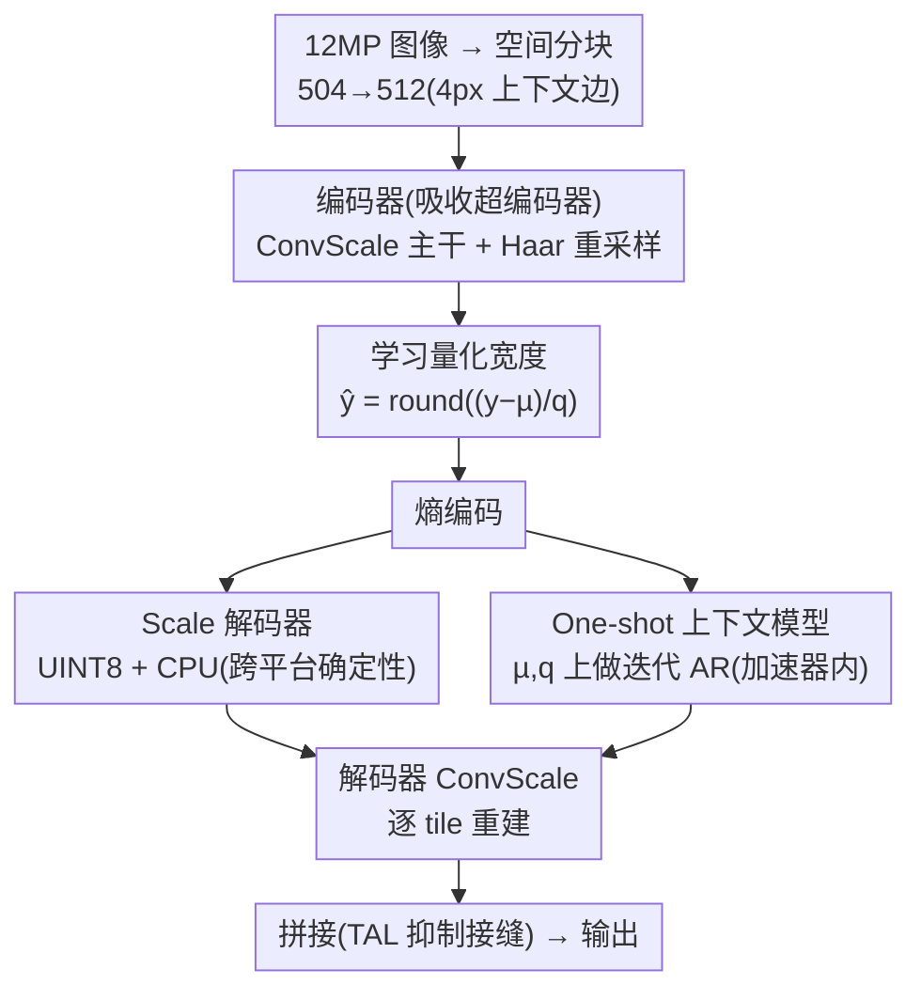

# What Matters in Practical Learned Image Compression

**会议**: CVPR 2026  
**论文**: [CVF Open Access](https://openaccess.thecvf.com/content/CVPR2026/html/Tatwawadi_What_Matters_in_Practical_Learned_Image_Compression_CVPR_2026_paper.html)  
**代码**: 无（Apple，论文未公开实现）  
**领域**: 模型压缩  
**关键词**: 学习图像压缩、感知质量、端侧部署、神经架构搜索、跨平台确定性

## 一句话总结
Apple 系统性消融了"既要感知质量好、又要端侧跑得快"的学习图像编解码器里每一个建模选择，再对上百万种主干配置做性能感知的 NAS，最终造出 PICO——在 iPhone 17 Pro Max 上 230ms 编码、150ms 解码 12MP 图像，主观用户研究里比 AV1/VVC/JPEG-AI 省 2.3–3 倍码率、比最强学习编解码器还省 20–40%。

## 研究背景与动机

**领域现状**：学习图像编解码器相对传统手工编解码器（VVC、AV1、ECM、AV2）的最大差异化优势，是可以端到端、直接对"人眼感知质量"这一目标做优化，而不像传统编解码器那样被启发式设计的组件死死框住。近年来该领域已经解决了不少落地障碍——计算效率提升、低开销的细粒度码率控制、跨平台可靠解码，JPEG-AI 的标准化更是标志着学习编解码器走出学术圈、进入工业界。

**现有痛点**：但"感知质量好"和"端侧实用"这两件事一直没能同时做到。一类做感知优化的工作（HiFiC、MRIC、C3-WD、潜在扩散类方法）确实画质惊艳，但运行时间比可部署要求慢一个数量级，而且往往缺少跨平台支持、码率控制这些实用编解码器的必备特性；另一类追求效率的工作（DCVC-RT、JPEG-AI）又退回到用 PSNR/SSIM 做指标，这些指标和真实感知质量对不上。

**核心矛盾**：感知质量靠的是重量级网络、自回归（AR）熵模型、测试时优化这些"贵"的手段来提升表达力/生成能力，而端侧实用要求恰恰是要把这些开销砍掉——表达力与速度直接冲突。同时还有第三个约束：熵解码对参数极度敏感，编解码两端只要有一丁点浮点计算差异就会整张图解码失败，跨设备确定性是硬门槛。

**本文目标**：不发明一个单点的新模块，而是回答"实用学习图像压缩里到底什么才重要"——把决定一个实用编解码器的所有关键建模选择系统地消融一遍，在不增加计算复杂度的前提下尽量榨出表达力，再用架构搜索找到满足端侧运行时目标、同时感知压缩效率最高的模型。

**切入角度**：作者的观察是，很多"贵"的手段其实只是用错了地方。比如 AR 之所以慢，根因是它被用在了熵解码必需的 scale 参数 $\omega$ 上、导致 CPU 与加速器反复来回搬数据；如果只把 scale 一次性（one-shot）解出来，AR 就能自由地只作用在 $\mu, q$ 上、全程留在加速器里。类似地，很多提升表达力的操作（学习缩放、Haar 小波重采样）可以通过重参数化做到推理期零开销。

**核心 idea**：把"感知质量"与"端侧速度"当成一个联合优化问题，逐项消融 + 百万级 NAS 找出"在哪些地方加表达力是免费的、哪些慢手段可以挪到不挡路的位置"，把这些发现攒成 PICO。

## 方法详解

### 整体框架
PICO 的骨架沿用经典 hyperprior 架构（编码器、解码器、超编码器、超解码器四个子网），但为了端侧落地做了三处关键改动。第一，把超解码器拆成 **scale 解码器** 和 **context 解码器** 两个独立子网：scale 解码器只输出熵编码用的尺度参数 $\omega$，必须编解码两端逐比特一致，因此被单独拎出来做确定性处理；context 解码器是对原 hyper-decoder 位置参数 $\mu$ 的推广，负责更丰富的上下文建模。第二，把超编码器吸收进编码器网络，让整个编码器能作为单个网络编译执行。第三，为端侧加上三件套：跨平台确定性、单模型码率控制、空间分块流水线。

推理时一张 12MP 图像被切成不重叠的 $504\times504$ 小块（padding 到 $512\times512$、带 4 像素邻域上下文），逐块送进编码器得到潜变量 $y$，用学习到的量化宽度 $q$ 量化为 $\hat{y}$，熵编码这一步里 scale 解码器在 CPU 上 one-shot 解出 $\omega$、one-shot 上下文模型在加速器上对 $\mu, q$ 做迭代 AR，二者配合完成无损编码；解码端再用 ConvScale 主干重建每个 tile 并拼接。CPU 跑熵编码/scale 解码、加速器跑神经组件，两者在不同 tile 间并行流水。

### 关键设计

**1. Scale/Context 解码器拆分：把"必须确定性"的部分隔离出来，同时解锁流水线**

熵解码对参数极度敏感，编解码两端 scale $\omega$ 哪怕有一点浮点差异都会导致解码失败，这是跨设备部署的硬门槛。PICO 的做法是把决定 $\omega$ 的 scale 解码器单独做成一个子网，并保证它在所有设备上输出确定。具体地，先把模型量化到 UINT8 让权重和激活都变成整数——但这还不够，量化缩放因子里仍残留浮点运算，而不同硬件对浮点精度/舍入模式的处理无法保证一致；因此作者干脆把 scale 解码器放到 CPU 上运行，以遵循 IEEE 浮点标准、拿到跨平台确定性。把 scale 解码器隔离出来还有第二个红利：它体量小、放在 CPU 上，正好可以和加速器上的神经组件流水并行（一个 tile 的熵编码/scale 解码在 CPU 跑、另一个 tile 的神经计算在加速器跑），既保证鲁棒又换来额外速度。context 解码器则承担更灵活的上下文建模，不受确定性约束。

**2. 零开销堆表达力：ConvScale 主干 + Conv+Haar 重采样**

实用编解码器最怕"为了画质加计算"。PICO 这里的核心洞察是：有些提升表达力的操作可以通过重参数化在推理期折叠掉、做到零额外开销。主干用的是改进版倒残差块 ConvScale311，其核心是 ConvScale 层——在普通卷积（权重 $W$、偏置 $b$）基础上加两个学习的逐通道缩放：输入尺度 $s_{in}$（形状 $[1, C/G, 1, 1]$）和输出尺度 $s_{out}$（形状 $[K,1,1,1]$），参数化为 $W' = s_{in} s_{out} W$、$b' = \mathrm{squeeze}(s_{out}) b$；推理时把缩放折进 $W', b'$，计算成本和普通卷积完全一样。作者还在每个空间分辨率处理块末尾额外加了逐元素学习缩放进一步调制激活。重采样则受 Cosmos tokenizer 启发，用 2D Haar 小波替换所有上/下采样——Haar 把输入可逆地分解成部分去相关的通道，等于给每个学习的重采样操作注入了"多尺度结构化表示"的归纳偏置、有效增大模型容量，作者同样用重参数化技巧让 Haar/iHaar 零开销加入。消融显示：去掉学习缩放 BD-rate 涨 9.58%，重采样退回 pixel shuffle 涨 19.51%、退回 stride-2 卷积涨 8.90%，可见这两个"免费"的容量来源贡献巨大。

**3. One-shot 上下文模型 + 学习量化宽度：拿到 AR 的压缩收益但几乎不付速度代价**

AR 熵建模能显著提升压缩率，但慢，因为熵编码与预测交错、CPU 与加速器反复搬数据。作者的关键观察是：这个慢只来自把 AR 用在熵解码必需的 scale $\omega$ 上。于是 PICO 把 $\omega$ 一次性（one-shot）解出来，让 AR 只作用在 $\mu, q$ 上、全程留在加速器内——迭代预测结构可以和真 AR 一样选成通道分组、棋盘格、$2\times2$ 网格等。配套地引入学习量化宽度：context 解码器先产出一个先验 $p$，再由 context 模型映射成位置 $\mu$ 和一个逐元素、随输入自适应的量化宽度 $q>0$，对主潜变量量化为 $\hat{y} = \mathrm{round}\!\left(\frac{y-\mu}{q}\right)$，熵解码后再用 $q\hat{y}+\mu$ 还原——让量化箱宽随局部内容自适应。消融里：完全去掉 one-shot 上下文模型 BD-rate 涨 10.28%，去掉学习量化宽度涨 8.16%；AR 结构上 $2\times2$ 网格是最优锚点、纯通道分组只 3.10%、说明空间依赖比通道依赖更重要。（⚠️ 表 1 中 checkerboard 一项为 14.67%、反而高于 None 的 10.28%，与正文"棋盘格带来大提升"的表述略有张力，以原文为准。）

**4. 针对性感知损失：外科手术式压制文字与接缝两类人眼敏感伪影**

PICO 的训练失真损失是多项组合：$D = \mathrm{MSE} + w_1\mathrm{LPIPS} + w_2\mathrm{MS\text{-}SSIM} + w_3\mathrm{TAL} + w_4\mathrm{TextFidelity} + w_5\mathrm{GAN}$。GAN 显著提升真实感但会幻觉细节，像素匹配 + 感知项（MSE/LPIPS/MS-SSIM）则起正则作用、让 GAN 无法钻单一损失的空子。但作者发现还有两类人眼极敏感的伪影需要单独治理。其一是文字：感知训练会把文字糊掉、哪怕一点幻觉都让文字不可读，于是用现成文字检测器生成显著性掩码 $m$，在文字区域施加重 L1 损失、同时压制该区域的 GAN 损失（TextFidelityLoss），使文字区误差降到一半。其二是接缝：PICO 分块运行，而感知损失和 GAN 普遍忽略低空间频率分量，导致相邻 tile 间出现色彩失配；作者引入 TilingArtifactLoss（TAL），一个多分辨率 L1 损失，在多个空间频率上施加保真监督，把跨 tile 边界的低频误差降到一半以上。

**5. 性能感知的神经架构搜索：从 140 万配置里挑出速度达标、质量最高的主干**

在上述高层建模决定之上，PICO 还对主干超参做 NAS：目标是 12MP 图像在 iPhone 16 Pro 上神经网络运行时间 ≤100ms（实测可接受的解码速度），在此约束下最大化压缩性能。解码器模型族的超参笛卡尔积约 140 万个候选，作者用多步过滤逐级收敛：① 用算得快的 kMACs/pixel 粗筛，剔掉落在 $[32.7, 48.0]$ 之外的，降到约 50 万；② 因为 MACs 与真实运行时只是松散相关，随机抽 1 万个模型在 iPhone 16 Pro 上实测运行时、滤掉偏离目标 >5% 的，降到约 1000；③ 为省算力，只对这 1000 个做第一阶段、30% epoch 的部分训练，按 PSNR BD-rate 选 Top 20；④ 把 20 个完整训练、按感知指标 + 人眼评估选最终冠军。最终编码器/解码器分别 15.2M/9.6M 参数、磁盘 30.4MB/19.4MB、端侧峰值内存 38.8MB/25.4MB。

### 损失函数 / 训练策略
训练分两阶段：第一阶段只用 MSE 做失真损失，给后续 GAN 训练一个合理初始化；第二阶段（感知微调）加入 Eq.1 全部失真项优化感知质量。GAN 用类 patch-wise 判别器但加宽加深以增强监督，配合判别器监督权重的 warm-up 调度（逐渐增大），避免轻量解码器在判别器早期被带偏导致训练不稳。数据用约 9 万张通用图（类 ImageNet）+ 2.3k 文字内容图 + 2.8 万张 Div2K/CLIC/Flickr2K 高分图，优化器 Adam。码率控制用单模型覆盖全码率区间：把编解码器和损失定义都条件化到一个写进码流的标量质量等级 $l$（基于已有 level embedding 配方并做增强），几乎零计算/模型大小代价。

## 实验关键数据

### 主实验
评测在 CLIC 2020 Test（428 张）、Kodak、DIV2K 上进行，感知指标用 CMMD/FID/LPIPS（PSNR 放附录，因其与感知质量对不上）。主观研究用独立平台 Mabyduck 做盲测两两 A/B 比较，收集 610 名独立审核过的评审者的 74,925 次成对比较，按贝叶斯 Elo 打分。

| 对比对象 | 类型 | PICO 相对收益（人眼主观） |
|--------|------|------|
| HEIC / AV1 / VVC(VTM) | 当前最佳标准化编解码器 | BD-rate >60% → 同质量码率省 2.5 倍以上 |
| BPG | 传统 | 码率省 3 倍以上 |
| AV2 / ECM / JPEG-AI | 下一代/标准化 | 整体 2.3–3 倍码率节省 |
| HiFiC / MRIC / C3-WD | 最强学习+感知编解码器 | 同质量下它们文件大 20–40%，且明显更慢 |

端侧速度（iPhone 17 Pro Max，12MP）：

| 阶段 | PICO 运行时 | 对照 |
|------|------|------|
| 编码 | 低至 230ms | — |
| 解码 | 150ms | 比多数 SOTA 学习编解码器在 V100 GPU 上还快 |

### 消融实验
架构消融（表 1，CLIC 2020，anchor=最终选定设置，数值为 CMMD-CLIP BD-Rate 增幅，越低越好）：

| 消融属性 | 选项 | BD-Rate |
|------|------|------|
| One-shot 自回归 | None | 10.28% |
| | 通道分组(4 组) | 3.10% |
| | 棋盘格 | 14.67% |
| | $2\times2$ 网格（选定） | 0% |
| 学习量化宽度 | 否 | 8.16% |
| | 是（选定） | 0% |
| 学习缩放 | 无 | 9.58% |
| | 仅 ConvScale | 3.76% |
| | 仅逐空间尺度 | 1.21% |
| | ConvScale + 逐空间尺度（选定） | 0% |
| 重采样 | pixel reshuffle | 19.51% |
| | stride-2 卷积/反卷积 | 8.90% |
| | Haar 重采样（选定） | 0% |
| 以上全部 | 全关 | 31.69% |
| | 全开 | 0% |

伪影专项损失消融（表 2，各自专门构造的指标）：

| 指标 | 损失 | 关 | 开 |
|------|------|------|------|
| 文字区 L1 误差 | TextFidelityLoss | 0.0093 | 0.0046（≈2× 降低） |
| 跨 tile 边界低频误差 | TilingArtifactLoss | 0.0020 | 0.00097（>2× 降低） |

### 关键发现
- 把所有架构增强一起关掉，BD-rate 恶化 31.69%——这些"免费"或"低开销"的设计叠加起来贡献巨大。单项里 one-shot 上下文模型（10.28%）、学习缩放（9.58%）、学习量化宽度（8.16%）是三个最大贡献点。
- 重采样选择影响最大：从 Haar 退回 pixel shuffle 直接涨 19.51% BD-rate，说明给重采样注入可逆多尺度归纳偏置非常划算。
- AR 上"空间依赖 > 通道依赖"：纯通道分组只带来 3.10% 改善、而 $2\times2$ 网格做到锚点最优，提示空间相关性更值得建模。
- TextFidelityLoss / TAL 都能把对应伪影误差砍到约一半，验证了"人眼敏感伪影要外科手术式单独治理、而非靠通用感知损失"的思路。

## 亮点与洞察
- **"把贵的手段挪到不挡路的位置"是最巧的一招**：AR 不是不能用，而是别用在熵解码必需的 scale 上——one-shot 解 scale + 仅对 $\mu,q$ 做 AR，让 AR 的压缩收益几乎免费拿到，这个"诊断慢的根因再绕开它"的思路可迁移到任何"强但慢"的组件。
- **重参数化让表达力变免费**：ConvScale 的学习缩放、Haar 小波都靠推理期折叠做到零开销——这是"训练期堆容量、推理期不付钱"的范式，可直接搬到其他端侧网络。
- **跨平台确定性用"隔离 + CPU + UINT8"三连解**：把唯一需要逐比特一致的子网拎出来单独处理，既满足鲁棒又顺带换来流水线并行，是工程与建模的双赢设计。
- **性能感知 NAS 的过滤漏斗很实用**：kMACs 粗筛 → 真机实测运行时 → 部分训练 → 完整训练，每步用"算得越来越准但越来越贵"的代理逐级收敛，是大搜索空间下省算力的标准范式。

## 局限与展望
- **强烈依赖 Apple 内部数据与硬件**：训练数据有约 9 万张内部通用图、评测/优化深度绑定 iPhone 16/17 Pro 的编译器与 CPU/加速器协同，外部很难复现，且未公开代码。
- **NAS 针对特定设备/运行时目标**：100ms@iPhone 16 Pro 的搜索结论换硬件/换分辨率可能要重搜，迁移成本高。
- **主观研究虽大但仍受平台与方法学约束**：Elo 来自单一平台的成对比较，跨研究横向比绝对幅度需谨慎。
- **表 1 棋盘格反常**（14.67% 高于 None）与正文表述存在小张力，作者未细究，⚠️ 以原文为准。
- **分块带来的接缝/上下文边问题靠损失部分缓解**：TAL 显著减小但未根除跨 tile 不一致，更激进的并行粒度可能重新引入伪影。

## 相关工作与启发
- **vs 传统编解码器（VVC/AV1/ECM/AV2/BPG）**：它们靠手工流水线 + 熵编码挖冗余、结构上难以对感知质量直接优化、还常需专用硬件导致更新周期长；PICO 端到端可微、直接优化人眼感知，主观码率省 2.3–3 倍。
- **vs 感知型学习编解码器（HiFiC/MRIC/C3-WD/扩散类）**：它们感知质量接近 PICO，但靠重量级网络/扩散/测试时优化，比 PICO 慢一个量级、同质量文件大 20–40%，且缺跨平台/码率控制；PICO 把感知质量做到实用速度。
- **vs 效率型学习编解码器（DCVC-RT/JPEG-AI）**：它们快但优化 PSNR/SSIM、感知质量打折；PICO 证明用 GAN/感知优化 + 零开销容量增强可以兼顾。
- **vs JPEG-AI 的上下文设计**：JPEG-AI 独立发展出类似的局部预测组件，但只作用于 $\mu$、且 AR 步数是 PICO 的两倍；PICO 的 one-shot 上下文模型更省。

## 评分
- 新颖性: ⭐⭐⭐⭐ 单点创新不算颠覆，但"系统性回答什么才重要 + 多个零开销/挪位置的巧设计"组合很有价值
- 实验充分度: ⭐⭐⭐⭐⭐ 74,925 次主观比较 + 全面架构/损失消融 + 真机端侧测速，证据链扎实
- 写作质量: ⭐⭐⭐⭐ 结构清晰、消融与动机对应紧密，部分细节（NAS 架构、level embedding）压在附录
- 价值: ⭐⭐⭐⭐⭐ 第一个把感知质量做到可端侧实时部署的学习编解码器，工业落地意义强

<!-- RELATED:START -->

## 相关论文

- [\[CVPR 2026\] Block-based Learned Image Compression without Blocking Artifacts](block-based_learned_image_compression_without_blocking_artifacts.md)
- [\[AAAI 2026\] DynaQuant: Dynamic Mixed-Precision Quantization for Learned Image Compression](../../AAAI2026/model_compression/dynaquant_dynamic_mixed-precision_quantization_for_learned_i.md)
- [\[ICML 2026\] Efficient Learned Image Compression without Entropy Coding](../../ICML2026/model_compression/efficient_learned_image_compression_without_entropy_coding.md)
- [\[ICCV 2025\] Learned Image Compression with Hierarchical Progressive Context Modeling](../../ICCV2025/model_compression/learned_image_compression_with_hierarchical_progressive_context_modeling.md)
- [\[CVPR 2025\] Learned Image Compression with Dictionary-based Entropy Model](../../CVPR2025/model_compression/learned_image_compression_with_dictionary-based_entropy_model.md)

<!-- RELATED:END -->
