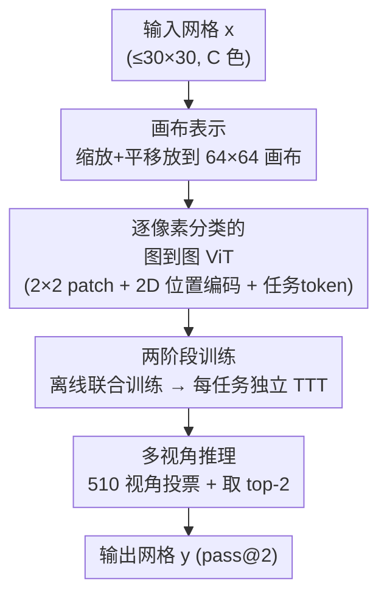

# ARC Is a Vision Problem!

**会议**: CVPR 2026  
**论文**: [CVF Open Access](https://openaccess.thecvf.com/content/CVPR2026/html/Hu_ARC_Is_a_Vision_Problem_CVPR_2026_paper.html)  
**代码**: https://github.com/lillian039/VARC  
**领域**: 视觉推理 / 抽象推理 / Vision Transformer  
**关键词**: ARC, 抽象推理, 图到图翻译, 测试时训练, 视觉先验

## 一句话总结
这篇 MIT（Kaiming He 组）的工作把一向被当成"语言/序列推理"的 ARC 抽象推理基准重新表述为**图到图翻译**问题，用一个从零训练、仅 18M 参数的标准 ViT 配合"画布表示 + 平移/缩放增强 + 测试时训练"，在 ARC-1 上拿到 54.5%（集成后 60.4%），追平人类平均水平并大幅超过同样从零训练的循环推理模型。

## 研究背景与动机
**领域现状**：ARC（Abstraction and Reasoning Corpus）是衡量"从极少样本中抽象出规则"这一核心智能的基准——每个任务只给 2-4 对演示 $(x,y)$，模型要在没见过的新任务上推断输出。主流解法有两条路：一是把网格转成文本 token 喂给 LLM 做 in-context few-shot（依赖互联网规模预训练的常识）；二是最近的循环推理模型（HRM、TRM），从零只用 ARC 数据训练、靠迭代式递归推理。

**现有痛点**：ARC 的谜题**本质上是视觉的**——反射、对称、重力这些底层概念都根植于视觉与物理世界，但几乎没人从视觉视角去解。LLM 路线把二维网格拍平成一维 token 序列，丢掉了图像天然的二维空间结构；循环模型虽不依赖大规模预训练，灵感却仍来自语言建模。更尴尬的是，唯一一个早期把 ViT 用到 ARC 的工作（ViT-ARC）只能过拟合训练集里的单个任务，**完全无法泛化到未见任务**，没满足 ARC "少样本、跨任务"的本质。

**核心矛盾**：ARC 任务是按"少样本、多任务"组织的——400 个训练任务、400 个全新测试任务，每个任务都由几对样本独立定义。语言范式既没利用视觉先验（二维局部性、平移/缩放不变性），又要靠海量外部语料补常识；而朴素地把网格当图像喂 ViT 又会因为颜色 token 太少（只有约 10 种）而记忆过拟合、学不到空间规律。

**本文目标**：在"从零、只用 ARC 数据"的受控设定下，把视觉先验注入到一个标准视觉模型里，让它真正泛化到未见任务。

**切入角度**：既然 ARC 概念本就来自视觉世界，那就老老实实把它当成图像理解问题——具体说是把"输入网格→输出网格"看成像语义分割那样的**逐像素分类**的图到图翻译。

**核心 idea**：把每个 ARC 任务当作 image-to-image translation，用"画布"表示赋予网格自然图像的几何性质，再套标准 ViT，从零训练 + 测试时训练做泛化。

## 方法详解

### 整体框架
VARC 的输入是一个最大 $30\times30$、每格取 $C\approx10$ 种颜色之一的网格 $x$，输出是同构网格 $y$，目标是逐像素预测每个位置的颜色类别。整条流程分四块串起来：先把原始网格经随机缩放/平移放到一张固定大小（如 $64\times64$）的"画布"上，让它具备自然图像的几何性质；再用一个标准 ViT 做图到图映射，并以"任务 token"作为条件区分不同任务；训练分两阶段——离线阶段在全部 400 个训练任务上联合训练一个共享权重的网络，推理阶段对每个新任务单独做测试时训练（TTT）来适配；最后用多视角推理把同一输入在不同增强下的预测投票汇总，输出 pass@2 结果。

### 关键设计

**1. 画布表示：用一张大画布把离散网格变成"自然图像"**

直接把 $H\times W$ 网格当图像喂 ViT 有个致命问题：如果一个 patch 就是一个原始像素，那 token 词表只有 $C\approx10$ 种，模型极易记住而非学习空间规律。VARC 定义一张预设的大画布（如 $64\times64$），把原始网格经几何变换后**放置到画布的某个位置**，画布其余部分填一个额外的背景色（第 $C{+}1$ 种）。这样做的关键收益是：当 patch 取 $2\times2$ 时，一个 patch 可以横跨多种颜色，理论 cardinality 高达 $O(C^{2\times2})$——token 空间从十几种暴涨到指数级，逼着模型去学局部空间配置而不是死记单像素。消融里仅这一步（$1\times1$ patch on $32^2$ → $2\times2$ patch on $64^2$）就带来 2.4 点提升（43.0→45.4），即便只引入一像素的平移空间，多色 patch 也显著丰富了学习的数据空间。

**2. 平移与缩放增强：把视觉里的几何不变性显式注入**

画布这个容器的真正威力在于它让两种经典视觉数据增强变得自然可用。**缩放增强**：给定原始网格，随机选一个整数倍率 $s$，把每个像素复制成 $s\times s$（类似最近邻插值——因为 ARC 的"颜色"不是真实色，不能做双线性插值）。**平移增强**：把缩放后的网格随机放到画布的不同位置，只要保证所有像素可见。这两者迫使模型学到对几何变换不变的底层映射。实测上平移把准确率从 45.4 推到 48.3（+2.9），而缩放贡献最大、一举 +6.2 点（48.3→54.5）。作者点破原因：平移不变性可以被 patchification（一种特殊卷积）部分覆盖，但 **ViT 对缩放不变性几乎没有任何归纳偏置**，所以缩放增强补的正是模型最缺的那一块。

**3. 图到图 ViT + 2D 位置编码：逐像素分类完成抽象映射**

把任务表述成逐像素分类后，VARC 学一个网络 $f_\theta$，输入图像 $x_i$、条件于该任务的可学习 task token，输出每个位置的类别分布，目标就是逐像素交叉熵：

$$L(\theta) = \mathbb{E}_{T,i}\big[D\big(y_i,\, f_\theta(x_i \mid T)\big)\big]$$

架构上用标准 ViT：画布切成不重叠 patch（默认 $2\times2$），但因为 ARC 像素是离散索引而非连续值，先把每个颜色索引映射成可学习的连续 embedding 再做 patch 投影。一个易被忽略却关键的点是**二维位置编码**：图像本就是二维的，若朴素地把 patch 当一维序列，二维结构就丢了。VARC 采用可分离的 2D 位置编码（前一半通道编码横坐标、后一半编码纵坐标），对绝对位置和 RoPE 相对位置都适用。消融显示，把 $54.5$ 的强基线里的 2D RoPE 换回 1D，掉 3.5 点（54.5→51.0），说明显式二维建模是必要而非锦上添花。作者还验证了换成 U-Net（同为图到图的经典卷积网络）也能取得不错精度，佐证"这是个视觉问题"的论点不依赖于特定架构。

**4. 两阶段训练（离线联合 + 每任务独立 TTT）：先学世界常识，再为新任务现场适配**

ARC 的"少样本、多任务"特性决定了不能指望一个静态模型直接泛化。VARC 用两阶段：**离线训练**在全部 400 个训练任务的演示对上联合训练一个共享权重网络，每个任务只额外配一个任务条件 token（训练集的 inference 样本只用于验证、不参与训练）；为扩充数据还从 RE-ARC 每任务采 1000 对，总计约 400k 样本对。**测试时训练（TTT）**：面对一个全新任务 $T$，用它的 2-4 对演示对临时微调模型——新任务 token 随机初始化，再叠加翻转/旋转/颜色置换等增强（每个增强当成一个带独立 embedding 的辅助任务），整个 TTT 在单 GPU 上约 70 秒/任务，之后做纯前馈推理、无任何递归。一个反直觉的发现：**对每个测试任务独立做 TTT 比把所有测试任务放一起联合 TTT 高约 10 点**——作者推测联合 TTT 会让模型在测试任务上过训、反而遗忘离线学到的视觉常识。

### 一个完整示例
拿一个"未见测试任务"走一遍：给定 2-4 对演示（比如演示的是"把图形沿对角线反射"），和一个待推断输入 $x_\text{infer}$。① 先对该任务做 TTT：随机初始化一个新 task token，把演示对配上翻转/旋转/颜色置换等辅助任务，在画布上叠加平移/缩放增强，微调约 70 秒。② 推理：把 $x_\text{infer}$ 在 510 个不同的缩放+平移视角下分别放上画布，每个视角过 ViT 得到一张逐像素预测；同一原始位置可能被画布上多个像素预测到（缩放导致），先在该位置对所有 softmax 做平均池化得到单视角预测。③ 多视角汇总：510 个视角的输出网格做多数投票（两张网格只有逐格完全相同才算"一致"，赢家是与最多其他网格一致的那张），保留得票最高的 top-2 作为 pass@2 的两个答案。论文图 6 可视化了 TTT 过程中 $x_\text{infer}$ 的预测如何从模糊逐步收敛到正确网格。

## 实验关键数据

### 主实验
ARC-1 / ARC-2 系统级对比（pass@2，%）。VARC 全部从零、仅用 ARC 数据训练：

| 系统 | 参数量 | ARC-1 | ARC-2 |
|------|--------|-------|-------|
| Deepseek R1 (LLM) | 671B | 15.8 | 1.3 |
| o3-mini-high (LLM) | N/A | 34.5 | 3.0 |
| GPT-5 (LLM) | N/A | 44.0 | 1.9 |
| Grok-4-thinking (LLM) | 1.7T | 66.7 | 16.0 |
| HRM (循环模型) | 27M | 40.3 | 5.0 |
| TRM (循环模型) | 7M | 44.6 | 7.8 |
| **VARC (ViT 单模型)** | 18M | **54.5** | 8.3 |
| **VARC (集成 ViT+U-Net)** | 73M | **60.4** | 11.1 |
| avg. human | - | 60.2 | - |

要点：在"从零训练"的同台竞技里，18M 的 VARC 比 7M 的 TRM 在 ARC-1 上高约 10 点（相对提升 >20%）；集成后的 60.4% 追平人类平均 60.2%，且模型比顶级 LLM 小好几个数量级、不依赖任何互联网规模数据。

### 消融实验
视觉先验逐项叠加（ViT-18M，ARC-1 eval，%），每行在上一行基础上增量：

| 配置 | 准确率 | 增量说明 |
|------|--------|----------|
| (a) 朴素基线 | 26.8 | 去掉 b-f 全部组件 |
| (b) +2D 绝对位置编码 | 32.8 | 二维位置建模 |
| (c) +2D RoPE | 43.0 | 相对位置二维化 |
| (d) 1×1@32² → 2×2@64² patch | 45.4 | patch 跨多色，token 空间指数级膨胀 |
| (e) +平移增强 | 48.3 | 画布上自由平移 |
| (f) +缩放增强 | 54.5 | ViT 最缺的缩放不变性 |

视觉先验累计带来 **27.7 点**提升（a→f），其中画布相关设计（c→f）贡献 11.5 点。

其他关键消融：
- **2D vs 1D 位置编码**：强基线上把 2D RoPE 换 1D，54.5→51.0（−3.5）。
- **多视角推理**（表 2）：单视角 pass@1 35.9 → 多视角 pass@1 49.8 → 多视角 pass@2 54.5。ARC 里错一个像素整题即错，所以投票收益远大于普通分割任务。
- **TTT 策略**（图 9）：有离线训练 vs 无离线（54.5 vs 26.4，但 26.4 说明部分任务能 tabula rasa 解出）；独立 TTT 比联合 TTT 高约 10 点。

### 关键发现
- **缩放增强是单点贡献最大的视觉先验（+6.2）**，因为 ViT 架构本身对尺度不变性几乎零归纳偏置，必须靠增强补。
- **独立 TTT > 联合 TTT 约 10 点**：联合训练反而过拟合测试任务、遗忘离线常识，提示 TTT 的"少而专"比"多而泛"更安全。
- **可扩展但会过拟合**：18M ViT 是甜点，66M ViT 训练精度更高但泛化反降（表 1 的 53.0<54.5），作者明确指出未来研究该聚焦泛化而非拟合。
- **任务 embedding 有语义结构**：400 个任务 token 的 t-SNE 显示语义相近的任务（如染色类、AND/OR/XOR 逻辑类）聚在一起，说明模型确实在学任务间的关系。

## 亮点与洞察
- **"换一个表述就换一片天"的范式重述**：核心创新不是新模块，而是把 ARC 从"语言/序列问题"重新框定为"图到图翻译"，让二维空间先验自然落地——这种 reframing 式贡献比堆架构更有启发性。
- **画布 + patch 的 token 爆炸技巧很巧**：用 $2\times2$ patch 让 token 词表从约 10 种涨到 $O(C^4)$，本质是用"空间组合"对抗"颜色记忆"，可迁移到任何离散符号网格的视觉建模。
- **缩放不变性的诊断很清醒**：作者明确区分了"patchification 能部分覆盖平移不变性、但对缩放无能为力"，从而解释了为何缩放增强收益最大——这种对归纳偏置缺口的精准定位值得借鉴。
- **TTT 的"独立优于联合"反直觉结论**很有价值：提示在测试时适配里，更强的假设（一次拿到多任务）未必带来更好结果，过训遗忘是真实风险。

## 局限与展望
- **作者承认**：模型规模到 66M 就出现过拟合，泛化是瓶颈；ARC-2 上绝对精度仍很低（VARC 仅 8.3-11.1，远低于 ARC-1），说明更难的抽象任务远未解决。
- **依赖测试时训练**：每个新任务要约 70 秒 TTT + 510 视角推理，虽单 GPU 可跑，但相比纯前馈推理仍有不小的部署开销；TTT 本质上是"为每个任务现学一个小模型"，规模化到大量任务时成本累积。
- **纯视觉的天花板**：作者自己也指出人类推理并非孤立依赖语言或视觉，VARC 是"互补的视觉视角"，对那些需要语言/符号中介的抽象概念，纯图到图可能力有不逮——多模态融合是自然的下一步。
- **可改进**：把缩放/平移之外的视觉先验（如旋转/反射不变性直接编码进架构而非靠增强）、或把任务 embedding 的语义结构显式用于跨任务知识迁移，都可能进一步提升泛化。

## 相关工作与启发
- **vs LLM 路线（Deepseek/o3/GPT-5/Grok-4）**: 他们把网格转文本 token 靠互联网规模预训练补常识，VARC 从零只用 ARC 数据、模型小几个数量级；优势是不依赖外部数据且利用了视觉先验，劣势是 ARC-2 等更难基准上仍被最强 LLM（如 Bespoke-Grok-4 的 79.6/29.4）甩开。
- **vs 循环推理模型（HRM、TRM）**: 同为从零训练，但它们靠迭代递归推理、灵感来自语言建模；VARC 走纯前馈视觉路线，18M 比 7M TRM 在 ARC-1 高约 10 点，证明视觉范式在受控设定下更优。
- **vs ViT-ARC**: 早期同样用 ViT，但只能拟合训练集单个任务、无法泛化到未见任务、不满足 ARC 协议；VARC 通过画布表示 + 两阶段训练（离线 + TTT）专门解决"少样本跨任务泛化"，是本质区别。
- **vs 经典视觉推理（CLEVR/VQA/neuro-symbolic VLM）**: 那些协议训练集和测试集是同一任务的实例，靠感知模块+语言式递归模块；ARC 是大量彼此不同的任务、每个只有几例，VARC 把它当分割式逐像素分类来解。

## 评分
- 新颖性: ⭐⭐⭐⭐⭐ 把 ARC 从语言范式整体重述为图到图视觉问题，是教科书级的 reframing 创新
- 实验充分度: ⭐⭐⭐⭐⭐ 视觉先验逐项消融 + TTT 策略 + 架构/规模对比 + 系统级对标，证据链完整
- 写作质量: ⭐⭐⭐⭐⭐ 论证清晰、对归纳偏置缺口的分析尤其透彻，Kaiming He 一贯的简洁风格
- 价值: ⭐⭐⭐⭐⭐ 用 18M 从零模型追平人类平均、超越同设定循环模型，为抽象推理打开视觉新方向

<!-- RELATED:START -->

## 相关论文

- [\[ACL 2025\] Unsolvable Problem Detection: Evaluating Trustworthiness of Large Multimodal Models](../../ACL2025/multimodal_vlm/unsolvable_problem_detection.md)
- [\[ICCV 2025\] Pi-GPS: Enhancing Geometry Problem Solving by Unleashing the Power of Diagrammatic Information](../../ICCV2025/multimodal_vlm/pi-gps_enhancing_geometry_problem_solving_by_unleashing_the_power_of_diagrammati.md)
- [\[CVPR 2026\] Diffusion Guided Chain-of-Vision for Large Autoregressive Vision Models](diffusion_guided_chain-of-vision_for_large_autoregressive_vision_models.md)
- [\[CVPR 2026\] Modeling Cross-vision Synergy for Unified Large Vision Model](modeling_cross-vision_synergy_for_unified_large_vision_model.md)
- [\[CVPR 2026\] VisMem: Latent Vision Memory Unlocks Potential of Vision-Language Models](vismem_latent_vision_memory_unlocks_potential_of_vision-language_models.md)

<!-- RELATED:END -->
