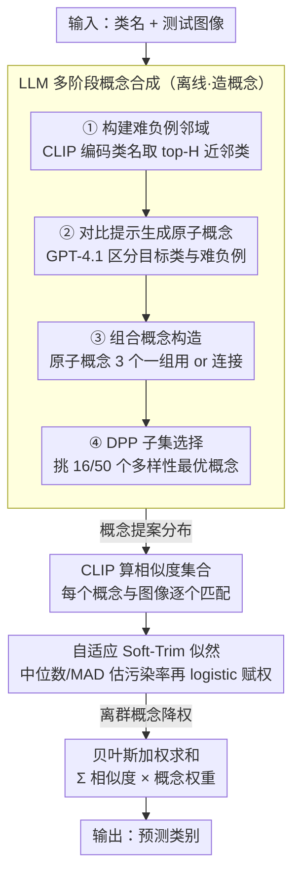

# Beyond Heuristic Prompting: A Concept-Guided Bayesian Framework for Zero-Shot Image Recognition

**会议**: CVPR2026  
**arXiv**: [2603.07911](https://arxiv.org/abs/2603.07911)  
**代码**: [github.com/less-and-less-bugs/CGBC](https://github.com/less-and-less-bugs/CGBC)  
**领域**: 多模态VLM  
**关键词**: 零样本分类, CLIP, 贝叶斯推理, 概念引导, prompt工程, 鲁棒估计

## 一句话总结
将 VLM 零样本图像识别重构为贝叶斯框架，通过 LLM 驱动的多阶段概念合成流水线构建概念提案分布，并用自适应 soft-trim 似然函数抑制离群概念影响，在 11 个分类基准上优于 SOTA 方法。

## 研究背景与动机
1. CLIP 等 VLM 通过简单 prompt 模板（如 "A photo of {class}"）实现零样本分类，但性能受限于 prompt 工程的启发式设计
2. 现有 prompt 增强方法（如 CuPL 用 LLM 生成类描述）在细粒度分类（如 "2000 AM General Hummer SUV"）中适应性不足
3. 已有方法缺乏理论基础——直接平均所有增强 prompt 的相似度缺乏原则性框架
4. 增强 prompt 与测试图像的相似度分布常呈现偏态或重尾分布，存在离群 prompt 降低精度的风险
5. 测试时数据增强方法（如 TPT、MTA）引入显著计算开销
6. 需要一个既有理论保证又兼顾计算效率的零样本分类框架

## 方法详解

### 整体框架

CGBC 把零样本分类从「拍脑袋设计 prompt」重构成概念空间上的贝叶斯边际化：类别 $Y_i$ 的后验由一组概念 $C_{i,j}$ 加权而来，

$$p(Y_i|X) \approx \sum_{C_{i,j} \in \mathcal{C}_i} p(Y_i|X, C_{i,j}) \cdot p(X|C_{i,j})$$

其中 $p(Y_i|X, C_{i,j})$ 由 CLIP 相似度算出，$p(X|C_{i,j})$ 是一个自适应 soft-trim 似然（充当概念的权重）。于是整套方法分两块：一块负责**造概念**——用 LLM 离线合成一组高质量、有区分度的概念当作概念提案分布；另一块负责**用概念**——在贝叶斯加权时压住那些和图像格格不入的离群概念。两块都做完，推理时只是一次加权求和，零额外计算。

### 关键设计

**1. LLM 驱动的多阶段概念合成：造出可区分、可组合、够多样的概念**

简单 prompt（"A photo of {class}"）和启发式描述在细粒度类别（如 "2000 AM General Hummer SUV"）上区分度不够。CGBC 用一条四步流水线让 LLM 合成满足可区分性、组合性、多样性的概念：

1. **构建难负例邻域**：用 CLIP 文本编码器编码类名，给每个类找最相似的 $H$ 个类
2. **对比提示生成原子概念**：用 GPT-4.1 Turbo 生成能把目标类和这些难负例区分开的原子概念（每类 50 个），相似度 > 0.9 的去重
3. **组合概念构造**：从原子概念池随机采样、每 3 个用 "or" 连接，造出 500 个候选组合概念
4. **DPP 子集选择**：用 Determinantal Point Process 从 500 个候选里挑 16 或 50 个多样性最优的概念

关键在第 2 步用「对比难负例」而非孤立描述来生成，逼出的是真正有判别力的特征；第 4 步用 DPP 而非随机挑，保证留下的概念彼此不冗余。

**2. 自适应 Soft-Trim 似然：让离群概念自动降权**

增强概念与测试图像的相似度分布常呈偏态或重尾，混进来的离群概念会拉低精度——直接对所有概念取均值（如 CuPL）就吃这个亏。Soft-trim 似然先稳健地估出分布中心和离散度，再据此给每个概念打权重：算相似度集合 $\mathcal{S}_i$ 的中位数 $m_i$ 和 MAD，估计污染率 $\hat{\rho}_i = \frac{1}{M_i}\sum \mathbb{I}[|S_{i,j} - m_i| > \lambda \cdot \text{MAD}_i]$，再用 logistic 形式赋权：

$$w_{i,j} = \sigma\left(-\log\frac{1-\hat{\rho}_i}{\hat{\rho}_i} \cdot \frac{|S_{i,j}-m_i| \cdot k}{\text{MAD}_i}\right)$$

离中心越远的概念权重越低，相当于「软裁剪」掉离群者而非硬性丢弃。这一步还有理论撑腰：论文给出鲁棒性保证（Theorem 1）和多类超额风险界（Corollary 1），证明估计误差受污染率 $\rho$、概念数 $M$ 和 sigmoid 斜率 $k$ 约束——也就是说离群概念的影响被可证地控制住，而不只是经验上有效。

### 损失函数 / 训练策略

training-free，无需任何训练：概念离线由 LLM 生成并用 CLIP 编码，推理时只做一次贝叶斯加权求和，无额外计算开销。

## 实验关键数据

### 主实验：11 个零样本分类数据集表现

| 方法 | SUN397 | Aircraft | EuroSAT | Cars | ImageNet | Avg. | 辅助 |
|------|--------|----------|---------|------|----------|------|------|
| CLIP | 62.3 | 23.9 | 42.2 | 65.5 | 66.7 | 63.5 | (1,1) |
| CLIP+E | 65.1 | 23.7 | 47.7 | 66.3 | 68.4 | 64.4 | (1,80) |
| TPT | 65.4 | 23.1 | 42.9 | 66.4 | 68.9 | 65.1 | (64,1) |
| CuPL | — | — | — | — | — | ~65 | (1,~50) |
| **CGBC (M=16)** | **最优** | **最优** | **最优** | **最优** | **最优** | **最优** | (1,16) |

### 消融实验

| 组件 | 移除后影响 |
|------|-----------|
| 对比提示（vs 独立提示） | 平均下降 1-2%，细粒度数据集影响更大 |
| 组合概念（vs 仅原子概念） | 平均下降约 1% |
| DPP 选择（vs 随机选择） | 平均下降约 0.5-1% |
| Soft-trim 似然（vs 均匀平均） | 平均下降 1-3%，偏态分布数据集影响最大 |

### 关键发现
- CGBC 在 11 个基准上一致优于所有零样本方法，且无需测试时数据增强
- 概念数 M=16 已足够有效，M=50 时进一步提升但边际收益递减
- Soft-trim 似然在存在明显离群概念的数据集上提升最显著

## 亮点与洞察
- 从贝叶斯视角系统化了 VLM 零样本分类，将概念作为潜变量优雅地统一了 prompt 增强范式
- 概念提案分布的三个属性（可区分性、组合性、多样性）有认知科学根基，不是临时设计
- training-free，仅需离线生成概念并编码，推理时无额外计算开销

## 局限性
- 概念生成依赖 GPT-4.1 Turbo API，对概念质量有天花板
- 理论假设（sub-Gaussian、已知污染率）可能在实际中不完全满足
- 仅验证了 ViT-B/16 backbone，更大视觉编码器上的表现待确认

## 相关工作与启发
- 与 CuPL 的关键区别：CuPL 启发式平均所有描述，CGBC 通过贝叶斯加权实现自适应
- 与 TPT/MTA 的区别：计算实时增强 vs CGBC 的离线概念+零开销推理
- DPP 用于概念选择的思路可迁移到其他需要多样性采样的场景

## 评分
- 新颖性: ⭐⭐⭐⭐⭐ (贝叶斯框架+理论保证，概念合成流水线完整)
- 实验充分度: ⭐⭐⭐⭐ (11 个数据集，但仅 ViT-B/16)
- 写作质量: ⭐⭐⭐⭐⭐ (理论推导严谨，方法动机环环相扣)
- 价值: ⭐⭐⭐⭐ (training-free + 理论保证，实用性强)

<!-- RELATED:START -->

## 相关论文

- [\[ECCV 2024\] Meta-Prompting for Automating Zero-Shot Visual Recognition with LLMs](../../ECCV2024/multimodal_vlm/meta-prompting_for_automating_zero-shot_visual_recognition_with_llms.md)
- [\[CVPR 2026\] Self-guided Semantic Inspection for Zero-Shot Composed Image Retrieval](self-guided_semantic_inspection_for_zero-shot_composed_image_retrieval.md)
- [\[CVPR 2026\] SOTA: Self-adaptive Optimal Transport for Zero-Shot Classification with Multiple Foundation Models](sota_self-adaptive_optimal_transport_for_zero-shot_classification_with_multiple_.md)
- [\[CVPR 2026\] Beyond Missing Modalities: Hypergraph Guided Diffusion for Uncertainty-Aware Multimodal Emotion Recognition](beyond_missing_modalities_hypergraph_conditioned_diffusion_for_uncertainty-aware.md)
- [\[CVPR 2026\] One Patch to Caption Them All: A Unified Zero-Shot Captioning Framework](one_patch_to_caption_them_all_a_unified_zero-shot_captioning_framework.md)

<!-- RELATED:END -->
