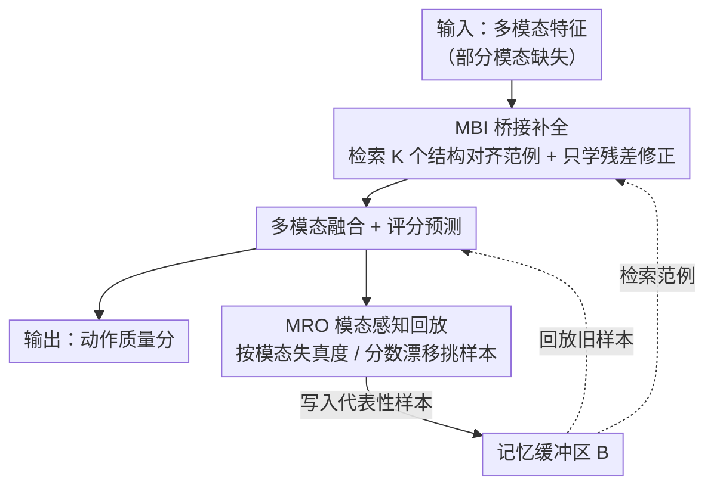

# BriMA: Bridged Modality Adaptation for Multi-Modal Continual Action Quality Assessment

**会议**: CVPR2026  
**arXiv**: [2602.19170](https://arxiv.org/abs/2602.19170)  
**代码**: [github.com/ZhouKanglei/BriMA](https://github.com/ZhouKanglei/BriMA)  
**领域**: 多模态VLM  
**关键词**: 动作质量评估, 持续学习, 模态缺失, 多模态融合, 记忆回放

## 一句话总结
提出 BriMA，通过记忆引导的桥接补全和模态感知回放机制，解决多模态持续动作质量评估中非平稳模态不平衡问题，在三个基准上平均提升 6-8% 相关系数、降低 12-15% 误差。

## 研究背景与动机
1. 动作质量评估（AQA）广泛应用于体育分析、康复评估、技能评价，多模态方法（视觉+运动学线索）已取得显著进展
2. 现实部署中，传感器故障、标注缺失导致非平稳模态不平衡——模态可用性随时间变化
3. 现有多模态 AQA 方法假设输入模态完整稳定，一旦模态缺失即出现显著性能下降
4. 现有持续 AQA 方法仅关注任务级遗忘，不处理模态层面的动态变化
5. 简单插补、基于检索的补全、生成式合成均无法保持 AQA 评分关键的几何结构，导致排序一致性被破坏
6. AQA 的细粒度评分敏感性使其本质上不同于普通的缺失模态重建问题

## 方法详解

### 整体框架

BriMA 处理的是多模态持续 AQA 里「模态时有时无（传感器故障、标注缺失）」导致的非平稳模态不平衡。它在每个训练 session 中做三件事：先用 MBI 模块把缺失模态的特征补回来，再融合所有模态特征预测动作质量分，最后用 MRO 模块挑出信息量大的样本进记忆缓冲区回放、对抗跨任务的分布漂移。两个模块一个管「当下这帧模态缺了怎么补」，一个管「历史样本怎么留才不遗忘」，二者通过共享的记忆缓冲区串成一个闭环：缓冲区里的范例既供 MBI 检索补全，又供 MRO 回放复习。

### 关键设计

**1. MBI：记忆引导的桥接补全，只学残差不硬造特征**

AQA 评分对几何结构极敏感，简单插补、检索或生成式合成都会破坏评分流形、打乱排序一致性，所以缺失模态不能随便填。MBI 的做法是「检索范例 + 学残差修正」三步走：先对缺失模态 $m$，用余弦相似度从上一轮记忆缓冲区 $\mathcal{B}_{t-1}$ 检索 $K$ 个结构对齐的范例特征，

$$s_{j,t'} = \frac{\langle \mathbf{z}_{i,t}^{\mathcal{O}}, \mathbf{z}_{j,t'}^{\mathcal{O}} \rangle}{\|\mathbf{z}_{i,t}^{\mathcal{O}}\| \|\mathbf{z}_{j,t'}^{\mathcal{O}}\|}$$

再用一个二值掩码 $\mathbf{r}_{i,t}$ 标出哪些模态缺了、配合可学习任务嵌入 $\mathbf{p}_t^m$ 提供任务特定条件；最后关键的一步是只学**桥接残差**而非完整特征合成：

$$\tilde{\mathbf{z}}_{i,t}^m = \bar{\mathbf{z}}_{i,t}^m + \Delta\mathbf{z}_{i,t}^m = \bar{\mathbf{z}}_{i,t}^m + B_\Theta(\mathbf{z}_{i,t}^{\mathcal{O}}, \bar{\mathbf{z}}_{i,t}^m, \mathbf{c}_t^m)$$

即在检索范例的均值 $\bar{\mathbf{z}}_{i,t}^m$ 上叠一个小修正量。学残差比从零生成保守得多，在监督信号有限时更稳，也更不容易破坏评分敏感的特征结构。

**2. MRO：模态感知的回放，按失真和漂移挑样本**

持续学习要靠回放对抗遗忘，但随机回放在「模态还会缺失」的场景下并不可靠——回放进来的样本本身可能模态残缺、分数覆盖也不均。MRO 因此按模态失真度和分数漂移动态地优先选样本，维护一个「模态可靠、分数覆盖平衡」的代表性记忆缓冲区，再用这些样本回放来压住跨任务的分布漂移。和随机回放相比，它保证了被复习的旧知识既干净又有代表性。

### 损失函数

$$\min_{\theta_f, \theta_g} \mathcal{L}_{score} + \lambda_{mem}\mathcal{L}_{mem} + \lambda_{rec}\mathcal{L}_{rec}$$

其中 $\mathcal{L}_{score}$ 为 MSE 评分损失，$\mathcal{L}_{mem}$ 为记忆回放正则损失，$\mathcal{L}_{rec} = \|\tilde{\mathbf{z}} - \mathbf{z}\|_2^2$ 为特征重建损失。

## 实验关键数据

### 主实验：RG 数据集对比（$\beta=10\%$ 模态缺失率）

| 方法 | 发表 | SRCC↑ Avg | MSE↓ Avg | RL2↓ Avg |
|------|------|-----------|----------|----------|
| ST-MLAVL | CVPR'25 | 0.599 | 9.94 | 3.558 |
| EWC | PNAS'17 | 0.605 | 10.26 | 3.709 |
| MER | ICLR'19 | 0.722 | 6.77 | — |
| **BriMA** | **本文** | **最优 (~0.76+)** | **最低** | **最低** |

### 消融实验

| 组件 | SRCC 变化 | MSE 变化 |
|------|----------|---------|
| 无 MBI（零填充） | 显著下降 | 显著上升 |
| 无 MRO（随机回放） | 下降 | 上升 |
| 无残差机制（直接生成） | 下降 | 上升 |
| 完整 BriMA | 最优 | 最优 |

### 跨数据集表现
在 RG、Fis-V、FS1000 三个数据集上，BriMA 平均提升：
- 秩相关系数：+6.1%, +8.3%, +1.4%
- 误差降低：-12.7%, -15.3%, -6.4%
- 相对误差降低：-13.9%, -14.1%, -5.2%

### 关键发现
- 残差学习策略比直接特征生成更稳定，尤其在监督信号有限时
- 模态感知回放选择比随机回放有效得多
- MBI 和 MRO 两个组件都对整体性能提升有重要贡献

## 亮点与洞察
- 首次系统性定义和解决多模态持续 AQA 中的非平稳模态不平衡问题
- 残差桥接比完整重建更保守、更安全——在评分敏感任务中尤为重要
- 记忆引导的检索+残差修正机制在保持评分流形结构上表现出色

## 局限性
- 假设缺失模态模式已知（$\mathcal{M}_{i,t}$ 在训练时可观测），未探索自动检测缺失模态
- 仅验证了两种模态的场景，三模态以上的扩展性待确认
- 记忆缓冲区大小对性能的影响未充分讨论

## 相关工作与启发
- 与通用缺失模态学习的区别：BriMA 专门针对 AQA 评分敏感性设计，避免了通用方法的评分流形破坏
- 与 Fs-Aug / MAGR 等持续 AQA 方法的区别：后者仅处理任务级非平稳，不解决模态层面问题
- 启发：残差桥接思想可迁移到其他需要模态补全但对输出精度敏感的任务

## 评分
- 新颖性: ⭐⭐⭐⭐ (问题定义新颖，MBI 设计合理)
- 实验充分度: ⭐⭐⭐⭐ (3 个数据集，多种缺失率，全面消融)
- 写作质量: ⭐⭐⭐⭐ (问题形式化清晰，符号统一)
- 价值: ⭐⭐⭐ (应用场景相对垂直，但方法思路有普适性)

<!-- RELATED:START -->

## 相关论文

- [\[CVPR 2026\] Probabilistic Prompt Adaptation for Unified Image Aesthetics and Quality Assessment](probabilistic_prompt_adaptation_for_unified_image_aesthetics_and_quality_assessm.md)
- [\[AAAI 2026\] MCMoE: Completing Missing Modalities with Mixture of Experts for Incomplete Multimodal Action Quality Assessment](../../AAAI2026/multimodal_vlm/mcmoe_completing_missing_modalities_with_mixture_of_experts_for_incomplete_multi.md)
- [\[CVPR 2026\] HDR-VLM: HDR-Domain Adaptation of VLMs and Preference-Aligned Quality Assessment for HDR Video Color Grading](hdr-vlm_hdr-domain_adaptation_of_vlms_and_preference-aligned_quality_assessment_.md)
- [\[ICLR 2026\] VisJudge-Bench: Aesthetics and Quality Assessment of Visualizations](../../ICLR2026/multimodal_vlm/visjudge-bench_aesthetics_and_quality_assessment_of_visualizations.md)
- [\[CVPR 2026\] Decoupling Stability and Plasticity for Multi-Modal Test-Time Adaptation](decoupling_stability_and_plasticity_for_multi-modal_test-time_adaptation.md)

<!-- RELATED:END -->
