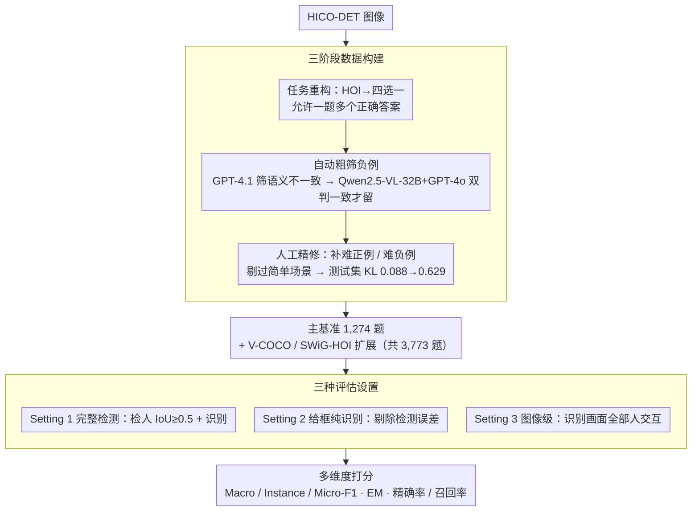

# CrossHOI-Bench: A Unified Benchmark for HOI Evaluation across Vision-Language Models and HOI-Specific Methods

**会议**: CVPR 2026  
**arXiv**: [2508.18753](https://arxiv.org/abs/2508.18753)  
**代码**: [github.com/ChelsieLei/CrossHOI-Bench](https://github.com/ChelsieLei/CrossHOI-Bench)  
**领域**: 多模态VLM / 人-物交互检测  
**关键词**: HOI检测, VLM评估, 多选题基准, 跨范式比较

## 一句话总结

提出 CrossHOI-Bench，首个统一评估 VLM 和 HOI 专用模型的多选题 HOI 基准，通过精心策划的正负例避免不完整标注的错误惩罚，揭示大型 VLM 零样本在 Instance-F1 上超越 SOTA HOI 方法 +5.18%，但在多动作识别和跨人归因上仍存在系统性弱点。

## 研究背景与动机

**领域现状**：HOI 检测长期由任务专用模型主导（ADA-CM、CMMP、HOLa 等），但大型生成式 VLM（Qwen2.5-VL、InternVL3）已展示强大的开放场景理解能力，引发"VLM 能否直接做 HOI 检测"的核心问题。

**现有痛点**：(1) 现有 HOI 基准（HICO-DET）依赖精确标签匹配+不完整标注——任何未标注但正确的预测被判错；(2) 标注歧义无法通过穷尽标注解决：单张图像常缺乏足够视觉证据区分动作（如"登机"vs"下机"）；(3) HICO-DET 训练/测试集分布高度相似（KL=0.088），大量简单头部类场景难以真正评估模型能力。

**核心矛盾**：需要一个统一协议让两种范式在同一标准下公平比较，但现有基准的评估方法论本身就存在缺陷，系统性低估真实能力：HOI 专用方法 <50% mAP，VLM 在 HICO-DET 上仅约 15%。

**本文目标** 设计一个无偏的跨范式 HOI 评估基准，揭示 VLM 和 HOI 专用方法的真实能力差异和互补优势。

**切入角度**：将 HOI 检测重构为多答案多选题，用精心策划的正负例消除不完整标注问题。

**核心 idea**：多选题格式+策划负例+三种评估设置，首次实现 VLM 与 HOI 专用方法的公平直接对比。

## 方法详解

### 整体框架

CrossHOI-Bench 想回答一个问题：大型 VLM 能不能直接做 HOI 检测，又该怎么和 HOI 专用模型公平地比？它把 HOI 检测整体重构成「多答案多选题」——每张图配一道四选一的题，正例来自标注加人工补充，负例则是精心策划出来的「看着像但确实不对」的动作。这样模型答对未标注但正确的动作时不会被误判为错，从根上绕开了精确匹配 + 不完整标注带来的系统性低估。整条流水线分两大块：先用「三阶段数据构建」造出一套干净的多选题（任务重构 → 自动粗筛负例 → 人工精修并重分布测试集），再让模型在「三种评估设置」下统一打分。

### 关键设计

**1. 三阶段数据构建：把「答错」和「没标到」彻底分开**

精确匹配式基准最大的毛病是把「模型预测了一个对的但没被标注的动作」也算错，于是 VLM 在 HICO-DET 上只有约 15% 的虚低分数。CrossHOI-Bench 用三阶段构建来消除这种惩罚。第一阶段任务重构成四选一、且允许一题多个正确答案（比如同时认 "hold knife" 和 "cut with knife"），选项随机排列防止位置偏置。第二阶段自动粗筛负例：先用 GPT-4.1 把候选动作分成语义一致 / 不一致，再交给 Qwen2.5-VL-32B + GPT-4o 双模型做一致性验证，只有两个模型都判定为错的动作才留作负例，避免把「其实可能对」的动作误塞进干扰项。第三阶段人工精修：移除过于简单的场景（单人、简单背景），补进难正例（"boarding" 和 "exiting" 这类歧义动作都算对），再补进难负例（周围人的动作、"holding" vs "hugging" 这种细粒度相似动作）。最后还把测试集重分布，使它与 HICO-DET 训练集的 KL 散度从 0.088 提到 0.629，削掉大量靠数据先验就能蒙对的头部样本。最终产出主基准 1,274 张图，外加 V-COCO 扩展 647 题（多人场景）和 SWiG-HOI 扩展 1,852 题（人-人交互），共 3,773 题。

**2. 三种互补评估设置：把「检测错」和「识别错」拆开诊断**

光看一个总分无法判断 VLM 到底是定不准人还是认不出动作，所以基准设了三档难度递进、互相隔离误差来源的设置。Setting 1 是完整 HOI 检测，模型要先检测到目标人物（IoU ≥ 0.5）再识别其交互，考察端到端能力；Setting 2 直接给定人物框、只评识别，把检测误差剔除，单独暴露定位瓶颈；Setting 3 升到图像级，要求识别画面里所有人的交互，考察全局理解。三档对照之下，就能看出小型 VLM 在「只识别」时其实和 HOI 方法持平、一旦要自己检测就崩，这类结论才站得住。每道题用 Macro-F1（类平衡）、Instance-F1（每题表现）、Micro-F1（全局聚合）、Exact Match 以及平均精确率 / 召回率多维度打分，避免单一指标掩盖偏科。

## 实验关键数据

### 主实验：Setting 1（完整 HOI 检测）

| 方法 | 类型 | Macro-F1 | Instance-F1 | EM | Avg.Prec | Avg.Rec |
|------|------|----------|-------------|-----|----------|---------|
| ADA-CM | HOI | 43.02 | 47.76 | 19.15 | 76.25 | 51.80 |
| HOLa | HOI | 43.61 | 47.12 | 19.78 | 74.31 | 52.15 |
| CMD-SE | HOI | 47.49 | 44.66 | 20.33 | 78.33 | 46.96 |
| InternVL3-38B | VLM | 38.04 | 38.68 | 20.33 | 84.72 | 33.56 |
| **Qwen2.5-VL-32B** | **VLM** | **50.71** | **52.94** | **26.06** | 75.03 | 51.97 |
| Qwen2.5-VL-7B | VLM | 29.73 | 30.53 | 14.29 | 75.92 | 24.89 |

### Setting 2（给定人物框，纯识别）

| 方法 | 类型 | Macro-F1 | Instance-F1 | EM | Avg.Prec | Avg.Rec |
|------|------|----------|-------------|-----|----------|---------|
| InternVL3-38B | VLM | 58.94 | 67.41 | 35.64 | 81.90 | 57.85 |
| Qwen2.5-VL-32B | VLM | 62.90 | 69.52 | 35.01 | 75.30 | 66.61 |
| Qwen2.5-VL-7B | VLM | 48.93 | 57.25 | 25.98 | 74.49 | 46.87 |

### 消融/分析

| 维度 | VLM 优势 | HOI 专用优势 |
|------|---------|-------------|
| 整体F1 | 大模型零样本超越SOTA | 小模型与HOI方法持平 |
| 多动作识别 | 倾向只预测一个动作 | 更好识别共现多动作 |
| 跨人归因 | 常将周围人动作归给目标人 | 更准确的人-动作绑定 |
| 精确率 | 通常更高（84.72%） | 较稳定（~76%） |
| 召回率 | 波动大（33%-52%） | 更均衡（~52%） |

### 关键发现

- Qwen2.5-VL-32B 零样本在 Instance-F1 上超越所有 HOI 方法 +5.18%（52.94 vs 47.76）
- 小型 VLM（7-8B）在仅识别设置下与 HOI 方法持平，但需要检测时性能大幅下降
- VLM 核心弱点：多动作预测不足（只预测一个交互）和跨人动作误归因
- Qwen3-VL-30B 出现极端行为：Avg.Prec=100% 但 Recall 约 0%，几乎不做预测

## 亮点与洞察

- 首次在统一协议下比较 VLM 和 HOI 专用方法，结论有说服力且具示范效应
- 揭示了现有 HOI 基准系统性低估模型能力的根本原因
- 多选题格式+精心负例设计的方法论可迁移到其他标注不完整的评估任务
- 三种互补设置和子基准提供了多维度的能力剖析，设计严谨

## 局限与展望

- 基准规模相对较小（主基准 1,274 张图），可能不足以覆盖所有 HOI 场景
- 多选题格式可能简化了开放世界 HOI 理解的真实难度
- 负例策划依赖 VLM 一致性判断，可能引入特定模型偏见
- 未深入分析微调后 VLM 在基准上的表现变化

## 相关工作与启发

- **vs HICO-DET/V-COCO**：根本区别在于多答案多选题 vs 精确匹配，消除不完整标注的系统性惩罚
- **vs SWiG-HOI**：SWiG-HOI 扩展标签空间（5500+ HOI 类别），CrossHOI-Bench 更关注跨范式公平对比
- **评估方法论启发**：VLM 在许多任务上的能力可能因基准设计缺陷被系统性低估，类似重构评估方法可能带来新发现
- **VLM 能力上限启发**：大 VLM 的 HOI 理解能力已被严重低估，未来应更关注多动作识别和跨人归因

## 评分

⭐⭐⭐⭐⭐ (4.5/5)

- **新颖性** ⭐⭐⭐⭐：统一跨范式评估的基准设计填补重要空白
- **实验充分度** ⭐⭐⭐⭐⭐：多模型+多设置+子基准+多维度分析，极其全面
- **写作质量** ⭐⭐⭐⭐⭐：问题阐述清晰，实验设计严谨，结论有力
- **价值** ⭐⭐⭐⭐⭐：揭示了重要的评估偏差和范式互补性，具有社区影响力

<!-- RELATED:START -->

## 相关论文

- [\[ICLR 2026\] Zero-shot HOI Detection with MLLM-based Detector-agnostic Interaction Recognition](../../ICLR2026/multimodal_vlm/zero-shot_hoi_detection_with_mllm-based_detector-agnostic_interaction_recognitio.md)
- [\[CVPR 2026\] SO-Bench: A Structural Output Evaluation of Multimodal LLM](so-bench_a_structural_output_evaluation_of_multimodal_llm.md)
- [\[CVPR 2026\] LVLM-Aided Alignment of Task-Specific Vision Models](lvlm-aided_alignment_of_task-specific_vision_models.md)
- [\[CVPR 2026\] HAVE-Bench: Hierarchical Audio-Visual Evaluation from Perception to Interaction](have-bench_hierarchical_audio-visual_evaluation_from_perception_to_interaction.md)
- [\[CVPR 2026\] UNICBench: UNIfied Counting Benchmark for MLLM](unicbench_unified_counting_benchmark_for_mllm.md)

<!-- RELATED:END -->
