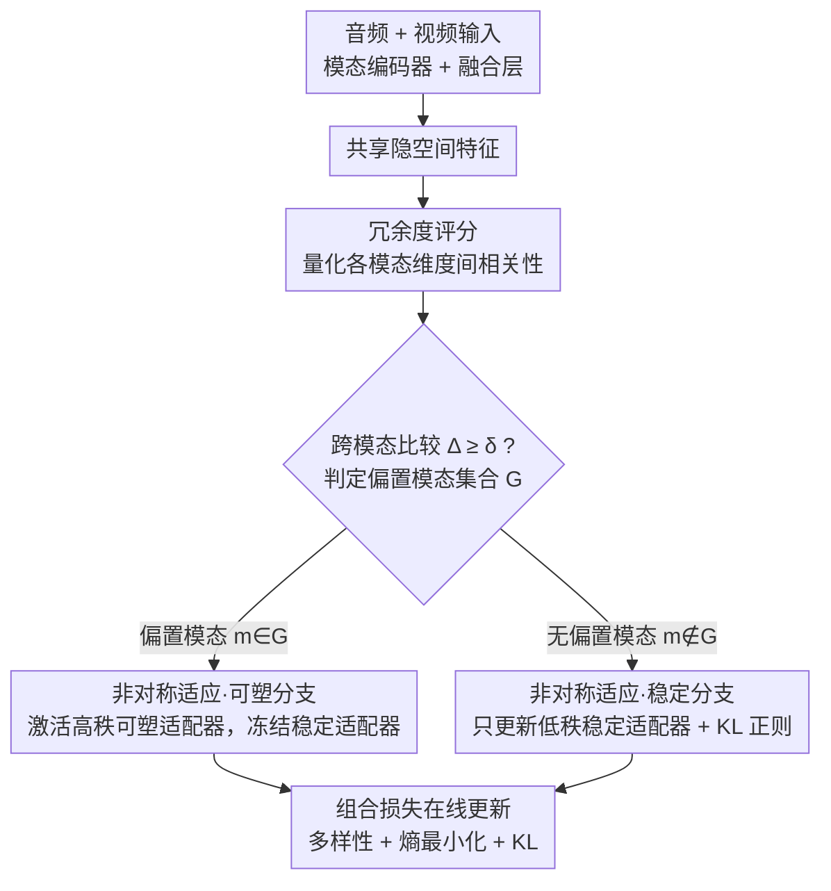

# Decoupling Stability and Plasticity for Multi-Modal Test-Time Adaptation

**会议**: CVPR 2026  
**arXiv**: [2603.00574](https://arxiv.org/abs/2603.00574)  
**代码**: [GitHub](https://github.com/he4cs/DASP)  
**领域**: 多模态VLM  
**关键词**: 多模态测试时适应, 稳定性-可塑性解耦, 冗余度评分, 非对称适应, 灾难性遗忘

## 一句话总结

提出 DASP，通过冗余度评分诊断偏置模态，再用非对称适应策略解耦稳定性与可塑性，解决多模态测试时适应中的负迁移和灾难性遗忘问题。

## 研究背景与动机

**多模态模型的分布偏移脆弱性**：多模态模型（音频-视频）在非平稳环境中面临天气变化、传感器退化等分布偏移，静态预训练模型性能显著下降。

**测试时适应（TTA）的兴起**：TTA 通过在线更新参数实现对分布偏移的适配，无需访问源数据，但现有方法多针对单模态设计。

**负迁移问题**：模态无关的适应策略不加区分地适应所有模态，可能对已对齐的无偏置模态造成负迁移。

**灾难性遗忘问题**：持续参数更新导致源域知识被擦除，特别是在偏置模态上表现严重。

**稳定性-可塑性困境**：现有方法难以平衡——偏置模态需要可塑性以适配目标分布，无偏置模态需要稳定性以保留源域知识。

**传统诊断指标不可靠**：熵和置信度在多模态中不可靠——主导模态即使遭受偏移也可能保持低熵高置信度，无法进行跨模态比较。

## 方法详解

### 整体框架

DASP 要解决的核心矛盾是：测试时面对分布偏移，多模态模型里只有部分模态真正"坏了"，可现有方法不加区分地把所有模态一起更新，结果偏置模态没补够、无偏置模态反被带歪。它的思路是"先诊断、再分而治之"——先判断哪个模态遭了偏移，再对偏置模态和无偏置模态采取完全不同的适应力度。整条流程是：多模态特征进入融合层的共享隐空间后，先用冗余度评分给每个模态打分、挑出偏置模态；随后每个模态的适配器按各自身份走不同分支，偏置模态放开可塑性去贴合目标分布、无偏置模态则锁住稳定性保留源域知识；最后用一个组合损失在线更新。

### 关键设计

**1. 冗余度评分：用不需要源域统计的指标，替掉在多模态里失灵的熵和置信度**

诊断偏置模态的难点在于，熵和置信度在多模态里并不可靠——一个占主导的模态即使自己已经遭受偏移，也可能照样输出低熵高置信度的预测，而且这类指标无法在模态之间横向比较谁更糟。DASP 换了个观察角度：在融合层的共享隐空间里看各模态特征的维度间相关性。分布偏移会让特征流形退化，原本应当相对独立的各个维度开始对同一种域特定噪声做出一致反应，于是维度间冒出虚假相关，冗余度随之显著升高。据此定义冗余度评分 $R(\mathbf{Z})$ 衡量单个模态的相对冗余，再做跨模态比较

$$\Delta^m = r^m - \min_{n \in \mathcal{M}} r^n$$

当 $\Delta^m \geq \delta$ 时就把模态 $m$ 划入偏置模态集合 $\mathcal{G}$。这样诊断既不碰源数据、又能在线计算，还天然支持"谁比谁更偏"的跨模态排序，正好补上熵/置信度做不到的地方。

**2. 非对称适应：让偏置模态和无偏置模态走结构不同的两条分支，把稳定性和可塑性拆开**

诊断出偏置模态只是第一步，关键是后续怎么处理才能既补偏置、又不伤无偏置。DASP 把每个模态的适配器 $\Phi^m$ 拆成两块角色相反的子模块：稳定适配器 $\phi_s^m$ 用低秩，倾向学域无关的泛化表示；可塑适配器 $\phi_p^m$ 用高秩，专门去捕捉域特定信息。两类模态据此走完全不同的分支——偏置模态 $m \in \mathcal{G}$ 激活可塑适配器、冻结稳定适配器，让它放手适配目标分布 $\tilde{z}^m = \phi_p^m(\phi_s^m(z^m))$；无偏置模态 $m \notin \mathcal{G}$ 则直接跳过可塑适配器、只更新稳定适配器并加 KL 正则约束 $\tilde{z}^m = \phi_s^m(z^m)$。这套设计的巧妙处在于把"可塑性"和"稳定性"外部化成了两个独立通路：域特定知识塞进高秩可塑分支、域无关知识留在低秩稳定分支，从架构上避开了二者互相覆盖，因此偏置模态的灾难性遗忘和无偏置模态的负迁移被同时压住。

### 损失函数

$$\mathcal{L}_{\text{total}} = \mathcal{L}_{\text{div}} + \lambda_{\text{ent}} \mathcal{L}_{\text{ent}} + \lambda_{\text{kl}} \mathcal{L}_{\text{kl}}$$

三项各司其职：多样性正则 $\mathcal{L}_{\text{div}}$ 防止预测全部坍缩到少数类别，熵最小化 $\mathcal{L}_{\text{ent}}$ 鼓励确定性预测，KL 散度惩罚 $\mathcal{L}_{\text{kl}}$ 把无偏置模态的稳定适配器约束在源模型附近、不让它偏离。

## 实验关键数据

### 主实验：Kinetics50-C 视频腐蚀（Episodic Adaptation）

| 方法 | 平均准确率↑ |
|------|------------|
| Source (无适应) | 59.9 |
| Tent | 59.4 |
| EATA | 60.1 |
| SAR | 59.8 |
| READ | 62.5 |
| TSA | 63.8 |
| **DASP (Ours)** | **65.2** |

### 消融实验

| 组件 | 影响 |
|------|------|
| 冗余度评分 vs 熵/置信度 | 冗余度与准确率强相关，熵/置信度不可靠 |
| 非对称 vs 对称适应 | 非对称显著减少负迁移和遗忘 |
| KL正则化 | 有效约束无偏置模态稳定性 |
| 低秩/高秩设计 | 匹配各模态角色需求 |

### 关键发现

- 冗余度评分在 Kinetics50-C 和 VGGSound-C 上均与准确率强相关
- 偏置模态的冗余度显著高于无偏置模态
- DASP 同时缓解了负迁移（无偏置模态）和灾难性遗忘（偏置模态）
- 在音频腐蚀场景中表现尤为突出（VGGSound-C 上大幅领先基线）

## 亮点与洞察

- 冗余度评分是一个优雅的非参数诊断指标，无需源域统计即可在线使用
- "诊断-缓解"框架逻辑清晰，先定位问题再针对性解决
- 稳定/可塑适配器的解耦设计直觉合理——域特定参数外部化，域无关参数内部化
- 低秩 vs 高秩的结构化设计与各自角色需求自然匹配

## 局限性

- 冗余度评分的阈值 $\delta$ 需要预设，不同场景可能需要调整
- 仅在音频-视频双模态场景验证，更多模态（如文本+图像+音频）待扩展
- 偏置模态的切换是硬决策，无法处理两个模态同时偏移的情况
- 计算冗余度需要 batch 统计，不适用于 batch size=1 的场景

## 相关工作与启发

- 与 TSA 的选择性适应最相关，但 TSA 的软路由在无监督设置中不够稳定
- 与 MDAA 都关注灾难性遗忘，但 DASP 通过架构解耦而非解析方法
- 稳定性-可塑性困境的视角可推广到持续学习、联邦学习等场景
- 冗余度评分可作为通用的分布偏移检测工具

## 评分
- 新颖性: ⭐⭐⭐⭐
- 实验充分度: ⭐⭐⭐⭐
- 写作质量: ⭐⭐⭐⭐
- 价值: ⭐⭐⭐⭐

<!-- RELATED:START -->

## 相关论文

- [\[CVPR 2026\] Multi-modal Test-time Adaptation via Adaptive Probabilistic Gaussian Calibration](multi-modal_test-time_adaptation_via_adaptive_probabilistic_gaussian_calibration.md)
- [\[CVPR 2026\] Condensed Test-Time Adaptation of VLMs for Action Recognition](condensed_test-time_adaptation_of_vlms_for_action_recognition.md)
- [\[CVPR 2026\] Dynamic Logits Adjustment and Exploration for Test-Time Adaptation in Vision Language Models](dynamic_logits_adjustment_and_exploration_for_test-time_adaptation_in_vision_lan.md)
- [\[CVPR 2026\] STAR: Test-Time Adaptation Can Enhance Universal Prompt Learning for Vision-Language Models](star_test-time_adaptation_can_enhance_universal_prompt_learning_for_vision-langu.md)
- [\[CVPR 2026\] Controllable Federated Prompt Learning at Test Time](controllable_federated_prompt_learning_at_test_time.md)

<!-- RELATED:END -->
