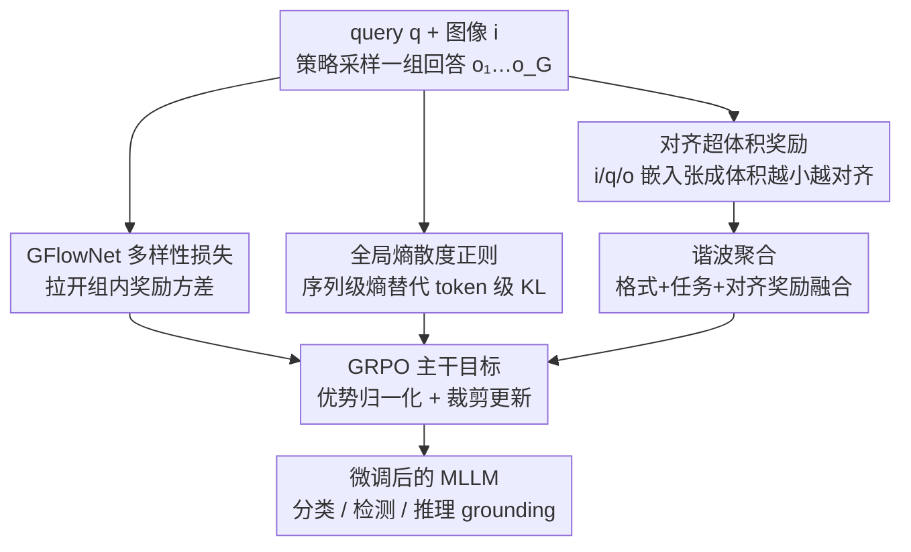

# DEVA: Fine-tuning Multimodal Large Language Models for Visual Perception Tasks

**会议**: CVPR 2026  
**论文**: [CVF Open Access](https://openaccess.thecvf.com/content/CVPR2026/html/Das_DEVA_Fine-tuning_Multimodal_Large_Language_Models_for_Visual_Perception_Tasks_CVPR_2026_paper.html)  
**代码**: 无  
**领域**: 多模态VLM  
**关键词**: GRPO, 强化微调, 视觉感知, GFlowNet, 奖励聚合

## 一句话总结
针对用 GRPO 强化微调多模态大模型做视觉感知时"组内奖励几乎一样、策略探索受限、奖励设计粗糙"三大顽疾，DEVA 在 GRPO 损失之上叠加 GFlowNet 多样性损失、全局熵正则、对齐超体积奖励和谐波聚合四个即插即用组件，在分类/检测/推理 grounding 上稳定带来 +5～+13 点提升。

## 研究背景与动机

**领域现状**：把强化学习（尤其是无需 critic 的 GRPO）用于微调大语言模型，已被证明在标注稀缺时优于监督微调（SFT）——RL 鼓励泛化、SFT 偏向记忆。近期 ViRFT（Visual-RFT）把 GRPO 搬到视觉感知任务上，用 IoU、分类准确率这类**可验证的规则奖励**指导微调，相比 SFT 大幅提升，开辟了"用 RL 微调 MLLM 做感知"这条路线。

**现有痛点**：作者对 GRPO 的训练动力学做了更深入的剖析，发现三个被 ViRFT 忽视的瓶颈。其一，规则奖励**多样性极差**：同一个 query 采样出的一组回答往往拿到几乎相同的奖励，归一化后的优势 $A_i$ 趋近于零，策略梯度随之消失，更新形同虚设。其二，GRPO 用 token 级 KL 散度做正则，这种**局部约束反而锁死了策略的探索空间**，让通用 MLLM 难以充分适配到专门的视觉任务上。其三，中间推理链（reasoning trace）没有 ground-truth，无法赋予可验证奖励，而朴素地把多个奖励**算术相加**会让强奖励淹没弱奖励，导致次优。

**核心矛盾**：可验证规则奖励虽然可靠高效，但它"非黑即白"的离散性天然缺乏区分度——这与策略梯度需要奖励有方差才能学习之间存在根本冲突；同时 token 级稳定性正则与全局探索之间也存在 trade-off。

**本文目标**：在不改动 GRPO 主干、保持即插即用的前提下，分别补上"奖励多样性不足""探索受限""奖励设计/聚合粗糙"三块短板。

**切入角度**：作者观察到 GFlowNet 训练目标本是为生成多样化轨迹而设计，恰好能给组内奖励"注入方差"；熵的序列级散度能替代 token 级 KL 实现更粗粒度（因而更自由）的探索控制；而图像-问题-回答三者的对齐程度可以用它们嵌入张成的**超体积**来度量，体积越小越对齐。

**核心 idea**：用四个组件——Diversity（多样性损失）、Exploration（熵正则）、alignment **V**olume（对齐体积奖励）、**A**ggregation（谐波聚合）——拼成 DEVA，叠加在 GRPO 及其各种变体之上提升视觉感知表现。

## 方法详解

### 整体框架
DEVA 不是一个新的 RL 算法，而是**架在 GRPO（及 DAPO/BNPO/GSPO 等变体）之上的四件套增强**。原始 GRPO 流程不变：对 query $q$ 采样一组回答 $\{o_1,\dots,o_G\}$，用规则奖励算出各自奖励、归一化成优势 $A_i$，再优化带 token 级 KL 正则的裁剪目标（式 1）。DEVA 在这条主干的三个位置动手：在**损失侧**加一项 GFlowNet 多样性损失 $L_{div}$ 拉开组内奖励方差、把原本的 token 级 KL 换成**全局熵散度正则** $L_{reg}$ 放开探索；在**奖励侧**新增一个由图像/问题/回答嵌入超体积导出的非可验证对齐奖励 $r_v$，再用**谐波聚合**把格式奖励、任务奖励和对齐奖励融成最终奖励 $r$。四个组件相互独立、可单独叠加，论文实验里逐个累加每个都能涨约 1 点。

### 关键设计

**1. GFlowNet 多样性损失：给趋同的组内奖励注入方差**

这是 DEVA 的灵魂组件，直击"组内奖励几乎相同→优势消失→梯度归零"的死穴。作者把 MLLM 的自回归生成建模成一个 token 级 MDP $\langle S,A,f\rangle$：状态是已生成的 token 串、动作是词表、转移就是字符串拼接，直到吐出 EOS（$\top$）。在此之上引入 GFlowNet 的"流"（flow）概念，并采用 detailed balance 条件作为训练目标。由于文本生成是单向的，作者令反向策略 $\pi_B(\cdot)=1$、并设 $F(s)=r(s)/\pi(s_f\mid s)$，把平衡条件写成对数空间的平方损失：

$$L_{div}(\pi;r)=\sum_{t=1}^{n-1}\Big(\log\frac{r(o_t\mid o_{1:t-1})\,\pi(\top\mid o_{1:t+1})}{r(o_{t+1}\mid o_{1:t})\,\pi(\top\mid o_{1:t})}+\log\pi(o_{t+1}\mid o_t)\Big)^2$$

其中奖励项由参考模型定义为 $\log r(o_t\mid o_{1:t-1})=\log\pi_{ref}(o_t\mid o_{1:t-1})+\exp\big(\tfrac{1}{\gamma}\log\pi_{ref}(\top\mid o_{1:t-1})\big)$，$\gamma\in(0,1]$ 控制奖励信号强度，$\top$ 项保证模型能合理终止。这样设计让策略既保持多样、又不过分偏离参考模型。效果很直接：在 LISA 上加了 $L_{div}$ 后，组内奖励的平均标准差从 GRPO 的 0.234 升到 0.262、DAPO 从 0.201 升到 0.240——方差变大意味着优势估计不再塌缩，策略梯度重新变得有效，单是这一项就能超过很强的 GSPO 基线。这也是已知第一个把 GFlowNet 损失与 GRPO 结合的工作。

**2. 全局熵散度正则：用序列级熵替代 token 级 KL 解放探索**

GRPO 原始目标里那项 token 级 KL 散度（式 1 的 $\beta D_{KL}(\pi_\theta\|\pi_{ref})$）虽然稳住了训练，却因为"逐 token локально约束"把策略空间探索锁死了，对需要大幅适配的视觉感知任务尤其不利。DEVA 把这个**局部**度量换成一个**全局**度量：分别计算策略模型和参考模型每个 token 输出分布的熵 $H_t^\theta$、$H_t^{ref}$，再对二者的**平均熵之差**取均方误差作为正则项：

$$L_{reg}=\Big\|\tfrac{1}{m}\sum_{t=1}^{m}H_t^\theta-\tfrac{1}{n}\sum_{t=1}^{n}H_t^{ref}\Big\|_2^2$$

$m$、$n$ 分别是策略与参考输出的序列长度，正则对每个组元素分别计算。关键区别在于：它只在序列层面约束"整体探索程度"，而不再死盯每个 token 的概率，于是允许 token 级分布更自由地变化，从而鼓励更广的策略探索。实验里加上 $L_{reg}$ 后奖励曲线收敛更快、饱和值更高，KL 范围随之扩大（佐证探索确实变强），各项指标普遍再涨约 1 点。

**3. 对齐超体积奖励：用嵌入张成的体积度量图文回答三者一致性**

推理链没有 ground-truth，无法给可验证奖励，但又必须保证"推理过程、输入图像、查询"三者一致。DEVA 的巧法是把三者的对齐程度几何化：分别把图像 $i$、查询 $q$、回答 $o$ 编码到共享表示空间 $f_i,f_q,f_o$。其中图像不用整张，而是用一个掩码 $m$（对语言解码器里图文 token 交互的自注意力打分做阈值得到）抠出相关 patch，即 $i'=i\circ m$。三个嵌入归一化到单位超球面后，计算它们张成的平行多面体体积——等价于 Gram 矩阵 $G$ 行列式的平方根：

$$V=\mathrm{Vol}(f_i,f_q,f_o)=(\det G(f_i,f_q,f_o))^{1/2}$$

三个向量越对齐（夹角越小），张成的体积 $V$ 越小，因此优化目标是**最小化 $V$**。再用一个反比关系把体积转成奖励：$r_v=\max((aV^{-1}-b)^2,c)$，$a,b,c$ 为超参（默认 $a{=}1,b{=}0,c{=}2$ 时最优）。相比之前的"逐对（pairwise）对齐+聚合"——那种做法会让不同奖励对在不同迭代各自峰值各自回落、动力学互相打架——超体积是一个**统一**度量，逼着图/问/答三方同步对齐，避免了顾此失彼。

**4. 谐波聚合：让多路奖励同步改善而非强者通吃**

有了非可验证的对齐奖励 $r_v$、可验证的格式奖励 $r_{form}$ 和任务奖励 $r_{task}$，怎么合成最终奖励 $r=f_{agg}(r_{form},r_{task},r_v)$ 也大有讲究。作者的分析表明朴素的**算术求和是次优的**：某一路占主导的奖励会盖过其它路，反而拖累整体。DEVA 默认采用**缩放谐波平均**作为 $f_{agg}$——谐波平均对"短板"极其敏感，只有当所有奖励**同时**变好时总奖励才高，从而强制各路奖励协同提升。论文还对比了缩放几何平均、算术求和、以及单独预训练的可学习聚合网络，发现谐波聚合的效果已经逼平学习式聚合，说明这个启发式选择既简单又够用。

## 实验关键数据

实验沿用 ViRFT（Liu et al.）的设置与协议，骨干用 Qwen2-VL-2B / 7B，覆盖少样本细粒度分类（Flower102/Pets37/Aircraft/Car196）、少样本 COCO 检测、以及 LISA 推理 grounding（仅 239 张训练图）。对比对象包含 PPO、PAPO、DAPO、Dr GRPO、BNPO、GRPO-CARE、CPPO、GMPO、GSPO 等一众 RL 基线和 SFT/SFT-CoT。

### 主实验

少样本检测（COCO，mAP）/ 分类（括号内为准确率），Qwen2-VL-2B：

| 方法 | 1-shot | 4-shot | 16-shot | 4-shot(7B) |
|------|--------|--------|---------|-----------|
| Qwen2-VL baseline | 19.6 (56.0) | 19.6 (56.0) | 19.6 (56.0) | 43.0 |
| + SFT-CoT | 25.2 (59.2) | 29.7 (66.4) | 36.1 (74.2) | 48.2 |
| + GSPO（强基线） | 35.0 (82.6) | 42.6 (84.0) | 48.3 (88.0) | 56.0 |
| + ViRFT（vanilla GRPO） | 33.6 (80.3) | 40.6 (81.9) | 46.8 (85.3) | 54.3 |
| **+ DEVA（全套）** | **40.0 (86.1)** | **47.3 (87.1)** | **52.8 (91.1)** | **60.0** |

DEVA 全套相比 ViRFT 提升约 5～6 点、相比强基线 GSPO 高约 3～4 点，且增益随 shot 数增加持续保持。

LISA 推理 grounding（mIoU_test）：

| 方法 | 2B mIoU_test | 7B mIoU_test |
|------|-------------|-------------|
| GroundedSAM（专用模型） | 26.2 | 26.2 |
| + GSPO | 41.3 | 46.0 |
| + ViRFT | 37.6 | 43.9 |
| **+ DEVA（全套）** | **48.9** | **49.5** |

通用 MLLM 经 RL 微调后已全面超过 OV-Seg / X-Decoder / GroundedSAM 等专用分割模型；DEVA 在 ViRFT 之上带来 +5～13 点的显著提升。

### 消融实验

逐组件累加（少样本 4-shot 检测，2B）：

| 配置 | mAP | 说明 |
|------|-----|------|
| ViRFT (GRPO) | 40.6 | 起点 |
| + Div. | 43.9 | 仅多样性损失就超过 GSPO |
| + Div. + Explor. | 45.0 | 再加熵正则 |
| + Div. + Explor. + Align.Vol. | 46.2 | 再加对齐体积奖励 |
| + 全套（再加 Agg.） | 47.3 | 谐波聚合收尾 |

### 关键发现
- **多样性损失贡献最突出**：单独加 $L_{div}$ 就能超越极具竞争力的 GSPO，印证"组内奖励方差不足"是 GRPO 做感知时的首要瓶颈；每个组件依次累加约各涨 1 点，四件套互补。
- **谐波聚合≈可学习聚合**：用神经网络做可学习聚合相比默认谐波聚合掉点很小，说明这个启发式已经够好；而改用 pairwise 对齐奖励或换对齐超体积的超参，掉点明显更大。
- **奖励动力学不必与最终指标成正比**：训练中奖励/KL 曲线的进展与最终 mIoU 并非严格正相关，横向比不同算法的奖励曲线高低需谨慎。
- **注意力更聚焦目标**：可视化显示 SFT/ViRFT/GSPO 的注意力大量落在背景，DEVA 则聚焦物体内部与边缘，定位更紧致。

## 亮点与洞察
- **把"奖励缺乏方差"这个隐性病因显式诊断出来并对症下药**：很多 RL 微调工作只盯着算法稳定性，DEVA 指出规则奖励的离散性才是策略梯度消失的根源，再用 GFlowNet 这个本为多样化生成而生的工具精准补方差，思路干净。
- **用几何超体积度量多模态对齐**：把"图/问/答三者一致"转译成三个单位球面向量张成的 Gram 行列式体积，体积越小越对齐——既统一了原本各自为政的 pairwise 对齐，又给"非可验证奖励"提供了一个无需 ground-truth 的可计算代理，这个 trick 很可迁移。
- **谐波平均当聚合器**：利用谐波均值对短板敏感的特性强制多路奖励同步提升，是一条简单却有效、可直接搬到任何多奖励 RLHF 场景的设计。
- **全部即插即用**：四件套对 GRPO/DAPO/BNPO/GSPO 都能叠加，工程上几乎零侵入。

## 局限与展望
- **依赖 ViRFT/GRPO 框架与可验证规则奖励**：方法本质是给现有 RL 微调打补丁，没有触及规则奖励本身的设计，离开"有规则可验证"的感知任务（如开放式生成）后适用性存疑。
- **超体积奖励引入额外编码器与超参**：需要外部基础编码器算嵌入、还要调 $a,b,c$ 和掩码阈值，论文坦言对齐方案的超参较敏感，部署成本与调参负担上升。
- **评测规模偏小**：训练集极小（LISA 仅 239 张）、骨干仅限 Qwen2-VL 2B/7B，更大模型、更大数据下四件套是否还都必要、增益是否衰减，尚未验证。
- **展望**：作者计划把 DEVA 推广到更复杂的视觉-agentic 任务。

## 相关工作与启发
- **vs ViRFT (Visual-RFT)**: ViRFT 首次把 GRPO + 可验证规则奖励搬到视觉感知，是 DEVA 的直接基座；DEVA 不换框架，而是补上 ViRFT 忽略的奖励多样性、探索、对齐与聚合四块短板，在其之上 +5～13 点。
- **vs GSPO / DAPO / BNPO 等 GRPO 变体**: 这些工作多从序列级策略优化、裁剪策略等角度改进 GRPO 的稳定性/效率；DEVA 的着力点正交——它针对奖励侧（多样性、非可验证对齐、聚合）和探索正则，因此能叠加在它们任意一个之上继续涨点。
- **vs 传统专用感知模型（OV-Seg / X-Decoder / GroundedSAM）**: 它们是任务专用、难以理解自然语言查询；经 DEVA 微调的通用 MLLM 在推理 grounding 上反超这些专用模型，体现"通用 MLLM + RL 微调"路线的潜力。

## 评分
- 新颖性: ⭐⭐⭐⭐ 首次把 GFlowNet 损失与 GRPO 结合、用 Gram 行列式超体积度量多模态对齐，组合新颖但都是已有工具的巧妙拼装。
- 实验充分度: ⭐⭐⭐⭐ 三类任务、双骨干、逐组件消融、丰富可视化扎实，但训练规模偏小、骨干单一。
- 写作质量: ⭐⭐⭐⭐ 动机诊断清晰、四组件层次分明；部分细节（掩码阈值、聚合细节）丢进补充材料。
- 价值: ⭐⭐⭐⭐ 即插即用、对多种 GRPO 变体通用，对做 MLLM 强化微调的人有直接实用价值。

<!-- RELATED:START -->

## 相关论文

- [\[CVPR 2026\] CoVFT: Context-aware Visual Fine-tuning for Multimodal Large Language Models](covft_context-aware_visual_fine-tuning_for_multimodal_large_language_models.md)
- [\[CVPR 2026\] OddGridBench: Exposing the Lack of Fine-Grained Visual Discrepancy Sensitivity in Multimodal Large Language Models](oddgridbench_exposing_the_lack_of_fine-grained_visual_discrepancy_sensitivity_in.md)
- [\[CVPR 2026\] DiG: Differential Grounding for Enhancing Fine-Grained Perception in Multimodal Large Language Models](dig_differential_grounding_for_enhancing_fine-grained_perception_in_multimodal_l.md)
- [\[CVPR 2026\] TRivia: Self-supervised Fine-tuning of Vision-Language Models for Table Recognition](trivia_self-supervised_fine-tuning_of_vision-language_models_for_table_recogniti.md)
- [\[CVPR 2026\] LLaDA-V: Large Language Diffusion Models with Visual Instruction Tuning](llada-v_large_language_diffusion_models_with_visual_instruction_tuning.md)

<!-- RELATED:END -->
