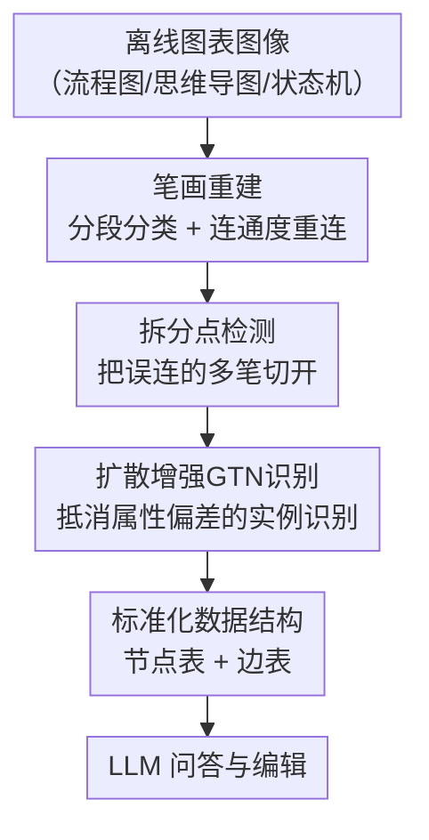

# Diagram2Structure: Unlocking LLMs' Diagram Comprehension through DiagramDiff, a Framework for Structuring Offline Diagrams

**会议**: CVPR 2026  
**论文**: [CVF Open Access](https://openaccess.thecvf.com/content/CVPR2026/html/Hu_Diagram2Structure_Unlocking_LLMs_Diagram_Comprehension_through_DiagramDiff_a_Framework_for_CVPR_2026_paper.html)  
**代码**: 待确认  
**领域**: 多模态VLM / 文档与图表理解  
**关键词**: 离线图表理解, 笔画重建, 实例级识别, 扩散增强GTN, LLM图表问答与编辑

## 一句话总结
针对 LLM 看不懂"图片形式的离线图表（流程图/思维导图/状态机）"这一痛点，本文提出 DiagramDiff：先用一个高精度**笔画重建模型**把离线图像还原成在线笔画序列，再用一个**扩散增强的图 Transformer（GTN）识别模型**做实例级笔画识别，最终把图表转成"节点+边"的标准化数据结构喂给 LLM，从而把 LLM 从只能做简单问答升级为能做语义推理、逻辑校验与图表编辑的智能助手，并在重建/识别任务上取得 SOTA。

## 研究背景与动机
**领域现状**：图表是科研、教育、软件开发里传递复杂结构与逻辑的核心载体，但日常中大量图表以**离线图像**形式存在（扫描件、手绘照片、截图），没有结构化数据表示。现有的图表交互研究大多面向"在线图表"（保留了矢量/笔画轨迹的数字图表）做简单 Q&A，依赖预构建的知识库+自然语言检索，并不支持对复杂离线图表的语义理解和编辑。

**现有痛点**：离线图表的可复用性和可编辑性极差——想改一处往往得手工重画，既费力又易错。LLM（如 GPT-4o）虽然推理和知识整合能力强，但直接喂图表图像时，**无法准确理解图表的结构与内容**，在问答和编辑任务上准确率明显下降。

**核心矛盾**：要让 LLM 真正"读懂"离线图表，前提是拿到**实例级、带连接关系**的结构化数据；而现有的离线笔画提取/识别技术给不出这种数据。一方面，像素搜索、模板匹配这类方法是为字符识别设计的，处理不了图表笔画的复杂交叉；区域分割/实例分割又会被笔画断裂和模糊交叉点拖累，只能给到区域级线索，做不到实例级笔画识别。另一方面，从图像重建出来的笔画**属性会有偏差**（曲率、粗细等因边缘锯齿而失真），直接拿去识别会掉点，而没有方法专门处理这种属性偏差。

**本文目标**：把离线图表图像转成 LLM 能精确理解的标准化数据，使其支持复杂图表的语义推理、逻辑校验和高效编辑。这要求同时解决两个子问题：(1) 高精度、实例级的离线笔画重建；(2) 对"重建后带偏差笔画"鲁棒的实例级识别。

**切入角度**：与其让 LLM 端到端硬啃图像，不如先把离线图像**还原成在线笔画**——一旦回到笔画（带坐标轨迹）表示，就能复用在线图表识别的强能力，并进一步抽象成"节点+边"的图结构。

**核心 idea**：用"重建 → 识别 → 标准化数据结构"三段式管线，把不可理解的离线图表图像翻译成 LLM 可读的结构化表示；其中识别阶段用**扩散模型作为特征融合器**来抵消重建引入的属性偏差。

## 方法详解

### 整体框架
DiagramDiff 的输入是一张离线图表图像，输出是一份"节点+边"的标准化图表数据结构，连同原图一起喂给 LLM，使其能做问答与编辑。中间分两个模型串联：**离线图表重建模型**先把像素图还原成实例级的在线笔画（细化→分段→分类→重连→拆分点检测），解决"图像里哪些像素属于同一笔、笔与笔怎么断开"的问题；**图表识别模型**再在重建出的笔画上做实例级识别（用扩散模型+GTN 抵消属性偏差），把每个笔画判定到节点/边类别与所属符号实例。最后按统一 schema 整理成节点表与边表交给 LLM。

### 关键设计

**1. 笔画重建：先分段再按连通度重连，把离线像素还原成在线笔画**

这一步针对"离线图像没有笔画轨迹、且交叉/断裂严重"的痛点，做的是语言无关的笔画级重建。先用 Guo-Hall 细化算法把笔画细化成骨架，并把像素分为背景点、笔画点、交点（joint point）。判定交点的依据是：某个笔画像素的邻域是否把背景分成了三块以上独立区域——用背景像素的 8-连通分量来数，$C(p)=\sum_{S\subseteq B(p)} \mathbb{1}[S\ \text{是 8-连通且极大}]$，其中极大性约束防止背景区域相连。再叠加一个像素响应值抑制噪声，得到交点概率 $P_j(p)=\sigma(\eta\,C(p)+(1-\eta)\,\hat R(p))$，当 $P_j(p)>\tau_j$ 时标为交点。这样图被切成"无分叉的连续笔画段"，并按端点状态分三类：两端都是交点、一端交点一端开放、两端都开放（视为完整孤立段）。

有了笔画段后，重连阶段把相邻交点处的段聚成组，逐对计算连通度

$$C_{i,j}=\alpha e^{-\lambda d_{\min}}+\beta\cos(\Delta\theta)+\gamma e^{-\mu|k_i-k_j|}$$

它把**端点空间邻近度**（$d_{\min}$ 最小欧氏距离）、**方向一致性**（$\Delta\theta$ 朝向角差）、**曲率相似度**（$k_i,k_j$ 平均曲率）三者融在一起，量化两段是否本属同一笔。由于每个段只有两个端点、每端最多用一次，"选哪些连接"被建成一个匹配问题 $\mathcal{M}^\star=\arg\max_{\mathcal{M}\subseteq\mathcal{E}}\sum_{(i,j)\in\mathcal{M}}C_{i,j}$，约束 $\deg_{\mathcal{M}}(i)\le 1$ 保证每段至多参与一次连接。相比只会输出断线、在交叉处崩溃的语义分割/边缘检测，这套"分段+匹配重连"能稳健处理手绘图表里不可避免的交叉。

**2. 拆分点检测：把"一笔连画多个元素"误并成的单笔切回多笔**

传统为字符识别设计的笔画提取会把"用户一笔画出两个圆+一条连线"错当成单笔，而在图表里它本该是三个独立笔画（两个节点+一条边）。这个设计专门切开这种过度合并：对每条笔画做角点检测，用滑动窗口算中心点与窗内端点的夹角，但不用固定角度阈值，而用**长度自适应阈值** $\theta_{\text{thr}}(\ell)=\theta_0+\rho\,e^{-\ell/\ell_0}$（窗口越长阈值越接近最小角 $\theta_0$），当观测夹角 $\theta<\theta_{\text{thr}}(\ell)$ 时该中心点成为候选拆分点；曲率用三点圆法估计。

为得到全局一致的"拆/不拆"决策，候选点放进图割框架优化：令 $e_s\in\{0,1\}$ 表示候选点 $s$ 被切开(1)还是保留(0)，最小化能量

$$E(\mathbf{e})=\sum_{s\in\mathcal{E}}\Big(\lambda_s e_s+\sum_{t\in\mathcal{N}(s)}\phi_{s,t}|e_s-e_t|\Big)$$

其中 $\lambda_s\propto\kappa_s$ 惩罚冗余切割（曲率越大越该切，反之抑制乱切），$\phi_{s,t}$ 强制邻近候选点的局部一致性，用 $\alpha$–$\beta$ swap 求全局最优 $\mathbf{e}^\star$。这一步把"角点检测的局部线索"上升为"全局自洽的拆分方案"，直接决定了后续每个笔画能否被正确归到不同图元实例。

**3. 扩散增强 GTN 识别：用扩散模型当条件融合器，抵消重建带来的属性偏差**

识别阶段把图表建成图 $G=(V,E)$：每个笔画是一个节点 $N_a^i=(S_a^i,C_a^i,I_a^i)$（笔画、类别标签、所属符号 ID），边 $E_b^i$ 表示两笔画的连接并带正/负标签——**正边**表示两节点属同一图元实例，**负边**表示属不同实例；识别就是判定节点类别与边类别，从而实现实例级。痛点在于：重建出的笔画有锯齿，导致曲率、粗细等属性失真，而常规 GTN 只是把笔画图像特征和属性特征**简单拼接**，无法区分"可靠的图像特征"与"可能不准的属性特征"的主次，于是被偏差属性带偏。

本文的解法是把扩散模型嵌进 GTN 做特征融合：双通道先抽特征——GCN 通道聚合空间/上下文得几何属性特征 $F^a$，深度可分离卷积（DWConv）通道抽深层图像特征 $F^i$，各自经缩放层对齐到扩散模型输入维度。然后扩散模型**以图像特征为核心输入、属性特征为条件输入**，通过迭代去噪把两类特征深度融合（用 DDIM 加速采样，并对每个节点独立采样三次以抗随机性），单步去噪为每个节点 $j$ 产出三份中间表示 $\{s_{1,j},s_{2,j},s_{3,j}\}$。这三份分别充当 GTN 注意力里的 Q/K/V：

$$O_j=\text{softmax}\Big(\frac{s_{1,j}s_{2,j}^{T}}{\sqrt d}\Big)\cdot s_{3,j}\ \oplus\ \text{GCN}(F_j^a)\ \oplus\ \text{DWConv}(F_j^i)$$

即扩散生成的鲁棒表示做注意力聚合，再与原始几何/图像特征拼接更新节点。这样可靠的图像特征能补偿属性偏差造成的信息损失，把"属性不准"对识别的伤害显著压低——这正是本文识别精度领先的关键模块（论文称之为 FE，Feature Enhancement）。整套训练仅需约 23,134 MB 显存，单图平均推理 25.2 ms。

**4. 标准化数据结构：把识别结果整理成"节点表+边表"喂给 LLM**

前三步拿到实例级笔画后，本设计把图表元素统一归为两类——**节点**与**边**，各带一套属性 schema（见下表），从而把"LLM 原本读不懂的离线图表"翻译成"可被精确理解的标准结构化数据"。实际使用时把原图与这份标准化数据一起给 LLM，LLM 即可基于显式的节点/边/连接关系做语义推理、逻辑校验和精确编辑（如替换某步骤、按顺序找出并改正图中错误）。这一步是"重建/识别（视觉）"通往"LLM 智能服务（语言）"的桥，也是整个框架价值落地的出口。

| 节点属性 | 含义 | 边属性 | 含义 |
|----------|------|--------|------|
| ID | 唯一标识 | ID | 唯一标识 |
| Text | 节点标签/内容 | Text | 边标签/内容 |
| Type | 节点类别 | Type | 边类别 |
| Size | 节点尺寸 | Length | 边长度 |
| Incoming/Outgoing Edges | 入/出边列表 | Direction | 流向 |
| Child/Parent Nodes | 子/父节点 | Weight / Start&End Points | 连接强度 / 起止点 |

## 实验关键数据

数据集：重建在 CASIA-OHFC、OHSD 上评测（从在线数据生成测试图像）；识别在 FC A、FC B、CASIA-OHFC、OHSD 上评测，且**所有方法都在"从离线图重建出的笔画"上训练/测试**。问答与编辑用自建 **DiagramQAE**（100 张图、3,186 个符号、20 类元素、流程图/思维导图/状态机三类；每图 5 个任务=3 问答+2 编辑，共 500 个任务）。

### 主实验

**重建任务**（Table 3，IoU/SRR 越高越好，HD 越低越好）。SRR 定义为覆盖率 $c(s)\ge 50\%$ 的笔画占比，HD 为预测与真值图像间的 Hausdorff 距离：

| 数据集 | 方法 | IoU(%) | SRR(%) | HD↓ |
|--------|------|--------|--------|------|
| CASIA-OHFC | Mouss et al. | 50.5 | 92.3 | 3.71 |
| CASIA-OHFC | **Ours** | **55.6** | **96.5** | **3.61** |
| OHSD | Mouss et al. | 49.9 | 91.8 | 3.77 |
| OHSD | **Ours** | **53.9** | **96.2** | **3.69** |

**识别任务**（在重建笔画上，SCA=笔画分类准确率、SCP=笔画分类精度，Table 2 / Table 4 重建列）：

| 数据集 | 方法 | SCA(%) | SCP(%) |
|--------|------|--------|--------|
| CASIA-OHFC | InstGNN | 87.23 | 87.10 |
| CASIA-OHFC | SpaceGTN | 89.56 | 89.34 |
| CASIA-OHFC | **Ours** | **94.64** | **93.41** |
| OHSD | SpaceGTN | 93.21 | 92.18 |
| OHSD | **Ours** | **98.39** | **96.31** |

重建领先最强 baseline（Mouss et al.）约 +5 IoU / +4 SRR；识别在两个最难数据集上 SCA 比次优的 SpaceGTN 高约 +5（CASIA-OHFC）/ +5（OHSD）。⚠️ Table 2 原文多列表头在 PDF 抽取中错位，跨数据集的精确列对应以原文为准，此处取与 Table 4 重建列一致、可交叉验证的数值。

### 消融实验

**FE（扩散特征增强）模块**（Table 4，识别"重建后笔画"的 SCA/SCP）：

| 配置 | CASIA-OHFC SCA/SCP | OHSD SCA/SCP | 说明 |
|------|--------------------|--------------|------|
| Ours (w/o FE) | 90.56 / 90.42 | 94.33 / 93.20 | 去掉扩散融合，退化为常规拼接 |
| Ours (with FE) | 94.64 / 93.41 | 98.39 / 96.31 | 完整模型 |

去掉 FE 后 SCA 在 CASIA-OHFC 掉约 4.08、OHSD 掉约 4.06，验证"扩散模型把图像特征作核心、属性特征作条件"的融合确实抵消了重建带来的属性偏差。Table 4 还显示：所有在线识别方法在"重建笔画"上都比在"原始在线笔画"上掉点（如 SpaceGTN 原始 98.13→重建 89.56），说明重建误差是普遍难点，而本文靠 FE 把这种掉点显著补回。

**LLM 问答与编辑用户实验**（Table 6，正确率%，原始 vs 经 DiagramDiff 标准化后）：

| LLM | 编辑(原始→Ours) | 问答(原始→Ours) |
|-----|------------------|------------------|
| GPT-4o | 71% → 90% | 77% → 92% |
| Claude 3.7 | 50.5% → 61% | 54% → 68.5% |
| DeepSeek R1 | 62% → 85% | 69% → 80% |
| GPT-4.5 | 69% → 86% | 77.5% → 93% |

四个先进 LLM 在两类任务上一致大幅提升（编辑 +11~+23、问答 +11.5~+16），其中 GPT-4o 编辑 71→90、GPT-4.5 问答 77.5→93，证明"把图表标准化成节点/边结构"确实是 LLM 读懂离线图表的关键。实时 Q&A 响应约 2.7 s，主要延迟来自 LLM 本身。

### 关键发现
- **FE 模块贡献最大**：它直接决定识别能否在"带偏差的重建笔画"上保持高精度，去掉即掉约 4 个点。
- **重建是普遍瓶颈**：在线识别方法一旦面对重建笔画就集体掉点，凸显"离线→在线"重建质量的重要性，也解释了本文为何要专门做属性偏差补偿。
- **标准化数据结构对 LLM 是普惠增益**：从 GPT 系到 Claude、DeepSeek 都受益，说明收益来自"结构化表示"本身而非某个特定模型的对齐。

## 亮点与洞察
- **"离线→在线笔画"的翻译思路很巧**：与其让 LLM/VLM 端到端硬啃图表像素，不如先把离线图还原成在线笔画，从而复用在线图表识别的成熟能力，把难题降维。
- **扩散模型被当成"条件特征融合器"而非生成器**：用图像特征作核心、属性特征作条件，借去噪过程深度融合并产 Q/K/V，是处理"某路特征不可靠"问题的一种可迁移范式——任何"主特征可靠+辅特征有噪"的多模态融合都能借鉴。
- **拆分点检测 + 图割全局优化**：把"角点局部线索"上升为"全局自洽的笔画切分"，是手绘图表实例化的关键工程巧思。
- **DiagramQAE 数据集填空白**：首个离线图表问答+编辑数据集，给"图表理解/多模态/HCI"提供了带正确答案与正确编辑结果的评测基座。

## 局限与展望
- **依赖人工构建的小数据集**：DiagramQAE 仅 100 张图、500 任务、10 名参与者，覆盖三类图表，规模和多样性有限，结论的统计强度受限。
- **管线串联误差累积**：重建错误会传导到识别再到 LLM；虽然 FE 能补偿属性偏差，但重建阶段的结构性错误（如错误重连/漏拆）难以在下游完全纠正。
- **LLM 侧仍是黑盒外接**：方法负责把图表结构化，最终问答/编辑质量仍受 LLM 能力波动影响（Claude 3.7 即便标准化后也只有 61%/68.5%）。
- **图表类型有限**：目前聚焦流程图/思维导图/状态机，对含复杂自由曲线、密集嵌套或带表格的图表泛化性待验证。
- 可改进方向：把重建-识别-LLM 做成可反馈闭环（LLM 的逻辑校验结果回流纠正重建/识别），并扩大数据集与图表类型。

## 相关工作与启发
- **vs 离线笔画重建（路径法/语义分割/边缘检测）**：它们要么需对线条位置形状做假设、只能处理标准化图表，要么在交叉处产生断线；本文用"分段+连通度匹配重连+拆分点检测"做语言无关的通用重建，稳健处理手绘交叉，取得 SOTA。
- **vs 离线识别（Faster R-CNN / Arrow R-CNN）**：它们只能做区域/框级识别，节点多或连接重叠时精度骤降，做不到笔画级实例分割；本文实现实例级笔画识别。
- **vs 在线识别（Inst-GNN / DyGAT / SpaceGTN）**：这些方法只能用于在线图表、且依赖简单特征拼接，面对重建笔画的属性偏差会掉点；本文用扩散增强 GTN 把"重建笔画"也做到高精度识别。
- **vs 现有 LLM 图表交互（预构建知识库 + 自然语言检索）**：它们只支持简单问答、无法直接编辑复杂离线图；本文通过标准化数据结构让 LLM 具备语义推理、逻辑校验与精确编辑能力。

## 评分
- 新颖性: ⭐⭐⭐⭐ 把"离线→在线笔画重建 + 扩散增强识别 + 标准化结构喂 LLM"串成完整管线，扩散当条件融合器的用法新颖。
- 实验充分度: ⭐⭐⭐⭐ 重建/识别多数据集 SOTA、FE 消融清晰、四 LLM 用户实验一致提升；但 DiagramQAE 规模偏小。
- 写作质量: ⭐⭐⭐⭐ 动机-方法-实验链条清楚，公式与算法给全；部分表格在 PDF 中列错位略影响可读性。
- 价值: ⭐⭐⭐⭐ 离线图表数字化+LLM 编辑是高频刚需，方法和数据集都有实际落地与后续研究价值。

<!-- RELATED:START -->

## 相关论文

- [\[ICML 2026\] Seeing is Understanding: Unlocking Causal Attention into Modality-Mutual Attention for Multimodal LLMs](../../ICML2026/multimodal_vlm/seeing_is_understanding_unlocking_causal_attention_into_modality-mutual_attentio.md)
- [\[CVPR 2026\] RxnCaption: Reformulating Reaction Diagram Parsing as Visual Prompt Guided Captioning](rxncaption_reformulating_reaction_diagram_parsing_as_visual_prompt_guided_captio.md)
- [\[CVPR 2026\] WEAVE: Unleashing and Benchmarking the In-context Interleaved Comprehension and Generation](weave_unleashing_and_benchmarking_the_in-context_interleaved_comprehension_and_g.md)
- [\[CVPR 2026\] DeepAlign: Mitigating Modality Conflict through Modality-Specific Alignment](deepalign_mitigating_modality_conflict_through_modality-specific_alignment.md)
- [\[AAAI 2026\] Exploring LLMs for Scientific Information Extraction using the SciEx Framework](../../AAAI2026/multimodal_vlm/exploring_llms_for_scientific_information_extraction_using_the_sciex_framework.md)

<!-- RELATED:END -->
