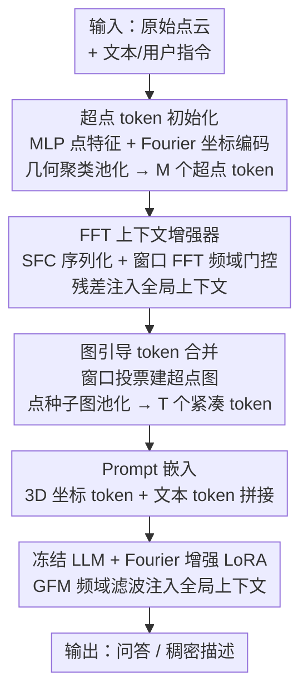

# Efficient Encoder-Free Fourier-based 3D Large Multimodal Model

**会议**: CVPR 2026  
**论文**: [CVF Open Access](https://openaccess.thecvf.com/content/CVPR2026/html/Mei_Efficient_Encoder-Free_Fourier-based_3D_Large_Multimodal_Model_CVPR_2026_paper.html)  
**代码**: 项目页 https://tev-fbk.github.io/Fase3D （未见开源代码）  
**领域**: 多模态VLM（3D 场景大模型）  
**关键词**: 3D大模型, 点云, 无编码器, 傅里叶变换, 超点 tokenizer  

## 一句话总结
Fase3D 提出首个**无视觉编码器、基于傅里叶变换**的 3D 场景大模型——用「超点池化 + 空间填充曲线序列化 + 窗口 FFT」做轻量 tokenizer 直接处理原始点云，并用 Fourier 增强的 LoRA 把全局频域上下文注入冻结 LLM，在 ScanQA/SQA3D/ScanRefer/Nr3D 上**用约 1/6～1/12 的视觉参数、约 1/20 的 FLOP** 达到与重编码器方法（3D-LLaVA、PerLA）相当的效果。

## 研究背景与动机
**领域现状**：主流 3D 大模型（3D LMM）先用一个重量级预训练 3D 编码器（CLIP、Sparse 3D U-Net、Mask3D 等）从点云抽取几何/语义特征，再投影到 LLM 的 token 空间——LL3DA、PerLA、3D-LLaVA 都是这套「重编码器 + 对齐」的路线。

**现有痛点**：这些编码器带来巨大的计算与显存开销，限制了输入分辨率和可扩展性；而且它们产生的特征 embedding 常常和 LLM 的推理空间**语义错配**，需要额外的 Q-Former / 投影模块去对齐。2D 领域早已出现「无编码器」（encoder-free / 单体式）大模型（EVE、Mono-InternVL），把视觉直接映射进 LLM token 空间来提效，但这一范式迁移到 3D 几乎是空白。

**核心矛盾**：点云**无序、不规则、规模巨大**（场景级动辄几万点），不像 2D 像素那样有规则网格。无编码器架构又缺乏大规模视觉预训练，必须靠**显式归纳偏置**才能稳健地把无序点云 token 化——而这个 tokenizer 还得参数极少、计算极省，否则就失去了「去编码器」的意义。自注意力对长 token 序列是 $O(M^2)$，直接序列化点云做 attention 既贵又会破坏排列不变性。

**本文目标**：设计一个**直接吃原始点云、既有效又高效**的无编码器 3D 场景大模型，要同时解决三件事——token 排列无序、规模可扩展、全局上下文建模。

**切入角度**：作者把 token 处理看成**空间域与频域的协同**。关键观察是 FFT 是一个能以 $O(M\log M)$ 近似自注意力、聚合全局上下文的强算子；只要先把无序点云**序列化**成 1D 序列，就能在频域里廉价地做全局混合。

**核心 idea**：用「点云序列化 + FFT」替代「重编码器 + 自注意力」，在 tokenizer 和 LLM 内部多个阶段都借频域处理来注入全局上下文，从而在几乎不增加参数的前提下让单体式 LLM 直接读懂 3D 场景。

## 方法详解

### 整体框架
Fase3D 是一个没有专用 3D 编码器的单体式 LMM：输入是场景级原始点云 + 文本指令，输出是问答/稠密描述文本。整条管线的核心是**逐级压缩 token 数量、同时逐级增强每个 token 的语义和空间信息**。点云先经轻量 MLP 得到点级特征并按几何聚类成 $M$ 个超点 token；超点被序列化后送入 FFT 上下文增强器注入全局信息；再经图引导的 token 合并压成 $T$ 个紧凑 token（$T<M$）；这些视觉 token 与文本/用户 prompt 一起喂给冻结的 LLM，而 LLM 内部的 LoRA 层被一个 Fourier 全局滤波模块（GFM）增强，把频域全局上下文注入进去。

### 关键设计

**1. 超点 token 初始化：把几万点压成几百个紧凑 token**

无编码器架构最怕点云序列太长——直接拿降采样原始点当 token，既会让自注意力退化成 $O(N^2)$、训练慢且不稳，又无法承载场景级规模。Fase3D 先用一个浅层 MLP 把每个点的特征 $f_i$（颜色、法向等）投影成 $d$ 维 token $x^{(0)}_{\text{feat}}$，并行地用**非参数、多频率的 Fourier 特征编码**把坐标 $p_i$ 编成 $x^{(0)}_{\text{coor}}$，二者相加得到点级 token $x^{(0)}=x^{(0)}_{\text{feat}}+x^{(0)}_{\text{coor}}$。随后按几何聚类把点云划成 $M$ 个超点，对每个超点内的点级 token 做平均池化得到超点 token：

$$\mathbf{S}=\text{SptPool}(\mathbf{X}^{(0)},\mathcal{Q})\in\mathbb{R}^{M\times d}$$

这一步用纯几何驱动的超点池化把 token 数砍掉约一个数量级，既缩短了序列又提升了语义一致性，而且学习参数极少（只有一个浅 MLP），是「去编码器」能成立的前提。

**2. FFT 上下文增强器：用频域混合近似自注意力、廉价补全全局上下文**

超点池化后的 token $\mathbf{S}$ 只携带**局部**信息，缺乏跨物体的全局布局。已有的频域方法要么用体素/网格 3D FFT（场景级太贵），要么用图傅里叶变换（需显式建图 + 拉普拉斯，$O(M^2)$）。作者改成先把超点**序列化**再做 1D FFT，复杂度降到 $O(M\log M)$。具体地，用四种**空间填充曲线**（z-order、转置 z-order、Hilbert、转置 Hilbert）把超点坐标映射成保持 3D 局部性的 1D 序列 $\mathbf{S}[\pi_i]$。对每条曲线序列做频域门控：

$$\mathbf{S}'(\pi_i)=\mathcal{F}^{-1}\!\left(\mathcal{F}(\mathbf{S}(\pi_i))\odot \mathbf{G}_v\right)$$

其中 $\mathbf{G}_v$ 是可学习的非负频域门，$\odot$ 为逐元素乘——本质是在频域里自适应地放大/抑制不同频率成分以做上下文混合。为了让混合具有位置感知，FFT 在长度 $L_w=128$、步长 $L_s=L_w/2$ 的重叠窗口上做，再用平方 Hann 权重做 overlap-add 重建，每窗复杂度 $O(L_w\log L_w)$。最后把四条曲线的结果逆排列回原序、做均匀平均 $\tilde{\mathbf{S}}=\frac{1}{|\pi|}\sum_{\pi_i}\mathbf{S}'(\pi_i)$，并以残差融合 $\mathbf{S}\leftarrow\mathbf{S}+\tilde{\mathbf{S}}$。多曲线序列化是为了缓解单一序列带来的排序偏置、让 1D 邻接更鲁棒。这一模块是把 FFT 当「廉价自注意力」用，从而让每个 token 同时具备局部和全局上下文。

**3. 图引导 token 合并：几何驱动地把超点压成 T 个对象级 token，省掉检测头**

要进一步省算力就得继续减 token，但合并不能破坏对象级结构。作者把超点建成稀疏图 $G=(V,E)$，节点是超点、边编码空间关系。建图避开了昂贵的 Delaunay/kNN，改用**窗口投票**：把所有点按四条 SFC 序列化，在每条曲线上以步长 $s_r$ 扫描锚点窗口，窗口内若两点属于不同超点 $s_i\neq s_j$ 就给边 $(s_i,s_j)$ 投一票 $v_{s_i,s_j}\!\leftarrow\!v_{s_i,s_j}+1$，跨曲线累票得到稀疏邻接。合并阶段用**点种子图池化**：先用最远点采样取 $T$ 个锚点映射到超点作种子 $\{s_t\}$，经图感知非极大抑制去重并补未覆盖超点；对每个种子定义 1-hop 邻域支持集 $\mathcal{N}_t=\{s_t\}\cup N(s_t)$，用图边权（特征相似度 × 多曲线投票强度）作池化先验，归一化权重 $w_{it}=\tilde{w}_{it}/(\sum_{j}\tilde{w}_{jt}+\epsilon)$，池化得 $z^{\text{pool}}_t=\sum_{i\in\mathcal{N}_t}w_{it}s_i$，锚点位置固定 $c'_t=a_t$。这样 **token 位置由点级空间覆盖决定、token 内容由局部图邻域读出**，最后沿 Hilbert 曲线把合并 token 重新序列化以适配 LLM 的旋转位置编码。这一纯几何驱动的合并**直接去掉了 3D LMM 常用的学习式 mask 提议（如 Mask3D）/检测阶段**——稠密描述时只需对超点图做谱聚类即可生成 proposal。

**4. Fourier 增强 LoRA 适配器（GFM）：在频域里给 LoRA 的输入补全局上下文**

LoRA 能高效适配 FFN，但喂给它的表示 $\mathbf{Z}'$ 来自**冻结**的预训练 backbone，并未为下游任务优化，限制了 LoRA 的潜力。作者插入一个轻量**全局滤波模块（GFM）**：对序列里每个 token $z\in\mathbb{R}^D$，沿**通道维**做频域滤波 $z_{\text{mixed}}=\text{iFFT}(\text{FFT}(z)\odot \mathbf{G}_t)$，其中 $\mathbf{G}_t\in\mathbb{R}^D$ 是可学习滤波器，再以平均残差 $z_{\text{out}}=(z+z_{\text{mixed}})/2$ 融合，作为 LoRA 适配层的输入。这相当于在送进 FFN 前给 token 注入全局混合信息，既稳定训练又增强表达，而代价极小——只引入 $D$ 个可学习参数，并用 $N_h$ 头形式把复杂度降到 $O\!\left(\frac{D}{N_h}\log\frac{D}{N_h}\right)$。消融显示这个频域残差**只加在视觉支路**收益最大（同时加到文本支路反而掉点），说明频域线索对视觉路径最有用。

### 损失函数 / 训练策略
两阶段训练（沿用 3D-LLaVA/PerLA 思路）：先做通用 3D 指令微调，再在下游任务上专门化。语言建模用标准 next-token 交叉熵，仅对 caption token 计损（用掩码 $m_t=\mathbf{1}[t\ge t_0]$ 屏蔽 prompt 前缀、忽略 padding）：

$$\mathcal{L}_{\text{LM}}=-\frac{1}{\sum_t m_t}\sum_t m_t\log p_\theta(w_t\mid w_{<t},\mathbf{Z}')$$

实现细节：每场景均匀采 50k 点 → 池化超点 → 聚成 256 个 token，$N_h=8$；LLM 用冻结的 Qwen2.5-3B-Instruct（float16），LoRA 秩 $r=768$、$\alpha=768$ 加在前 8 层；AdamW、cosine 衰减 $10^{-4}\!\to\!10^{-6}$、约 100k 迭代，4×A100 64GB 训练约 7 天，每个下游任务再微调约 30k 迭代。

## 实验关键数据

### 主实验
评测 3D 问答（ScanQA、SQA3D）与 3D 稠密描述（ScanRefer、Nr3D）。`#Params`/`FLOP` 仅指 3D token 化阶段激活的参数量与浮点运算量。

| 任务/数据集 | 方法 | LLM | #Params↓ | FLOP↓ | 关键指标 |
|------|------|-----|---------|-------|------|
| ScanQA(val) | LL3DA | OPT-1.3B | 118.87M | 40.21 | CIDEr 76.79 |
| ScanQA(val) | PerLA | OPT-1.3B | 119.76M | 163.38 | CIDEr 78.13 |
| ScanQA(val) | 3D-LLaVA | Vicuna-7B | 58.26M | 37.75 | CIDEr **92.60** |
| ScanQA(val) | **Fase3D** | Qwen2.5-3B | **10.54M** | **2.04** | CIDEr 90.11 |
| ScanQA(val) | **Fase3D** | Vicuna-7B | 12.11M | 2.09 | CIDEr 91.74 |
| SQA3D(test) | 3D-LLaVA | Vicuna-7B | 58.26M | 37.75 | EM@1 54.5 |
| SQA3D(test) | **Fase3D** | Vicuna-7B | 12.11M | 2.09 | EM@1 54.3 |

核心结论：Fase3D 用**约 1/6（vs 3D-LLaVA）～1/12（vs LL3DA/PerLA）的视觉参数、约 1/18～1/80 的 FLOP**，在 ScanQA/SQA3D 上达到与 3D-LLaVA 相当、显著超过 LL3DA/PerLA 的效果。稠密描述（ScanRefer C@0.5）：用 Mask3D segmenter 时 Fase3D 78.14 与 3D-LLaVA 78.80 相当；不用外部 segmenter（仅靠自身图聚类 proposal）时 70.72，仍接近 PerLA。

### 消融实验

| 模块组合（ScanQA val） | CIDEr | 说明 |
|------|------|------|
| 仅原始点 token (Point) | 76.04 | 序列长、自注意力 $O(N^2)$、慢且不稳 |
| + 超点池化 (Superpoint) | 79.70 | token 数砍约一个量级，+3.66 |
| + FFT 上下文增强（无超点） | 82.97 | 单加 FFT +6.93 |
| 超点 + FFT（完整 tokenizer） | 86.91 | 二者叠加 +10.87 |
| 完整模型 + 预训练 | **90.11** | 全指标进一步提升 |

| LoRA 配置（ScanQA val） | CIDEr | 说明 |
|------|------|------|
| 单支 LoRA（仅视觉/仅文本） | 76.45 / 76.21 | 单路 LoRA |
| sLoRA（双支共享） | 78.24 | 共享 LoRA |
| dLoRA（双支解耦） | 82.53 | 解耦 LoRA |
| dLoRA + FFT（仅视觉支） | **86.91** | 比 dLoRA **+4.38** CIDEr，最优 |
| dLoRA + FFT（双支都加） | 83.64 | 文本支也加反而掉点 |

### 关键发现
- **FFT 上下文增强器是 tokenizer 里单点贡献最大的模块**：单独加它就有 +6.93 CIDEr，比超点池化（+3.66）更显著；二者叠加近似可加（+10.87）。
- **频域残差只在视觉支路有用**：dLoRA+FFT 仅加视觉支 +4.38，加到文本支反而从 86.91 掉到 83.64，说明频率域线索对几何/视觉路径最契合。
- **跨 LLM backbone 稳定泛化**：换 OPT-1.3B，Fase3D 仅 9.30M 参数 / 2.01G FLOP，CIDEr 86.24 仍超 PerLA 的 78.13（+8.11）；换 Qwen2.5-3B 达 90.11。
- 即使**不用外部 segmenter**、纯靠图谱聚类生成 proposal，稠密描述也只小幅落后，验证了几何驱动 token 合并可替代检测头。

## 亮点与洞察
- **「序列化 + FFT」当廉价自注意力**：把无序点云先用空间填充曲线压成保局部性的 1D 序列，再用 $O(M\log M)$ 的窗口 FFT 做全局上下文混合，绕开了 $O(M^2)$ 自注意力和昂贵的体素/图傅里叶——这是全文最可迁移的 trick，思路可搬到任何「无序大规模 token 需要全局混合」的场景。
- **频域处理贯穿全管线**：坐标编码（Fourier 特征）、上下文增强（FFT 门控）、LoRA 输入（GFM 通道域滤波）三处都用频域，且都只加极少参数（如 GFM 仅 $D$ 个），把「频域 = 廉价全局算子」用到了极致。
- **几何驱动合并去掉检测头**：用窗口投票建超点图 + 点种子图池化，纯几何地把 token 压到对象级，省掉了 3D LMM 普遍依赖的 Mask3D 学习式 proposal，简化了流水线还能做稠密描述。
- **「token 位置由空间覆盖定、内容由图邻域读」** 的解耦设计很巧妙：位置稳定（利于旋转位置编码），内容仍能从局部图聚合，兼顾几何结构与语义。

## 局限与展望
- 作者承认 Fase3D 继承了**序列化方法（如 PTv3）的固有缺陷**：在高度杂乱场景中对**非欧式的长程关系**可能表现不佳——空间填充曲线在 1D 上相邻不等于 3D 上语义相关。
- 自评：FFT 门控/GFM 的「频域可学习门」更像黑盒，论文未深入解释学到了什么频率模式；多曲线均匀平均也是较朴素的融合，可能不是最优。
- ScanQA CIDEr 90.11 仍略低于 3D-LLaVA 的 92.60，说明在绝对精度上「去编码器」还差一口气，强项是**效率/精度权衡**而非刷绝对 SOTA。
- 展望：更大更多样的 3D 语料预训练、自适应/可学习序列化、接入 RGB 等更多模态。

## 相关工作与启发
- **vs 编码器式 3D LMM（LL3DA / PerLA / 3D-LLaVA）**：它们靠重 3D 编码器 + Q-Former/投影对齐；Fase3D 直接用轻量 FFT tokenizer 吃原始点云，参数/FLOP 低一个数量级而效果相当，核心区别是「去编码器 + 频域近似注意力」。
- **vs 2D 无编码器 LMM（EVE / Mono-InternVL / Fuyu）**：这些把像素直接映射进 LLM token 空间；Fase3D 把该范式迁到 3D，难点在点云无序/大规模，靠 SFC 序列化 + 超点 + FFT 补上 2D 没有的排列不变与可扩展问题。
- **vs 物体级无编码器（ENEL on ShapeLLM/PointLLM）**：ENEL 用层次化 token 化但只到物体级、难扩到完整场景；Fase3D 直接解决场景级的 token 排序、可扩展、全局上下文整合。
- **vs 频域点云方法（PointGST 图傅里叶 / 体素 3D FFT）**：避开 $O(M^2)$ 拉普拉斯和昂贵体素 FFT，改用 1D 序列窗口 FFT，把频域处理做到场景级可负担。

## 评分
- 新颖性: ⭐⭐⭐⭐⭐ 首个无编码器、傅里叶式 3D 场景大模型，「序列化 + FFT 近似自注意力」贯穿全管线，思路新颖。
- 实验充分度: ⭐⭐⭐⭐ QA + 稠密描述 4 个数据集 + 三组消融（tokenizer/LoRA/backbone）较完整，但缺更大规模/更多模态验证。
- 写作质量: ⭐⭐⭐⭐ 动机—方法—消融链条清晰，公式与 pipeline 图到位，部分频域模块解释偏简。
- 价值: ⭐⭐⭐⭐⭐ 把 3D 视觉 token 化成本降一个数量级而不掉点，对 3D LMM 落地与边缘部署很有价值。

<!-- RELATED:START -->

## 相关论文

- [\[ICLR 2026\] LLaVA-FA: Learning Fourier Approximation for Compressing Large Multimodal Models](../../ICLR2026/multimodal_vlm/llava-fa_learning_fourier_approximation_for_compressing_large_multimodal_models.md)
- [\[CVPR 2026\] Direction-aware 3D Large Multimodal Models](direction-aware_3d_large_multimodal_models.md)
- [\[CVPR 2026\] Proxy3D: Efficient 3D Representations for Vision-Language Models via Semantic Clustering and Alignment](proxy3d_efficient_3d_representations_for_vision-language_models_via_semantic_clu.md)
- [\[CVPR 2026\] Octopus: History-Free Gradient Orthogonalization for Continual Learning in Multimodal Large Language Models](octopus_history-free_gradient_orthogonalization_for_continual_learning_in_multim.md)
- [\[CVPR 2026\] Vision-Language Model Guided Source-Free Domain Adaptation via Optimal Transport](vision-language_model_guided_source-free_domain_adaptation_via_optimal_transport.md)

<!-- RELATED:END -->
