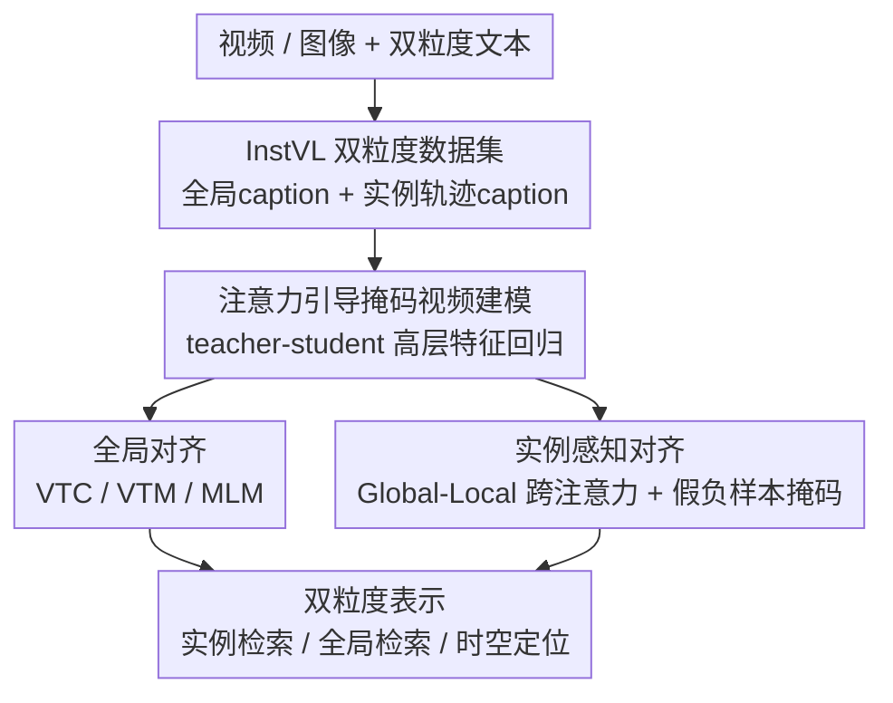

# InstAP: Instance-Aware Vision-Language Pre-Train for Spatial-Temporal Understanding

**会议**: CVPR 2026  
**论文**: [CVF Open Access](https://openaccess.thecvf.com/content/CVPR2026/html/Kumar_InstAP_Instance-Aware_Vision-Language_Pre-Train_for_Spatial-Temporal_Understanding_CVPR_2026_paper.html)  
**代码**: 待确认  
**领域**: 多模态VLM  
**关键词**: 视觉语言预训练, 实例级对齐, 时空理解, 视频检索, 跨模态对比学习

## 一句话总结
InstAP 在视频-语言预训练里把"全局对齐"和"实例级对齐"放进同一个目标联合优化——通过跨注意力把目标框特征和全场景上下文融合、再和对应的实例描述做对比学习，配合自建的双粒度数据集 InstVL，让模型既能把整段视频和整句话对齐，也能把"红色的球""跳起来的狗"精确落到对应的时空轨迹上，实例级检索大幅超过现有 VLP 模型，连全局零样本检索（MSR-VTT、DiDeMo）也一并刷到 SOTA。

## 研究背景与动机
**领域现状**：以 CLIP 为代表的视觉语言预训练（VLP）用对比学习在海量图文对上学到了可迁移的表示，零样本泛化能力很强。扩展到视频域后，主流做法（CLIP4Clip、UMT、VideoPrism 等）依然是把**整段视频的池化嵌入**和**整句 caption** 对齐，做的是粗粒度的全局对应。

**现有痛点**：全局对齐天然会"平均化"特征，把实例级的细节抹平。给一句"a child throws a red ball while a dog jumps"，只学全局对齐的模型能抓住整体事件，却答不出画面里哪块区域是"球"、哪块是"狗"。这直接限制了需要精确 grounding 的下游任务——细粒度检索、时空定位、以物体为中心的问答。

**核心矛盾**：学实例级表示难在两头都缺。一头是**数据**：绝大多数大规模视频-文本数据只有高层整体描述，没有把"词"接到"区域/轨迹"上的 grounded 标注；现有的 grounded 数据要么是图像域（Visual Genome、Flickr30k）、要么是闭词表结构化谓词（VidOR 的 `<subject,chase,object>`）、要么只把名词短语接到单帧（ActivityNet-Entities），都缺自由句子 + 时序连续的轨迹标注。另一头是**目标**：现有预训练损失只奖励整体对齐，模型没有动力去关注实例细节。

**现有方案的不足**：已有工作多是"事后嫁接"实例信息——靠预训练好的目标检测器喂区域标签（继承检测器误差）、或加专门的实例分割头（把实例理解当成附属特化任务）。这些信号是附加特征，没有融进核心表示学习，谈不上真正的实例级对齐。

**本文目标 / 核心 idea**：作者主张**实例级理解应该是表示本身的核心属性，而不是辅助任务**。于是把实例感知直接嵌进预训练阶段：在保留全局对齐的同时，新增一个实例级对比目标，强制"特定文本提及"和"对应的物体级视觉特征"对齐。为了让这种训练能跑起来，他们同时造了 InstVL——首个大规模、通用域、自由句子标注、同时覆盖静态区域和视频时空轨迹的数据集。

## 方法详解

### 整体框架
InstAP 整体是"一个数据集 + 两阶段训练"。数据侧，InstVL 给每个图像/视频样本配两套文字：一句**全局场景 caption** 和一组**接到具体区域/时空轨迹的实例级 caption**。训练侧分两步走：第一步用自监督掩码视频建模（teacher-student）从零训出一个时空视频编码器；第二步在这个编码器上做**全局 + 实例双粒度对齐**——全局分支照常做视频-文本对比/匹配/掩码语言建模，实例分支则把每个目标框裁剪出来、经过 Global-Local 跨注意力融进全场景上下文，再和该实例的描述做对比学习。最终输出是一套同时编码了整体语义和精确实例 grounding 的表示，可直接零样本迁移到检索和定位任务。

### 关键设计

**1. InstVL 双粒度数据集与自动标注流水线：补上"自由句子 + 时空轨迹"的训练数据空缺**

实例感知预训练的根本瓶颈是没有合适的大规模数据。InstVL 含 200 万张图像和 5 万段视频，每个样本配**双粒度**标注：一句全局场景 caption + 一组接到具体视觉区域（图像是 2D 框）或时空轨迹（视频是逐帧框序列）的实例级自由句子描述。标注流水线全自动且分工明确：训练图像取自 LAION-400M、视频取自处理过的 HDVILA 片段，零样本测试集专门用 COYO（和训练源无重叠，引入分布偏移以验证不是靠记训练分布）；先用 AutoShot 做场景切分，再用 GroundingDINO 做开放词表检测、SAM2 做实例跟踪得到时空轨迹，最后把区域/轨迹连同可视化边框 prompt 一起喂给一个大型视觉语言模型，同时生成全局 caption 和细粒度实例描述，并经多轮人工检查迭代 prompt。测试套件切成五个互斥子集（InstVL-1K/10K 图像、对应的 zero 零样本图像、InstVL-1K 视频），其中 `img-zero` 来自 COYO 而训练图像来自 LAION，靠这个分布偏移确认性能不是简单继承自训练分布。这套数据是后面实例对齐目标能成立的前提。

**2. 注意力引导的掩码视频建模：用 teacher-student 高层特征回归先训出强时空编码器**

直接做像素级重建的掩码自编码虽然数据高效，但这种低层目标会和语言任务需要的高层对齐"打架"。InstAP 改用 teacher-student 框架做**可见 token 上的高层特征回归**：把视频 $V=\{I_1,\dots,I_T\}$ 切成 $L=TN$ 个 patch token，用一个冻结的 ViT 先算自注意力图 $A\in\mathbb{R}^{L\times L}$，按 $s=\frac{1}{L}A\mathbf{1}$ 给每个 token 算重要度，掩掉得分最低的 $\lceil\rho L\rceil$ 个（masking ratio 高达 80%），只把可见 token 集 $\Omega$ 喂给 student 编码器 $f_\theta$；teacher $g$ 在全 token 上算特征 $h^T_l$ 作为回归目标，损失是归一化特征的 L2 距离

$$\mathcal{L}_{rec}=\frac{1}{|\Omega|}\sum_{l\in\Omega}\left\|\frac{h^S_l}{\|h^S_l\|_2}-\frac{h^T_l}{\|h^T_l\|_2}\right\|_2^2$$

之所以有效：注意力引导让被掩的恰是信息量最大的 token，student 只能靠少量可见 token 去重建 teacher 的全上下文表示，这个有挑战性的回归任务逼出更强的时空表示；同时高层特征目标省掉了重型重建解码器、只处理可见 token，显存和训练效率都更好，收敛也更快，产出的表示更适合后续跨模态对齐。这一步训出来的编码器（ViT-L，由冻结 CLIP-ViT-L teacher 引导）拿到 Kinetics-400 上做线性微调能到 87.84% top-1，再作为第二阶段对齐训练的初始化。

**3. Global-Local 跨注意力的实例感知对齐：把"词"精确接到"轨迹"，并屏蔽同视频假负样本**

这是 InstAP 的核心。对每段视频里的每个实例（框 $b_{i,k}$ + 描述 $T_{i,k}$），先把裁剪 crop $C_{i,k}$ 过视频编码器得到 patch token，再用**跨注意力**把 crop token（作 Query）去注意全场景特征 $V_i$（作 Key/Value），把全局上下文注进实例特征：

$$Z_{i,k}=\mathrm{XAttn}(C_{i,k},V_i),\quad z_{i,k}=\frac{1}{L_c}\sum_l Z_{i,k,l},\quad \tilde z_{i,k}=W_v z_{i,k}$$

这样得到的"实例感知嵌入"既保有局部物体信息、又带全局语境，再和实例句子嵌入 $\tilde s_{i,k}$ 做对比。这里有个关键陷阱：**同一段视频里不同物体的实例描述常常语义重叠**（图里多个相似实例），直接对比会把它们误当负样本（假负）。InstAP 的对比损失因此带一个掩码 $\mu_{n,m}$——和 $n$ 来自同一视频/图像的其它实例 $m$ 不计入分母负样本（$\mu_{n,m}=0$），其余才算负样本（$\mu_{n,m}=1$）：

$$\mathcal{L}^{inst}_{VTC}=-\frac{1}{N}\sum_n\log\frac{\exp(\tilde z_n^\top\tilde s_n/\tau_{inst})}{\sum_m\mu_{n,m}\exp(\tilde z_n^\top\tilde s_m/\tau_{inst})}-\frac{1}{N}\sum_n\log\frac{\exp(\tilde s_n^\top\tilde z_n/\tau_{inst})}{\sum_m\mu_{n,m}\exp(\tilde s_n^\top\tilde z_m/\tau_{inst})}$$

实例分支同样配了实例版 VTM（用共享融合 transformer $m_\phi$ 判正/硬负）和实例版 MLM（在跨注意力视觉上下文 $Z_{i,k}$ 条件下还原被掩词）。配合上独立的可学习实例温度 $\tau_{inst}$ 和单独的损失权重，让稀疏的实例信号在大规模混合训练里被合理平衡——消融显示这个"独立温度"贡献尤其大。为什么有效：跨注意力保证实例嵌入不孤立、带场景语境；假负掩码避免对比目标自相矛盾；独立温度/权重让实例信号不被全局信号淹没——三者合起来才把"自由句子级 grounding"真正学进核心表示，而非事后嫁接。

### 损失函数 / 训练策略
全局分支三项：双向视频-文本对比 $\mathcal{L}_{VTC}$（带可学习温度 $\tau$）、用融合 transformer $m_\phi$ 输出的视频-文本匹配 $\mathcal{L}_{VTM}$（二分类正/硬负）、掩码语言建模 $\mathcal{L}_{MLM}$。实例分支三项与之镜像（$\mathcal{L}^{inst}_{VTC/VTM/MLM}$）。两组各带独立权重以便单独调：

$$\mathcal{L}_{global}=\lambda_{VTC}\mathcal{L}_{VTC}+\lambda_{VTM}\mathcal{L}_{VTM}+\lambda_{MLM}\mathcal{L}_{MLM}$$

$$\mathcal{L}_{inst}=\lambda^{inst}_{VTC}\mathcal{L}^{inst}_{VTC}+\lambda^{inst}_{VTM}\mathcal{L}^{inst}_{VTM}+\lambda^{inst}_{MLM}\mathcal{L}^{inst}_{MLM}$$

总损失把掩码视频重建一并合进来：$\mathcal{L}=\mathcal{L}_{rec}+\mathcal{L}_{global}+\mathcal{L}_{inst}$。训练上：第一阶段掩码视频建模训 800 epoch（8 帧 224×224，AdamW，lr=1.5e-4，batch 64，80% 掩码比，320 张 H100）；第二阶段对齐训 15 epoch，混合图文对（CC3M/CC12M/SBU/VG/COCO/ShareGPT4V + 5M WebVid）和 InstVL（2M 图 + 50K 视频），实例权重 $\lambda_{inst}=0.1$，每段采 16 帧（实验发现 16 帧最优、32 帧反而略降），caption 过长则每个 epoch 随机采一句、跨 epoch 轮遍全部句子，200 张 B200 训练。

## 实验关键数据

### 主实验
InstVL 测试集上的实例级 / 全局检索（T2V R@1）。`UMT-L (InstVL; g)` 只用全局 caption、`(g+i)` 把全部 caption 当全局描述用，两者与 InstAP 用**完全相同的训练语料**，用于隔离"框架收益 vs 数据收益"。

| 方法 | InstVL-10K(img) 实例 | InstVL-1K(video) 实例 | InstVL-1K(video) 全局 |
|------|------|------|------|
| OpenCLIP | 29.21 | 36.63 | 82.00 |
| SigLIP | 29.76 | 36.43 | 74.72 |
| UMT-L | 21.34 | 26.38 | 88.30 |
| UMT-L (InstVL; g) | 22.87 | 41.51 | 84.80 |
| UMT-L (InstVL; g+i) | 34.83 | 40.38 | 79.90 |
| **InstAP (Ours)** | **44.05** | **60.63** | **94.50** |

同样语料下 InstAP 把 InstVL-10K(img) 实例 T2V R@1 从 `g+i` 的 34.83 提到 44.05、视频实例从 40.38 提到 60.63，证明收益来自实例对齐框架而非单纯多看了密集标注。

零样本文本-视频检索（R@1），无额外微调：

| 方法 | MSR-VTT | DiDeMo | MSVD | ActivityNet |
|------|---------|--------|------|-------------|
| UMT-L | 39.7 | 47.0 | 47.0 | 44.3 |
| UMT-L (InstVL; g) | 35.4 | 44.1 | 43.7 | 39.8 |
| UMT-L (InstVL; g+i) | 34.0 | 42.7 | 41.3 | 37.1 |
| **InstAP (Ours)** | **41.1** | **54.0** | **49.2** | **50.7** |

值得注意的是：把 UMT-L 直接在 InstVL 上微调（g / g+i）反而比原始 UMT-L 退步（任务干扰/域偏移），而 InstAP 不仅没退步、还在 MSR-VTT 和 DiDeMo 上超过原始 UMT-L——说明实例级预训练真的反哺了全局理解。

### 消融实验
Table 5 在已含 $\mathcal{L}_{inst}$ 的 baseline 上逐项叠加（mean recall，R@1/5/10 在 T2V+V2T 上平均）：

| 配置 | InstVL-1K(img) | InstVL-1K(img-zero) | InstVL-1K(video) |
|------|------|------|------|
| Baseline | 59.10 | 46.37 | 45.48 |
| + 可学习实例温度 | 67.19 | 54.90 | 55.22 |
| + 加权实例损失 | 68.17 | 56.00 | 58.16 |
| + caption 子采样 | 71.65 | 58.42 | 58.97 |
| + 实例轨迹(50K 视频) | 75.03 | 63.94 | **75.32** |

另一组消融（Table 4）直接看 $\mathcal{L}_{inst}$ 的有无：去掉后只用 $\mathcal{L}_{rec}+\mathcal{L}_{global}$，InstVL-1K(video) 实例 mean recall 从 75.32 掉到 57.71（−17.61）、img-zero 实例从 63.94 掉到 49.98（−13.96）；同时全局指标也变差（video 全局 97.03→91.55，DiDeMo 70.01→65.98），说明 $\mathcal{L}_{inst}$ 既是实例能力的关键、也顺带提升了全局表示的鲁棒性。

### 关键发现
- **实例对齐损失 $\mathcal{L}_{inst}$ 是命门**：去掉它实例检索断崖式下跌（视频实例 −17.61），且全局指标同步变差——细粒度对齐和全局理解不是 trade-off，而是相互增益。
- **可学习实例温度贡献最突出**：单独加入就给 InstVL-1K(img) 带来 +8.09 的提升，是平衡稀疏实例信号的关键。
- **50K 视频轨迹数据增益最大**：在 InstVL-1K(video) 上带来 +16.35，凸显"在时空轨迹上显式预训练"对时空理解不可或缺；纯靠图像实例标注学不到时序连续的 grounding。
- **失败模式分析**：1500 个实例检索错误里，重遮挡/杂乱场景下的多实例混淆占 44.6%、背景主导或小尺度 crop 视觉证据不足占 24.6%、跨样本语义匹配占 13.1%，合计 82.3%——说明杂乱场景和稀疏视觉信号仍是主要挑战。

## 亮点与洞察
- **把实例理解做成"核心表示属性"而非附属任务**：不靠外接检测器/分割头事后嫁接，而是在预训练目标里直接加实例对比损失，从根上避免了继承检测器误差——这是与一众 "grafted-on" 方案的本质区别。
- **假负样本掩码 $\mu_{n,m}$ 是个朴素但关键的工程点**：同视频内相似实例描述会造成对比目标自相矛盾，一个简单的"同源不计负样本"掩码就化解了，思路可迁移到任何"细粒度区域-文本对比"场景。
- **Global-Local 跨注意力**让实例特征不孤立：crop 当 Query 去注意全场景，既保局部又带语境，比单纯裁剪后独立编码更稳。
- **"细粒度反哺全局"的反直觉结论**：一般以为加实例任务会牺牲全局检索，结果反而把 MSR-VTT/DiDeMo 也刷到 SOTA，且修复了 UMT-L 直接微调 InstVL 会退步的问题——对"多粒度联合训练"是有力背书。

## 局限与展望
- **失败模式集中在杂乱/遮挡场景**：多实例混淆 + 小尺度 crop 视觉证据不足占了 ~69% 的检索错误，说明在重遮挡、背景主导场景下 grounding 仍不稳。
- **强依赖自动标注质量**：InstVL 的实例 caption 来自 GroundingDINO + SAM2 + 大 VLM 的级联流水线，虽经人工迭代 prompt，但检测/跟踪/描述的级联误差天然会进训练数据，论文未量化标注噪声对最终表示的影响。
- **算力门槛极高**：第一阶段 320×H100、第二阶段 200×B200（180GB/卡），复现成本几乎不可及，限制了社区验证与扩展。
- **可改进方向**：针对遮挡多实例可引入显式实例区分/排序损失；标注流水线可加自动一致性过滤降噪；可探索更轻量的实例分支以降低对齐阶段开销。

## 相关工作与启发
- **vs UMT / VideoPrism（teacher-student 蒸馏）**：它们把 student 对齐到 CLIP teacher 的**全局表示**，实例线索至多是隐式涌现、并未和具体文本提及显式对齐；InstAP 复用了 teacher-student 掩码建模做编码器初始化，但额外加了显式实例级对齐目标，把"词→轨迹"做成可监督信号。
- **vs CLIP4Clip / CLIP-ViP 等 CLIP-paradigm 视频检索**：它们对齐整段 clip 嵌入和整句，特征被平均化、抹掉实例细节；InstAP 在保留全局对齐的同时补上实例分支。
- **vs 检测器/分割头嫁接方法（如基于 GroundingDINO 喂区域标签、加实例分割头）**：那些把实例理解当辅助特化、继承检测器误差；InstAP 把实例感知嵌进预训练核心表示。注意 InstAP 在**造数据**时仍用 GroundingDINO+SAM2，但只用于离线生成 grounded 标注、不进入推理路径，避免了在线检测器误差耦合。
- **vs grounded 数据集（Visual Genome / Flickr30k Entities / VidOR / ActivityNet-Entities）**：前者限于图像或结构化短语/闭词表谓词、或只接单帧名词短语；InstVL 是首个大规模通用域、自由句子、同时覆盖静态区域和视频时空轨迹的资源。

## 评分
- 新颖性: ⭐⭐⭐⭐ 把实例对齐做成预训练核心目标 + 假负掩码 + 双粒度数据集，组合扎实，但单个组件（跨注意力、对比掩码）非首创。
- 实验充分度: ⭐⭐⭐⭐⭐ 同语料 UMT-L 基线隔离数据/框架收益、零样本多基准、grounding、逐项消融、失败模式分析齐全。
- 写作质量: ⭐⭐⭐⭐ 公式与流水线讲得清楚，OCR 符号略乱但逻辑完整。
- 价值: ⭐⭐⭐⭐ 实例级时空 grounding 是 VLP 的真痛点，方法与数据集都有迁移价值，唯算力门槛过高限制复现。

<!-- RELATED:START -->

## 相关论文

- [\[CVPR 2026\] MMLandmarks: a Cross-View Instance-Level Benchmark for Geo-Spatial Understanding](mmlandmarks_a_cross-view_instance-level_benchmark_for_geo-spatial_understanding.md)
- [\[CVPR 2026\] TempR1: Improving Temporal Understanding of MLLMs via Temporal-Aware Multi-Task Reinforcement Learning](tempr1_improving_temporal_understanding_of_mllms_via_temporal-aware_multi-task_r.md)
- [\[CVPR 2026\] Grounded 3D-Aware Spatial Vision-Language Modeling](grounded_3d-aware_spatial_vision-language_modeling.md)
- [\[CVPR 2026\] Flat-Pack Bench: Evaluating Spatio-Temporal Understanding in Large Vision-Language Models through Furniture Assembly](flat-pack_bench_evaluating_spatio-temporal_understanding_in_large_vision-languag.md)
- [\[CVPR 2026\] HiSpatial: Taming Hierarchical 3D Spatial Understanding in Vision-Language Models](hispatial_taming_hierarchical_3d_spatial_understanding_in_vision-language_models.md)

<!-- RELATED:END -->
