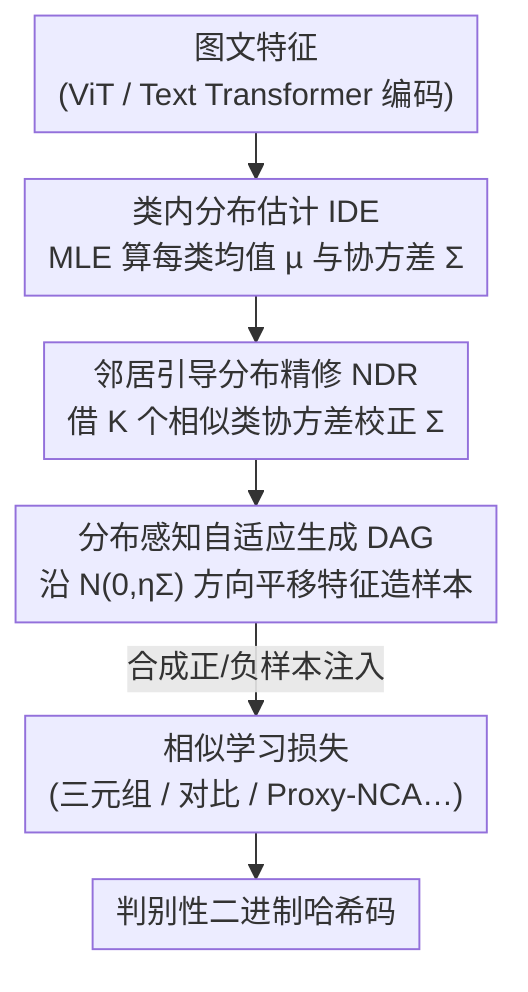

# Intra-class Distribution-guided Generative Hashing with Neighbor Refinement for Cross-modal Retrieval

**会议**: CVPR 2026  
**论文**: [CVF Open Access](https://openaccess.thecvf.com/content/CVPR2026/html/Sun_Intra-class_Distribution-guided_Generative_Hashing_with_Neighbor_Refinement_for_Cross-modal_Retrieval_CVPR_2026_paper.html)  
**代码**: https://github.com/QinLab-WFU/IDGH  
**领域**: 信息检索 / 跨模态哈希 / 样本生成  
**关键词**: 跨模态检索, 深度哈希, 类内分布估计, 样本生成, 协方差精修

## 一句话总结
IDGH 不再用复杂生成器或简单插值来扩充跨模态哈希的训练样本，而是直接估计每个类别的"类内特征分布"（均值+协方差），再借相邻类信息把估计不准的协方差精修一遍，最后沿这些分布方向平移特征生成语义丰富的合成样本——即插即用、几乎零额外开销，就把哈希码的判别力做上去了。

## 研究背景与动机

**领域现状**：跨模态哈希（cross-modal hashing）把图像、文本编码成紧凑的二进制码，用汉明距离做近邻检索，是海量多媒体数据下兼顾存储与速度的主流方案。主流训练范式分两类：成对（pair-wise，拉近相似对、推远不相似对）和三元组（triplet-wise，约束 anchor 到正样本比到负样本更近）。为了让相似学习有更丰富的信号，近年开始往里塞"样本生成"策略，扩充训练空间。

**现有痛点**：样本生成这条路本身有两个老毛病。其一，**插值类方法**（如 Mixup、CMDA）在隐空间对已有样本做确定性的、与类别无关的线性插值，合成样本只能落在原始点附近一小圈里，捕捉不到类内真正丰富的语义变化，多样性受限，学出来的码判别力不强。其二，**生成网络类方法**（如 HashGAN、扩散增强）虽然能生成异质样本，但要额外背一个复杂生成器，模型变重、训练不稳，检索效率和精度都受拖累。

**核心矛盾**：插值"轻但弱"、生成网络"强但重"，本质都没有显式地去刻画"一个类内部到底怎么变化"。如果能把每个类的类内变化用一个可计算的统计量（分布）显式建模出来，就能既不引入大模型、又生成出真正贴合类内语义结构的样本。

**本文目标**：(1) 怎么可靠地估计每个类的类内分布？(2) 当某些类样本太少、协方差估计崩坏时怎么补救？(3) 怎么用这个分布去生成既多样又语义可控的样本，并能塞进任意损失函数里。

**切入角度**：作者做了一个关键统计观察——**均值相近的类，协方差结构也往往相近**（在 MIRFLICKR-25K 上 Spearman 秩相关高达 0.97），即"长得像的类，内部变化方式也像"。这意味着可以用邻居类的分布信息来救自己估不准的协方差。

**核心 idea**：用"类内分布"（均值+协方差）显式建模类内变化，借邻居类把分布精修可靠，再沿分布方向平移特征自适应生成样本——用统计先验代替生成器。

## 方法详解

### 整体框架
IDGH 是一个挂在已有跨模态哈希主干（图像/文本 Transformer 编码器 + tanh 松弛的哈希函数）上的**即插即用样本生成模块**，由三段串成一条流水线：先对每个类做 **类内分布估计（IDE）** 拿到均值和协方差；由于小样本类的协方差估不准，再用 **邻居引导分布精修（NDR）** 拿相似类的协方差把它校正；最后用 **分布感知自适应生成（DAG）** 沿精修后的协方差方向采样平移，造出合成正/负样本，喂进三元组等损失里增强相似学习。整个模块只增加协方差统计和高斯采样，几乎不加 FLOPs 和参数。

### 关键设计

**1. 类内分布估计 IDE：用每类的均值与协方差显式刻画"类内怎么变"**

插值类方法的根本短板是不知道一个类内部沿哪些方向变化，只能在样本点附近瞎插。IDGH 直接用最大似然估计（MLE）把每个类 $c$ 的类内变化建成一个特征分布：对该类全部样本的松弛码 $\tilde{b}_i$ 求均值和协方差

$$\hat{\mu}_c = \frac{1}{n_c}\sum_{i\in S_c}\tilde{b}_i, \qquad \Sigma_c = \frac{1}{n_c}\sum_{i\in S_c}\big(\tilde{b}_i-\hat{\mu}_c\big)\big(\tilde{b}_i-\hat{\mu}_c\big)^{\top}$$

其中协方差 $\Sigma_c$ 编码了类 $c$ 的"特征怎么散开"，是后面生成样本的方向先验。这一步把"类内多样性"从一个模糊概念落成了可计算、可采样的统计量，是整个方法的地基。

**2. 邻居引导分布精修 NDR：用相似类的协方差救小样本类估不准的分布**

IDE 在大规模数据集上有个硬伤——很多类样本稀疏，协方差估计是病态的（ill-posed），直接拿去生成会造出噪声样本。NDR 的依据是作者验证过的统计规律：**均值距离和协方差距离强相关**（三数据集上 Spearman 相关系数最高 0.98），即"均值近的类、协方差也近"。于是对目标类 $c$，按均值距离取 $K$ 个最近邻类 $N_c$，做加权协方差聚合

$$\Sigma_{\text{neighbor}} = \Big(\sum_{i\in N_c} w_i\Sigma_i\Big)\Big/\Big(\sum_{i\in N_c} w_i\Big)$$

权重 $w_i$ 同时考虑邻居类的样本数 $n_i$、均值距离和协方差距离，越相似的类权重越大：

$$w_i = n_i\cdot\exp\!\Big(-\frac{\|D_m(i,k)\|^2}{2\sigma_m^2}-\frac{\|D_{cv}(i,k)\|^2}{2\sigma_{cv}^2}\Big)$$

再配一个全局协方差 $\Sigma_{\text{global}}$（全数据集按样本数加权）防过拟合，最终精修协方差是三者的凸组合：

$$\Sigma_c^{\text{NDR}} = (1-\alpha)\Sigma_c + \alpha\big[(1-\beta)\Sigma_{\text{neighbor}} + \beta\Sigma_{\text{global}}\big]$$

精妙之处在 $\alpha$ 是**随类样本数 $n_c$ 自适应**的：$\alpha=(1+\log[1+\gamma(n_c-1)])^{-1}$ 当 $n_c\le\tau$，否则 $\alpha=0$。也就是样本越多的类越相信自己的原始估计、几乎不校正；样本越少越多地借邻居和全局信息。这让精修"按需发生"，不会把本来估得好的大类也带偏。

**3. 分布感知自适应生成 DAG：沿协方差方向平移特征，造语义可控又多样的样本**

有了可靠的协方差，DAG 不再做确定性插值，而是把每个原始特征 $\tilde{b}_i$ 沿其所属类分布的随机方向平移来生成新样本——对图像模态

$$\hat{b}_i^I \sim N\big(\tilde{b}_i^I,\ \eta\Sigma_{l_i}^I\big)$$

文本模态同理。$\eta$ 控制类内变化强度（设在 $[0.6,1.0]$ 并随训练 epoch 递减，先广探后收敛），每个原样本生成 $M$ 个合成样本。因为平移方向由协方差给定，合成样本既覆盖了类内真实的语义变化方向、又始终落在该类语义内，避免了插值的"只在原点附近"和生成网络的"不可控"。这些合成样本作为正/负例注入损失即可，例如塞进余弦三元组损失

$$L_{\text{Trip}}^{\text{IDGH}} = \frac{1}{n}\sum_{i=1}^n\sum_{(j,k)\in\tilde{B}_i\cup\hat{B}_i}\big[s_{ij}-s_{ik}+\alpha\big]_+,\quad s_{ij}=\cos(\tilde{b}_i,\hat{b}_j)$$

合成样本扩充了候选池，使得能构造出更多信息量大的三元组、提供更强的相似学习信号。这也正是 IDGH "即插即用"的来源：它只负责往候选池里加好样本，对损失函数无侵入。

### 损失函数 / 训练策略
IDGH 本身不绑定特定损失，论文以余弦三元组损失为主例（公式 15），并验证它能直接套进对比损失、三元组损失、Multi-similarity、Proxy-NCA 四种损失。超参：合成样本数 $M=3$，邻居类数 $K=20$，$\beta=\gamma=0.1$，$\sigma_m=\sigma_{cv}=1$，$\tau=40$，$\eta\in[0.6,1.0]$ 随 epoch 递减。协方差矩阵每 5 个 epoch 更新一次，并用对角协方差 + 2-范数降低计算量。

## 实验关键数据

### 主实验
四个公开数据集（MIRFLICKR-25K、NUS-WIDE、IAPR TC-12、XMediaNet），对比 7 个近期深度跨模态哈希方法，指标 mAP@ALL，下表摘 NUS-WIDE 与难度更高的 XMediaNet 部分代表性结果（I→T）：

| 数据集 (I→T) | 位数 | IDGH | 次优 (SOTA) | 说明 |
|--------------|------|------|-------------|------|
| NUS-WIDE | 64bits | **0.7451** | 0.7218 (BiLGSEH) | +2.3pt |
| NUS-WIDE | 128bits | **0.7565** | 0.7241 (DECH) | +3.2pt |
| IAPR TC-12 | 64bits | **0.6991** | 0.6926 (DPBE) | 领先 |
| XMediaNet | 32bits | **0.5714** | 0.4640 (DECH) | +10.7pt，难数据集优势最大 |
| XMediaNet | 128bits | **0.7024** | 0.6141 (DECH) | +8.8pt |

IDGH 在四数据集、两任务（I→T / T→I）、4 种码长上几乎全面取得最优，且码越长优势越稳；在语义更细的 XMediaNet 上提升最显著，说明分布引导生成在难场景下尤其值钱。

### 消融实验
逐个验证 NDR、DAG 两个模块（baseline 为不加任何生成的三元组损失），下表摘 XMediaNet（I→T）：

| 配置 | 16bits | 64bits | 128bits | 说明 |
|------|--------|--------|---------|------|
| baseline (无生成) | 0.1662 | 0.3401 | 0.4240 | 仅 IDE 估计无精修无生成 |
| + DAG | 0.3928 | 0.6559 | 0.6986 | 加生成，大幅跳升 |
| + NDR + DAG (Full) | **0.4046** | **0.6591** | **0.7024** | 精修进一步加成 |

### 关键发现
- **DAG（生成）是主力**：单加 DAG 就把 XMediaNet 16bits 从 0.166 拉到 0.393，贡献最大；NDR 在 DAG 之上再补一刀（0.393→0.405），它的作用是"让 DAG 拿到更可靠的协方差去生成"，二者是上下游协同关系。
- **即插即用得到验证**：套进对比/三元组/Multi-similarity/Proxy-NCA 四种损失都一致涨点（表 3），说明增益来自"生成好样本"这个根本能力，而非和某个损失耦合。
- **超参规律**：合成样本数 $M$ 增大先涨后跌，$M>10$ 时噪声样本拖累性能，故取 $M=3$；邻居数 $K$ 越大越好（更多相似类做精修），取 $K=20$。
- **几乎零开销**：与 baseline 同主干，FLOPs/参数量持平（5.578G / 151.29M），训练时间仅 0.65h（接近最快的 Mixup 0.58h），生成时间 2.40s，远低于 HashGAN 的 15.46s。
- **小样本场景受益**：k-shot 实验中 IDGH 在低样本条件下对 baseline 领先尤其明显，印证分布引导生成在弱监督下扩多样性的价值。

## 亮点与洞察
- **用统计先验替代生成器**：最"啊哈"的点是把"样本生成"这个常被堆成大模型的问题，降维成"估协方差 + 高斯采样"，几乎零开销却比 HashGAN/Mixup/HDML 都强（表 4）——证明显式建模类内分布比硬训一个生成器更对症。
- **邻居救小样本的统计依据**：作者没有拍脑袋设计精修，而是先用 Spearman 相关系数证明"均值近→协方差近"（0.97 量级），再据此设计 NDR，方法动机扎实可迁移。
- **自适应精修系数 $\alpha$**：让校正强度随类样本数自动衰减，大类信自己、小类借邻居，这种"按需校正"思路可迁移到任何小样本统计估计场景。
- **对损失无侵入的解耦设计**：只往候选池加合成样本，使其能挂在几乎任意度量学习损失上，工程上极友好。

## 局限与展望
- 协方差用了对角近似 + 2-范数（为算力妥协），丢掉了特征维度间的相关性，理论上可能限制生成样本的表达力；高维全协方差是否更好未充分讨论。
- 方法依赖"相似类协方差相似"的统计假设，在该假设较弱的数据集上（如 IAPR TC-12 的 Spearman 仅 0.72）增益相对收窄，对类语义结构高度异质的场景普适性待验证。
- NDR/DAG 引入了 $M,K,\alpha,\beta,\gamma,\sigma_m,\sigma_{cv},\tau,\eta$ 等较多超参，虽给了默认值，但跨数据集调参成本不低。
- DAG 的理论支撑放在补充材料，正文未展开其为何能提升判别性的严格论证。

## 相关工作与启发
- **vs 插值类 (Mixup / CMDA)**: 它们做确定性、类无关的线性插值，样本只在原点附近；IDGH 用类内协方差给出生成方向，覆盖真实类内变化，表 4 上全面占优且同样轻量。
- **vs 生成网络类 (HashGAN / 扩散增强 DAR)**: 它们靠额外生成器造异质样本但模型重、训练慢；IDGH 用统计采样替代，生成时间 2.40s vs HashGAN 15.46s，精度还更高。
- **vs HDML**: 同为度量学习里的硬样本/分布生成思路，IDGH 把"分布"具体化为可精修的类内协方差并引入邻居校正，在跨模态哈希上更对症。

## 评分
- 新颖性: ⭐⭐⭐⭐ 用类内分布+邻居精修替代生成器是巧而扎实的切入，统计观察支撑动机
- 实验充分度: ⭐⭐⭐⭐⭐ 四数据集×两任务×四码长，含损失通用性、生成方法对比、效率、few-shot、消融，相当完整
- 写作质量: ⭐⭐⭐⭐ 动机—观察—方法逻辑清晰，公式完整；部分理论推到补充材料
- 价值: ⭐⭐⭐⭐ 即插即用、零开销、跨损失通用，实用性强，易被后续工作复用

<!-- RELATED:START -->

## 相关论文

- [\[CVPR 2026\] Mask to Align, Weight to Disambiguate: Reliable Unsupervised Cross-Modal Hashing with Masked-Weight Contrast](mask_to_align_weight_to_disambiguate_reliable_unsupervised_cross-modal_hashing_w.md)
- [\[CVPR 2026\] POGA: Paraphrased and Oppositional Graph Alignment for Fine-Grained Cross-Modal Retrieval](poga_paraphrased_and_oppositional_graph_alignment_for_fine-grained_cross-modal_r.md)
- [\[ACL 2026\] From Relevance to Authority: Authority-aware Generative Retrieval in Web Search Engines](../../ACL2026/information_retrieval/from_relevance_to_authority_authority-aware_generative_retrieval_in_web_search_e.md)
- [\[ACL 2026\] Why These Documents? Explainable Generative Retrieval with Hierarchical Category Paths](../../ACL2026/information_retrieval/why_these_documents_explainable_generative_retrieval_with_hierarchical_category_.md)
- [\[ACL 2026\] GLIER: Generative Legal Inference and Evidence Ranking for Legal Case Retrieval](../../ACL2026/information_retrieval/glier_generative_legal_inference_and_evidence_ranking_for_legal_case_retrieval.md)

<!-- RELATED:END -->
