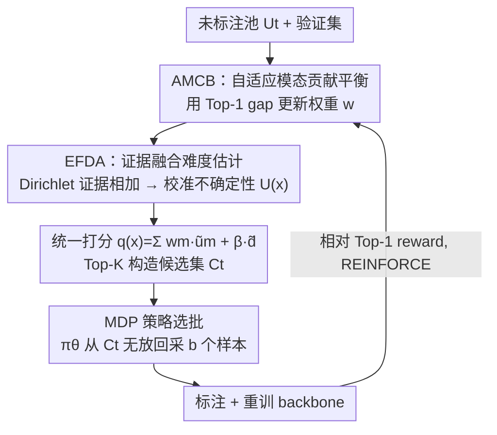

# Label What Matters: Modality-Balanced and Difficulty-Aware Multimodal Active Learning

**会议**: CVPR 2026  
**论文**: [CVF Open Access](https://openaccess.thecvf.com/content/CVPR2026/html/Zeng_Label_What_Matters_Modality-Balanced_and_Difficulty-Aware_Multimodal_Active_Learning_CVPR_2026_paper.html)  
**代码**: 无  
**领域**: 多模态VLM / 主动学习  
**关键词**: 多模态主动学习, 模态平衡, 强化学习采样, 证据融合, 难度感知

## 一句话总结
针对多模态主动学习中"选样规则被固定在融合阶段、对模态价值和样本难度随训练动态变化无感知"的问题，本文提出 RL-MBA：把每轮选样建模成马尔可夫决策过程，用强化学习策略自适应地重平衡模态贡献（AMCB）并基于证据不确定性聚焦"有信息量的难样本"（EFDA），在 Food101/KineticsSound/VGGSound 上以更低标注预算同时提升分类精度与模态公平性。

## 研究背景与动机

**领域现状**：多模态学习靠融合图像/文本/音频等互补信息取得了优于单模态的表现，但依赖大规模标注，跨多模态标注尤其昂贵。主动学习（AL）通过只挑"最有信息量"的样本去标注来降本，是缓解这一矛盾的主流手段。

**现有痛点**：多模态场景下的 AL 方法大多仍用**固定的选样规则**，把采样准则钉死在融合阶段。这带来两个具体问题：(1) **模态不平衡**——批次总是偏向"强模态主导"的样本，弱模态长期被冷落，削弱了跨模态互补性、损害泛化；(2) **对动态性无感知**——某个模态的相对价值、某个样本的难度都会随着训练推进而漂移，固定规则无法在轮次之间对这种漂移做出反应，使预算花得不划算。

**核心矛盾**：像 BMMAL 这类试图缓解模态偏置的方法，依赖训练中的**静态调整**，隐含假设"模态重要性跨轮稳定"——但模型和已标注池一直在演化，这个假设几乎不成立。问题的根本是：**采样规则应当从反馈中更新，而不是一次设定后固定**。

**本文目标**：让选样规则沿两条轴自适应——(i) 跨轮重新加权模态贡献，让正在变重要的模态被用上、正在衰退的模态不再霸占预算；(ii) 用量化的不确定性去聚焦"有挑战但有信息量"的样本，而不是单纯挑最难的极端样本。

**切入角度**：把"从每轮反馈中更新采样策略"这件事，自然地建模成一个 **MDP**，用面向长期回报优化的策略来选样——这样策略能对当前模型状态、未标注池分布、以及随时间变化的模态价值做出响应。

**核心 idea**：用一个轻量 RL 策略替代固定选样规则，让"模态权重 + 样本难度"在每一轮根据验证集反馈协同更新，在固定预算下追求长期、平衡的收益。

## 方法详解

### 整体框架
RL-MBA 把多模态样本选择建模成马尔可夫决策过程（MDP），用 policy-gradient 强化学习优化一个轻量选样策略。它要解决的是"固定融合规则对模态价值/样本难度漂移无感知"，整体思路是把一轮 AL 拆成"自适应融合打分 → 构造候选集 → 策略选批 → 重训 → 算 reward 更新策略"的闭环，让下一轮选样吃到上一轮的反馈。

具体地，每个主动学习轮 $t$ 依次执行六步：(1) 用自适应模态加权（AMCB）做多模态融合，并对融合特征做预算约束的 k-means++ 聚类以保证多样性；(2) 用证据融合（EFDA）估计校准后的不确定性与样本难度；(3) 把模态加权不确定性与多样性组合成统一分数 $q(x)$，取 Top-$K$ 形成一个**紧凑候选集** $C_t$；(4) 由策略 $\pi_\theta$ 从候选集中无放回地选出 $b$ 个样本作为本轮 query；(5) 标注后并入已标注集 $L$、重训 backbone；(6) 用相对验证 Top-1 算 reward，并用 REINFORCE 更新策略。所有评估都在一个固定的分层验证集上做，逐模态预测头共享 backbone，每轮在验证集上评估以算出模态贡献与校准统计。

这里有个关键的"耦合"设计：AMCB 算出的同一组模态权重 $w$ 被同时注入**融合、打分、策略状态**三处，使得"强调哪个模态"在整条管线里保持一致地随任务演化。

### 关键设计

**1. AMCB：用反馈更新的模态贡献单纯形替代固定融合权重**

固定模态权重会把选样偏向"恰好当下主导"的那个通道，让其他线索被浪费；而一个模态真正的贡献其实依赖当前训练语境——哪些类别多/缺、有多少标签、模型对数据拟合到什么程度——它是逐轮变化的。AMCB 不再用固定权重，而是用一个**随反馈更新的概率单纯形**来表达模态贡献。它在每轮固定验证集上用 **Top-1 gap** 量化模态 $m$ 的当前贡献：

$$\Delta_m = \text{Top-1}_m - \text{Top-1}_{mm}$$

即"该模态单独头"与"多模态头"的精度差，正 gap 说明该模态带来了多模态头之外的互补信号，负 gap 说明冗余或噪声。再用温度 softmax 映射到单纯形：$w = \text{softmax}(\Delta/\tau)$，满足 $w_m\in[0,1],\ \sum_m w_m=1$，温度 $\tau$ 越小则模态变得有信息时权重切换越快；并可选地加一个下限 $\varepsilon$ 防止某模态权重塌缩到 0。它的好处在于：融合 $f(x)=\sum_m w_m f_m(x)$ 是凸组合因而尺度稳定，单模态主导时 $w\to e_k$、模态打平时 $w$ 均匀，避免过早特化。最关键的是同一个 $w$ 被注入融合、打分 $q(x)$、以及策略状态三处，让"强调谁"在整条管线协调一致地漂移。

**2. EFDA：证据级（而非后验级）融合，得到校准的难度信号**

不确定性应同时反映偶然不确定性（数据固有噪声）和认知不确定性（证据不足）。如果在后验层面简单相乘/平均地融合各模态，当模态间校准程度不同或某模态局部失效时容易过度自信。EFDA 改为在**证据层面做可加、有界、且与 AMCB 对齐的融合**：每个模态头输出 Dirichlet 证据 $\alpha_m(x)\in\mathbb{R}^C_{>0}$，按权重相加

$$\alpha_f(x) = 1 + \sum_{m=1}^{M} w_m\big(\alpha_m(x)-1\big)$$

使融合先验 $\alpha_f$ 按 $w$ 在模态间插值——权重高的模态贡献更多证据，弱模态既不主导也不会让估计塌掉。它保持了若干良好性质：单模态可信时 $w=e_k$ 退化为 $\alpha_f=\alpha_k$；置信度被显式夹在 $1\le\alpha_{f,c}\le 1+\sum_m w_m(\alpha_{m,c}-1)$ 之间，杜绝"失控的确定性"；弱/缺失输入时因小 $w_m$ 而优雅退化。基于 $\alpha_f$ 用 Dirichlet 预测方差作为难度代理：

$$\text{Var}[p_c]=\frac{\alpha_{f,c}(\alpha_{f,0}-\alpha_{f,c})}{\alpha_{f,0}^2(\alpha_{f,0}+1)},\qquad U(x)=\frac{1}{C}\sum_{c=1}^{C}\text{Var}[p_c]$$

其中 $\alpha_{f,0}=\sum_c\alpha_{f,c}$。后验越弥散（$\alpha_{f,0}$ 小或类质量均衡）的样本 $U(x)$ 越大、越优先。它和 AMCB 天然耦合：某模态变得更有信息时 $w_m$ 上升、其证据对 $\alpha_f$ 贡献更多、易样本的不确定性收缩，从而把预算腾给真正困难的样本。

**3. MDP 策略选批：候选集 + REINFORCE，把"选哪批"交给会学习的策略**

前两个组件给出了"模态平衡的融合特征"和"校准的难度"，但**怎样从池子里挑出这一批**仍需要一个能随分布演化而调整的决策器，直接取 Top-$b$ 太僵硬。本文先把信息量与多样性组合成统一分数：对融合特征做预算约束 k-means++（$k=b$，≤5 次迭代）得到最近质心距离 $d(x)$ 鼓励覆盖欠表示区域，再

$$q(x)=\sum_{m=1}^{M} w_m\,\tilde{u}_m(x)+\beta\,\tilde{d}(x)$$

（$\tilde{u},\tilde{d}$ 为轮内 min–max 归一化），用 $q$ 取 Top-$K$（$K=\kappa b$，如 $\kappa=5$）构造紧凑候选集 $C_t$，而非直接当动作。MDP 的状态 $s_t=[g_t\,\|\,\phi_t\,\|\,\bar u_t\,\|\,\bar d_t\,\|\,\rho_t]$ 是定长向量，含验证统计（Top-1/NLL/ECE）、模态贡献 $\phi_t$（Top-1 gap）、不确定性与多样性汇总、以及训练诊断（loss 斜率、梯度范数）。动作是从 $C_t$ 无放回顺序采 $b$ 个：策略是轻量 MLP，对候选输出 logits 并逐步 softmax 采样、采一个移除一个，整批概率为各步连乘。reward 用**相对** Top-1：

$$r_t=\text{Top-1}^{\text{RL-MBA}}_t-\frac{1}{|E|}\sum_{h\in E}\text{Top-1}^{(h)}_t,\quad E=\{\text{GCNAL, BADGE, BMMAL}\}$$

其中 baseline 分数是离线**预计算的常数**（同协议下事先跑好），算 reward 时无需并行训练 baseline，几乎零额外开销；再用指数滑动平均平滑以稳训练。优化用一步回报的 REINFORCE：$\nabla_\theta J=\mathbb{E}[\sum_t A_t\nabla_\theta\log\pi_\theta(a_t|s_t)]$，$A_t=r_t-b_t$（$b_t$ 为历史 reward 滑动均值，做方差缩减），可选地 clip $A_t$ 稳训。这样策略既能适配演化的数据分布，RL 部分又保持轻量；每个数据集/任务训一个策略。

### 损失函数 / 训练策略
策略用 REINFORCE 优化（式 13），优势 $A_t=r_t-b_t$ 以滑动均值 baseline 缩减方差；reward 用相对 Top-1 并做 EMA 平滑。backbone 每个 AL 轮重训 $E$ 个 epoch（图文任务 ResNet-101+BERT-base，15 epoch/轮，AdamW 优化）。每轮复杂度近线性：特征提取 $O(|U_t|F)$、打分 $O(|U_t|M)$、排序 $O(|U_t|\log|U_t|)$，候选构造只加排序开销，策略只在 $K=\kappa b$ 候选上操作，相比重训可忽略。

## 实验关键数据

### 主实验
固定标注预算 3,000 样本（占 Food101 6.6% / KineticsSound 20.4% / VGGSound 2.9%）下的 Top-1 精度：

| 方法 | Food101 | KineticsSound | VGGSound |
|------|---------|---------------|----------|
| Random | 0.8470 | 0.4650 | 0.2173 |
| Entropy | 0.8480 | 0.4650 | 0.2043 |
| GCNAL | 0.8510 | 0.4600 | 0.2033 |
| CoreSet | 0.8422 | 0.4600 | 0.2013 |
| DeepFool | 0.8500 | 0.4680 | 0.1973 |
| BALD | 0.8450 | 0.4550 | 0.1993 |
| BADGE | 0.8420 | 0.4700 | 0.2023 |
| BMMAL（最强 baseline） | 0.8609 | 0.4745 | 0.2053 |
| **RL-MBA** | **0.8650** | **0.4841** | **0.2223** |

相比最强 baseline BMMAL，RL-MBA 在三个数据集上一致提升，VGGSound 上涨幅尤其明显（0.2053 → 0.2223），说明在低标注下更好地利用了多模态互补性。

### 消融实验
3,000 标签下逐组件消融（Top-1）：

| 配置 | Food101 | KineticsSound | VGGSound | 说明 |
|------|---------|---------------|----------|------|
| BMMAL（baseline） | 0.8609 | 0.4745 | 0.2053 | 起点 |
| RL-MBA w/ AMCB | 0.8621 | 0.4771 | 0.2059 | 仅模态平衡 |
| RL-MBA w/ EFDA | 0.8637 | 0.4802 | 0.2177 | 仅难度感知 |
| RL-MBA（Full） | **0.8650** | **0.4841** | **0.2223** | 完整模型 |

### 关键发现
- **AMCB 与 EFDA 互补，缺一掉点**：单独加任一组件都优于 BMMAL，但全量最好；在 KineticsSound/VGGSound 上 EFDA（难度感知）带来的提升更大（如 VGGSound 0.2053→0.2177），说明这两个数据集更吃"挑对难样本"。
- **模态权重确实在动态漂移**：用 Shapley 贡献 $\phi$ 追踪 Food101 从 1k 到 7k 标签，RL-MBA 渐进地把权重移向文本、弱化图像，而 BMMAL/BADGE/BALD/Random 基本保持静态——验证了 AMCB 在按模态演化价值调整采样。
- **效率反而更高**：RL-MBA 单轮总耗时最低（884.39s），主要靠选样阶段加速（Sel 仅 33.48s vs BADGE 312.84s / BMMAL 310.12s），而策略更新仅 0.23s，几乎零额外开销。
- **相对 reward 设计最稳**：对比 Relative/Absolute/Incremental 三种 reward，随预算增长相对 reward（反馈归一化、更自适应）持续最高。
- **分类层面有可解释模式**：在 KineticsSound 上 RL-MBA 在音频主导类（撕纸、吹萨克斯）更强，BMMAL 在视频主导类（敲笔）略好，说明 RL-MBA 更善用音频线索、视频特征整合仍有提升空间。

## 亮点与洞察
- **"采样规则应从反馈更新"这一句话点破了多模态 AL 的核心病灶**：把模态权重、样本难度这些会漂移的量统一塞进 MDP 状态，让选样器学会跟着训练动态走，比任何静态启发式都更贴合多模态学习的非平稳本质。
- **"权重 $w$ 一处算、三处用"的耦合很巧**：同一组 AMCB 权重同时驱动融合、打分、策略状态，避免了"融合偏向一个模态、打分却偏向另一个"的内部不一致——这种把单一信号贯穿全管线的做法可迁移到任何多模态加权场景。
- **证据级相加融合（式 3）是个干净的工具**：可加、有界、单模态可信时优雅退化、弱模态不塌缩，相比后验相乘/平均更抗过度自信，作为多模态不确定性量化模块可以即插即用到别的任务（如多模态检测/分割的难样本挖掘）。
- **相对 reward 把 baseline 做成离线常数**，既给策略一个有意义的"超过平均对手多少"的信号，又不需要在线训练对手，工程上很轻——这是把 RL 用进 AL 而不爆开销的关键。

## 局限与展望
- 作者承认在**视频主导类**上 RL-MBA 略逊于 BMMAL，视频特征整合仍有改进空间。
- 模态贡献用 Top-1 gap / Shapley 估计，依赖一个固定分层验证集，验证集的代表性与规模会直接影响 $w$ 的估计质量；小预算早期阶段验证统计噪声可能较大（笔记观察）。
- 评测只在三个分类基准（图-文、视-音）上，模态数 $M$ 较小（2 模态）；扩展到 3+ 模态、或检测/分割等结构化任务时 AMCB/EFDA 的可加证据与单纯形权重是否仍稳，未验证（笔记观察）。
- reward 依赖预计算 baseline 曲线，若换协议/换数据需重新离线跑 baseline，迁移成本不为零（笔记观察）。
- 每个数据集训一个策略，跨数据集/任务的策略迁移与冷启动未探索。

## 相关工作与启发
- **vs BMMAL（最强 baseline）**：BMMAL 也做多模态信息量+多样性以平衡模态，但用训练中的**静态调整**，隐含"模态重要性跨轮稳定"假设；RL-MBA 用 RL 策略让权重逐轮从反馈更新，在三数据集上一致超过它，且选样更快。
- **vs 纯不确定性方法（Entropy / BALD / DeepFool）**：它们只看模型置信度/边界，单模态视角，既不平衡模态也不区分"难且有信息"与"难但无用"；RL-MBA 用证据方差做校准难度并由策略筛选。
- **vs 多样性方法（CoreSet / BADGE）**：CoreSet/BADGE 追求覆盖与梯度多样性但对多模态动态模态重要性适应有限；RL-MBA 把多样性 $\tilde d(x)$ 只作为 $q(x)$ 的一项，主导权交给可学习策略。
- **vs RL-based AL（RAL / DRAL / Policy-based AL）**：以往 RL 驱动 AL 多聚焦单模态，缺乏处理模态不平衡与难度感知的机制；RL-MBA 在统一 RL 设计里联合建模模态平衡与样本难度，填补了这一空白。

## 评分
- 新颖性: ⭐⭐⭐⭐ 把"模态权重 + 难度"统一进 MDP 并用一组权重贯穿融合/打分/策略的耦合设计较新，但 RL-for-AL、证据融合各自非首创。
- 实验充分度: ⭐⭐⭐⭐ 三数据集 + 逐组件消融 + reward 设计 + 模态贡献追踪 + 效率分析较完整，但只 2 模态、预算点偏少。
- 写作质量: ⭐⭐⭐⭐ 动机清晰、公式与算法完整，组件命名（AMCB/EFDA）和耦合关系交代得当。
- 价值: ⭐⭐⭐⭐ 低标注预算下同时提精度与模态公平、且选样更快，对多模态标注成本敏感的落地场景实用。

<!-- RELATED:START -->

## 相关论文

- [\[CVPR 2026\] MOON2.0: Dynamic Modality-balanced Multimodal Representation Learning for E-commerce Product Understanding](moon20_dynamic_modality-balanced_multimodal_representation_learning_for_e-commer.md)
- [\[CVPR 2026\] Learning What Matters: Prioritized Concept Learning via Relative Error-driven Sample Selection](learning_what_matters_prioritized_concept_learning_via_relative_error-driven_sam.md)
- [\[CVPR 2026\] Similarity-as-Evidence: Calibrating Overconfident VLMs for Interpretable and Label-Efficient Medical Active Learning](similarity-as-evidence_calibrating_overconfident_vlms_for_interpretable_and_labe.md)
- [\[CVPR 2026\] Towards Dynamic Modality Alignment in Multimodal Continual Learning](towards_dynamic_modality_alignment_in_multimodal_continual_learning.md)
- [\[CVPR 2026\] BALM: A Model-Agnostic Framework for Balanced Multimodal Learning under Imbalanced Missing Rates](balm_a_model-agnostic_framework_for_balanced_multimodal_learning_under_imbalance.md)

<!-- RELATED:END -->
