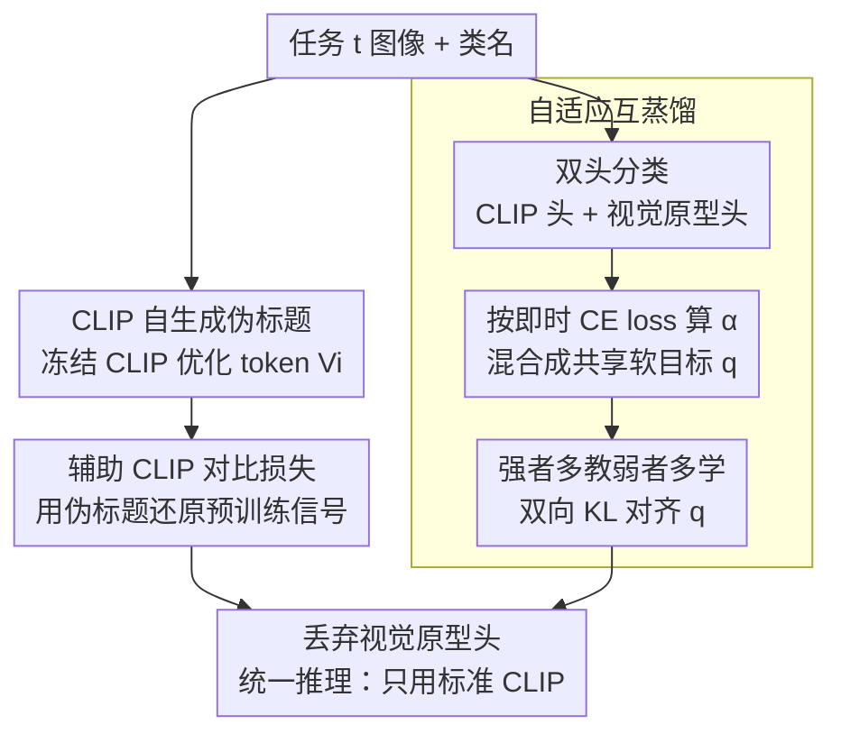

# Learning from Itself: Mining Internal Knowledge from Vision Language Models for Continual Learning

**会议**: CVPR 2026  
**论文**: [CVF Open Access](https://openaccess.thecvf.com/content/CVPR2026/html/Gong_Learning_from_Itself_Mining_Internal_Knowledge_from_Vision_Language_Models_CVPR_2026_paper.html)  
**代码**: https://github.com/jordangong/continual-learning ⚠️ 以原文为准  
**领域**: 多模态VLM / 持续学习  
**关键词**: CLIP持续学习, 伪标题, 自蒸馏, 自适应互蒸馏, 内部知识挖掘

## 一句话总结
针对 CLIP 做持续学习时存在的「文本分布鸿沟」和「视觉/双编码器性能错配」两大病灶，本文提出 Learning from Itself（LfI）：让冻结的 CLIP 给每张图优化生成自己的「伪标题」token 来补回预训练式的训练信号，再用一个临时视觉原型分类器与 CLIP 头互相自适应蒸馏，使强者多教、弱者多学，推理时只保留原始 CLIP——在多个持续学习基准上刷到 SOTA，且全程不依赖任何外部大模型。

## 研究背景与动机

**领域现状**：CLIP 这类视觉-语言模型靠图文对齐获得了强大的零样本识别能力，把它用于持续学习（class-incremental learning，模型按任务流逐步学新类、且看不到旧任务数据）是当前热门方向。主流做法要么把 CLIP 当普通视觉模型、丢掉文本编码器套传统持续学习技巧，要么引入 prompt/LoRA/原型分类器做参数高效微调，更激进的甚至调用 GPT-4 给类别生成描述（ENGINE）。

**现有痛点**：作者通过在未微调的 CLIP 上量化测量，揭示了两个被忽视的具体问题。

第一是**文本分布鸿沟**。CLIP 预训练看的是网络爬来的丰富描述（"a golden retriever playing fetch in the park"），而持续学习只给孤零零的类名（"dog"）。在 CIFAR-100 上，仅用类名时正负图文对的相似度差（similarity gap）只有 0.06、对比损失高达 1.51，离 COCO Captions 这种自然图文分布（gap 0.15、loss 0.38）相去甚远——说明分布严重漂移。一旦换成多模态 LLM 生成的描述性标题，gap 翻倍（0.06→0.11）、loss 减半（1.51→0.71），持续训练后准确率直接涨 2-3%。但依赖外部模型生成标题，违背了「模型应靠自身能力学习」的原则。

第二是**视觉/双编码器性能错配**。作者用 SimpleCIL（免训练、对视觉特征取均值造原型）从 CLIP 视觉编码器里抽一个纯视觉分类器，结果发现它在细粒度数据集上反而碾压完整 CLIP：CUB-200 上纯视觉 76% vs 完整 CLIP 56%，差距高达 20 个点；而 CLIP 在 CIFAR-100、ImageNet-R 这类自然图像上更强。这说明 CLIP 不同组件里藏着**互补知识**——视觉编码器擅长细粒度视觉区分，文本编码器擅长语义关系。简单地集成两路预测虽然有效，但破坏了 CLIP 优雅的单体架构、也妨碍下游集成。

**核心矛盾**：CLIP 自己内部就装着持续学习所需的两类知识（预训练式的图文对齐信号、视觉/语义的互补判别力），但标准微调流程既没还原前者、也没让后者互通，白白浪费了这座金矿。

**本文目标**：不引入任何外部模型、不改 CLIP 架构，只靠「挖掘并重组 CLIP 自身的内部知识」来同时补上这两个缺口。

**切入角度**：既然外部标题有用、纯视觉分类器有料，那能不能让 CLIP 自己生成标题、让 CLIP 的两个组件互相当老师？

**核心 idea**：让 CLIP「自己教自己」——冻结 CLIP 优化可学习 token 生成伪标题来重建预训练式信号，再让 CLIP 头与临时视觉原型头按各自即时表现自适应互蒸馏，推理时只留原始 CLIP。

## 方法详解

### 整体框架
LfI 的训练在每个任务上同时优化三条互补目标，把 CLIP 自身的知识挖出来、重新整合回 CLIP。输入是当前任务的图像-类名对，输出是一个增强后的标准 CLIP（推理时不增加任何额外结构）。整条流水线分三块：**任务开始前**先冻结 CLIP、为每张图离线优化出伪标题 token（Token Generation）；**任务训练时**维护两个分类头——原始 CLIP 双编码器头 + 从视觉编码器临时初始化的原型分类器头，三条 loss（监督分类、用伪标题的辅助 CLIP 对比损失、两头之间的自适应互蒸馏）并行作用（Adaptive Mutual Training）；**任务结束后**丢掉临时视觉分类器，推理只用标准 CLIP + 类名模板（Unified Inference），避免训练-测试不匹配。

### 关键设计

**1. CLIP 当「看图说话者」：自生成伪标题 token 填补文本分布鸿沟**

针对类名太干瘪导致的预训练-微调分布漂移，作者让 CLIP 给每张图生成自己的「标题」，思路类比对抗样本——但找的不是骗过模型的图像扰动，而是 CLIP 自己认为最匹配该图的文本嵌入。对当前任务每张图 $x_i$，创建 $K$ 个可学习 token 嵌入 $V_i=\{v_{i,1},...,v_{i,K}\}$，插进保留类名的模板 $s_i = \texttt{a photo of a [name}_c\texttt{] }[v_{i,1}]...[v_{i,K}]$，类名提供语义锚点。优化时**冻结整个 CLIP，只优化 token**，最小化对比损失

$$\mathcal{L}_{\text{CLIP}} = -\frac{1}{|B|}\sum_{i\in B}\log\frac{\exp(z^v_i\cdot z^l_i/\tau)}{\sum_{j\in B}\exp(z^v_i\cdot z^l_j/\tau)}$$

其中混批 $B=B_t\cup B_{\text{ref}}$ 把当前任务样本和 COCO Captions 样本掺在一起，给对比学习提供丰富负样本（持续学习每步类别太少，负样本不够会优化不动）。这一步本质是「问 CLIP：用你预训练学到的知识，你觉得这张图该配什么文字描述」，得到的 token 当伪标题喂进训练阶段的辅助 CLIP 损失 $\mathcal{L}^{\text{aux}}_{\text{CLIP}}$，重建一个类似预训练的环境来平滑分布漂移。注意伪标题只在训练时当辅助信号用，推理仍回到标准类名模板。

**2. 锚点初始化 + 双正则：把 token 拴在自然语言空间里，防止退化成对抗解**

纯对比优化很容易把 token 推成「能压低 loss 但毫无语义」的对抗模式，让伪标题失效。本文用三招约束。首先是**锚点初始化**：不随机初始化，而是循环复制类名的 token 嵌入 $v^{(0)}_{i,k} = \text{embed}(\text{name}_c)[k \bmod |\text{name}_c|]$，让优化从相关语义空间起步（消融显示去掉它危害最大，token 退化成对抗解、CLIP loss 反而低到 1.45 但性能最差）。其次是**监督对比损失** $\mathcal{L}_{\text{SCL}}$，拉近同类样本的文本表示，保证类内一致性。最后是**词表对齐损失**：对每个 token 找词表里 $M$ 个最近邻，最小化

$$\mathcal{L}_{\text{vocab}} = \frac{1}{|B_t|\cdot K}\sum_{i\in B_t}\sum_{k=1}^{K}\min_{w\in\text{top-}M(V,v_{i,k})}\big(1-\cos(v_{i,k},w)\big)$$

把 token 钉在真实词嵌入分布附近、防止漂进对抗空间。token 生成总目标为 $\mathcal{L}_{\text{gen}}=\mathcal{L}_{\text{CLIP}}+\lambda_{\text{SCL}}\mathcal{L}_{\text{SCL}}+\lambda_{\text{vocab}}\mathcal{L}_{\text{vocab}}$。

**3. 自适应互蒸馏：让 CLIP 头和视觉原型头按即时表现互教互学**

针对视觉/文本编码器各有所长但无法互通的痛点，本文在训练时挂两个预测头：CLIP 头 $p_{\text{clip}}$ 用双编码器图文对齐分类，视觉头 $p_{\text{vis}}=\text{softmax}(g_t(f_v(x))/\tau)$ 用从预训练视觉特征原型 $\mu_c$ 初始化的任务专属余弦分类器 $g_t$（任务结束即丢弃）。传统互学习用对称双向 KL，假设两个模型同样可靠——但预训练模型上往往一强一弱，对称蒸馏会逼强者去匹配弱者、反而拉低性能；而单向蒸馏又面临「事先不知道哪个头更强（随数据集甚至随样本剧烈变化）」的难题。

本文的解法是构造**一个随即时质量动态混合的共享软目标**。先用交叉熵衡量两头当前预测质量 $\ell_{\text{clip}}=\text{CE}(p_{\text{clip}},y)$、$\ell_{\text{vis}}=\text{CE}(p_{\text{vis}},y)$（loss 越低预测越好），再混合（混合前对两路预测都做 stop-gradient，防止两头塌缩到同一平凡解）：

$$q = \alpha\cdot\text{sg}(p_{\text{clip}}) + (1-\alpha)\cdot\text{sg}(p_{\text{vis}}),\quad \alpha = \sigma\!\left(\gamma\cdot\frac{\ell_{\text{vis}}-\ell_{\text{clip}}}{\ell_{\text{vis}}+\ell_{\text{clip}}+\epsilon}\right)$$

当 CLIP 头更好（$\ell_{\text{clip}}<\ell_{\text{vis}}$）时 $\alpha>0.5$、软目标偏向 CLIP；反之偏向视觉头。两头都向这个共享目标对齐：$\mathcal{L}^{\text{vis}}_{\text{dist}}=D_{\text{KL}}(p_{\text{vis}}\|q)$、$\mathcal{L}^{\text{clip}}_{\text{dist}}=D_{\text{KL}}(p_{\text{clip}}\|q)$。因为弱头预测离目标远、KL 大所以学得多，强头离目标近、KL 小所以只被轻微微调——形成「强者多教、弱者多学」的自平衡系统。这正是细粒度任务上互蒸馏把 CUB-200 从 71.48% 拉到 79.98% 的关键。

### 损失函数 / 训练策略
总训练目标整合三块：

$$\mathcal{L}_{\text{total}} = \underbrace{\mathcal{L}^{\text{clip}}_{\text{CE}}+\mathcal{L}^{\text{vis}}_{\text{CE}}}_{\text{监督分类}} + \underbrace{\beta_1\mathcal{L}^{\text{aux}}_{\text{CLIP}}}_{\text{辅助对比}} + \underbrace{\beta_2(\mathcal{L}^{\text{vis}}_{\text{dist}}+\mathcal{L}^{\text{clip}}_{\text{dist}})}_{\text{互蒸馏}}$$

实现上：token 生成阶段冻结 CLIP、每样本优化 $K=3$ 个 token，AdamW（lr $10^{-3}$、weight decay 0.2、batch 1024=512 目标+512 COCO 参考）训 5 epoch 早停，$\lambda_{\text{SCL}}=\lambda_{\text{vocab}}=1.0$、$M=5$。持续训练阶段解冻除温度外的全部 CLIP 参数（$\tau\approx0.01$），SGD（lr $10^{-4}$、momentum 0.9、batch 64）训 20 epoch，混合锐度 $\gamma=3$、$\beta_1=0.1$、$\beta_2=1.0$。

## 实验关键数据

### 主实验
在 OpenCLIP ViT-B/16 上跨 5 个数据集、多种任务划分（10-task / 6-task 等），LfI 全面 SOTA，细粒度任务提升尤其明显。

| 数据集 (协议) | 指标 | LfI | 之前最强 | 提升 |
|--------|------|------|----------|------|
| CIFAR-100 (10-10) | last | 83.82 | 80.91 (Finetune) | +2.91 |
| ImageNet-R (20-20) | last | 83.57 | 81.29 (Finetune) | +2.28 |
| CUB-200 (20-20) | last | 81.74 | 80.20 (ENGINE) | +1.54 |
| Stanford Cars (20-20) | last | 91.42 | 90.08 (ENGINE) | +1.34 |
| Food-101 (20-20) | last | 89.44 | 87.48 (Finetune) | +1.96 |

OpenAI CLIP ViT-B/16 上同样稳赢：CIFAR-100 82.69、ImageNet-R 83.97、ImageNet-100 80.68，均超 MG-CLIP 等近期视觉-语言方法 1-3 个点。一个意外发现：朴素微调（Finetune）在固定温度 + 仅当前任务文本模板的配置下出奇地强（CIFAR-100 80.91），暗示 CLIP 双编码器架构需要和纯视觉模型不同的适配策略。

### 消融实验
学习目标逐项消融（OpenCLIP ViT-B/16，10-task，last 准确率）：

| 配置 | CIFAR-100 | CUB-200 | 说明 |
|------|---------|---------|------|
| 零样本 | 71.11 | 64.15 | 未适配 CLIP |
| 仅 $\mathcal{L}^{\text{clip}}_{\text{CE}}$ (Finetune) | 80.91 | 71.06 | 标准微调 |
| 仅 $\mathcal{L}^{\text{aux}}_{\text{CLIP}}$ | 75.83 | 66.29 | 纯对比缺类别判别力 |
| $\mathcal{L}^{\text{clip}}_{\text{CE}}+\mathcal{L}^{\text{aux}}_{\text{CLIP}}$ | 82.73 | 74.12 | 伪标题补分布鸿沟 |
| +视觉头但不蒸馏 | 81.22 | 71.48 | 仅深监督、增益有限 |
| +互蒸馏（无辅助对比） | 82.42 | 79.98 | 细粒度暴涨 |
| 完整 LfI | **83.82** | **81.74** | 三者协同最优 |

互蒸馏策略消融（Tab. 4）进一步验证自适应双向的必要性：对称互学习几乎无增益（CUB-200 74.49，因强头被逼匹配弱头）；单向「视觉→CLIP」蒸馏有效（76.51）；放开视觉头一起训更好（80.82）；完整自适应双向最优（81.74）。

### 关键发现
- **互蒸馏是细粒度任务的胜负手**：CUB-200 上加入互蒸馏直接 71.48%→79.98%，因为它把视觉编码器擅长的细粒度判别力传给了 CLIP 头。
- **锚点初始化是 token 生成最关键的一环**：去掉后优化退化成对抗 token，CLIP loss 反而异常低（1.45）但性能最差（82.35），说明「低 loss ≠ 好伪标题」。
- **自生成 token 逼近外部标题**：CIFAR-100 上自生成 token 把 CLIP loss 从 1.48 降到 0.74（外部标题 0.68），最终 83.82% vs 外部标题 84.08%，几乎打平却不依赖任何外部大模型。
- **视觉头只是训练时脚手架**：用拼装的任务分类器或重生成原型做纯视觉推理（Tab. 5）都不如标准 CLIP 推理（81.78/82.40 vs 83.82），证明知识已成功蒸进 CLIP，推理保持单体架构即可。

## 亮点与洞察
- **「让模型自己造训练信号」的范式很巧**：伪标题 token 把「需要外部 LLM 生成描述」这件事内化成「冻结 CLIP 自优化 token」，类比对抗样本但反向找最匹配文本，既补回预训练式信号又守住了「不靠外部更强模型」的原则。
- **用即时 CE loss 当蒸馏权重的自平衡设计可迁移**：$\alpha=\sigma(\gamma\cdot\frac{\ell_{\text{vis}}-\ell_{\text{clip}}}{\ell_{\text{vis}}+\ell_{\text{clip}}})$ 这套「强者多教弱者多学」+ stop-gradient 防塌缩的机制，可推广到任何两个能力不对称、且强弱随样本变化的分支协同训练场景（多教师蒸馏、多专家融合）。
- **诊断先行的研究范式**：作者先用 similarity gap / CLIP loss 量化两个病灶，再对症下药，每个设计都能对上一个被量化的缺口，说服力强。
- **零额外推理成本**：所有花活都在训练期，推理就是原版 CLIP，工程落地友好。

## 局限与展望
- **token 生成是离线预处理、有额外开销**：每张图都要冻结 CLIP 优化 3 个 token、还要掺 COCO 负样本，任务前这步在大数据集上成本不低，论文未给训练时间/显存对比。
- **强依赖 COCO Captions 作参考分布**：去掉参考数据集 CLIP loss 从 0.743 涨到 0.960、类内 gap 掉到 0.067，说明伪标题质量很吃这个外部图文分布——某种意义上仍间接依赖外部数据（虽不是外部模型）。
- **仅验证 ViT-B/16 与 CLIP 系**：未在更大 backbone 或非 CLIP 的 VLM（如 SigLIP）上验证泛化性；类别数极多或域漂移更剧烈时是否仍稳未知。
- **改进方向**：可探索一次性/分摊式 token 生成降本，或把「自生成伪标题 + 自适应互蒸馏」推广到检测、分割等密集预测的持续学习。

## 相关工作与启发
- **vs ENGINE**: ENGINE 注入 GPT-4 的外部知识给类别造描述，LfI 坚持只挖 CLIP 自身知识，细粒度任务（CUB-200、Stanford Cars）反超 ENGINE 1.3-1.5 点，证明「自给自足」不输「借外力」。
- **vs SimpleCIL / APER**: 它们用免训练原型分类器展示了 CLIP 视觉特征的强零样本能力，本文把这个原型分类器当成训练时的临时教师、蒸进 CLIP，而非直接拿来推理。
- **vs Continual-CLIP / 各类 prompt 方法 (L2P, DualPrompt, CODA-P)**: 后者把 CLIP 当固定特征器学 prompt，LfI 解冻 CLIP 并显式还原图文对齐信号 + 双头互蒸馏，全面更优（prompt 方法在 ImageNet-100 上甚至灾难性失败，CODA-P 仅 34.76）。
- **vs 经典 Deep Mutual Learning**: 经典互学习对称双向、假设两网同等可靠；本文指出预训练模型上的性能不对称会让对称蒸馏失效，改成基于即时表现的自适应单目标蒸馏。

## 评分
- 新颖性: ⭐⭐⭐⭐⭐ 「让 CLIP 自生成伪标题 + 视觉/文本头自适应互教」两个 idea 都很别致且互补，诊断驱动设计干净利落
- 实验充分度: ⭐⭐⭐⭐⭐ 两种 CLIP backbone、6 数据集、多协议，loss 逐项 + 蒸馏策略 + 推理策略消融齐全
- 写作质量: ⭐⭐⭐⭐ 动机量化清晰、方法层次分明；个别图注/拼写有小瑕疵（如 dameging），代码作者名与 GitHub 用户名需核对
- 价值: ⭐⭐⭐⭐ 不依赖外部模型、零额外推理成本即达 SOTA，对 CLIP 持续学习落地很实用

<!-- RELATED:START -->

## 相关论文

- [\[CVPR 2026\] Enhancing Continual Learning of Vision-Language Models via Dynamic Prefix Weighting](enhancing_continual_learning_of_vision-language_models_via_dynamic_prefix_weight.md)
- [\[CVPR 2026\] PACT: Phase-Like Transition Constraints in Adapter-Based Continual Learning of Vision-Language Models](pact_phase-like_transition_constraints_in_adapter-based_continual_learning_of_vi.md)
- [\[CVPR 2026\] Towards Dynamic Modality Alignment in Multimodal Continual Learning](towards_dynamic_modality_alignment_in_multimodal_continual_learning.md)
- [\[CVPR 2026\] Octopus: History-Free Gradient Orthogonalization for Continual Learning in Multimodal Large Language Models](octopus_history-free_gradient_orthogonalization_for_continual_learning_in_multim.md)
- [\[CVPR 2026\] On Token's Dilemma: Dynamic MoE with Drift-Aware Token Assignment for Continual Learning of Large Vision Language Models](on_tokens_dilemma_dynamic_moe_with_drift-aware_token_assignment_for_continual_le.md)

<!-- RELATED:END -->
