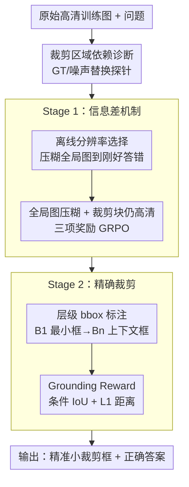

# Learning to Focus and Precise Cropping: A Reinforcement Learning Framework with Information Gaps and Grounding Loss for MLLMs

**会议**: CVPR 2026  
**论文**: [CVF Open Access](https://openaccess.thecvf.com/content/CVPR2026/html/Zhao_Learning_to_Focus_and_Precise_CroppingA_Reinforcement_Learning_Framework_with_CVPR_2026_paper.html)  
**代码**: https://github.com/XuanPu-Z/LFPC  
**领域**: 多模态VLM  
**关键词**: 多模态大模型, 智能体裁剪工具, 高分辨率VQA, 强化学习, 信息差机制

## 一句话总结
针对"会用裁剪工具但其实没真看裁剪区域"的 agentic MLLM 痼疾，本文提出一个无需轨迹监督的两阶段纯 RL 框架：第一阶段用「信息差机制」把全局图压糊、逼模型必须依赖高清裁剪块才能答对；第二阶段用层级 bbox 标注 + grounding reward 把裁剪框对准，在 HR-Bench / V\* 等高分辨率 VQA 上以 1,024 视觉 token 就超过别人用 16,384 token 的结果，且推理快 4–10 倍。

## 研究背景与动机
**领域现状**：MLLM 在细粒度感知上一单次推理常常看不清小物体/被复杂背景遮挡的目标，于是近期主流方向是给 MLLM 配一个「裁剪工具（cropping tool / zoom-in）」做成 agent——模型自己判断要不要放大某个 ROI，把高清局部喂回去再答题。训练上分两派：SFT+RL 混合（先用强 teacher MLLM 如 GPT-4o 生成带坐标的推理轨迹做监督，再 RL），以及纯 RL（只用 image-question 对，如 DeepEyes）。

**现有痛点**：SFT+RL 依赖海量 teacher 轨迹，既贵又把学生的能力上限锁死在 teacher 之下。而纯 RL 虽然绕开 teacher，却暴露出一个更隐蔽的毛病——作者通过实证分析发现模型存在"**answer first, crop later**"的行为：它往往在裁剪之前就已经预测好答案，裁剪只是走个过场来确认既有结论，并没有真正利用裁剪区域里的细节去推理。

**核心矛盾**：作者做了一个干净的诊断实验来坐实这一点（见关键设计 1）——把模型预测框替换成 ground-truth 框（"完美裁剪"）或替换成随机噪声（"无效裁剪"），结果整体准确率几乎纹丝不动（DeepEyes 尤其明显）。这说明只要全局图信息够丰富，模型就走捷径直接从全局图答题，裁剪块形同虚设。根因在于：训练时**全局图和裁剪源图分辨率一致**，裁剪块相对全局图只是"去掉了无关背景"，没提供任何新信息，模型自然学不会去依赖它。

**本文目标**：在不需要轨迹监督的前提下，强迫模型主动去裁剪区域里"找信息、用信息"，同时让裁剪框落得更准。

**核心 idea**：人为制造一道「信息差」——把喂给模型的全局图下采样压糊到"刚好不够答题但够定位"，而裁剪块仍从原始高清图抽取，于是高清裁剪块的信息变得不可或缺；再用 grounding reward 把裁剪框校准到精确位置。

## 方法详解

### 整体框架
模型沿用 agentic MLLM 的交互范式：给定全图 $I_0$ 和问题 $q$，模型可以自主输出一个 ROI 坐标，系统把该区域裁剪成 $I^{crop}$ 喂回，模型据此继续推理直到给出答案。第 $t$ 步动作可写成

$$a_t \sim \pi_\theta(a \mid I_0, q, [r_1, I^{crop}_1], \dots, [r_m, I^{crop}_m])$$

其中 $r_i$ 是文本回复、$I^{crop}_i$ 是历史裁剪块。整个训练是两阶段纯 RL（GRPO），针对的是同一个核心病灶"模型不看裁剪块"，分两步治：**Stage 1（Learn to Focus）**先用信息差机制逼模型学会"依赖裁剪块"，**Stage 2（Learn to Crop Precisely）**再用 grounding reward 教模型"把框裁准裁小"。注意两阶段都不使用任何 teacher 轨迹，只用 image-QA 对（Stage 2 额外加少量人工 bbox 标注）。

### 关键设计

**1. 裁剪区域依赖诊断：用替换探针证明"模型根本没在看裁剪块"**

这是全文动机的实证基石，也是方法立论的出发点。作者设计了两个对照设置来量化模型到底有多依赖裁剪区域：① **GT 裁剪**——把模型预测框换成标注的 ground-truth 框，得到一个"完美"的高清裁剪块；② **随机噪声裁剪**——把高清裁剪块替换成不含任何有用信息的随机噪声。逻辑很直接：如果模型真在用裁剪块，那么换 GT 框时准确率应大涨、换噪声时应大跌。结果（Table 1）显示无论 16,384 还是 1,024 token 预算下，两种替换带来的准确率变化都微乎其微（如 DeepEyes 几乎不动），证明模型在靠全局图答题、裁剪块只是摆设。这个诊断不仅暴露问题，还直接指出病因——训练时全局图与裁剪源图同分辨率，裁剪没带来增量信息，从而为"人为制造信息差"的解法铺路。

**2. 信息差机制 + 离线分辨率选择：把全局图压糊到"刚好答不出"，逼模型必须依赖高清裁剪块**

针对痛点 1 的根因，第一阶段不再把高清原图直接喂给模型，而是**下采样全局图**、但**裁剪块仍从原始全分辨率图抽取**，于是低清全局视图与高清局部视图之间出现一道"信息差"，使裁剪块成为答对的必要条件。难点在于压糊的度：压太轻，模型仍能从全局图走捷径（DeepEyes 的病）；压太狠，模型连大致区域都定位不到，问题变得无解。作者用 **Offline Resolution Selection** 来卡这个临界点——从原始高清图开始逐级下采样，每一级都用待训练的 MLLM 分别基于原图和当前压糊版本答题，一旦压糊版的答案开始与原图答案分歧，就选这一级分辨率作为该样本的"最优全局图"。这样每张训练图都被调到"刚好提供上下文定位、又刚好不足以直接答题"的甜区。每条训练数据是四元组 $(I_0, I_{ori}, q, answer)$，$I_0$ 为压糊后的最优全局图、$I_{ori}$ 为抽取裁剪块的高清原图。

奖励是三项之和：

$$r = r_{acc} + r_{format} + \mathbb{I}_{r_{acc}>0} \cdot r_{tool}$$

$r_{acc}$ 看答案是否匹配 GT，$r_{format}$ 惩罚格式不规范的输出，$r_{tool}$ 是工具使用奖励——但只有在答案**正确且**至少调用了一次感知工具时才发放（用指示函数 $\mathbb{I}_{r_{acc}>0}$ 门控），避免模型为骗工具奖励而瞎裁。优化用 GRPO：

$$A_i = \frac{r_i - \text{mean}(\{r_1,\dots,r_N\})}{\text{std}(\{r_1,\dots,r_N\})}$$

按组内归一化优势更新策略。

**3. 层级 bbox 标注 + 条件 grounding reward：治"框越裁越大"的副作用，把框裁准裁小**

信息差机制带来一个新副作用：因为全局图被压糊、只有裁剪块高清，accuracy reward 会激励模型**把预测框 $B_p$ 越裁越大**——框越大含的高清细节越多、越容易答对。但大框带来两个问题：冗余信息增加无谓计算开销；多余内容还会成为噪声干扰推理。第二阶段用直接的 grounding 监督来纠偏。

作者观察到 ROI 往往具有组合/层级结构，于是为每个问题-图像对标注一组**嵌套的 GT 框** $B_1, B_2, \dots, B_n$，从答题所需的最小区域（$B_1$，如文字"Harbinger School"）到更大的上下文区域（$B_2$，如整块招牌），给模型一个更灵活鲁棒的目标。grounding reward $r_{geo}$ 由 IoU 奖励和 L1 距离奖励组成。IoU 奖励鼓励 $B_p$ 与某个 GT 框高度重叠，但naive 地最大化 IoU 会诱使模型预测过紧的框、可能盖不全最小框 $B_1$ 而漏掉关键细节。为此引入**条件 IoU 奖励**：先算 $B_p$ 对 $B_1$ 的覆盖率 $overlap = \frac{Area(B_p \cap B_1)}{Area(B_1)}$，只有覆盖率超过阈值 $\tau=0.9$ 才发 IoU 奖励：

$$r_{IoU} = \begin{cases} \max_{i\in\{1,\dots,n\}} IoU_i & \text{if } overlap > \tau \\ 0 & \text{otherwise} \end{cases}$$

条件 IoU 在训练早期容易奖励稀疏（模型一开始很难满足覆盖条件），于是再加一个 **L1 距离奖励**提供更稠密的纠偏梯度——测预测框与最近 GT 框四角的归一化 L1 距离，即使 IoU 奖励为 0 也能给出方向：

$$r_{l1} = 1 - \min_{i\in\{1,\dots,n\}} d_{L1}(B_p, B_i)$$

最终 $r_{geo} = \omega \cdot r_{IoU} + (1-\omega) \cdot r_{l1}$。

### 损失函数 / 训练策略
骨干为 Qwen2.5-VL-7B-Instruct，8×A100、GRPO 训练 80 步，每步 256 样本、每样本 16 rollouts，最大回复长 2048，学习率 $1\times10^{-6}$，不加 KL 正则也不加 entropy。Stage 1 数据来自 Pixelreasoner（2.7k）+ CoF（2.1k）+ ThinkLite-VL，但**只用其图像和 QA 对、不用它们提供的 SFT 轨迹**；Stage 2 从 Mini-o3 的 VisualProbe 采 256 条更难的样本并人工标注精确 bbox。

## 实验关键数据

### 主实验
在 HR-Bench 8K / 4K 和 V\* 上对比，分 1,024 与 16,384 两种视觉 token 预算（裁剪块始终从原始未压缩图抽）。Trajectory-Free 表示无需 teacher 轨迹。

**1,024 token 预算（Overall）**：

| 方法 | 轨迹无关 | HR-Bench 8K | HR-Bench 4K | V\* |
|------|:--:|:--:|:--:|:--:|
| CoF-sft | ✗ | 58.9 | 66.0 | 72.8 |
| Pixel Reasoner | ✗ | 59.9 | 65.8 | 73.9 |
| Mini-o3 | ✗ | 66.0 | 70.7 | 80.1 |
| DeepEyes | ✓ | 62.0 | 63.9 | 75.9 |
| **本文** | ✓ | **72.1** | **75.3** | **80.6** |

**16,384 token 预算（Overall）**：本文 75.4 / 76.4 / 89.5，仍领先 DeepEyes（69.5 / 72.9 / 85.9）与 Mini-o3（65.6 / 69.0 / 88.0）。最亮眼的是：本文用 1,024 token 的结果（72.1 / 75.3）就已超过多数方法用 16,384 token 的结果，体现了对裁剪细节的高效利用。

### 消融实验
两阶段训练逐级增益（1,024 token，Overall Acc）：

| 配置 | HR-Bench 8K | HR-Bench 4K | V\* | 说明 |
|------|:--:|:--:|:--:|------|
| Baseline（沿用旧法） | 61.0 | 67.9 | 72.3 | 全局图与裁剪源同分辨率 |
| + Stage-I（信息差） | 69.9 | 74.4 | 78.0 | 平均 +8.9 / +6.5 / +5.7 |
| + Stage-II（grounding） | 72.1 | 75.3 | 80.6 | IoU 指标再涨约 5%–9% |

Stage 2 内部设计消融（Table 4，Overall）：

| 配置 | HR-Bench 8K | 说明 |
|------|:--:|------|
| Stage-I | 69.9 | 一阶段基线 |
| + Original Data | 68.1 | 用一阶段同源数据，反而略降（模型已几乎全答对，无增益） |
| + VP Data | 72.7 | 换更难的 VisualProbe + 条件 IoU，HR-8K +4.6（最难集） |
| + VP Data & L1 Reward | 72.1\* | 加 L1 稠密奖励，三个 benchmark 全面提升（即 Stage-II） |

裁剪依赖度（Table 5，替换裁剪块后 Acc 变化幅度，越大说明越依赖裁剪块）：Baseline 仅 4.5 / 0.5 / 3.2，Stage-I 升至 18.5 / 10.5 / 11.0，直接量化证明信息差机制让模型真正"看进了"裁剪区域。

效率（Table 6，本文 1,024 token vs 他人 16,384 token）：本文 HR-8K 72.1 Acc / 2.8s、HR-4K 75.3 / 2.6s，远快于 DeepEyes（12.4s / 9.3s）和 Mini-o3（27.8s / 21.4s），且准确率更高。

### 关键发现
- 信息差机制是核心增益来源：Stage-I 单独就把三个 benchmark 平均拉高 5.7–8.9 个点，且 Table 5 直接证明"依赖裁剪块"的程度从近乎 0 跃升。
- 第二阶段数据选择有讲究：用一阶段同源数据重训反而掉点（模型已会答），必须换更难的 VisualProbe 才有增益——印证"难样本才推得动 grounding 学习"。
- L1 奖励解决条件 IoU 早期稀疏问题：在难样本上提供稠密纠偏梯度，三 benchmark 全面超过 Stage-I。
- 优势随分辨率放大：输入图分辨率越高，本文相对其他方法领先越明显，说明它真正吃到了高清裁剪块的红利。

## 亮点与洞察
- **"答案先于裁剪"的诊断设计极干净**：GT/噪声双向替换探针把"模型有没有真用工具"这个模糊问题量化成一个可对比的 Acc delta，是任何工具增强 agent 都该做的健全性检查。
- **信息差是反直觉但精准的对症下药**：别人都在想办法把全局图喂得更清，本文反其道把全局图"故意压糊"，用信息不对称把工具从"装饰"变成"刚需"——而且用离线分辨率选择把压糊度逐样本卡到临界点，不是一刀切。
- **条件 IoU + 覆盖率门控**值得迁移：直接最大化 IoU 会鼓励过紧框漏掉小目标，"先保证覆盖最小框 $B_1$ 再奖 IoU"的门控思路适用于任何"既要准又不能漏"的定位奖励设计。
- **层级嵌套 bbox 标注**给了 grounding 一个柔性目标，避免单一 GT 框带来的过拟合，标注成本也低（仅 256 条）。

## 局限与展望
- 信息差是把双刃剑：压糊全局图会反向激励模型放大裁剪框（论文自己承认的副作用），需要 Stage 2 grounding reward 来补救，整体管线因此变成两阶段而非端到端。
- 离线分辨率选择需对每个训练样本反复用 MLLM 推理找临界分辨率，预处理开销不小，论文未量化这部分成本。
- 评测集中在 HR-Bench / V\* 这类高分辨率细粒度 VQA，是否迁移到非"小目标/高清"场景（如常规 VQA、文档理解）未验证；推理时也需要类似的"压糊全局图"设定才能复现效率优势。
- Stage 2 需要人工标注嵌套 bbox（虽仅 256 条），相比纯 RL 的"零标注"卖点有所折中。

## 相关工作与启发
- **vs DeepEyes（纯 RL）**：DeepEyes 同样无需 teacher 轨迹，但训练时全局图与裁剪源同分辨率，导致裁剪块无增量信息、模型走捷径——本文正是诊断并修复了这一点，靠信息差让裁剪块不可或缺。
- **vs Mini-o3 / Pixel Reasoner / CoF（SFT+RL）**：它们依赖 teacher MLLM 生成轨迹做监督，既贵又被 teacher 能力封顶；本文纯 RL、轨迹无关，且在 1,024 token 下就反超它们 16,384 token 的成绩。
- **vs 注意力图/区域树搜索类高分辨率 VQA 方法**：那类方法 pipeline 复杂、推理慢；本文把"该看哪"交给 RL 学到的裁剪策略，推理时间降到 2–3s/题。

## 评分
- 新颖性: ⭐⭐⭐⭐⭐ "信息差机制"反直觉地把全局图压糊来逼模型用工具，配合干净的替换探针诊断，立论扎实。
- 实验充分度: ⭐⭐⭐⭐ 三 benchmark × 两 token 预算 + 两阶段消融 + 数据选择/L1 消融 + 效率分析，较完整；但只覆盖高清细粒度 VQA 一类任务。
- 写作质量: ⭐⭐⭐⭐ 动机—诊断—解法逻辑链清晰，图表对应明确；个别公式排版与笔误（如 $IoU_i$ 定义里 $B_1$ 应为 $B_i$）需对照原文。
- 价值: ⭐⭐⭐⭐ 给"工具增强 MLLM 其实没在用工具"这一普遍隐患提供了可量化诊断 + 有效解法，且大幅提升 token 效率，实用性强。

<!-- RELATED:START -->

## 相关论文

- [\[CVPR 2026\] TempR1: Improving Temporal Understanding of MLLMs via Temporal-Aware Multi-Task Reinforcement Learning](tempr1_improving_temporal_understanding_of_mllms_via_temporal-aware_multi-task_r.md)
- [\[CVPR 2026\] Explore with Long-term Memory: A Benchmark and Multimodal LLM-based Reinforcement Learning Framework for Embodied Exploration](explore_with_long-term_memory_a_benchmark_and_multimodal_llm-based_reinforcement.md)
- [\[CVPR 2026\] MM-ReCoder: Advancing Chart-to-Code Generation with Reinforcement Learning and Self-Correction](mm-recoder_advancing_chart-to-code_generation_with_reinforcement_learning_and_se.md)
- [\[CVPR 2026\] Information-Theoretic Decomposition for Multimodal Interaction Learning](information-theoretic_decomposition_for_multimodal_interaction_learning.md)
- [\[CVPR 2026\] SenseSearch: Empowering Vision-Language Models with High-Resolution Agentic Search-Reasoning via Reinforcement Learning](sensesearch_empowering_vision-language_models_with_high-resolution_agentic_searc.md)

<!-- RELATED:END -->
