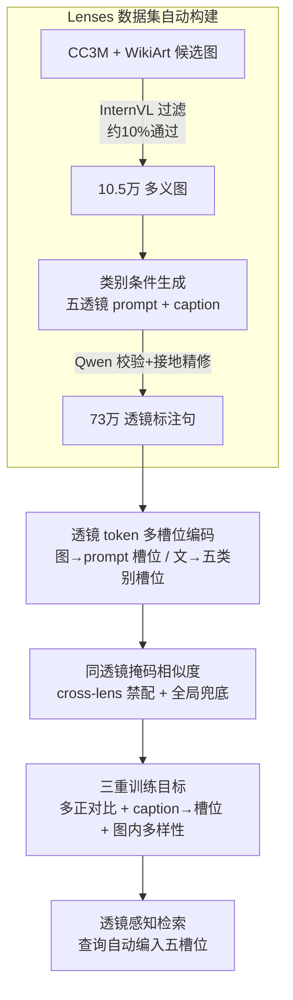

# Lenses: Toward Polysemous Vision-Language Understanding

**会议**: CVPR 2026  
**论文**: [CVF Open Access](https://openaccess.thecvf.com/content/CVPR2026/html/Alomari_Lenses_Toward_Polysemous_Vision-Language_Understanding_CVPR_2026_paper.html)  
**代码**: 无  
**领域**: 多模态VLM  
**关键词**: 一图多义检索, 跨模态检索, lens 槽位嵌入, 非字面语义, 多正样本对比学习

## 一句话总结
针对"一张图只有一种字面含义"的主流假设，本文构建了带五种"解读透镜"（字面 / 比喻 / 抽象 / 背景 / 情感）标注的 10.5 万图—73 万句数据集 Lenses，并让多模态大模型为每张图和每句话各吐出一组按透镜对齐的槽位嵌入、用"只允许同透镜相互匹配"的相似度做检索，在字面与非字面检索上同时大幅超过 CLIP / BLIP-2 / BGE-VL 等基线。

## 研究背景与动机
**领域现状**：跨模态检索的主流是双编码器 + 对比学习（CLIP、BLIP-2、BGE-VL 这类），把一张图和一句话各压成**一个全局向量**，再算余弦相似度。这套范式在 COCO / Flickr30K 这种"一图一字面描述"的语料上工作得非常好，也极易扩展到大批量训练。

**现有痛点**：但图像天生是"一图多义"的——一张烂苹果混在好苹果里的图，可以字面地说"腐烂的水果"，也可以用习语"一颗老鼠屎坏了一锅粥"做比喻解读，还能从情感、背景、抽象主题等角度描述。把这些异质含义全压进一个向量，会让所有解读互相平均、彼此污染，面对带多重解读的查询时系统很脆。已有的多嵌入方法（PVSE、PCME、SetDiv、MaxMatch）虽然给每个样本学多个嵌入，但**最后又把它们重新聚合回一个全局相似度**，多出来的嵌入只是"通用语义容量"，并没有被绑定到某种明确的解读维度；而且它们的训练数据本身就是"措辞不同、含义相同"的字面描述，根本没有真正多义的监督信号。

**核心矛盾**：图—文匹配本质是**多对多、非字面**的对齐，但现有的数据、相似度函数、评测指标全都建立在"单义、字面、一图一对"的假设上，导致模型过拟合字面细节、严重欠表达多样含义。

**本文目标**：(1) 造一个显式标注多种解读维度的数据集；(2) 设计一个能为图/文各产出"按维度区分"的多嵌入、并且这些嵌入不会塌缩成一团的模型；(3) 给出能反映"人怎么按维度匹配图文"的评测协议。

**切入角度**：把"一张图可以有多种含义"显式地建模成**五个固定的解读透镜（lens）**——字面（Literal）、比喻（Figurative）、抽象（Abstract）、背景（Background）、情感（Emotional），让每个透镜对应一个独立的嵌入槽位，并在相似度计算时**强制只允许同透镜的槽位互相匹配**。

**核心 idea**：用"透镜专属 token → 多槽位嵌入 + 同透镜掩码相似度（带全局兜底）"代替"单一全局向量 + 全局余弦"，把多对多的非字面对齐显式拆解到五个互不串味的解读维度上。

## 方法详解

### 整体框架
整个工作分两大块：**先用大模型自动造一个带透镜标注的数据集 Lenses，再训一个能产出透镜对齐槽位嵌入的检索模型**。

数据集侧：从 CC3M（日常场景）和 WikiArt（艺术作品）取候选图，用冻结的 InternVL3.5-38B 过滤出"支持非字面 / 背景解读"的图（约 10% 通过，得到 10.5 万张），再让它为每张图按五个透镜生成多条**图侧 prompt**（短的解读线索短语）和**caption**（用于检索的描述句），最后用 Qwen2.5-32B-Instruct 做二次校验（视觉接地 + 透镜保真），不合格的改写或丢弃，测试集额外再过一遍接地校验。

模型侧：以 BGE-VL-MLLM（底座是 LLaVA-1.6 Mistral-7B）为骨干。给图配上它的若干图侧 prompt，每条 prompt 后接一个学到的特殊 token `<PROMPT>`，模型一次前向就为每条 prompt 吐一个**视觉槽位嵌入**；给文本则在 caption 后接五个透镜类别 token，吐出五个**文本槽位嵌入**（但只有与该 caption 标注透镜一致的那个槽位被激活，其余四个掩掉）。检索时用**同透镜掩码的 smooth-Chamfer 相似度**比两组槽位，遇到没有任何同透镜重叠的图文对就退回全局嵌入余弦。训练用三个损失：多正样本对比、caption→槽位对齐、图内槽位多样性。推理时用户只给一句文本查询、不需要给透镜标签，模型自动把查询编进五个槽位再做掩码检索。

### 关键设计

**1. 五透镜数据集 Lenses：把"一图多义"做成可监督的标注**

主流多义检索方法没法学好，根上是没有真正多义的监督数据——COCO/Flickr 的多条 caption 只是换措辞、说同一批显著物体。本文用三阶段全自动流水线把这个缺口补上：① **图池构建**——从 CC3M 和 WikiArt 取候选（兼顾日常场景与天然多义的艺术图），用冻结 InternVL3.5-38B 做二分类"这张图是否支持非字面 / 背景解读"，约 10% 通过得到 10.5 万张，并用感知哈希 + CLIP 空间聚类去重；② **类别条件生成**——把大 VLM 当结构化标注器，按五个透镜分别生成 caption，强制三条约束（视觉接地 / 透镜保真，如比喻类必须用习语隐喻、情感类必须用情绪语言 / 风格适合检索），非字面透镜还给一份习语隐喻短语库但要求借用的表达仍要被画面支持；同时生成图侧 prompt（聚焦某个视觉元素的单透镜线索短语，变换句式、用 n-gram 去重避免近义复述）；③ **校验精修**——Qwen2.5-32B-Instruct 校验每条 caption / prompt 的形式、类别对齐与透镜保真，不合格改写或丢弃，测试集再用 InternVL 做一次纯接地校验。最终 10.5 万图 / 73.2 万句，五个透镜在各 split 大致均衡。这套"过滤→生成→校验"把昂贵的人工多视角标注替换成可扩展的大模型标注，且用两个不同模型分别负责生成和验证来压低噪声。

**2. 透镜 token 多槽位嵌入：让一次前向吐出按维度区分的一组向量**

要表达多义，就不能再把图/文压成单一全局向量。本文给图和文都引入**学到的特殊 token**让 MLLM 吐多个槽位。图侧：输入格式为 `⟨instruct⟩{任务指令} ⟨image⟩ {q^V_z} [EOS]`，其中每个查询 $q^V_z = p_z\,\texttt{<PROMPT>}$ 把第 $z$ 条图侧 prompt $p_z$（透镜标签 $c_z$）接上一个 tokenizer 里新加的 `<PROMPT>` token，取它的末层隐状态作为该 prompt 的视觉槽位嵌入；所有 prompt 在**一次前向**里并行处理，因此这组槽位天然共享同一检索空间又各自编码异质语义。文本侧：caption 后接五个透镜类别 token `<L><F><A><B><E>`，取这五个位置的隐状态构成文本槽位集，但用二值掩码 $m^T(t_k)$ 只把**与该 caption 标注透镜 $c_k$ 一致**的那一个槽位置为激活，其余四个在所有损失里掩掉——这样 MLLM 能把完整透镜词表当上下文看到，但监督只从被标注的那个透镜流过去，防止串味。每个样本因此同时暴露一个"全局向量 $g^V/g^T$"（取最后一个 token）和一组透镜对齐的槽位嵌入 $E^V(I), E^T(t_k)$。

**3. 同透镜掩码相似度 + 全局兜底：禁止跨透镜匹配的 set-to-set 打分**

有了两组槽位，单个全局余弦不够表达，而经典集合相似度各有毛病：MIL（PVSE）只留最佳一对、其余槽位失监督；全平均（PCME）监督密但会把所有槽位推到重叠、集合塌缩；SetDiv 让每个元素拉每个元素、跨透镜平均导致漂向单一模式。本文的相似度**显式禁止跨透镜匹配**——图侧比喻 prompt 只能和文侧比喻槽位配，依此类推。先算归一化后的槽—槽余弦矩阵 $S_{b,n}=V_b T_n^\top$，再用掩码

$$B_{b,n}(i,j)=\mathbb{1}[\,m^V_{b,i}=1,\ m^T_{n,j}=1,\ \ell^V_{b,i}=\ell^T_{n,j}\,]$$

把"不同透镜或非激活槽位"的位置置为 $-\infty$，然后对保留下来的项做 smooth-Chamfer 相似度（$\alpha>0$ 控制 max 的平滑度）：

$$s(I_b,t_n)=\frac{1}{2\alpha Z_{I_b}}\sum_i \log\!\sum_j e^{\alpha S_{b,n}(i,j)}+\frac{1}{2\alpha Z_{t_n}}\sum_j \log\!\sum_i e^{\alpha S_{b,n}(i,j)}.$$

当一对图文**没有任何同透镜重叠**（$B$ 全零）时退回全局嵌入余弦 $\langle g^V(I_b), g^T(t_n)\rangle$。这样既保证维度不串味，又不会因为偶尔缺透镜重叠而丢掉这对样本的信号。

**4. 三重训练目标：在"对齐对"之外额外约束"用对透镜"与"槽位不塌缩"**

只有对比损失是不够的：它只保证正确图文对比错配对更近，但一张图有多个透镜槽位时监督欠约束——一个比喻 caption 完全可以走该图的字面槽位被解释、还不挨罚。于是本文叠三个损失。(a) **多正样本对比** $L_{ret}=L_{i\to t}+L_{t\to i}$，用 InfoNCE 但把同一图的多条正 caption 都当正例平均（而非互为负例）。(b) **caption→槽位对齐** $L_{cap\to slot}$：在有同透镜视觉槽位的图文对上，强制每条 caption 在所有激活视觉槽位中**优先选与自己透镜一致的槽位**（用 softmax over 槽位余弦），把"这条 caption 该走哪个槽位"钉死。(c) **图内槽位多样性** $L_{div\text{-}img}$：对同一图的激活视觉槽位两两算余弦 $\gamma_b(i,j)$，用 hinge $\max(0,\gamma_b(i,j)-\alpha)$ 惩罚过近，防止稀有透镜（如比喻）的槽位漂向占主导的字面槽位、导致塌缩。总损失 $L_{total}=L_{ret}+\lambda_{slot}L_{cap\to slot}+\lambda_{div}L_{div\text{-}img}$。三者分别管"对齐 / 用对透镜 / 不塌缩"，缺一个都会让多槽位退化成换皮的单嵌入。

### 损失函数 / 训练策略
从 BGE-VL LLaVA-Next-1.6 Mistral-7B 微调，tokenizer 扩入一个 `<PROMPT>` token 和五个透镜 token。`<PROMPT>` 和透镜 token 位置的隐状态作槽位嵌入、最后一个 token 作全局嵌入。训练用上面 $L_{total}$；推理时用户只给文本查询、不需透镜标签，查询被编进全部五个透镜槽位，再走同透镜掩码相似度 + 全局兜底完成检索。

## 实验关键数据

### 主实验
在 Lenses 测试集上按五个透镜分解报告 Recall@1/@5（I→T 和 T→I）。下表取 All（不分透镜，综合）与两个代表性非字面透镜的 I→T R@1：

| 模型 | All I→T R@1 | All T→I R@1 | Figurative I→T R@1 | Emotional I→T R@1 |
|------|-------------|-------------|--------------------|--------------------|
| BLIP-2（零样本） | 12.63 | 9.32 | 13.80 | 12.63 |
| CLIP（零样本） | 13.52 | 10.98 | 18.73 | 13.52 |
| BGE-VL-MLLM（零样本） | 70.67 | 36.68 | 28.17 | 14.75 |
| BGE-VL-MLLM（在 Lenses 微调） | 80.89 | 53.88 | 47.52 | 33.80 |
| **Lenses（本文）** | **89.09** | **58.87** | **56.02** | **40.35** |

要点：零样本 VLM 只在字面 caption 上还行，非字面透镜（比喻 / 情感 / 抽象 / 背景）骤降；单纯在 Lenses 上微调 BGE-VL-MLLM 已能把 All I→T R@1 从 70.67 抬到 80.89；本文完整模型再跳到 89.09，且**非字面透镜涨幅最大**——比喻 I→T R@1 相对最强零样本基线约翻倍，情感 / 背景检索绝对提升 15+ 分，同时不牺牲字面对齐。在 ArtEmis（人写情感 caption）上同样：本文 17.32/13.51 R@1 明显优于零样本最佳 SigLIP-2 的 5.52/4.84。

### 消融实验

| 配置 | RSUM (All) | 说明 |
|------|-----------|------|
| 仅 $L_{ret}$ | 502.7 | 只有多正对比 |
| + $L_{cap\to slot}$ | 510.6 | 加 caption→槽位对齐 |
| + $L_{div\text{-}img}$ | 513.3 | 再加图内多样性（完整模型） |

补充的透镜感知指标（5500 图，下表 @10）：

| 模型 | LensCoverage@10 | AllLenses@10 | Lens DCG@10 | Caption DCG@10 |
|------|-----------------|--------------|-------------|----------------|
| BGE-VL-MLLM | 48.2 | 8.2 | 50.5 | 45.0 |
| BGE-VL-MLLM（微调） | 66.5 | 21.4 | 65.8 | 60.0 |
| **Lenses** | **76.8** | **36.8** | **75.6** | **70.2** |

### 关键发现
- **两个正则都有正贡献且方向不同**：$L_{cap\to slot}$（用对透镜）把 RSUM 从 502.7 抬到 510.6，$L_{div\text{-}img}$（防塌缩）再到 513.3——证明只靠对比损失，多槽位会退化。
- **图像确实重要、不能只靠 prompt 文本**：纯文本 prompt↔caption 检索只有 P→C 34.13 / C→P 32.73 R@1，远低于带图检索的 All R@1>80；说明把槽位绑到"接地的视觉透镜"才是性能来源，而非 prompt 本身的语义。
- **增益不是来自更大的 InternVL 骨干**：固定检索结构、只换生成 prompt 的 InternVL3.5（4B→14B），宏观 R@K 仅动 0.5~1 分；而引入 lens prompt + 槽位掩码相似度的 38B 变体把 R@1 提到 48.30/45.40（涨 3~4 分）——增益来自透镜感知的提示与槽位目标本身。
- **覆盖度指标揭示塌缩**：本文 AllLenses@10 达 36.8（一张图全部标注透镜都进 top-10 的比例），远高于微调基线的 21.4，说明它真的把图的多种解读都检回来了，而不是只命中字面那一种。

## 亮点与洞察
- **把"图像多义"从抽象观察落成可监督的五个固定透镜**：与其让多嵌入"自由发挥语义多样性"，不如给每个槽位钉一个明确语义维度（字面/比喻/抽象/背景/情感），可解释、可分透镜评测、训练信号也更干净。
- **"同透镜禁配 + 全局兜底"是巧妙的折中**：硬禁跨透镜匹配保证维度不串味，全局兜底又避免"偶尔没有同透镜重叠就丢样本"——比 MIL（丢监督）和全平均（塌缩）都稳。
- **用两个不同大模型分工生成与校验**：InternVL 生成、Qwen 验证，再加测试集二次接地校验，是一套低成本造高质量多视角标注的可复用范式。
- **可迁移**：这套"特殊 token 让 MLLM 一次前向吐多个语义对齐槽位 + 类别掩码相似度"的思路，可迁到任何"一个输入对多个语义面"的检索/匹配（如多意图查询、多属性商品检索）。

## 局限与展望
- **五个透镜是固定且人为预设的**：现实里"解读维度"可能更多/更细或领域相关，固定五类可能既冗余又不够，作者未讨论可扩展到开放透镜集。
- **标注全靠大模型自动生成**：尽管有二次校验，比喻/抽象这类主观透镜的"保真"判定本身依赖模型偏好，可能引入系统性偏差；人工验证只在小规模分层子集上做。
- **数据来源偏艺术 + CC3M**：WikiArt 占比让数据天然偏"适合多义解读"的图，能否泛化到普通照片域（如电商、监控）未验证。
- **推理需为每条 caption 暴露五个透镜槽位**：相比单向量检索，槽位集的存储与 set-to-set 打分成本更高，论文未给检索效率/索引规模的开销分析。

## 相关工作与启发
- **vs CLIP / BLIP-2 / BGE-VL（单全局向量双编码器）**：它们把图/文压成一个向量、对比学习，字面检索很强但把多义压平；本文为每个透镜留独立槽位 + 同透镜掩码相似度，在非字面检索上大幅领先且不掉字面。
- **vs PVSE / PCME / SetDiv / MaxMatch（多嵌入）**：它们也学多个嵌入，但训练/推理时又聚合回单一全局分（MIL 只留最佳对、全平均会塌缩），且多嵌入只是"通用语义容量"没有绑定明确维度；本文把每个槽位绑到一个解读透镜，并用 caption→槽位对齐 + 图内多样性显式防塌缩。
- **vs ColBERT / 后交互检索（多向量 token 匹配）**：后交互保留 token 级粒度但匹配是"细粒度局部对齐"而非"语义维度对齐"；本文的槽位是语义透镜级、且强制同维度匹配，目标是多义而非局部细节。
- **评测启发**：指出标准 Recall@k 隐含"每查询一个正确项"假设，对多义场景失真，提出 Lens-Specific Slot Retrieval 与 LensCoverage / AllLenses / Lens-DCG 等透镜感知指标——这套"按语义维度评检索覆盖度"的思路本身有借鉴价值。

## 评分
- 新颖性: ⭐⭐⭐⭐⭐ 把"一图多义"显式建成五透镜槽位 + 同透镜掩码相似度，重定向了多嵌入检索范式，并配套造了数据集与评测指标。
- 实验充分度: ⭐⭐⭐⭐ 分透镜主表 + 损失消融 + 纯文本对照 + 骨干规模对照 + 透镜覆盖度指标，相当完整；缺检索效率/开销分析。
- 写作质量: ⭐⭐⭐⭐ 动机—方法—评测一条线清晰，公式与符号交代到位。
- 价值: ⭐⭐⭐⭐ 数据集 + 模型 + 评测协议三件套，对非字面 / 情感 / 比喻类跨模态检索有直接推动。

<!-- RELATED:START -->

## 相关论文

- [\[CVPR 2026\] Understanding Counting Mechanisms in Large Language and Vision-Language Models](understanding_counting_mechanisms_in_large_language_and_vision-language_models.md)
- [\[CVPR 2026\] Understanding Task Transfer in Vision-Language Models](understanding_task_transfer_in_vision-language_models.md)
- [\[CVPR 2026\] UVU: Improving Multimodal Understanding via Vision-Language Unified Autoregressive Paradigm](uvu_improving_multimodal_understanding_via_vision-language_unified_autoregressiv.md)
- [\[CVPR 2026\] RE-VLM: Event-Augmented Vision-Language Model for Scene Understanding](re-vlm_event-augmented_vision-language_model_for_scene_understanding.md)
- [\[CVPR 2026\] HiSpatial: Taming Hierarchical 3D Spatial Understanding in Vision-Language Models](hispatial_taming_hierarchical_3d_spatial_understanding_in_vision-language_models.md)

<!-- RELATED:END -->
