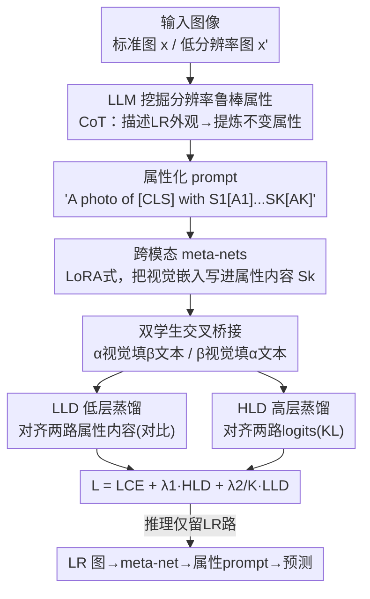

# LOREAL: Mitigating Low-Resolution Challenges in Vision-Language Models with Attribute-driven Prompt Self-Distillation

**会议**: CVPR 2026  
**论文**: [CVF Open Access](https://openaccess.thecvf.com/content/CVPR2026/html/Wang_LOREAL_Mitigating_Low-Resolution_Challenges_in_Vision-Language_Models_with_Attribute-driven_Prompt_CVPR_2026_paper.html)  
**代码**: [项目页](https://xuc865.github.io/loreal/index.html)  
**领域**: 多模态VLM  
**关键词**: 提示学习, 低分辨率鲁棒性, 自蒸馏, 属性引导, CLIP  

## 一句话总结
针对 VLM 在边缘端被迫吃低分辨率输入时性能骤降的现实问题，LOREAL 用 LLM 挖掘"分辨率鲁棒的语义属性"来填充 prompt，并搭一个"标准分辨率学生 + 低分辨率学生"互蒸馏的框架，只训练少量 meta-net 就让 CoOp/MaPLe/MMA/MMRL 等主流方法在低分辨率下的调和均值显著回升（最高 +19.95%）。

## 研究背景与动机
**领域现状**：把 CLIP 这类 VLM 适配到下游任务，主流走的是参数高效微调里的提示学习（Prompt Learning, PL）——冻结整个预训练骨干，只在文本/视觉编码器里插入少量可学习 prompt token。从 CoOp 到 MaPLe、MMA、MMRL，这条线一路演进，参数量极小、兼容性强。

**现有痛点**：几乎所有 PL 方法都在精心整理过的标准数据集上设计和评测，默认输入分辨率固定为 224×224。但这跟边缘部署的真实场景矛盾：手机/IoT 设备受存储和显存约束，往往只能处理低分辨率图像并相应生成更少的视觉 token（位置编码被 resize 插值）。作者把这个被忽视的设定命名为**低分辨率（Low-Resolution, LR）设定**。

**核心矛盾**：LR 设定有充分的现实合理性——低分辨率图像的采集/传输/存储开销比标准分辨率低近一个数量级，而视觉编码器复杂度随 token 数多项式增长，减 token 能省下可观显存。作者实测：降低分辨率 φ 最多带来 62% 显存节省、64% 推理提速。可代价是性能：当 φ 砍到约一半时，所有现有 SOTA 的准确率断崖式下跌，因为判别性视觉特征被模糊抹平。"省资源"和"保精度"在 LR 下直接对立。

**本文目标**：让 VLM 的 prompt learning 在分辨率漂移下保持鲁棒，且不能牺牲 PL 的参数高效性。

**切入角度**：低分辨率会让类间区分变模糊，但作者观察到——不是所有视觉属性都同等脆弱。宏观属性（毛色、体型、车窗、屋顶线）在分辨率下降时仍可感知，而细微属性（纹理、眼睛颜色、车标）很快丢失。如果能引导模型把注意力聚焦到那批"分辨率鲁棒"的属性上，就有希望抗住模糊。

**核心 idea**：用 LLM 自动挖掘出在分辨率变化下仍显著的鲁棒属性，把它们结构化地塞进 prompt，再让一个吃标准图、一个吃低分辨率图的双学生通过共享 meta-net 互相蒸馏，逼模型在两种分辨率间对齐语义——即"用属性引导 + 跨分辨率自蒸馏"换取 LR 鲁棒性。

## 方法详解

### 整体框架
LOREAL（LOw-REsolution Attribute-guided prompt Learning）是一套 prompt 自蒸馏框架，整条流水线分三步：**离线用 LLM 生成鲁棒属性 → 用 meta-net 把视觉特征动态写进属性 prompt → 双学生跨分辨率互蒸馏训练**。它不重训骨干，唯一可学习的只有 K 个 meta-net，所以可以直接挂到 CoOp/MaPLe/MMA/MMRL 等已有 PL 方法上当增益插件。

训练时有两个共享 meta-net 的学生 VLM：学生 α 吃标准分辨率图 $x$，学生 β 吃低分辨率图 $x'$，骨干全冻结。关键在于两个学生的 meta-net 被"交叉桥接"——α 的视觉嵌入去填 β 的文本 prompt，β 的视觉嵌入去填 α 的文本 prompt，从而强迫不同分辨率的视觉信息生成相互一致的属性语境。在此之上叠两层蒸馏：低层蒸馏（LLD）对齐两路生成的属性内容，高层蒸馏（HLD）对齐两路的输出 logits。推理时只留低分辨率那一路：LR 图过 meta-net 生成属性内容、填进 prompt、算与各类别文本特征的余弦相似度出预测。

### 关键设计

**1. LLM 挖掘分辨率鲁棒属性：让 prompt 只盯住模糊时还看得见的特征**

LR 的根本麻烦是判别性特征被抹糊，所以 LOREAL 不去硬学全部属性，而是先用 LLM 通过显式思维链（CoT）筛出一批"分辨率不变"的属性。具体两步走：先让 LLM 描述每个类别在低分辨率照片里大致长什么样（"低分辨率下 Abyssinian 呈现为光滑的暖棕色……"），再以这些描述为上下文，让 LLM 总结出几个在分辨率变化下仍可感知的通用属性。这一步天然偏好宏观属性（OxfordPets 的毛色/体型、StanfordCars 的车窗/屋顶线），过滤掉纹理、眼睛颜色、车标这类一糊就没的细节。作者强调：宏观和细微属性在标准分辨率下都算"通用"，本文的洞察是只挑出其中在 LR 下仍保持显著的那个子集。拿到原始属性 $\{A_k\}_{k=1}^K$ 后，构造语境化 prompt：

$$\text{A photo of a [CLS] with } S_1 [A_1]\, S_2 [A_2] \cdots S_K [A_K]$$

其中 $S_i \in \mathbb{R}^{M\times D_t}$ 是每个属性对应的可学习 token（$M$ 为每属性 token 数）。属性顺序对性能影响很小，故不特意安排。这把"哪些特征值得关注"从盲目可学习 prompt 升级为有语义先验、且专挑抗模糊的内容。

**2. 跨模态 meta-nets：用视觉特征动态把 prompt 写活，而非学一套静态 prompt**

光有静态属性槽还不够——同一类别不同图像该激活的属性强度不同。LOREAL 给每个属性配一个独立 meta-net $\{M_k\}_{k=1}^K$，把输出视觉嵌入 $f_v$ 动态转成对应属性内容：

$$S_k = M_k(f_v) = W_{\uparrow,k}\big(W_{\downarrow,k}(f_v)\big)$$

其中 $W_{\downarrow,k}\in\mathbb{R}^{D_v\times D_s}$、$W_{\uparrow,k}\in\mathbb{R}^{D_s\times D_t}$ 是 LoRA 式的降维-升维投影矩阵，$D_s$ 是中间维度（消融定为 32）。这是一个 LoRA-like 的轻量结构，参数极少（全模型仅 +104.5K 可训练参数）。它的作用是把视觉语义"灌进"文本侧的属性 prompt，让文本特征以图像为条件，相当于在文本 prompt 上做了图像引导的实例级语境化。也正是这条桥让后面的跨分辨率蒸馏成为可能。

**3. 双学生交叉桥接的自蒸馏架构：逼不同分辨率生成一致的属性语境**

单纯微调属性 prompt 还不行，因为推理时模型只见低分辨率图。LOREAL 引入两个骨干全冻、只 meta-net 可学的学生 $\{E^\alpha_t, E^\alpha_v\}$ 和 $\{E^\beta_t, E^\beta_v\}$，分别吃标准图和低分辨率图，且**共享同一组 meta-net**。精髓是交叉桥接——一路的视觉嵌入去生成另一路的文本属性：

$$f^\alpha_v = E^\alpha_v(x),\quad f^\beta_t = E^\beta_t\big(p(S(f^\alpha_v))\big)$$
$$f^\beta_v = E^\beta_v(x'),\quad f^\alpha_t = E^\alpha_t\big(p(S(f^\beta_v))\big)$$

即标准分辨率的视觉特征要去支撑低分辨率学生的文本 prompt，反之亦然。这种"自己当自己老师、两路互教"的自蒸馏，强迫共享 meta-net 学会从任意分辨率的视觉输入都生成可互换、可对齐的属性内容，从而在多模态流形空间里把两种分辨率的语义逐步拉到一起。和经典 KD（学生全调）或 PromptKD（靠缓存教师 logits）不同，LOREAL 不需要外部大教师，两个学生就是同一个模型的不同分辨率视图。

**4. LLD + HLD 双层蒸馏：从属性内容和最终预测两个层级对齐跨分辨率语义**

交叉桥接只是搭好了"互相填 prompt"的通道，真正把两路拉齐靠两个蒸馏损失。**低层蒸馏 LLD** 在两路生成的属性内容 $S(f^\alpha_v)$ 与 $S(f^\beta_v)$ 之间做对比学习，让同一属性在不同分辨率下生成相近的内容、不同属性之间区分开：

$$L_{LLD} = -\sum_{k=1}^{K}\log\frac{\exp\big(\mathrm{Sim}(S_k(f^\alpha_v), S_k(f^\beta_v))/\tau\big)}{\sum_{k'}\exp\big(\mathrm{Sim}(S_k(f^\alpha_v), S_{k'}(f^\beta_v))/\tau\big)}$$

**高层蒸馏 HLD** 则在两路的类别预测 $\hat y^\alpha, \hat y^\beta$ 之间做 KL 散度对齐：

$$L_{HLD} = \sum_{c=1}^{C}\big(\hat y^\alpha_c\log\hat y^\alpha_c - \hat y^\alpha_c\log\hat y^\beta_c\big)$$

总损失把任务交叉熵 $L_{CE}=-\sum_c y_c\log\hat y^\beta_c$（在低分辨率学生上算）与两个蒸馏项加权融合：$L = L_{CE} + \lambda_1 L_{HLD} + \lambda_2\cdot\frac{1}{K}\cdot L_{LLD}$。消融显示 LLD 比 HLD 贡献更大，因为属性级的直接对齐比 logit 级对齐更易优化——这也解释了为何最优 $\lambda_2$ 取得比 $\lambda_1$ 更高。

### 损失函数 / 训练策略
骨干用预训练 CLIP-ViT-B/16，全程冻结，仅 meta-net 可学。SGD 优化器，学习率 0.002，全部 16-shot（每类 16 样本）。超参：meta-net 中间维 $D_s=32$、每属性 token 数 $M=2$、$\lambda_1=1$、$\lambda_2=2$、$\tau=4$（注意 preliminary 里 softmax 温度记为 $\tau=1$，蒸馏温度 $\tau=4$）。LLM 用 GPT-4o，每类生成 5 个属性。与无法分离视觉/文本嵌入的方法（如 MaPLe/MMRL）结合时，先离线存好它们的视觉嵌入再做蒸馏。训练 epoch 与分辨率 φ 对每个 baseline 各自设定。

## 实验关键数据

三个新基准均在 16-shot、CLIP-ViT-B/16 下评测，把 LOREAL 作为插件挂到 CoOp/MaPLe/MMA/MMRL 上，分辨率设 $\varphi\in\{96^2,144^2,192^2\}$。

### 主实验

LR-B2N（低分辨率 Base-to-New，11 数据集，$\varphi=96^2$ 下的平均调和均值 HM）：

| 方法 | Base | Novel | HM | +LOREAL HM | 提升 |
|------|------|-------|-----|-----------|------|
| CoOp | 38.40 | 33.74 | 35.54 | 47.48 | +11.94 |
| MaPLe | 37.17 | 33.71 | 34.85 | 57.25 | +22.40 |
| MMA | 41.55 | 39.91 | 40.50 | 63.14 | +22.64 |
| MMRL | 41.64 | 36.92 | 38.90 | 61.71 | +22.81 |

跨数据集（LR-CE）与域泛化（LR-DG）同样一致提升：LR-CE 在源域 ImageNet 上三个 φ 各 +21.0% / +6.58% / +2.54%；LR-DG 在 $\varphi=96^2$ 下四个 ImageNet 变体平均 +12.71%。规律是 **φ 越低、增益越大**——正好对应最难、最贴近边缘部署的场景。

效率（Table 4，$\varphi=96^2$）：挂载 LOREAL 仅新增 +104.5K 可训练参数、训练 +4~5ms/样本、推理 +1ms、显存 +33MB，却把 MaPLe 的 HM 从 34.85 拉到 57.25、MMRL 从 38.90 拉到 61.71，几乎零成本换大幅增益。

### 消融实验（Table 6，分模块；HM）

| 配置 | Base | New | HM | 说明 |
|------|------|-----|-----|------|
| 仅 LR→St. | 75.45 | 63.42 | 68.91 | 只用 LR 嵌入填标准学生 prompt |
| 仅 St.→LR | 74.78 | 62.46 | 68.07 | 只用标准嵌入填 LR 学生，比上者低 0.84% |
| 双向 + 缺一层蒸馏 | 75.70 / 76.10 | 64.72 / 66.35 | 69.78 / 70.89 | 去掉 LLD 或 HLD 均明显掉点 |
| Full（双向+LLD+HLD） | 77.30 | 67.37 | 71.73 | 完整模型 |

其它超参消融：$D_s$ 最优 32（过大反而优化变难）、蒸馏温度 $\tau$ 最优 4（过小过大都会过锐/过平）、属性 token 数 $M$ 增大反而轻微掉点（~2%）故定 2、$\lambda_1/\lambda_2$ 网格搜索后定 1/2。

### 关键发现
- **LLD 比 HLD 重要**：去掉 LLD 掉得比去掉 HLD 多，因为属性级直接对齐比 logit 级对齐更易优化，这也是 $\lambda_2>\lambda_1$ 的原因。
- **训练侧让 LR 输入对齐更关键**：LR→St. 比 St.→LR 略好 0.84% HM，说明训练时把"为 LR 输入做图文对齐"做扎实，更利于 LR 推理泛化。
- **φ 越低、收益越大**：低分辨率正是现有方法崩得最惨、也是 LOREAL 修复最显著的区间，印证了属性级鲁棒先验的价值。
- 可视化（Figure 6）显示，加 LOREAL 后注意力热图在分辨率下降时仍能稳定聚焦到鲁棒属性区域，且学到的属性 token 能对应到"毛色/短腿/丝滑"等可解释语义。

## 亮点与洞察
- **重新定义了一个被忽视的现实问题**：把"边缘端低分辨率推理"显式形式化为 LR 设定，并量化了它带来的显存/速度收益（最高省 62% 显存、提速 64%）与精度代价，是一个干净的 problem framing。
- **属性筛选的洞察很巧**：不是"挖属性"新，而是"只挖分辨率鲁棒的属性子集"——用 LLM 的 CoT 显式区分宏观（抗糊）和细微（易丢）属性，把先验注进 prompt，针对性极强。
- **自蒸馏不需要外部大教师**：用同一模型的标准/低分辨率两个视图互当老师，配合共享+交叉桥接的 meta-net，把跨分辨率对齐变成自监督式约束，比依赖缓存教师 logits 的 PromptKD 更轻、更自洽。
- **插件式增益、近零成本**：仅 +104.5K 参数就能给四个主流 PL 方法普遍涨点，这种"可挂载"的设计在工程落地上很有迁移价值——任何 prompt learning 方法理论上都能接。

## 局限与展望
- 属性生成依赖 GPT-4o 的离线调用，属性质量和类别名强相关，对开放词表/类名含糊的任务（属性难以被 LLM 准确描述）效果未验证。
- 实验全在 CLIP-ViT-B/16、16-shot 下，未报告更大骨干或全量数据下增益是否仍这么大；分辨率只覆盖 $96^2\sim192^2$，更极端的超低分辨率（如 $48^2$，仅在可视化里出现）缺定量结果。
- 训练需同时跑两个学生前向，虽然推理只留一路，但训练显存/时间相对单学生 PL 仍有翻倍量级开销，论文用"+ms"口径淡化了这点。
- 改进方向：把属性挖掘从"离线一次性"换成可随数据自适应更新；探索属性间结构关系（当前明确说顺序无关），或对 LR 下仍会丢的属性做不确定性加权。

## 相关工作与启发
- **vs CoOp / MaPLe / MMA / MMRL**：它们都是固定 224×224 的标准分辨率 prompt learning，本文不替代而是作为插件挂在它们之上，专门补 LR 鲁棒性这块短板。
- **vs PromptKD**：PromptKD 用 prompt 从一个外部大教师蒸馏，面向非 LR 推理；LOREAL 不需要外部教师，用同模型的双分辨率视图自蒸馏，且目标是抗分辨率漂移。
- **vs 低分辨率识别（ResFormer / MSPE / PixelDistillation）**：这些工作主要靠设计灵活的位置编码或蒸馏小卷积模型来适配 LR，集中在视觉骨干侧；LOREAL 首次把 LR 挑战放到 VLM 的 prompt learning 框架里解决，走的是属性引导 + 跨模态自蒸馏的路线。

## 评分
- 新颖性: ⭐⭐⭐⭐ 首次把低分辨率边缘部署形式化进 VLM prompt learning，属性鲁棒子集 + 双学生自蒸馏组合新颖
- 实验充分度: ⭐⭐⭐⭐ 三基准 × 四 baseline × 三分辨率 + 完整模块/超参消融，但骨干和 shot 数较单一
- 写作质量: ⭐⭐⭐⭐ 动机量化扎实、图清晰；部分符号（双 τ 定义、Table 6 行对应）需对照原文确认
- 价值: ⭐⭐⭐⭐ 近零成本可插件、贴合边缘落地，实用性强

<!-- RELATED:START -->

## 相关论文

- [\[CVPR 2026\] Towards Calibrating Prompt Tuning of Vision-Language Models](towards_calibrating_prompt_tuning_of_vision-language_models.md)
- [\[CVPR 2026\] Improving Calibration in Test-Time Prompt Tuning for Vision-Language Models via Data-Free Flatness-Aware Prompt Pretraining](improving_calibration_in_test-time_prompt_tuning_for_vision-language_models_via_.md)
- [\[CVPR 2026\] STAR: Test-Time Adaptation Can Enhance Universal Prompt Learning for Vision-Language Models](star_test-time_adaptation_can_enhance_universal_prompt_learning_for_vision-langu.md)
- [\[CVPR 2026\] BiomedCCPL: Causal Conditional Prompt Learning for Biomedical Vision-Language Models](biomedccpl_causal_conditional_prompt_learning_for_biomedical_vision-language_mod.md)
- [\[CVPR 2026\] FedMPT: Federated Multi-Label Prompt Tuning of Vision-Language Models](fedmpt_federated_multi-label_prompt_tuning_of_vision-language_models.md)

<!-- RELATED:END -->
