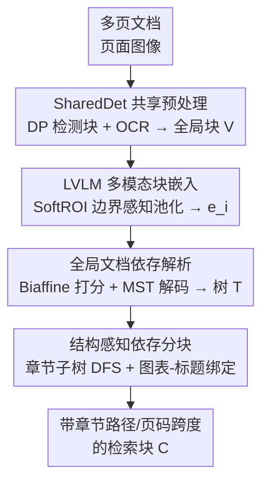

# M3DocDep: Multi-modal, Multi-page, Multi-document Dependency Chunking with Large Vision-Language Models

**会议**: CVPR 2026  
**论文**: [CVF Open Access](https://openaccess.thecvf.com/content/CVPR2026/html/Shin_M3DocDep_Multi-modal_Multi-page_Multi-document_Dependency_Chunking_with_Large_Vision-Language_Models_CVPR_2026_paper.html)  
**代码**: 无  
**领域**: 多模态VLM / 文档理解 / RAG  
**关键词**: 文档分块, 依存树, 多模态文档解析, LVLM, 检索增强生成

## 一句话总结
M3DocDep 用冻结的大视觉语言模型（LVLM）把长篇多页工业文档的版面块编码成多模态表示，先用 biaffine 打分 + MST 解码恢复一棵全局合法的"父子依存树"，再沿着这棵树切出保留章节层级和图表-标题绑定的检索块，从而在层级恢复（STEDS +28.5~39.6%）、检索（nDCG +1.1~15.3%）和问答（ANLS +4.5~15.3%）三个环节同时提升文档 RAG 效果。

## 研究背景与动机
**领域现状**：检索增强生成（RAG）让大模型能处理长文档，但效果高度依赖"分块"——文档被切成什么样的语义单元，直接决定检索精度和答案质量。当前主流是文本中心的分块器（按长度切、按语义切）或基于版面解析（DP）的结构化分块。

**现有痛点**：纯文本分块器看不见扫描页、多页 PDF、复杂工业版面里的视觉和结构线索，遇到 OCR 噪声还会产生重复或歧义块。视觉驱动的 DP 能稳健抠出表格、文本块等视觉连贯区域，但抓不住多页文档的语义层级（如 1.2 → 1.2.1 的父子关系），全文上下文建模不足。后来有人把 DP+OCR+LLM 拼起来做文档层级解析（DHP），但"把页面转成纯文本喂给 LLM"这一步会抹掉颜色、字号、排版强调等关键视觉线索，对图表也无能为力。

**核心矛盾**：即便换成天然能联合理解图文的 LVLM，基于 SFT（指令微调）的做法仍然难以在长多页文档上恢复一棵"全局一致"的层级——跨页引用不稳定、文本化后视觉线索只剩一半、而且序列生成本身不强制满足树约束（单根、单父、无环）。这就造成文档 RAG 里反复出现的失败链条：块依存恢复得不准 → 块边界不可靠 → 检索精度和答案落地都被拖垮。

**本文目标**：把问题拆成——(1) 如何保留视觉线索地表征版面块；(2) 如何跨页恢复一棵全局合法的依存树而非碎片化的局部链接；(3) 如何让分块确定性地沿着这棵树走。

**切入角度**：作者的观察是——与其用"自回归生成层级文本"这种脆弱方式，不如把文档结构显式建模成"块之间的带分数依存树"。LVLM 负责给块产出强多模态特征，结构恢复则交给经典的图打分 + MST 解码来保证全局一致性。

**核心 idea**：遵循一条明确的因果链——**更好的块依存恢复 → 更好的文档树 → 更好的块边界 → 更好的检索与问答**。即"先恢复依存，再分块"（parse-then-chunk）。

## 方法详解

### 整体框架
M3DocDep 是一条"先解析、后分块"的流水线，针对长篇工业文档，核心是在构造检索单元之前先恢复块依存，让块边界服从文档真实结构而非表面文本。整条流水线分四个阶段：(a) **SharedDet（DP+OCR）** 把多页文档转成一张共享的"全局文档块"画布 $V$；(b) **LVLM 多模态块嵌入**用冻结 LVLM 把每个块映射成多模态嵌入 $e_i$；(c) **全局文档依存解析**给候选父子边打分并解码出全局树 $T$；(d) **结构感知依存分块**确定性地把 $T$ 转成带章节路径和页码跨度的块集合 $C$。其中前两阶段是把所有方法都共用的"脚手架"（保证公平对比），真正的贡献集中在 (c) 依存树恢复和 (d) 树引导分块。

### 关键设计

**1. SoftROI 边界感知多模态块嵌入：把 LVLM 的图文 token 精确汇聚成块特征**

DP 给出的块只是一个个框，要喂给依存打分器需要每个块的稠密特征。直接对框内 token 做均匀池化会被标注和边界噪声污染，而完全可变形的 RoI 池化又太重。M3DocDep 先把每页图像送进冻结的 LVLM（如 Qwen2.5-VL、LLaVA-OneVision），从解码器最后一层取出图像 token 位置的隐状态作为"页面多模态 token"，并借助 token 网格元数据给每个 token 赋上文档级归一化坐标。然后对块 $i$，收集落在其全局框内的所有 token $p \in \text{ROI}_i$，按边界感知权重池化：

$$w_p \propto \big(u_p(1-u_p)\big)^{\alpha}\,\big(v_p(1-v_p)\big)^{\alpha}, \quad \tilde{w}_p = \frac{w_p}{\sum_{q\in \text{ROI}_i} w_q}, \quad e_i = \sum_{p\in \text{ROI}_i} \tilde{w}_p\, z_p$$

其中 $(u_p,v_p)$ 是 token 在框内的归一化坐标，$\alpha$ 是边界锐化指数——它让靠近框中心的 token 权重更高、靠近边界的更低，因此对框标注的轻微偏移更鲁棒。这套做法把 RoIAlign 式的连续采样适配到文档 token 网格，既保留了可变形 RoI 对几何的尊重，又省下算力。最后还从归一化版面类型查一个紧凑的类型嵌入 $\tau_i$，和 $e_i$ 一起送进下游打分头，注入版面先验。

**2. Biaffine 依存打分 + 头部中心的候选过滤：把"找父亲"变成边打分而非序列生成**

这是替代 SFT 自回归生成层级的核心。对每个块 $v$，先构造一个很小的父候选集 $P(v)$：优先挑标题和章节头，允许同列内带一点 $y$ 容差的向上链接，跨页父亲只限定在最近 $M$ 页内，再按垂直距离和"头部先验"保留 top-$k$。于是每个子块只需从"少数合理候选 + 虚拟根 $r$"里选父亲。对节点 $i$ 拼接 $x_i=[e_i;\tau_i]$ 过一个小 MLP 得到 $h_i$，候选边 $u\to v$ 的分数用 biaffine 形式打：

$$s(u\to v) = [h_u;1]^\top U [h_v;1] + w_{geo}^\top \delta_g(u,v)$$

其中 $\delta_g(u,v)$ 编码成对几何特征（归一化相对偏移、块尺寸比、页距、重叠指示等），虚拟根的分数则定义为 $s(\text{ROOT}\to v) = r^\top h_v + b_r$。训练时对每个子块在"候选父 + 根"上做 $K{+}1$ 路 softmax，对真值父 $p^\star(v)$ 做交叉熵：

$$P_\theta(p\mid v) = \frac{\exp s(p\to v)}{\sum_{q\in P(v)\cup\{r\}} \exp s(q\to v)}$$

这样头部中心、类型感知的候选过滤把不可能的父亲提前排除，把学习聚焦在标题、标题、说明文字和 ROOT 之间的真实附着上；biaffine 打分在多模态块嵌入上对这些候选边做校准，比脆弱的 token 序列稳得多。

**3. MST 全局树解码：把局部分数拼成一棵单根无环的全局合法树**

光对每个子块独立取最高分父亲（local argmax）在推理时会制造环或互相矛盾的链接。M3DocDep 把所有边分数 $s(p\to v)$（含 ROOT 边）当作权重，交给基于最大生成树（MST/Chu-Liu-Edmonds）的全局解码器，返回得分最高且满足单根、单父、无环约束的树 $T$。因为解码出来的树保证逻辑自洽，下游分块就建立在一个一致的结构上、而不是一堆各自为政的局部链接上——这正是 SFT 式 LVLM 难以恢复的可解释层级。论文也保留了 local argmax 作为对照基线，消融里它会明显掉点。

**4. 结构感知依存分块：确定性地沿树切块，保住章节连续性和图表-标题绑定**

有了 $T$，分块变成一个确定性的后处理而非另一个待学模块。具体三步：(i) **章节根 DFS**——从标题、章节头节点出发把它当结构锚点，DFS 收集其后代构成章节子树，跨页但同属一棵子树的块被合并；(ii) **图文绑定**——若图/表节点和说明节点在 $T$ 里相连，就强制塞进同一块 $B_m$，边缺失时回退到空间最近的兼容配对；(iii) **块发射**——每个保留子树或合并的图文组发射成一个块 $c_m=(B_m,\pi_m,[p_m^{\min},p_m^{\max}])$，带上根到章节的路径 $\pi_m$、页码跨度和块列表。这样章节续接不会被随意切断、跨页证据保持连接，图表跟着说明走；发射的章节路径和页码跨度还让多文档索引里本来相似的块变得可区分。块粒度仍可通过最大块长和切割策略在恢复的树上确定性调节，无需重训解析器。

### 一个完整示例
论文 Fig. 2 走了一遍 5 页工业文档：输入 5 页 → 恢复出依存子树（节点如 `1:title → 17:section-title → 19:figure → 20:figure-caption`，说明图 19 和它的说明 20 在某章节标题下绑定）→ 发射出一个结构感知块：路径 `# Title > ## 1. Intro`、页码 2、把图 crop 和它的说明文字（"Fig. 1: Schematic of photon trajectory..."）放进同一个检索单元。整条链路把"图-说明跨块漂移"这个常见碎片化问题挡在了分块之前。

## 实验关键数据

### 主实验

**层级/依存恢复（同一 GT 版面块，隔离层级恢复能力）**：

| 数据集 | 指标 | M3DocDep | 最强基线 | 提升 |
|--------|------|----------|----------|------|
| HRDS | STEDS | 76.52 | DSPS 59.57 | +16.95 |
| HRDH | STEDS | 71.65 | DSHP-LLM 51.34 | +20.31 |
| DocHieNet | STEDS | 70.83 | DSHP-LLM 53.49 | +17.34 |
| HRDS | F1 | 82.87 | DSPS 65.27 | +17.60 |

通用 LVLM 参考基线（GPT-5、Qwen2.5-VL 等）的 STEDS 普遍在 9~26 区间，远低于 M3DocDep，说明纯靠 LVLM 生成层级远不够。

**检索质量（4 个多页 VQA 语料 macro 平均，4 种检索器平均）**：

| 语料 | 指标 | M3DocDep | MultiDocFusion | 提升 |
|------|------|----------|----------------|------|
| DUDE | nDCG | 27.81 | 25.05 | +2.76 |
| MP-DocVQA | nDCG | 24.52 | 21.31 | +3.21 |
| MOAMOB | nDCG | 75.54 | 65.54 | +10.00 |
| CUAD | nDCG | 89.12 | 88.19 | +0.93 |

**下游问答（ANLS，3 种 LVLM reader 平均）**：DUDE 21.43（MultiDocFusion 18.59）、MP-DocVQA 18.17（16.15）、CUAD 29.25（27.38）、MOAMOB 27.14（25.96），四个语料全面领先。MOAMOB、DUDE、MP-DocVQA 这些跨页证据多、OCR 噪声大、含图表区域的语料增益最明显，印证了"块边界对它们最敏感"的判断。

### 消融实验

| 配置 | Avg F1 | Avg STEDS | 说明 |
|------|--------|-----------|------|
| Full | 78.88 | 73.00 | 完整模型 |
| MST → local argmax | 73.68 (−5.19) | 66.30 (−6.70) | 去掉全局树约束，独立选父 |
| 禁止跨页边 | 71.73 (−7.15) | 63.74 (−9.26) | 不允许跨页父子链接 |

（macro 平均自 HRDS/HRDH/DocHieNet；SoftROI、头部先验、候选 top-$k$ 剪枝的逐数据集消融在补充材料。）

### 关键发现
- **跨页边和全局树约束是两根支柱**：禁止跨页边掉 STEDS 9.26 分、MST 换成 local argmax 掉 6.70 分，是所有改动里掉得最狠的两个——这恰好对应作者主张的"跨页依存 + 全局一致性"是长文档层级恢复的命门。
- **增益主要来自块边界而非元数据**：在一个去掉章节路径和页码字段的"无元数据公平对照"里，M3DocDep 相对 MultiDocFusion 仍保有 2.3% 的 nDCG 优势，说明提升主要靠更好的块边界，而不是靠多塞了元数据。
- **对 LVLM 编码器鲁棒**：换 Qwen2.5-VL / InternVL-3.5 / LLaVA-OneVision-1.5 做块嵌入，DocHieNet 父预测 F1 稳定在 76.01/75.71/74.07，方法不绑定特定 backbone。

## 亮点与洞察
- **把"文档层级恢复"从生成问题改造成图解码问题**：用 biaffine 边打分 + MST 解码替代自回归生成层级，天然强制单根/单父/无环，绕开了 SFT LVLM"跨页引用不稳、序列不满足树约束"的老毛病——这是最让人"啊哈"的设计转向。
- **SoftROI 是个轻量但聪明的折中**：用 $(u(1-u))^\alpha$ 形状的边界感知权重在"均匀池化太糙"和"可变形 RoI 太重"之间找平衡，把 LVLM token 网格当作连续采样面，思路可迁移到任何"框 + 大模型 token"的区域特征提取场景。
- **"先解析再分块"的因果链贯穿全文**：层级 → 检索 → 问答三张表呈现同一模式，作者用统一的 SharedDet 块、统一 chunk 预算、统一检索器/reader 做受控对比，把"分块质量"从解析、预算、检索器差异里干净地隔离出来，方法论值得借鉴。

## 局限与展望
- **LVLM 与依存头未联合训练**：当前 LVLM 是冻结的、只取特征，作者把联合训练列为未来工作；这意味着块表征对依存任务并非端到端最优。
- **依赖外部 DP+OCR 的质量**：SharedDet 作为前置脚手架，若 DP 漏检块或 OCR 出错，错误会传导进依存树——虽然块级操作有一定鲁棒性，但没有从根上解决解析噪声。
- **树归纳监督成本高**：恢复依存树需要层级标注（DocHieNet、HRDH/HRDS），作者也承认"大规模低成本树归纳监督"是待解问题，这限制了向无标注新领域的迁移。
- **延迟敏感场景待优化**：多页 LVLM 推理 + MST 解码对工业实时部署偏重，作者把"轻量化变体"列入展望。

## 相关工作与启发
- **vs MultiDocFusion**: 同样拼 DP+OCR+LLM 做结构化分块，但它用自回归生成层级、受 LLM 上下文窗口限制、文本化时丢视觉线索；M3DocDep 用多模态块嵌入 + 全局 MST 解码恢复层级，把图/表和说明保在恢复的树里，且在去元数据公平对照下仍领先 2.3% nDCG。
- **vs DSHP-LLM / Qwen2.5-VL–DHP–SFT**: 这些 DHP 基线靠 decoder 式 SFT，与树约束错位、常只恢复部分表头层级、其余靠规则补；M3DocDep 显式建模成带分数的树，可解释性和全局一致性更强（STEDS 大幅领先）。
- **vs 纯文本分块（Length/Semantic/LumberChunker/Perplexity）**: 它们看不见视觉版面、抓不住层级，在跨页、图表多的语料上碎片化严重；M3DocDep 沿树切块保住章节连续性和图文绑定。

## 评分
- 新颖性: ⭐⭐⭐⭐⭐ 把文档层级恢复从生成问题重构成"多模态块嵌入 + biaffine + MST"图解码，思路干净且切中 SFT LVLM 的真实痛点。
- 实验充分度: ⭐⭐⭐⭐ 三轴（层级/检索/QA）× 多语料 × 多 backbone，统一评测协议受控严谨；但核心消融较精简、SoftROI 等细粒度消融下放补充材料。
- 写作质量: ⭐⭐⭐⭐⭐ 因果链"依存→树→边界→检索QA"贯穿全文，方法分阶段叙述清晰，公式和流程图配套。
- 价值: ⭐⭐⭐⭐ 对长文档/工业文档 RAG 是直接可用的分块改进，统一评测协议也为后续公平对比立了范式。

<!-- RELATED:START -->

## 相关论文

- [\[CVPR 2026\] Multi-SpatialMLLM: Multi-Frame Spatial Understanding with Multi-Modal Large Language Models](multi-spatialmllm_multi-frame_spatial_understanding_with_multi-modal_large_langu.md)
- [\[CVPR 2026\] M3Grounder: Mask-Based Multi-Span and Multi-Granular Grounding for Document QA](m3grounder_mask-based_multi-span_and_multi-granular_grounding_for_document_qa.md)
- [\[CVPR 2026\] Hierarchical Attacks for Multi-Modal Multi-Agent Reasoning](hierarchical_attacks_for_multi-modal_multi-agent_reasoning.md)
- [\[CVPR 2026\] Point Cloud as a Foreign Language for Multi-modal Large Language Model](point_cloud_as_a_foreign_language_for_multi-modal_large_language_model.md)
- [\[ACL 2026\] SlideAgent: Hierarchical Agentic Framework for Multi-Page Visual Document Understanding](../../ACL2026/multimodal_vlm/slideagent_hierarchical_agentic_framework_for_multi-page_visual_document_underst.md)

<!-- RELATED:END -->
