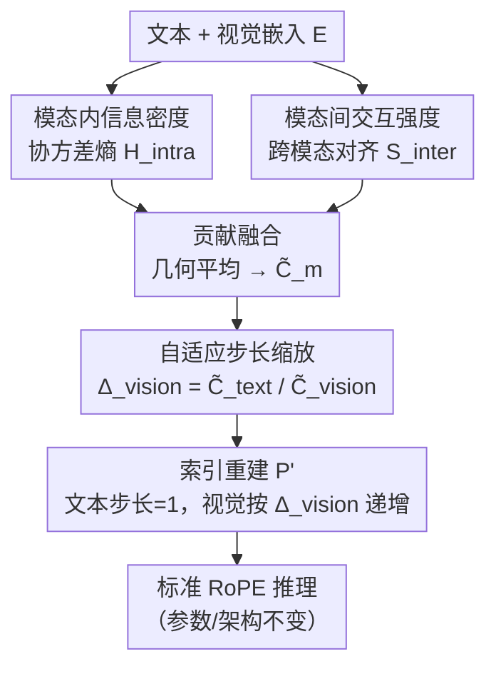

# MODIX: A Training-Free Multimodal Information-Driven Positional Index Scaling for Vision-Language Models

**会议**: CVPR 2026  
**论文**: [CVF Open Access](https://openaccess.thecvf.com/content/CVPR2026/html/Huang_MODIX_A_Training-Free_Multimodal_Information-Driven_Positional_Index_Scaling_for_Vision-Language_CVPR_2026_paper.html)  
**代码**: 无  
**领域**: 多模态VLM  
**关键词**: 位置编码, RoPE, 训练无关, 信息论, 视觉-语言模型  

## 一句话总结
MODIX 把"位置粒度"当成一种隐式资源，用协方差熵（模态内信息密度）+ 跨模态对齐（模态间交互）算出文本/视觉两种模态的信息贡献，据此**只放大视觉 token 的 RoPE 步长、保持文本步长为 1**，无需训练、不改参数、只在推理前重写一遍位置索引，就让 VLM 在多个 benchmark 上稳定涨点。

## 研究背景与动机
**领域现状**：现代 VLM 几乎都以 Transformer 为骨架，靠位置编码（主流是 RoPE）把图像 patch token 和文本 token 拼成一条统一序列来建模。RoPE 通过 token 间的相对距离 $\Delta p = p_j - p_i$ 做旋转编码，对纯文本非常有效。

**现有痛点**：所有现有方案对每个 token 一视同仁地分配位置索引 $p_i = i$，给文本 token 和视觉 token **同样的位置步长（stride=1）**。但多模态数据本质是异质的——文本 token 语义稠密、每个词都携带不同信息，而视觉 token 来自固定大小的图像 patch，在均匀背景或重复纹理处存在大量空间冗余。用统一步长，等于把表示能力浪费在冗余视觉内容上，同时让信息丰富的区域"被稀释"。

**核心矛盾**：RoPE 的注意力会随相对距离线性衰减，在 softmax 归一化下每个 query 的注意力是固定预算；步长越小的模态、占据的位置跨度越小、聚合到的注意力越多。可现在文本和冗余背景 patch 拿到的是**完全相同的位置粒度（判别力）**，注意力分配和信息含量错位。而且不同任务的模态贡献差异巨大（视觉主导的场景理解 vs 文本主导的图表解读），静态位置编码根本无法适应这种 task-dependent 的偏移。

**本文目标**：在不重新训练、不改架构的前提下，让位置粒度跟着"信息贡献"走——信息密度高的模态配更细的位置分辨率，冗余内容容忍更粗的间距。

**切入角度**：作者把**位置粒度视为一种可分配的隐式资源**，并用信息论同时刻画"模态内信息密度"和"模态间交互强度"两个互补维度来量化每个模态该拿多少粒度。

**核心 idea**：用一个推理时的轻量预处理层，根据信息贡献比 $\tilde C_\text{text}/\tilde C_\text{vision}$ 算出视觉步长 $\Delta_\text{vision}$，重写位置索引后再喂给标准 RoPE——即插即用地把"均匀步长"换成"信息驱动的自适应步长"。

## 方法详解

### 整体框架
MODIX 是一个加在 RoPE **之前**的纯推理预处理模块。输入是 VLM 已经投影到统一嵌入空间的文本嵌入 $E_\text{text}\in\mathbb{R}^{n_t\times d}$ 和视觉嵌入 $E_\text{vision}\in\mathbb{R}^{n_v\times d}$，输出是一组重写后的位置索引 $P'$。它走两条并行通路分析嵌入：**模态内通路**用协方差熵估计每个模态自身的信息密度，**模态间通路**用跨模态相似度衡量两模态的交互强度；两条通路的分数用几何平均融合成统一贡献 $\tilde C_m$，再由贡献比反推出视觉步长 $\Delta_\text{vision}$，最后分段重建位置索引 $P'$（文本保持 $p'_i=i$，视觉以 $\Delta_\text{vision}$ 等距递增），无缝接入 RoPE。整条流水线只在每个输入上跑一次、复杂度与层数无关。

### 关键设计

**1. 把位置粒度当成可分配资源：信息不对称问题的形式化**

MODIX 的出发点不是又改一版 RoPE 频率，而是重新定义问题。作者指出 RoPE 下注意力随相对距离衰减、softmax 又把每个 query 的注意力约束成固定预算，于是"步长"实际上在分配注意力带宽：步长小→位置跨度小→聚合注意力多。既然如此，给冗余视觉和稠密文本相同步长就是资源错配。形式化地，本文要找一个映射 $f:\mathbb{R}^{N\times d}\to\mathbb{R}^N$ 产出模态感知的索引 $P' = f(E)$，约束是：视觉 token 信息贡献低就给更粗的粒度、文本 token 保持原索引、且整体单调 $p'_i < p'_j\ (i<j)$。注意力分数随之依赖调整后的相对距离 $|p'_i - p'_j|$，同时反映 token 间隔与模态贡献。这个"位置粒度=隐式资源"的视角是后面所有设计的地基。

**2. 模态内信息密度：协方差行列式作为熵代理**

要回答"某个模态自身信息有多丰富"，MODIX 用嵌入分布的**协方差熵**来量化。对模态 $m$ 的嵌入先去均值得到中心化嵌入 $\tilde e^m_i = e^m_i - \bar e^m$，算经验协方差矩阵

$$\Sigma_m = \frac{1}{n_m}\sum_{i=1}^{n_m}\tilde e^m_i (\tilde e^m_i)^\top \in \mathbb{R}^{d\times d}$$

然后在高斯近似下用微分熵作为信息密度代理：

$$H^\text{intra}_m = \tfrac{1}{2}\log\det(\Sigma_m + \epsilon I_d)$$

其中 $\epsilon=10^{-6}$ 保证数值稳定。作者论证：嵌入维度很高（$d\approx 1000$）且对比训练目标有正则效果，所以高斯近似可接受；更关键的是协方差行列式 $\det(\Sigma_m)$ 本身就是一个**与分布形式无关**的嵌入变异性度量——行列式越大说明这个模态的嵌入"铺得越开"、信息越丰富。最后在模态间归一化得到模态内贡献 $I^\text{intra}_m = H^\text{intra}_m / \sum_{m'} H^\text{intra}_{m'}$。直觉是：文本嵌入往往各维度独立、协方差体积大、熵高；冗余视觉嵌入挤成一团、体积小、熵低。

**3. 模态间交互强度：跨模态最大对齐的方向性度量**

一个模态的价值不只看自身丰富度，还看它和另一模态交互得有多紧。MODIX 把 L2 归一化后的嵌入做内积得到跨模态相似度矩阵 $S = \hat E_\text{text}\hat E_\text{vision}^\top \in\mathbb{R}^{n_t\times n_v}$，再用"每个 token 对对方模态的**最大**相似度的均值"定义两个**有方向**的交互分数：

$$S^\text{inter}_{\text{text}\to\text{vision}} = \frac{1}{n_t}\sum_{i=1}^{n_t}\max_{j}S_{ij},\qquad S^\text{inter}_{\text{vision}\to\text{text}} = \frac{1}{n_v}\sum_{j=1}^{n_v}\max_{i}S_{ij}$$

前者衡量"每个文本 token 能不能在图里找到支撑证据"，后者衡量"每个视觉 token 能不能对上文本语义"。用 max 而非 mean 是为了抓住"最匹配的那一对"而不被大量无关 token 稀释。同样在模态间归一化得 $I^\text{inter}_m$。这一路把"单模态丰富但和对方无关"的情况惩罚掉了。

**4. 几何平均融合 + 自适应步长缩放与索引重建**

两条分数用**几何平均**而非算术平均融合：$C_m = (I^\text{intra}_m)^\alpha (I^\text{inter}_m)^{1-\alpha}$，再归一化为 $\tilde C_m$。几何平均的好处是"短板效应"——只有当一个模态**同时**具备丰富的内部信息和强跨模态一致性时贡献才高，任一项偏低就被拉下来；$\alpha$ 平衡两者，实验取 0.5 最优。

有了贡献，作者从 RoPE 理论推步长：注意力带宽与位置跨度成反比，要让带宽比匹配贡献比 $A^\text{total}_\text{text}/A^\text{total}_\text{vision}\approx \tilde C_\text{text}/\tilde C_\text{vision}$，结合带宽-步长反比关系并**固定文本步长 $\Delta_\text{text}=1$**，解得视觉步长

$$\Delta_\text{vision} = \frac{\tilde C_\text{text}}{\tilde C_\text{vision}}$$

当视觉贡献低于文本时 $\Delta_\text{vision}>1$（视觉间距变粗），反之 $<1$（变细）。固定文本步长的理由很具体：语言骨干在预训练时学到的句法/语义/篇章依赖紧绑在原始顺序索引上，改文本步长会扰乱这些关系；而视觉 token 是通过投影接口引入、没有对应的预训练位置先验，步长天然是可调的自由度。最后分段重建索引：

$$p'_i = \begin{cases} i, & i < n_t \\ p'_{n_t-1} + \Delta_\text{vision}\cdot(i - n_t + 1), & i \ge n_t \end{cases}$$

文本段保持原索引，视觉段从 $n_t$ 开始以恒定步长前进，$\Delta_\text{vision}>0$ 保证严格单调。重建只需对序列做一次线性扫描，随后把 $P'$ 替换原索引送入 RoPE。整个过程零参数更新、零架构改动。

### 一个完整示例
以 Figure 2 报告的四类任务为例，看贡献如何转成步长：
- **RealWorldQA（视觉主导）**：视觉 intra=0.685、fusion $\tilde C_\text{vision}=0.648$ > 文本，于是 $\Delta_\text{vision}\approx 0.54$（<1，视觉间距变**细**），把更多注意力给视觉；
- **DocVQA（文本主导）**：文本 fusion $\tilde C_\text{text}=0.698$，视觉只 0.302，$\Delta_\text{vision}\approx 2.31$（视觉间距变**粗**），压缩冗余文档背景；
- **AI2D / ChartQA（文本偏主导）**：步长分别约 2.09 / 1.51，介于两者之间。

可以看到同一套机制在不同任务上自动把视觉粒度调到 0.54→2.31 的不同档位，实现 instance-specific 的自适应——这正是"位置编码应被当作自适应资源"的直接体现。

## 实验关键数据

### 主实验
3 个 VLM 架构（Qwen3-VL、InternVL3.5、LFM2-VL，1.6B–8B）× 6 个 benchmark，每组结果对 10 个随机种子取平均，Wilcoxon 符号秩检验（$p<0.05$），标准差均 <0.5%。

| 模型 | 规模 | ScienceQA | RealWorldQA | DocVQA | ChartQA | AI2D | BLINK |
|------|------|-----------|-------------|--------|---------|------|-------|
| Qwen3-VL | 2B | 72.18→**78.28** (+6.10) | 64.31→65.75 (+1.44) | 83.27→86.37 (+3.10) | 62.64→**68.76** (+6.12) | 67.20→72.96 (+5.76) | 49.18→51.22 (+2.04) |
| Qwen3-VL | 8B | 88.41→90.16 (+1.75) | 66.93→69.15 (+2.22) | 90.39→91.02 (+0.63) | 70.60→72.80 (+2.20) | 78.59→83.44 (+4.85) | 62.80→61.05 (−1.75) |
| InternVL3.5 | 2B | 68.83→70.05 (+1.22) | 58.82→60.26 (+1.44) | 82.15→84.68 (+2.53) | 55.92→57.89 (+1.97) | 70.91→72.44 (+1.53) | 49.76→51.97 (+2.21) |
| InternVL3.5 | 8B | 89.70→91.13 (+1.43) | 63.79→63.01 (−0.78) | 85.92→85.63 (−0.31) | 59.00→59.57 (+0.57) | 78.14→81.38 (+3.24) | 53.50→54.79 (+1.29) |
| LFM2-VL | 1.6B | 65.41→**73.83** (+8.42) | 56.99→63.79 (+6.80) | 66.14→71.36 (+5.22) | 59.83→63.64 (+3.81) | 52.10→56.54 (+4.44) | 41.68→45.08 (+3.40) |
| LFM2-VL | 3B | 84.20→84.67 (+0.47) | 67.32→68.76 (+1.44) | 71.75→79.33 (+7.58) | 73.23→75.08 (+1.85) | 72.33→75.36 (+3.03) | 47.56→51.08 (+3.52) |
| **平均 Δ** | | **+3.23** | **+2.09** | **+3.13** | **+2.75** | **+3.80** | **+1.79** |

小模型涨幅最大（LFM2-VL-1.6B 在 ScienceQA +8.42、Qwen3-VL-2B 在 ChartQA +6.12）；大模型涨幅收窄，InternVL3.5-8B 在 RealWorldQA/DocVQA 出现 −0.78/−0.31 的非显著小幅波动（落在测量噪声内）。视频任务 Video-MME 上中长视频涨幅最明显（+2.23~+2.66），印证了"压缩时序冗余、把注意力导向长程依赖"的效果。

与多模态 PE 变体横比（Table 3，同骨干同设置）：在 Qwen3-VL-8B 上 MODIX 在 ScienceQA(+1.75)/ChartQA(+2.20) 均优于 CircleRoPE(+0.46/+0.23) 和 MHRoPE(+0.74/+2.07)；InternVL3.5-8B 上 MODIX(+1.43/+0.57) 优于 V2PE(−0.43/+0.12)，且全程不改参数。

### 消融实验
融合权重 $\alpha$ 在 Qwen3-VL-2B 上的扫描（$\alpha=0$ 纯模态间，$\alpha=1$ 纯模态内）：

| $\alpha$ | ScienceQA | RealWorldQA | DocVQA | ChartQA | AI2D | BLINK |
|------|-----------|-------------|--------|---------|------|-------|
| 0.00 | 78.05 | 65.70 | 86.80 | 66.00 | 68.83 | 45.79 |
| 0.25 | 78.07 | 62.56 | **90.67** | 65.60 | 68.67 | 47.26 |
| **0.50** | **78.28** | 65.75 | 86.37 | **68.76** | **72.96** | **51.22** |
| 0.75 | 77.92 | 65.60 | 86.08 | 62.83 | 71.75 | 49.74 |
| 1.00 | 76.90 | 64.89 | 87.35 | 64.42 | 71.43 | 48.86 |

$\alpha=0.5$ 综合最佳，尤其在 ChartQA/AI2D/BLINK 上明显领先。$\alpha=0$（纯模态间）在 RealWorldQA 这类空间密集任务上偏弱，说明内部信息密度不可忽略；$\alpha=1$（纯模态内）在 ScienceQA 这类文本中心任务上掉到 76.90，说明跨模态对齐同样关键——几何平均融合两者缺一不可。

### 关键发现
- **小模型受益最大**：1.6B–2B 模型涨幅普遍 +4~+8，8B 模型收窄到 +0.6~+4，说明大模型本身位置利用已较充分，MODIX 给"位置资源紧张"的小模型补益最明显。
- **任务自适应是真实存在的**（Table 5）：文本贡献 $\tilde C_\text{text}$ 从 BLINK 的 0.469 跨到 DocVQA 的 0.698，文档/图表类任务文本主导、RealWorldQA 视觉主导，MODIX 的步长会跟着自动反向调整。
- **开销可忽略**：额外操作只在推理前跑一次、与层数无关；Qwen3-VL-8B 上 ScienceQA/ChartQA 仅多 0.0014s/0.0018s（1.1%/0.7% wall-clock），内存只多几 MB。
- **可迁移到训练**（初步）：Qwen3-VL-2B 在 ScienceQA 上带 MODIX 微调得 93.23%，高于基线微调的 92.30%，但仅单任务单规模验证。

## 亮点与洞察
- **把"位置步长"重新解读成注意力带宽资源**：从 RoPE 距离衰减 + softmax 固定预算推出"步长小=带宽多"，再让带宽比匹配信息贡献比，这条因果链让"调步长"有了清晰的理论动机，而不是经验调参。
- **只动视觉、锁死文本**的非对称设计很克制：抓住"语言骨干位置先验是预训练学来的、视觉 token 没有对应先验"这一点，把视觉步长当作唯一自由度，避免扰乱已学好的文本依赖——这是它能 training-free 还稳定涨点的关键。
- **协方差行列式当信息密度代理**是个可复用 trick：不需要知道真实分布，$\det(\Sigma)$ 就能粗略度量嵌入"铺得开不开"，可迁移到任何"想比较两组 embedding 谁更信息丰富"的场景（如 token 剪枝、模态加权）。
- **几何平均的短板效应**用得巧：强制"内部丰富 AND 跨模态一致"才算高贡献，比算术平均更能筛掉"自说自话"的模态。

## 局限与展望
- **模态级粒度太粗**：MODIX 给整个视觉模态分配单一步长，无法刻画同一图像内异质区域（前景 vs 背景）的信息差异；作者承认 token 级自适应步长是更细的方向。
- **只覆盖 RoPE**：方法绑定 RoPE 的距离衰减性质，对 ALiBi、可学习位置编码等机制还没验证，需另行设计。
- **训练态证据单薄**：training-aware MODIX 只在单任务、2B 规模上看到 +0.93，32B 仅做了初步兼容性试验，>70B 及全程预训练的效果未知。
- **个人观察**：步长由全局协方差/相似度统计驱动，对短序列或极端模态比例（如纯文本几乎无视觉）下的稳定性、以及 8B 大模型上偶发的负向波动（如 InternVL3.5-8B 的 −0.78）缺少更细的失败分析。

## 相关工作与启发
- **vs 普通 RoPE / V2PE / CircleRoPE / MHRoPE**：这些要么统一步长 $p_i=i$，要么从架构/频率层面设计固定规则（且 V2PE/MHRoPE 多需训练）；MODIX 完全 training-free，且步长由 **task-dependent 的信息贡献动态决定**而非固定规则，横比中持平或更优。
- **vs token 剪枝（如各类 visual token pruning）**：剪枝**物理删除**冗余视觉 token，会丢空间信息且常需改架构；MODIX **保留全部 token**、只调位置间距，既不丢信息也不改架构，可直接部署到预训练 VLM。
- **vs 多模态信息论方法（Information Bottleneck / 互信息最大化）**：以往多用于表示学习或模态融合，MODIX 把信息论原则首次系统用到**位置步长设计**上，开辟了"用信息贡献分配位置粒度"的新视角。

## 评分
- 新颖性: ⭐⭐⭐⭐⭐ 把位置粒度当可分配资源、用信息论驱动步长，是 PE 设计的新视角，且 training-free。
- 实验充分度: ⭐⭐⭐⭐ 3 架构×7 benchmark+视频+横比+开销分析，10 seed 显著性检验扎实；但训练态与超大模型验证偏弱。
- 写作质量: ⭐⭐⭐⭐⭐ 理论动机（带宽-步长）推导清晰，case 分析直观，框架图与公式对得上。
- 价值: ⭐⭐⭐⭐ 即插即用、几乎零开销、对小模型增益明显，工程落地友好；增益随模型变大而收窄。

<!-- RELATED:START -->

## 相关论文

- [\[CVPR 2026\] LLMind: Bio-inspired Training-free Adaptive Visual Representations for Vision-Language Models](llmind_bio-inspired_training-free_adaptive_visual_representations_for_vision-lan.md)
- [\[ICML 2026\] Circle-RoPE: Cone-like Decoupled Rotary Positional Embedding for Vision-Language Models](../../ICML2026/multimodal_vlm/circle-rope_cone-like_decoupled_rotary_positional_embedding_for_large_vision-lan.md)
- [\[CVPR 2026\] DRS-GUI: Dynamic Region Search for Training-Free GUI Grounding](drs-gui_dynamic_region_search_for_training-free_gui_grounding.md)
- [\[CVPR 2026\] SeD-UD: An Influence-Driven and Hierarchically-Decoupled Information Bottleneck for Multimodal Intent Recognition](sed-ud_an_influence-driven_and_hierarchically-decoupled_information_bottleneck_f.md)
- [\[CVPR 2026\] Pointing at Parts: Training-Free Few-Shot Grounding in Multimodal LLMs](pointing_at_parts_training-free_few-shot_grounding_in_multimodal_llms.md)

<!-- RELATED:END -->
