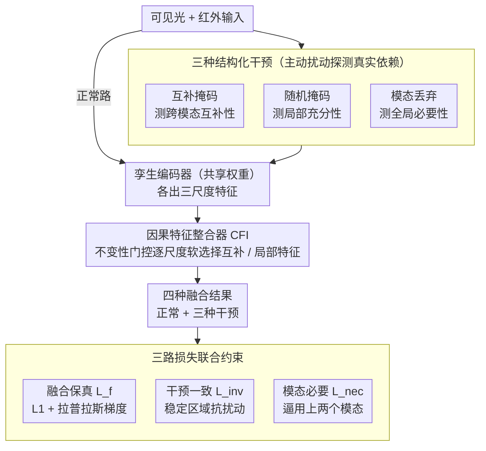

# Multi-Modal Image Fusion via Intervention-Stable Feature Learning

**会议**: CVPR 2026  
**arXiv**: [2603.23272](https://arxiv.org/abs/2603.23272)  
**代码**: 即将公开  
**领域**: 多模态VLM  
**关键词**: 多模态图像融合, 因果推理, 干预学习, 红外可见光融合, 特征稳定性

## 一句话总结

提出一个受因果推理启发的多模态图像融合框架，通过三种结构化干预策略（互补掩码、随机掩码、模态丢弃）探测模态间的真实依赖关系，并设计因果特征整合器 (CFI) 学习干预稳定特征，在 MSRS 上 PSNR 达到 66.02、AG 达到 4.129，目标检测 mAP 达到 0.821。

## 研究背景与动机

1. **领域现状**：多模态图像融合（MMIF）将不同模态的互补信息整合为统一表示。红外-可见光融合（IVIF）是最典型的子任务，融合红外的热语义和可见光的纹理细节。当前 SOTA 方法使用复杂架构（双流 CNN、Transformer 全局注意力、扩散模型）来建模跨模态关系。

2. **现有痛点**：所有现有方法共享一个根本性局限——它们从观测数据中学习而不区分真正的互补关系和虚假的统计规律性。当热力信号在训练集中系统性地与特定可见光模式共现时，模型会捕获这些统计关联而非理解它们是否反映了有意义的依赖。这导致特征选择基于共现频率而非对融合质量的实际贡献。

3. **核心矛盾**：相关性 ≠ 因果性。仅在输入-输出对上训练的模型无法判断观测到的模态间相关性是因果的还是巧合的。根据 Pearl 的因果层次理论，当前 MMIF 方法完全工作在"关联"层级，缺失了"干预"和"反事实"层级的推理能力。

4. **本文目标** 如何设计原则性的干预策略来探测模态间的真实依赖，并学习跨干预模式保持稳定的融合特征，从而克服虚假相关导致的脆弱性？

5. **切入角度**：受 Pearl 因果层次的启发，设计三种互补的结构化扰动策略，每种测试模态关系的不同方面。核心假设是——对融合真正重要的特征应当在不同干预模式下保持其重要性，而虚假相关会在扰动下崩溃。

6. **核心 idea**：通过"主动扰动+稳定性筛选"替代"被动观测+统计拟合"——系统性地干预输入以发现跨干预不变的特征，作为融合决策的可靠依据。

## 方法详解

### 整体框架

采用 U-Net 式的孪生架构。两个共享权重的编码器分别处理可见光和红外输入，生成三个尺度的特征 $\{\Theta_1^v, \Theta_2^v, \Theta_3^v\}$ 和 $\{\Theta_1^i, \Theta_2^i, \Theta_3^i\}$。解码器中嵌入 CFI（因果特征整合器）在每个尺度做干预感知的融合。训练阶段模型同时执行三种干预，输出四种融合结果（正常 + 三种干预），用三种损失联合约束。

### 关键设计

**1. 三种结构化干预：从三个维度逼问"这个依赖是不是真的"**

虚假相关的根子在于模型只看输入-输出对，没法分辨观测到的模态相关性是因果还是巧合。本文的对策是主动扰动输入，看哪些特征的重要性能扛住扰动。三种干预各管一个方面。互补掩码 (Complementary Masking) 给两个模态施加空间不相交的掩码 $\mathcal{M}^v \cap \mathcal{M}^i = \mathbf{O}$——一个模态被遮的区域恰好是另一个模态保留的区域；如果融合结果还好，就说明两者是真互补、能彼此补位，而非冗余地编码同一份信息，测的是**跨模态互补性**。随机掩码 (Random Masking) 对两个模态施加同一个随机掩码 $\mathcal{M}^r$，同时遮住相同区域；能在部分可观测下还撑住融合质量的特征组合，代表了鲁棒的局部依赖，测的是**局部充分性**。模态丢弃 (Modality Dropout) 直接把一个模态整个置零，逼模型暴露它对单一模态的依赖程度，测的是**全局必要性**，防止退化成只看一个模态。三者协同：互补掩码逼出真正的跨模态交互，随机掩码筛出鲁棒的局部模式，模态丢弃堵死退化解。

**2. 因果特征整合器 CFI：用一道门控替代"按统计显著性加权"**

干预之后还需要一个模块在每个尺度上把干预稳定的特征挑出来用，这就是 CFI。在尺度 $k$，它先做双向跨模态注意力交换信息——可见光当 query 去查红外的 key/value 得到 $\Theta_k^{v \to i}$，反方向得到 $\Theta_k^{i \to v}$，为省算力 key/value 在空间上池化到 $r \times r$。两路分别聚合出互补特征 $\Theta_k^c = \Theta_k^{v \to i} + \Theta_k^{i \to v}$ 和局部特征 $\Theta_k^l = \Theta_k^i + \Theta_k^v$。关键的一步是**可学习不变性门控**，它从互补特征里算出一张逐像素的混合权重，再用它在互补和局部之间做软选择：

$$\mathcal{G}_k = \sigma(\text{Conv}_{3 \times 3}(\Theta_k^c)), \qquad \Theta_k^{\text{CFI}} = \mathcal{G}_k \odot \Theta_k^c + (1 - \mathcal{G}_k) \odot \Theta_k^l$$

门控值高的地方走跨模态互补特征（干预下稳定、可信），门控值低的地方退回局部模态特征（可能是虚假相关）。和传统注意力按统计显著性加权不同，CFI 把"这个特征在干预下稳不稳定"显式写进门控里，让稳定依赖优先于虚假相关被采用。

**3. 三路损失把"融合质量、干预稳定、模态均衡"各钉一颗钉子**

总损失 $\mathcal{L} = \mathcal{L}_f + \alpha \mathcal{L}_{\text{inv}} + \beta \mathcal{L}_{\text{nec}}$ 拆成三项，每项堵一种失败模式。融合保真损失 $\mathcal{L}_f$ 用 L1 重建加拉普拉斯梯度保持，盯住基本的像素与边缘质量。干预一致性损失 $\mathcal{L}_{\text{inv}}$ 只在门控选中的稳定区域惩罚干预前后输出的差异——稳定区域就该对扰动不敏感——并额外加均值约束和空间熵正则防止门控退化成全开或全关，鼓励它做接近二值的决策。模态必要性损失 $\mathcal{L}_{\text{nec}}$ 反过来最大化正常融合与单模态融合的差异，逼模型真正用上两个模态。消融里少任何一项都会掉进对应的坑（见下文 $\mathcal{L}_{\text{nec}}$ 一拿掉 AG/SF 就暴跌）。

### 损失函数 / 训练策略

- **融合保真损失**：$\mathcal{L}_f = \|I_f - I_{vi}\|_1 + \|I_f - I_{ir}\|_1 + \lambda_1 \|\nabla I_f - \max(\nabla I_{vi}, \nabla I_{ir})\|_1$
- **干预一致性损失**：在门控选择的区域惩罚互补/随机掩码融合与标准融合的差异
- **模态必要性损失**：$\mathcal{L}_{\text{nec}} = \|I_f - I_f^i\|_1 + \|I_f - I_f^v\|_1$
- 超参数：$\alpha = 0.1$, $\beta = 0.05$, $\lambda_1 = 1.0$, 掩码大小 $16 \times 16$, 掩码数量 1-6 随机
- RTX 4090 训练 50 epoch，Adam 优化器，lr=1e-4，batch size 16

## 实验关键数据

### 主实验（红外可见光融合）

| 方法 | TNO-AG | TNO-PSNR | MSRS-AG | MSRS-PSNR | MSRS-CC | M3FD-AG | M3FD-PSNR |
|------|--------|----------|---------|-----------|---------|---------|-----------|
| DCEvo | 3.942 | 61.24 | 3.807 | 64.49 | 0.605 | 4.575 | 61.33 |
| Conti | 3.860 | 61.12 | 3.737 | 64.26 | 0.603 | 4.476 | 61.11 |
| LRRNet | 3.855 | 61.72 | 2.672 | 64.68 | 0.515 | 3.613 | 62.95 |
| **Ours** | **5.128** | **62.06** | **4.129** | **66.02** | **0.646** | **5.276** | **62.13** |

| 下游任务 | 方法 | 指标 |
|----------|------|------|
| 目标检测 (M3FD) | Ours | mAP=**0.821** |
| 目标检测 (M3FD) | SAGE | mAP=0.815 |
| 语义分割 (MSRS) | Ours | mIoU=**0.747** |
| 语义分割 (MSRS) | A2RNet | mIoU=0.740 |

### 消融实验

| 配置 | AG | SF | PSNR | CC | Qabf |
|------|----|----|------|----|------|
| w/o CFI | 5.764 | 5.972 | 60.21 | 0.544 | 0.428 |
| w/o L_inv | 5.179 | 5.728 | 58.08 | 0.573 | 0.331 |
| w/o L_nec | 4.016 | 4.018 | 61.39 | 0.393 | 0.368 |
| w/o L_nec & L_inv | 3.361 | 3.478 | 59.85 | 0.524 | 0.312 |
| w/o Int (仅 L_f) | 5.332 | 5.348 | **63.95** | **0.598** | 0.524 |
| **Full Model** | **6.136** | **6.244** | 63.62 | 0.605 | 0.467 |

### 关键发现

- **干预 vs 非干预的核心权衡**：w/o Int（纯相关学习）在 PSNR 和 Qabf 上反而更高，但 AG 和 SF（结构完整性和纹理丰富度）显著低于完整模型。这揭示了融合目标的内在矛盾——相关驱动优化偏好像素保真，干预驱动框架优先保持结构
- **模态必要性损失影响最大**：移除 $\mathcal{L}_{\text{nec}}$ 后 AG 从 6.136 暴跌到 4.016、SF 从 6.244 降到 4.018，说明没有这个约束模型会严重偏向单一模态
- **CFI 的移除导致噪声和结构畸变**：虽然边缘指标还行（AG=5.764），但可视化显示明显的噪声和结构失真
- **ATE 分析验证干预效果**：模态丢弃影响最大（符合预期）、随机掩码影响最小（说明成功学到了局部充分特征）、互补掩码影响适中（说明跨模态补偿能力已建立）
- **跨域泛化**：IVIF 训练的模型无需微调直接迁移到医学图像融合（MRI-PET/SPECT），AG 和 SF 仍最优，证明干预学到的是通用融合原则

## 亮点与洞察

- **将因果推理引入图像融合**的框架设计很有思想深度：不是简单地把"因果"作为标签，而是具体设计了三种干预策略分别测试互补性、局部充分性和全局必要性，且用 ATE 分析量化了干预效果，形成了完整的因果分析闭环
- **"干预稳定性"作为特征选择准则**有很强的可迁移性：不仅适用于图像融合，可以推广到任何需要筛选鲁棒特征的多模态任务（如多模态情感分析、传感器融合）
- **w/o Int vs Full 的对比**揭示了一个深层洞察——PSNR 不是融合的终极指标，结构/纹理保持（AG/SF）在下游任务中可能更重要。这对融合领域的评估体系有启发意义

## 局限与展望

- 干预策略的具体参数（掩码大小、掩码数量）主要靠经验调试，缺乏理论指导
- 三种干预策略的权重（$\alpha=0.1, \beta=0.05$）是手动设定的，可能不是最优
- 仅验证了 IVIF 和医学融合两个子领域，其他模态组合（如 RGB-深度、RGB-事件）未涉及
- "因果"框架更多是启发性的——互补掩码更接近数据增强而非严格的因果干预
- 计算开销未报告——同时做三种干预意味着训练时前向传播次数至少增加 3 倍

## 相关工作与启发

- **vs CDDFuse**：CDDFuse 用 Transformer+CNN 联合提取全局和局部特征，但完全基于统计学习。本文通过干预训练来区分真实互补和虚假相关
- **vs Mask-DiFuser**：扩散模型驱动的融合方法，生成质量高但不考虑特征鲁棒性。本文的干预框架可以与扩散模型结合
- **vs 因果表示学习文献**：本文将低光增强、自监督学习中的因果思想迁移到融合任务，但做了重要的适配——融合没有显式的特征保持标签，且模态互补性通常违反独立性假设

## 评分

- 新颖性: ⭐⭐⭐⭐ 因果推理引入图像融合的视角新颖，三种干预策略的设计有原则性，但"因果"更多是启发性的而非严格形式化
- 实验充分度: ⭐⭐⭐⭐ 三个IVIF基准+医学融合跨域+目标检测/分割下游任务，消融详尽，ATE分析有说服力
- 写作质量: ⭐⭐⭐⭐ 因果动机的推导逻辑清晰，但部分公式符号可以更一致
- 价值: ⭐⭐⭐⭐ 提出了融合领域一个新的训练范式（干预学习而非纯相关学习），实验验证了其有效性和泛化性

<!-- RELATED:START -->

## 相关论文

- [\[CVPR 2026\] ReCoFuse: Ultra-Robust Image Fusion via Restorative Multi-Modal Diffusion Reciprocal Coupling](recofuse_ultra-robust_image_fusion_via_restorative_multi-modal_diffusion_recipro.md)
- [\[CVPR 2026\] Intervention-Aware Multiscale Representation Learning from Imaging Phenomics and Perturbation Transcriptomics](intervention-aware_multiscale_representation_learning_from_imaging_phenomics_and.md)
- [\[CVPR 2026\] Multi-Hierarchical Contrastive Spectral Fusion for Multi-View Clustering](multi-hierarchical_contrastive_spectral_fusion_for_multi-view_clustering.md)
- [\[CVPR 2026\] VideoFusion: A Spatio-Temporal Collaborative Network for Multi-modal Video Fusion](videofusion_a_spatio-temporal_collaborative_network_for_multi-modal_video_fusion.md)
- [\[CVPR 2025\] Multi-Layer Visual Feature Fusion in Multimodal LLMs: Methods, Analysis, and Best Practices](../../CVPR2025/multimodal_vlm/multi-layer_visual_feature_fusion_in_multimodal_llms_methods_analysis_and_best_p.md)

<!-- RELATED:END -->
