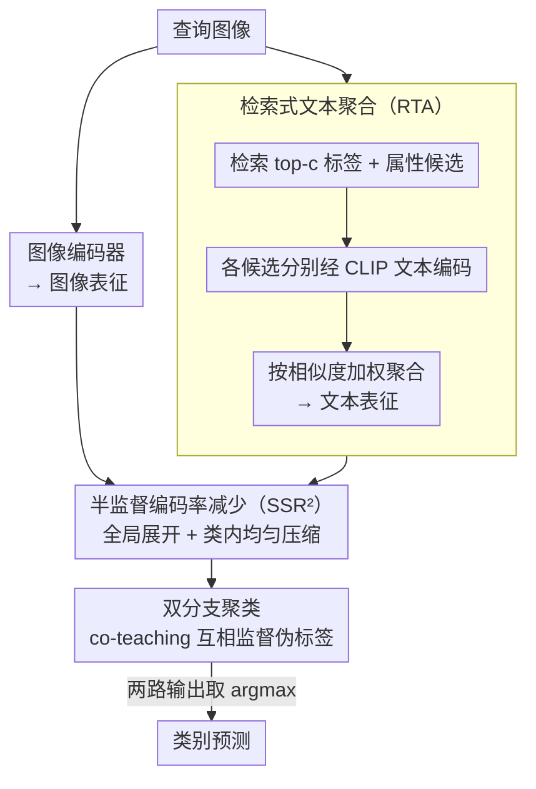

# Multi-Modal Representation Learning via Semi-Supervised Rate Reduction for Generalized Category Discovery

**会议**: CVPR2026  
**arXiv**: [2602.19910](https://arxiv.org/abs/2602.19910)  
**代码**: 待确认  
**领域**: 多模态VLM  
**关键词**: 广义类别发现, 多模态表征学习, 半监督编码率减少, 模态内对齐, CLIP

## 一句话总结

提出 SSR²-GCD 框架，通过半监督编码率减少（Semi-Supervised Rate Reduction）损失学习模态内均匀压缩的结构化表征，并结合检索式文本聚合策略增强跨模态知识迁移，在8个数据集上超越现有多模态GCD方法。

## 背景与动机

1. **广义类别发现 (GCD) 的实际需求**：现实场景中数据既包含已知类别也包含未知类别，GCD旨在利用已知类别知识发现未知类别，是开放集识别的自然扩展。
2. **多模态方法的兴起**：近年来 CLIP-GCD、TextGCD、GET 等方法将文本信息引入视觉 GCD 任务，通过跨模态对齐提升性能。
3. **模态间对齐的局限**：现有多模态 GCD 方法主要关注模态间（inter-modal）对齐，却忽视了模态内（intra-modal）表征分布的结构性问题。
4. **不均衡压缩问题**：传统对比学习损失 $\mathcal{L}_{\text{con}}$ 由无监督项（拉近所有增强对）和有监督项（仅拉近已知类别标注数据）组成，导致已知类别被过度压缩，而未知类别压缩不足，聚类边界模糊。
5. **CLIP 长文本局限**：CLIP 对超过20个token的长文本prompt编码效果不佳，传统拼接式prompt构建方式次优。
6. **模态间对齐可能有害**：直接将模态间对齐损失与模态内损失简单叠加，反而可能破坏模态内表征的学习。

## 方法详解

### 整体框架
SSR²-GCD 要解决多模态广义类别发现里"已知类被过度压缩、未知类压缩不足"的表征不均衡问题。整条流程：检索式文本聚合（RTA）先给每张图生成一个鲁棒的文本表征，图像/文本两路表征再各自过半监督编码率减少（SSR²）损失做表征学习，最后双分支分类器从两个模态各自学伪标签并互相监督。

### 关键设计

**1. 检索式文本聚合（RTA）：绕开 CLIP 长文本短板，在嵌入空间加权聚合多候选**

CLIP 对超过 20 个 token 的长 prompt 编码效果差，传统拼接式 prompt 是次优的。RTA 沿用 TextGCD 的标签词典和属性词典，为每张查询图像检索最相似的 $c$ 个标签和属性候选，但不再拼成长字符串输入 CLIP，而是分别编码后加权聚合：

$$\boldsymbol{z}^{\text{T}} = \sum_{i=1}^{c} \sigma_i \mathcal{F}^{\text{T}}(\mathcal{T}(a_i)) + \sum_{i=1}^{c} \sigma_i \mathcal{F}^{\text{T}}(\mathcal{T}(b_i))$$

权重分配上最相似候选取 $1-\alpha$，其余各 $\frac{\alpha}{c-1}$（$\alpha=0.5, c=4$）。这样既避开了长文本编码退化，又能把更多候选信息整合进来。

**2. 半监督编码率减少（SSR²）：用信息论原则逼出均衡压缩的表征**

传统对比损失 $\mathcal{L}_{\text{con}}$ 由无监督项和有监督项组成，会把已知类压得过事、未知类压得不够，聚类边界模糊。SSR² 基于最大编码率减少原则重新设计损失：

$$\mathcal{L}_{\text{SSR}^2} = -R(\mathbf{Z}) + R_c^{\text{s}}(\mathbf{Z}_{\text{s}}, \mathbf{Y}^*) + R_c^{\text{u}}(\mathbf{Z}_{\text{u}}, \mathbf{Y})$$

其中 $R(\mathbf{Z})$ 是整体编码率，最大化使全部表征在全局空间展开；$R_c^{\text{s}}$ 用真实标签 $\mathbf{Y}^*$ 压缩各已知类；$R_c^{\text{u}}$ 用分类器预测的伪标签 $\mathbf{Y}$ 压缩各未知类。该损失分别对图像和文本编码器应用（$\mathcal{L}_{\text{SSR}^2}^{\text{I}}$ 和 $\mathcal{L}_{\text{SSR}^2}^{\text{T}}$），"全局展开 + 类内均匀压缩"让已知和未知类都拿到平衡的低维子空间表征。

**3. 双分支聚类：用 co-teaching 让两模态互相监督伪标签**

两个模态各自学出的伪标签质量参差，单靠任一路都不够稳。训练分两阶段：热身阶段用 $\mathcal{L}_{\text{warm}} = \mathcal{L}_{\text{SSR}^2}^{\text{I}} + \mathcal{L}_{\text{SSR}^2}^{\text{T}} + \mathcal{L}_{\text{cls}}^{\text{I}} + \mathcal{L}_{\text{cls}}^{\text{T}}$ 先把两路表征和分类器立起来；对齐阶段再加入 co-teaching 损失 $\mathcal{L}_{\text{co-teach}}$，用高置信度样本互相监督。最终预测取两路分类器输出之和的 $\arg\max(\boldsymbol{y}_i^{\text{I}} + \boldsymbol{y}_i^{\text{T}})$。

## 实验关键数据

### 主实验（8个数据集，All ACC %）

| 数据集 | TextGCD | GET | **SSR²-GCD** | 提升 |
|---|---|---|---|---|
| ImageNet-100 | 88.0 | 91.7 | **92.1** | +0.4 |
| ImageNet-1k | 64.8 | 62.4 | **66.7** | +1.9 |
| CIFAR-10 | 98.2 | 97.2 | **98.5** | +0.3 |
| CIFAR-100 | 85.7 | 82.1 | **86.4** | +0.7 |
| CUB-200 | 76.6 | 77.0 | **78.3** | +1.3 |
| Stanford Cars | 86.1 | 78.5 | **89.2** | +3.1 |
| Oxford Pets | 93.7 | 91.1 | **95.7** | +2.0 |
| Flowers102 | 87.2 | 85.5 | **93.5** | +6.3 |

在 Stanford Cars 和 Flowers102 上提升尤为显著（+3.1% 和 +6.3%）。

### 表征学习方法对比（All ACC %）

| 损失配置 | CIFAR-10 | Stanford Cars | Flowers102 |
|---|---|---|---|
| $\mathcal{L}_{\text{CLIP}}$（仅模态间） | 98.3 | 87.0 | 89.7 |
| $\mathcal{L}_{\text{con}}$（仅模态内） | 98.4 | 87.9 | 91.8 |
| $\mathcal{L}_{\text{SSR}^2}$（仅模态内） | **98.5** | **89.2** | **93.5** |
| $\mathcal{L}_{\text{CLIP}} + \mathcal{L}_{\text{SSR}^2}$ | 98.3 | 88.1 | 92.9 |

关键发现：叠加模态间对齐损失反而降低性能。

### 消融实验（Stanford Cars / Flowers102, All ACC %）

| Dual | RTA | SSR² | Stanford Cars | Flowers102 |
|---|---|---|---|---|
| ✗ | ✗ | ✗ | 75.2 | 78.3 |
| ✓ | ✗ | ✗ | 81.7 | 83.9 |
| ✓ | ✓ | ✗ | 86.0 | 87.4 |
| ✓ | ✗ | ✓ | 85.5 | 89.1 |
| ✓ | ✓ | ✓ | **89.2** | **93.5** |

三个组件各自独立贡献，组合后效果最优。

## 亮点

- **理论视角新颖**：首次将最大编码率减少原则引入多模态 GCD，用信息论框架替代传统对比学习，提供均衡压缩保证
- **反直觉但有说服力的发现**：模态间对齐在多模态 GCD 中可能是有害的，仅靠模态内对齐即可隐式实现模态间对齐
- **实验分析深入**：通过相似度分布图、有效秩曲线、$R_e$ 一致性指标、t-SNE 可视化等多角度验证了核心论点
- **RTA 设计巧妙**：规避 CLIP 长文本限制，在嵌入空间进行加权聚合，可整合更多候选信息

## 局限与展望

- 候选数 $c$ 增大时计算和内存开销线性增加（需多次过 CLIP 文本编码器）
- 图像和文本模态被同等对待，缺乏自适应的模态重要性加权机制
- 类别数 $K$ 需已知或预估，对未知类别数估计错误的鲁棒性未讨论
- 仅在 CLIP-B/16 骨干上验证，更大模型（ViT-L/H）的表现未探索
- 半监督编码率减少的无标签部分依赖伪标签质量，早期伪标签噪声可能影响收敛

## 与相关工作的对比

| 方法 | 文本生成 | 表征学习 | 聚类策略 | 特点 |
|---|---|---|---|---|
| TextGCD | 拼接top-3标签+top-2属性 | $\mathcal{L}_{\text{CLIP}}$（模态间） | 双分支+co-teaching | 首个多模态GCD，但忽视模态内对齐 |
| GET | 文本反转网络生成prompt | $\mathcal{L}_{\text{CLIP}}+\mathcal{L}_{\text{con}}$ | 单分支MLP | 同时用模态间+模态内，但简单叠加 |
| CLIP-GCD | 知识库检索相似文本 | $\mathcal{L}_{\text{CLIP}}$ | SimGCD聚类 | 仅用模态间对齐 |
| **SSR²-GCD** | RTA加权聚合多候选 | $\mathcal{L}_{\text{SSR}^2}$（仅模态内） | 双分支+co-teaching | 首次解决不均衡压缩，无需模态间对齐 |

## 评分

- 新颖性: ⭐⭐⭐⭐ — 将编码率减少引入多模态GCD，视角独到，"模态间对齐可能有害"的发现具有启发性
- 实验充分度: ⭐⭐⭐⭐⭐ — 8个数据集全面评测，6种表征学习配置对比，多维度分析（秩、一致性、分布、可视化）
- 写作质量: ⭐⭐⭐⭐ — 结构清晰，数学推导严谨，但部分符号较密集
- 价值: ⭐⭐⭐⭐ — 为多模态GCD的表征学习提供了新思路，在细粒度数据集上改进显著

<!-- RELATED:START -->

## 相关论文

- [\[ICLR 2026\] SpectralGCD: Spectral Concept Selection and Cross-modal Representation Learning for Generalized Category Discovery](../../ICLR2026/multimodal_vlm/spectralgcd_spectral_concept_selection_and_cross-modal_representation_learning_f.md)
- [\[CVPR 2026\] Semantic Noise Reduction via Teacher-Guided Dual-Path Audio-Visual Representation Learning](semantic_noise_reduction_via_teacher-guided_dual-path_audio-visual_representatio.md)
- [\[CVPR 2026\] IsoCLIP: Decomposing CLIP Projectors for Efficient Intra-modal Alignment](isoclip_decomposing_clip_projectors_for_efficient_intramodal_alignment.md)
- [\[CVPR 2026\] VideoFusion: A Spatio-Temporal Collaborative Network for Multi-modal Video Fusion](videofusion_a_spatio-temporal_collaborative_network_for_multi-modal_video_fusion.md)
- [\[CVPR 2026\] BriMA: Bridged Modality Adaptation for Multi-Modal Continual Action Quality Assessment](brima_bridged_modality_adaptation_for_multi-modal_continual_action_quality_asses.md)

<!-- RELATED:END -->
