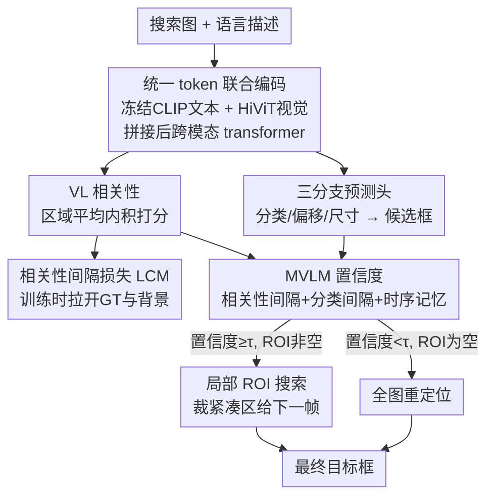

# MVLM: Template-Free Tracking via Vision-Language Margin Confidence and Memory-Gated Tracking

**会议**: CVPR 2026  
**论文**: [CVF Open Access](https://openaccess.thecvf.com/content/CVPR2026/html/Park_MVLM_Template-Free_Tracking_via_Vision-Language_Margin_Confidence_and_Memory-Gated_Tracking_CVPR_2026_paper.html)  
**代码**: [项目页](https://mvlm-tft.github.io)  
**领域**: 多模态VLM / 视觉跟踪  
**关键词**: 模板无关跟踪, 语言引导, 视觉-语言相关性, 置信度门控, 重定位

## 一句话总结
MVLM 提出一种**只用自然语言、不需要任何初始框或视觉模板**的单目标跟踪范式：靠视觉-语言相关性定位目标，并设计一个融合"相关性间隔 + 分类间隔 + 时序记忆"的置信度，动态在"紧凑 ROI 局部搜索"和"全图重定位"之间切换，在 TNL2K / LaSOT / OTB99 / MGIT 四个基准上取得纯语言跟踪 SOTA。

## 研究背景与动机
**领域现状**：自然语言引导的"模板无关跟踪"（Template-Free, TF）很有吸引力——用户不必在第一帧手动画框，只要给一句文字描述就能跟踪任意目标，甚至中途改一句话就能无缝切换到新目标，非常适合开放世界、人机交互场景。但已有的语言跟踪工作（JointNLT、UVLTrack、QueryNLT 等）名义上"用语言"，实际上仍然依赖第一帧的视觉模板或 grounding 出来的初始框作为视觉锚点，只是把语言当成辅助初始化的线索，本质还是模板跟踪。

**现有痛点**：一个最朴素的纯语言做法是直接计算"搜索图视觉特征"与"语言查询"的相关性，取相关性最高的区域当目标。但**只靠瞬时相关性极不稳定**：当搜索区域很大时，空间不确定性随面积增长；遇到干扰物、遮挡、外观变化时，视觉-语言显著性会变得模糊，导致跟踪器要么定错位、要么直接跟丢。

**核心矛盾**：要稳定就得把搜索区域收窄到 ROI（减少空间不确定性），但收窄又会丢失"跟丢后重新找回"和"切换目标后重新定位"的能力——**搜索范围的"窄"（精度/稳定）和"宽"（可恢复性）之间存在 trade-off**。而何时该窄、何时该宽，恰恰取决于当前定位有多可信，可信度本身却没人量化。

**本文目标**：在彻底去掉视觉模板的前提下，(1) 从 VL 相关性中学到有判别力的显著性；(2) 给出一个**可信度度量**来在线决定搜索范围是局部还是全局。

**切入角度**：作者观察到，定位成功的本质是"目标区域与语言的相关性要显著强于背景区域"，即存在一个正的**相关性间隔（margin）**。于是把问题转成"如何最大化这个间隔"，并用理论证明间隔越大、误定位概率指数级下降。

**核心 idea**：把原始 VL 相关性提炼成一个时序稳定、可信的置信度 MVLM，用它**门控**搜索策略——高置信度就缩进紧凑 ROI 局部搜索，低置信度就触发全图重定位，从而在不牺牲恢复能力的前提下压低空间不确定性。

## 方法详解

### 整体框架
整套系统的输入是**一张搜索图 + 一句语言描述**，输出是当前帧的目标框，且不需要任何初始框。流程是：冻结的 CLIP 文本编码器把语言编成文本 token，视觉 tokenizer 把图像编成视觉 token，两路 token 拼在一起送进 transformer 视觉编码器做跨模态联合编码；编码后的视觉 token 一路喂给"分类/偏移/尺寸"三分支预测头生成候选框集合，另一路与语言 embedding 做区域平均内积算出 VL 相关性分数。然后对每个候选框计算 **MVLM 置信度**（融合相关性间隔、分类间隔、时序记忆），用它筛出 ROI 子集：子集非空就在最高分框周围裁出紧凑搜索区给下一帧（局部搜索），子集为空就把全图当搜索区（全局重定位）。训练时额外加一个**相关性间隔损失** $L_{CM}$ 把目标区域的相关性"拉开"。

### 关键设计

**1. VL 相关性作为唯一语义锚点：把"模板匹配"换成"语言-视觉对齐"**

模板跟踪靠第一帧裁出的视觉样本做锚点，外观一变或被遮挡就失效，还需要人工画框。本文彻底丢掉视觉模板，改用**视觉 token 与语言 embedding 的区域平均内积**作为定位依据。给定单位归一化的语言 embedding $u_t$ 和视觉 token $v_x$，候选框 $b$ 的区域对齐分数定义为

$$s(I,t,b) = \frac{1}{|R(b)|}\sum_{x \in R(b)} \langle v_x, u_t \rangle$$

其中 $R(b)$ 是落在框 $b$ 内的视觉 token 索引集合。编码侧的关键是**统一 token 序列**：把图像 token $P^I_t$ 和文本 token $P^T_t$ 拼成 $P_t=[P^I_t; P^T_t]$ 一起送进 transformer，交替的自注意力让视觉和语言 token 直接交互、逐层精炼，比"两路独立编码再算相似度"更能学出跨模态对齐。语言 embedding $u_t$ 取精炼后文本 token 的均值池化，代表目标的统一语义。这样跟踪就不再绑死某一帧的外观，只要语言描述还成立就能持续定位——也正因如此才支持"中途改一句话切换目标"。

**2. 相关性间隔损失 $L_{CM}$：直接把目标区域的相关性"拉开"**

只靠对齐分数最大化容易被背景里的强干扰物骗到，因为目标和背景的分数挨得太近。作者从理论（定理 1）出发——误定位概率随**相关性间隔** $\Delta\rho(b)=\rho(b^*)-\rho(b)$ 指数衰减——直接设计损失去**最大化 GT 区域与背景之间的间隔**。先算 GT 框内的平均相关性 $\rho_{pos}=\frac{1}{|R^*|}\sum_{x\in R^*}\langle v_x,u_t\rangle$，对每个背景 token 定义间隔 $\Delta\rho_x=\rho_{pos}-\langle v_x,u_t\rangle$，损失为

$$L_{CM} = \frac{1}{K}\sum_{x \in \text{TopK}(R_{neg})} \exp\!\left(-\tau\,\Delta\rho_x|\Delta\rho_x|\right)$$

其中 $\tau>0$ 是温度，Top-K 只挑**最难的 K 个负样本**（间隔最小的）。这个形式很巧：当 $\Delta\rho_x>0$（已经分开得好）损失很小，当 $\Delta\rho_x<0$（背景反而更像目标）指数惩罚迅速爆涨，逼模型把相关性能量集中到目标区域。它对应的是定理 1 里的误定位上界——拉大间隔等价于指数级压低跟丢率，所以这不是凭经验拍的损失，而是有界可证的。

**3. MVLM 置信度：把瞬时相关性提炼成时序稳定的可信度**

单帧 VL 相关性会抖，需要一个能跨帧稳定、又能反映"当前这帧到底有多确定"的标量。MVLM 把三种证据融成一个有界置信度。先算两种**标准化间隔**：相关性间隔取相关性最高框与"区域外次高框"之差再除以鲁棒尺度 $\hat\sigma_{corr}$，分类间隔同理用分类头分数算 $\tilde\Delta^{cls}_t$（次高框要在 top-1 的 IoU 排除区 $B^{out}_t$ 之外选，确保是真正的竞争者而非同一物体的重叠框）。两者凸组合成单帧 VLM 置信度

$$\kappa^{vlm}_t = \alpha_{corr}\tilde\Delta^{corr}_t + \alpha_{cls}\tilde\Delta^{cls}_t,\quad \alpha_{corr}+\alpha_{cls}=1$$

再用指数加权移动平均（EWMA）把历史记忆进来 $\bar\kappa^{mem}_t=(1-\lambda)\kappa^{vlm}_t+\lambda\bar\kappa^{mem}_{t-1}$（$\lambda$ 是遗忘因子，越大越平滑但滞后越久），最后把瞬时与记忆再融一次 $\kappa^{mvlm}_t=(1-\omega)\kappa^{vlm}_t+\omega\bar\kappa^{mem}_t$。由于每一项都被归一化到 $[-1,1]$，最终 $\kappa^{mvlm}_t$ 也落在 $[-1,1]$，可解释为"当前帧存在多么显著的相关性/分类峰"。三种证据互补：相关性管语义对齐、分类管局部视觉证据、记忆管时序一致性。

**4. 记忆门控重定位：用置信度在线切换"局部 ROI"和"全图搜索"**

有了可信度，就能解决"窄 vs 宽"的 trade-off。对每个候选框算 per-box 的 $\kappa^{mvlm}_t(b)$，筛出超过阈值 $\tau$ 的 ROI 子集 $S_t(\tau)=\{b\in B_t:\kappa^{mvlm}_t(b)\ge\tau\}$。决策规则很直接：**子集非空**（$|S_t|>0$）就说明当前定位可信，选其中分类分最高的框作为结果，并在它周围裁出紧凑搜索区给下一帧做局部搜索；**子集为空**（$|S_t|=0$）说明没有任何可信候选，就退回用全图分类最高框，并把整张图当下一帧搜索区触发全局重定位。这样高置信时收窄 ROI 压低空间不确定性、低置信时主动放大搜索范围找回目标，既稳又能恢复——这正是"跟丢后重找"和"切换目标"能力的来源。

**5. 跟踪成功的理论保证：两条界把失败拆成可解释的两项**

为了让上面的机制不只是"经验有效"，作者给出两条概率界。**定理 1（误定位界）**在 sub-Gaussian 噪声假设下，证明误定位概率被 $\sum_{b\ne b^*}\exp\!\big(-\frac{(\rho(b^*)-\rho(b))^2}{2\sigma^2}(\frac{1}{|R(b^*)|}+\frac{1}{|R(b)|})^{-1}\big)$ 上界，说明误定位概率随间隔**指数衰减**，直接为 $L_{CM}$ 正名。**定理 2（重定位界）**进一步把 ROI 搜索下的失败拆成两个可解释项：**ROI 排除**（GT 框因搜索区太紧被排除在外，上界 $\eta(\tau)$）和 **ROI 内误定位**（在受限区内排序错，上界 $(M(\tau)-1)\exp(-\frac{n\gamma(\tau)^2}{4\sigma^2})$）。两项之和给出总失败率上界——它形式化地说明"加大相关性间隔 + 选合适的区域尺寸"能联合指数级压低失败率，从而论证了 MVLM 门控在局部/全局搜索间切换的合理性。

### 一个完整示例：中途切换目标
论文 Figure 4 给了一个很直观的例子。初始语言是"a woman wearing blue clothes with long hair"，跟踪器稳定跟着这个蓝衣女人，$\kappa^{mvlm}_t$ 维持在高位、ROI 子集非空，于是一直走局部 ROI 搜索。在第 697 帧，用户把语言改成"a man wearing brown clothes and a pair of red gloves"——此刻原目标语义不再匹配，相关性间隔 $\tilde\Delta^{corr}_t$ 和分类间隔 $\tilde\Delta^{cls}_t$ 同时塌陷，$\kappa^{mvlm}_t$ 掉到阈值之下、ROI 子集变空，系统自动触发全图重定位，在整张图里重新找到那个棕衣男人并锁定，注意力图也从蓝衣女人迅速迁移到新目标。整个切换不需要任何新的视觉模板或人工框，全靠"改一句话 + 置信度门控"完成。

### 损失函数 / 训练策略
总损失为 $L_{total}=L_{track}+L_{CM}$：$L_{track}$ 沿用 heatmap-based 的复合跟踪损失（分类/偏移/尺寸三个任务头各自的损失），$L_{CM}$ 是上面的相关性间隔损失。视觉编码器用 HiViT，文本编码器用冻结的 CLIP；$N_I=196$、$N_T=77$、$C=512$。训练用 TNL2K、LaSOT、VastTrack 等图文配对数据，60 个 epoch（每 epoch 10 万对图文），学习率 0.0005，batch size 80，AdamW，4×RTX A6000 48GB。

## 实验关键数据

### 主实验
在四个 VL 跟踪基准上评测，分**纯语言（Tracking-by-language）**和**框+语言（Tracking-by-bbox and -language）**两种设置。纯语言设置下 MVLM 全面领先：

| 设置 | 基准 | 指标 | MVLM | 次优 | 提升 |
|------|------|------|------|------|------|
| 纯语言 | TNL2K | PRE | 60.9 | 58.9 (MambaVLT) | +2.0 |
| 纯语言 | LaSOT | PRE | 65.5 | 61.0 (UVLTrack-B) | +4.5 |
| 纯语言 | OTB99 | PRE | 84.3 | 81.0 (QueryNLT) | +3.3 |
| 纯语言 | MGIT | PRE | 55.5 | 50.3 (MambaVLT) | +5.2 |

在框+语言设置下（把视觉模板 token $P^R_t$ 也拼进来），MVLM 在 TNL2K（PRE 73.0）和 MGIT（PRE 66.3 / AUC 71.7）取得最佳，说明这套为模板无关设计的方法**天然能扩展到模板跟踪**。

### 消融实验
在 TNL2K / LaSOT / OTB99 上逐个加组件（数值为 PRE/AUC，取 TNL2K 列）：

| 配置 | 局部搜索 | $L_{CM}$ | MVLM | TNL2K PRE | TNL2K AUC | 说明 |
|------|:---:|:---:|:---:|:---:|:---:|------|
| A1 | ✗(全图) | ✗ | ✗ | 53.0 | 50.8 | 全图搜索、无间隔损失 |
| A2 | ✓ | ✗ | ✗ | 59.6 | 56.9 | 仅加局部 ROI 搜索 |
| A3 | ✓ | ✓ | ✗ | 60.1 | 57.2 | 再加相关性间隔损失 |
| A4 | ✓ | ✓ | ✓ | 60.9 | 57.8 | 完整模型（加 MVLM 门控） |

### 关键发现
- **局部 ROI 搜索贡献最大**：A1→A2 仅把全图搜索换成局部 ROI，三基准平均 PRE/AUC 就涨 +7.9%/+6.8%，印证"收窄搜索区压低空间不确定性"是稳定跟踪的主因。
- **$L_{CM}$ 让对齐更锐利**：A2→A3 在难度更高的 LaSOT 上 PRE 从 62.2 升到 65.3，注意力可视化（Figure 2）显示加了 $L_{CM}$ 后相关性能量明显集中到目标区域。
- **MVLM 门控带来恢复力**：A3→A4 加上 MVLM 在各基准稳定再涨，且解锁了纯门控方法独有的"跟丢重定位 / 中途切换目标"能力。
- **理论被实验验证**：Figure 3 的 collapse plot 拟合斜率 263.6、$R^2=0.89$，证实误定位概率随间隔的指数衰减结构（定理 1）；并验证了实测失败率 $\hat p_{tot}(\tau)$ 在所有阈值下都严格低于理论上界 $\hat B_{tot}(\tau)$（定理 2）。

## 亮点与洞察
- **"可信度即门控信号"的思路很值得借鉴**：把"相关性间隔 + 分类间隔 + 时序记忆"融成一个有界标量，再用它在线决定搜索范围，等于给跟踪器装了个"自知之明"——知道自己什么时候不确定就主动放大搜索。这种 confidence-gated 的策略可迁移到任何"局部精搜 vs 全局重搜"有 trade-off 的任务（检测、grounding、检索）。
- **算法设计与理论界一一对应**：$L_{CM}$ 直接来自定理 1 的指数衰减结构、门控机制来自定理 2 的两项失败分解，不是事后拼凑而是从界反推设计，这在偏工程的跟踪领域比较少见。
- **真正的模板无关 + 语言切换**：彻底去掉视觉模板，靠"改一句话"无缝切目标，是面向开放世界、人机交互的实用能力，而非只是刷点。
- **轻量且可插拔**：MVLM 计算开销极小，可直接挂在 transformer backbone 上，还能反向扩展到模板跟踪设置。

## 局限与展望
- **依赖语言描述的判别力**：相关性间隔 $\gamma$ 由"语言的语义精度"和"目标的视觉独特性"共同决定，若描述模糊（如"the person"）或场景里多个相似目标，间隔会变小、门控容易误判，论文的理论假设（存在正间隔 $\gamma$）在这类极端情形未必成立。
- **多个超参需要调**：$\alpha_{corr}/\alpha_{cls}$、遗忘因子 $\lambda$、融合权重 $\omega$、ROI 排除阈值 $\psi_{out}$、门控阈值 $\tau$ 都要设，论文未充分给出敏感性分析，跨数据集的最优值是否稳定存疑。
- **理论假设较强**：定理依赖 sub-Gaussian 噪声、ROI 内等区域大小、共享 proxy 方差等假设，真实跟踪噪声未必满足，界更多是"结构性指导"而非精确预测（实测确实只验证了"实测 < 上界"这一不等式方向）。
- **改进方向**：可以让门控阈值随场景难度自适应、把语言描述的不确定性显式建模进置信度，或引入多目标/多描述的联合门控。

## 相关工作与启发
- **vs JointNLT / UVLTrack（统一 grounding+跟踪）**：它们在 transformer 里统一了 grounding 和跟踪，但仍依赖第一帧 grounding 出的视觉框做参考；MVLM 完全不要初始框，纯语言驱动，且显式建模时序（记忆 + 门控）而非把跟踪当逐帧 grounding。
- **vs QueryNLT / GTI（语言仅用于初始化）**：它们用语言初始化后就退回标准模板跟踪；MVLM 全程靠语言，支持中途改描述切换目标。
- **vs MambaVLT / DUTrack / SUTrack（模板+语言 SOTA）**：在框+语言设置下 MVLM 也能取得 TNL2K/MGIT 最佳，说明其 VL 对齐 + 置信度门控的设计是通用增益，而不只在模板无关设置下有效。
- **vs grounding/检索类方法**：基于区域提议的 grounding 做的是短时图文对应、依赖目标检测器的 proposal；MVLM 用记忆正则化逐帧决策、用门控在线调搜索范围，专门处理跟踪的时序本质。

## 评分
- 新颖性: ⭐⭐⭐⭐⭐ 首个基于 transformer 的纯语言模板无关跟踪，且置信度门控与理论界一一对应
- 实验充分度: ⭐⭐⭐⭐ 四基准 SOTA + 消融 + 理论界实证，但超参敏感性分析偏少
- 写作质量: ⭐⭐⭐⭐ 理论与方法衔接清晰，公式记号偏密集
- 价值: ⭐⭐⭐⭐⭐ "可信度门控搜索"思路通用，模板无关 + 语言切换面向真实交互场景

<!-- RELATED:START -->

## 相关论文

- [\[AAAI 2026\] OmniPT: Unleashing the Potential of Large Vision Language Models for Pedestrian Tracking and Understanding](../../AAAI2026/multimodal_vlm/omnipt_unleashing_the_potential_of_large_vision_language_models_for_pedestrian_t.md)
- [\[CVPR 2025\] Dynamic Updates for Language Adaptation in Visual-Language Tracking](../../CVPR2025/multimodal_vlm/dynamic_updates_for_language_adaptation_in_visual-language_tracking.md)
- [\[CVPR 2026\] VisMem: Latent Vision Memory Unlocks Potential of Vision-Language Models](vismem_latent_vision_memory_unlocks_potential_of_vision-language_models.md)
- [\[CVPR 2026\] CICA: Coupling Confidence-Aware Pretraining with Confidence-Informed Attention for Robust Multimodal Sentiment Analysis](cica_coupling_confidence-aware_pretraining_with_confidence-informed_attention_fo.md)
- [\[CVPR 2026\] Linking Perception, Confidence and Accuracy in MLLMs](linking_perception_confidence_and_accuracy_in_mllms.md)

<!-- RELATED:END -->
