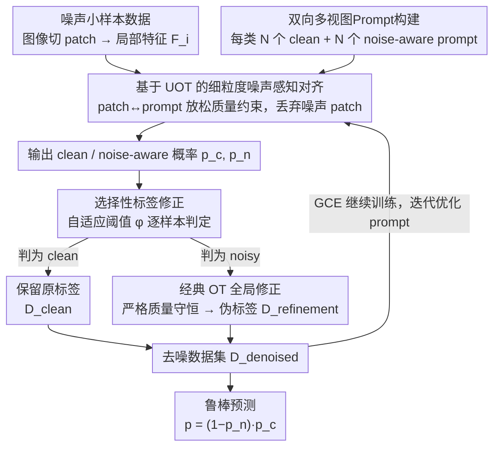

# Noise-Aware Few-Shot Learning through Bi-directional Multi-View Prompt Alignment

**会议**: CVPR 2026  
**arXiv**: [2603.11617](https://arxiv.org/abs/2603.11617)  
**代码**: 无  
**领域**: 多模态VLM  
**关键词**: 噪声标签, prompt learning, 最优传输, CLIP, 小样本学习

## 一句话总结

提出NA-MVP框架，通过双向（clean + noise-aware）多视图prompt设计配合非平衡最优传输（UOT）实现细粒度patch-to-prompt对齐，并用经典OT对识别出的噪声样本做选择性标签修正，在噪声小样本学习场景下持续超越SOTA。

## 研究背景与动机

CLIP等视觉-语言模型通过prompt learning可高效适配下游任务，在few-shot场景下尤为有效。然而当训练标签存在噪声时，由于每类仅有少量样本，即使少数错误标签也会不成比例地偏置梯度更新、引入虚假关联。

现有噪声prompt学习方法存在三大局限：

**Prompt表达力不足**：多数方法仅用1-2个prompt（如正/负对），单视角对齐无法捕捉多样化、细粒度的语义线索，难以有效区分clean和noisy信号

**显式负标签僵硬**：为每张图像分配一个硬负标签（指定某个反类），这种固定的反类信号在噪声环境下常不准确或无信息量，反而干扰优化

**去噪粗糙**：依赖固定置信度阈值或无选择性的伪标签机制，要么漏检噪声样本，要么误改正确标签，导致错误传播

**核心洞察**：鲁棒的噪声小样本学习需要从全局匹配转向**区域感知的细粒度对齐**——在图像patch级别自适应区分clean和noisy语义，同时以样本自适应（而非全局固定）的方式做标签修正。这需要解决三个子问题：(1) 如何在局部patch级别建模clean/noisy信号；(2) 如何灵活对齐而非强制全局匹配；(3) 如何选择性修正错标而不过度干预。

## 方法详解

### 整体框架

NA-MVP包含两个核心模块协同迭代：

- **噪声感知对齐模块**：为每个类构建多个clean-oriented和noise-aware prompt，通过UOT与局部图像patch做细粒度对齐，生成clean/noisy概率分布
- **选择性标签修正模块**：基于双向对齐信号导出自适应阈值，识别可能错标的样本，用经典OT（严格质量守恒）修正其标签

两个模块迭代更新训练集并优化prompt参数，最终产出去噪数据集 $\mathcal{D}_{\text{denoised}} = \mathcal{D}_{\text{clean}} \cup \mathcal{D}_{\text{refinement}}$ 用于鲁棒预测。

### 关键设计

**1. 双向多视图Prompt构建：用隐式负样本替代僵硬的显式负标签**

每个类 $k$ 构建两组可学习prompt：clean-oriented $\{Prompt_{m,k}^c\}_{m=1}^N$ 和 noise-aware $\{Prompt_{m,k}^n\}_{m=1}^N$（默认 $N=4$）。每个prompt由 $M$ 个可学习context token后接类别特定token组成：

$$Prompt_{m,k}^c = [V_1^c, V_2^c, \ldots, V_M^c, \texttt{CLS}_k]$$

Clean prompt负责捕捉类别相关的稳定语义，noise-aware prompt充当自适应过滤器来识别和抑制误导信号。关键地，非目标类全部作为隐式负样本，避免了显式负标签的僵硬问题——不需要指定某个特定反类，而是让所有非目标类自然地提供对比信号。

**2. 基于UOT的细粒度噪声感知对齐：放松质量约束，让噪声patch可被安全丢弃**

将局部图像特征 $F_i \in \mathbb{R}^{L \times d}$（$L = H \times W$ 个patch）和prompt特征 $G_k \in \mathbb{R}^{N \times d}$ 视为离散分布，用余弦相似度计算代价矩阵 $C_k = 1 - F_i G_k^\top$。

UOT的关键在于**放松严格质量守恒约束**：

$$\Pi(\mu, \nu) = \{T \in \mathbb{R}_+^{L \times N} \mid T\mathbf{1}_N \leq \mu, \; T^\top\mathbf{1}_L = \nu\}$$

注意 $T\mathbf{1}_N \leq \mu$ 是不等号，允许部分图像patch不被分配到任何prompt。这一放松天然适配噪声场景：噪声或不相关的patch无需强制对齐，可以被安全"丢弃"。通过Dykstra算法（Sinkhorn + 熵正则化）高效求解，得到最优传输计划 $T^* = \text{diag}(\mu^{(t)}) Q \text{diag}(\nu^{(t)})$。

**3. 选择性标签修正：样本自适应阈值 + 经典OT，只改该改的样本**

- **噪声识别**：计算样本与clean/noise-aware prompt的UOT距离得到相似度 $s_{i,k}^c$ 和 $s_{i,k}^n$，导出自适应阈值：

$$\phi_{i,k} = \frac{\exp(s_{i,k}^n / \tau)}{\exp(s_{i,k}^c / \tau) + \exp(s_{i,k}^n / \tau)}$$

当 $p_{ik}^c > \phi_{i,k}$ 时判为clean，否则判为noisy。这一阈值是样本自适应的，比DEFT的固定阈值 $0.5$ 更灵活。

- **标签修正**：对识别为noisy的样本，用经典OT（严格质量守恒）计算全局图像特征与类prompt特征的最优传输计划 $T^*$，取 $\tilde{y}_i = \arg\max_j T_{ij}^*$ 作为伪标签。严格质量守恒确保分配的全局合理性。

- **选择性策略**：仅修正 $p_{ik}^c < \phi_{i,k}$ 的样本，保留可信样本不变。这避免了全局伪标签方法在低噪声时误改正确标签的问题。

### 损失函数与训练策略

**两阶段训练**：

- **早期阶段**（前 $T_{sup}$ 个epoch）：在noisy数据上训练，使用 $\mathcal{L}_{sup} = \mathcal{L}_{gce} + \lambda_i \cdot \mathcal{L}_{itbp}$
    - GCE (Generalized Cross-Entropy)：对噪声标签天然鲁棒的损失函数
    - ITBP Loss：双向对比损失，鼓励图像特征与clean prompt对齐、远离noise-aware prompt，显式分离clean/noisy语义
- **后期阶段**：激活标签修正模块，在去噪数据集 $\mathcal{D}_{\text{denoised}}$ 上继续用GCE训练

**推理**：同时利用clean和noise-aware概率，$p(y=k|x_i) = (1 - p_{ik}^n) \cdot p_{ik}^c$

**实现**：SGD优化器（lr=0.002, momentum=0.9, weight_decay=5e-4），50 epochs，16个共享context token，ResNet-50 image encoder，单卡RTX 4090

## 实验关键数据

### 主实验：合成噪声下的对比（16-shot, 精度%）

| 数据集 | 方法 | Sym-25% | Sym-50% | Sym-75% | Asym-25% | Asym-50% |
|--------|------|---------|---------|---------|----------|----------|
| Caltech101 | CoOp | 81.03 | 70.90 | 46.90 | 75.23 | 49.43 |
| | NLPrompt | 91.13 | 89.93 | 86.70 | 91.17 | 89.27 |
| | **NA-MVP** | **92.10** | **91.30** | **89.37** | **91.47** | **89.53** |
| OxfordPets | CoOp | 66.73 | 47.03 | 24.60 | 66.20 | 38.73 |
| | NLPrompt | 86.00 | 83.17 | 70.77 | 84.97 | 77.53 |
| | **NA-MVP** | **88.40** | **88.13** | **86.23** | **87.53** | **79.33** |
| DTD | CoOp | 49.57 | 34.37 | 17.27 | 47.75 | 29.63 |
| | NLPrompt | 61.23 | 55.17 | 39.80 | 60.60 | 50.80 |
| | **NA-MVP** | **63.13** | **58.50** | **48.63** | **62.33** | **52.10** |
| Flowers102 | NLPrompt | 92.57 | 89.90 | 76.80 | 93.40 | 81.10 |
| | **NA-MVP** | **93.30** | **90.47** | 76.47 | 91.37 | 78.43 |

**关键发现**：NA-MVP在高噪声率（75% Sym）下优势最显著——OxfordPets上领先NLPrompt **+15.46%**（86.23 vs 70.77），说明框架在噪声严重时鲁棒性尤其突出。在Flowers102低噪声下与NLPrompt接近，优势主要体现在噪声较大的困难场景。

### 真实世界噪声（Food101N）

| 方法 | 4-shot | 8-shot | 16-shot | 32-shot |
|------|--------|--------|---------|---------|
| NLPrompt | 70.57 | 73.93 | 76.46 | 76.87 |
| **NA-MVP** | **76.10** | **76.27** | **76.90** | **77.03** |

4-shot下优势最大（+5.53），验证了噪声在极少样本时影响最大、NA-MVP的细粒度去噪机制此时获益最多。

### 消融实验（DTD, Sym噪声, 精度%）

| 配置 | 25% | 50% | 75% | 均值 |
|------|-----|-----|-----|------|
| (a) CoOp单prompt | 59.83 | 50.73 | 33.67 | 48.08 |
| (b) +显式负标签 | 59.53 | 52.53 | 34.40 | 48.82 |
| (c) +隐式双向 | 60.13 | 53.73 | 35.03 | 49.63 |
| (d) +多视图 | 62.73 | 55.13 | 37.63 | 51.83 |
| (e) +UOT对齐 | 62.50 | 57.70 | 42.33 | 54.18 |
| (f) +OT对齐 | 62.30 | 56.80 | 41.00 | 53.37 |
| (g) +KL散度对齐 | 62.27 | 56.43 | 39.10 | 52.60 |
| (h) +全局OT修正 | 59.60 | 54.77 | 45.77 | 53.38 |
| (i) +选择性修正(ϕ) | **63.13** | **58.50** | **48.63** | **56.75** |

**关键消融结论**：
- 隐式双向(c)优于显式负标签(b)，验证了隐式负样本设计更灵活
- UOT(e) > OT(f) > KL(g)，放松质量约束在噪声环境下优势明显（75%噪声下UOT领先OT 1.33%）
- 全局OT修正(h)在25%低噪声下反而伤性能（59.60 vs 无修正的62.50），因为误改正确标签；选择性修正(i)在所有噪声水平下都稳定提升

### vs DEFT对比（OxfordPets, Sym噪声, 精度%）

| 方法 | 12.5% | 25% | 37.5% | 50% | 62.5% | 75% |
|------|-------|-----|-------|-----|-------|-----|
| DEFT | 88.83 | 88.23 | 88.10 | 86.73 | 84.10 | 75.87 |
| **NA-MVP** | 88.50 | **88.40** | **88.23** | **88.13** | **86.93** | **86.23** |

DEFT在75%噪声下急剧下降（75.87），NA-MVP保持86.23（+10.36），自适应阈值 $\phi_{i,k}$ 相比DEFT的固定阈值0.5明显更鲁棒。

## 亮点与洞察

- **概念新视角**：将噪声鲁棒性重新定义为"区域感知的clean-noisy语义分解"，超越prior work的全局匹配范式
- **UOT的巧妙适配**：放松质量约束天然契合噪声场景——噪声patch无需强制对齐，可被安全"丢弃"
- **两种OT的互补**：UOT用于局部细粒度对齐（容忍噪声），经典OT用于全局标签修正（严格质量守恒保证分配合理性）
- 推理公式 $(1-p^n) \cdot p^c$ 简洁优雅，同时利用双视角信息
- prompt数量 $N=4$ 的分析揭示多视图的边际效益递减规律（$N=8$开始冗余）

## 局限性与可改进方向

- 仅在分类任务上验证，未扩展到检测、分割等更复杂视觉任务
- 仅用ResNet-50 backbone，未验证更强backbone（ViT-L/14等）下是否仍有优势
- UOT的Sinkhorn迭代引入额外计算开销，论文未详细讨论计算成本
- 噪声假设局限于对称/非对称标准模式，实际噪声可能更复杂（如instance-dependent noise）
- 多视图prompt最优数量 $N$ 可能依赖数据集特性，缺少自动选择机制

## 相关工作与启发

- **vs CoOp**：基础prompt learning，不考虑噪声，性能随噪声率急剧下降
- **vs NLPrompt**：用OT-Filter做噪声识别 + 全局OT重标注，属于粗粒度全局方法；NA-MVP通过patch级UOT + 自适应阈值实现更精细处理
- **vs PLOT**：PLOT用OT做多prompt对齐但针对clean数据，NA-MVP将其扩展为噪声感知的双向设计
- **vs CLIPN**：CLIPN用正/负prompt对做OOD检测，NA-MVP将双向思想迁移到噪声标签学习并加入多视图
- **启发**：UOT的"放松匹配"思想可迁移到目标检测噪声标注、医学图像不精确标注等场景；隐式负样本优于显式负标签的结论对对比学习普遍适用

## 评分

- 新颖性: ⭐⭐⭐⭐ 将UOT引入prompt-based噪声标签学习是新颖的，双向多视图设计有独到之处
- 实验充分度: ⭐⭐⭐⭐ 5个合成噪声数据集 + 1个真实噪声数据集，消融实验覆盖组件/对齐方式/prompt数/阈值策略
- 写作质量: ⭐⭐⭐⭐ 动机阐述清晰，三大局限总结到位，方法描述系统化
- 价值: ⭐⭐⭐⭐ 在噪声小样本学习这一实用场景下提供有效方案，高噪声下的大幅提升有实际意义

<!-- RELATED:START -->

## 相关论文

- [\[CVPR 2026\] Cluster-aware Anchor Learning for Multi-View Clustering](cluster-aware_anchor_learning_for_multi-view_clustering.md)
- [\[CVPR 2025\] NLPrompt: Noise-Label Prompt Learning for Vision-Language Models](../../CVPR2025/multimodal_vlm/nlprompt_noise-label_prompt_learning_for_vision-language_models.md)
- [\[CVPR 2026\] Improving Calibration in Test-Time Prompt Tuning for Vision-Language Models via Data-Free Flatness-Aware Prompt Pretraining](improving_calibration_in_test-time_prompt_tuning_for_vision-language_models_via_.md)
- [\[CVPR 2026\] Global-Graph Guided and Local-Graph Weighted Contrastive Learning for Unified Clustering on Incomplete and Noise Multi-View Data](global-graph_guided_and_local-graph_weighted_contrastive_learning_for_unified_cl.md)
- [\[CVPR 2026\] FedMPT: Federated Multi-Label Prompt Tuning of Vision-Language Models](fedmpt_federated_multi-label_prompt_tuning_of_vision-language_models.md)

<!-- RELATED:END -->
