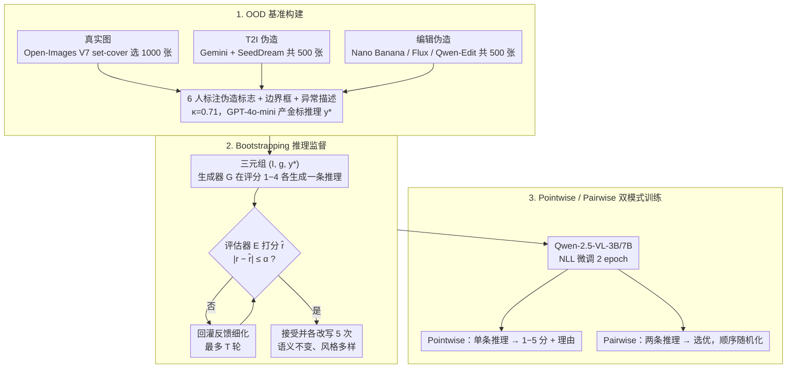

# Pixels Don't Lie (But Your Detector Might): Bootstrapping MLLM-as-a-Judge for Trustworthy Deepfake Detection and Reasoning Supervision

**会议**: CVPR 2026  
**arXiv**: [2602.19715](https://arxiv.org/abs/2602.19715)  
**代码**: 有（数据集、模型、代码均已开源）  
**领域**: 多模态VLM  
**关键词**: Deepfake Detection, Reasoning Supervision, MLLM-as-a-Judge, Visual Forensics, Bootstrapping, VLM Evaluation

## 一句话总结

提出 DeepfakeJudge 框架，通过 bootstrapped generator-evaluator 流程将人类标注的推理监督扩展为大规模结构化评分数据，训练出 3B/7B 视觉语言模型作为 deepfake 检测推理质量的自动评判者，在 pointwise 和 pairwise 评估上均达到与人类高度一致的水平。

## 研究背景与动机

**生成模型进步带来威胁**：Stable Diffusion、DALL·E 2、Imagen 等扩散/Transformer 模型生成的合成图像已接近真实，传统基于频域不一致或眨眼模式的检测方法在现代生成管线面前失效。

**分类准确率不够，需要可解释推理**：现有 deepfake 检测器仅关注分类准确率，但可靠的检测需要可解释且视觉可溯源（visually grounded）的推理，已有方法（如 SIDA、FakeShield）的文本解释常常与视觉证据脱节或存在幻觉。

**VLM 过度依赖文本先验**：研究表明视觉语言模型倾向于依赖文本先验和世界知识，而非真正观察图像内容，导致推理不可靠（例如即使图像中牛只有三条腿也预测四条腿）。

**传统文本指标无法衡量推理质量**：BLEU、ROUGE、METEOR、BERTScore 等指标只捕捉词汇重叠或语义相似度，无法评估推理的事实性和视觉溯源性，与人类判断相关性差。

**缺乏 OOD 基准**：现有数据集（FaceForensics++、DFDC）主要针对老一代生成模型，缺少对最新文本生成图像和图像编辑伪造的测试。

**缺乏推理监督的可扩展方案**：人类标注推理成本昂贵、难以大规模扩展，需要一种方法将有限的人类标注高效放大为大规模训练数据。

## 方法详解

### 整体框架

DeepfakeJudge 要解决的不是「图是不是假的」这个二分类，而是更难的「检测器给出的推理到底靠不靠谱」。它分三步搭起一套可信评判体系：先构建一个覆盖最新 T2I 和编辑伪造的 OOD 基准并收集人类推理标注；再用一个 generator-evaluator 互相迭代的 bootstrapping 流程，把少量人类标注放大成覆盖多个评分等级的大规模「推理-评分」数据；最后用这批数据微调 Qwen-2.5-VL-3B/7B，训出能对推理质量打分的「评委」，支持 pointwise（单条评分）和 pairwise（两两选优）两种模式。

### 关键设计

**1. OOD 基准构建：专挑现有检测器没见过的新伪造**

老基准（FaceForensics++、DFDC）大多针对上一代生成模型，撑不起对最新伪造的评测。DeepfakeJudge 自建数据：真实图像从 Open-Images V7 用 seeded stochastic greedy set-cover 算法挑 1000 张多样性样本；T2I 伪造从 diffusion prompt 库里筛真实感摄影类 prompt、经 GPT-4o-mini 修正后由 Gemini 和 SeedDream 各生成 250 张（共 500）；编辑伪造则对 800 张真实图生成标题与编辑指令，交给 Gemini-Nano Banana、Flux-Kontext-Max、Qwen-Edit-2509 三个模型各生成约 167 张（共 500）。6 名标注员对 1500 张伪造图标注伪造标志、边界框和异常描述，Cohen's κ = 0.71 说明一致性高。

**2. Bootstrapping 推理监督：用少量人类标注「滚雪球」出多等级数据**

人类标注推理太贵、扩不了量，于是让模型自举。对每个（图像 $I$、标签 $g$、金标推理 $y^*$）三元组，生成器 $G$ 在评分等级 $r \in \{1, \ldots, 4\}$ 下各生成一条推理；评估器 $E$ 给它打分 $\hat{r}$ 并反馈，若 $|r - \hat{r}| \le \alpha$ 就接受，否则把反馈回灌生成器细化，最多迭代 $T$ 轮直到评分对上。所有通过验证的推理（含金标）再各改写 5 次，保证风格多样但语义不变（BERTScore 0.92、BLEU 0.39），防止评估器靠记语言模式作弊。这样一条人类标注就能滚出一组从高到低、质量连续递降的推理样本，正好教会评委区分「好推理」和「差推理」。

**3. Pointwise / Pairwise 双模式训练：既能打分也能选优**

为了对齐人类的两种判断习惯，模型训成两副本领。Pointwise 模式接收（图像、标签、推理），输出 1-5 分加理由；Pairwise 模式接收（图像、标签、推理 A、推理 B），输出更优的一条，且选项顺序随机化以消除位置偏差。基座用 Qwen-2.5-VL-3B 和 7B，各训练 2 个 epoch。

### 损失函数

训练用标准负对数似然（NLL），对目标序列逐 token 自回归建模：

$$\mathcal{L}(\theta) = -\frac{1}{M}\sum_{i=1}^{M}\sum_{j=1}^{|t_i|}\log P_\theta(t_{i,j} \mid t_{i,<j}, I_i, g_i, y_i)$$

其中 $t_{i,j}$ 是第 $i$ 个样本目标序列的第 $j$ 个 token，$M$ 为样本数。

## 实验

### 主要结果

**Deepfake 检测（Table 1）**：在 DeepfakeJudge-Detect OOD 基准上评估 15+ 模型：

| 模型类型 | 代表模型 | Overall Acc | Fake F1 |
|---------|---------|-------------|---------|
| 闭源 | Gemini-2.5-Flash | 65.5% | 50.0 |
| 闭源 | ChatGPT-4o-mini | 59.3% | 35.8 |
| 开源 | Qwen-3-VL-235B | **74.5%** | **68.4** |
| 推理增强 | Qwen-3-VL-235B-Thinking | 63.7% | 79.8 |
| 专用检测器 | SIDA-13B | 48.1% | 34.5 |

**Pointwise 评估（Table 3）**：在 DeepfakeJudge-Meta-Human 上：

| 模型 | RMSE ↓ | Pearson ↑ |
|------|--------|-----------|
| Gemini-2.5-Flash | 1.11 | 0.83 |
| GPT-4o-Mini | 0.81 | 0.86 |
| Qwen-3-VL-235B-Thinking | 0.95 | 0.86 |
| **DeepfakeJudge-3B** | **0.56** | **0.95** |
| **DeepfakeJudge-7B** | **0.50** | **0.95** |

**Pairwise 评估（Table 4）**：

| 模型 | Meta Acc | Meta-Human Acc |
|------|----------|----------------|
| Gemini-2.5-Flash | 91.7% | 94.2% |
| Qwen-3-VL-235B | 93.2% | 99.4% |
| **DeepfakeJudge-7B** | **96.2%** | **98.9%** |

### 消融与发现

1. **传统指标失效**：所有模型的 BLEU-3 均 < 0.1，ROUGE-2 < 0.06，与人类判断几乎不相关，证实了传统文本指标无法评估推理质量。
2. **Bootstrapping 有效性**：BERTScore/BLEU 分析验证了 bootstrapped 数据确实产生了线性递降的评分质量等级（Figure 5）。
3. **小模型超越大模型**：DeepfakeJudge-3B/7B 在 pointwise 和 pairwise 评估上均显著超越 30 倍大的 Qwen-3-VL-235B 等模型。
4. **推理与检测正相关**：检测准确率最高的模型（Qwen-3-VL-235B）也获得了最高的 DeepfakeJudge 推理评分（3.59），说明视觉溯源推理与检测性能密切相关。
5. **用户研究**：10 名参与者中 70% 偏好 DeepfakeJudge 生成的推理（vs. Qwen-235B 20%、SIDA 5%、GPT-4o-mini 5%），binomial test p ≈ 0.015 具有统计显著性。

## 亮点

- **首个将推理保真度（reasoning fidelity）作为可量化维度引入 deepfake 检测**，超越了单纯的分类准确率评估。
- **Bootstrapping 流程高效**：仅需有限人类标注即可生成覆盖多评分等级的大规模监督数据，且通过改写确保多样性。
- **小模型大效果**：3B/7B 模型在评估任务上击败 30× 更大的模型，显示了领域特化微调的巨大潜力。
- **数据集设计全面**：同时覆盖 T2I 和编辑伪造、OOD 和 in-distribution、检测和推理评估，形成完整评测体系。
- **完全开源**：数据集、模型、代码全部公开，便于社区复现和扩展。

## 局限性

- 推理监督依赖 GPT-4o-mini 生成金标推理，引入了闭源模型的偏差和风格倾向，可能限制泛化性。
- OOD 数据集虽涵盖多种生成模型，但仅约 1000+924 张图像，规模偏小，可能不足以代表真实场景的多样性。
- Bootstrapping 需要高质量人类标注作为种子，成本仍然不低（6 名标注员标注 1500 张图像）。
- 仅评估了基于 Qwen-2.5-VL 的基座模型，未探索其他架构（如 InternVL、LLaVA）是否可获得更好效果。
- 缺乏对视频 deepfake 的处理，仅限于静态图像场景。

## 相关工作

- **Deepfake 检测**：从早期频域/眨眼模式 → CNN/RNN 学习 → Transformer/扩散检测器，本文在检测之上增加了推理评估维度。
- **可解释性方法**：SIDA、GenBuster++、FakeShield 尝试生成文本解释但存在幻觉，本文提出 VLM-as-Judge 直接从图像评估推理质量。
- **LLM-as-Judge**：借鉴 NLP 中 LLM 作为自动评估器的范式，扩展到多模态领域，结合视觉输入评估推理溯源性。
- **评测基准**：不同于 FaceForensics++、DFDC 等仅关注分类的基准，本文同时评估检测与推理两个维度。

## 评分

- **新颖性**: ⭐⭐⭐⭐ — 首次系统性地将推理保真度引入 deepfake 检测，bootstrapping 人类标注的思路具有启发性
- **实验充分度**: ⭐⭐⭐⭐ — 15+ 模型的全面对比、pointwise/pairwise 双模式评估、用户研究，但数据集规模偏小
- **写作质量**: ⭐⭐⭐⭐ — 结构清晰，图表丰富，问题动机阐述充分
- **价值**: ⭐⭐⭐⭐ — 开源且填补了推理质量评估的空白，对可解释 deepfake 检测有实际推动作用

<!-- RELATED:START -->

## 相关论文

- [\[CVPR 2026\] ADSeeker: A Knowledge-Grounded Reasoning Framework for Industry Anomaly Detection and Reasoning](adseeker_a_knowledge-grounded_reasoning_framework_for_industry_anomaly_detection.md)
- [\[ICLR 2026\] Zero-shot HOI Detection with MLLM-based Detector-agnostic Interaction Recognition](../../ICLR2026/multimodal_vlm/zero-shot_hoi_detection_with_mllm-based_detector-agnostic_interaction_recognitio.md)
- [\[CVPR 2026\] Beyond Weak Supervision: MLLMs-Guided Graded Knowledge Distillation for Unsupervised Camouflaged Object Detection](beyond_weak_supervision_mllms-guided_graded_knowledge_distillation_for_unsupervi.md)
- [\[ICCV 2025\] Calibrating MLLM-as-a-Judge via Multimodal Bayesian Prompt Ensembles](../../ICCV2025/multimodal_vlm/calibrating_mllm-as-a-judge_via_multimodal_bayesian_prompt_ensembles.md)
- [\[CVPR 2026\] Geometrically-Constrained Agent for Spatial Reasoning](geometrically-constrained_agent_for_spatial_reasoning.md)

<!-- RELATED:END -->
