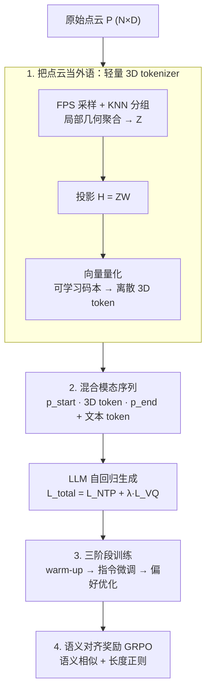

# Point Cloud as a Foreign Language for Multi-modal Large Language Model

**会议**: CVPR 2026  
**论文**: [CVF Open Access](https://openaccess.thecvf.com/content/CVPR2026/html/Paul_Point_Cloud_as_a_Foreign_Language_for_Multi-modal_Large_Language_CVPR_2026_paper.html)  
**代码**: https://github.com/snehaputul/SAGE3D  
**领域**: 多模态VLM / 3D视觉  
**关键词**: 3D MLLM, 编码器无关, 点云 tokenizer, 向量量化, GRPO 偏好优化

## 一句话总结
SAGE 是首个**无需预训练 3D 编码器**的端到端 3D 多模态大模型：它用一个轻量「3D tokenizer」把原始点云通过几何采样 + 向量量化离散成 token，像「外语」一样直接扩进 LLM 词表，再配一套语义对齐奖励的 GRPO 偏好优化，在 3D 描述/分类/问答上超过依赖大编码器的 PointLLM、ShapeLLM，同时推理快 2.3 倍、对点云分辨率变化更鲁棒。

## 研究背景与动机
**领域现状**：把 LLM 扩展到 3D 理解（3D MLLM）的主流范式是「编码器依赖」——先用一个预训练 3D 编码器（如 Point-BERT）把点云抽成几何特征，再用一个投影模块把特征塞进 LLM 的输入空间，代表作是 PointLLM、ShapeLLM、3D-LLaVA。

**现有痛点**：这种「大编码器 + 投影」的设计有三个绕不开的毛病。(1) **语义错位**：3D 编码器是用自监督/对比损失训出来的，优化目标是「几何可区分性」而不是「语言对齐」，抽出来的 embedding 和 LLM 的语言空间天生不兼容，一层简单投影根本桥不过去；而且它假设你手里有大规模预训练编码器，对数据稀缺的领域不现实。(2) **分辨率失配**：编码器假设固定输入点数（Point-BERT 是 8192 点），但真实点云密度千差万别——稠密点云被强行下采样会丢细节，稀疏点云被上采样会引入几何伪影。(3) **计算开销**：庞大的 3D 编码器必须先把点云跑完才能让 LLM 开始生成，拖慢推理。

**核心矛盾**：编码器带来的表征能力，和它造成的「语义错位 + 分辨率僵化 + 推理拖累」是捆绑出现的；只要还用预训练编码器，这三个问题就压不下去。

**本文目标**：能不能干脆**扔掉预训练编码器**，让 3D 表征和 LLM 联合端到端学出来？注意「encoder-free」不等于「无参数」——tokenizer 仍有少量可学习参数，但远小于一个完整编码器。

**切入角度**：2D 视觉里有现成思路——把图像切 patch 直接投影进 LLM（Fuyu、EVE），或用 VQ tokenizer 把图像离散成 token。但这些方法**搬不到 3D**：点云没有规则网格拓扑，patch 化会丢掉局部几何结构和点间空间关系，而这些恰恰是 3D 理解的根基。

**核心 idea**：把点云当成一门「外语」——设计一个轻量 3D tokenizer，先用几何采样保住局部结构，再用向量量化把连续几何特征离散成一套有限的「3D 词」，作为 LLM 词表的自然延伸；同时为描述性（不可验证）的 3D 问答专门设计语义对齐奖励，把 GRPO 强化学习引进来提升复杂推理。

## 方法详解

### 整体框架
SAGE（Spatial-Aware GEnerative model）的目标是：给定原始点云 $P \in \mathbb{R}^{N\times D}$（$D=6$ 含 xyz+rgb）和一个自然语言问题 $q$，端到端生成文本回答，全程不碰预训练 3D 编码器。整条链路是「点云 → 轻量 tokenizer 离散成 3D token → 与文本 token 拼成混合序列 → LLM 自回归生成」，而模型能力靠一套三阶段训练逐步炼成，最后用语义对齐奖励的 GRPO 把描述性推理拉上去。

下图把架构（tokenizer 内部三步）和训练流程串在一起：

### 关键设计

**1. 把点云当外语：轻量 3D tokenizer**

这是全文的地基，直接针对「语义错位 + 计算开销」两个痛点：与其用一个大编码器抽特征再硬投影，不如训一个小 tokenizer 把点云**离散成 token、当词表用**，让 LLM 自己在语言空间里学怎么理解它。tokenizer 内部分三步。第一步是**几何采样与分组**：对稠密点云先用最远点采样（FPS）选出 $N_s$ 个代表性中心点，每个中心用 KNN 找 $K_g$ 个最近邻组成局部子云，再经一个局部几何聚合模块——把点特征投到几何特征空间、加上相对位置编码、对每个子云做全局最大池化——得到紧凑潜表征 $Z \in \mathbb{R}^{M\times d_g}$。这一步保住了「点间局部几何与相对空间关系」，正是 patch 化做不到的。第二步**投影**到语言空间：$H = ZW \in \mathbb{R}^{M\times d_{llm}}$。第三步**向量量化**：用一个可学习码本 $C=\{e_k\}_{k=1}^{C}$ 把每个连续特征 $h_i$ 映到最近码字，

$$q(h_i)=\arg\min_k \lVert h_i - e_k\rVert_2^2,\quad H_q=\{e_{q(h_i)}\}_{i=1}^{M}$$

于是连续几何特征被离散成有限词表里的「3D 词」。论文里 $N_s=512$、$K_g=81$、码本大小 8192。VQ 这一步是「外语」隐喻能落地的关键：它把几何表征强行对齐到一套可枚举的离散原语，让 LLM 能像处理子词一样处理它们，而不是面对一团连续向量。

**2. 混合模态序列与端到端联合目标**

量化后的 3D token 不再需要任何额外对齐模块，**直接和文本 token 拼接**成一条混合序列喂给 LLM：

$$[\langle\text{p\_start}\rangle,\, e_{q(h_1)},\dots,e_{q(h_M)},\, \langle\text{p\_end}\rangle,\, w_1,\dots,w_L]$$

其中 $\langle\text{p\_start}\rangle$、$\langle\text{p\_end}\rangle$ 是专门新增的特殊 token，用来在语言流里圈出点云片段的边界。因为 VQ 的 $\arg\min$ 不可导，训练用 VQ 损失绕过去：

$$L_{VQ}=\underbrace{\lVert \text{sg}[H]-H_q\rVert_2^2}_{\text{码本损失}}+\beta\underbrace{\lVert H-\text{sg}[H_q]\rVert_2^2}_{\text{承诺损失}}$$

$\text{sg}[\cdot]$ 是停止梯度算子：前项推码本向投影特征靠拢，后项约束投影别飘离码本（论文 $\beta=0.25$）。整个框架端到端优化总目标 $L_{total}=L_{NTP}+\lambda L_{VQ}$（$\lambda=0.5$），$L_{NTP}$ 是只在回答 token 上算的下一 token 预测损失。这个设计的妙处在于：3D 表征和语言生成共享同一套梯度，码本会**自然涌现出既符合几何又对齐语言语义的离散 3D 原语**，从根上消解了「编码器目标≠语言目标」的错位。

**3. 三阶段训练流程**

光有架构不够，作者把训练拆成三段、各管一件事，避免新初始化的 tokenizer 和 LLM 一上来互相干扰。**阶段一 3D tokenizer 预热**：在 3D 描述数据上，只联合训练 tokenizer 模块 + LLM 前四层 transformer（其余冻结），用下一 token 预测目标，专门把几何 token 的 embedding 对齐到语言表征空间、稳住早期多模态交互。**阶段二指令微调**：解冻整个模型（tokenizer + LLM），用多模态指令-回答对端到端微调，强化跨模态推理和指令遵循。**阶段三偏好优化**：在前两阶段之上，用下面设计 4 的 GRPO 把描述性 3D 推理进一步拉高。值得注意的是只有偏好优化版叫 SAGE，去掉它的标准两阶段版叫 SAGE→——作者两个都报，用来分离「编码器无关架构本身的收益」和「偏好优化额外带来的收益」。

**4. 语义对齐奖励驱动的 GRPO 偏好优化**

痛点很具体：GRPO/GRPO 这类 RL 方法原本靠「可验证奖励」——数学题对错能拿标准答案比，但 3D 问答的回答是**描述性**的，同一个物体可以有多种措辞都正确，没有唯一标准答案，验证式奖励直接失效。作者为此造了一个连续、可解释的复合奖励。对每个（问题，点云）对，模型采样一组 $m$ 个候选回答 $\{y_i\}$，逐个和参考回答 $y_{ref}$ 比。**语义项**用预训练句编码器（Sentence-BERT）$E(\cdot)$ 编码后算余弦相似度：

$$s_i^{(sem)}=\frac{E(y_i)\cdot E(y_{ref})}{\lVert E(y_i)\rVert_2\,\lVert E(y_{ref})\rVert_2}$$

它奖励「意思接近参考」的回答，哪怕用词不同。**长度项**防止回答过短或过长：

$$s_i^{(len)}=\exp\!\left(-\frac{(L_i-L_{ref})^2}{2\sigma^2}\right)$$

在 $L_i=L_{ref}$ 时取最大、随长度偏差平滑衰减。复合奖励 $s_i=\gamma\, s_i^{(sem)}+(1-\gamma)\,s_i^{(len)}$（$\gamma=0.95$，语义为主）。拿到组内分数后做组内归一化优势 $A_i=(s_i-\bar s)/\sqrt{\frac1m\sum_j(s_j-\bar s)^2+\epsilon}$，GRPO 目标为 $L_{GRPO}=-\frac1m\sum_i A_i\log\pi_\theta(y_i\mid q,P)$，让组内相对更好的回答概率被抬高。GRPO 还省掉了 PPO 那种显式奖励模型，用模型自身似然推相对偏好，训练更稳更省。这一步把「描述性、不可验证」的开放式 3D 推理也纳进了 RL 优化范围。

## 实验关键数据

骨干用 LLaMA（从 Vicuna-7B v1.1 初始化），4×H100，训练数据是 PointLLM 的 730K 点-文本对（660K Objaverse 物体 + 70K GPT-4 合成复杂指令）。评测覆盖 3D 描述（Objaverse）、3D 开放词表分类、3D 问答（MM-Vet）。

### 主实验

| 任务 / 指标 | PointLLM-13B | ShapeLLM-13B | SAGE-7B→ | SAGE-7B | SAGE-13B |
|------|------|------|------|------|------|
| 描述 GPT-4 | 48.15 | 48.94 | 49.05 | 50.98 | **52.87** |
| 描述 Sentence-BERT | 47.91 | 48.52 | 49.23 | 50.11 | **51.91** |
| 描述 BLEU-1 | 3.83 | – | 7.41 | 9.50 | **9.72** |
| 描述 ROUGE-L | 7.23 | – | 10.25 | 12.66 | **13.25** |
| 分类 GPT-4 | 54.00 | 54.00 | 55.71 | 57.11 | **58.48** |
| VQA (MM-Vet) GPT-4 | 46.60 | 53.10 | 46.38 | 49.53 | **54.89** |

- 即便是**没有偏好优化**的 SAGE-7B→，描述 GPT-4（49.05）也已超过依赖大编码器的 PointLLM/ShapeLLM，BLEU-1（7.41 vs 3.83）几乎翻倍——说明离散 3D token 带来了更精准的语言对齐。
- 加上偏好优化的 SAGE 全面再上一台阶，13B 描述 GPT-4 比 ShapeLLM-13B +3.93、分类 +4.48、VQA +1.79。

### 效率与鲁棒性

| 模型 | 延迟 (ms)↓ | 吞吐 (样本/s)↑ |
|------|------|------|
| PointLLM-7B | 239 | 4.2 |
| SAGE-7B | **100** | **10.0** |

- 8K 点、H100 上，SAGE 推理延迟比 PointLLM 快 **2.3 倍以上**、吞吐 2.4 倍——直接源于扔掉了重型几何编码器的预处理阶段。
- **分辨率鲁棒性**（图 4，2K/4K/8K 点）：PointLLM 因固定输入分辨率，低分辨率输入要上采样、性能骤降；SAGE 天然支持变分辨率，低分辨率下只有轻微掉点，且 token 变少时吞吐还从 10.0 升到 11.0。

### 关键发现
- **编码器无关本身就赢**：SAGE→在同等训练协议下就已超过编码器方法，作者据此论证「预训练 3D 编码器与 LLM 输入空间的特征错位太大，一层投影桥不过去」，而联合学出的离散 tokenizer 表征空间更连贯。
- **偏好优化对复杂任务增益最大**：SAGE 相对 SAGE→的提升在描述/VQA 这类描述性任务上尤其明显，印证语义对齐奖励确实补上了「不可验证回答」的 RL 空白。
- **骨干泛化**：方法在 7B/13B 上一致提升，且不绑定特定 3D 编码器，跨 LLM 骨干迁移更自由。

## 亮点与洞察
- **「点云当外语」从隐喻落到实现**：很多工作口头说「视觉是另一种语言」，但 SAGE 用 VQ + 可学习码本真的把点云离散成了 LLM 词表的延伸，且专门论证了 2D 的 patch 化为何在 3D 失效（丢局部几何）——这个「为什么不能直接搬 2D」的论证很有价值。
- **为描述性任务造连续奖励**：把 GRPO 从「可验证数学题」搬到「开放式 3D 描述」，靠 Sentence-BERT 语义相似 + 高斯长度奖励，是一个可复用到任何「答案非唯一」生成任务（图像描述、对话、摘要）的奖励设计范式。
- **效率不是噱头而是动机**：扔掉编码器同时拿到 2.3× 加速 + 分辨率鲁棒，三个痛点（错位/分辨率/开销）被一个设计同时解决，因果链很干净。

## 局限与展望
- **仍依赖参考回答**：语义对齐奖励需要 $y_{ref}$，本质是「向参考靠拢」，在没有高质量参考的真·开放场景下奖励会失真；且 Sentence-BERT 的语义相似度本身有上限，可能奖励「读着像」但事实错误的回答。
- **码本与超参敏感**：码本大小 8192、$N_s=512$、$K_g=81$ 等是经验设定，论文把敏感性分析放在附录，正文未展开；码本利用率/坍缩问题（VQ 通病）未在正文讨论。
- **评测偏物体级**：训练/评测主要在 Objaverse 单物体点云，对场景级、室内大规模点云（多物体、空间关系密集）的泛化未验证。
- **改进方向**：把参考无关的奖励（如自一致性、事实校验）引入偏好优化；扩到场景级点云与具身/机器人下游任务，正是作者展望的「2D/3D/语言共享语言空间」的方向。

## 相关工作与启发
- **vs PointLLM / ShapeLLM**：它们是编码器依赖范式（预训练 3D 编码器 + 投影模块），SAGE 直接扔掉编码器、用联合训练的离散 tokenizer，区别在于「表征是外挂的还是和 LLM 一起长出来的」；SAGE 优势是无错位、快、抗分辨率，代价是 tokenizer 需要从头联合训练。
- **vs Fuyu / EVE（2D encoder-free）**：同样是编码器无关、把视觉投进 LLM，但它们靠 patch 化或简单投影，搬到 3D 会丢局部几何；SAGE 用 FPS+KNN+VQ 专门保住点云的空间结构。
- **vs ENEL（并发的 encoder-free 3D 工作）**：方向相同但 ENEL 的 tokenizer 参数量大，SAGE 强调「轻量」是它相对 ENEL 的卖点。
- **vs 标准 GRPO（数学推理）**：标准 GRPO 靠可验证奖励，SAGE 用语义对齐 + 长度复合奖励把它适配到描述性、答案非唯一的 3D 问答。

## 评分
- 新颖性: ⭐⭐⭐⭐⭐ 首个端到端编码器无关 3D MLLM，「点云当外语」+ 描述性任务 GRPO 两个点都有原创性
- 实验充分度: ⭐⭐⭐⭐ 三任务 + 效率 + 分辨率鲁棒都覆盖，SAGE→/SAGE 消融清晰；但场景级泛化、码本坍缩分析缺位
- 写作质量: ⭐⭐⭐⭐⭐ 痛点-动机-方法因果链很顺，公式与训练流程交代完整
- 价值: ⭐⭐⭐⭐⭐ 给 3D MLLM 提供了一条「无编码器 + 更快 + 更鲁棒」的可落地路线，奖励设计还能迁移到其他开放式生成任务

<!-- RELATED:START -->

## 相关论文

- [\[CVPR 2026\] VLM-Loc: Localization in Point Cloud Maps via Vision-Language Models](vlm-loc_localization_in_point_cloud_maps_via_vision-language_models.md)
- [\[CVPR 2026\] Multi-SpatialMLLM: Multi-Frame Spatial Understanding with Multi-Modal Large Language Models](multi-spatialmllm_multi-frame_spatial_understanding_with_multi-modal_large_langu.md)
- [\[CVPR 2026\] M3DocDep: Multi-modal, Multi-page, Multi-document Dependency Chunking with Large Vision-Language Models](m3docdep_multi-modal_multi-page_multi-document_dependency_chunking_with_large_vi.md)
- [\[CVPR 2025\] Generalized Few-Shot 3D Point Cloud Segmentation with Vision-Language Model](../../CVPR2025/multimodal_vlm/generalized_few-shot_3d_point_cloud_segmentation_with_vision-language_model.md)
- [\[ICCV 2025\] Exploiting Vision Language Model for Training-Free 3D Point Cloud OOD Detection](../../ICCV2025/multimodal_vlm/exploiting_vision_language_model_for_training-free_3d_point_cloud_ood_detection_.md)

<!-- RELATED:END -->
