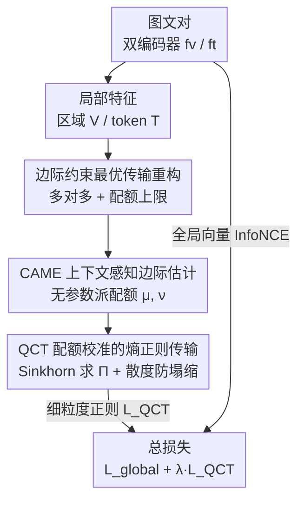

# Quota-Calibrated Fine-Grained Alignment with Context-Aware Marginals for Text-based Person Retrieval

**会议**: CVPR 2026  
**论文**: [CVF Open Access](https://openaccess.thecvf.com/content/CVPR2026/html/Li_Quota-Calibrated_Fine-Grained_Alignment_with_Context-Aware_Marginals_for_Text-based_Person_Retrieval_CVPR_2026_paper.html)  
**代码**: 待确认  
**领域**: 多模态VLM  
**关键词**: 文本-行人检索, 细粒度对齐, 最优传输, 边际约束, 即插即用正则

## 一句话总结
针对"文本-行人检索"里词与图像区域的细粒度对齐问题，本文提出无参数、即插即用的训练正则 QC-Align：用一个无参数的上下文感知边际估计器（CAME）给每个词/区域动态分配"匹配配额"，再用配额校准的熵正则最优传输（QCT，配 Sinkhorn 散度防塌缩）在配额约束下求解多对多对应，从而抑制注意力过度集中和误分配；它不需要细粒度标注、不增加推理开销，在三个主流基准上稳定涨点，尤其在小数据与跨域场景下提升更明显。

## 研究背景与动机

**领域现状**：文本-行人检索（Text-based Person Retrieval, TPR）要用一句自然语言描述从大规模图库里检索出对应的行人图像。主流做法是双编码器 + 对比学习，把图像和文本映射到共享嵌入空间做全局对齐，效率高、可扩展，但只对齐全局向量，缺乏对"文本短语 ↔ 视觉局部区域"的显式细粒度建模。

**现有痛点**：只做全局对齐会把判别性的局部线索抹平，模型容易过度依赖训练集里高频共现的属性线索，把匹配退化成粗粒度的属性相似度比较。论文 Fig.1 给的典型失败：查询"深色裤子"时，模型把注意力错误地分给了图中的深色背景或其他深色物体，而不是真正的裤子区域——这是一种"走捷径"（shortcut bias），对低频、组合性的细节（如"拿着几本笔记本""紫色裤子"）视而不见。

**核心矛盾**：已有的局部匹配方法有两个根本缺陷。其一，很多方法把对齐隐式建模成刚性的一对一匹配，忽略了现实里普遍存在的多对多语义对应——一个词可能关联多个候选区域，一个区域也可能对应多个词。其二，基于相似度或注意力的逐点分配机制只沿查询轴把权重归一化成概率分布，**没有显式约束每个词/区域能承载的"总匹配质量"**；于是在属性重叠、背景噪声下，匹配权重要么过度集中在少数词上，要么被错配到无关区域。启发式做法（如硬阈值截断）虽能临时压噪声，但靠不可微操作破坏梯度流、且阈值人工设定缺乏样本自适应性。

**本文目标**：在不依赖细粒度标注的前提下，同时（i）建模多对多语义对应，（ii）显式控制每个单元的匹配容量分配，学到鲁棒且可判别的细粒度对齐。

**切入角度**：作者把细粒度对齐重新形式化成**带边际约束的最优传输（OT）**问题——传输的行/列边际天然就是"每个单元能承载多少匹配质量"的容量上限。但标准 OT 常用均匀边际（假设所有词/区域同等重要），这在实践里几乎不成立：两个模态都含冗余/非判别元素，均匀边际会把传输质量浪费到背景或无关属性上，导致退化解。

**核心 idea**：把"容量估计"和"传输分配"显式解耦——先用一个**无参数**的上下文感知模块（CAME）从跨模态交互中动态估计**非均匀**边际（即"匹配配额"），再在这些配额约束下用熵正则最优传输（QCT）求多对多对应。一句话：用"动态配额"取代"逐点归一/均匀边际"，让判别性强的区域拿到更高容量，同时显式防止权重过度集中或错配。

## 方法详解

### 整体框架

QC-Align 是挂在现有 TPR 双编码器上的**即插即用训练正则**，本身不引入任何可学习参数，也不改推理流程。给定一对图文样本，视觉编码器 $f_v$ 输出全局表示 $v_i^g$ 和 $N_i$ 个局部 patch 特征 $\mathbf{V}_i=\{v_i^n\}$，文本编码器 $f_t$ 输出全局表示 $t_i^g$ 和 $M_i$ 个 token 特征 $\mathbf{T}_i=\{t_i^m\}$。全局这一路照旧用 InfoNCE 做实例级对齐；细粒度这一路是本文的核心：先用 CAME 从跨模态上下文估计出非均匀边际配额 $\mu_i\in\Delta^{N_i}$（视觉侧）和 $\nu_i\in\Delta^{M_i}$（文本侧），再用 QCT 在这两个边际约束下求解传输矩阵 $\Pi_i\in\mathbb{R}^{N_i\times M_i}_{\ge 0}$，满足

$$\Pi_i\mathbf{1}_{M_i}=\mu_i,\qquad \Pi_i^\top\mathbf{1}_{N_i}=\nu_i$$

其中 $\mu_i[n]$、$\nu_i[m]$ 分别限制区域 $v_i^n$ 流出的总质量、token $t_i^m$ 流入的总质量，从而防止质量在少数单元上塌缩或泄漏到无关区域。最终训练目标是全局对比损失加上这条细粒度正则：$\mathcal{L}=\mathcal{L}_{\text{global}}+\lambda\mathcal{L}_{\text{QCT}}$。两路共享编码器参数，端到端训练，全程无需细粒度标注。

### 关键设计

**1. 把细粒度对齐重构成带边际约束的最优传输：用"配额上限"取代逐点归一**

这一步针对的痛点是：逐点相似度/注意力只沿查询轴归一化，无法控制单个词或区域能承载的总匹配质量，导致属性重叠/背景噪声下权重塌缩或错配。作者改为求一个样本级的传输矩阵 $\Pi_i$，并引入**非均匀边际配额** $\mu_i,\nu_i$ 作为行/列约束（见 Eq.5）。代价矩阵用余弦不相似度定义 $\mathbf{C}_i[n,m]=1-\frac{\langle v_i^n,t_i^m\rangle}{\|v_i^n\|\|t_i^m\|}$，目标是在可行传输集合 $\mathcal{U}(\mu_i,\nu_i)$ 上最小化总传输代价 $\min_{\Pi_i}\langle\Pi_i,\mathbf{C}_i\rangle$。和"逐点分配"或"剪枝低质量节点"不同，OT 把"该单元能匹配多少"做成可微的软约束（边际），既保留了多对多对齐的灵活性，又显式遏制权重过度集中——这是整套方法能成立的形式化基础。

**2. CAME：上下文感知边际估计——无参数地给每个词/区域派"配额"**

第 1 点提出要用非均匀边际，但配额从哪来？CAME 的回答是：一个单元的匹配容量应由它与跨模态上下文的语义一致性决定，且**整个估计过程不引入任何可学习参数**，只靠编码器特征间的相似度和注意力聚合。具体分三步：(a) **跨模态上下文聚合**——文本 token $t_i^m$ 对所有视觉区域做注意力得到上下文 $\tilde{t}_i^m=\sum_n\alpha_{mn}v_i^n$，注意力权重 $\alpha_{mn}=\text{softmax}_n(\phi(\cos(t_i^m,v_i^n)))$，其中 $\phi(\cdot)$ 用 leaky-ReLU 裁剪抑制负相似度、稳住注意力；视觉侧对称地得到 $\tilde{v}_i^n$。(b) **判别性打分**——计算每个单元与它聚合上下文的余弦相似度作为判别度 $r_i^m=\cos(t_i^m,\tilde{t}_i^m)$：与跨模态上下文越相关，说明它越被另一模态"关注"，越该拿高配额；再用数值稳定的 softmax（LSE 技巧）$\psi(\cdot)$ 把分数归一成重要性权重 $w_i^m$。(c) **边际生成**——把一个模态的重要性权重经注意力矩阵反投影到另一模态：视觉边际 $\mu_i[n]=\sum_m\alpha_{mn}\cdot w_i^m$，文本边际 $\nu_i[m]=\sum_n\beta_{nm}\cdot w_i^n$。这样被多个重要文本 token 关注（$\alpha_{mn}$、$w_i^m$ 都大）的区域自然拿到更高配额。由于是归一化注意力与权重的线性组合，$\mu_i,\nu_i$ 天然满足非负与归一约束。无参数设计降低了过拟合风险，而边际仍会通过传输目标的梯度被间接精炼。

**3. QCT：配额校准的熵正则传输 + Sinkhorn 散度防塌缩**

有了配额还要把传输解出来，而且要解得快、可微、不塌缩。精确解线性规划复杂度 $O((N_i+M_i)^3\log(N_i+M_i))$，对深度学习不现实，作者改用**熵正则**的 Sinkhorn 形式：$\Pi_i^*=\arg\min_{\Pi_i}\langle\Pi_i,\mathbf{C}_i\rangle-\epsilon H(\Pi_i)$，其中 $H(\Pi_i)=-\sum_{n,m}\Pi_i[n,m]\log\Pi_i[n,m]$，$\epsilon$ 控制传输矩阵的稀疏度；Sinkhorn 迭代靠交替缩放行列匹配目标边际，每次迭代仅 $O(N_iM_i)$。但直接最小化跨模态传输代价 $W_i^{\text{cross}}=\langle\Pi_i^*,\mathbf{C}_i\rangle$ 有个致命缺陷：模型可以把所有特征塌缩到一点来把代价压到最小，造成表示退化。为此作者改用 **Sinkhorn 散度**，减去模态内自传输代价做归一：

$$\mathcal{L}_{\text{QCT}}^i=W_i^{\text{cross}}-\tfrac{1}{2}\big(W_i^{\text{vv}}+W_i^{\text{tt}}\big)$$

其中 $W_i^{\text{vv}}$、$W_i^{\text{tt}}$ 是视觉内、文本内在均匀边际下各自的自传输代价，度量每个模态自身的"固有多样性基线"。减去它们后，$\mathcal{L}_{\text{QCT}}^i$ 只保留跨模态对齐特有的代价，从而逼模型去学判别性的跨模态对应、而不是把所有特征合并成相似表示这种平凡解。批内取均值得到 $\mathcal{L}_{\text{QCT}}$。整套 QCT 完全可微，CAME 与编码器都经由它联合优化。

### 损失函数 / 训练策略

总目标 $\mathcal{L}=\mathcal{L}_{\text{global}}+\lambda\mathcal{L}_{\text{QCT}}$：$\mathcal{L}_{\text{global}}$ 是全局表示 $(v_i^g,t_i^g)$ 上的 InfoNCE，保证实例级一致性；$\mathcal{L}_{\text{QCT}}$ 在 CAME 估计的边际下经传输计划 $\Pi_i$ 强化判别性局部对齐；$\lambda$ 平衡两个监督尺度。两个损失共享编码器参数，端到端训练，无需细粒度标注。所有 baseline 统一用 $\lambda=0.5$、Sinkhorn 熵 $\epsilon=0.5$；实验在单张 RTX 4090（24GB）上完成。

## 实验关键数据

数据集：CUHK-PEDES（40,206 图 / 13,003 身份）、ICFG-PEDES（54,522 图 / 4,102 身份）、RSTPReid（20,505 图 / 4,101 身份）；指标为 Rank-1/5/10 检索准确率。QC-Align 挂在两类骨干上验证：非 CLIP 类（SSAN、SCAN、CADA 等）与 CLIP 类（IRRA、BiLMa 等）。

### 主实验（RQ1）

QC-Align 作为即插即用模块，对全局对齐 baseline 和已含局部对齐的强 baseline 都能稳定涨点：

| 骨干 / 数据集 | 指标 | baseline | +QC-Align | 提升 |
|------|------|------|------|------|
| Baseline / CUHK-PEDES | R@1 | 57.19 | 59.87 | +2.68 |
| Baseline-CLIP / CUHK-PEDES | R@1 | 68.71 | 70.89 | +2.18 |
| Baseline / ICFG-PEDES | R@1 | 50.38 | 52.42 | +2.04 |
| Baseline-CLIP / ICFG-PEDES | R@1 | 59.37 | 61.52 | +2.15 |
| Baseline / RSTPReid | R@1 | 38.75 | 43.35 | +4.60 |
| Baseline-CLIP / RSTPReid | R@1 | 56.60 | 58.65 | +2.05 |
| IRRA / CUHK-PEDES | R@1 | 73.38 | 74.62 | +1.24 |
| CADA / CUHK-PEDES | R@1 | 78.37 | 79.31 | +0.94 |

三点观察：(1) 相对纯全局对齐 baseline，QC-Align 在所有数据集稳定涨点，说明配额校准的 OT 有效弥补了全局特征捕捉细粒度对应的不足；(2) 即便挂在已含局部对齐机制的 IRRA / CADA 上仍能进一步提升，说明配额感知的多对多对齐相对已有局部交互/属性解耦并不冗余；(3) 在小规模 RSTPReid 上提升最大（约 +4.6%），作者归因于数据稀缺时模型更易依赖浅层全局共现统计，而 QC-Align 强制在非均匀边际下做多对多对齐、逼模型关注判别性单元，从而增强低数据下的泛化。

### 消融实验（RQ2，Rank-1）

与五种代表性细粒度对齐策略及本文两个组件（SD = Sinkhorn 散度、CAME）逐一对比：

| 方法 | CUHK Baseline | CUHK CLIP | ICFG Baseline | ICFG CLIP | RSTP Baseline | RSTP CLIP |
|------|------|------|------|------|------|------|
| Baseline | 57.19 | 68.71 | 50.38 | 59.37 | 38.75 | 56.60 |
| +MLM | 59.03 | 69.46 | 51.47 | 59.84 | 41.25 | 57.15 |
| +SCAN | 58.69 | 67.79 | 51.38 | 58.59 | 42.05 | 54.80 |
| +UOT | 58.69 | 67.67 | 51.53 | 58.42 | 40.25 | 54.60 |
| +OT | 57.97 | 67.02 | 51.56 | 58.04 | 40.40 | 54.45 |
| +SD | 58.36 | 69.31 | 51.18 | 59.97 | 41.95 | 56.20 |
| +CAME | 59.02 | 69.49 | 51.75 | 60.36 | 42.35 | 57.45 |
| +QC-Align | **59.87** | **70.89** | **52.42** | **61.52** | **43.35** | **58.65** |

### 关键发现

- **已有方法存在架构依赖**：MLM 对两类架构都有效；但 SCAN 只在 CNN-based Baseline 上有效，在 CLIP 上反而掉点（CUHK -0.92、ICFG -0.78）；标准 OT 与 UOT 在 CLIP 上普遍退化。作者归因于 CNN 直接经全局池化优化局部 patch、局部特征天然对齐训练目标，而 Transformer 只监督聚合后的全局特征、局部特征是间接优化，强加显式局部对齐会破坏模态内局部一致性（标准 OT 因缺斥力把所有特征塌成相似表示）。
- **Sinkhorn 散度解决表示塌缩**：标准 OT 在 CLIP 上的退化表现为模态内/跨模态局部特征过度相似、丧失判别性（对给定查询近乎均匀地分注意力）。SD 通过减去模态内自传输代价做归一，阻止"合并全部特征"的平凡最小化，相对标准 OT 在 CLIP 上 CUHK +2.29、ICFG +1.93，恢复甚至超过 baseline。
- **CAME 贡献判别性配额**：SD 防塌缩之外，均匀边际仍无法反映区域/token 的重要性差异；CAME 动态估非均匀边际、给判别单元更高配额，单独叠在 OT 上即可在两类架构上额外涨点。完整 QC-Align（SD + CAME）在所有设置取得最佳。
- **缓解捷径偏置 / 跨域泛化（Table 3）**：可视化显示 Baseline-CLIP 过度依赖高频颜色词（"蓝外套""红衬衫"），忽略"紫裤子""拿着笔记本"等组合线索；QC-Align 把传输质量集中到判别性属性-区域对，注意力图更聚焦。跨数据集实验（CUHK↔ICFG 互为源/目标域）中，把 QC-Align 加到 IRRA/CADA 上 Rank-1 一致提升 1.62%–3.91%，例如 C→I 上 IRRA 42.63→44.74、CADA 51.37→53.68，验证其学到的语义更少依赖数据集偏置、更可迁移。
- **超参敏感性（RQ3）**：$\lambda\in\{0.1,0.3,0.5,1.0,2.0\}$ 时中等值最优（Baseline 在 $\lambda=0.5$ 达 59.87%，Baseline-CLIP 在 $\lambda=1.0$ 达 71.31%）；$\epsilon$ 在 $0.1\sim0.5$ 最佳，过大使传输矩阵过于模糊、过小早期易过拟合噪声。整体在较宽范围稳定涨点，且只在训练用、推理零开销。

## 亮点与洞察
- **"容量估计"与"传输分配"显式解耦**：把细粒度对齐拆成"先估配额（CAME）、再约束传输（QCT）"，比逐点归一/硬剪枝更可控——配额是可微软约束而非离散决策，避免了硬剪枝的梯度不稳与上下文丢失。这种"先定每个单元能承载多少、再求怎么分配"的范式可迁移到其他跨模态匹配任务。
- **无参数 + 零推理开销 + 不需细粒度标注**：CAME 完全靠编码器特征间的相似度/注意力算配额，QC-Align 整体是训练期正则，部署时直接去掉，工程上几乎零成本接入任何 TPR 双编码器。
- **Sinkhorn 散度作为防塌缩开关**：用"跨模态传输代价减模态内自传输代价"这一项，巧妙地把"只学跨模态对齐特有代价"显式化，定位并解决了标准 OT 在 Transformer 上塌缩这个具体失败，是消融里最关键的一块拼图。
- **小数据/跨域增益更大**这一现象有说服力：它把"细粒度结构化对齐 → 减少捷径依赖 → 更可迁移语义"这条因果链用跨域实验和注意力可视化串了起来。

## 局限与展望
- 作者展望把配额校准传输扩展到更广的跨模态理解任务，暗示目前只在 TPR 上验证。
- **依赖编码器特征质量**：CAME 无参数，配额完全由编码器输出的相似度/注意力决定；若骨干本身局部特征较差（如纯全局监督的 Transformer 局部特征是间接优化），配额估计的可靠性可能受限——这也解释了为何不同架构表现差异显著。
- **超参仍需调**：虽然 $\lambda,\epsilon$ 在较宽范围稳定，但最优值随架构变化（Baseline $\lambda=0.5$ vs CLIP $\lambda=1.0$），跨数据集/骨干迁移时仍需少量调参。
- **多对多对应缺乏直接量化评测**：方法主打多对多语义对齐，但评测仍是 Rank-k 检索准确率与定性可视化，缺少对"多对多对齐质量"本身的直接定量指标（如对齐正确率），⚠️ 以原文为准。

## 相关工作与启发
- **vs 逐点相似度 / 注意力对齐（如 SCAN）**：它们只沿查询轴归一化匹配权重，不约束每个单元能承载的总质量；本文用 OT 边际显式控制容量，避免权重塌缩，且在 Transformer 架构上更稳（SCAN 在 CLIP 上反而掉点）。
- **vs 显式一对一短语-区域匹配（依赖姿态估计/分割/预定义规则）**：刚性一对一假设无法刻画 TPR 里普遍的多对多、上下文依赖对齐，且对标注噪声敏感；本文用软边际约束保留多对多灵活性，且不需细粒度标注。
- **vs 标准 OT / UOT（均匀边际）**：均匀边际假设所有词/区域同等重要，会把传输质量分给背景/无关属性致退化解；本文用 CAME 估非均匀配额，把质量导向判别单元。消融显示标准 OT/UOT 在 CLIP 上普遍退化，而 QC-Align 一致提升。
- **vs 可学习门控剪枝低质量节点**：硬剪枝靠离散决策、易丢上下文且梯度不稳；本文把"匹配容量"建成可微软约束（边际），既抑制权重过集中又不破坏梯度流。

## 评分
- 新颖性: ⭐⭐⭐⭐ 把细粒度对齐重构成"配额校准 OT"、解耦容量估计与传输分配，且用 Sinkhorn 散度精准解决 Transformer 上的塌缩，思路清晰且有针对性。
- 实验充分度: ⭐⭐⭐⭐ 三数据集、两类骨干、与五种对齐策略逐组件消融、跨域泛化、超参敏感性都覆盖，论证较完整。
- 写作质量: ⭐⭐⭐⭐ 动机-公式-算法-消融环环相扣，失败案例（标准 OT 塌缩）与可视化讲得到位。
- 价值: ⭐⭐⭐⭐ 无参数、零推理开销、不需细粒度标注的即插即用正则，工程落地友好，小数据/跨域增益尤其实用。

<!-- RELATED:START -->

## 相关论文

- [\[CVPR 2026\] EagleNet: Energy-Aware Fine-Grained Relationship Learning Network for Text-Video Retrieval](eaglenet_energy-aware_fine-grained_relationship_learning_network_for_text-video_.md)
- [\[CVPR 2026\] Tackling Alignment Ambiguity in Person Retrieval through Conversational Attribute Mining](tackling_alignment_ambiguity_in_person_retrieval_through_conversational_attribut.md)
- [\[CVPR 2026\] Gravitation-Driven Semantic Alignment for Text Video Retrieval](gravitation-driven_semantic_alignment_for_text_video_retrieval.md)
- [\[CVPR 2026\] Camouflage-aware Image-Text Retrieval via Expert Collaboration](camouflage-aware_image-text_retrieval_via_expert_collaboration.md)
- [\[CVPR 2026\] Beyond Global Similarity: Multi-Conditional Retrieval for Fine-Grained Cross-Modal Understanding](beyond_global_similarity_multi-conditional_retrieval_for_fine-grained_cross-moda.md)

<!-- RELATED:END -->
