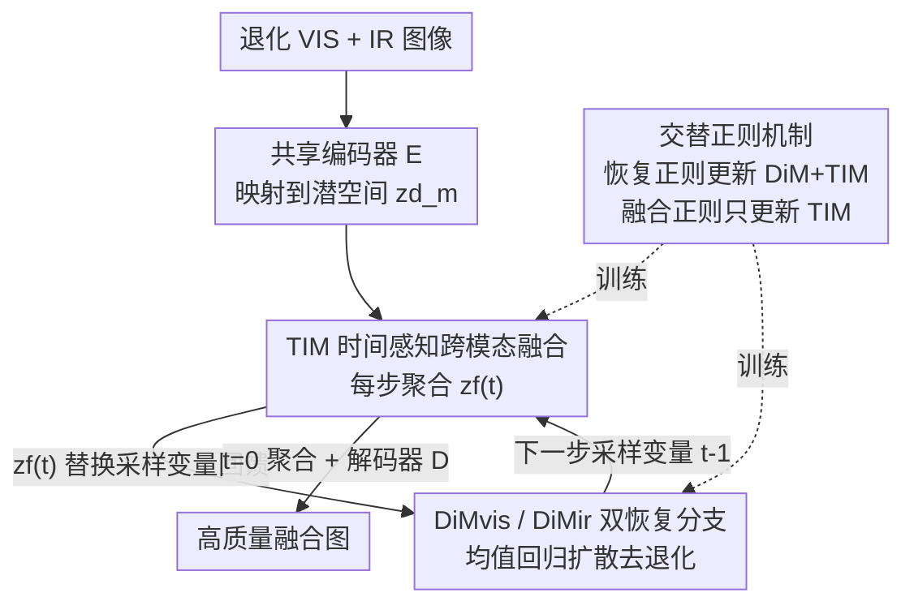

# ReCoFuse: Ultra-Robust Image Fusion via Restorative Multi-Modal Diffusion Reciprocal Coupling

**会议**: CVPR 2026  
**论文**: [CVF Open Access](https://openaccess.thecvf.com/content/CVPR2026/html/Zhang_ReCoFuse_Ultra-Robust_Image_Fusion_via_Restorative_Multi-Modal_Diffusion_Reciprocal_Coupling_CVPR_2026_paper.html)  
**代码**: https://github.com/HaoZhang1018/ReCoFuse  
**领域**: 图像融合 / 图像恢复 / 扩散模型  
**关键词**: 红外可见光融合, 鲁棒图像融合, 扩散模型, 跨模态恢复, 互惠耦合

## 一句话总结
ReCoFuse 把红外-可见光图像融合中的"信息恢复"和"信息融合"重新定义为互相增强的关系，用扩散模块（DiM）做双分支恢复、用时间感知跨模态融合模块（TIM）在每个采样步桥接两条分支并聚合出融合表征，使得低光/雾/噪声/条纹等复杂退化下也能产出干净高保真的融合图。

## 研究背景与动机

**领域现状**：多模态图像融合的目标是把可见光（VIS）的纹理颜色和红外（IR）的热目标信息整合成一张更完整的场景表示，广泛用于自动驾驶、智能安防。近年深度学习不断推高融合性能的上限。

**现有痛点**：真实采集的源图像常带各种退化——VIS 容易低光、有雾、有噪声，IR 容易低对比、条纹、噪声。一旦源图退化，大多数方法无法在特征层把"有效信息"和"退化因子"区分开，融合结果直接继承了退化，画质很差；当两个模态同时严重退化、互补性下降时，只盯着"融合"这一步的主流方法甚至会彻底失效。

**核心矛盾**：问题的根本在于**如何定义"信息恢复"与"信息融合"两者的关系**。现有鲁棒融合分两条路线，各有死穴：
- **集成式硬回归范式**（MRFS、Text-IF、ControlFusion）：用一个端到端模型隐式地同时学"去退化+融合"，靠干净参考图做硬监督。但这要同时学多种退化的跨域映射、又要适配各场景高度异质的信息保留需求，隐式回归难度极大，结果常残留退化、场景表达不全。
- **解耦优化范式**（OmniFuse、BA-Fusion、DDBF）：把恢复和融合拆成两个独立模块顺序优化。问题是恢复阶段各模态各干各的，**无法借助另一模态的互补线索**去清除严重退化；而且两个模块割裂，恢复与融合之间适配性差，形成性能瓶颈。

**本文目标**：打破恢复与融合之间的壁垒，让两者在"跨任务+跨模态"两个维度上深度耦合。

**切入角度**：作者主张把恢复和融合看成**互相强化（mutually reinforcing）**——融合聚合出的跨模态信息能帮每条恢复分支更好地去退化，而被恢复得更干净的分支又能让融合产出更好的图。

**核心 idea**：提出**互惠耦合优化范式（reciprocal coupling）**，用一个在每个扩散采样步都介入的桥接模块 TIM，把双分支扩散恢复和跨模态融合编织进同一个回环，让"恢复"和"融合"互为对方的输入。

## 方法详解

### 整体框架

ReCoFuse 在潜空间里搭一套"扩散恢复 + 跨模态融合"的互惠耦合机制。先用一个**共享编码器 $E$** 把退化源图 $I^d_m$（$m$ 为模态、$d$ 为退化类型）映射成潜特征和中间特征 $\{z^d_m, h_m\}=E(I^d_m)$，这里沿用了 OmniFuse 的跨模态特征重组机制，把主场景信息和退化属性集中到潜特征 $z^d_m$ 里。随后在潜空间用两条**扩散模块 DiM**（DiMvis / DiMir）分别建模两个模态的恢复先验。

关键在于：单模态扩散在严重复杂退化下会丢大量场景信息，恢复力不够。于是作者在 DiM 的**每一个采样时间步**都插入一个 **TIM（时间感知跨模态融合模块）**，把两条分支当前的采样变量融合成一个聚合变量 $z^d_f(t)$。这个聚合变量身兼两职：一方面**回馈**给两条恢复分支、替换它们各自的采样变量去做下一步噪声估计（借跨模态互补提升去退化）；另一方面在 $t=0$ 时被解码成最终的高质量融合图。最后用一个**交替正则机制**沿梯度路径轮流优化 DiM 和 TIM，保证恢复与融合稳定协同。

### 关键设计

**1. 互惠耦合优化范式：把恢复和融合从"先后/并联"改成"互为输入"的回环**

这是全文的范式级创新，针对的是硬回归"学不动"、解耦"各干各的"两个死穴。在每个时间步 $t$，TIM 先把两条分支的采样变量融合成聚合变量 $z^d_f(t)=\text{TIM}(z^d_{vis}(t), z^d_{ir}(t), t)$。然后做两件事：其一，**用 $z^d_f(t)$ 替换原采样变量**喂回两条分支去估计下一步，即 $\{z^d_{vis}(t-1), z^d_{ir}(t-1)\}=\{\text{DiM}_{vis}(z^d_f(t),t), \text{DiM}_{ir}(z^d_f(t),t)\}$——这意味着每条分支去噪时都在共享对方模态的信息，互补性直接灌进了去退化过程；其二，在 $t=0$ 把聚合变量反映射为融合图 $I_f=D(z^d_f(t), h_f),\ t=0$。

之所以有效，是因为它给"信息融合"提供了一个全新视角：**正是恢复所必需的跨模态互补，驱动了高质量融合图的生成**。TIM 充当桥梁，把两个任务接成一个相互增强的闭环——融合帮恢复看到更多场景信息，恢复又让融合输入更干净，二者随采样步逐步互相抬升。

**2. TIM 时间感知跨模态融合：在每个扩散步桥接双分支并校正反向轨迹**

这是范式的具体载体，要解决"怎么在扩散过程中实时融合且不破坏恢复轨迹"。DiM 本身用 IR-SDE 的**均值回归随机微分方程**建模恢复：前向过程 $dz^d_m=\theta_t(\mu_m - z^d_m)\,dt + \sigma_t\,d\omega$，系统随时间收敛到以退化图 $\mu_m$ 为中心的高斯分布；反向过程加上 score 项把样本推回高密度区。在 $\sigma_t^2/\theta_t = 2\lambda^2$ 设定下，边缘分布有闭式高斯解，conditional score 可由重参数化写成 $\nabla \log p_t = -\epsilon_t / \sqrt{v_t}$，于是去噪器 $DN_m$ 训练去估计噪声 $\hat\epsilon_{mt}=DN_m(z^d_f(t), t)$。

TIM 的做法是先生成两个时变权重把采样变量加权融合：$z^d_f(t)=w_{vis}(t)\odot z^d_{vis}(t) + w_{ir}(t)\odot z^d_{ir}(t)$，权重反映每个时间步两模态的相对重要性。关键创新在于它**改造了标准 SDE 的反向漂移项**，让从聚合变量出发的单步欧拉积分能精确命中各模态的理想目标：

$$\text{Drift}_{f\to m}(z^d_f(t), \hat\epsilon_{mt}) = \underbrace{\theta_t(\mu_m - z^d_f(t))}_{\text{基线漂移}} + \underbrace{\sigma_t^2 \frac{\hat\epsilon_{mt}}{\sqrt{v_t}}}_{\text{跨模态校正}}$$

第一项是基线漂移（把 $z^d_f(t)$ 当作模态 $m$ 的近似当前状态），第二项是**跨模态校正项**，保证从 $z^d_f(t)$ 出发的单步积分能落到理想目标 $\tilde z^d_m(t-1)$。下一步状态由一次欧拉积分得到 $z^d_m(t-1)=z^d_f(t) - \text{Drift}_{f\to m}\cdot \Delta t$。结构上（见原文 Fig.3）TIM 用注意力计算器 + CBAM + 傅里叶时间嵌入实现，时间嵌入让融合权重随采样进程自适应——这也是消融里 Model III 去掉时间嵌入会掉点的原因。

**3. 交替正则机制：分而治之又协同，逼近理想鲁棒融合函数**

恢复正则和融合正则的梯度流会在 TIM 处汇合，若放任不管两个目标会互相干扰。作者设计两个正则项交替优化：
- **信息恢复正则** $L^{I2R}_m$：用贝叶斯后验算出理想的下一步状态 $\tilde z^d_m(t-1)$（Eq.13 给出最大似然估计的闭式解），让预测值逼近它，$L^{I2R}_m = \sum_t \mathbb{E}\big[\lVert z^d_f(t) - \text{Drift}_{f\to m}\cdot\Delta t - \tilde z^d_m(t-1)\rVert\big]$。这一步同时更新 DiM 和 TIM 的参数，保证聚合变量足够支撑每条分支做准确反向推断。
- **信息融合正则** $L_F = L_{texture} + L_{contrast} + L_{color}$：纹理项取两模态梯度的逐点最大、对比项取亮度的逐点最大、颜色项让 Cb/Cr 分别对齐 VIS/IR 的干净图。施加这个正则时**只让 TIM 可训练、冻结 DiM**。

为什么这样有效：作者从优化角度论证（Fig.5），理想鲁棒融合函数 $g^*=\arg\min_g L_{RIF}$ 复杂度太高，硬回归范式难求；解耦范式只能分别求 $r^*, f^*$ 再拼成 $g^*=\langle r^*, f^*\rangle$，但子任务各自最优不保证整体最优。交替正则一方面借两个子任务的先验**简化**优化，另一方面让两者通过共享的 TIM **协同**，从而比解耦更逼近 $g^*$。

### 损失函数 / 训练策略
训练用 Lion 优化器、初始学习率 $3\times 10^{-5}$，在两张 NVIDIA Tesla P100-PCIE-16GB 上完成。数据由 MFNet、FMB、LLVIP 三个公开红外-可见光数据集合并而成，每个场景含一对退化的 IR/VIS 图及其干净参考（作监督），共 1,980 对训练、每个数据集 100 对测试。整体损失即上面的恢复正则 + 融合正则，按交替正则机制轮换施加。

## 实验关键数据

### 主实验
在 MFNet / FMB / LLVIP 三个数据集上对比 9 个 SOTA 融合方法（U2Fusion、LRRNet、Diff-IF、SHIP、CrossFuse、DCEvo、MRFS、Text-IF、OmniFuse），用 SD、MI、EN、CC、SCD、VIF 六个客观指标。对比设两种策略：ext.（给只做融合的方法外挂 InstructIR/ASCNet/Restormer 等恢复网络）和 re.（在本文数据集上重训）。下表摘取 MFNet 上的代表性结果：

| MFNet 指标 | ReCoFuse | Diff-IF(ext.) | DCEvo(ext.) | Text-IF(re.) | OmniFuse(ext.) |
|------|----------|---------------|-------------|--------------|----------------|
| SD↑ | **48.473** | 46.662 | 47.524 | 46.640 | 27.226 |
| MI↑ | **3.114** | 2.884 | 2.814 | 2.464 | 2.144 |
| EN↑ | **7.305** | 7.191 | 7.239 | 7.277 | 6.568 |
| CC↑ | **0.527** | 0.482 | 0.490 | 0.525 | 0.457 |
| SCD↑ | **1.381** | 1.131 | 1.181 | 1.345 | 0.846 |
| VIF↑ | 0.660 | 0.764 | 0.744 | 0.788 | 0.448 |

ReCoFuse 在三个数据集大多数指标上拿到最优或次优。定性上（Fig.6/Fig.7）即便给对比方法预先增强，复杂退化下它们仍残留退化、热目标偏弱；ReCoFuse 能干净去退化并充分利用跨模态互补。作者也指出：即便有干净标签，简单回归没有针对性设计依然做不到鲁棒融合。

**泛化性**：在真实退化数据集 AWMM-100k（雪+雾场景）上测 20 对图（Table 2），ReCoFuse 在 SD（44.469）、EN（7.296）、VIF（0.650）上领先，去雾且保留远近热行人。

### 消融实验
消融见 Table 3，分恢复和融合两部分。Model I 把 TIM 完全去掉只留 DiM 单独恢复；Model II–VIII 围绕融合的关键设计逐项替换：

| 配置 | 关键指标 | 说明 |
|------|---------|------|
| Full Model (Re. VIS) | PSNR 25.205 / FID 19.226 | 完整模型恢复可见光 |
| Model I（仅 DiM, Re. VIS） | PSNR 24.512 / FID 19.916 | 去掉 TIM，跨模态互补缺失，恢复变差 |
| Full Model (Re. IR) | PSNR 33.294 / FID 25.074 | 完整模型恢复红外 |
| Model I（仅 DiM, Re. IR） | PSNR 33.084 / FID 39.190 | IR 的 FID 明显恶化 |
| Full Model (Fus.) | SD 48.473 / MI 3.114 / SCD 1.381 | 完整模型 |
| Model II（晚融合） | SD 48.321 / MI 3.083 | TIM 移出采样步、采样后独立训融合 |
| Model III（TIM 去时间嵌入） | MI 2.464 / CC 0.523 | MI 大幅下降 |
| Model IV（分离优化） | CC 0.485 / SCD 1.145 | 先恢复后冻 DiM 调 TIM |
| Model V（联合优化） | SD 46.684 / MI 2.972 | DiM+TIM 用恢复+融合损失联合训 |
| Model VI（解耦交替优化） | SD 41.005 / MI 2.000 / VIF 0.428 | 冻一个更一个，内容严重受损 |
| Model VII（替换对比损失） | MI 2.436 | 天空出现异常光照阴影 |
| Model VIII（替换纹理损失） | SD 46.215 / MI 2.458 | 细节丢失、显著性降低 |

### 关键发现
- **TIM 是恢复增益的来源**：去掉 TIM（Model I）后两个模态恢复都变差，尤其 IR 的 FID 从 25.074 飙到 39.190，印证"跨模态互补能提升去退化能力"这一核心论点。
- **时间嵌入很关键**：Model III 去掉时间嵌入后 MI 从 3.114 掉到 2.464，说明融合权重需要随采样进程自适应。
- **交替正则不可替代**：联合优化（Model V）、纯解耦交替（Model VI）都明显劣于完整模型，Model VI 甚至 SD 跌到 41.005、VIF 仅 0.428，验证了"分而治之 + 共享 TIM 协同"的设计价值。
- **下游语义增益**：在目标检测（Table 4）上 ReCoFuse 的 Precision 0.983、mAP@.75 0.718、mAP@.5:.95 0.625 均最优；语义分割（Table 5）mIoU 57.67 最高，说明融合图保留了更有用的语义信息。

## 亮点与洞察
- **范式重定义最有价值**：把"恢复 vs 融合"从"谁先谁后/谁辅助谁"升级为"互为输入的闭环"，这是 idea 层面的突破，而不只是堆模块。聚合变量同时回馈恢复又导出融合，一个变量两用，设计很优雅。
- **在扩散反向漂移里插跨模态校正项**很巧妙：它没有破坏 IR-SDE 的均值回归结构，而是给标准漂移加一个跨模态修正，让"从融合态出发的单步积分仍能命中各模态理想轨迹"——这是把多任务耦合落到扩散数学层面的关键 trick，可迁移到其他"多分支扩散需要共享中间态"的场景。
- **冻结策略有讲究**：恢复正则更新两者、融合正则只更新 TIM，等于让 DiM 专注恢复、TIM 兼顾桥接与融合，避免融合损失把恢复分支带偏。这种"按梯度路径分阶段解冻"的训练思路值得借鉴。

## 局限与展望
- **采样成本**：方法在每个扩散时间步都跑一次 TIM 并双分支去噪，推理开销大概率高于单次前向的融合网络；论文未给推理速度/显存对比，实际部署成本存疑。
- **依赖干净参考**：训练需要每个场景的干净 IR/VIS 参考图做监督，真实世界很难拿到成对干净标签，限制了在无配对干净数据场景的扩展。
- **退化类型有限**：实验聚焦低光/雾/噪声/低对比/条纹这几类，对运动模糊、压缩伪影、传感器失真等组合退化的鲁棒性未验证。
- **VIF 指标偶有不占优**：MFNet 上 VIF（0.660）低于若干对比方法，说明在"视觉信息保真度"这一维度仍有取舍，互惠耦合并非在所有指标上全面碾压。

## 相关工作与启发
- **vs 集成式硬回归（MRFS / Text-IF / ControlFusion）**：它们用单一端到端模型隐式同时学恢复+融合并靠干净 GT 硬监督，难度大、易残留退化；ReCoFuse 改用扩散显式建模恢复、再用 TIM 桥接融合，把"隐式难学"换成"显式可耦合"。
- **vs 解耦优化（OmniFuse / BA-Fusion / DDBF）**：它们把恢复和融合拆成顺序的两段，恢复阶段无法借跨模态互补；ReCoFuse 复用了 OmniFuse 的特征重组与扩散纯化思路，但把"先恢复后融合"改成"每步互惠耦合"，让互补信息直接进入去退化过程，这是与 OmniFuse 最本质的区别。
- **vs IR-SDE**：ReCoFuse 直接用其均值回归 SDE 作为 DiM 的去噪核心，创新点不在扩散本身，而在用 TIM 的跨模态校正漂移把两条 IR-SDE 分支耦合起来。

## 评分
- 新颖性: ⭐⭐⭐⭐⭐ 首次把图像融合的恢复-融合关系定义为互惠耦合，范式级创新且落到了扩散漂移项的具体数学。
- 实验充分度: ⭐⭐⭐⭐ 三数据集 + 两评测策略 + 泛化 + 检测/分割下游 + 8 个消融，较全面；缺推理开销对比。
- 写作质量: ⭐⭐⭐⭐ 范式对比图和优化分析清晰，公式推导完整；部分符号略密集。
- 价值: ⭐⭐⭐⭐ 复杂退化下鲁棒融合对自动驾驶/安防有实用价值，思路可迁移到其他多分支扩散耦合任务。

<!-- RELATED:START -->

## 相关论文

- [\[CVPR 2026\] Multi-Modal Image Fusion via Intervention-Stable Feature Learning](multi-modal_image_fusion_via_intervention-stable_feature_learning.md)
- [\[CVPR 2026\] CICA: Coupling Confidence-Aware Pretraining with Confidence-Informed Attention for Robust Multimodal Sentiment Analysis](cica_coupling_confidence-aware_pretraining_with_confidence-informed_attention_fo.md)
- [\[CVPR 2026\] Multi-Hierarchical Contrastive Spectral Fusion for Multi-View Clustering](multi-hierarchical_contrastive_spectral_fusion_for_multi-view_clustering.md)
- [\[CVPR 2026\] VideoFusion: A Spatio-Temporal Collaborative Network for Multi-modal Video Fusion](videofusion_a_spatio-temporal_collaborative_network_for_multi-modal_video_fusion.md)
- [\[CVPR 2026\] Beyond Sequential Tools: A Unified VLM Agent System for Photographic Post-Processing via Dynamic Multi-Expert Fusion](beyond_sequential_tools_a_unified_vlm_agent_system_for_photographic_post-process.md)

<!-- RELATED:END -->
