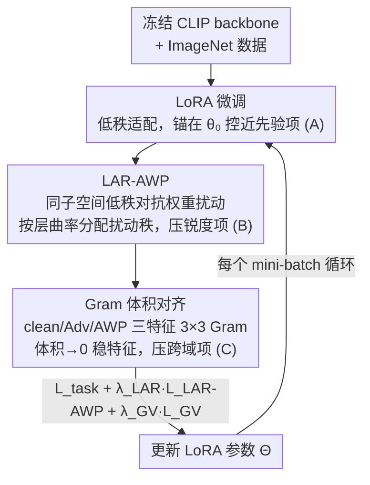

# The Geometry of Robustness: Optimizing Loss Landscape Curvature and Feature Manifold Alignment for Robust Finetuning of Vision-Language Models

**会议**: CVPR 2026  
**arXiv**: 无  
**论文**: [CVF Open Access](https://openaccess.thecvf.com/content/CVPR2026/html/Chopra_The_Geometry_of_Robustness_Optimizing_Loss_Landscape_Curvature_and_Feature_CVPR_2026_paper.html)  
**代码**: 无  
**领域**: 多模态VLM  
**关键词**: 鲁棒微调, CLIP, 损失曲率, 对抗鲁棒, 特征流形对齐

## 一句话总结
本文从几何视角把 VLM 鲁棒微调"ID 精度 / OOD 泛化 / 对抗鲁棒"三难困境的根因归结为参数空间的尖锐各向异性极小值和扰动下变形的特征流形，提出 GRACE 框架：用逐层自适应低秩对抗权重扰动压平损失曲率、再用 Gram 体积对齐损失稳住特征流形，在 ImageNet 上微调 CLIP 时三个轴同时改善（ID 74.2%、OOD 57.0%、对抗 22.4%）。

## 研究背景与动机
**领域现状**：CLIP、ALIGN 这类 VLM 是强大的通用特征提取器，zero-shot 迁移能力强、对自然分布偏移也有一定鲁棒性。但一旦下游微调，可靠性就被一个三难权衡卡住：要同时做好 ① 域内（ID）精度、② 自然/合成分布偏移（OOD）泛化、③ 抵抗梯度对抗攻击。现有鲁棒微调方法最多只能照顾其中两个轴。

**现有痛点**：作者把现有方法实证地分成两派且都"偏科"。S1 泛化派（WiSE-FT、TPGM、SPD、FLYP 等，靠保守适配/权重正则/文本锚定）保住了 ID/OOD，但对标准 $\ell_p$ PGD 攻击几乎是 0% 鲁棒；S2 对抗派（TeCoA、FARE、PMG-AFT 等，靠对抗训练）提升了 PGD 鲁棒，却让 ID 和 OOD 明显掉点，甚至在 ImageNet-A/A-Plus 这种自然对抗样本上更差。

**核心矛盾**：作者的关键洞察是——这个权衡不是调超参就能解决的"伪问题"，而是不同优化目标重塑了模型底层几何。理论与几何分析揭示三个耦合失效：(i) 微调权重大幅偏离预训练 $\theta_0$；(ii) 尖锐、各向异性的极小值（高参数空间复杂度）；(iii) 特征流形在分布偏移下变形，导致 clean / OOD / 对抗输入之间的特征对齐崩塌。

**本文目标**：在一个统一框架内同时控制参数空间曲率（推向更平坦、更低复杂度的解）和特征空间不变性（让类结构在输入扰动和权重扰动下都稳定），从而首次把 ID–OOD–Adv 三个轴一起做好。

**切入角度 / 核心 idea**：在 Robust PAC-Bayes 理论下，把鲁棒风险拆成"近预训练先验 + 参数空间锐度 + 跨域特征差异"三项，再用工程模块逐项压住——用低秩 LoRA 控先验邻近、用曲率自适应的对抗权重扰动压锐度、用 Gram 体积对齐压跨域差异。

## 方法详解
GRACE（Gram-aligned Robustness via Adaptive Curvature Estimation）的设计完全由它的理论分析驱动：先证明一个 Robust PAC-Bayes 界把鲁棒风险 $R_{\text{Rob}}(\theta)$ 上界拆成可观测的三项，再为每一项配一个工程模块去压。理解 GRACE 的关键是先看这个界。

界（Theorem 3.1）的形式是：
$$R_{\text{Rob}}(\theta) \le \hat{R}_{\text{ID}}(\theta) + \underbrace{\frac{\lVert\theta-\theta_0\rVert^2}{2n\sigma^2}}_{\text{(A) 近先验}} + \underbrace{\frac{\sigma^2}{2}\mathrm{Tr}(\mathbb{E}[\nabla^2_\theta R_{\text{Rob}}])}_{\text{(B) 参数空间锐度}} + \underbrace{\max_{s,t\in S} d_{\mathcal{H}\Delta\mathcal{H}}(D_s,D_t)}_{\text{(C) 跨域差异}} + \lambda^*$$

其中 $S=\{\text{ID, OOD, Adv}\}$。作者据此预言：只优化其中一部分的方法会有可预测的失效——缺 (A) 就漂离预训练流形、zero-shot 退化；缺 (B) 就落到尖锐极小值、对抗脆弱；缺 (C) 就特征不稳、OOD 退化。Table 1/4 的实证验证了这套"缺啥坏啥"的预言。

### 整体框架
输入是冻结的 CLIP backbone + ImageNet 训练数据，输出是一组训练好的低秩 LoRA 适配器（推理时合并回主干，无额外开销）。三个模块各压一项：LoRA 微调压 (A)，逐层自适应低秩 AWP（LAR-AWP）压 (B)，Gram 体积对齐压 (C)。每个 mini-batch 的训练循环是：算 clean 特征与任务损失 → 生成 PGD 对抗样本 → 在低秩子空间做几步对抗权重扰动（受曲率课程指导）→ 用 clean/Adv/AWP 三种特征算 Gram 对齐损失 → 用合并损失更新 LoRA 参数。

总目标是三项加权：
$$\mathcal{L}_{\text{GRACE}} = \mathcal{L}_{\text{task}} + \lambda_{\text{LAR}}\,\mathcal{L}_{\text{LAR-AWP}} + \lambda_{\text{GV}}\,\mathcal{L}_{\text{GV}}$$
其中 $\mathcal{L}_{\text{task}}$ 是标准交叉熵。

### 关键设计

**1. LoRA 微调：把适配限在预训练权重附近，天然压住 KL 近先验项**

针对失效 (A)——对抗训练类方法漂离 $\theta_0$ 太远导致 zero-shot 崩塌（实测 TeCoA 相对漂移 0.47、zero-shot 只剩 38.75%，而 WiSE-FT 漂移 0.08、zero-shot 60.40%；漂移与 zero-shot 退化的 Pearson 相关达 $-0.82$）。GRACE 只在冻结主干上训练低秩适配器：对每个权重矩阵 $W\in\mathbb{R}^{n_1\times n_2}$，$W(\theta)=W(\theta_0)+B_W A_W$，秩 $r\ll\min(n_1,n_2)$，只有 $\{A_W,B_W\}$ 可训。这把适配参数约束在 $\theta_0$ 周围一个很小的仿射子空间里，直接控住界里的 $\mathrm{KL}(Q\Vert P)$ 项。它的妙处是：LoRA 在这里不只是省参数的工程手段，而是被赋予了"几何邻近正则"的理论角色——后面的对抗扰动也复用这同一个低秩子空间，三个模块共享几何。

**2. 逐层自适应低秩对抗权重扰动（LAR-AWP）：哪层弯就重点压哪层**

针对失效 (B)——尖锐各向异性极小值带来对抗脆弱（WiSE-FT 顶 Hessian 特征值 $\lambda_{\max}=3.3\times10^3$、对抗精度 0%）。普通 AWP 对所有层施加相同强度的扰动，但 VLM 的 Hessian $\nabla^2 R$ 是高度各向异性的，逐层特征值差异很大，均匀扰动并不划算。LAR-AWP 在同一个 LoRA 低秩子空间里加一条对抗扰动支路 $W_{\text{pert}}=W(\theta_0)+B_WA_W+B_{\text{AWP}}A_{\text{AWP}}$，并让扰动秩 $r_{\text{AWP}}$ 随该层曲率自适应：曲率越大的层给越高的秩。曲率怎么估？精确 Hessian 太贵，作者借 Sophia 的做法用 mini-batch 一阶梯度估 Hessian 对角迹——$h_W\approx n_v\,g_W\odot g_W$（$g_W$ 是交叉熵梯度），再对 $h_W$ 维护指数滑动平均、按曲率百分位给各层分配扰动秩（最高百分位拿最大秩，平坦层只给最小秩，构成一个"曲率课程"）。训练时内层做几步梯度上升求最坏扰动：
$$\mathcal{L}_{\text{LAR-AWP}}\approx\frac{1}{n}\sum_i \max_{\lVert\delta_i\rVert_p\le\epsilon,\ \lVert\Delta\rVert\le\rho} \mathcal{L}\big(F_{W_{\text{pert}}(\theta,\Delta)}(x_i),y_i\big)$$
外层再最小化 $\mathcal{L}_{\text{task}}+\lambda_{\text{LAR}}\mathcal{L}_{\text{LAR-AWP}}$，逼模型不仅在 $\theta$ 处、也在权重扰动邻域里都表现好，从而收敛到更平坦的极小值（GRACE 实测 $\lambda_{\max}=1.6\times10^3$，比无正则方法低一半）。把扰动锁在低秩子空间 + 按曲率分秩，是它能压锐度却不像标准 AT 那样狠掉 ID/OOD 精度的关键。

**3. Gram 体积对齐损失：把同一样本的 clean/对抗/扰动三态特征逼到一处**

针对失效 (C)——跨域 $\mathcal{H}\Delta\mathcal{H}$ 散度对神经网络不可计算。作者先给它一个特征空间上界（Lemma 3.2）：$d_{\mathcal{H}\Delta\mathcal{H}}(D_s,D_t)\le 2L_f\sum_c\pi_c(\lVert\mu_s^c-\mu_t^c\rVert^2+\sqrt{\mathrm{Tr}(\Sigma_s^c-\Sigma_t^c)^2})$，把域差异落到"类质心对齐 + 协方差稳定"这两个可观测量上。落地时再用 Gram 体积当可微代理：取同一样本 $i$ 在 clean、对抗、LAR-AWP 扰动三种状态下的 $\ell_2$ 归一化图像特征 $f_{\text{ID}},f_{\text{Adv}},f_{\text{AWP}}\in\mathbb{R}^D$，拼成 $3\times3$ Gram 矩阵 $G_i$（元素是两两内积，加 $\varepsilon I$ 保数值稳定），定义
$$\mathcal{L}_{\text{GV}}=\sqrt{\lvert\det(G_i)\rvert}$$
$\mathcal{L}_{\text{GV}}$ 几何上是三个特征向量张成的平行六面体体积：三者越接近（流形稳定）体积越趋于 0，扰动把特征推向发散方向时体积变大。它逐样本地把"clean=对抗=扰动"绑在一起，同时因为是逐样本约束、不强行拉近不同类，所以保住类间分离。这把抽象的跨域散度变成了一个 $3\times3$ 行列式，便宜又可导。

### 训练策略
每个 mini-batch 交替五步（见整体框架）。关键超参是 LoRA 秩 $r$、AWP 扰动半径 $\rho$、PGD（10 步、$\ell_\infty$ 半径 $4/255$、步长 $1/255$）、以及两个损失权重 $\lambda_{\text{LAR}},\lambda_{\text{GV}}$；曲率分数用 $h_W$ 的 EMA 维护。推理时 LoRA 合并回主干，无额外推理开销。

## 实验关键数据

主干为 CLIP ViT-B/32，在 ImageNet-1K 上微调；OOD 测 ImageNet-V2/-S/-R，自然对抗测 ImageNet-A/A-Plus，合成对抗用 AutoAttack（APGD-CE，$\epsilon=4/255$），另有 8 个数据集做 zero-shot。

### 主实验（统一对比，Table 6）

| 方法 | ID | OOD Avg | 对抗 Avg | 调和均值 |
|------|----|---------|----------|----------|
| CLIP（zero-shot） | 63.35 | 57.44 | 8.82 | 20.46 |
| Vanilla FT | 74.86 | 56.59 | 8.95 | 21.01 |
| WiSE-FT（S1 泛化派） | 70.20 | **58.05** | 9.04 | 21.11 |
| TeCoA（S2 对抗派） | 52.54 | 37.96 | 17.48 | 29.24 |
| PMG-AFT（对抗派最强 baseline） | 58.20 | 43.40 | 19.57 | 32.85 |
| **GRACE（本文）** | **74.21** | 57.01 | **22.44** | **39.69** |

GRACE 是唯一一个 ID、OOD、对抗三列都不"偏科"的方法：ID 几乎追平 Vanilla FT，OOD 接近最强的 WiSE-FT，对抗精度却比所有对抗派 baseline 还高，调和均值 39.69 大幅领先第二名 PMG-AFT 的 32.85。相比 vanilla FT，PGD 对抗精度平均 +13.6%。

### LoRA 类 PEFT 横向对比（Table 7）

| 方法 | ID | OOD | 对抗 | 调和均值 |
|------|----|-----|------|----------|
| LoRA-FT | 72.8 | 55.0 | 8.2 | 19.4 |
| LoRA-SPD | 73.0 | 56.0 | 8.5 | 19.5 |
| LoRA-TeCoA | 60.0 | 45.0 | 22.5 | 37.5 |
| VPT-PMG-AFT | 70.0 | 52.0 | 22.7 | 38.6 |
| **GRACE** | **74.2** | **57.0** | 22.4 | **39.6** |

同为 LoRA 底座，GRACE 仍取得最佳综合表现，说明优势来自"自适应曲率扰动 + Gram 对齐"，而非单纯的低秩适配。

### 消融实验（Table 8）

| 配置 | ID | OOD | 对抗 | 调和均值 | 说明 |
|------|----|-----|------|----------|------|
| LoRA-FT（无正则） | 72.8 | 55.0 | 8.2 | 19.4 | 仅低秩适配 |
| + GV only | 72.0 | 56.5 | 8.6 | 20.2 | Gram 对齐主要提 OOD（+1.5%） |
| + LAR-AWP（无课程） | 71.0 | 53.0 | 17.2 | 32.9 | 对抗大涨（+8.6%）但 OOD 掉 |
| + LAR-AWP（带曲率课程） | 72.5 | 54.0 | 22.2 | 38.7 | 课程把对抗再推到 22.2 |
| **GRACE（两者全开）** | **74.2** | **57.0** | **22.4** | **39.6** | 两模块互补 |

### 关键发现
- **两个几何模块各管一摊、且互补**：GV 单独加主要提 OOD（特征流形稳定），LAR-AWP 单独加主要提对抗（压锐度），只有合在一起才同时把 ID/OOD 也拉回来——印证了理论上"三项必须联合优化"的预言。
- **曲率课程是 LAR-AWP 的点睛之笔**：无课程版对抗 17.2、OOD 掉到 53.0；加上按层曲率分配扰动秩后对抗升到 22.2、OOD 回到 54.0，说明"哪层弯压哪层"比均匀扰动划算得多。
- **漂移量是 zero-shot 的强预测因子**：相对参数漂移 >0.30 的方法 zero-shot 普遍掉 >15%（相关系数 $-0.82$），GRACE 靠 LoRA 把漂移压到 0.09，保住了预训练知识。
- **计算性价比好**：Pareto 曲线（Fig. 6）显示 GRACE 约 5× vanilla 训练成本，比对抗派的 7× 快 1.4×，却高出约 7 个调和均值点。

## 亮点与洞察
- **"理论拆三项 → 每项配一个模块"的闭环**：从 Robust PAC-Bayes 界推出"近先验/锐度/跨域差异"三项，再用 LoRA/LAR-AWP/Gram-Volume 一一对应去压，并用"缺哪项坏哪样"的失效模式实证验证，整条逻辑链非常干净，是这篇最值得学的范式。
- **Gram 体积当可微域差异代理很巧**：把不可计算的 $\mathcal{H}\Delta\mathcal{H}$ 散度降到一个 $3\times3$ 行列式 $\sqrt{\lvert\det G\rvert}$，几何意义清晰（平行六面体体积→0 即三态特征重合），计算几乎免费，可迁移到任何"要求多个表征互相靠拢但保类间分离"的任务。
- **曲率自适应的低秩扰动**：用 Sophia 式 mini-batch 梯度估 Hessian 对角迹、按层曲率百分位分配扰动秩，把有限的"压平预算"花在最尖锐的层上——这个"按曲率分预算"的思路可迁移到一般的 sharpness-aware 训练。
- **三个模块共享同一个低秩子空间**：LoRA 更新和对抗扰动都在同一低秩几何里，使得"邻近正则 + 锐度正则"天然耦合，而不是各拉各的。

## 局限与展望
- 主实验只在 CLIP ViT-B/32 + ImageNet 上做，更大主干（ViT-L、不同 VLM 家族）和更大下游数据上的可扩展性未充分验证。⚠️ 文中提到多 backbone 但表格主要给 ViT-B/32。
- GRACE 引入 PGD 内循环 + AWP 内层最大化 + 曲率估计，训练约 5× vanilla 成本；虽比对抗派便宜，但相对纯泛化派仍是数倍开销。
- 理论界依赖平滑性、特征 Lipschitz 等假设（Assumption 1/2），Gram 体积也只是 $\mathcal{H}\Delta\mathcal{H}$ 散度的一个上界代理，实际逼近紧不紧没有定量评估。
- OOD 上 GRACE（57.01）仍略低于纯泛化派 WiSE-FT（58.05），三难权衡是被大幅缓解而非完全消除。
- 对抗评测以 PGD/AutoAttack（$\ell_\infty$，$4/255$）为主，对更强或不同范数的攻击是否稳健有待补充。

## 相关工作与启发
- **vs WiSE-FT / TPGM / SPD（泛化派 S1）**：它们靠权重插值或约束适配保住 ID/OOD（对应只压界里的近先验项 A），但完全不管锐度，对抗精度近 0；GRACE 在保住邻近的同时额外压锐度和特征不变性，把对抗从 0% 拉到 22%。
- **vs TeCoA / FARE / PMG-AFT / LAAT（对抗派 S2）**：它们靠对抗训练或特征不变性提对抗，但多数漂离 $\theta_0$ 太远（缺 A 项）伤 OOD/zero-shot；GRACE 用 LoRA 锁住邻近、用曲率自适应扰动替代暴力 AT，对抗更高且 OOD/ID 不塌。
- **vs 标准 AWP [37]**：AWP 对全模型均匀加对抗权重扰动；LAR-AWP 把扰动限在 LoRA 低秩子空间、并按层曲率自适应分配秩，针对 VLM 各向异性 Hessian 做"定向压平"。
- **vs 基于特征不变性的对抗微调 [26]（FARE）**：GRACE 沿用"对齐 clean 与对抗特征"的思想，但用 Gram 体积把 clean/Adv/AWP 三态一起对齐，并补上曲率正则，去覆盖完整的 ID–OOD–Adv 三难。

## 评分
- 新颖性: ⭐⭐⭐⭐⭐ 从 PAC-Bayes 三项拆解到三模块逐项压制的几何驱动框架，思路统一且少见。
- 实验充分度: ⭐⭐⭐⭐ 多 benchmark + 失效模式验证 + 消融 + LoRA 横比 + 算力 Pareto 充分，但主要绑在 ViT-B/32。
- 写作质量: ⭐⭐⭐⭐ 理论—失效—方法—实验逻辑闭环清晰；个别结果句有笔误。
- 价值: ⭐⭐⭐⭐⭐ 首次在统一框架内同时缓解 VLM 鲁棒微调三难，几何驱动范式可迁移性强。
