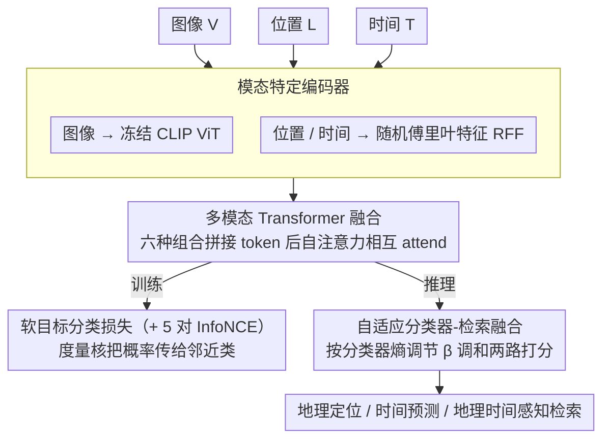

# TIGeR: A Unified Framework for Time, Images and Geo-location Retrieval

**会议**: CVPR2026  
**arXiv**: [2603.24749](https://arxiv.org/abs/2603.24749)  
**代码**: 无  
**领域**: 多模态VLM  
**关键词**: 地理时间感知检索, 多模态Transformer, 地理定位, 时间预测, 摄像头数据清洗

## 一句话总结
提出TIGeR框架，通过多模态Transformer联合学习图像-位置-时间的统一地理时间嵌入空间，实现地理定位、拍摄时间预测和地理时间感知图像检索三个任务的统一，并构建了4.5M规模的高质量基准数据集。

## 研究背景与动机
许多现实应用（数字取证、城市监测、环境分析）需要联合推理视觉外观、位置和时间。现有方法的局限：
- **图像检索**：基于外观相似度排序，对拍摄时间不变
- **组合检索**：可修改视觉属性（如"加雪"），但不保证检索结果来自同一地理位置
- **地理定位**：估计拍摄地点，独立编码各模态后通过对比损失对齐，缺乏显式的跨模态融合

核心挑战：学习能够因子化时间驱动外观变化同时保留底层地理位置语义的表示。

## 方法详解

### 整体框架

TIGeR 想把地理定位、拍摄时间预测、地理时间感知检索这三件事统一进一个嵌入空间，难点在于既要把"时间驱动的外观变化"（同一地点不同季节长相不同）因子化掉，又要保住底层的地理语义。它的做法可拆成四块：每个模态先过各自的**模态特定编码器**，把量纲差异极大的图像/位置/时间映射到可比空间；再把 {V,L,T,[V;L],[V;T],[L;T]} 六种输入组合拼接后送进一个共享的**多模态 Transformer 融合**模块，用自注意力让模态之间直接相互 attend；训练时用对比损失加**软目标分类损失**对齐，软目标利用地理/时间的连续性把监督信号传给邻近类；推理时再用**自适应分类器-检索融合**按分类器置信度调和检索打分与分类打分。

### 关键设计

**1. 模态特定编码器：图像用冻结 CLIP，位置/时间用傅里叶特征**

三个模态量纲差异极大，得先各自编码到可比的空间。图像走冻结的 CLIP ViT，输出 CLS + patch 嵌入；位置和时间这种低维连续量则用 Random Fourier Features (RFF) 投影到高维，频率取 $\sigma_i \in \{2^{2i}\}$，让 2D 的经纬度/时间也能有足够的表达力进入 Transformer。

**2. 多模态 Transformer 融合：让模态之间直接相互 attend**

地理定位类方法通常各模态独立编码、最后才对齐，学不到细粒度的跨模态关联。TIGeR 把双模态输入沿 token 维度拼接后送进自注意力，六种输入组合各做一次前向传播，使图像、位置、时间能在融合阶段直接相互 attend，从而学到"同一地点不同季节"这种精细关联——这正是它相对 GT-Loc 等后对齐方法质变的来源。

**3. 分类损失与软目标：用连续性把概率传给邻近类**

地理和时间本质是连续量，硬分类会把"差一点"和"差很远"等同对待。TIGeR 把地球用 HEALPix 划成 768 个等面积区域、时间分成 24×12=288 个 bin（小时×月份，时间戳映射到平面环面），再用度量核把概率质量传播到邻近类：

$$K_{i,j} = \exp[-\kappa(C_i,C_j)/\gamma]$$

其中地理用 Haversine 距离、时间用环面测地距离。这样邻近的格子共享监督信号，符合地理/时间的连续本性。

**4. 自适应分类器-检索融合推理：按置信度调和两路信号**

检索打分和分类打分各有优劣，固定权重融合容易在不确定的查询上引噪声。TIGeR 把两者按下式相加：

$$\text{score}(x_i^G) = (\bar{v}^Q)^T x_i^G / \psi + \beta(I^Q) \log P(b(x_i^G)|I^Q)$$

其中 $\beta$ 由分类器的熵自适应调节——分类高置信时 $\beta$ 调大、让分类信号多说话，不确定时 $\beta$ 调小、退回以检索为主，从而避免在模糊查询上被分类噪声带偏。

### 损失函数 / 训练策略

对比损失为 5 对 InfoNCE（排除位置-时间的直接对齐），分类损失为软目标交叉熵、作用在图像嵌入上。

## 实验关键数据

### 主实验

| 任务 | 指标 | TIGeR | 之前SOTA | 提升 |
|------|------|-------|----------|------|
| 地理时间检索(86k) | R@1 | 3.51% | 2.60% (Zhai+CLIP) | +0.91% |
| 地理时间检索(86k) | R@10 | 37.51% | 13.70% (Zhai+CLIP) | +23.81% |
| 时间预测(年) | - | +16%平均提升 | GT-Loc | 显著 |
| 时间预测(日) | - | +8%平均提升 | GT-Loc | 显著 |

### 消融实验

| 配置 | 关键指标 | 说明 |
|------|---------|------|
| 多模态Transformer vs 独立编码 | 大幅提升 | 跨模态注意力是关键 |
| 软目标 vs 硬目标 | 提升 | 地理/时间的连续性需要软监督 |
| 自适应β vs 固定β | 更稳定 | 避免在不确定查询上引入噪声 |

### 关键发现
- GT-Loc等独立编码器方法在地理时间检索上R@1极低(0.34%)，证明后对齐不够
- 跨模态自注意力使模型学到"同一地点不同季节"的精细关联
- 86k测试集上R@10达37.51%，说明统一地理时间嵌入的方向可行

## 亮点与洞察
- 新任务定义有价值：给定查询图像+目标时间，检索同一地点在该时间的图像
- 数据集贡献大：系统的多阶段质量过滤流程，将AMOS嘈杂数据转化为高质量基准
- 软分类目标的设计巧妙：利用地理/时间的连续性，让邻近类共享概率
- 自适应推理融合策略平衡了检索和分类信号

## 局限与展望
- R@1整体仍较低，地理时间检索本身极具挑战性
- 训练时6种组合的前向传播计算量大
- 数据来源限于固定摄像头(AMOS)，泛化到社交媒体图像的能力待验证
- 未考虑文本描述作为第四模态，可能有助于消歧

## 相关工作与启发
- 与GeoCLIP、PIGEON等地理定位方法互补，TIGeR额外建模了时间维度
- GT-Loc最相关但仅做后对齐，TIGeR通过Transformer跨模态融合带来质的提升
- 数据清洗流程对任何基于webcam/outdoor图像的研究都有参考价值

## 评分
- 新颖性: ⭐⭐⭐⭐ 新任务定义+多模态Transformer融合地理时间
- 实验充分度: ⭐⭐⭐⭐ 多任务评估+大规模数据集+完整基线对比
- 写作质量: ⭐⭐⭐⭐ 问题定义清晰，数据构建过程详细
- 价值: ⭐⭐⭐⭐ 地理时间理解是有实际需求的新方向

## 补充说明
- 图像编码器使用冻结的CLIP ViT-L/14，位置编码和时间编码使用Random Fourier Features
- 训练集4.5M图像来自1255个全球静态摄像头，测试集86k图像无摄像头重叠
- HEALPix将地球分为768个等面积区域，时间分为288个bins（24小时×12月）
- 质量分类器在400张hold-out图像上达91%准确率
- CVT数据集包含社交媒体图像，检索正确标准为125km内+时间匹配
- 在CVT上TIGeR的R@1为14.55%，低于GT-Loc的16.45%，因为CVT不包含重复摄像头场景

<!-- RELATED:START -->

## 相关论文

- [\[CVPR 2026\] CAD-Refiner: A Unified Framework for CAD Generation and Iterative Editing](cad-refiner_a_unified_framework_for_cad_generation_and_iterative_editing.md)
- [\[CVPR 2026\] Factorize, Reconstruct, Enhance: A Unified Framework for Multimodal Sentiment Analysis](factorize_reconstruct_enhance_a_unified_framework_for_multimodal_sentiment_analy.md)
- [\[CVPR 2026\] CodeMMR: Bridging Natural Language, Code, and Image for Unified Retrieval](codemmr_bridging_natural_language_code_and_image_for_unified_retrieval.md)
- [\[CVPR 2026\] One Patch to Caption Them All: A Unified Zero-Shot Captioning Framework](one_patch_to_caption_them_all_a_unified_zero-shot_captioning_framework.md)
- [\[CVPR 2026\] MMLandmarks: a Cross-View Instance-Level Benchmark for Geo-Spatial Understanding](mmlandmarks_a_cross-view_instance-level_benchmark_for_geo-spatial_understanding.md)

<!-- RELATED:END -->
