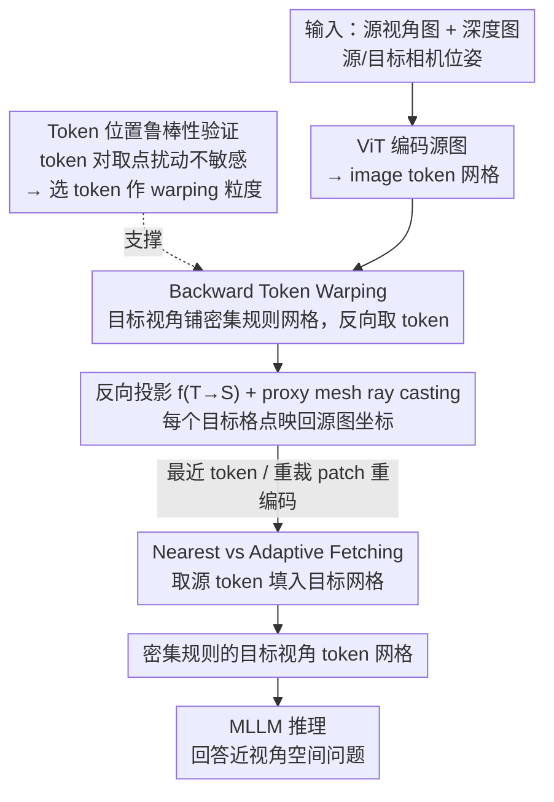

# Token Warping Helps MLLMs Look from Nearby Viewpoints

**会议**: CVPR 2026  
**arXiv**: [2604.02870](https://arxiv.org/abs/2604.02870)  
**代码**: [https://token-warping-mllm.github.io/](https://token-warping-mllm.github.io/) (项目页)  
**领域**: 多模态VLM  
**关键词**: 视角变换, token warping, 空间推理, 心理意象, MLLM

## 一句话总结
提出对 MLLM 的 ViT image token 做空间 warping（而非传统的像素级 warping）来模拟视角变换，发现 backward token warping 在保持语义一致性同时对深度估计噪声鲁棒，在自建的 ViewBench 上大幅超越像素级 warping、专用空间推理 MLLM 和生成式 warping 方法。

## 研究背景与动机

**领域现状**：多模态大语言模型在视觉推理上表现出色，但面对视角变化时相当脆弱。即使深度估计已接近完美，将预测深度整合到 MLLM 中也无法带来真正的 3D 理解。专门为空间推理微调的 MLLM（如 SpatialReasoner）在视角变换任务上改善有限。

**现有痛点**：传统做法是用像素级 warping 将源图像变换到目标视角，但像素级操作对深度图中的微小误差极度敏感——即使小的深度不准确，warping 后也会出现明显的几何扭曲和语义退化（如书本变形、物体模糊）。生成式新视角合成方法（如 GenWarp）虽能合成完整图像，但可能幻觉出不存在的物体或丢失已有物体。

**核心矛盾**：视角变换需要对场景进行某种内部表征变换，但变换的粒度选择存在根本性矛盾——物体级表征太粗、丢失空间细节；像素级表征太细、对噪声过于敏感。需要一个中间粒度的表征。

**本文目标** (1) 找到一种对深度误差鲁棒的视角变换表征方式；(2) 探索最佳的 warping 策略（前向/后向、最近/自适应）；(3) 构建评估 MLLM 视角推理能力的标准基准。

**切入角度**：受认知科学中"心理意象"理论启发——Shepard、Minsky、Pylyshyn、Hinton 等人提出心理图像依赖于"部件级结构描述"而非整体表征。ViT 中的 image token 恰好处于像素和物体之间的中间粒度，天然是"部件级"表征单元。

**核心 idea**：将视角变换操作从像素级提升到 token 级，利用 image token 作为视角变换的鲁棒语义单元，实现 MLLM 的近视角推理。

## 方法详解

### 整体框架
这篇论文要解决的是：给 MLLM 一张源视角图、它的深度图、以及源/目标两个相机位姿，让模型回答"换到目标视角再看，场景会是什么样"。传统做法是在像素层面把源图 warp 到目标视角，但深度图一有小误差，像素就被扯得几何扭曲、语义退化。本文的关键转折是把 warping 这个操作整体上移一个层级——不动像素，而是动 ViT 切出来的 image token。流程是：先验证 token 这个粒度对位置扰动天然鲁棒，再用一套从目标视角反向投影的几何变换把源图 token 重排到目标视角的规则网格上，最后把重排后的 token 直接喂给 MLLM。整套操作发生在推理时，不需要任何训练。

### 关键设计

**1. Token 对位置扰动的鲁棒性验证：先证明 token 是合适的 warping 粒度**

视角变换需要选一个表征粒度来搬运信息，物体级太粗会丢空间细节，像素级太细又对深度噪声过敏，本文主张 ViT 的 image token 恰好卡在中间。但这只是直觉，得先验证。作者设计了一个"获取位置噪声敏感性测试"：对每个 token 网格中心的坐标施加高斯位移扰动（幅度从 0 一路加到 20 像素，接近一个 patch 的边长），再用这些被扰动的位置去取 patch、送进 ViT。结果是 Qwen2.5-VL 在 CV-Bench-2D 上的准确率几乎不动；而同样幅度的扰动若加在像素级表征上，性能会明显掉下来。这个对照实验是后面所有设计的地基——既然 token 对"取在哪儿"不敏感，那么 warping 时因深度误差带来的位置偏移就不会严重伤害 MLLM 的理解，token warping 的鲁棒性有了来源。

**2. Backward Token Warping：从目标视角反向取 token，保证网格密集规则**

确定了用 token 粒度后，关键问题是 warping 的方向。一个自然的想法是前向 warping——把源图的每个 token 按几何关系投到目标平面上，但这样落点稀疏又不规则，会留下大量空洞，而 MLLM 是在规则密集的 token 网格上训练的，这种不规则分布属于严重的分布外输入，性能会暴跌。本文改用后向 warping：先在目标视角上铺一张密集规则网格，对每个目标网格点用反向投影函数 $f_{T \to S}$ 映射回源图像平面，去源图里找对应的 token。

$$p_S = f_{T \to S}(p_T)$$

具体实现是从源图深度图建一张轻量的 3D 代理网格（proxy mesh），再从目标视角的每个网格位置向源图做 ray casting，求出命中的源坐标。因为网格是从目标视角一侧铺出来的，每个格点都一定能取到一个 token，输出天然是密集且规则的——正好对上 MLLM 期待的输入格式，这也是后向比前向好那么多的根本原因。

**3. Nearest vs Adaptive Fetching：两种取 token 的方式，简单那种就够用**

反向投影给出的源坐标通常落在已有 token 网格的格点之间，于是还要决定怎么把它变成一个真正的 token。Nearest fetching 直接挑欧氏距离最近的那个现成 token，省掉一切额外计算；Adaptive fetching 则以映射坐标为中心重新裁一块 patch、重新编码成新 token，理论上更贴合但要多跑一遍编码。实验里两者性能几乎贴在一起，nearest 又快又不输。这其实是第 1 点结论的又一次印证：既然 token 对几个像素的偏移不敏感，那么"精确对齐到亚 patch 级"就不是必需的，能用最便宜的 nearest 就别折腾 adaptive。

### 损失函数 / 训练策略
本方法不涉及任何训练，纯推理时操作——只在 MLLM 读图前对 image token 做一次 warping 变换，额外开销仅来自 proxy mesh 的 ray casting，计算成本极小。

## 实验关键数据

### 主实验

实验在自建的 ViewBench 上进行，基于 ScanNet 真实室内场景，评估三类任务：Text（文本标记的空间关系）、Shape（几何形状的空间关系）、Object（目标视角物体描述）。

| 方法 | ViewBench-Text (5-15%) | ViewBench-Shape (5-15%) | ViewBench-Object (5-15%) |
|------|----------------------|------------------------|-------------------------|
| SpatialReasoner | 46.73 | 33.72 | - |
| VLM-3R | 63.82 | 49.22 | - |
| GenWarp | 69.35 | 53.10 | 4.32 |
| Pixel Backward | 71.86 | 62.40 | 4.53 |
| Token Backward-Nearest | 74.87 | 67.44 | 4.80 |
| **Token Backward-Adaptive** | **77.89** | **67.44** | **4.97** |
| Oracle (GT Target View) | 100.00 | 100.00 | 6.64 |

### 消融实验

| 配置 | ViewBench-Text (5-15%) | ViewBench-Shape (5-15%) | 说明 |
|------|----------------------|------------------------|------|
| Token Forward | 60.30 | 55.04 | 前向 warping 导致不规则 token |
| Token Backward-Nearest | 74.87 | 67.44 | 后向+最近，性能优异 |
| Token Backward-Adaptive | 77.89 | 67.44 | 后向+自适应，计算更贵但提升有限 |
| Pixel Forward | 70.85 | 56.20 | 像素级前向 |
| Pixel Backward | 71.86 | 62.40 | 像素级后向 |

### 关键发现
- **后向 > 前向**是最关键的设计选择：后向 token warping 在 Text 5-15% 场景比前向提升 14.57%，因为 MLLM 需要密集规则的 token 网格
- **Token 级 > 像素级**：后向 token warping 比后向像素 warping 在 Text 上高 6%，Shape 上高 5%，因为 token 对深度噪声更鲁棒
- Nearest fetching 与 Adaptive fetching 性能接近，说明 token 表征的鲁棒性使得精确对齐并非必要
- 使用预测深度 vs GT 深度差距很小，进一步验证方法对深度误差的鲁棒性
- 所有专用空间推理 MLLM（SpatialReasoner、VLM-3R、ViLaSR）均不如 token warping，说明空间微调不能替代显式视角变换

## 亮点与洞察
- **认知科学与工程设计的巧妙结合**：从心理意象理论中抽取"部件级表征"思想，对应到 ViT patch token，实现了从认知理论到工程方法的优雅映射。这个类比不仅有解释力，还直接指导了方法设计。
- **零训练的推理时增强**：整个方法不需要任何额外训练，仅在推理时对 token 做一次 warping，就能显著提升视角推理能力。这种"免费午餐"式的方法具有极高的实用价值。
- **规则密集 token 网格的重要性**：发现 MLLM 对 token 的空间分布模式非常敏感——稀疏不规则的 token（前向 warping 产生）是严重的分布外输入。这个洞察可迁移到其他需要操控 token 布局的任务。

## 局限与展望
- 仅处理**近视角变换**（两视角有重叠），大角度视角变化时 warping 失效（出现大量遮挡和空洞区域）
- 依赖深度图（GT 或预测），虽然对深度噪声鲁棒但仍需深度输入，限制了应用场景
- ViewBench 基于室内场景（ScanNet），对户外场景、动态场景的泛化性未验证
- 仅在 Qwen2.5-VL 上实验，不同架构的 MLLM 对 token perturbation 的鲁棒性可能不同
- 未探索与空间推理微调方法的组合——token warping + SpatialReasoner 微调是否能进一步提升？

## 相关工作与启发
- **vs SpatialReasoner / VLM-3R**：这些方法通过空间数据微调 MLLM 来获得空间推理能力，但本文发现微调不能替代显式视角变换。Token warping 在不需要额外训练的情况下大幅超越它们。
- **vs GenWarp（生成式 warping）**：生成式方法用扩散模型合成目标视角图像，但会幻觉不存在的物体。Token warping 不生成新像素，仅重排已有 token，避免了幻觉问题。
- **vs 像素 warping**：经典 3D 视觉方法，但对深度噪声敏感。Token warping 利用 ViT patch 的粗粒度天然容忍位置误差。

## 评分
- 新颖性: ⭐⭐⭐⭐ 从认知科学出发的 token warping 思路很有创意，但技术实现相对简单
- 实验充分度: ⭐⭐⭐⭐ ViewBench 设计合理，消融全面，但仅限室内场景和单一 MLLM
- 写作质量: ⭐⭐⭐⭐⭐ 论述清晰，从理论到实验的逻辑链完整，图表直观
- 价值: ⭐⭐⭐⭐ 无训练推理时增强有强实用价值，但应用场景受限于近视角变换

<!-- RELATED:START -->

## 相关论文

- [\[ICLR 2026\] Constructive Distortion: Improving MLLMs with Attention-Guided Image Warping](../../ICLR2026/multimodal_vlm/constructive_distortion_improving_mllms_with_attention-guided_image_warping.md)
- [\[CVPR 2026\] Where MLLMs Attend and What They Rely On: Explaining Autoregressive Token Generation](where_mllms_attend_and_what_they_rely_on_explaining_autoregressive_token_generat.md)
- [\[ICLR 2026\] Sparsity Forcing: Reinforcing Token Sparsity of MLLMs](../../ICLR2026/multimodal_vlm/sparsity_forcing_reinforcing_token_sparsity_of_mllms.md)
- [\[CVPR 2026\] On Token's Dilemma: Dynamic MoE with Drift-Aware Token Assignment for Continual Learning of Large Vision Language Models](on_tokens_dilemma_dynamic_moe_with_drift-aware_token_assignment_for_continual_le.md)
- [\[CVPR 2026\] Rethinking MLLM Itself as a Segmenter with a Single Segmentation Token](rethinking_mllm_itself_as_a_segmenter_with_a_single_segmentation_token.md)

<!-- RELATED:END -->
