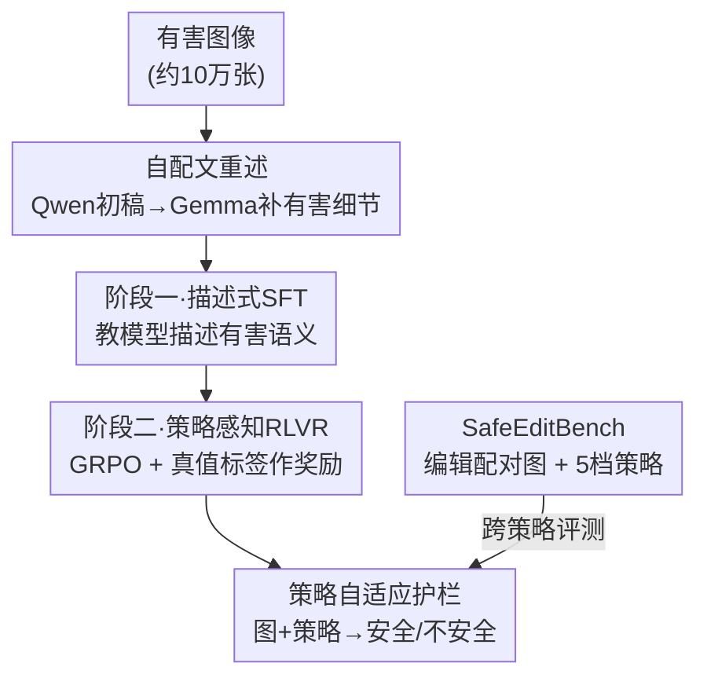

# Towards Policy-Adaptive Image Guardrail: Benchmark and Method

**会议**: CVPR 2026  
**论文**: [CVF Open Access](https://openaccess.thecvf.com/content/CVPR2026/html/Piao_Towards_Policy-Adaptive_Image_Guardrail_Benchmark_and_Method_CVPR_2026_paper.html)  
**代码**: 有（论文称 release code & data at GitHub，具体仓库地址未给，⚠️ 以原文为准）  
**领域**: 多模态VLM安全 / 有害图像护栏 / 内容审核  
**关键词**: 图像护栏, 跨策略泛化, 可验证奖励RL, VLM安全, 安全基准

## 一句话总结
针对"现有 VLM 图像护栏只会拟合单一固定安全策略、换策略就崩"的问题，本文一方面造了一个用图像编辑生成"安全/不安全成对图、5 档策略"的跨策略评测基准 SafeEditBench，另一方面提出两阶段方法 SafeGuard-VL（先用"自配文重述"做描述式 SFT 注入有害语义，再用策略感知的可验证奖励 RL 对齐策略），把 UnsafeBench 总分从 41.7 提到 72.2，同时保住了通用多模态能力。

## 研究背景与动机
**领域现状**：有害图像护栏（harmful image guardrail）就是判断一张图能不能放行。传统做法是固定类目分类器（"色情/暴力/违法"等几类），近年开始用 VLM（视觉语言模型）来做，因为 VLM 有世界知识、能读指令、能做语义推理，看上去更灵活。

**现有痛点**：但什么算"安全"从来不是普世的，而是由**安全策略（policy）**规定的——不同组织、司法辖区、文化、不同时间点的规则都不一样，而且策略会持续演化。现有 VLM 护栏几乎清一色用**单一固定策略**做监督微调（SFT），SFT 本质是去拟合训练数据里"问题-答案"的联合分布，对策略模板和数据风格极度敏感。结果是：一旦策略变了，学到的分布就不成立，安全性能和指令跟随能力一起大幅退化。作者实测发现这些模型"在见过的策略上表现不错，换到没见过的策略上性能断崖式崩溃"，甚至连基本的指令跟随能力和通用知识都丢了——说明它们对策略的"理解"是肤浅而僵化的。

**核心矛盾**：VLM 虽然语义能力更强，却仍被困在和传统分类器一样的**过拟合**陷阱里：把"理解策略"退化成了"背诵一套固定规则"。安全识别和通用语义理解被 SFT 耦合在一起，强行塞安全监督就会伤到通用能力。

**本文目标**：分解为两个子问题——(1) 缺一个能**真正考"跨策略泛化"而不是"单策略拟合"**的评测基准；(2) 缺一个换策略不崩、又不牺牲通用能力的训练方法。

**切入角度**：作者观察到两点。其一，RL 在自己采样分布下优化，天然比 SFT 有更强的泛化和知识保留，适合做"对齐到演化策略"这件事；其二，与其直接教模型分类"safe/unsafe"，不如先教它**描述**图里的有害元素——因为 baseline 模型面对有害内容时倾向给出含糊、洗白的回答，根本没建立对风险的清晰语义认识。

**核心 idea**：把"语义理解"和"安全判定"解耦——第一阶段用描述式 SFT（配合自配文重述补回被安全机制压掉的有害细节）把有害语义灌进模型，第二阶段用策略感知的可验证奖励 RL 把决策对齐到具体策略；评测则用图像编辑造出"只在局部违规区域不同"的安全/不安全配对图来精细考察策略意识。

## 方法详解

### 整体框架
本文有两个并列贡献：一个**方法** SafeGuard-VL（两阶段训练得到的护栏模型）和一个**基准** SafeEditBench（跨策略评测套件）。SafeGuard-VL 的输入是"一张图 + 一段策略文本"，输出是在该策略下的安全/不安全判定（并给出依据策略的推理）。它刻意在早期阶段**避开直接的分类监督**：先做语义接地（搞懂图里有什么有害内容），再引入基于策略的推理，这样对模型原有泛化能力的损伤最小。两阶段串行：阶段一是描述式 SFT（用自配文重述构造的数据），阶段二是策略感知的 RLVR（用 GRPO，以真值标签作可验证奖励）。SafeEditBench 则是平行的评测侧贡献——用图像编辑把不安全图改成"只局部不同"的安全版，再在 5 档策略下人工标注，专门暴露护栏的跨策略脆弱性。

### 关键设计

**1. SafeEditBench：用"只改局部违规区"的安全-不安全配对图把策略意识考到细处**

现有安全基准默认"unsafe"有固定定义，根本没法考"换策略后模型会不会变"。作者用图像编辑模型（Nano Banana / Gemini 图像生成）对不安全图做**最小、保语义**的编辑，生成只在违规局部区域不同的"安全版"——比如把武器替换成相机、做语义重解释，全局场景、构图、物体都不变。这样得到一批视觉上几乎一致的安全/不安全对，迫使模型靠**细粒度上下文线索**而非粗糙的场景级特征来区分（这也对应现实里恶意用户用微小扰动绕过滤镜的威胁）。基准取自 LlavaGuard 测试集，含 128 张图覆盖 9 个有害类目及其安全对应版。

更关键的是**策略对齐**：同一组 62 对图被 5 档策略（L1–L5）统一重标，每档策略对每张图给出不同的二值标签。L1 极度宽松（把一切人类表达都当安全，unsafe 占比 0%），L5 极度严格（连无害的肢体接触都可能算 unsafe，unsafe 占比升到 59%），L3/L4 贴近主流社会预期，L1 和 L5 是反直觉的极端制度，专门考策略遵从。评测用各策略下的二值 F1（L1 因全是安全图改用 accuracy），最终指标是 5 档策略 F1 的宏平均。这个设计直接把"安全不是图像内在属性、而是策略决定的"这件事量化成了可比的数字。

**2. 自配文重述（self-recaption）：让模型自己生成、再由更宽松模型补回被压掉的有害细节**

阶段一 SFT 的目标不是教模型"喊 safe/unsafe"，而是教它**描述**图里的有害元素——因为作者发现 baseline（Qwen2.5-VL）面对有害图时会因内置安全协议给出含糊、洗白的描述，丢失对风险的语义认识。但直接用外部模型生成描述又会改变原图的中性/事实成分。自配文重述用两步解决：先让 baseline 模型对图生成一份初始 caption（受自身安全机制限制，有害细节偏少），再用一个更宽松的模型（Gemma 27B）做**最小编辑式重述**——只把被压制的有害语义补回来，保持原句法结构、只改必要词汇，绝不改动中性/事实描述。约 10 万张互联网来源的有害图（色情、暴力、违法等）都这样配文。这样既把关键安全知识注入模型，又保住了它的核心描述能力——消融显示这一步在 UnsafeBench 上带来 13+ 分差距（53.22→66.96），且通用基准几乎不掉，而像 LlavaGuard 那样直接 SFT 反而出现意外的泛化损失。

**3. 阶段二·策略感知 RLVR：用真值标签作可验证奖励，逼模型"讲清为什么违规"而非死记**

阶段一只教语义、完全不碰分类任务，所以阶段二要从零学"为什么这张图在这条策略下违规/合规"。作者用 GRPO（Group Relative Policy Optimization）做强化学习：对每个"图-策略"对，**真值安全/不安全标签直接当奖励信号**（rule-based RL with verifiable rewards, RLVR），鼓励模型生成"依据所给策略文本来论证自己判断"的回答，从而促成内部推理而非死记硬背。训练数据复用 LlavaGuard 训练集，但改成**策略条件式**的 RL 用法。RL 的好处是它在模型自己的采样分布下优化，泛化和知识保留更强，于是同一份数据只把 SFT 换成 RL，就能在保住通用能力的同时显著提升跨基准安全表现（见 Table 4）。这一步让护栏能动态适应变化的策略——比如一条"允许性内容"的策略会放行此前被严格规则标为 unsafe 的图——并支持策略合规的安全问答等更广用法，而不只是固定的二分类。

> 框架里点名的三个贡献组件——SafeEditBench、自配文重述、策略感知 RLVR——分别对应上述三个设计；阶段一 SFT 本身是承载"自配文重述数据"的训练步，不单列。论文还定义了 4 个模型变体便于消融：Ours(SFT)=仅阶段一、Ours(Full)=SFT+RL 完整管线、Ours(RL)=仅 RL（与 QwenGuard 同数据公平对比）、Ours(RL+SafeEditTrain)=在 SafeEdit 编辑数据上做 RL（验证数据构造有效性）。

### 损失函数 / 训练策略
两阶段：阶段一标准 SFT（监督描述式 caption）；阶段二 GRPO 强化学习，奖励为"模型判定是否等于人工真值标签"的可验证规则奖励（RLVR），无需额外打分模型。作者额外构造 SafeEditTrain——对 LlavaGuard 训练集的不安全图施加与 SafeEditBench 相同的编辑流程，用它做 RL 能进一步提升。

## 实验关键数据

### 主实验
UnsafeBench（9 类有害内容，推理时把 OpenAI 内容策略当 prompt 注入），指标为各类/总体得分：

| 模型 | 类型 | Hate | Sexual | Spam | Overall |
|------|------|------|--------|------|---------|
| Qwen2.5-VL-7B | 通用 VLM | 24.5 | 35.5 | 23 | 41.7 |
| GLM-4V-9B | 通用 VLM | 24.9 | 81.9 | 53.5 | 56.5 |
| QwenGuard-7B | 安全护栏 | 26.3 | 51.2 | 3.7 | 43.6 |
| ShieldGemma2 | 安全护栏 | 24.1 | 72.9 | 48.4 | 47.3 |
| **Ours (SFT)** | 本文 | 33.8 | 87 | 53.1 | 67.0 |
| **Ours (Full)** | 本文 | **50.6** | **89** | **63.3** | **72.2** |

完整版总分 72.2，比通用 Qwen2.5-VL-7B（41.7）和安全专用 QwenGuard-7B（43.6）大幅领先，Hate/Sexual/Spam 提升尤其明显。

安全 vs 通用能力的权衡（Table 4，同训练数据，仅 SFT→RL 之差）：

| 模型 | LlavaGuard | UnsafeBench | SafeEditBench | 通用Overall |
|------|-----------|-------------|---------------|-------------|
| Qwen2.5-7B | 57.08 | 41.71 | 48.68 | 56.92 |
| QwenGuard-7B | **84.57** | 43.56 | 32.76 | 35.98 |
| **Ours (RL)** | 71.78 | **62.39** | 45.59 | **57.02** |

QwenGuard 在自家基准刷到 84.57，却在别的安全基准（UnsafeBench 43.56）和通用任务（BLINK 仅 12.05、通用总分 35.98）上严重崩塌——典型的过度专门化。仅把 SFT 换成 RL 的 Ours(RL) 在各基准上更均衡，安全提升的同时通用能力几乎不掉。

### 消融实验
recaption 与 RL 的有效性（Table 5）：

| 变体 | Recap | RL | UnsafeBench | 通用 |
|------|-------|-----|-------------|------|
| Qwen2.5-VL-7B | – | – | 41.71 | 56.92 |
| w/o Recap (SFT) | ✗ | ✗ | 53.22 | 54.51 |
| Ours (SFT) | ✓ | ✗ | 66.96 | 53.37 |
| Ours (Full) | ✓ | ✓ | **72.16** | 53.09 |

去掉自配文重述，UnsafeBench 从 66.96 掉到 53.22（−13.7），说明精心构造的有害描述对学"细粒度、上下文相关"的有害模式至关重要；在 SFT 之上加 RL 再涨 +5.2，验证两阶段范式。通用能力在各变体间稳定在 53–57，安全提升没牺牲功能。

跨策略泛化的脆弱性（Table 3，单档策略训练、五档评测）：SFT 在 L1 上训练会退化成"永远说安全"的分类器（其他档全 0%）；在 L5 上训练则在 L1/L2 上严重掉点。RL 能缓解过拟合但模型仍高度依赖策略——这正是本文要暴露的根本局限。

SafeEditBench 上各模型 F1（Table 6）：模型在中庸的 L3/L4 上表现好，在反直觉的 L1/L5 上骤降甚至近零，说明模型"内在安全先验"和"显式策略规则"之间存在错位；Ours(RL+SafeEditTrain) 总分 49.43，优于 Ours(RL) 的 45.59，证明用编辑配对数据能学到策略定义的细微语义边界。

### 关键发现
- 贡献最大的单步是**自配文重述**（去掉掉 13.7 分），其次是阶段二 RL（+5.2）；二者缺一都不达完整版。
- **SFT 是过拟合元凶**：同数据下只把 SFT 换成 RL，就能从"自家基准刷分、别处全崩"变成"跨基准均衡"，印证 RL 在自采样分布下优化带来的泛化优势。
- 反直觉策略（L1 全安全、L5 极严）是所有模型的重灾区，暴露"模型安全先验 ≠ 显式策略"的错位，也是这个任务最难的地方。

## 亮点与洞察
- **把"安全是策略决定的"做成可量化基准**：用图像编辑造"只差局部违规区"的配对图 + 5 档反直觉策略，直接量出护栏的跨策略脆弱性——这比堆更多有害类目更切中问题本质。
- **自配文重述很巧**：用"自家模型出初稿 + 更宽松模型最小补全有害细节"绕过了安全模型不肯描述有害内容的难题，又不污染中性事实描述，是个可迁移到任何"安全对齐数据构造"的 trick。
- **解耦语义理解与安全判定**：先教描述、再用 RLVR 对齐策略，避免了 SFT 把安全监督和通用能力耦合死的老毛病——这条"SFT 灌知识、RL 对齐策略"的两阶段思路可迁到其他需要"换规则不崩"的对齐任务。
- 最"啊哈"的点：仅把训练范式从 SFT 换成 RL（数据完全相同），就把过度专门化的安全模型救回了通用能力，说明很多"安全 vs 通用"的权衡其实是训练方式造成的，而非任务本身的固有冲突。

## 局限与展望
- 作者自承：现有护栏（含本文 RL 版）**仍高度依赖策略**，RL 只是缓解而非根治跨策略泛化问题，极端反直觉策略（L1/L5）下依然吃力。
- SafeEditBench 规模偏小（128 张图 / 62 对图 × 5 档策略），且依赖单一图像编辑模型（Nano Banana）生成"安全版"，编辑质量与覆盖面可能限制结论广度。
- 评测只考二值 safe/unsafe，未做细粒度有害类目判定；策略仅 5 档人工设计，真实世界策略的连续性、组合性未触及。
- 改进方向：把策略表示从"离散 5 档"扩成可组合的自然语言策略空间、加入策略推理的可解释中间步监督、用更大更多样的编辑配对数据扩 benchmark。

## 相关工作与启发
- **vs LlavaGuard / QwenGuard（SFT 固定策略护栏）**：它们在自家固定策略/类目上 SFT，换策略即崩、且伤通用能力；本文用描述式 SFT + 策略感知 RL 解耦语义与判定，跨策略更稳、通用能力保住。
- **vs Llama Guard / ShieldGemma / OpenAI Mod（固定类目护栏）**：这些靠固定有害类目（14/9/6 类）或预定义 block，任何策略改动都要重训；本文支持任意自然语言策略、类目可动态扩展、零样本跨策略泛化。
- **vs AIR-BENCH / 传统安全基准**：从固定 314 个 block 或固定"unsafe"定义里选，处理不了未见风险；SafeEditBench 用编辑配对 + 多档策略显式考"策略变了模型会不会变"。
- **vs SafeWatch**：同样接受自然语言策略描述，但未释出；本文开放 schema 且公开代码与数据。

## 评分
- 新颖性: ⭐⭐⭐⭐ "安全是策略决定的"这个问题定义 + 编辑配对基准 + 自配文重述，组合很新颖，单点技术（GRPO/RLVR）是现成的
- 实验充分度: ⭐⭐⭐⭐ 三个安全基准 + 多通用基准 + 单档训练泛化分析 + 充分消融，但 benchmark 规模偏小
- 写作质量: ⭐⭐⭐⭐ 动机递进清晰、图表到位，问题动机讲得尤其透
- 价值: ⭐⭐⭐⭐ 内容审核/护栏是刚需，"换策略不崩"直击工业部署痛点，基准与方法都可复用

<!-- RELATED:START -->

## 相关论文

- [\[CVPR 2026\] MMSD3.0: A Multi-Image Benchmark for Real-World Multimodal Sarcasm Detection](mmsd30_a_multi-image_benchmark_for_real-world_multimodal_sarcasm_detection.md)
- [\[ACL 2026\] Doc-PP: Document Policy Preservation Benchmark for Large Vision-Language Models](../../ACL2026/multimodal_vlm/doc-pp_document_policy_preservation_benchmark_for_large_vision-language_models.md)
- [\[CVPR 2026\] HiconAgent: History Context-aware Policy Optimization for GUI Agents](hiconagent_history_context-aware_policy_optimization_for_gui_agents.md)
- [\[CVPR 2026\] SketchVL: Policy Optimization via Fine-Grained Credit Assignment for Chart Understanding and More](sketchvl_policy_optimization_via_fine-grained_credit_assignment_for_chart_unders.md)
- [\[CVPR 2026\] Conflict-Aware Adaptive Cross-Reconstruction for Multimodal Sentiment Analysis](conflict-aware_adaptive_cross-reconstruction_for_multimodal_sentiment_analysis.md)

<!-- RELATED:END -->
