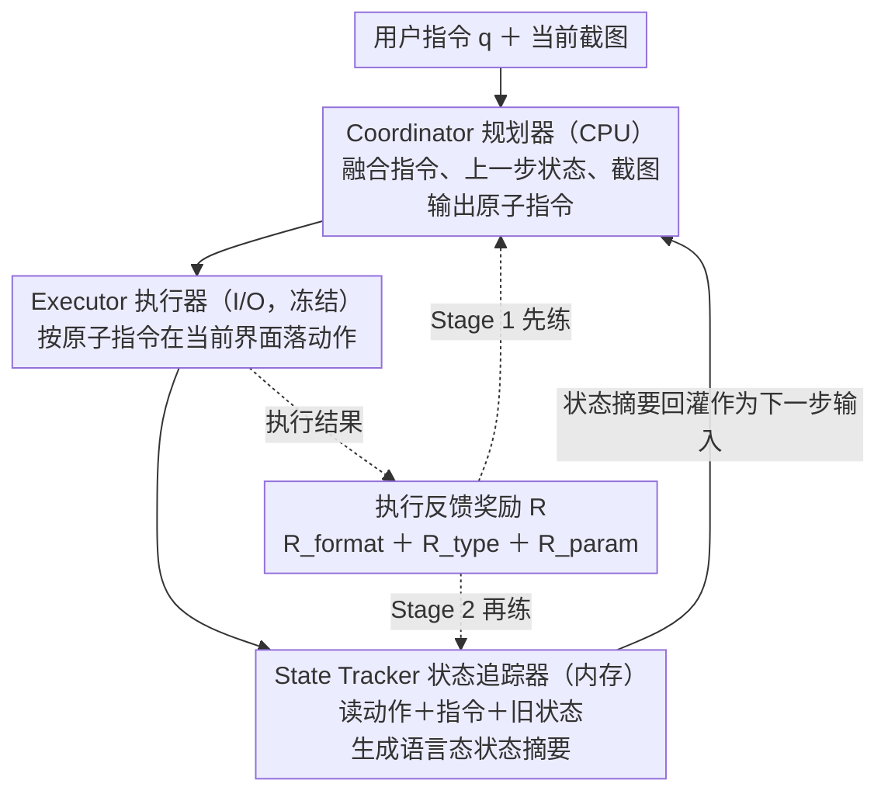

# Training High-Level Schedulers with Execution-Feedback Reinforcement Learning for Long-Horizon GUI Automation

**会议**: CVPR2026  
**arXiv**: [2511.22235](https://arxiv.org/abs/2511.22235)  
**代码**: [hehehahi4/CES](https://github.com/hehehahi4/CES)  
**领域**: 多模态VLM  
**关键词**: GUI自动化, 长时序任务, 多智能体框架, 强化学习, 状态追踪, 任务调度

## 一句话总结

提出 CES（Coordinator-Executor-State Tracker）多智能体框架和分阶段执行反馈强化学习算法，将高层任务规划与低层执行解耦，通过专门训练的 Coordinator 和 State Tracker 显著提升 GUI Agent 在长时序任务上的规划和状态管理能力。

## 背景与动机

1. **单智能体能力冲突**：现有端到端 GUI Agent 试图在单一模型中耦合任务规划、多步推理、GUI元素定位和精确动作执行等异质能力，有限参数下难以同时掌握高层和低层能力，随着任务复杂度增加容易出现灾难性能力崩溃
2. **缺乏任务状态感知**：长时序任务中，Agent 主要依赖截图推断进度，但截图是不充分且不可靠的状态表示——重复出现的主页界面、OOD界面等都会导致进度判断困难
3. **SFT 范式局限**：监督微调严重依赖大规模高质量轨迹标注数据，成本高昂且泛化能力差
4. **单步 RL 不足**：现有 RL 方法虽在简单任务上取得不错效果，但仍训练单一策略网络，未解决能力耦合问题
5. **Multi-Agent 缺优化**：已有多智能体框架多用通用 VLM + prompt engineering 扮演角色，缺乏对各角色的深度专门优化
6. **时序验证实验**：论文设计了截图时序判断实验，发现随步间距增大准确率急剧下降，实证表明截图无法充分表征任务状态

## 方法详解

### 整体框架

这篇论文要解决的是长时序 GUI 自动化里「一个模型既要做高层规划又要做低层执行、能力互相打架」的困境。CES 借操作系统的分工思路把任务拆给三个专门化 Agent：Coordinator 像 CPU 负责规划，把用户的高层指令拆成一条条原子指令；Executor 像 I/O 设备，是一个冻结的预训练 GUI 模型，只管照原子指令在当前界面上落动作；State Tracker 像内存，用纯语言模型把「任务进行到哪一步了」维护成一段自然语言摘要。三者每一步循环协作——State Tracker 给出的状态摘要喂回 Coordinator 帮它规划下一步，形成「规划→执行→更新状态→再规划」的闭环。训练上分两阶段，用下游执行结果当奖励，先把 Coordinator 练好、再练 State Tracker。

### 关键设计

**1. OS 式三角色解耦：让规划、执行、记忆各司其职**

单一端到端 Agent 在有限参数下同时扛任务规划、多步推理、元素定位和精确动作，复杂任务一上来就容易「能力崩溃」。CES 把这三件事拆开：Coordinator 融合用户指令 $q$、上一步状态摘要 $m^{t-1}$ 和当前截图 $s^t$ 生成原子指令 $l^t = \pi_c(q, m^{t-1}, s^t)$；Executor 是冻结模型，只需根据 $l^t$ 和 $s^t$ 产出动作 $u^t = (th^t, a^t) = \pi_e(l^t, s^t)$，不必理解长期意图。每个模块只在自己擅长的子能力上被优化，避免异质能力在同一组参数里互相挤占。

**2. 语言态的 State Tracker：把状态理解搬离高维视觉空间**

长时序任务里 Agent 主要靠截图猜进度，但重复出现的主页、OOD 界面让截图无法可靠表征状态——论文的时序判断预实验也证实：步间距越大，靠截图判断进度的准确率越急剧下降。State Tracker 干脆不直接看 GUI，而是读 Executor 的输出 $u^t$、用户意图 $q$ 和上一步状态 $m^{t-1}$，生成新的自然语言状态摘要 $m^t = \pi_s(q, m^{t-1}, u^t)$。这等于把状态从高维、易混淆的视觉空间转移到低维、语义明确的语言空间，几乎消除了进度误判（State Loss 错误从 14% 降到 2%）。

**3. 执行反馈奖励：用下游执行结果反推上游该怎么规划**

规划和状态摘要这类抽象输出本身很难直接打分。CES 不评价中间输出的「文采」，而是把它送进 Executor 真去执行，用规则化奖励客观评分：
$$R = \alpha_1 R_{format} + \alpha_2 R_{executor}, \quad R_{executor} = \gamma_1 R_{type} + \gamma_2 R_{param}$$
其中 $R_{format}$ 管格式合法、$R_{type}$ 管动作类型对不对、$R_{param}$ 管动作参数准不准。好不好用最终由「执行得动不动」说了算，让难以直接评估的上游模块也能拿到清晰的优化信号。

**4. 分阶段 RL：先定 Coordinator 再练 State Tracker**

两个可训练模块一起优化会互相干扰，于是拆成两阶段、都基于 GRPO。先做 Warm-up SFT 让两者学会基本职责和输出格式；Stage 1 冻结 Executor、用 ground-truth 状态当 $m^{t-1}$ 输入，只优化 Coordinator 的规划策略；Stage 2 再冻结练好的 Coordinator 和 Executor，让 State Tracker 生成的摘要走完整个 CES 循环，把最终执行反馈回传给它——这样它学到的不是「摘要写得像不像」，而是「生成什么样的状态对 Coordinator 最有用」。

### 损失函数 / 训练策略

- Coordinator 基座 Qwen2.5-VL-7B，State Tracker 基座 Qwen3-4B，Executor 用冻结的 GUI-R1-7B
- SFT 用 LLaMA Factory，1 epoch、lr=5e-5；RL 用 Verl，Coordinator 10 epochs lr=1e-6，State Tracker 5 epochs
- 奖励系数 $\alpha_1=0.1,\ \alpha_2=0.9$，$\gamma_1=0.2,\ \gamma_2=0.8$；硬件 8×80G GPU

## 实验关键数据

### 主实验：长时序任务性能（Table 1）

在 AITZ（平均7.5步）、AMEX（平均12.8步）、GUI-Odyssey（平均15.3步）三个benchmark上：

| 模型 | 方法 | AITZ SR | AMEX SR | GUI-Odyssey SR |
|------|------|---------|---------|----------------|
| Qwen2.5-VL-7B | Zero Shot | 18.11 | 35.10 | 34.37 |
| GUI-R1-7B | RL | 30.59 | 43.69 | 38.79 |
| GUI-Owl-7B | RL | 32.70 | 40.48 | 35.82 |
| + GPT-5 | Multi-Agent | 40.55 | 35.80 | 42.47 |
| **+ CES (Ours)** | **Multi-Agent** | **43.05** | **48.48** | **53.69** |

CES 在 GUI-R1-7B 基线上平均 Type 准确率提升 10.38%，GUI-Odyssey SR 从 38.79% 提升至 53.69%（+14.9%）。

### 泛化性验证（Table 2）

CES 作为即插即用模块在不同规模 Executor 上均显著提升：

| Executor | 设置 | AMEX SR | GUI-Odyssey SR |
|----------|------|---------|----------------|
| UI-R1-3B | Baseline → CES | 35.81 → 43.38 (+7.57) | 32.49 → 38.04 (+5.55) |
| GUI-Owl-7B | Baseline → CES | 40.48 → 47.24 (+6.76) | 35.82 → 46.65 (+10.83) |
| GUI-Owl-32B | Baseline → CES | 43.16 → 52.05 (+8.89) | 39.60 → 56.75 (+17.15) |

### 消融实验（Table 3）

| 配置 | AMEX SR | GUI-Odyssey SR |
|------|---------|----------------|
| CES 完整 | 48.48 | 53.69 |
| w/o Coordinator | 33.27 (-15.21) | 39.15 (-14.54) |
| w/o State Tracker | 42.08 (-6.40) | 42.52 (-11.17) |
| w/o RL (SFT only) | 36.54 (-11.94) | 42.89 (-10.80) |

去掉任一组件或RL阶段均导致显著性能下降，验证了各组件和训练策略的必要性。

## 亮点

1. **类OS设计理念**：将 GUI 自动化类比为操作系统的 CPU-I/O-Memory 架构，优雅地解耦规划、执行和状态管理
2. **State Tracker 创新**：用纯语言模型做动态上下文压缩和状态摘要，将状态理解从高维视觉空间转移到低维语义空间，几乎完全消除了 State Loss 错误（14%→2%）
3. **执行反馈奖励**：巧妙解决抽象任务（规划/状态跟踪）难以直接评估的问题，用下游执行结果反向指导上游优化
4. **即插即用泛化性**：7B Coordinator + 4B State Tracker 的轻量组合即可让不同 Executor 大幅受益，甚至 7B+4B 组合可达到 32B 单模型的效果
5. **实证验证充分**：时序判断预实验、三个长时序benchmark、多规模Executor泛化、详细消融和失败案例分析

## 局限与展望

1. **Executor 仍是瓶颈**：失败案例分析显示性能瓶颈已转移至 Executor 的感知限制（Perception Error 和 Generalization Failure），CES 无法解决这部分问题
2. **分阶段训练非联合优化**：Coordinator 和 State Tracker 分开训练，未探索联合训练或协同进化的可能性（论文 Future Work 中提及）
3. **领域适用性**：仅在移动端 GUI 场景验证，未扩展至 Web、桌面等其他 GUI 环境
4. **状态摘要质量依赖**：Stage 1 依赖 ground-truth 状态标注，获取此类标注在实际场景中的可行性待验证
5. **计算开销**：三个模型串行推理（7B+冻结Executor+4B），推理延迟可能是实际部署的障碍

## 与相关工作的对比

- **vs GUI-R1**：同样用 RL 训练 GUI Agent，但 GUI-R1 训练单一端到端模型，CES 解耦高层/低层并专门优化高层调度，GUI-Odyssey SR 从 38.79% 提升至 53.69%
- **vs SWIRL**：同为多阶段工作流方法，SWIRL 在 GUI-Odyssey 上 SR=51.65%，CES 达到 53.69% 并在其他benchmark上同样领先
- **vs Mobile-Agent-v3 / MobiAgent**：同为多智能体框架，但这些方法用 prompt engineering 做角色分配缺乏专门优化，CES 通过执行反馈 RL 对各角色深度训练
- **vs GPT-5 Multi-Agent**：用 GPT-5 做 Coordinator 和 State Tracker 效果不稳定（部分指标下降），而 CES 的专门训练模型显著且稳定地优于 prompt 方案

## 评分

- 新颖性: ⭐⭐⭐⭐ — OS类比的三角色解耦设计 + 执行反馈RL训练范式有较好原创性
- 实验充分度: ⭐⭐⭐⭐⭐ — 三个benchmark、多规模泛化、详细消融、失败案例分析、预实验验证
- 写作质量: ⭐⭐⭐⭐ — 结构清晰，动机阐述充分，预实验设计巧妙
- 价值: ⭐⭐⭐⭐ — 即插即用的高层调度模块对 GUI Agent 社区有实用价值，分阶段训练思路可推广

<!-- RELATED:START -->

## 相关论文

- [\[CVPR 2026\] GUI-SAGE: Enhancing GUI Automation with Self-Explanatory Learning](gui-sage_enhancing_gui_automation_with_self-explanatory_learning.md)
- [\[CVPR 2026\] SenseSearch: Empowering Vision-Language Models with High-Resolution Agentic Search-Reasoning via Reinforcement Learning](sensesearch_empowering_vision-language_models_with_high-resolution_agentic_searc.md)
- [\[CVPR 2026\] DRS-GUI: Dynamic Region Search for Training-Free GUI Grounding](drs-gui_dynamic_region_search_for_training-free_gui_grounding.md)
- [\[CVPR 2026\] Explore with Long-term Memory: A Benchmark and Multimodal LLM-based Reinforcement Learning Framework for Embodied Exploration](explore_with_long-term_memory_a_benchmark_and_multimodal_llm-based_reinforcement.md)
- [\[CVPR 2026\] From Failure to Feedback: Group Revision Unlocks Hard Cases in Object-Level Grounding](from_failure_to_feedback_group_revision_unlocks_hard_cases_in_object-level_groun.md)

<!-- RELATED:END -->
