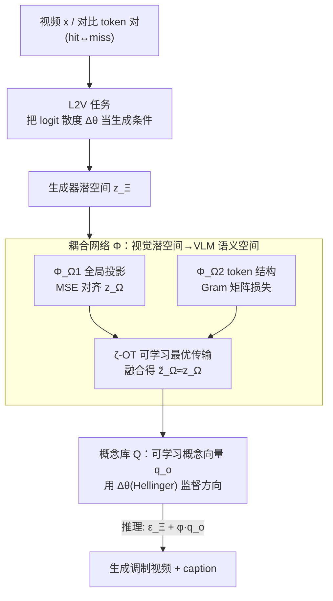

# TRANSPORTER: Transferring Visual Semantics from VLM Manifolds

**会议**: CVPR 2026  
**论文**: [CVF Open Access](https://openaccess.thecvf.com/content/CVPR2026/html/Stergiou_TRANSPORTER_Transferring_Visual_Semantics_from_VLM_Manifolds_CVPR_2026_paper.html)  
**代码**: [项目页](https://alexandrosstergiou.github.io/TRANSPORTER)  
**领域**: 模型可解释性 / 视频VLM / 生成式解释  
**关键词**: VLM 可解释性, logits-to-video, 最优传输, 概念向量, 文生视频

## 一句话总结
论文提出 logits-to-video（L2V）这一新的可解释性任务，并设计 VLM-无关的 TRANSPORTER：通过最优传输把文生视频生成器的视觉潜空间和 VLM 的语义嵌入空间耦合起来，再用一组可学习的"概念向量"把 VLM 两个对比 token（如 happy↔sad）之间的 logit 散度翻译成视频上的细粒度属性改变，从而用"生成的视频"直接、可视化地解释 VLM 到底在看什么。

## 研究背景与动机
**领域现状**：视频理解已经从检测、预测发展到由 Vision-Language Model（VLM）统一回答各种问题，VLM 把视频编码成 token、再用 LLM 输出一段 caption，并对 token 字典给出 logit 概率分布。但模型"为什么这么答"一直是个老大难。

**现有痛点**：现有可解释性手段几乎都是**文本侧**的——要么 prompt 问模型、要么对隐藏嵌入做线性探针、要么把 embedding 解码成文字描述。这些解释对输入扰动敏感、长度受限，还经常**误表征模型的真实内部过程**；另一类基于显著性的归因（saliency / 梯度图）在视频上只能给出粗糙的区域热力图，说不清"模型把这个动作理解成了什么属性"。

**核心矛盾**：VLM 把答案表示成对 token 的概率分布，而人类想要的解释却是**具象、可看见**的视觉内容。文本解释和显著图都隔着一层抽象，无法直接、因果地把"某个 token 的 logit 变化"对应到"画面里到底变了什么"。

**本文目标**：能不能把 VLM 的 logit 分布**直接生成成视频**？给定 VLM 对一对对比 token 的 logit 差异（如 young→old、swift→slow），生成一段只在该属性上发生改变、其余场景动态保持不变的视频，让用户"看见" VLM 在哪些 token 上学到了什么语义对应。

**切入角度**：作者借力近年高保真的文生视频（T2V）模型——它们能生成视觉细节丰富的视频。如果能把生成器的潜空间和 VLM 的嵌入空间**对齐/耦合**起来，就能用 VLM 的 logit 当作生成条件，让生成视频沿着语义方向变化。灵感同时来自 T2I 概念编辑里"用 prompt 对的 embedding 差当作概念方向"。

**核心 idea**：提出 **L2V（logits-to-video）任务**，用最优传输（OT）耦合"生成器视觉潜空间 ↔ VLM 语义嵌入空间"，再学一组概念向量，把 VLM 两个 token 之间的 logit 散度 $\Delta\vartheta$ 当作控制量去调制视频生成。

## 方法详解

### 整体框架
TRANSPORTER 要解决的是：把 VLM 的 logit 变化变成一段视频。它分两阶段训练。**第一阶段**训练一个耦合网络 $\Phi$，把生成器（Wan2.2）潜空间 $\mathbb{R}_\Xi$ 里的 embedding $z_\Xi$ 搬运到 VLM 嵌入空间 $\mathbb{R}_\Omega$，得到逼近 VLM 真实编码 $z_\Omega$ 的 $\tilde z_\Omega$——这样生成器产出的潜变量才能被 VLM "读懂"并给出 logit。**第二阶段**冻结生成器和 VLM，训练一个**概念库** $Q=\{q_o\}$：对每对语义对比 token（如 `baseball hit` vs `baseball miss`），学一个概念向量 $q_o\in\mathbb{R}_\Xi$ 编码这对属性在生成器潜空间里的方向，并用 VLM 真实 logit 散度 $\Delta\vartheta$ 来监督这个方向，保证"画面变化"和"VLM 语义变化"一致。**推理时**，用户手动给定 $\varphi$（想要的 logit 差强度），把条件 $\varepsilon^-_\Xi + \varphi q_o$ 喂给生成器，解码出反映该 logit 变化的视频，同时可经 $\Phi$ 反传回 $\mathbb{R}_\Omega$ 生成对应 caption。

### 关键设计

**1. L2V 任务：把"解释 VLM"重定义为"按 logit 散度做条件视频生成"**

以往视频 VLM 的解释都落在文本或显著图上，作者直接换了一个问题形式：VLM 对 caption $\varepsilon_\Omega$ 给出 logit $\vartheta=\text{logit}(\varepsilon_\Omega)$，那就让模型**生成一段视频** $x'$，使它对应从 $\vartheta^-$（如 happy）到 $\vartheta^+$（如 sad）的 token logit 变化 $\Delta\vartheta$。这相当于把不可见的"概率分布解释"变成可看、可交互的视频，能直接验证"模型学到的语义"和"相关视觉表征"是否对齐，还能探索模型学到的物体-属性关联。底层生成器用 Conditional Flow Matching（CFM）训练，回归从高斯先验 $\omega\sim\mathcal N(0,I)$ 到目标 (latent, condition) 的速度场：$L_{CFM}=\mathbb E\,\lVert v(z'_{\Xi,t}\mid\varepsilon_\Xi)-G(z'_{\Xi,t},\varepsilon_\Xi,t)\rVert^2$，L2V 就是在这个框架上加 logit 条件。这个任务本身是论文的第一大贡献——一条此前没人探索过的、保真度高的解释方向。

**2. 耦合网络 Φ：用最优传输把生成器视觉潜空间搬到 VLM 语义空间**

难点在于：生成器的 embedding $z_\Xi$ 虽然能被它自己的 VAE 解码器 $D_\Xi$ 解回视频，但"解码再用 VLM 重编码"（$z_{\Xi\to\Omega}=E_\Omega(D_\Xi(z_\Xi))$）会引入 VAE 的随机扰动，得到的 token 动态和确定性编码 $z_\Omega$ 不一致。于是 $\Phi$ 用三个互补子模块把 $z_\Xi$ 直接搬运到逼近 $z_\Omega$ 的 $\tilde z_\Omega$：① $\Phi_{\Omega1}$（24 层 MLP-Mixer）做**全局投影**，用 MSE 对齐目标编码：$L_{\Phi_{\Omega1}}=\lVert z_\Omega-\hat z_{\Omega1}\rVert^2$；② $\Phi_{\Omega2}$（12 层 Transformer）专管 **token 间局部几何结构**，用 Gram 矩阵损失匹配 token 关系：$L_{\Phi_{\Omega2}}=\lVert H(z_\Omega)-H(\hat z_{\Omega2})\rVert^2$，其中 $H(\cdot)$ 是 token 两两内积构成的 $\mathbb R^{|N|\times|N|}$ 关系矩阵；③ **可学习熵正则最优传输（ζ-OT）**把全局投影 $\hat z_{\Omega1}$ 和局部结构 $\hat z_{\Omega2}$ 融合成 $\tilde z_\Omega$。ζ-OT 用 $P$ 组可学习投影向量把 token 投到标量 $a_{i,\zeta}=\langle\hat z_{\Omega1,i},p_{\Omega1,\zeta}\rangle$、$b_{j,\zeta}=\langle\hat z_{\Omega2,j},p_{\Omega2,\zeta}\rangle$，以传输代价 $M_{i,j,\zeta}=\lVert a_{i,\zeta}-b_{j,\zeta}\rVert^2$ 求传输方案 $T_{i,j,\zeta}\propto\exp(-M_{i,j,\zeta}/\varsigma)$（用部分双随机迭代做闭式近似，避开完整双约束 OT 的高开销），最终 $\tilde z_\Omega=\tilde T\hat z_{\Omega1}$。$\Phi$ 整体用 $L_{\zeta\text{-}OT}=\lVert z_\Omega-\tilde z_\Omega\rVert^2+\lVert H(z_\Omega)-H(\tilde z_\Omega)\rVert^2$ 联合优化。这样既保住全局语义、又保住 token 局部结构，是"让生成的潜变量能被 VLM 正确解读"的关键。

**3. 概念库 Q：用 VLM logit 散度监督，把属性差变成可控的潜空间方向**

有了耦合就能算 logit，但还缺"该往哪个方向调"。作者为每对对比 token $\varepsilon^-,\varepsilon^+$ 学一个概念向量 $q_o\in\mathbb R_\Xi$，编码这对属性在生成器潜空间里的方向。训练分两条监督：**生成器侧**，对同一中间潜变量 $z'_{\Xi,t}$ 用两个条件预测两条速度场，其散度 $\Delta v=G(z'_{\Xi,t},\varepsilon^+_\Xi,t)-G(z'_{\Xi,t},\varepsilon^-_\Xi,t)$ 对应属性方向；仿照扩散模型找潜方向的做法，CFM 损失改写为让"加了概念向量的条件"去匹配"加了 $\varphi\Delta v$ 的速度场"：$L_{q_o}=\mathbb E\,\lVert \text{sg}[G(z'_{\Xi,t},\varepsilon^-_\Xi,t)+\varphi\Delta v]-G(z'_{\Xi,t},\varepsilon^-_\Xi+\varphi q_o,t)\rVert^2$（生成器权重冻结，sg 为停梯度）。**VLM 侧**，把两条路径的潜变量经 $\Phi$ 传回 $\mathbb R_\Omega$ 拿到 logit $\vartheta^-,\vartheta^+$，用 **Hellinger 距离**算 logit 散度 $\Delta\vartheta=\tfrac{1}{\sqrt2}\lVert\sqrt{\vartheta^-}-\sqrt{\vartheta^+}\rVert\in[0,1]$，并把它当作上式的控制量 $\varphi=\Delta\vartheta$。选 Hellinger 是因为它有严格的 $[0,1]$ 边界（消融里优于无界的 KL、也略好于 JS）。这样概念向量的"画面方向"就被 VLM 的"语义散度"钉死，保证视觉变化忠实反映 token logit 变化。

**4. 推理：手动设定散度强度做细粒度、可交互的视频调制**

推理时 $\varphi$ 可由用户手动指定，对应想要的 logit 分布变化 $\Delta\vartheta$；用概念向量把概率路径 (7) 的条件改成 $\varepsilon^-_\Xi+\varphi q_o$，生成潜变量 $z'^{q_o}_{\Xi,t}$ 解码成视频 $x'^{q_o}=D(z'^{q_o}_{\Xi,t})$，同时可经 $\Phi$ 回到 $\mathbb R_\Omega$ 生成对应 caption。论文展示了它能做连续插值（walk→run 的步频渐变）、组合属性调制（同时改数量和厚薄）、按生成步注入（大尺度差异在前几步可见、细节在后续步）、以及部分帧调制（spray 渐渐融入 wipe 动作），从而探索 VLM 把物体如何绑定到动作、以及动作时序的不同粒度。

### 损失函数 / 训练策略
两阶段训练，生成器（Wan2.2）和三个 VLM（VideoLLaMA 3-7B / Gemma 3-12B / Phi 4 MM-5B）全程冻结只做推理。**阶段一**训耦合网络 $\Phi$：AdamW、10 万步、学习率 1e-3、batch 8、每 8 步梯度累积，ζ-OT 用 100 组投影；联合优化 MSE + Gram + ζ-OT。**阶段二**训概念库 $Q$：每个向量 1K 步、学习率 1e-4，用 $L_{q_o}$ 监督。$\Delta v$ 与 $\Delta\vartheta$ 都在多个噪声种子上平均以降方差。耦合训练数据用 VATEX / LAVIB / Ego4D 的语义丰富、高分辨率、第一人称视频。

## 实验关键数据

### 主实验
对比对象是把图像/视频分类里的特征可视化（Activation Maximization 系）方法迁移到视频 VLM 上（最大化目标 logit $\vartheta^+$ 或带散度的 $\vartheta^-+\Delta\vartheta$），其中 LEAPS 是唯一此前直接做视频模型视觉解释的工作，作为主基线。指标：FVD↓、LPIPS_v↓（与真实视频的视觉质量），CLIP_v↑、aesthetic↑、$\Delta$↑（条件对齐）。

| VLM | 方法 | FVD↓ | LPIPS_v↓ | CLIP_v↑ | aes↑ | Δ↑ |
|-----|------|------|----------|---------|------|-----|
| VideoLLaMA 3 | LEAPS (max $\vartheta^+$) | 1.85e3 | 4.37 | 16.74 | 2.56 | 2.28 |
| VideoLLaMA 3 | **TRANSPORTER** | **1.25e2** | **1.67** | **35.44** | **4.28** | **12.62** |
| Gemma 3 | Baseline | 2.18e3 | 4.55 | 17.41 | 2.67 | 1.82 |
| Gemma 3 | **TRANSPORTER** | **1.05e2** | **1.43** | **36.18** | **4.21** | **11.56** |
| Phi 4 MM | Baseline | 2.34e3 | 5.12 | 15.06 | 2.24 | 1.73 |
| Phi 4 MM | **TRANSPORTER** | **1.42e2** | **1.54** | **35.71** | **4.18** | **11.35** |

CLIP_v 在 VideoLLaMA 3 上从 16.74 翻倍到 35.44；FVD 在 Gemma 3 上从 ~2e3 降到 1.05e2（数量级改善）；条件对齐散度 $\Delta$ 普遍从 ~2 提到 11~12。另有一张生成-真实视频嵌入相似度表（cos↑/l1↓/l2↓/KL↓）：例如 VideoLLaMA 3 上 cos 从 6.45e-8 提到 3.28e-2、KL 从 56.31 降到 1.67，说明基线几乎完全无法逼近真实视频分布，而 TRANSPORTER 能。

### 消融实验
消融在"目标 caption $\varepsilon^+$ 与生成视频 caption $\varepsilon^{q_o}$"之间报告语义分数（cos / BLEU / CIDEr / METEOR / SPICE），分耦合网络和概念库两组（下表取 VideoLLaMA 3 的 cos 与 BLEU@4）：

| 配置 | cos↑ | B@4↑ | 说明 |
|------|------|------|------|
| Baseline [LEAPS] | 0.11 | 2.05 | 直接迁移的 AM 基线 |
| decode-and-re-encode | 0.19 | 5.24 | 推理式解码重编码，无耦合训练 |
| Φ_Ω1 only | 0.16 | 4.49 | 只全局投影 |
| Φ_Ω2 only | 0.21 | 7.75 | 只 token 结构 |
| mean⟨Φ_Ω1,Ω2⟩ | 0.23 | 7.79 | 简单平均两者 |
| sGW OT（替 ζ-OT） | 0.14 | 4.09 | 用 Sliced Gromov-Wasserstein 启发式 |
| ζ-OT, P=50/200/400 | 0.24/0.26/0.26 | 8.29/8.30/8.40 | 投影数越多略升、计算变贵 |
| Δθ 用 KL | 0.19 | 5.29 | 无界散度，掉点 |
| Δθ 用 JS | 0.22 | 6.58 | 略逊于 Hellinger |
| **TRANSPORTER（Hellinger）** | **0.26** | **8.34** | 完整模型 |

### 关键发现
- **耦合网络是关键**：相比"解码再重编码"的推理式做法（cos 0.19），训练好的 $\Phi$ 把 cos 提到 0.26；$\Phi_{\Omega2}$（token 结构）单独就明显强于 $\Phi_{\Omega1}$（全局投影），说明保住 token 间局部几何关系对让 VLM "读懂"潜变量很重要。
- **ζ-OT > 启发式 OT**：把 ζ-OT 换成 Sliced Gromov-Wasserstein 后 caption 质量明显下降（cos 0.26→0.14），可学习传输方案优于固定启发式；投影数 P 从 100 加到 400 只有边际收益却更贵。
- **散度度量要有界**：Hellinger（严格 $[0,1]$）> JS > 无界的 KL，无界度量会损害控制稳定性。
- **定性洞察**：物体类属性（juggling 用球还是棒、招牌写 Chicago 还是 New York）能贯穿整段场景，而动作表现（体操旋转）只在特定时刻影响更大——说明当前 VLM 学到的是**不同粒度的动作时序性**；大尺度属性差在生成前几步就显现，细节在后续步逐渐淡出。

## 亮点与洞察
- **把可解释性从"文本/热力图"升级到"可看的视频"**：L2V 让用户直接看见"VLM 把这个 token 理解成了什么画面变化"，而且改的是目标属性、其余场景动态保持不变，这种"受控反事实视频"比显著图信息量大得多。
- **OT 当跨模态空间的"翻译器"很巧**：生成器潜空间和 VLM 语义空间天然不对齐，作者不强行共享而是学一个最优传输耦合，且拆成全局投影 + token 结构 + 可学习 OT 三件套，分别管语义和几何，思路可迁移到任何"两个异构 embedding 空间要对齐"的场景。
- **用 logit 散度监督生成方向**：把"画面方向 $\Delta v$"钉到"VLM 语义散度 $\Delta\vartheta$"上，是保证解释忠实的核心——生成的不是好看的视频，而是**忠实反映模型内部 logit 变化**的视频。
- **VLM-无关**：方法对 VLM 只做冻结推理，换 VideoLLaMA 3 / Gemma 3 / Phi 4 MM 都能用，具备通用解释工具的潜力。

## 局限与展望
- **依赖底层 T2V 生成器质量**：解释保真度被 Wan2.2 的生成能力上限约束，生成器学不出的属性也就无法可视化，且 VAE 解码的随机性正是耦合网络要费力消除的来源。
- **概念向量需逐对训练**：每个对比 token 对要单独学一个 $q_o$（1K 步/向量），覆盖大规模属性空间的成本不低，开放词表/组合属性的可扩展性存疑。
- **"忠实性"难以严格验证**：生成视频是否真实反映 VLM 内部因果而非生成器自身先验，论文主要靠语义对齐指标和定性证据，缺乏对"解释忠实度"的独立 ground-truth 校验。
- **评测偏代理指标**：用 caption 一致性 / CLIP 分数衡量解释质量，是间接代理，人类是否真能据此理解模型决策仍待用户研究。

## 相关工作与启发
- **vs 文本归因 / 线性探针 / embedding 解码**：它们给出文字描述，对扰动敏感、长度受限、易误表征内部过程；TRANSPORTER 给出视觉化、受控的视频解释，信息更具象、可交互。
- **vs Activation Maximization（AMv / GradViT / MACO / LEAPS）**：AM 系把分类器特征可视化迁到视频上，往往只能生成抽象形状、无法拉近真实视频分布（KL 高、cos≈0）；本文用 T2V + OT 耦合生成高保真完整场景，FVD/LPIPS 大幅领先。
- **vs T2I 概念编辑（LoRA / prompt-pair embedding 差）**：本文借鉴"用 prompt 对的 embedding 差当概念方向"，但把目标从图像编辑换成**用 VLM logit 散度监督的视频解释**，并扩展到更难的视频时序域。
- **vs OT 在视觉-语言对齐里的既有用法**：以往 OT 多用于把视觉特征对齐到文本语义或按激活聚类；本文用可学习熵 OT 去**耦合高语义嵌入与细节视觉表征**做视频解释，是一个新方向。

## 评分
- 新颖性: ⭐⭐⭐⭐⭐ 提出 L2V 这一前所未有的生成式 VLM 可解释性任务，并用 OT 耦合 + logit 散度监督把它做实
- 实验充分度: ⭐⭐⭐⭐ 跨 3 个 VLM、多套质量/对齐指标、耦合与概念库双向消融充分；但缺解释忠实度的独立验证与用户研究
- 写作质量: ⭐⭐⭐⭐ 任务动机和方法链条清晰，符号略密、部分公式需对照原文
- 价值: ⭐⭐⭐⭐ 为视频 VLM 解释开了"可看见"的新范式，工具型贡献，启发跨模态空间对齐

<!-- RELATED:START -->

## 相关论文

- [\[CVPR 2026\] Granulon: Awakening Pixel-Level Visual Encoders with Adaptive Multi-Granularity Semantics for MLLM](granulon_awakening_pixel-level_visual_encoders_with_adaptive_multi-granularity_s.md)
- [\[CVPR 2026\] CoV-Align: Efficient Fine-grained Cross-Modal Alignment with Cohesive Visual Semantics Priority](cov-align_efficient_fine-grained_cross-modal_alignment_with_cohesive_visual_sema.md)
- [\[CVPR 2026\] IAG: Input-aware Backdoor Attack on VLM-based Visual Grounding](iag_input-aware_backdoor_attack_on_vlm-based_visual_grounding.md)
- [\[ACL 2026\] Revisit What You See: Revealing Visual Semantics in Vision Tokens to Guide LVLM Decoding](../../ACL2026/multimodal_vlm/revisit_what_you_see_revealing_visual_semantics_in_vision_tokens_to_guide_lvlm_d.md)
- [\[CVPR 2026\] µVLM: A Vision Language Model for µNPUs](mvlm_a_vision_language_model_for_mnpus.md)

<!-- RELATED:END -->
