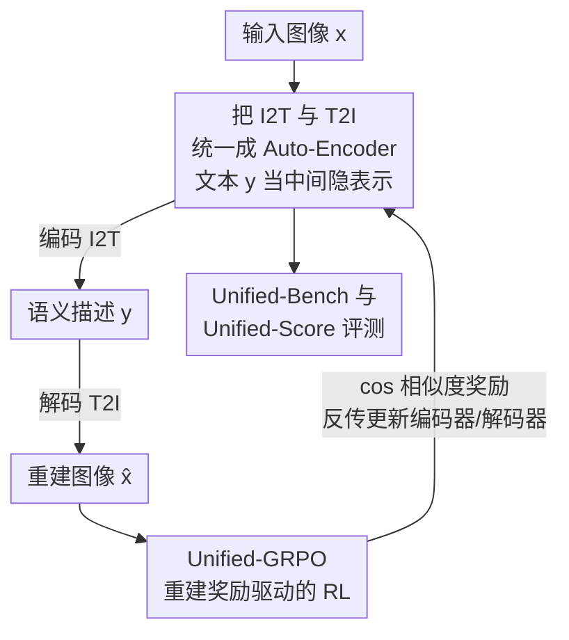

# Unified Multimodal Models as Auto-Encoders

**会议**: CVPR 2026  
**论文**: [CVF Open Access](https://openaccess.thecvf.com/content/CVPR2026/html/Yan_Unified_Multimodal_Models_as_Auto-Encoders_CVPR_2026_paper.html)  
**代码**: 待确认  
**领域**: 多模态VLM  
**关键词**: 统一多模态模型, 自编码器视角, 重建式强化学习, GRPO, 理解-生成协同

## 一句话总结
这篇论文把"图→文理解"(I2T) 和"文→图生成"(T2I) 重新看成一个**自编码器**：文本是中间隐表示，理解模块当编码器、生成模块当解码器，于是用"重建出来的图像和原图有多像"作为强化学习奖励 (Unified-GRPO) 去**同时**优化两端，让理解和生成互相促进——GenEval 从 0.73 提到 0.86，小目标检测从 0.05 飙到 0.45。

## 研究背景与动机

**领域现状**：能同时做"理解"和"生成"的统一多模态模型 (Unified Multimodal Models, UMM) 这两年很火，做法通常是把一个理解模型和一个生成模型拼在一起，要么共享一个自回归骨干 (如 Janus-Pro)，要么用 LLM 给扩散生成器 (MM-DiT) 提供语言先验 (如 UniWorld、MetaQuery)。

**现有痛点**：直接把两者拼起来往往得到次优结果。多篇工作发现，**用扩散生成目标去训练会损害理解能力和已学到的表示，反之亦然**——两个任务的优化目标互相打架，联合训练很脆弱。于是另一批工作干脆"解耦"，把理解和生成分开训，各练各的。

**核心矛盾**：解耦虽然稳，却**丢掉了跨任务互相增益的机会**。作者一针见血地指出：如果两个大模块只是并排放着、拿不出可验证的相互增益，那所谓"统一"就退化成了"把两个大组件摆在一起"，名不副实。问题的根本在于——大家始终把 I2T 和 T2I 当成两个孤立任务，缺一个能把它们绑定起来、并且**能被优化**的共同目标。

**本文目标**：找到一个原则性的、可优化的"桥"，让理解和生成在训练中真正彼此强化，而不是互相拖累。

**切入角度**：作者换了个概念视角——把 I2T 和 T2I 看成一个 **Auto-Encoder (AE)**。文本充当中间隐表示：编码器从输入图像抽出语义描述 (I2T)，解码器再从这段描述重建图像 (T2I)。这个视角自带一个朴素却强大的判据：**如果编码器真的"看懂"了图，它就该把所有关键视觉结构都写进文字；如果解码器真的"读懂"了文字，它就该忠实地把这些结构还原出来**。于是"重建质量高不高"就成了同时增强两端的代理目标。

**核心 idea**：用"重建相似度"当强化学习奖励，把理解模块 (编码器) 和生成模块 (解码器) 绑成一个自编码闭环联合优化——重建得越像，说明理解越全、生成越忠实，形成自我演化的正反馈。

## 方法详解

### 整体框架

整篇方法围绕一句话展开：**给定输入图 $x$，先让一个 UMM 产出语义描述 $y$ (I2T)，再让 UMM 从 $y$ 重建出 $\hat{x}$ (T2I)，然后用强化学习最大化 $x$ 与 $\hat{x}$ 的语义相似度**。这条 "图→文→图" 的重建链路就是自编码闭环：文本 $y$ 是被压缩的隐表示，重建误差反向逼着编码器写得更全、解码器还原得更准。

作者把这套训练范式称为 **Unified-GRPO**，并让它能套到两类主流 UMM 架构上：

- **UMM-1**：一个自回归 LLM 负责理解、并为扩散生成器 (MM-DiT) 提供语言先验 (UniWorld、MetaQuery 类)。训练时只更新 LLM，扩散解码器冻结，当作奖励环境的一部分。
- **UMM-2**：单一自回归模型在共享 token 空间里同时干理解和生成 (Janus-Pro、X-Omni 类)。编码与解码都是同一个 AR 模型，于是它能在一个 token 空间里自我协同演化。

最后作者还配了一个专门评"统一度"的基准 **Unified-Bench**，用重建相似度 (Unified-Score) 直接检验"理解抽出的语义够不够忠实地还原成图"。整体流向如下：

### 关键设计

**1. 把 I2T 与 T2I 统一成 Auto-Encoder：文本当中间隐表示**

这是全文的概念基石，针对"理解与生成被当成两个孤立任务、找不到可优化的共同目标"这个根本痛点。作者主张：图→文 (编码) 和文→图 (解码) 本就是一个自编码器的两半，文本 $y$ 是这个 AE 的隐编码。判据是"忠实重建"——好的编码器应把图像里**所有本质结构**都压进文字，好的解码器应把这些结构**如实还原**。这一步看似只是换说法，价值在于它给出了一个**双向都受益的统一原则**：以前优化 I2T 和 T2I 是两套互相冲突的损失，现在只需优化"重建得像不像"这一个目标，编码端和解码端就被这同一个目标牵引，天然不再打架。换句话说，重建质量成了同时拔高两端的代理 (proxy)，把"统一"从口号变成了一个可计算、可优化的量。

**2. Unified-GRPO：重建奖励驱动的双模块协同 RL**

有了 AE 视角，还需要一个能真正把重建误差传回去优化两端的训练算法，这就是 Unified-GRPO。它把在 LLM 上已被验证有效的 GRPO 扩展到 UMM。对 **UMM-1**：自回归 LLM $\pi_\phi$ 是被训练的策略，扩散生成器 $p_\theta$ 冻结、和一个 CLIP 编码器一起充当奖励环境。给定输入图 $x$，从旧策略 $\pi_{\phi_{old}}$ 采样一组 $G$ 个 caption $\{y^{(i)}\}_{i=1}^{G}$；对每个 $y^{(i)}$ 取其最后隐状态 $h_T^{(i)}$ 并投影成扩散条件 $c^{(i)} = g(h_T^{(i)})$，据此合成重建图 $\tilde{x}^{(i)} \sim p_\theta(\cdot \mid c^{(i)})$；再用 GRPO 目标更新 LLM，token 概率比为 $r_t^{(i)}(\phi) = \pi_\phi(y_t^{(i)} \mid x, y_{<t}^{(i)}) / \pi_{\phi_{old}}(y_t^{(i)} \mid x, y_{<t}^{(i)})$。这等于在逼 LLM 吐出"能让扩散重建得最像"的隐表示。对 **UMM-2**：解码器 $D_\phi$ 本身就是自回归的，流程同构——$x \xrightarrow{\pi_\phi} y \xrightarrow{\pi_\phi} \tilde{x}$，重建奖励 $R(x,\tilde{x}) = \cos(f_{CLIP}(x), f_{CLIP}(\tilde{x}))$，让同一个 AR 模型在共享 token 空间里同时演化理解与生成。它和 T2I-R1、AR-GRPO 等"用 RL 提升 AR 图像生成"工作的关键区别在于：奖励不是某个外部美学/对齐分，而是**输入图与重建图之间的相似度**，因此能联合优化理解和生成两端，形成"编码更全→生成更忠实→反过来又逼编码更细"的自强化循环。

**3. Unified-Bench 与 Unified-Score：用重建相似度直接量"统一度"**

针对"现有评测要么只看图像逼真度、要么只看 caption 保真度，都看不出系统是否真正统一"这个评测空白，作者造了 Unified-Bench。核心指标 **Unified-Score** 就是重建相似度：从 100 张多样源图出发，让模型先生成 caption、再从自己的 caption 合成图，最后用四个视觉骨干 CLIP、LongCLIP、DINO-v2、DINO-v3 计算"重建图 vs 源图"的相似度并取综合分 (Protocol-1)。它同时考验两件事——理解抽出的语义够不够支撑忠实重建、重建反过来又验证理解是否完整，正好对应"理解↔生成"闭环的两半。此外还有 Protocol-2：用 Claude-4.1、GPT-4o、Grok-4、o4-mini 四个商用 LLM 当裁判，以**成对胜率 (pairwise winning rate)** 评判本模型 caption 相比各 baseline 对"利于重建生成"是否更友好。这个基准把"是否真统一"变成了可直接读数的量。

### 损失函数 / 训练策略
训练是 GRPO 式的 post-training（后训练），核心奖励是输入图与重建图在 CLIP 特征空间的余弦相似度 $R(x,\tilde{x}) = \cos(f_{CLIP}(x), f_{CLIP}(\tilde{x}))$；UMM-1 只更新 LLM 编码器、冻结扩散解码器，UMM-2 用同一个 AR 模型端到端更新。每步对每张图采样一组候选 caption，按 GRPO 组内相对优势更新策略。⚠️ 论文正文里 GRPO 目标方程被引用为 Eq.(??)（PDF 解析缺失），具体 KL/裁剪项以原文为准。

## 实验关键数据

实验主骨干选 UniWorld（因为它在生成和理解上都比 Janus 更强），覆盖理解、生成、统一三类基准。

### 主实验

把 Unified-GRPO 分别套到 UniWorld 和 Janus-Pro 两种代表性 UMM 上，理解 (MMB/MMMU)、生成 (GenEval/DPGBench)、统一 (Unified-Score) 全面对比：

| 模型 | MMB | MMMU | GenEval | DPGBench | Unified-Score |
|------|-----|------|---------|----------|---------------|
| UniWorld | 83.5 | 58.6 | 84.0 | 81.2 | 79.0 |
| UniWorld + 本文 | 84.8 | 58.2 | 89.0 (+5%) | 86.4 (+5.2%) | 86.1 (+7.1%) |
| Janus-Pro | 79.2 | 41.0 | 80.0 | 84.2 | 82.8 |
| Janus-Pro + 本文 | 80.3 | 41.6 | 84.3 (+4.3%) | 88.9 (+4.7%) | 89.1 (+6.3%) |

可见增益在"生成"和"统一"上最明显（直接被重建奖励优化的两块，各涨 4~5% 和 6%+），理解上只是温和提升——作者归因于当前生成模型能力有限，重建不完美会给编码器带回负反馈。

GenEval 文生图主结果（不含 LLM 改写时 UAE 综合分 0.86，含改写 0.89，统一模型里最优）：

| 方法 | Counting | Colors | Color attr. | Overall |
|------|----------|--------|-------------|---------|
| Janus-Pro | 0.59 | 0.90 | 0.79 | 0.80 |
| OmniGen2 | 0.64 | 0.88 | 0.76 | 0.80 |
| BAGEL | 0.81 | 0.88 | 0.63 | 0.82 |
| BAGEL† (含改写) | 0.84 | 0.95 | 0.77 | 0.88 |
| **UAE** | **0.84** | 0.90 | **0.79** | 0.86 |
| **UAE†** (含改写) | 0.82 | 0.95 | **0.84** | **0.89** |

在更难的 GenEval++（≥3 物体、多属性多空间关系）上，UAE 综合分 0.475 远超次优 BAGEL 的 0.371，尤其在 Color/Count (0.550)、Pos/Count (0.450) 等需要多约束同时满足的子项上领先。

### 消融实验

Unified-Bench 的 Protocol-1（统一度 / 重建相似度）横向对比，UAE 综合分超过 GPT-4o-Image：

| 方法 | CLIP | LongCLIP | DINO-v2 | DINO-v3 | Overall |
|------|------|----------|---------|---------|---------|
| GPT-4o-Image | 90.42 | **94.37** | 81.74 | 77.27 | 85.95 |
| BAGEL | 88.97 | 93.35 | 78.55 | 73.05 | 83.48 |
| Janus-Pro | 88.72 | 93.45 | 78.30 | 70.61 | 82.77 |
| UniWorld-V1 | 85.49 | 91.53 | 72.12 | 66.83 | 78.99 |
| **UAE** | **90.50** | 94.35 | **81.98** | **77.54** | **86.09** |

细粒度感知（MMT-Bench，Qwen-3B 基线 vs 本文），这是"生成反哺理解"最有力的证据：

| 子任务 | Qwen-2.5-VL-3B | Ours (Qwen-3B) | 提升 |
|--------|----------------|----------------|------|
| 细粒度感知 Overall | 32.5 | 56.9 | +24.4 |
| Small Object Detection | 0.05 | 0.45 | +40 |
| Person Re-ID | 0.15 | 0.75 | +60 |
| Transparent Object Det. | 0.15 | 0.45 | +30 |
| Salient Obj. Detection RGBD | 0.25 | 0.45 | +20 |

### 关键发现
- **生成可以反哺理解**：重建式 RL 训练后，3B 理解模型在小目标检测 (0.05→0.45)、行人重识别 (0.15→0.75) 等细粒度感知上暴涨——为了让重建更像，编码器被逼着抽取更细、更全的语义。
- **统一度可超过 GPT-4o-Image**：UAE 在 Unified-Score 上以 86.09 微超 GPT-4o-Image 的 85.95，且在 CLIP/DINO-v2/DINO-v3 三个骨干上都拿第一，说明它保住了布局级和纹理级语义。
- **存在可解释的 trade-off**：在 OCR-heavy 场景反而掉点（MMT-Bench 高层任务里 OCR −6.2、DU −11.6、IR −6.2）——重建奖励偏好整体语义还原，对密集文字识别这类"逐字精确"任务不利。
- **架构通用**：同一套方法在 UMM-1 (LLM+DiT) 和 UMM-2 (纯 AR) 两种家族上都稳定见效，证明 Auto-Encoder 视角不依赖具体生成器形式。

## 亮点与洞察
- **把"统一"从口号变成可优化的量**：用重建相似度当奖励，是这篇最巧的一笔——它让 I2T 和 T2I 不再各练各的，而是被同一个目标牵引，从机制上化解了"联合训练互相拖累"的老问题。
- **重建即理解的代理**：把"看懂没看懂"操作化成"还原得像不像"，这个判据非常可迁移——任何"编码-解码"型任务（语音、视频、3D）理论上都能套这套自监督式 RL 奖励来逼编码端写得更全。
- **诚实地报告负向 trade-off**：作者没有藏 OCR-heavy 场景掉点，反而把它当作"重建奖励偏全局语义"的可解释证据，这种自洽分析比单纯刷 SOTA 更有说服力。
- **自造基准补评测空白**：Unified-Bench 用闭环重建直接量"统一度"，比"分别看图像逼真度 / caption 保真度"更切题，可被后续统一模型工作复用。

## 局限与展望
- **受限于生成模型上限**：作者明确承认理解侧增益偏小，因为当前生成器重建不完美，会把负反馈传回编码器——生成器越强，这套循环的天花板越高。
- **OCR / 文档 / 图文检索类任务退化**：重建奖励偏好整体语义还原，对需要逐字精确的密集文字场景不友好，落地时需谨慎或加任务特定约束。
- **奖励依赖 CLIP 特征**：相似度用 CLIP 余弦衡量，可能继承 CLIP 自身的语义偏置（对纹理/布局敏感、对精确计数或文字不敏感），换更强的相似度度量或多骨干集成或许能缓解 trade-off。
- **GRPO 目标公式在开放版里缺失** (Eq.(??))，复现时需对照官方实现确认裁剪/KL 细节。⚠️ 以原文为准。

## 相关工作与启发
- **vs 解耦式 UMM（如分别训理解/生成的工作）**：他们为避免互相损害而把两端分开训，代价是放弃跨任务增益；本文反其道而行，用重建闭环让两端共享一个目标、互相促进，证明"统一"确实能带来可验证的相互增益。
- **vs T2I-R1 / AR-GRPO**：这些工作也用 RL 提升自回归图像生成，但奖励是外部对齐/美学信号、只优化生成端；本文奖励是"输入图 vs 重建图"的相似度，因而能**同时**优化理解与生成，是它们的关键差异。
- **vs Janus-Pro / UniWorld 等 UMM 骨干**：本文不是新架构，而是一个**通用的 post-training 框架**，能直接套到这些已有 UMM 上再提一截，定位互补而非竞争。

## 评分
- 新颖性: ⭐⭐⭐⭐⭐ 把统一多模态重构成 Auto-Encoder 并用重建 RL 优化，视角新且能落地，化解了联合训练互损的老难题
- 实验充分度: ⭐⭐⭐⭐ 覆盖理解/生成/统一三类基准、两种架构、还自造评测，证据链完整；唯理解侧增益偏小、OCR 退化坦诚但留有余地
- 写作质量: ⭐⭐⭐⭐ 动机推导清晰、判据直白，可惜开放版关键公式缺失
- 价值: ⭐⭐⭐⭐⭐ 通用 post-training 框架，可即插即用提升现有 UMM，且"重建即理解代理"思路可迁移到更多编码-解码任务

<!-- RELATED:START -->

## 相关论文

- [\[CVPR 2026\] OneCAT: Decoder-Only Auto-Regressive Model for Unified Understanding and Generation](onecat_decoder-only_auto-regressive_model_for_unified_understanding_and_generati.md)
- [\[CVPR 2026\] TUNA: Taming Unified Visual Representations for Native Unified Multimodal Models](tuna_taming_unified_visual_representations_for_native_unified_multimodal_models.md)
- [\[CVPR 2026\] DuetSVG: Unified Multimodal SVG Generation with Internal Visual Guidance](duetsvg_unified_multimodal_svg_generation_with_internal_visual_guidance.md)
- [\[CVPR 2026\] Unified Personalized Understanding, Generating and Editing](unified_personalized_understanding_generating_and_editing.md)
- [\[CVPR 2026\] Foundation Encoders Are All You Need for Preference-Aware Personalization](foundation_encoders_are_all_you_need_for_preference-aware_personalization.md)

<!-- RELATED:END -->
