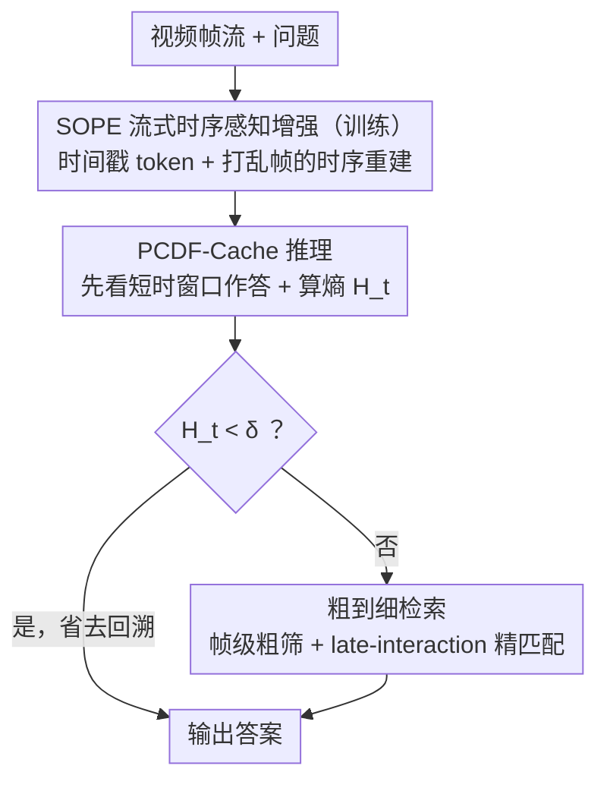

# WeaveTime: Stream from Earlier Frames into Emergent Memory in VideoLLMs

**会议**: CVPR 2026  
**arXiv**: [2602.22142](https://arxiv.org/abs/2602.22142)  
**代码**: 无（即将开源）  
**领域**: 多模态 / 流式视频理解  
**关键词**: Video-LLM, streaming VQA, temporal order, memory cache, uncertainty-gated retrieval

## 一句话总结

诊断了当前 Video-LLM 存在的"时间不可知"（Time-Agnosticism）问题，提出 WeaveTime 框架，通过训练时的时序重建辅助任务（SOPE）赋予模型时序感知能力，推理时用不确定性门控的粗到细记忆缓存（PCDF-Cache）实现高效自适应记忆检索，在流式视频 QA 上取得显著提升。

## 研究背景与动机

**领域现状**：现代视觉理解系统越来越多地部署在帧序列实时到达的流式场景中（自动驾驶、人机交互、实时监控等）。基于 Video-LLM 的方法（如 LLaVA-Video、Qwen2-VL）在离线设置中表现优异，但在流式场景下面临根本性挑战。

**现有痛点**：
1. 当前 Video-LLM 存在 **Time-Agnosticism** 问题：将视频当作无序证据袋而非因果有序序列处理。实验表明打乱视频帧顺序对模型精度几乎无影响，甚至在某些时序任务上反而提升（人类表现则急剧下降）
2. 现有流式方法（如 StreamBridge、VideoLLM-Online）要么需要大量专用流式数据集和高成本训练，要么依赖定制化记忆机制但效果不佳
3. 压缩式记忆（选择/合并/丢弃视觉特征）会丢失信息；检索式记忆虽保留信息但存在不必要的长程重载和时序焦点丧失

**核心矛盾**：Video-LLM 缺乏真正的时序理解能力，且现有流式增强方法在"时序感知"和"高效记忆"之间无法兼顾。

**本文目标**：Time-Agnosticism 导致的两个耦合问题——**时序顺序歧义**（Temporal Order Ambiguity）和**过去-当前焦点盲区**（Past-Current Focus Blindness）。

**切入角度**：先教时序（训练时），再用时序（推理时）—— "first teach order, then use order"。

**核心 idea**：通过轻量级时序重建辅助任务让模型学会感知帧序，再用不确定性驱动的粗到细检索实现按需回溯。

## 方法详解

### 整体框架

WeaveTime 针对的是 Video-LLM 的「时间不可知」（Time-Agnosticism）——模型把视频当成无序证据袋，打乱帧序几乎不影响精度。它是一个即插即用、与具体 Video-LLM 无关的流式 QA 框架，遵循「先教时序，再用时序」的思路：训练阶段用流式时序感知增强（SOPE）通过一个时序重建辅助任务把「帧是有先后的」教进模型；推理阶段用过去-当前动态焦点缓存（PCDF-Cache）做不确定性门控 + 粗到细检索，让模型按需回溯历史而不是无脑重载。

### 关键设计

**1. Time-Agnosticism 诊断：先证明模型确实没在用时序**

动机来自一组对照实验：把视频帧打乱后，模型精度几乎不变，甚至在时序感知、动作识别等任务上反而上升；而人类在无时间戳的乱序视频上时序/动作精度直接崩塌（从 1.0 掉到 0.0–0.2），给回时间戳才恢复。热力图进一步显示模型有时序位置偏差——短视频盯首尾、长视频偏开头。这组诊断说明 Video-LLM 靠的是时空捷径和位置偏差，而非真正的因果推理，也就指明了后续「补时序」的方向。

**2. 流式时序感知增强（SOPE）：用时序重建逼模型先理顺帧序再答题**

既然模型不会用时序，就设计 Temporal Reconstruction（TR）辅助任务硬教它。对 patch 化的视频 token 序列 $\mathbf{X} = [\tilde{\mathbf{v}}_{1,1}, \ldots, \tilde{\mathbf{v}}_{1,N_f}, \tilde{\mathbf{v}}_{2,1}, \ldots]$，在每帧前插入时间戳 token $\mathbf{ts}_i$ 再打乱帧内容，并在原 QA prompt 前追加“这些片段被打乱了，请先列出每段真实时间范围”。这样把时序预测变成纯 next-token prediction，借 LLM 自身的文本重排能力完成，不加任何额外模块或损失。它把记忆从「无序缓存」升级成「有序状态链」，让推理时的检索能定位事件发生的时间而非只看内容；代价极小——只用 30k 条来自 LLaVA-Video-178K 的离线 IT 数据、LoRA 训练 1 个 epoch、8 GPU。

**3. 过去-当前动态焦点缓存（PCDF-Cache）：先看当下，不确定才回忆**

时序教会了，还要解决「何时该回溯、回溯多少」。PCDF-Cache 走“Look Now, Recall if Needed”：查询 $q$ 在时刻 $t$ 到达时，模型先只用短时窗口 $\mathcal{M}_{t-1}[-C:]$ 给出答案 $a_t^{(0)}$ 并算其预测熵 $H_t = \text{Entropy}(a_t^{(0)})$；若 $H_t < \delta$ 就直接采用、省去回溯，若 $H_t \geq \delta$ 才触发粗到细检索。检索分两层：先用帧级余弦相似度 $\text{Sim}(f_i^v, f^q)$ 粗筛出 $\mathcal{M}_{\text{coarse}}$，再用 late-interaction 的 max-sim 精匹配 $\text{maxSim}(\{f_{i,k}^v\}, \{f_j^q\}) = \sum_{j=1}^{N_q}\max_{1\leq k\leq N_i}\langle f_j^q, f_{i,k}^v \rangle$，最终取 top-$K$ 帧（最多 64 帧）。这样只付帧级计算成本却拿到接近 token 级的精度，也避免了全 token 检索直接 OOM。

### 损失函数 / 训练策略

- 训练用标准 next-token prediction 语言建模损失，TR 辅助任务与原 QA 合并成单轮对话
- 随机采样 30k 条离线视频 IT 数据，LoRA 微调（lr=$1\times10^{-5}$），1 个 epoch
- 推理时 entropy 阈值 $\delta=0.6$（消融确定的最优值）；基于 ReKV 实现，最大召回帧数 64

## 实验关键数据

### 主实验

基于 LLaVA-OV-7B 的流式 Multi-Turn 评估：

| 方法 | OVO-Bench Overall | Streaming-Bench Real-Time |
|------|-------------------|--------------------------|
| LLaVA-OV-7B + StreamBridge | 61.72 | 68.39 |
| LLaVA-OV-7B + ReKV | 61.72 | 66.15 |
| LLaVA-OV-7B + **WeaveTime** | **68.82** (+7.10) | **72.13** (+3.74) |

基于 Qwen2-VL-7B 的评估：

| 方法 | OVO-Bench Overall | Streaming-Bench Real-Time |
|------|-------------------|--------------------------|
| Qwen2-VL-7B + StreamBridge | 63.35 | 72.01 |
| Qwen2-VL-7B + ReKV | 59.72 | 70.07 |
| Qwen2-VL-7B + **WeaveTime** | **66.28** | **75.39** |

时序敏感子任务提升尤为显著：ACP +7.56%，EU +9.04%，ACR +11.09%。

### 消融实验

| SOPE w/ TP | SOPE w/ TR | PCDF-Cache | OVO-Bench | Δ | Streaming-Bench | Δ |
|:---:|:---:|:---:|---:|---:|---:|---:|
| | | | 53.56 | — | 66.15 | — |
| ✔ | | | 49.88 | -3.68 | 65.91 | -0.54 |
| ✔ | ✔ | | 55.70 | +5.82 | 68.49 | +2.58 |
| ✔ | ✔ | ✔ | **57.57** | +1.87 | **72.13** | +3.64 |

检索策略对比（LLaVA-OV-7B）：

| 方法 | QAEGO4D Recall↑ | QAEGO4D Acc↑ | MLVU Acc↑ | EventHALL Acc↑ |
|------|---:|---:|---:|---:|
| LLaVA-OV | 14.0 | 52.8 | 64.7 | 60.1 |
| + ReKV | 23.9 | 54.3 | 68.5 | 60.6 |
| + C2F (Ours) | **25.2** | **55.2** | **68.9** | **61.4** |
| + Fine-only | OOM | — | — | — |

### 关键发现

1. 直接在小规模离线数据上微调（仅 timestamp prompts，无 TR）反而导致流式性能下降（-3.68%），说明分布不匹配
2. 加入 Temporal Reconstruction 后在相同数据预算下大幅提升（+5.82%），证明 SOPE 的有效性
3. Entropy 阈值 $\delta$ 的最优值为 0.6：过低导致频繁召回引入干扰，过高导致时序根据不足
4. 仅用 30k 离线数据 + 8 GPU 即可达到 StreamForest 使用 121k 流式数据 + 32 GPU 的效果，数据和计算效率极高
5. Fine-only 全 token 级检索直接 OOM，验证了 C2F 策略的必要性

## 亮点与洞察

1. **Time-Agnosticism 的诊断实验非常有说服力**——打乱帧序对模型无影响但人类崩溃，清晰揭示了 Video-LLM 的根本缺陷
2. **"先教时序，再用时序"**的两阶段哲学设计优雅：训练时注入时序感知，推理时利用时序感知指导检索
3. **不确定性门控**的设计很实用：低不确定性就用当前帧回答，高不确定性才回溯历史，避免不必要的计算
4. **数据效率极高**：不需要专用流式数据，仅从通用离线数据中随机采样 30k 条即可

## 局限与展望

1. 仅在 7B 规模模型上验证，未测试更大规模（如 72B）模型的效果
2. Entropy 阈值 $\delta$ 为全局超参数，未考虑任务类型自适应调整
3. 时序重建任务假设帧间有明显的时序线索，对静态场景或缓慢变化的视频可能效果有限
4. PCDF-Cache 的粗到细检索仍需两阶段计算，对极低延迟场景可能是瓶颈
5. 未讨论多轮对话中历史 QA 上下文对当前检索决策的影响

## 相关工作与启发

- **StreamBridge**：通过流式训练管线增强 Video-LLM，但需要大量流式数据和计算资源
- **ReKV**：检索式 KV 缓存方法，保留所有视觉记忆但缺乏时序感知
- **StreamForest**：使用聚类和森林结构管理流式记忆，需要 121k 专用数据 + 32 GPU
- **启发**：时序感知可能是所有视频理解任务的基础能力，而非仅流式场景的需求；不确定性驱动的自适应计算分配是一个通用设计模式

## 评分

| 维度 | 评分 |
|------|------|
| 创新性 | ⭐⭐⭐⭐ |
| 实用性 | ⭐⭐⭐⭐⭐ |
| 实验充分度 | ⭐⭐⭐⭐⭐ |
| 写作质量 | ⭐⭐⭐⭐ |
| 综合 | ⭐⭐⭐⭐ |

<!-- RELATED:START -->

## 相关论文

- [\[CVPR 2026\] Interactive Episodic Memory with User Feedback](interactive_episodic_memory_with_user_feedback.md)
- [\[CVPR 2026\] VisMem: Latent Vision Memory Unlocks Potential of Vision-Language Models](vismem_latent_vision_memory_unlocks_potential_of_vision-language_models.md)
- [\[CVPR 2026\] MVLM: Template-Free Tracking via Vision-Language Margin Confidence and Memory-Gated Tracking](mvlm_template-free_tracking_via_vision-language_margin_confidence_and_memory-gat.md)
- [\[ICLR 2026\] Visual Symbolic Mechanisms: Emergent Symbol Processing in Vision Language Models](../../ICLR2026/multimodal_vlm/visual_symbolic_mechanisms_vlm.md)
- [\[CVPR 2026\] Bridging the Modality Gap in Compositional Zero-Shot Learning via Sparse Alignment and Unimodal Memory Bank](bridging_the_modality_gap_in_compositional_zero-shot_learning_via_sparse_alignme.md)

<!-- RELATED:END -->
