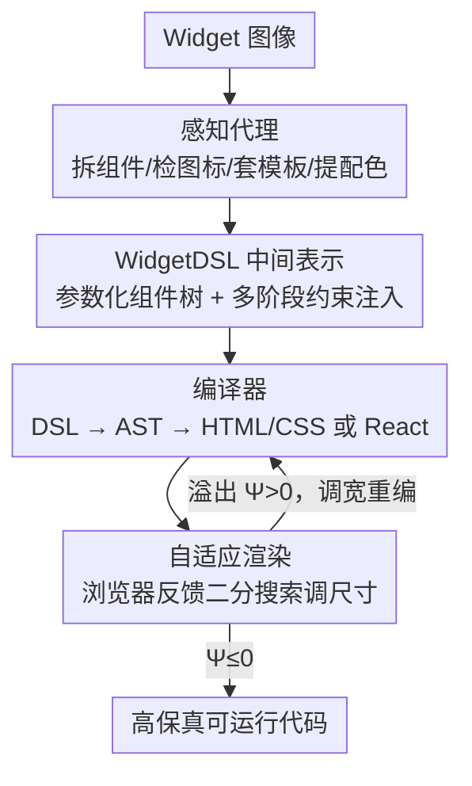

# Widget2Code: From Visual Widgets to UI Code via Multimodal LLMs

**会议**: CVPR 2026  
**arXiv**: [2512.19918](https://arxiv.org/abs/2512.19918)  
**代码**: [https://djanghao.github.io/widget2code](https://djanghao.github.io/widget2code)  
**领域**: 多模态VLM  
**关键词**: UI代码生成, Widget重建, 多模态大模型, 领域特定语言, 视觉感知

## 一句话总结
首次形式化 Widget-to-Code 任务，构建了首个纯图像 widget 数据集和多维评估体系，提出基于感知代理和 WidgetFactory 基础设施的模块化基线，通过组件分解、图标检索、可复用可视化模板和自适应渲染实现高保真 widget 重建。

## 研究背景与动机

1. **领域现状**：UI-to-Code（UI2Code）是自动化前端开发的重要方向，旨在从视觉设计稿生成可执行代码。随着多模态大模型（MLLM）的进步，该领域已从规则/监督管线转向 MLLM 驱动。现有工作主要聚焦于网页和移动端 UI，这些界面有丰富的层级上下文和可用的标注数据。

2. **现有痛点**：Widget（小组件，如天气卡片、日历组件等）是一类独特的微界面——它们紧凑、无上下文、在严格空间约束下通过密集排版和图标传达信息。然而 widget 设计是私有的，缺乏公开的源码或标注数据，也没有 (image, code) 配对数据集。现有 UI2Code 方法针对网页/移动端优化，直接迁移到 widget 效果很差。

3. **核心矛盾**：Widget 的视觉复杂度很高（包含图标、数据可视化、艺术化配色），但空间极度紧凑，且没有可用的训练监督。通用 MLLM 虽然比专用 UI2Code 方法表现更好，但仍然会产生视觉不一致、结构不可靠的代码——内容溢出、尺寸失配、颜色偏差等问题普遍存在。

4. **本文目标** (a) 形式化 Widget2Code 任务并建立评估标准；(b) 弥合像素级感知与几何感知代码生成之间的差距；(c) 建立一个统一的基线框架和基础设施。

5. **切入角度**：感知层面——遵循 Apple widget 设计原则将 widget 分解为原子组件；系统层面——设计 widget 专用 DSL 和编译器替代直接生成冗长代码。

6. **核心 idea**：通过感知代理的组件分解 + WidgetFactory 的 DSL 中间表示，将 widget 重建从端到端 MLLM 代码生成转变为结构化、可控的管线。

## 方法详解

### 整体框架
这篇论文要解决的是把一张 widget（天气卡片、日历组件这类紧凑微界面）的纯图像还原成高保真、可运行的前端代码，而 widget 既没有公开源码也没有标注，直接喂给 MLLM 端到端生成又总出错。它的破题思路是「先看懂、再翻译」：输入图像先由**感知代理**拆成一堆原子组件并把图标、配色、布局这些线索单独抽干净，再交给 **WidgetFactory** 把这些线索写成一份叫 WidgetDSL 的中间表示，由编译器确定性地编出 HTML/CSS 或 React 代码，最后用浏览器渲染反馈反复微调尺寸直到不溢出。配套还从 Figma、Dribbble 等平台收集图像做了首个纯图像 widget benchmark。整条链路把「端到端生成代码」换成了「感知 → 结构化中间表示 → 编译 → 渲染校正」的可控管线。

### 关键设计

**1. 感知代理：不让 MLLM 一口气画完，而是把 widget 拆成原子组件分头处理**

直接让 MLLM 看图写代码，图标会画错、图表数据会编、配色会偏——因为它得同时管太多细节。感知代理把这件事拆成四个各管一摊的子模块。**组件提取**先用 MLLM 检测并分类视觉组件（图标、按钮、文本、图表等），每个组件记成 $e=[r, b, t, c]$，即裁剪区域、边界框、文本描述和类别。**图标检索**不让 MLLM 凭空生成图标，而是建了一个 50k 规模的 SVG 图标库，用 SigLIP 抽视觉和文本嵌入，先按视觉相似度粗筛 Top-50，再用文本相似度重排取 Top-5，从根上避开了 MLLM 生成图标时的语义幻觉。**可复用组件模板**预先定义了一批 DSL 格式的模板，MLLM 只需把检测到的组件对上模板再填参数，省去从零描述结构。**颜色提取**把图像转到感知均匀颜色空间，用 K-means 聚类出主色调及其比例 $\mathcal{P} = \{(\mu_k, w_k)\}_{k=1}^K$。每个子模块都挑了最适合自己那一摊的方法，整体感知准确度因此比端到端高出一截。

**2. WidgetDSL：用一份紧凑的参数化组件树当中间表示，而不是直接吐冗长代码**

MLLM 直接生成 HTML/CSS/JS 又长又难控，结构经常不可靠。WidgetDSL 把 widget 编码成一棵参数化的组件树，每个节点对应一个功能单元（图标、图表、文本块），节点属性指定几何、颜色和样式。生成 DSL 时采用多阶段约束注入，在基础 prompt 上逐步加码：先注入 (1) 布局边界框约束，再叠 (2) 颜色调色板、(3) 组件规格（专门防图表数据被编造）、(4) 图标候选集，最后是 (5) 动态推断的组件类型——每一层约束都把生成空间收窄一点。拿到 DSL 后，编译器走两阶段管线 DSL → AST → 目标代码确定性地翻译，既能编出 HTML/CSS 也能编出 React。中间表示这一层让简洁性和表达力两头都顾上了，幻觉和冗余都被压住，还顺带支持跨平台编译，思路上很像编译器设计里的 IR。

**3. 自适应渲染：用浏览器自己的布局反馈做二分搜索，把尺寸调到刚好不溢出**

现有方法几乎都忽略了渲染这一步，代码编出来就直接渲染，结果宽高比被扭曲、尺寸对不上、内容溢出框外——widget 空间本就极度紧凑，这些问题尤其致命。自适应渲染把它当成一个闭环优化：记输入 widget 宽高比 $r = w/h$，对宽度 $w$ 做反馈引导的二分搜索，目标是让违规函数 $\Psi(w) \leq 0$。

$$\Psi(w) = \text{aggregate}(\text{内容是否超出视口},\ \text{子元素是否越界})$$

$\Psi(w)$ 聚合的就是浏览器渲染引擎实际报回来的布局反馈。每渲染一遍报一次 $\Psi(w_t)$，据此调整宽度再渲染，直到收敛到 $|\Psi(w_t)| < \epsilon$（约一个像素的容差）。这一步靠真实渲染结果而非模型猜测来收尾，简单却补上了别人都漏掉的关键环节。

### 一个完整示例
拿一张天气 widget 走一遍：感知代理先把它拆成天气图标、温度大字、温区折线图、城市名标签等原子组件，每个记成 $[r,b,t,c]$；其中天气图标不交给 MLLM 画，而是去 50k 图标库里按视觉相似度粗筛 Top-50、再按文本相似度（"sun/cloud"）重排取 Top-5 备选；颜色提取在感知均匀空间里 K-means 出几组主色及其占比。这些线索喂给 WidgetFactory 后生成 WidgetDSL——一棵组件树，注入约束时先框死各组件边界框，再叠上调色板、折线图数据规格、图标候选集，逐层收窄。编译器把 DSL 翻成 HTML/CSS。最后自适应渲染上场：按原图宽高比 $r$ 二分搜索宽度，第一遍渲染发现温度大字溢出（$\Psi>0$），收窄宽度再渲染，几轮后 $\Psi$ 落进一个像素容差内收敛，得到既不溢出又保持紧凑比例的最终 widget。

### 评估指标设计
基于 Apple 人机交互指南设计了五维细粒度评估：
- **Layout**（布局）：边距对称性、内容宽高比相似度、面积比相似度
- **Legibility**（可读性）：文本 Jaccard、对比度相似度、局部对比度相似度
- **Style**（风格）：调色板距离、鲜艳度一致性、极性一致性
- **Perceptual**（感知）：SSIM、LPIPS、CLIP Score
- **Geometry**（几何）：宽高比和归一化尺寸对比

## 实验关键数据

### 主实验

| 方法 | Layout-Margin | Layout-Content | Layout-Area | Text | Palette | SSIM | Geometry |
|------|-------------|---------------|------------|------|---------|------|----------|
| GPT-4o | 63.48 | 59.04 | 64.41 | 60.20 | 47.03 | 0.698 | 91.93 |
| Gemini2.5-Pro | 65.35 | 62.74 | 79.66 | 59.48 | 48.99 | 0.701 | 90.25 |
| Qwen3-VL | 64.75 | 60.15 | 69.53 | 61.17 | 47.44 | 0.703 | 95.15 |
| Design2Code | 36.34 | 47.81 | 49.68 | 17.50 | 30.92 | 0.512 | 15.72 |
| DCGen | 43.17 | 40.14 | 64.55 | 50.36 | 35.56 | 0.598 | 31.59 |
| **Widget2Code (Ours)** | **72.15** | **66.08** | **82.24** | **70.60** | **58.09** | **0.721** | **100.00** |

### 消融实验

| 配置 | Margin | Content | Area | Text | Palette | SSIM | Geometry |
|------|--------|---------|------|------|---------|------|----------|
| Qwen3-VL baseline | 64.75 | 60.15 | 69.53 | 61.17 | 47.44 | 0.703 | 95.15 |
| + WidgetFactory | 69.97 | 64.60 | 82.46 | 67.99 | 42.36 | 0.683 | 100 |
| + Components | 70.83 | 64.90 | 82.30 | 67.49 | 42.61 | 0.676 | 100 |
| + Color analysis | 71.29 | 65.43 | 83.03 | 68.62 | 57.56 | 0.705 | 100 |
| + Layout | 71.49 | 65.33 | 81.92 | 68.89 | 56.10 | 0.710 | 100 |
| + Icon (Full) | 72.15 | 66.08 | 82.24 | 70.60 | 58.09 | 0.721 | 100 |

### 关键发现
- 专用 UI2Code 模型（Design2Code、DCGen 等）在 widget 上表现远不如通用 MLLM，说明 widget 需要专门设计
- WidgetFactory 对 Geometry 的贡献最大——从 95.15 直接提升到 100，完美还原 widget 尺寸
- Color analysis 模块对 Palette 指标贡献最大（42.61 → 57.56，+35%），说明 MLLM 在颜色还原方面存在明显不足
- Icon retrieval 对 Text 和 SSIM 有显著帮助，说明准确的图标是视觉保真度的关键

## 亮点与洞察
- 首次定义 Widget2Code 任务是一个重要的贡献——widget 微界面确实与网页/移动端 UI 有本质区别（紧凑、无上下文、图标密集），值得作为独立任务研究
- 图标检索替代直接生成的策略非常实用且有效——MLLM 在生成精细图标方面确实不可靠，检索方式既准确又可控
- WidgetDSL 作为中间表示连接感知理解和代码生成，类似于编译器设计中的 IR，这种模式可以迁移到其他复杂的代码生成任务
- 自适应渲染的浏览器反馈闭环优化是一个简单但被普遍忽视的关键步骤

## 局限与展望
- 数据集规模适中（2825 个 widget，1000 个测试），虽然与同类 benchmark 可比，但更大规模可能揭示更多问题
- 目前聚焦静态 widget，未涉及交互式或动态 widget 行为
- 依赖 Qwen3-VL API 作为基础模型，成本和延迟可能是实际部署的瓶颈
- 评估指标虽然细粒度，但缺乏功能正确性评估（生成的代码是否真的可交互）
- 可以考虑用 WidgetFactory 作为数据引擎合成 (image, code) 训练对，做端到端微调

## 相关工作与启发
- **vs Design2Code**: Design2Code 针对整页网站设计，widget 的紧凑性使其失效。Widget2Code 的组件分解策略更适合密集布局
- **vs DCGen**: DCGen 用分而治之 prompting 处理网页，但 widget 缺乏可分割的层级结构。WidgetDSL 提供了更适合的结构化表示
- **vs GPT-4o / Gemini**: 通用 MLLM 有更好的视觉理解能力，但生成的代码冗余且不可控。Widget2Code 通过 DSL 约束和模块化感知将其优势放大

## 评分
- 新颖性: ⭐⭐⭐⭐ 首次形式化 Widget2Code 任务，提出专用评估体系和 DSL
- 实验充分度: ⭐⭐⭐⭐ 对比全面（通用 MLLM + 专用 UI2Code），消融清晰，但数据集偏小
- 写作质量: ⭐⭐⭐⭐ 动机清楚，系统设计描述详细
- 价值: ⭐⭐⭐⭐ 开辟新任务方向，提供完整的 benchmark + baseline + 基础设施

<!-- RELATED:START -->

## 相关论文

- [\[CVPR 2026\] CodePercept: Code-Grounded Visual STEM Perception for MLLMs](codepercept_code-grounded_visual_stem_perception_for_mllms.md)
- [\[CVPR 2026\] UI-Lens: Assessing General MLLMs' Potential to Automate UI Display Quality Assurance](ui-lens_assessing_general_mllms_potential_to_automate_ui_display_quality_assuran.md)
- [\[ACL 2025\] Aria-UI: Visual Grounding for GUI Instructions](../../ACL2025/multimodal_vlm/aria-ui_visual_grounding_for_gui_instructions.md)
- [\[CVPR 2026\] MERLIN: Building Low-SNR Robust Multimodal LLMs for Electromagnetic Signals](merlin_building_low-snr_robust_multimodal_llms_for_electromagnetic_signals.md)
- [\[CVPR 2026\] FAVE: A Structured Benchmark for Fine-Grained Audio-Visual Temporal Evaluation in Multimodal LLMs](fave_a_structured_benchmark_for_fine-grained_audio-visual_temporal_evaluation_in.md)

<!-- RELATED:END -->
