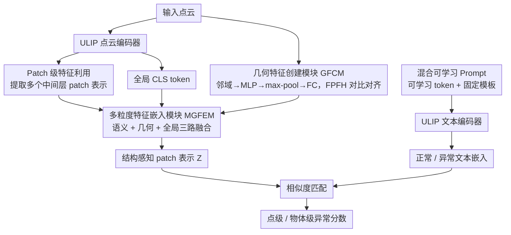

# Back to Point: Exploring Point-Language Models for Zero-Shot 3D Anomaly Detection

**会议**: CVPR 2026  
**arXiv**: [2603.21511](https://arxiv.org/abs/2603.21511)  
**代码**: [https://github.com/wistful-8029/BTP-3DAD](https://github.com/wistful-8029/BTP-3DAD)  
**领域**:目标检测  
**关键词**: Zero-Shot 3D Anomaly Detection, Point-Language Model, ULIP, Multi-Granularity, Geometric Feature

## 一句话总结
BTP 首次将预训练的点-语言模型（PLM，如 ULIP）应用于零样本 3D 异常检测，提出多粒度特征嵌入模块（MGFEM）融合 patch 级语义、几何描述子和全局 CLS token，配合联合表示学习策略，在 Real3D-AD 点级 AUROC 达到 84.5%，大幅超越观 VLM 渲染方案的 PointAD（73.5%）。

## 研究背景与动机

**领域现状**：3D 异常检测在工业质量检测中至关重要。零样本（ZS）方法因无需目标类别训练数据而极具吸引力，但目前该领域仍处于起步阶段。

**现有 VLM 方案的局限**：
   - 主流方法（PointAD, MVP）将 3D 点云渲染为多视角 2D 图像，然后用 CLIP 等 VLM 检测异常
   - **根本问题**：渲染过程**丢失几何细节**，对局部结构异常不敏感
   - 性能严重依赖渲染视角的数量和角度，存在视角选择偏差
   - 重复的投影-反投影过程引入计算开销

**PLM 的机遇**：ULIP 等点-语言模型直接编码 3D 点云，保留了内在的几何和结构属性。我们能否**直接在 3D 空间中进行异常检测**，而非绕道 2D？

**核心挑战**：ULIP 原始设计用于点云分类（全局嵌入），不适合细粒度异常**定位**——需要 patch 级特征和几何感知能力。

**核心 idea**："回到点"——直接在点云上进行异常检测，通过多粒度特征和几何描述子增强 PLM 对局部异常的感知。

## 方法详解

### 整体框架

BTP 想回答的是「3D 异常检测要不要绕道 2D」——主流方案把点云渲染成多视角图再喂 CLIP，渲染会丢几何细节、还受视角选择影响。BTP 直接在点云上做：输入点云先经 ULIP 编码器抽语义特征（含挖出的多层 patch 特征与全局 CLS token）、经 GFCM 抽几何描述，再由 MGFEM 把多粒度特征融成结构感知的 patch 表示；文本侧用混合可学习 Prompt 经 ULIP 编码出「正常/异常」嵌入，最后两路比相似度得到异常分数。难点在于 ULIP 本是为分类设计的全局嵌入，不适合细粒度定位，所以下面几个设计都围绕「把全局 PLM 改造得能感知局部异常」。

### 关键设计

**1. Patch 级特征利用：把 ULIP 的中间层挖出来补局部感知**

ULIP 默认只输出最终层的全局 embedding，定位局部异常时太粗。BTP 额外提取多个中间层的 patch 级表示——不同层捕获不同抽象级别的几何与语义信息，把这些 patch 表示组合起来，模型对局部结构变化的敏感度明显提升，这是把分类用的 PLM 拉向定位任务的第一步。

**2. 几何特征创建模块 GFCM：用可学习网络替 FPFH，又向它对齐**

FPFH 这类经典几何描述子能很好刻画局部几何关系，但作为手工特征没法端到端优化。GFCM 用 PointNet 风格的可学习网络顶替它：对每个 patch 的邻域点过共享 MLP，再 max-pooling 聚合成 patch 级几何描述子，最后 FC 投到与文本嵌入对齐的维度，即 $\mathbf{f}_i = \phi\left(\max_{j=1,\ldots,M}\text{MLP}(\mathbf{p}_{ij})\right)$。同时用一项与 FPFH 的对比损失把几何先验显式注入，既保住手工特征的物理直觉，又拿到了可学习的灵活性。

**3. 多粒度特征嵌入模块 MGFEM：语义+几何+全局三路融合**

单靠哪一路都不够，MGFEM 把三种信息拼到一起：多层中间语义特征 $\{\mathbf{H}^{(l)}\}_{l=1}^L$（按可学习权重加权求和）、GFCM 的几何特征 $\mathbf{F}_{geo}$、以及全局 CLS token $\mathbf{h}_{CLS}$。三者各自投到统一空间后拼接，$\mathbf{Z} = \phi_f\left([\sum_l \alpha_l \mathbf{S}^{(l)} \,\|\, \mathbf{G} \,\|\, \mathbf{C}]\right)$，得到结构感知的 patch 表示 $\mathbf{Z}\in\mathbb{R}^{N\times D}$，让语义、几何、全局三种线索互补。

**4. 混合可学习 Prompt：少量可学习 token 配固定模板**

文本侧把少量可学习上下文 token 和固定模板（“normal object” / “defective object”）结合，经 ULIP 编码出正常/异常两个文本嵌入，再与点云特征算相似度得到异常分数——既保留模板的语义锚点，又留出可学习的适配空间。

### 损失函数 / 训练策略

联合表示学习，三级监督互补：
$$\mathcal{L} = \mathcal{L}_{local} + \lambda_1 \mathcal{L}_{global} + \lambda_2 \mathcal{L}_{geo}$$

- $\mathcal{L}_{local}$ = Focal Loss + Dice Loss：点级监督，缓解正负样本失衡
- $\mathcal{L}_{global}$ = BCE：全局物体级判别（融合点级与 patch 级预测）
- $\mathcal{L}_{geo}$ = 对比损失（InfoNCE）：让几何特征与 FPFH 对齐
- $\lambda_1 = 0.5,\ \lambda_2 = 0.1$；用辅助点云数据训练 GFCM 和 MGFEM，零样本推理时无需目标类别数据

## 实验关键数据

### 主实验（Real3D-AD，零样本）

| 方法 | 类型 | Object AUROC↑ | Point AUROC↑ |
|------|------|---------------|--------------|
| CPMF | 非 ZS | 58.6 | 75.9 |
| PatchCore-FPFH | 非 ZS | 53.1 | 62.5 |
| PointCLIPV2 | ZS-VLM | 53.1 | 52.9 |
| AnomalyCLIP | ZS-VLM | 55.2 | 50.3 |
| PointAD | ZS-VLM | 74.8 | 73.5 |
| **BTP (Ours)** | **ZS-PLM** | 61.4 | **84.5** |

### 消融实验（根据 MGFEM 各组件的贡献推断）

| 配置 | 关键指标 | 说明 |
|------|---------|------|
| 仅全局 ULIP embedding | 较低点级 AUROC | 原始 ULIP 不适合细粒度定位 |
| + Patch 级特征 | 点级 AUROC 提升 | 中间层特征增加局部感知 |
| + GFCM | 进一步提升 | 可学习几何描述子增强结构感知 |
| + 联合学习（完整 BTP） | **84.5% 点级 AUROC** | 三级监督互补，最优 |

### 关键发现
- **点级异常定位**：BTP 的 84.5% 大幅超越 PointAD 的 73.5%（+11.0%），证实了直接在 3D 空间检测的优势
- **物体级检测**：BTP 的 61.4% 低于 PointAD 的 74.8%，说明全局判别方面还有提升空间
- 在 diamond（97.9%）、car（91.6%）、duck（90.9%）等类别上点级 AUROC 极高
- 直接在 3D 工作避免了 VLM 方案的视角选择偏差问题

## 亮点与洞察
- **"回到点"（Back to Point）**的呼吁很有意义——当 3D 数据本身可用时，不必绕道 2D
- 多粒度融合策略（语义+几何+全局）互补性强，联合学习比单独使用任何一种都好
- GFCM 用可学习网络替代 FPFH 并与之对齐的设计——既保留手工特征的物理直觉，又获得端到端优化能力
- 零样本设定下的强性能说明 PLM 学到了可迁移的 3D 结构先验

## 局限与展望
- 物体级 AUROC（61.4%）明显弱于 PointAD（74.8%），全局判别能力不足
- ULIP 编码器是固定的，如果解冻并微调可能进一步提升
- 目前训练仍需辅助点云数据（虽然不需要目标类别数据），离"真正零样本"有距离
- 在更多工业缺陷类型（如微小裂纹、色差）上的泛化有待验证

## 相关工作与启发
- PointAD 是最直接的竞品（VLM 渲染方案），BTP 在定位上大幅领先
- PLANE 虽然也用 PLM，但需要目标类别数据做类别特定适配——BTP 更纯净
- ULIP → ULIP2 → 可能进一步提升 PLM 的 3D 理解能力
- 多粒度融合策略可推广到 3D 语义分割、点云配准等任务

## 评分
- 新颖性: ⭐⭐⭐⭐ 首次将 PLM 用于 ZS 3D 异常检测，开辟新路线
- 实验充分度: ⭐⭐⭐⭐ 两个数据集 + 全面指标，但消融实验细节不够量化
- 写作质量: ⭐⭐⭐⭐ 动机充分，"VLM vs PLM"的对比框架清晰
- 价值: ⭐⭐⭐⭐ 对工业 3D 检测有实用价值，PLM 路线有潜力

<!-- RELATED:START -->

## 相关论文

- [\[CVPR 2026\] VisualAD: Language-Free Zero-Shot Anomaly Detection via Vision Transformer](visualad_language-free_zero-shot_anomaly_detection_via_vision_transformer.md)
- [\[CVPR 2026\] AnomalyVFM -- Transforming Vision Foundation Models into Zero-Shot Anomaly Detectors](anomalyvfm_--_transforming_vision_foundation_models_into_zero-shot_anomaly_detec.md)
- [\[CVPR 2026\] Detect Anything via Next Point Prediction](detect_anything_via_next_point_prediction.md)
- [\[CVPR 2025\] PO3AD: Predicting Point Offsets toward Better 3D Point Cloud Anomaly Detection](../../CVPR2025/object_detection/po3ad_predicting_point_offsets_toward_better_3d_point_cloud_anomaly_detection.md)
- [\[CVPR 2026\] GS-CLIP: Zero-shot 3D Anomaly Detection by Geometry-Aware Prompt and Synergistic View Representation Learning](gs-clip_zero-shot_3d_anomaly_detection_by_geometry-aware_prompt_and_synergistic_.md)

<!-- RELATED:END -->
